# Preface {-}


<hr style="background-color:#3C6690;height:2px">

<center></center>

<br> Chair of Econometrics  <br> Department of Business Administration and Economics <br> University of Duisburg-Essen <br> Essen, Germany <br> <a href=\"mailto:info@econometrics-with-r.org?subject=Econometrics%20with%20R\">info@econometrics-with-r.org</a> <br><br> Last updated on Saturday, May 06, 2023
<br>
<br>
<iframe src="https://www.facebook.com/plugins/like.php?href=https%3A%2F%2Fwww.facebook.com%2FEconometricsWithR%2F&width=450&layout=standard&action=like&size=small&show_faces=true&share=true&height=80&appId" width="400" height="70" style="border:none;overflow:hidden" scrolling="no" frameborder="0" allowTransparency="true" allow="encrypted-media" align="left"></iframe>
<br>
<br>
<br>

<hr style="background-color:#3C6690;height:2px">

Over the last few years, the statistical programming language R has become an integral part of the curricula of econometrics classes we teach at the University of Duisburg-Essen. We regularly found that a large share of the students, especially in our introductory undergraduate econometrics courses, had not been exposed to any programming language before and thus had difficulty to engage with learning R on their own. With little background in statistics and econometrics, beginners naturally have a hard time understanding the benefits of having R skills for learning and applying econometrics. These particularly include the ability to conduct, document and communicate empirical studies and having the ability to program simulation studies which is helpful for, e.g., comprehending and validating theorems which usually are not easily grasped by mere brooding over formulas. Being applied economists and econometricians, we value and wish to share with our students all of these capabilities.

Instead of confronting students with pure coding exercises and complementary classic literature like the book by @venables2010, we figured it would be better to provide interactive learning material that blends R code with the contents of the well-received textbook *Introduction to Econometrics* by @stock2015 which serves as a basis for the lecture. This material is gathered in the present book *Introduction to Econometrics with R*, an empirical companion to @stock2015. It is an interactive script in the style of a reproducible research report and not only enables students to learn how results of case studies can be replicated with R but also strengthens their ability in using the newly acquired skills in other empirical applications.

#### Conventions Used in this Book {-}

+ *Italic* text indicates new terms, names, buttons and the like.

+ <tt>Monospaced font</tt> is generally used in paragraphs to refer to <tt>R</tt> code. This includes commands, variables, functions, data types, databases, and file names. 

+ `Monospaced font on gray background` indicates <tt>R</tt> code that can be typed literally by you. It may appear in paragraphs for better distinguishability among executable and non-executable code statements but it will mostly be encountered in shape of large blocks of <tt>R</tt> code. These blocks are referred to as *code chunks*. 

#### Acknowledgement {-}

We thank the *Stifterverband für die Deutsche Wissenschaft e.V.* and the *Ministry of Culture and Science of North Rhine-Westphalia* for their financial support. Also, we are grateful to Alexander Blasberg for proofreading and his effort in helping with programming the exercises.
A special thanks goes to Achim Zeileis (University of Innsbruck) and Christian Kleiber (University of Basel) for their advice and constructive criticism. Another thanks goes to Rebecca Arnold from the Münster University of Applied Sciences for several suggestions regarding the website design and for providing us with her nice designs for the book cover, logos and icons. We are also indebted to all past students of our introductory econometrics courses at the University of Duisburg-Essen for their feedback.

<br>


This book is licensed under the [Creative Commons Attribution-NonCommercial-ShareAlike 4.0 International License](http://creativecommons.org/licenses/by-nc-sa/4.0/).

# Introduction

<hr style="background-color:#3C6690;height:2px">

The interest in the freely available statistical programming language and software environment <tt>R</tt> [@R-base] is soaring. By the time we wrote first drafts for this project, more than 11000 add-ons (many of them providing cutting-edge methods) were made available on the Comprehensive <tt>R</tt> Archive Network ([CRAN](https://cran.r-project.org/)), an extensive network of FTP servers around the world that store identical and up-to-date versions of <tt>R</tt> code and its documentation. <tt>R</tt> dominates other (commercial) software for statistical computing in most fields of research in applied statistics. The benefits of it being freely available, open source and having a large and constantly growing community of users that contribute to CRAN render <tt>R</tt> more and more appealing for empirical economists and econometricians alike. 

A striking advantage of using <tt>R</tt> in econometrics is that it enables students to explicitly document their analysis step-by-step such that it is easy to update and to expand. This allows to re-use code for similar applications with different data. Furthermore, <tt>R</tt> programs are fully reproducible, which makes it straightforward for others to comprehend and validate results. 

Over the recent years, <tt>R</tt> has thus become an integral part of the curricula of econometrics classes we teach at the University of Duisburg-Essen. In some sense, learning to code is comparable to learning a foreign language and continuous practice is essential for the learning success. Needless to say, presenting bare <tt>R</tt> code on slides does not encourage the students to engage with hands-on experience on their own. This is why <tt>R</tt> is crucial. As for accompanying literature, there are some excellent books that deal with <tt>R</tt> and its applications to econometrics, e.g., @kleiber2008. However, such sources may be somewhat beyond the scope of undergraduate students in economics having little understanding of econometric methods and barely any experience in programming at all. Consequently, we started to compile a collection of reproducible reports for use in class. These reports provide guidance on how to implement selected applications from the textbook *Introduction to Econometrics* [@stock2015] which serves as a basis for the lecture and the accompanying tutorials. This process was facilitated considerably by <tt>knitr</tt> [@R-knitr] and <tt>R markdown</tt> [@R-rmarkdown]. In conjunction, both <tt>R</tt> packages provide powerful functionalities for dynamic report generation which allow to seamlessly combine pure text, LaTeX, <tt>R</tt> code and its output in a variety of formats, including PDF and HTML. Moreover, writing and distributing reproducible reports for use in academia has been enriched tremendously by the <tt>bookdown</tt> package [@R-bookdown] which has become our main tool for this project. <tt>bookdown</tt> builds on top of <tt>R markdown</tt> and allows to create appealing HTML pages like this one, among other things. 
Being inspired by *Using R for Introductory Econometrics* [@heiss2016]^[@heiss2016 builds on the popular *Introductory Econometrics* [@wooldridge2016] and demonstrates how to replicate the applications discussed therein using <tt>R</tt>.] and with this powerful toolkit at hand we wrote up our own empirical companion to @stock2015. The result, which you started to look at, is *Introduction to Econometrics with R*. 

Similarly to the book by @heiss2016, this project is neither a comprehensive econometrics textbook nor is it intended to be a general introduction to <tt>R</tt>. We feel that Stock and Watson do a great job at explaining the intuition and theory of econometrics, and at any rate better than we could in yet another introductory textbook! *Introduction to Econometrics with R* is best described as an interactive script in the style of a reproducible research report which aims to provide students with a platform-independent e-learning arrangement by seamlessly intertwining theoretical core knowledge and empirical skills in undergraduate econometrics. Of course, the focus is on empirical applications with <tt>R</tt>. We leave out derivations and proofs wherever we can. Our goal is to enable students not only to learn how results of case studies can be replicated with <tt>R</tt> but we also intend to strengthen their ability in using the newly acquired skills in other empirical applications --- immediately within *Introduction to Econometrics with R*. 

To realize this, each chapter contains interactive <tt>R</tt> programming exercises. These exercises are used as supplements to code chunks that display how previously discussed techniques can be implemented within <tt>R</tt>. They are generated using the [DataCamp light widget](https://github.com/datacamp/datacamp-light) and are backed by an <tt>R</tt> session which is maintained on [DataCamp](https://www.datacamp.com/home)'s servers. You may play around with the example exercise presented below.

<iframe src="DCL/intro_1.html" frameborder="0" scrolling="no" style="width:100%;height:360px"></iframe>

As you can see above, the widget consists of two tabs. <tt>script.R</tt> mimics an <tt>.R</tt>-file, a file format that is commonly used for storing <tt>R</tt> code. Lines starting with a # are commented out, that is, they are not recognized as code. Furthermore, <tt>script.R</tt> works like an exercise sheet where you may write down the solution you come up with. If you hit the button *Run*, the code will be executed, submission correctness tests are run and you will be notified whether your approach is correct. If it is not correct, you will receive feedback suggesting improvements or hints. The other tab, <tt>R Console</tt>, is a fully functional <tt>R</tt> console that can be used for trying out solutions to exercises before submitting them. Of course you may submit (almost any) <tt>R</tt> code and use the console to play around and explore. Simply type a command and hit the *Enter* key on your keyboard.

Looking at the widget above, you will notice that there is a <tt>></tt> in the right panel (in the console). This symbol is called "prompt" and indicates that the user can enter code that will be executed. To avoid confusion, we will not show this symbol in this book. Output produced by R code is commented out with <tt>#></tt>. 

Most commonly we display R code together with the generated output in code chunks. As an example, consider the following line of code presented in chunk below. It tells <tt>R</tt> to compute the number of packages available on <tt>CRAN</tt>. The code chunk is followed by the output produced.


```r
# check the number of R packages available on CRAN
nrow(available.packages(repos = "http://cran.us.r-project.org"))
#> [1] 19453
```

Each code chunk is equipped with a button on the outer right hand side which copies the code to your clipboard. This makes it convenient to work with larger code segments in your version of <tt>R</tt>/*RStudio* or in the widgets presented throughout the book. In the widget above, you may click on <tt>R Console</tt> and type `nrow(available.packages(repos = "http://cran.us.r-project.org"))` (the command from the code chunk above) and execute it by hitting *Enter* on your keyboard.^[The <tt>R</tt> session is initialized by clicking into the widget. This might take a few seconds. Just wait for the indicator next to the button *Run* to turn green.] 

Note that some lines in the widget are out-commented which ask you to assign a numeric value to a variable and then to print the variable's content to the console. You may enter your solution approach to <tt>script.R</tt> and hit the button *Run* in order to get the feedback described further above. In case you do not know how to solve this sample exercise (don't panic, that is probably why you are reading this), a click on *Hint* will provide you with some advice. If you still can't find a solution, a click on *Solution* will provide you with another tab, <tt>Solution.R</tt> which contains sample solution code. It will often be the case that exercises can be solved in many different ways and <tt>Solution.R</tt> presents what we consider as comprehensible and idiomatic.

## Colophon

This book was built with:


```
#> ─ Session info ────────────────────────────────────────────────────────────────────────────────────
#>  setting  value
#>  version  R version 4.2.3 (2023-03-15)
#>  os       macOS Ventura 13.1
#>  system   aarch64, darwin20
#>  ui       X11
#>  language (EN)
#>  collate  en_US.UTF-8
#>  ctype    en_US.UTF-8
#>  tz       Europe/Berlin
#>  date     2023-05-06
#>  pandoc   2.19.2 @ /Applications/RStudio.app/Contents/Resources/app/quarto/bin/tools/ (via rmarkdown)
#> 
#> ─ Packages ────────────────────────────────────────────────────────────────────────────────────────
#>  package       * version    date (UTC) lib source
#>  abind           1.4-5      2016-07-21 [1] CRAN (R 4.2.0)
#>  AER             1.2-10     2022-06-14 [1] CRAN (R 4.2.0)
#>  askpass         1.1        2019-01-13 [1] CRAN (R 4.2.0)
#>  backports       1.4.1      2021-12-13 [1] CRAN (R 4.2.0)
#>  base64enc       0.1-3      2015-07-28 [1] CRAN (R 4.2.0)
#>  bdsmatrix       1.3-6      2022-06-03 [1] CRAN (R 4.2.0)
#>  bit             4.0.5      2022-11-15 [1] CRAN (R 4.2.0)
#>  bit64           4.0.5      2020-08-30 [1] CRAN (R 4.2.0)
#>  bitops          1.0-7      2021-04-24 [1] CRAN (R 4.2.0)
#>  blob            1.2.4      2023-03-17 [1] CRAN (R 4.2.0)
#>  bookdown        0.33       2023-03-06 [1] CRAN (R 4.2.0)
#>  boot            1.3-28.1   2022-11-22 [1] CRAN (R 4.2.3)
#>  brio            1.1.3      2021-11-30 [1] CRAN (R 4.2.0)
#>  broom           1.0.4      2023-03-11 [1] CRAN (R 4.2.0)
#>  bslib           0.4.2      2022-12-16 [1] CRAN (R 4.2.0)
#>  cachem          1.0.7      2023-02-24 [1] CRAN (R 4.2.0)
#>  callr           3.7.3      2022-11-02 [1] CRAN (R 4.2.0)
#>  car             3.1-2      2023-03-30 [1] CRAN (R 4.2.0)
#>  carData         3.0-5      2022-01-06 [1] CRAN (R 4.2.0)
#>  cellranger      1.1.0      2016-07-27 [1] CRAN (R 4.2.0)
#>  cli             3.6.1      2023-03-23 [1] CRAN (R 4.2.0)
#>  clipr           0.8.0      2022-02-22 [1] CRAN (R 4.2.0)
#>  collapse        1.9.3      2023-02-27 [1] CRAN (R 4.2.0)
#>  colorspace      2.1-0      2023-01-23 [1] CRAN (R 4.2.0)
#>  conflicted      1.2.0      2023-02-01 [1] CRAN (R 4.2.0)
#>  cpp11           0.4.3      2022-10-12 [1] CRAN (R 4.2.0)
#>  crayon          1.5.2      2022-09-29 [1] CRAN (R 4.2.0)
#>  cubature        2.0.4.6    2023-01-23 [1] CRAN (R 4.2.0)
#>  curl            5.0.0      2023-01-12 [1] CRAN (R 4.2.0)
#>  cvar            0.5        2022-11-03 [1] CRAN (R 4.2.0)
#>  data.table      1.14.8     2023-02-17 [1] CRAN (R 4.2.0)
#>  DBI             1.1.3      2022-06-18 [1] CRAN (R 4.2.0)
#>  dbplyr          2.3.2      2023-03-21 [1] CRAN (R 4.2.0)
#>  desc            1.4.2      2022-09-08 [1] CRAN (R 4.2.0)
#>  diffobj         0.3.5      2021-10-05 [1] CRAN (R 4.2.0)
#>  digest          0.6.31     2022-12-11 [1] CRAN (R 4.2.0)
#>  dplyr           1.1.1      2023-03-22 [1] CRAN (R 4.2.0)
#>  dtplyr          1.3.1      2023-03-22 [1] CRAN (R 4.2.0)
#>  dynlm           0.3-6      2019-01-06 [1] CRAN (R 4.2.0)
#>  ellipsis        0.3.2      2021-04-29 [1] CRAN (R 4.2.0)
#>  evaluate        0.20       2023-01-17 [1] CRAN (R 4.2.0)
#>  fansi           1.0.4      2023-01-22 [1] CRAN (R 4.2.0)
#>  farver          2.1.1      2022-07-06 [1] CRAN (R 4.2.0)
#>  fastICA         1.2-3      2021-09-25 [1] CRAN (R 4.2.0)
#>  fastmap         1.1.1      2023-02-24 [1] CRAN (R 4.2.0)
#>  fBasics         4022.94    2023-03-04 [1] CRAN (R 4.2.0)
#>  fGarch          4022.89    2022-11-05 [1] CRAN (R 4.2.0)
#>  fontawesome     0.5.0      2023-01-25 [1] CRAN (R 4.2.0)
#>  forcats         1.0.0      2023-01-29 [1] CRAN (R 4.2.0)
#>  Formula         1.2-5      2023-02-24 [1] CRAN (R 4.2.0)
#>  fs              1.6.1      2023-02-06 [1] CRAN (R 4.2.0)
#>  gargle          1.3.0      2023-01-30 [1] CRAN (R 4.2.0)
#>  gbutils         0.5        2022-05-27 [1] CRAN (R 4.2.0)
#>  generics        0.1.3      2022-07-05 [1] CRAN (R 4.2.0)
#>  ggplot2         3.4.2      2023-04-03 [1] CRAN (R 4.2.0)
#>  glue            1.6.2      2022-02-24 [1] CRAN (R 4.2.0)
#>  googledrive     2.1.0      2023-03-22 [1] CRAN (R 4.2.0)
#>  googlesheets4   1.0.1      2022-08-13 [1] CRAN (R 4.2.0)
#>  gss             2.2-4      2023-03-15 [1] CRAN (R 4.2.0)
#>  gtable          0.3.3      2023-03-21 [1] CRAN (R 4.2.0)
#>  haven           2.5.2      2023-02-28 [1] CRAN (R 4.2.0)
#>  highr           0.10       2022-12-22 [1] CRAN (R 4.2.0)
#>  hms             1.1.3      2023-03-21 [1] CRAN (R 4.2.0)
#>  htmltools       0.5.5      2023-03-23 [1] CRAN (R 4.2.0)
#>  httr            1.4.5      2023-02-24 [1] CRAN (R 4.2.0)
#>  ids             1.0.1      2017-05-31 [1] CRAN (R 4.2.0)
#>  isoband         0.2.7      2022-12-20 [1] CRAN (R 4.2.0)
#>  itewrpkg        0.0.0.9000 2023-03-23 [1] Github (mca91/itewrpkg@eb72ddb)
#>  jquerylib       0.1.4      2021-04-26 [1] CRAN (R 4.2.0)
#>  jsonlite        1.8.4      2022-12-06 [1] CRAN (R 4.2.0)
#>  KernSmooth      2.23-20    2021-05-03 [1] CRAN (R 4.2.3)
#>  knitr           1.42       2023-01-25 [1] CRAN (R 4.2.0)
#>  labeling        0.4.2      2020-10-20 [1] CRAN (R 4.2.0)
#>  lattice         0.20-45    2021-09-22 [1] CRAN (R 4.2.3)
#>  lifecycle       1.0.3      2022-10-07 [1] CRAN (R 4.2.0)
#>  lme4            1.1-32     2023-03-14 [1] CRAN (R 4.2.0)
#>  lmtest          0.9-40     2022-03-21 [1] CRAN (R 4.2.0)
#>  locpol          0.8.0      2022-11-29 [1] CRAN (R 4.2.0)
#>  lubridate       1.9.2      2023-02-10 [1] CRAN (R 4.2.0)
#>  magrittr        2.0.3      2022-03-30 [1] CRAN (R 4.2.0)
#>  MASS            7.3-58.3   2023-03-07 [1] CRAN (R 4.2.0)
#>  Matrix          1.5-3      2022-11-11 [1] CRAN (R 4.2.3)
#>  MatrixModels    0.5-1      2022-09-11 [1] CRAN (R 4.2.0)
#>  maxLik          1.5-2      2021-07-26 [1] CRAN (R 4.2.0)
#>  memoise         2.0.1      2021-11-26 [1] CRAN (R 4.2.0)
#>  mgcv            1.8-42     2023-03-02 [1] CRAN (R 4.2.3)
#>  mime            0.12       2021-09-28 [1] CRAN (R 4.2.0)
#>  minqa           1.2.5      2022-10-19 [1] CRAN (R 4.2.0)
#>  miscTools       0.6-26     2019-12-08 [1] CRAN (R 4.2.0)
#>  modelr          0.1.11     2023-03-22 [1] CRAN (R 4.2.0)
#>  munsell         0.5.0      2018-06-12 [1] CRAN (R 4.2.0)
#>  mvtnorm         1.1-3      2021-10-08 [1] CRAN (R 4.2.0)
#>  nlme            3.1-162    2023-01-31 [1] CRAN (R 4.2.3)
#>  nloptr          2.0.3      2022-05-26 [1] CRAN (R 4.2.0)
#>  nnet            7.3-18     2022-09-28 [1] CRAN (R 4.2.3)
#>  np              0.60-17    2023-03-13 [1] CRAN (R 4.2.0)
#>  numDeriv        2016.8-1.1 2019-06-06 [1] CRAN (R 4.2.0)
#>  openssl         2.0.6      2023-03-09 [1] CRAN (R 4.2.0)
#>  orcutt          2.3        2018-09-27 [1] CRAN (R 4.2.0)
#>  pbkrtest        0.5.2      2023-01-19 [1] CRAN (R 4.2.0)
#>  pillar          1.9.0      2023-03-22 [1] CRAN (R 4.2.0)
#>  pkgconfig       2.0.3      2019-09-22 [1] CRAN (R 4.2.0)
#>  pkgload         1.3.2      2022-11-16 [1] CRAN (R 4.2.0)
#>  plm             2.6-2      2022-08-16 [1] CRAN (R 4.2.0)
#>  praise          1.0.0      2015-08-11 [1] CRAN (R 4.2.0)
#>  prettyunits     1.1.1      2020-01-24 [1] CRAN (R 4.2.0)
#>  processx        3.8.0      2022-10-26 [1] CRAN (R 4.2.0)
#>  progress        1.2.2      2019-05-16 [1] CRAN (R 4.2.0)
#>  ps              1.7.4      2023-04-02 [1] CRAN (R 4.2.0)
#>  purrr           1.0.1      2023-01-10 [1] CRAN (R 4.2.0)
#>  quadprog        1.5-8      2019-11-20 [1] CRAN (R 4.2.0)
#>  quantmod        0.4.20     2022-04-29 [1] CRAN (R 4.2.0)
#>  quantreg        5.95       2023-04-08 [1] CRAN (R 4.2.0)
#>  R6              2.5.1      2021-08-19 [1] CRAN (R 4.2.0)
#>  ragg            1.2.5      2023-01-12 [1] CRAN (R 4.2.0)
#>  rappdirs        0.3.3      2021-01-31 [1] CRAN (R 4.2.0)
#>  rbibutils       2.2.13     2023-01-13 [1] CRAN (R 4.2.0)
#>  RColorBrewer    1.1-3      2022-04-03 [1] CRAN (R 4.2.0)
#>  Rcpp            1.0.10     2023-01-22 [1] CRAN (R 4.2.0)
#>  RcppEigen       0.3.3.9.3  2022-11-05 [1] CRAN (R 4.2.0)
#>  RCurl           1.98-1.10  2023-01-27 [1] CRAN (R 4.2.0)
#>  rdd             0.57       2016-03-14 [1] CRAN (R 4.2.0)
#>  rddtools        1.6.0      2022-01-10 [1] CRAN (R 4.2.0)
#>  Rdpack          2.4        2022-07-20 [1] CRAN (R 4.2.0)
#>  rdrobust        2.1.1      2022-12-05 [1] CRAN (R 4.2.0)
#>  readr           2.1.4      2023-02-10 [1] CRAN (R 4.2.0)
#>  readxl          1.4.2      2023-02-09 [1] CRAN (R 4.2.0)
#>  rematch         1.0.1      2016-04-21 [1] CRAN (R 4.2.0)
#>  rematch2        2.1.2      2020-05-01 [1] CRAN (R 4.2.0)
#>  reprex          2.0.2      2022-08-17 [1] CRAN (R 4.2.0)
#>  rlang           1.1.0      2023-03-14 [1] CRAN (R 4.2.0)
#>  rmarkdown       2.21       2023-03-26 [1] CRAN (R 4.2.0)
#>  rprojroot       2.0.3      2022-04-02 [1] CRAN (R 4.2.0)
#>  rstudioapi      0.14       2022-08-22 [1] CRAN (R 4.2.0)
#>  rvest           1.0.3      2022-08-19 [1] CRAN (R 4.2.0)
#>  sandwich        3.0-2      2022-06-15 [1] CRAN (R 4.2.0)
#>  sass            0.4.5      2023-01-24 [1] CRAN (R 4.2.0)
#>  scales          1.2.1      2022-08-20 [1] CRAN (R 4.2.0)
#>  selectr         0.4-2      2019-11-20 [1] CRAN (R 4.2.0)
#>  SparseM         1.81       2021-02-18 [1] CRAN (R 4.2.0)
#>  spatial         7.3-16     2023-01-23 [1] CRAN (R 4.2.3)
#>  stabledist      0.7-1      2016-09-12 [1] CRAN (R 4.2.0)
#>  stargazer       5.2.3      2022-03-04 [1] CRAN (R 4.2.3)
#>  stringi         1.7.12     2023-01-11 [1] CRAN (R 4.2.0)
#>  stringr         1.5.0      2022-12-02 [1] CRAN (R 4.2.0)
#>  strucchange     1.5-3      2022-06-15 [1] CRAN (R 4.2.0)
#>  survival        3.5-5      2023-03-12 [1] CRAN (R 4.2.0)
#>  sys             3.4.1      2022-10-18 [1] CRAN (R 4.2.0)
#>  systemfonts     1.0.4      2022-02-11 [1] CRAN (R 4.2.0)
#>  testthat        3.1.7      2023-03-12 [1] CRAN (R 4.2.0)
#>  textshaping     0.3.6      2021-10-13 [1] CRAN (R 4.2.0)
#>  tibble          3.2.1      2023-03-20 [1] CRAN (R 4.2.0)
#>  tidyr           1.3.0      2023-01-24 [1] CRAN (R 4.2.0)
#>  tidyselect      1.2.0      2022-10-10 [1] CRAN (R 4.2.0)
#>  tidyverse       2.0.0      2023-02-22 [1] CRAN (R 4.2.0)
#>  timechange      0.2.0      2023-01-11 [1] CRAN (R 4.2.0)
#>  timeDate        4022.108   2023-01-07 [1] CRAN (R 4.2.0)
#>  timeSeries      4021.105   2022-10-16 [1] CRAN (R 4.2.0)
#>  tinytex         0.44       2023-02-01 [1] CRAN (R 4.2.0)
#>  TTR             0.24.3     2021-12-12 [1] CRAN (R 4.2.0)
#>  tzdb            0.3.0      2022-03-28 [1] CRAN (R 4.2.0)
#>  urca            1.3-3      2022-08-29 [1] CRAN (R 4.2.0)
#>  utf8            1.2.3      2023-01-31 [1] CRAN (R 4.2.0)
#>  uuid            1.1-0      2022-04-19 [1] CRAN (R 4.2.0)
#>  vars            1.5-9      2023-03-22 [1] CRAN (R 4.2.0)
#>  vctrs           0.6.1      2023-03-22 [1] CRAN (R 4.2.0)
#>  viridisLite     0.4.1      2022-08-22 [1] CRAN (R 4.2.0)
#>  vroom           1.6.1      2023-01-22 [1] CRAN (R 4.2.0)
#>  waldo           0.4.0      2022-03-16 [1] CRAN (R 4.2.0)
#>  withr           2.5.0      2022-03-03 [1] CRAN (R 4.2.0)
#>  xfun            0.38       2023-03-24 [1] CRAN (R 4.2.0)
#>  xml2            1.3.3      2021-11-30 [1] CRAN (R 4.2.0)
#>  xts             0.13.0     2023-02-20 [1] CRAN (R 4.2.0)
#>  yaml            2.3.7      2023-01-23 [1] CRAN (R 4.2.0)
#>  zoo             1.8-11     2022-09-17 [1] CRAN (R 4.2.0)
#> 
#>  [1] /Library/Frameworks/R.framework/Versions/4.2-arm64/Resources/library
#> 
#> ───────────────────────────────────────────────────────────────────────────────────────────────────
```

## A Very Short Introduction to <tt>R</tt> and *RStudio*

<div class="figure" style="text-align: center">

<p class="caption">(\#fig:unnamed-chunk-8)RStudio: the four panes</p>
</div>

#### <tt>R</tt> Basics {-}

As mentioned before, this book is not intended to be an introduction to <tt>R</tt> but a guide on how to use its capabilities for applications commonly encountered in undergraduate econometrics. Those having basic knowledge in <tt>R</tt> programming will feel comfortable starting with Chapter \@ref(pt). This section, however, is meant for those who have not worked with <tt>R</tt> or *RStudio* before. If you at least know how to create objects and call functions, you can skip it. If you would like to refresh your skills or get a feeling for how to work with *RStudio*, keep reading.

First of all, start *RStudio* and open a new <tt>R</tt> script by selecting *File*, *New File*, *R Script*. In the editor pane, type


```r
1 + 1
```

and click on the button labeled *Run* in the top right corner of the editor. By doing so, your line of code is sent to the console and the result of this operation should be displayed right underneath it. As you can see, <tt>R</tt> works just like a calculator. You can do all arithmetic calculations by using the corresponding operator (<tt>+</tt>, <tt>-</tt>, <tt>*</tt>, <tt>/</tt> or <tt>^</tt>). If you are not sure what the last operator does, try it out and check the results.

#### Vectors {-}

<tt>R</tt> is of course more sophisticated than that. We can work with variables or, more generally, objects. Objects are defined by using the assignment operator <tt><-</tt>. To create a variable named <tt>x</tt> which contains the value <tt>10</tt> type `x <- 10` and click the button *Run* yet again. The new variable should have appeared in the environment pane on the top right. The console however did not show any results, because our line of code did not contain any call that creates output. When you now type `x` in the console and hit return, you ask <tt>R</tt> to show you the value of <tt>x</tt> and the corresponding value should be printed in the console.

<tt>x</tt> is a scalar, a vector of length $1$. You can easily create longer vectors by using the function <tt>c()</tt> (*c* is for "concatenate" or "combine"). To create a vector <tt>y</tt> containing the numbers $1$ to $5$ and print it, do the following.


```r
y <- c(1, 2, 3, 4, 5)
y
#> [1] 1 2 3 4 5
```

You can also create a vector of letters or words. For now just remember that characters have to be surrounded by quotes, else they will be parsed as object names.


```r
hello <- c("Hello", "World")
```

Here we have created a vector of length 2 containing the words <tt>Hello</tt> and <tt>World</tt>. 

Do not forget to save your script! To do so, select *File*, *Save*.

#### Functions {-}

You have seen the function <tt>c()</tt> that can be used to combine objects. In general, all function calls look the same: a function name is always followed by round parentheses. Often the parentheses include arguments.

Here are two simple examples.


```r
# generate the vector `z`
z <- seq(from = 1, to = 5, by = 1)

# compute the mean of the enries in `z`
mean(z)
#> [1] 3
```

In the first line we use a function called <tt>seq()</tt> to create the exact same vector as we did in the previous section, calling it <tt>z</tt>. The function takes on the arguments <tt>from</tt>, <tt>to</tt> and <tt>by</tt> which should be self-explanatory.
The function <tt>mean()</tt> computes the arithmetic mean of its argument <tt>x</tt>. Since we pass the vector <tt>z</tt> as the argument <tt>x</tt>, the result is <tt>3</tt>!

If you are not sure which arguments a function expects, you may consult the function's documentation. Let's say we are not sure how the arguments required for <tt>seq()</tt> work. We then type `?seq` in the console. By hitting return the documentation page for that function pops up in the lower right pane of *RStudio*. In there, the section *Arguments* holds the information we seek. On the bottom of almost every help page you find examples on how to use the corresponding functions. This is very helpful for beginners and we recommend to look out for those.

Of course, all of the commands presented above also work in interactive widgets throughout the book. You may try them below.

<iframe src='DCL/playground.html' frameborder='0' scrolling='no' style='width:100%;height:340px'></iframe>


<!--chapter:end:index.Rmd-->

# Probability Theory {#pt}

This chapter reviews some basic concepts of probability theory and demonstrates how they can be
applied in <tt>R</tt>.

Most of the statistical functionalities in base <tt>R</tt> are collected in the <tt>stats</tt> package. It provides simple functions which compute descriptive measures and facilitate computations involving a variety of probability distributions. It also contains more sophisticated routines that, e.g., enable the user to estimate a large number of models based on the same data or help to conduct extensive simulation studies. <tt>stats</tt> is part of the base distribution of <tt>R</tt>, meaning that it is installed by default so there is no need to run `install.packages("stats")` or `library("stats")`. Simply execute `library(help = "stats")` in the console to view the documentation and a complete list of all functions gathered in <tt>stats</tt>. For most packages a documentation that can be viewed within *RStudio* is available. Documentations can be invoked using the <tt>?</tt> operator, e.g., upon execution of `?stats` the documentation of the <tt>stats</tt> package is shown in the help tab of the bottom-right pane.

In what follows, our focus is on (some of) the probability distributions that are handled by <tt>R</tt> and show how to use the relevant functions to solve simple problems. Thereby, we refresh some core concepts of probability theory. Among other things, you will learn how to draw random numbers, how to compute densities, probabilities, quantiles and alike. As we shall see, it is very convenient to rely on these routines.

## Random Variables and Probability Distributions

Let us briefly review some basic concepts of probability theory.

- The mutually exclusive results of a random process are called the *outcomes*. 'Mutually exclusive' means that only one of the possible outcomes can be observed. 
- We refer to the *probability* of an outcome as the proportion that the outcome occurs in the long run, that is, if the experiment is repeated many times. 
- The set of all possible outcomes of a random variable is called the *sample space*. 
- An *event* is a subset of the sample space and consists of one or more outcomes.

These ideas are unified in the concept of a *random variable* which is a numerical summary of random outcomes. Random variables can be *discrete* or *continuous*.

- Discrete random variables have discrete outcomes, e.g., $0$ and $1$. 
- A continuous random variable may take on a continuum of possible values.

### Probability Distributions of Discrete Random Variables {-}

A typical example for a discrete random variable $D$ is the result of a dice
roll: in terms of a random experiment this is nothing but randomly selecting a
sample of size $1$ from a set of numbers which are mutually exclusive outcomes.
Here, the sample space is $\{1,2,3,4,5,6\}$ and we can think of many different
events, e.g., 'the observed outcome lies between $2$ and $5$'.

A basic function to draw random samples from a specified set of elements is the function <tt>sample()</tt>, see `?sample`. We can use it to simulate the random outcome of a dice roll. Let's roll the dice!


```r
sample(1:6, 1) 
#> [1] 4
```

The probability distribution of a discrete random variable is the list of all possible values of the variable and their probabilities which sum to $1$. The cumulative probability distribution function gives the probability that the random variable is less than or equal to a particular value.

For the dice roll, the probability distribution and the cumulative probability distribution are summarized in Table \@ref(tab:pdist).

<table>
<caption>(\#tab:pdist)PDF and CDF of a Dice Roll</caption>
<tbody>
  <tr>
   <td style="text-align:left;"> Outcome </td>
   <td style="text-align:left;"> 1 </td>
   <td style="text-align:left;"> 2 </td>
   <td style="text-align:left;"> 3 </td>
   <td style="text-align:left;"> 4 </td>
   <td style="text-align:left;"> 5 </td>
   <td style="text-align:left;"> 6 </td>
  </tr>
  <tr>
   <td style="text-align:left;"> Probability </td>
   <td style="text-align:left;"> 1/6 </td>
   <td style="text-align:left;"> 1/6 </td>
   <td style="text-align:left;"> 1/6 </td>
   <td style="text-align:left;"> 1/6 </td>
   <td style="text-align:left;"> 1/6 </td>
   <td style="text-align:left;"> 1/6 </td>
  </tr>
  <tr>
   <td style="text-align:left;"> Cumulative Probability </td>
   <td style="text-align:left;"> 1/6 </td>
   <td style="text-align:left;"> 2/6 </td>
   <td style="text-align:left;"> 3/6 </td>
   <td style="text-align:left;"> 4/6 </td>
   <td style="text-align:left;"> 5/6 </td>
   <td style="text-align:left;"> 1 </td>
  </tr>
</tbody>
</table>

We can easily plot both functions using <tt>R</tt>. Since the probability equals $1/6$ for each outcome, we set up the vector <tt>probability</tt> by using the function <tt>rep()</tt> which replicates a given value a specified number of times.


```r
# generate the vector of probabilities 
probability <- rep(1/6, 6) 

# plot the probabilities 
plot(probability,
     xlab = "outcomes",
     main = "Probability Distribution") 
```

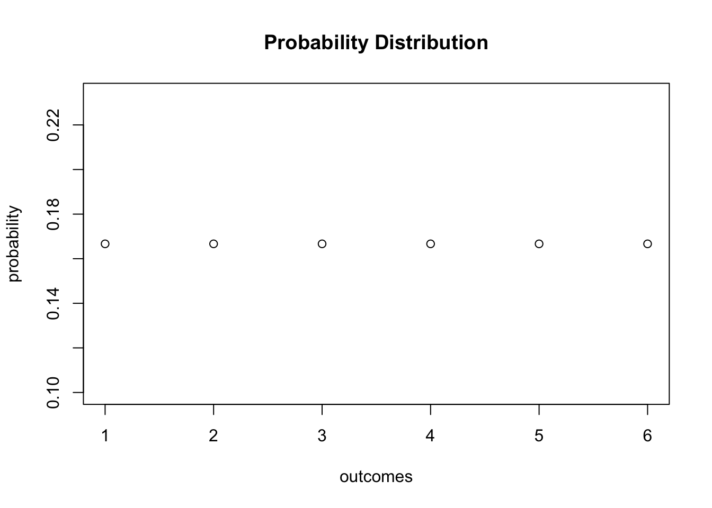

For the cumulative probability distribution we need the cumulative probabilities, i.e., we need the cumulative sums of the vector <tt>probability</tt>. These sums can be computed using <tt>cumsum()</tt>.


```r
# generate the vector of cumulative probabilities 
cum_probability <- cumsum(probability) 

# plot the probabilites 
plot(cum_probability, 
     xlab = "outcomes", 
     main = "Cumulative Probability Distribution") 
```


### Bernoulli Trials {-}

The set of elements from which <tt>sample()</tt> draws outcomes does not have to consist of numbers
only. We might as well simulate coin tossing with outcomes $H$ (heads) and $T$
(tails).


```r
sample(c("H", "T"), 1) 
#> [1] "T"
```

The result of a single coin toss is a *Bernoulli* distributed random variable, i.e., a variable with two possible distinct outcomes.

Imagine you are about to toss a coin $10$ times in a row and wonder how likely it
is to end up with a $5$ times heads. This is a typical example of what we call a *Bernoulli experiment* as it consists of $n=10$ Bernoulli trials that are independent of each other and we are interested in the likelihood of observing $k=5$ successes $H$ that occur with probability $p=0.5$ (assuming a fair coin) in each trial. Note that the order of the outcomes does not matter here.

It is a [well known result](https://en.wikipedia.org/wiki/Binomial_distribution) that the number of successes $k$ in a Bernoulli experiment follows a binomial distribution. We denote this as

$$k \sim B(n,p).$$

The probability of observing $k$ successes in the experiment $B(n,p)$ is given by

$$f(k)=P(k)=\begin{pmatrix}n\\ k \end{pmatrix} \cdot p^k \cdot
(1-p)^{n-k}=\frac{n!}{k!(n-k)!} \cdot p^k \cdot (1-p)^{n-k}$$

with $\begin{pmatrix}n\\ k \end{pmatrix}$ the binomial coefficient. 

In <tt>R</tt>, we can solve problems like the one stated above by means of the function <tt>dbinom()</tt> which calculates $P(k\vert n, p)$ the probability of the binomial distribution given the parameters <tt>x</tt> ($k$),
<tt>size</tt> ($n$), and <tt>prob</tt> ($p$), see `?dbinom`. Let us compute $P(k=5\vert n = 10, p = 0.5)$ (we write this short as $P(k=5)$.)


```r
dbinom(x = 5,
       size = 10,
       prob = 0.5) 
#> [1] 0.2460938
```

We conclude that $P(k=5)$, the probability of observing Head $k=5$ times when tossing a fair coin $n=10$ times is about $24.6\%$.

Now assume we are interested in $P(4 \leq k \leq 7)$, i.e., the probability of
observing $4$, $5$, $6$ or $7$ successes for $B(10, 0.5)$. This may be computed by providing a vector as the argument <tt>x</tt> in our call of <tt>dbinom()</tt> and summing up using  <tt>sum()</tt>.


```r
# compute P(4 <= k <= 7) using 'dbinom()'
sum(dbinom(x = 4:7, size = 10, prob = 0.5))
#> [1] 0.7734375
```

An alternative approach is to use <tt>pbinom()</tt>, the distribution function of the binomial distribution to compute $$P(4 \leq k \leq 7) = P(k \leq 7) - P(k\leq3 ).$$


```r
# compute P(4 <= k <= 7) using 'pbinom()'
pbinom(size = 10, prob = 0.5, q = 7) - pbinom(size = 10, prob = 0.5, q = 3) 
#> [1] 0.7734375
```

The probability distribution of a discrete random variable is nothing but a list
of all possible outcomes that can occur and their respective probabilities. In the coin tossing example we have $11$ possible outcomes for $k$.


```r
# set up vector of possible outcomes
k <- 0:10
k
#>  [1]  0  1  2  3  4  5  6  7  8  9 10
```

To visualize the probability distribution function of $k$ we may therefore do the following:


```r
# assign the probabilities
probability <- dbinom(x = k,
                      size = 10, 
                      prob = 0.5)

# plot the outcomes against their probabilities
plot(x = k, 
     y = probability,
     main = "Probability Distribution Function") 
```

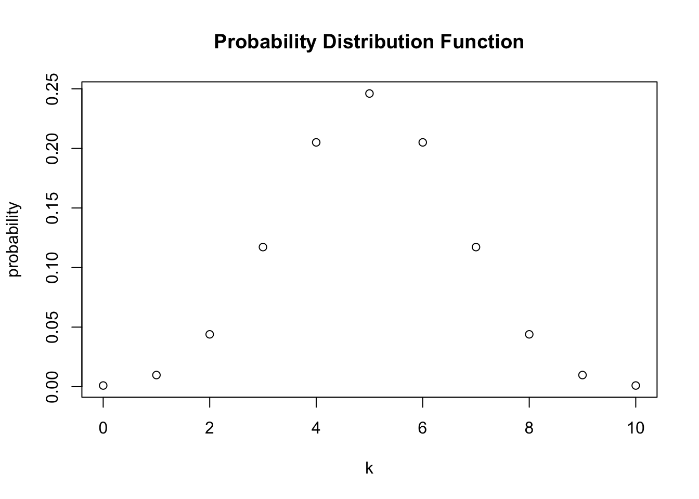

In a similar fashion we may plot the cumulative distribution function of $k$ by
executing the following code chunk:


```r
# compute cumulative probabilities
prob <- pbinom(q = k, 
               size = 10, 
               prob = 0.5)

# plot the cumulative probabilities
plot(x = k, 
     y = prob,
     main = "Cumulative Distribution Function") 
```


### Expected Value, Mean and Variance {-}

The expected value of a random variable is, loosely, the long-run average value of its outcomes when the number of repeated trials is large. For a discrete random variable, the
expected value is computed as a weighted average of its possible outcomes
whereby the weights are the related probabilities. This is formalized in Key
Concept 2.1.


<div class = "keyconcept" <div class = "keyconcept" id="KC2.1"> 
<h3 class = "right"> Key Concept 2.1 </h3> 
<h3 class= "left"> Expected Value and the Mean </h3> 

<p> Suppose the random variable $Y$
takes on $k$ possible values, $y_1, \dots, y_k$, where $y_1$ denotes the first
value, $y_2$ denotes the second value, and so forth, and that the probability
that $Y$ takes on $y_1$ is $p_1$, the probability that $Y$ takes on $y_2$ is
$p_2$ and so forth. The expected value of $Y$, $E(Y)$ is defined as

$$ E(Y) = y_1 p_1 + y_2 p_2 + \cdots + y_k p_k = \sum_{i=1}^k y_i p_i $$

where the notation $\sum_{i=1}^k y_i p_i$ means "the sum of $y_i$ $p_i$ for $i$
running from $1$ to $k$". The expected value of $Y$ is also called the mean of $Y$
or the expectation of $Y$ and is denoted by $\mu_Y$.
</p> 
</div>


  
In the dice example, the random variable, $D$ say, takes on $6$ possible values
$d_1 = 1, d_2 = 2, \dots, d_6 = 6$. Assuming a fair dice, each of the $6$ outcomes occurs with a probability of $1/6$. It is therefore easy to calculate the exact value of $E(D)$ by hand:

$$ E(D) = 1/6 \sum_{i=1}^6 d_i = 3.5 $$

$E(D)$ is simply the average of the natural numbers from $1$ to $6$ since all weights $p_i$ are $1/6$. This can be easily calculated using the function <tt>mean()</tt> which computes the arithmetic mean of a numeric vector.


```r
# compute mean of natural numbers from 1 to 6
mean(1:6)
#> [1] 3.5
```

An example of sampling with replacement is rolling a dice three times in a row.


```r
# set seed for reproducibility
set.seed(1)

# rolling a dice three times in a row
sample(1:6, 3, replace = T)
#> [1] 1 4 1
```

Note that every call of `sample(1:6, 3, replace = T)` gives a different outcome since we draw with replacement at random. To allow you to reproduce the results of computations that involve random numbers, we will used `set.seed()` to set R's random number generator to a specific state. You should check that it actually works: set the seed in your R session to 1 and verify that you obtain the same three random numbers!  

\BeginKnitrBlock{rmdknit}<div class="rmdknit">Sequences of random numbers generated by R are pseudo-random numbers, i.e., they are not "truly" random but approximate the properties of sequences of random numbers. Since this approximation is good enough for our purposes we refer to pseudo-random numbers as random numbers throughout this book.

In general, sequences of random numbers are generated by functions called "pseudo-random number generators" (PRNGs). The PRNG in R works by performing some operation on a deterministic value. Generally, this value is the previous number generated by the PRNG. However, the first time the PRNG is used, there is no previous value. A "seed" is the first value of a sequence of numbers --- it initializes the sequence. Each seed value will correspond to a different sequence of values. In R a seed can be set using <tt>set.seed()</tt>.

This is convenient for us:

If we provide the same seed twice, we get the same sequence of numbers twice. Thus, setting a seed before executing R code which involves random numbers makes the outcome reproducible! </div>\EndKnitrBlock{rmdknit}

Of course we could also consider a much bigger number of trials, $10000$ say.
Doing so, it would be pointless to simply print the results to the console: by
default <tt>R</tt> displays up to $1000$ entries of large vectors and omits the
remainder (give it a try). Eyeballing the numbers does not reveal much.
Instead, let us calculate the sample average of the outcomes using <tt>mean()</tt> and see if the result comes close to the expected value $E(D)=3.5$.


```r
# set seed for reproducibility
set.seed(1)

# compute the sample mean of 10000 dice rolls
mean(sample(1:6, 
           10000, 
           replace = T))
#> [1] 3.5138
```

We find the sample mean to be fairly close to the expected value. This result will be discussed in Chapter \@ref(RSATDOSA) in more detail. 

Other frequently encountered measures are the variance and the standard deviation. Both are measures of the *dispersion* of a random variable.

<div class = "keyconcept" id="KC2.2">
<h3 class = "right"> Key Concept 2.2 </h3> 
<h3 class= "left"> Variance and Standard Deviation </h3> 

<p> 
The variance of the discrete random variable $Y$, denoted $\sigma^2_Y$, is
$$ \sigma^2_Y = \text{Var}(Y) = E\left[(Y-\mu_y)^2\right] = \sum_{i=1}^k (y_i - \mu_y)^2 p_i $$
The standard deviation of $Y$ is $\sigma_Y$, the square root of the variance. The units of the standard deviation are the same as the units of $Y$.
</p> 
</div>


  
The variance as defined in Key Concept 2.2, being a population quantity, *is not* implemented as a function in R. Instead we have the function <tt>var()</tt> which computes the *sample variance* 

$$ s^2_Y = \frac{1}{n-1} \sum_{i=1}^n (y_i - \overline{y})^2. $$

Remember that $s^2_Y$ is different from the so called *population variance* of a discrete random variable $Y$, 

$$ \text{Var}(Y) = \frac{1}{N} \sum_{i=1}^N (y_i - \mu_Y)^2 $$

since it measures how the $n$ observations in the sample are dispersed around the sample average $\overline{y}$. Instead, $\text{Var}(Y)$ measures the dispersion of the whole population ($N$ members) around the population mean $\mu_Y$. The difference becomes clear when we look at our dice rolling example. For $D$ we have

$$ \text{Var}(D) = 1/6 \sum_{i=1}^6 (d_i - 3.5)^2 = 2.92  $$
which is obviously different from the result of $s^2$ as computed by <tt>var()</tt>.


```r
var(1:6)
#> [1] 3.5
```

The sample variance as computed by <tt>var()</tt> is an *estimator* of the population variance. You may check this using the widget below.

<iframe src='DCL/playground.html' frameborder='0' scrolling='no' style='width:100%;height:340px'></iframe>

### Probability Distributions of Continuous Random Variables {-}

Since a continuous random variable takes on a continuum of possible values, we
cannot use the concept of a probability distribution as used for discrete random
variables. Instead, the probability distribution of a continuous random variable
is summarized by its *probability density function* (PDF).

The cumulative probability distribution function (CDF) for a continuous random variable is defined just as in the discrete case. Hence, the CDF of a continuous random variables states the probability that the random variable is less than or equal to a particular value.

For completeness, we present revisions of Key Concepts 2.1 and 2.2 for the continuous case.

<div class = "keyconcept" id="KC2.3"> 
<h3 class = "right"> Key Concept 2.3 </h3> 
<h3 class= "left"> Probabilities, Expected Value and Variance of a Continuous Random Variable </h3> 

<p> 

Let $f_Y(y)$ denote the probability density function of $Y$. The probability that $Y$ falls between $a$ and $b$ where $a < b$ is 
$$ P(a \leq Y \leq b) = \int_a^b f_Y(y) \mathrm{d}y. $$
We further have that $P(-\infty \leq Y \leq \infty) = 1$ and therefore $\int_{-\infty}^{\infty} f_Y(y) \mathrm{d}y = 1$.

As for the discrete case, the expected value of $Y$ is the probability weighted average of its values. Due to continuity, we use integrals instead of sums. The expected value of $Y$ is defined as

$$ E(Y) =  \mu_Y = \int y f_Y(y) \mathrm{d}y. $$

The variance is the expected value of $(Y - \mu_Y)^2$. We thus have

$$\text{Var}(Y) =  \sigma_Y^2 = \int (y - \mu_Y)^2 f_Y(y) \mathrm{d}y.$$ 
</p> 
</div>


Let us discuss an example:

Consider the continuous random variable $X$ with PDF

$$ f_X(x) = \frac{3}{x^4}, x>1. $$

* We can show analytically that the integral of $f_X(x)$ over the real line equals $1$.

\begin{align}
 \int f_X(x) \mathrm{d}x =&  \int_{1}^{\infty} \frac{3}{x^4} \mathrm{d}x \\
  =& \lim_{t \rightarrow \infty} \int_{1}^{t} \frac{3}{x^4} \mathrm{d}x \\
  =& \lim_{t \rightarrow \infty}  -x^{-3} \rvert_{x=1}^t \\
  =& -\left(\lim_{t \rightarrow \infty}\frac{1}{t^3} - 1\right) \\
  =& 1
\end{align}

* The expectation of $X$ can be computed as follows:

\begin{align}
 E(X) = \int x \cdot f_X(x) \mathrm{d}x =&  \int_{1}^{\infty} x \cdot \frac{3}{x^4} \mathrm{d}x \\
  =& - \frac{3}{2} x^{-2} \rvert_{x=1}^{\infty} \\
  =& -\frac{3}{2} \left( \lim_{t \rightarrow \infty} \frac{1}{t^2} - 1 \right) \\
  =& \frac{3}{2}
\end{align}

* Note that the variance of $X$ can be expressed as $\text{Var}(X) = E(X^2) - E(X)^2$. Since $E(X)$ has been computed in the previous step, we seek $E(X^2)$:

\begin{align}
 E(X^2)= \int x^2 \cdot f_X(x) \mathrm{d}x =&  \int_{1}^{\infty} x^2 \cdot \frac{3}{x^4} \mathrm{d}x \\
  =& -3 x^{-1} \rvert_{x=1}^{\infty} \\
  =& -3 \left( \lim_{t \rightarrow \infty} \frac{1}{t} - 1 \right) \\
  =& 3
\end{align}

So we have shown that the area under the curve equals one, that the expectation is  $E(X)=\frac{3}{2}$ and we found the variance to be $\text{Var}(X) = \frac{3}{4}$. However, this was tedious and, as we shall see, an analytic approach is not applicable for some PDFs, e.g., if integrals have no closed form solutions.

Luckily, <tt>R</tt> also enables us to easily find the results derived above. The tool we use for this is the function <tt>integrate()</tt>. First, we have to define the functions we want to calculate integrals for as <tt>R</tt> functions, i.e., the PDF $f_X(x)$ as well as the expressions $x\cdot f_X(x)$ and $x^2\cdot f_X(x)$.


```r
# define functions
f <- function(x) 3 / x^4
g <- function(x) x * f(x)
h <- function(x) x^2 * f(x)
```

Next, we use <tt>integrate()</tt> and set lower and upper limits of integration to $1$ and $\infty$ using arguments <tt>lower</tt> and <tt>upper</tt>. By default, <tt>integrate()</tt> prints the result along with an estimate of the approximation error to the console. However, the outcome is not a numeric value one can readily do further calculation with. In order to get only a numeric value of the integral, we need to use the <tt>\$</tt> operator in conjunction with <tt>value</tt>. The <tt>\$</tt> operator is used to extract elements by name from an object of type <tt>list</tt>. 


```r
# compute area under the density curve
area <- integrate(f, 
                 lower = 1, 
                 upper = Inf)$value
area 
#> [1] 1

# compute E(X)
EX <- integrate(g,
                lower = 1,
                upper = Inf)$value
EX
#> [1] 1.5

# compute Var(X)
VarX <- integrate(h,
                  lower = 1,
                  upper = Inf)$value - EX^2 
VarX
#> [1] 0.75
```

Although there is a wide variety of distributions, the ones most often
encountered in econometrics are the normal, chi-squared, Student $t$ and $F$
distributions. Therefore we will discuss some core <tt>R</tt> functions that allow to do
calculations involving densities, probabilities and quantiles of these
distributions.

Every probability distribution that <tt>R</tt> handles has four basic functions whose names consist of a prefix followed by a root name. As an example, take the normal distribution. The root name of all four functions associated with the normal distribution is <tt>norm</tt>. The four prefixes are

- <tt>d</tt> for "density" - probability function / probability density function
- <tt>p</tt> for "probability" - cumulative distribution function
- <tt>q</tt> for "quantile" - quantile function (inverse cumulative distribution function)
- <tt>r</tt> for "random" - random number generator

Thus, for the normal distribution we have the <tt>R</tt> functions <tt>dnorm()</tt>, <tt>pnorm()</tt>, <tt>qnorm()</tt> and <tt>rnorm()</tt>.

### The Normal Distribution {-}

The probably most important probability distribution considered here is the normal
distribution. This is not least due to the special role of the standard normal distribution and the Central Limit Theorem which is to be treated shortly. Normal distributions are symmetric and bell-shaped. A normal distribution is characterized by its mean $\mu$ and its standard deviation $\sigma$, concisely expressed by
$\mathcal{N}(\mu,\sigma^2)$. The normal distribution has the PDF

\begin{align}
f(x) = \frac{1}{\sqrt{2 \pi} \sigma} \exp{-(x - \mu)^2/(2 \sigma^2)}.
\end{align}

For the standard normal distribution we have $\mu=0$ and $\sigma=1$. Standard normal variates are often denoted by $Z$. Usually, the standard normal PDF is denoted by $\phi$ and the standard normal CDF is denoted by $\Phi$. Hence,
$$ \phi(c) = \Phi'(c) \ \ , \ \ \Phi(c) = P(Z \leq c) \ \ , \ \ Z \sim \mathcal{N}(0,1).$$ Note that the notation X $\sim$ Y reads as "X is distributed as Y". In <tt>R</tt>, we can conveniently obtain densities of normal distributions using the function <tt>dnorm()</tt>. Let us draw a plot of the standard normal density function using <tt>curve()</tt> together with <tt>dnorm()</tt>.


```r
# draw a plot of the N(0,1) PDF
curve(dnorm(x),
      xlim = c(-3.5, 3.5),
      ylab = "Density", 
      main = "Standard Normal Density Function") 
```


We can obtain the density at different positions by passing a vector to <tt>dnorm()</tt>.


```r
# compute density at x=-1.96, x=0 and x=1.96
dnorm(x = c(-1.96, 0, 1.96))
#> [1] 0.05844094 0.39894228 0.05844094
```

Similar to the PDF, we can plot the standard normal CDF using <tt>curve()</tt>. We could use <tt>dnorm()</tt> for this but it is much more convenient to rely on <tt>pnorm()</tt>.


```r
# plot the standard normal CDF
curve(pnorm(x), 
      xlim = c(-3.5, 3.5), 
      ylab = "Probability", 
      main = "Standard Normal Cumulative Distribution Function")
```


We can also use <tt>R</tt> to calculate the probability of events associated with a standard normal variate. 

Let us say we are interested in $P(Z \leq 1.337)$. For some continuous random variable $Z$ on $[-\infty,\infty]$ with density $g(x)$ we would have to determine $G(x)$, the anti-derivative of $g(x)$ so that

$$ P(Z \leq 1.337 ) = G(1.337) = \int_{-\infty}^{1.337} g(x) \mathrm{d}x.  $$

If $Z \sim \mathcal{N}(0,1)$, we have $g(x)=\phi(x)$. There is no analytic solution to the integral above. Fortunately, <tt>R</tt> offers good approximations. The first approach makes use of the function <tt>integrate()</tt> which allows to solve one-dimensional integration problems using a numerical method. For this, we first define the function we want to compute the integral of as an <tt>R</tt> function <tt>f</tt>. In our example, <tt>f</tt> is the standard normal density function and hence takes a single argument <tt>x</tt>. Following the definition of $\phi(x)$ we define <tt>f</tt> as


```r
# define the standard normal PDF as an R function
f <- function(x) {
  1/(sqrt(2 * pi)) * exp(-0.5 * x^2)
}
```

Let us check if this function computes standard normal densities by passing a vector.

```r
# define a vector of reals
quants <- c(-1.96, 0, 1.96)

# compute densities
f(quants)
#> [1] 0.05844094 0.39894228 0.05844094

# compare to the results produced by 'dnorm()'
f(quants) == dnorm(quants)
#> [1] TRUE TRUE TRUE
```

The results produced by <tt>f()</tt> are indeed equivalent to those given by <tt>dnorm()</tt>.

Next, we call <tt>integrate()</tt> on <tt>f()</tt> and specify the arguments <tt>lower</tt> and <tt>upper</tt>, the lower and upper limits of integration.


```r
# integrate f()
integrate(f, 
          lower = -Inf, 
          upper = 1.337)
#> 0.9093887 with absolute error < 1.7e-07
```

We find that the probability of observing $Z \leq 1.337$ is about $90.94\%$.

A second and much more convenient way is to use the function <tt>pnorm()</tt>, the standard normal cumulative distribution function.


```r
# compute the probability using pnorm()
pnorm(1.337)
#> [1] 0.9093887
```

The result matches the outcome of the approach using <tt>integrate()</tt>.

Let us discuss some further examples:

A commonly known result is that $95\%$ probability mass of a standard normal lies in the interval $[-1.96, 1.96]$, that is, in a distance of about $2$ standard deviations to the mean. We can easily confirm this by calculating $$ P(-1.96 \leq Z \leq 1.96) = 1-2\times P(Z \leq -1.96) $$ due to symmetry of the standard normal PDF. Thanks to <tt>R</tt>, we can abandon the table of the standard normal CDF found in many other textbooks and instead solve this fast by using <tt>pnorm()</tt>.


```r
# compute the probability
1 - 2 * (pnorm(-1.96)) 
#> [1] 0.9500042
```

To make statements about the  probability of observing outcomes of $Y$ in some specific range it is more convenient when we standardize first as shown in Key Concept 2.4.

<div class = "keyconcept" id="KC2.4">
<h3 class = "right"> Key Concept 2.4 </h3> 
<h3 class = "left"> Computing Probabilities Involving Normal Random Variables </h3>

<p>

Suppose $Y$ is normally distributed with mean $\mu$ and variance $\sigma^2$: $$Y
\sim \mathcal{N}(\mu, \sigma^2)$$ Then $Y$ is standardized by subtracting its mean and
dividing by its standard deviation: $$ Z = \frac{Y -\mu}{\sigma} $$ Let $c_1$
and $c_2$ denote two numbers whereby $c_1 < c_2$ and further $d_1 = (c_1 - \mu)
/ \sigma$ and $d_2 = (c_2 - \mu)/\sigma$. Then

\begin{align*} 
P(Y \leq c_2) =& \, P(Z \leq d_2) = \Phi(d_2), \\ 
P(Y \geq c_1) =& \, P(Z \geq d_1) = 1 - \Phi(d_1), \\ 
P(c_1 \leq Y \leq c_2) =& \, P(d_1 \leq Z \leq d_2) = \Phi(d_2) - \Phi(d_1). 
\end{align*}

</p> 
</div>


Now consider a random variable $Y$ with $Y \sim \mathcal{N}(5, 25)$. <tt>R</tt> functions that handle the normal distribution can perform the standardization. If we are interested in $P(3 \leq Y \leq 4)$ we can use <tt>pnorm()</tt> and adjust for a mean and/or a standard deviation that deviate from $\mu=0$ and $\sigma = 1$ by specifying the arguments <tt>mean</tt> and <tt>sd</tt> accordingly. **Attention**: the argument <tt>sd</tt> requires the standard deviation, not the variance! 


```r
pnorm(4, mean = 5, sd = 5) - pnorm(3, mean = 5, sd = 5) 
#> [1] 0.07616203
```

An extension of the normal distribution in a univariate setting is the multivariate normal distribution. The joint PDF of two random normal variables $X$ and $Y$ is given by

\begin{align}
\begin{split}
g_{X,Y}(x,y) =& \, \frac{1}{2\pi\sigma_X\sigma_Y\sqrt{1-\rho_{XY}^2}} \\ 
\cdot & \, \exp \left\{ \frac{1}{-2(1-\rho_{XY}^2)} \left[ \left( \frac{x-\mu_x}{\sigma_X} \right)^2 - 2\rho_{XY}\left( \frac{x-\mu_X}{\sigma_X} \right)\left( \frac{y-\mu_Y}{\sigma_Y} \right) + \left( \frac{y-\mu_Y}{\sigma_Y} \right)^2 \right]  \right\}.
\end{split} (\#eq:bivnorm)
\end{align}

Equation \@ref(eq:bivnorm) contains the bivariate normal PDF. It is somewhat hard to gain insights from this complicated expression. Instead, let us consider the special case where $X$ and $Y$ are uncorrelated standard normal random variables with densities $f_X(x)$ and $f_Y(y)$ with joint normal distribution. We then have the parameters $\sigma_X = \sigma_Y = 1$, $\mu_X=\mu_Y=0$ (due to marginal standard normality) and $\rho_{XY}=0$ (due to independence). The joint density of $X$ and $Y$ then becomes

$$ g_{X,Y}(x,y) = f_X(x) f_Y(y) = \frac{1}{2\pi} \cdot \exp \left\{ -\frac{1}{2} \left[x^2 + y^2 \right]  \right\}, \tag{2.2}  $$ 

the PDF of the bivariate standard normal distribution. The widget below provides an interactive three-dimensional plot of (<a href="#mjx-eqn-2.2">2.2</a>). 


<center><iframe scrolling='no' seamless='seamless' style='border:none' src='https://plot.ly/~mca_unidue/22.embed?width=550&height=550?showlink=false/800/1200' width='600' height='400'></iframe></center>

By moving the cursor over the plot you can see that the density is rotationally invariant, i.e., the density at $(a, b)$ solely depends on the distance of $(a, b)$ to the origin: geometrically, regions of equal density are edges of concentric circles in the XY-plane, centered at $(\mu_X = 0, \mu_Y = 0)$. 

The normal distribution has some remarkable characteristics. For example, for two jointly normally distribued variables $X$ and $Y$, the conditional expectation function is linear: one can show that $$ E(Y\vert X) = E(Y) + \rho \frac{\sigma_Y}{\sigma_X} (X - E(X)). $$ The interactive widget below shows standard bivariate normally distributed sample data along with the conditional expectation function $E(Y\vert X)$ and the marginal densities of $X$ and $Y$. All elements adjust accordingly as you vary the parameters.


<center>
<iframe height="880" width="770" frameborder="0" scrolling="no" src="bivariatenormalv4.html"></iframe>
</center>

<a name="chisquare"></a>

### The Chi-Squared Distribution {-}

The chi-squared distribution is another distribution relevant in econometrics. It is often needed when testing special types of hypotheses frequently encountered when dealing with regression models. 

The sum of $M$ squared independent standard normal distributed random variables follows a chi-squared distribution with $M$ degrees of freedom:

\begin{align*}
Z_1^2 + \dots + Z_M^2 = \sum_{m=1}^M Z_m^2 \sim \chi^2_M \ \ \text{with} \ \ Z_m \overset{i.i.d.}{\sim} \mathcal{N}(0,1) (\#eq:chisq)
\end{align*}

A $\chi^2$ distributed random variable with $M$ degrees of freedom has expectation $M$, mode at $M-2$ for $M \geq 2$ and variance $2 \cdot M$. For example, for

$$ Z_1,Z_2,Z_3 \overset{i.i.d.}{\sim} \mathcal{N}(0,1) $$

it holds that

$$ Z_1^2+Z_2^2+Z_3^2 \sim \chi^2_3. \tag{2.3} $$
Using the code below, we can display the PDF and the CDF of a $\chi^2_3$ random variable in a single plot. This is achieved by setting the argument <tt>add = TRUE</tt> in the second call of <tt>curve()</tt>. Further we adjust limits of both axes using <tt>xlim</tt> and <tt>ylim</tt> and choose different colors to make both functions better distinguishable. The plot is completed by adding a legend with help of <tt>legend()</tt>.


```r
# plot the PDF
curve(dchisq(x, df = 3), 
      xlim = c(0, 10), 
      ylim = c(0, 1), 
      col = "blue",
      ylab = "",
      main = "p.d.f. and c.d.f of Chi-Squared Distribution, M = 3")

# add the CDF to the plot
curve(pchisq(x, df = 3), 
      xlim = c(0, 10), 
      add = TRUE, 
      col = "red")

# add a legend to the plot
legend("topleft", 
       c("PDF", "CDF"), 
       col = c("blue", "red"), 
       lty = c(1, 1))
```


Since the outcomes of a $\chi^2_M$ distributed random variable are always positive, the support of the related PDF and CDF is $\mathbb{R}_{\geq0}$.

As expectation and variance depend (solely!) on the degrees of freedom, the distribution's shape changes drastically if we vary the number of squared standard normals that are summed up. This relation is often depicted by overlaying densities for different $M$, see the <a href="https://en.wikipedia.org/wiki/Chi-squared_distribution">Wikipedia Article</a>.  

We reproduce this here by plotting the density of the $\chi_1^2$ distribution on the interval $[0,15]$ with <tt>curve()</tt>. In the next step, we loop over degrees of freedom $M=2,...,7$ and add a density curve for each $M$ to the plot. We also adjust the line color for each iteration of the loop by setting <tt>col = M</tt>. At last, we add a legend that displays degrees of freedom and the associated colors.


```r
# plot the density for M=1
curve(dchisq(x, df = 1), 
      xlim = c(0, 15), 
      xlab = "x", 
      ylab = "Density", 
      main = "Chi-Square Distributed Random Variables")

# add densities for M=2,...,7 to the plot using a 'for()' loop 
for (M in 2:7) {
  curve(dchisq(x, df = M),
        xlim = c(0, 15), 
        add = T, 
        col = M)
}

# add a legend
legend("topright", 
       as.character(1:7), 
       col = 1:7 , 
       lty = 1, 
       title = "D.F.")
```


Increasing the degrees of freedom shifts the distribution to the right (the mode becomes larger) and increases the dispersion (the distribution's variance grows).

### The Student t Distribution {-#thetdist}

<a name="tdist"></a>

Let $Z$ be a standard normal variate, $W$ a $\chi^2_M$ random variable and further assume that $Z$ and $W$ are independent. Then it holds that

$$ \frac{Z}{\sqrt{W/M}} =:X \sim t_M $$
and $X$ follows a *Student $t$ distribution* (or simply $t$ distribution) with $M$ degrees of freedom.

Similar to the $\chi^2_M$ distribution, the shape of a $t_M$ distribution depends on $M$. $t$ distributions are symmetric, bell-shaped and look similar to a normal distribution, especially when $M$ is large. This is not a coincidence: for a sufficiently large $M$, the $t_M$ distribution can be approximated by the standard normal distribution. This approximation works reasonably well for $M\geq 30$. As we will illustrate later by means of a small simulation study, the $t_{\infty}$ distribution *is* the standard normal distribution.

A $t_M$ distributed random variable $X$ has an expectation if $M>1$ and it has a variance if $M>2$.

\begin{align}
  E(X) =& 0, \ M>1 \\
  \text{Var}(X) =& \frac{M}{M-2}, \ M>2
\end{align}

Let us plot some $t$ distributions with different $M$ and compare them to the standard normal distribution.


```r
# plot the standard normal density
curve(dnorm(x), 
      xlim = c(-4, 4), 
      xlab = "x", 
      lty = 2, 
      ylab = "Density", 
      main = "Densities of t Distributions")

# plot the t density for M=2
curve(dt(x, df = 2), 
      xlim = c(-4, 4), 
      col = 2, 
      add = T)

# plot the t density for M=4
curve(dt(x, df = 4), 
      xlim = c(-4, 4), 
      col = 3, 
      add = T)

# plot the t density for M=25
curve(dt(x, df = 25), 
      xlim = c(-4, 4), 
      col = 4, 
      add = T)

# add a legend
legend("topright", 
       c("N(0, 1)", "M=2", "M=4", "M=25"), 
       col = 1:4, 
       lty = c(2, 1, 1, 1))
```


The plot illustrates what has been said in the previous paragraph: as the degrees of freedom increase, the shape of the $t$ distribution comes closer to that of a standard normal bell curve. Already for $M=25$ we find little difference to the standard normal density. If $M$ is small, we find the distribution to have heavier tails than a standard normal, i.e., it has a "fatter" bell shape.

### The F Distribution {-}

Another ratio of random variables important to econometricians is the ratio of two independent $\chi^2$ distributed random variables that are divided by their degrees of freedom $M$ and $n$. The quantity 

$$ \frac{W/M}{V/n} \sim F_{M,n} \ \ \text{with} \ \ W \sim \chi^2_M \ \ , \ \ V \sim \chi^2_n $$
follows an $F$ distribution with numerator degrees of freedom $M$ and denominator degrees of freedom $n$, denoted $F_{M,n}$. The distribution was first derived by George Snedecor but was named in honor of [Sir Ronald Fisher](https://en.wikipedia.org/wiki/Ronald_Fisher).

By definition, the support of both PDF and CDF of an $F_{M,n}$ distributed random variable is $\mathbb{R}_{\geq0}$.

Say we have an $F$ distributed random variable $Y$ with numerator degrees of freedom $3$ and denominator degrees of freedom $14$ and are interested in $P(Y \geq 2)$. This can be computed with help of the function <tt>pf()</tt>. By setting the argument <tt>lower.tail</tt> to <tt>FALSE</tt> we ensure that <tt>R</tt> computes $1- P(Y \leq 2)$, i.e,the probability mass in the tail right of $2$. 


```r
pf(2, df1 = 3, df2 = 14, lower.tail = F)
#> [1] 0.1603538
```

We can visualize this probability by drawing a line plot of the related density and adding a color shading with <tt>polygon()</tt>.


```r
# define coordinate vectors for vertices of the polygon
x <- c(2, seq(2, 10, 0.01), 10)
y <- c(0, df(seq(2, 10, 0.01), 3, 14), 0)

# draw density of F_{3, 14}
curve(df(x ,3 ,14), 
      ylim = c(0, 0.8), 
      xlim = c(0, 10), 
      ylab = "Density",
      main = "Density Function")

# draw the polygon
polygon(x, y, col = "orange")
```


The $F$ distribution is related to many other distributions. An important special case encountered in econometrics arises if the denominator degrees of freedom are large such that the $F_{M,n}$ distribution can be approximated by the $F_{M,\infty}$ distribution which turns out to be simply the distribution of a $\chi^2_M$ random variable divided by its degrees of freedom $M$,

$$ W/M \sim F_{M,\infty} \ \ , \ \ W \sim \chi^2_M. $$


<iframe src="DCL/playground.html" frameborder="0" scrolling="no" style="width:100%;height:340px"></iframe>

## Random Sampling and the Distribution of Sample Averages {#RSATDOSA}

To clarify the basic idea of random sampling, let us jump back to the dice rolling example: 

Suppose we are rolling the dice $n$ times. This means we are interested in the outcomes of random $Y_i, \ i=1,...,n$ which are characterized by the same distribution. Since these outcomes are selected randomly, they are *random variables* themselves and their realizations will differ each time we draw a sample, i.e., each time we roll the dice $n$ times. Furthermore, each observation is randomly drawn from the same population, that is, the numbers from $1$ to $6$, and their individual distribution is the same. Hence $Y_1,\dots,Y_n$ are identically distributed. 

Moreover, we know that the value of any of the $Y_i$ does not provide any information on the remainder of the outcomes In our example, rolling a six as the first observation in our sample does not alter the distributions of $Y_2,\dots,Y_n$: all numbers are equally likely to occur. This means that all $Y_i$ are also independently distributed. Thus $Y_1,\dots,Y_n$ are independently and identically distributed (*i.i.d.*). 
The dice example uses this most simple sampling scheme. That is why it is called *simple random sampling*. This concept is summarized in Key Concept 2.5. 


<div class = "keyconcept" id="KC2.5">
<h3 class = "right"> Key Concept 2.5 </h3> 
<h3 class = "left"> Simple Random Sampling and i.i.d. Random Variables </h3>
<p>
In simple random sampling, $n$ objects are drawn at random from a population. Each object is equally likely to end up in the sample. We denote the value of the random variable $Y$ for the $i^{th}$ randomly drawn object as $Y_i$.  Since all objects are equally likely to be drawn and the distribution of $Y_i$ is the same for all $i$, the $Y_i, \dots, Y_n$ are independently and identically distributed (i.i.d.). This means the distribution of $Y_i$ is the same for all $i=1,\dots,n$ and $Y_1$ is distributed independently of $Y_2, \dots, Y_n$ and $Y_2$ is distributed independently of $Y_1, Y_3, \dots, Y_n$ and so forth.
</p> 
</div>


What happens if we consider functions of the sample data? Consider the example of rolling a dice two times in a row once again. A sample now consists of two independent random draws from the set $\{1,2,3,4,5,6\}$. It is apparent that any function of these two random variables, e.g. their sum, is also random. Convince yourself by executing the code below several times.


```r
sum(sample(1:6, 2, replace = T))
#> [1] 7
```

Clearly, this sum, let us call it $S$, is a random variable as it depends on randomly drawn summands. For this example, we can completely enumerate all outcomes and hence write down the theoretical probability distribution of our function of the sample data $S$:

We face $6^2=36$ possible pairs. Those pairs are 

\begin{align*}
  &(1,1)	(1,2)	(1,3)	(1,4)	(1,5)	(1,6) \\ 
  &(2,1)	(2,2)	(2,3)	(2,4)	(2,5)	(2,6) \\ 
  &(3,1)	(3,2)	(3,3)	(3,4)	(3,5)	(3,6) \\ 
  &(4,1)	(4,2)	(4,3)	(4,4)	(4,5)	(4,6) \\ 
  &(5,1)	(5,2)	(5,3)	(5,4)	(5,5)	(5,6) \\ 
  &(6,1)	(6,2)	(6,3)	(6,4)	(6,5)	(6,6)
\end{align*}

Thus, possible outcomes for $S$ are

$$ \left\{ 2,3,4,5,6,7,8,9,10,11,12 \right\} . $$
Enumeration of outcomes yields

\begin{align}
  P(S) = 
  \begin{cases} 
    1/36, \ & S = 2 \\ 
    2/36, \ & S = 3 \\
    3/36, \ & S = 4 \\
    4/36, \ & S = 5 \\
    5/36, \ & S = 6 \\
    6/36, \ & S = 7 \\
    5/36, \ & S = 8 \\
    4/36, \ & S = 9 \\
    3/36, \ & S = 10 \\
    2/36, \ & S = 11 \\
    1/36, \ & S = 12
  \end{cases}
\end{align}

We can also compute $E(S)$ and $\text{Var}(S)$ as stated in Key Concept 2.1 and Key Concept 2.2. 


```r
# Vector of outcomes
S <- 2:12

# Vector of probabilities
PS <- c(1:6, 5:1) / 36

# Expectation of S
ES <- sum(S * PS)
ES
#> [1] 7

# Variance of S
VarS <- sum((S - c(ES))^2 * PS)
VarS
#> [1] 5.833333
```

So the distribution of $S$ is known. It is also evident that its distribution differs considerably from the marginal distribution, i.e,the distribution of a single dice roll's outcome, $D$ . Let us visualize this using bar plots.


```r
# divide the plotting area into one row with two columns
par(mfrow = c(1, 2))

# plot the distribution of S
barplot(PS, 
        ylim = c(0, 0.2), 
        xlab = "S", 
        ylab = "Probability", 
        col = "steelblue", 
        space = 0, 
        main = "Sum of Two Dice Rolls")

# plot the distribution of D 
probability <- rep(1/6, 6)
names(probability) <- 1:6

barplot(probability, 
        ylim = c(0, 0.2), 
        xlab = "D", 
        col = "steelblue", 
        space = 0, 
        main = "Outcome of a Single Dice Roll")
```

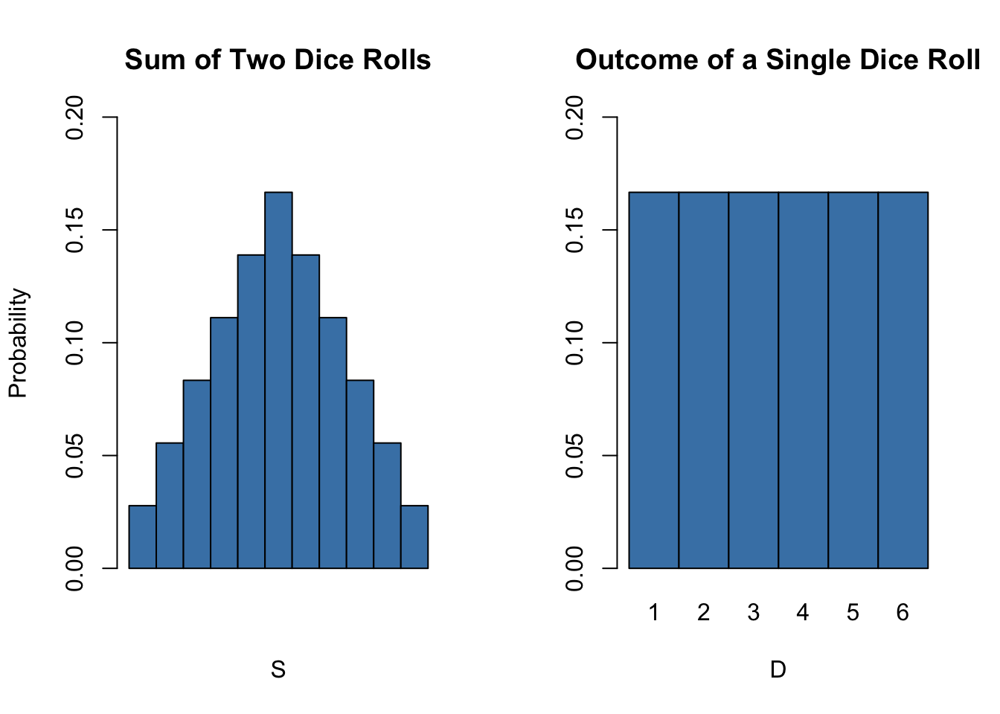

Many econometric procedures deal with averages of sampled data. It is typically assumed that observations are drawn randomly from a larger, unknown population. As demonstrated for the sample function $S$, computing an average of a random sample has the effect that the average is a random variable itself. This random variable in turn has a probability distribution, called the sampling distribution. Knowledge about the sampling distribution of the average is therefore crucial for understanding the performance of econometric procedures.

The *sample average* of a sample of $n$ observations $Y_1, \dots, Y_n$ is

$$ \overline{Y} = \frac{1}{n} \sum_{i=1}^n Y_i = \frac{1}{n} (Y_1 + Y_2 + \cdots + Y_n). $$
$\overline{Y}$ is also called the sample mean.

### Mean and Variance of the Sample Mean {-}

suppose that $Y_1,\dots,Y_n$ are i.i.d. and denote $\mu_Y$ and $\sigma_Y^2$ as the mean and the variance of the $Y_i$. Then we have that

$$ E(\overline{Y}) = E\left(\frac{1}{n} \sum_{i=1}^n Y_i \right) = \frac{1}{n} E\left(\sum_{i=1}^n Y_i\right) = \frac{1}{n} \sum_{i=1}^n E\left(Y_i\right) = \frac{1}{n} \cdot n \cdot \mu_Y = \mu_Y    $$
and

\begin{align*}
  \text{Var}(\overline{Y}) =& \text{Var}\left(\frac{1}{n} \sum_{i=1}^n Y_i \right) \\
  =& \frac{1}{n^2} \sum_{i=1}^n \text{Var}(Y_i) + \frac{1}{n^2} \sum_{i=1}^n \sum_{j=1, j\neq i}^n \text{cov}(Y_i,Y_j) \\
  =& \frac{\sigma^2_Y}{n} \\
  =& \sigma_{\overline{Y}}^2.
\end{align*}

The second summand vanishes since $\text{cov}(Y_i,Y_j)=0$ for $i\neq j$ due to independence. Consequently, the standard deviation of the sample mean is given by $$\sigma_{\overline{Y}} = \frac{\sigma_Y}{\sqrt{n}}.$$

It is worthwhile to mention that these results hold irrespective of the underlying distribution of the $Y_i$.

#### The Sampling Distribution of $\overline{Y}$ when $Y$ Is Normally Distributed {-}

If the $Y_1,\dots,Y_n$ are i.i.d. draws from a normal distribution with mean $\mu_Y$ and variance $\sigma_Y^2$, the following holds for their sample average $\overline{Y}$:

$$ \overline{Y} \sim \mathcal{N}(\mu_Y, \sigma_Y^2/n) \tag{2.4} $$

For example, if a sample $Y_i$ with $i=1,\dots,10$ is drawn from a standard normal distribution with mean $\mu_Y = 0$ and variance $\sigma_Y^2=1$ we have

$$ \overline{Y} \sim \mathcal{N}(0,0.1).$$

We can use <tt>R</tt>'s random number generation facilities to verify this result. The basic idea is to simulate outcomes of the true distribution of $\overline{Y}$ by repeatedly drawing random samples of 10 observation from the $\mathcal{N}(0,1)$ distribution and computing their respective averages. If we do this for a large number of repetitions, the simulated data set of averages should quite accurately reflect the theoretical distribution of $\overline{Y}$ if the theoretical result holds.

The approach sketched above is an example of what is commonly known as *Monte Carlo Simulation* or *Monte Carlo Experiment*. To perform this simulation in <tt>R</tt>, we proceed as follows:

1. Choose a sample size <tt>n</tt> and the number of samples to be drawn, <tt>reps</tt>.
2. Use the function <tt>replicate()</tt> in conjunction with <tt>rnorm()</tt> to draw <tt>n</tt> observations from the standard normal distribution <tt>rep</tt> times. 

    **Note**: the outcome of <tt>replicate()</tt> is a matrix with dimensions <tt>n</tt> $\times$ <tt>rep</tt>. It contains the drawn samples as *columns*.
    
3. Compute sample means using <tt>colMeans()</tt>. This function computes the mean of each column, i.e., of each sample and returns a vector.


```r
# set sample size and number of samples
n <- 10
reps <- 10000

# perform random sampling
samples <- replicate(reps, rnorm(n)) # 10 x 10000 sample matrix

# compute sample means
sample.avgs <- colMeans(samples)
```

We then end up with a vector of sample averages. You can check the vector property of <tt>sample.avgs</tt>:


```r
# check that 'sample.avgs' is a vector
is.vector(sample.avgs) 
#> [1] TRUE

# print the first few entries to the console
head(sample.avgs)
#> [1] -0.1045919  0.2264301  0.5308715 -0.2243476  0.2186909  0.2564663
```

A straightforward approach to examine the distribution of univariate numerical data is to plot it as a histogram and compare it to some known or assumed distribution. By default, <tt>hist()</tt> will give us a frequency histogram, i.e., a bar chart where observations are grouped into ranges, also called bins. The ordinate reports the number of observations falling into each of the bins. Instead, we want it to report density estimates for comparison purposes. This is achieved by setting the argument <tt>freq = FALSE</tt>. The number of bins is adjusted by the argument <tt>breaks</tt>. 

Using <tt>curve()</tt>, we overlay the histogram with a red line, the theoretical density of a $\mathcal{N}(0, 0.1)$ random variable. Remember to use the argument <tt>add = TRUE</tt> to add the curve to the current plot. Otherwise <tt>R</tt> will open a new graphic device and discard the previous plot!^[*Hint:* <tt>T</tt> and <tt>F</tt> are alternatives for <tt>TRUE</tt> and <tt>FALSE</tt>.]  


```r
# Plot the density histogram
hist(sample.avgs, 
     ylim = c(0, 1.4), 
     col = "steelblue" , 
     freq = F, 
     breaks = 20)

# overlay the theoretical distribution of sample averages on top of the histogram
curve(dnorm(x, sd = 1/sqrt(n)), 
      col = "red", 
      lwd = "2", 
      add = T)
```


The sampling distribution of $\overline{Y}$ is indeed very close to that of a $\mathcal{N}(0, 0.1)$ distribution so the Monte Carlo simulation supports the theoretical claim. 

Let us discuss another example where using simple random sampling in a simulation setup helps to verify a well known result. As discussed before, the [Chi-squared](#chisquare) distribution with $M$ degrees of freedom arises as the distribution of the sum of $M$ independent squared standard normal distributed random variables. 

To visualize the claim stated in equation (<a href="#mjx-eqn-2.3">2.3</a>), we proceed similarly as in the example before:

1. Choose the degrees of freedom, <tt>DF</tt>, and the number of samples to be drawn <tt>reps</tt>.
2. Draw <tt>reps</tt> random samples of size <tt>DF</tt> from the standard normal distribution using <tt>replicate()</tt>. 
3. For each sample, square the outcomes and sum them up column-wise. Store the results.

Again, we produce a density estimate for the distribution underlying our simulated data using a density histogram and overlay it with a line graph of the theoretical density function of the $\chi^2_3$ distribution.


```r
# number of repetitions
reps <- 10000

# set degrees of freedom of a chi-Square Distribution
DF <- 3 

# sample 10000 column vectors à 3 N(0,1) R.V.S
Z <- replicate(reps, rnorm(DF)) 

# column sums of squares
X <- colSums(Z^2)

# histogram of column sums of squares
hist(X, 
     freq = F, 
     col = "steelblue", 
     breaks = 40, 
     ylab = "Density", 
     main = "")

# add theoretical density
curve(dchisq(x, df = DF), 
      type = 'l', 
      lwd = 2, 
      col = "red", 
      add = T)
```


### Large Sample Approximations to Sampling Distributions {-}

Sampling distributions as considered in the last section play an important role in the development of econometric methods. There are two main approaches in characterizing sampling distributions: an "exact" approach and an "approximate" approach.

The exact approach aims to find a general formula for the sampling distribution that holds for any sample size $n$. We call this the *exact distribution* or *finite-sample distribution*. In the previous examples of dice rolling and normal variates, we have dealt with functions of random variables whose sample distributions are *exactly known* in the sense that we can write them down as analytic expressions. However, this is not always possible. For $\overline{Y}$, result (<a href="#mjx-eqn-2.4">2.4</a>) tells us that normality of the $Y_i$ implies normality of $\overline{Y}$ (we demonstrated this for the special case of $Y_i \overset{i.i.d.}{\sim} \mathcal{N}(0,1)$ with $n=10$ using a simulation study that involves simple random sampling). Unfortunately, the *exact* distribution of $\overline{Y}$ is generally unknown and often hard to derive (or even untraceable) if we drop the assumption that the $Y_i$ have a normal distribution.  

Therefore, as can be guessed from its name, the "approximate" approach aims to find an approximation to the sampling distribution where it is required that the sample size $n$ is large. A distribution that is used as a large-sample approximation to the sampling distribution is also called the *asymptotic distribution*. This is due to the fact that the asymptotic distribution *is* the sampling distribution for $n \rightarrow \infty$, i.e., the approximation becomes exact if the sample size goes to infinity. However, the difference between the sampling distribution and the asymptotic distribution is negligible for moderate or even small samples sizes so that approximations using the asymptotic distribution are useful.

In this section we will discuss two well known results that are used to approximate sampling distributions and thus constitute key tools in econometric theory: the *law of large numbers* and the *central limit theorem*. The law of large numbers states that in large samples, $\overline{Y}$ is close to $\mu_Y$ with high probability. The central limit theorem says that the sampling distribution of the standardized sample average, that is, $(\overline{Y} - \mu_Y)/\sigma_{\overline{Y}}$ is asymptotically normally distributed. It is particularly interesting that both results do not depend on the distribution of $Y$. In other words, being unable to describe the complicated sampling distribution of $\overline{Y}$ if $Y$ is not normal, approximations of the latter using the central limit theorem simplify the development and applicability of econometric procedures enormously. This is a key component underlying the theory of statistical inference for regression models. Both results are summarized in Key Concept 2.6 and Key Concept 2.7.


<div class = "keyconcept" id="KC2.6">
<h3 class = "right"> Key Concept 2.6 </h3> 
<h3 class = "left"> Convergence in Probability, Consistency and the Law of Large Numbers </h3>
<p>
The sample average $\overline{Y}$ converges in probability to $\mu_Y$: $\overline{Y}$ is *consistent* for $\mu_Y$ if the probability that $\overline{Y}$ is in the range $(\mu_Y - \epsilon)$ to $(\mu_Y + \epsilon)$ becomes arbitrary close to $1$ as $n$ increases for any constant $\epsilon > 0$. We write this as

$$ P(\mu_Y-\epsilon \leq \overline{Y} \leq \mu_Y + \epsilon) \rightarrow 1, \, \epsilon > 0 \text{ as } n\rightarrow\infty. $$

Consider the independently and identically distributed random variables $Y_i, i=1,\dots,n$ with expectation $E(Y_i)=\mu_Y$ and variance $\text{Var}(Y_i)=\sigma^2_Y$. Under the condition that $\sigma^2_Y< \infty$, that is, large outliers are unlikely, the law of large numbers thus states that

$$ \overline{Y} \xrightarrow[]{p} \mu_Y. $$

The following application simulates a large number of coin tosses (you may set the number of trials using the slider) with a fair coin and computes the fraction of heads observed for each additional toss. The result is a random path that, as stated by the law of large numbers, shows a tendency to approach the value of $0.5$ as $n$ grows. 
<iframe height="570" width="800" frameborder="0" scrolling="no" src="CoinTossingWLLN.html"></iframe>
</p> 
</div>


The core statement of the law of large numbers is that under quite general conditions, the probability of obtaining a sample average $\overline{Y}$ that is close to $\mu_Y$ is high if we have a large sample size.

Consider the example of repeatedly tossing a coin where $Y_i$ is the result of the $i^{th}$ coin toss. $Y_i$ is a Bernoulli distributed random variable with $p$ the probability of observing head
$$ P(Y_i) = \begin{cases} p, & Y_i = 1 \\ 1-p, & Y_i = 0 \end{cases} $$
where $p = 0.5$ as we assume a fair coin.  It is straightforward to show that

$$ \mu_Y = p = 0.5. $$
Let $R_n$ denote the proportion of heads in the first $n$ tosses,

$$ R_n = \frac{1}{n} \sum_{i=1}^n Y_i. \tag{2.5}$$

According to the law of large numbers, the observed proportion of heads converges in probability to $\mu_Y = 0.5$, the probability of tossing head in a *single* coin toss, $$ R_n \xrightarrow[]{p} \mu_Y=0.5 \ \ \text{as} \ \ n \rightarrow \infty.$$ This result is illustrated by the interactive application in Key Concept 2.6. We now show how to replicate this using <tt>R</tt>.

The procedure is as follows:

1. Sample <tt>N</tt> observations from the Bernoulli distribution, e.g., using <tt>sample()</tt>.
2. Calculate the proportion of heads $R_n$ as in (<a href="#mjx-eqn-2.5">2.5</a>). A way to achieve this is to call <tt>cumsum()</tt> on the vector of observations <tt>Y</tt> to obtain its cumulative sum and then divide by the respective number of observations.

We continue by plotting the path and also add a dashed line for the benchmark probability $p = 0.5$.

```r
# set seed
set.seed(1)

# set number of coin tosses and simulate
N <- 30000
Y <- sample(0:1, N, replace = T)

# Calculate R_n for 1:N
S <- cumsum(Y)
R <- S/(1:N)

# Plot the path.
plot(R, 
     ylim = c(0.3, 0.7), 
     type = "l", 
     col = "steelblue", 
     lwd = 2, 
     xlab = "n", 
     ylab = "R_n",
     main = "Converging Share of Heads in Repeated Coin Tossing")

# Add a dashed line for R_n = 0.5
lines(c(0, N), 
      c(0.5, 0.5), 
      col = "darkred", 
      lty = 2, 
      lwd = 1)
```


There are several things to be said about this plot.

- The blue graph shows the observed proportion of heads when tossing a coin $n$ times.

- Since the $Y_i$ are random variables, $R_n$ is a random variate, too. The path depicted is only one of many possible realizations of $R_n$ as it is determined by the $30000$ observations sampled from the Bernoulli distribution.

- If the number of coin tosses $n$ is small, the proportion of heads may be anything but close to its theoretical value, $\mu_Y = 0.5$. However, as more and more observation are included in the sample we find that the path stabilizes in the neighborhood of $0.5$. The average of multiple trials shows a clear tendency to converge to its expected value as the sample size increases, just as claimed by the law of large numbers. 


<div class = "keyconcept" id="KC2.7">
<h3 class = "right"> Key Concept 2.7 </h3> 
<h3 class = "left"> The Central Limit Theorem </h3>
<p>
Suppose that $Y_1,\dots,Y_n$ are independently and identically distributed random variables with expectation $E(Y_i)=\mu_Y$ and variance $\text{Var}(Y_i)=\sigma^2_Y$ where $0<\sigma^2_Y<\infty$.<br>
The Central Limit Theorem (CLT) states that, if the sample size $n$ goes to infinity, the distribution of the standardized sample average 
$$ \frac{\overline{Y} - \mu_Y}{\sigma_{\overline{Y}}} = \frac{\overline{Y} - \mu_Y}{\sigma_Y/\sqrt{n}} \ $$
becomes arbitrarily well approximated by the standard normal distribution.

The application below demonstrates the CLT for the sample average of normally distributed random variables with mean $5$ and variance $25^2$. You may check the following properties:

+ The distribution of the sample average is normal.
+ As the sample size increases, the distribution of $\overline{Y}$ tightens around the true mean of $5$.
+ The distribution of the standardized sample average is close to the standard normal distribution for large $n$.

<iframe height="620" width="800" frameborder="0" scrolling="no" src="normaldisthistWLLN.html"></iframe>
</p> 
</div>


According to the CLT, the distribution of the sample mean $\overline{Y}$ of the Bernoulli distributed random variables $Y_i$, $i=1,...,n$, is well approximated by the normal distribution with parameters $\mu_Y=p=0.5$ and $\sigma^2_{Y} = p(1-p)/n = 0.25/n$ for large $n$. Consequently,  for the standardized sample mean we conclude that $$ \frac{\overline{Y} - 0.5}{0.5/\sqrt{n}} \tag{2.6}$$ should be well approximated by the standard normal distribution $\mathcal{N}(0,1)$. We employ another simulation study to demonstrate this graphically. The idea is as follows.

Draw a large number of random samples, $10000$ say, of size $n$ from the Bernoulli distribution and compute the sample averages. Standardize the averages as shown in (<a href="#mjx-eqn-2.6">2.6</a>). Next, visualize the distribution of the generated standardized sample averages by means of a histogram and compare to the standard normal distribution. Repeat this for different sample sizes $n$ to see how increasing the sample size $n$ impacts the simulated distribution of the averages.

In <tt>R</tt>, realize this as follows:

1. We start by defining that the next four subsequently generated figures shall be drawn in a $2\times2$ array such that they can be easily compared. This is done by calling `par(mfrow = c(2, 2))` before generating the figures.

2. We define the number of repetitions <tt>reps</tt> as $10000$ and create a vector of sample sizes named <tt>sample.sizes</tt>. We consider samples of sizes $5$, $20$, $75$, and $100$.

3. Next, we combine two <tt>for()</tt> loops to simulate the data and plot the distributions. The inner loop generates $10000$ random samples, each consisting of <tt>n</tt> observations that are drawn from the Bernoulli distribution, and computes the standardized averages. The outer loop executes the inner loop for the different sample sizes <tt>n</tt> and produces a plot for each iteration.


```r
# subdivide the plot panel into a 2-by-2 array
par(mfrow = c(2, 2))

# set the number of repetitions and the sample sizes
reps <- 10000
sample.sizes <- c(5, 20, 75, 100)

# set seed for reproducibility
set.seed(123)

# outer loop (loop over the sample sizes)
  for (n in sample.sizes) {
    
    samplemean <- rep(0, reps) #initialize the vector of sample means
    stdsamplemean <- rep(0, reps) #initialize the vector of standardized sample means

# inner loop (loop over repetitions)   
    for (i in 1:reps) {
      x <- rbinom(n, 1, 0.5)
      samplemean[i] <- mean(x)
      stdsamplemean[i] <- sqrt(n)*(mean(x) - 0.5)/0.5
    }
    
# plot histogram and overlay the N(0,1) density in every iteration    
    hist(stdsamplemean, 
         col = "steelblue", 
         freq = FALSE, 
         breaks = 40,
         xlim = c(-3, 3), 
         ylim = c(0, 0.8), 
         xlab = paste("n =", n), 
         main = "")
    
    curve(dnorm(x), 
          lwd = 2, 
          col = "darkred", 
          add = TRUE)
  }  
```


We see that the simulated sampling distribution of the standardized average tends to deviate strongly from the standard normal distribution if the sample size is small, e.g., for $n=5$ and $n=10$. However as $n$ grows, the histograms approach the standard normal distribution. The approximation works quite well, see $n=100$.

<iframe src='DCL/playground.html' frameborder='0' scrolling='no' style='width:100%;height:340px'></iframe>

## Exercises {#exercises-2}


<div  class = "DCexercise">

#### 1. Sampling {-}

Suppose you are the lottery fairy in a weekly lottery, where $6$ out of $49$ *unique* numbers are drawn.

**Instructions:**

  + Draw the winning numbers for this week.

<iframe src="DCL/ex2_1.html" frameborder="0" scrolling="no" style="width:100%;height:360px"></iframe>

**Hints:**

  + You may use the function <tt>sample()</tt> to draw random numbers, see <tt>?sample</tt>.

  + The set of elements to be sampled from here is $\{1,...,49\}$.

</div>


<div  class = "DCexercise">

#### 2. Probability Density Function {-}

Consider a random variable $X$ with probability density function (PDF)

$$f_X(x)=\frac{x}{4}e^{-x^2/8},\quad x\geq 0.$$

**Instructions:**

  + Define the PDF from above as a function <tt>f()</tt>. <tt>exp(a)</tt> computes $e^a$.

  + Check whether the function you have defined is indeed a PDF.

<iframe src="DCL/ex2_2.html" frameborder="0" scrolling="no" style="width:100%;height:360px"></iframe>

**Hints:**

  + Use <tt>function(x) {...}</tt> to define a function which takes the argument <tt>x</tt>.

  + In order for <tt>f()</tt> to be a PDF, its integral over the whole domain has to equal 1: $\int_0^\infty f_X(x)\mathrm{d}x=1$.

  + The function <tt>integrate()</tt> performs integration. You have to specify the function to be integrated as well as lower and upper limits of integration. These may be set to $[-\infty,\infty]$ by setting the corresponding arguments to <tt>-Inf</tt> and <tt>Inf</tt>. You can access the numerical value of the computed integral by appending <tt>$value</tt>. See `?integral for a detailed description of the function.

</div>


<div  class = "DCexercise">

#### 3. Expected Value and Variance {-}

In this exercise you have to compute the expected value and the variance of the random variable $X$ considered in the previous exercise.

The PDF <tt>f()</tt> from the previous exercise is available in your working environment.

**Instructions:**

  + Define a suitable function <tt>ex()</tt> which integrates to the expected value of $X$.

  + Compute the expected value of $X$. Store the result in <tt>expected_value</tt>.

  + Define a suitable function <tt>ex2()</tt> which integrates to the expected value of $X^2$.

  + Compute the variance of $X$. Store the result in <tt>variance</tt>.

<iframe src="DCL/ex2_3.html" frameborder="0" scrolling="no" style="width:100%;height:340px"></iframe>

**Hints:**

  + The expected value of $X$ is defined as $E(X)=\int_0^\infty xf_X(x)dx$.

  + The value of an integral computed by <tt>integrate()</tt> can be obtained via <tt>\$value</tt>.

  + The variance of $X$ is defined as $Var(X)=E(X^2)-E(X)^2$, where $E(X^2)=\int_0^\infty x^2f_X(x)\mathrm{d}x$.

</div>


<div  class = "DCexercise">

#### 4. Standard Normal Distribution I {-}

Let $Z\sim\mathcal{N}(0, 1)$.

**Instructions:**

  + Compute $\phi(3)$, that is, the value of the standard normal density at $c=3$.

<iframe src="DCL/ex2_4.html" frameborder="0" scrolling="no" style="width:100%;height:340px"></iframe>

**Hints:**

  + Values of $\phi(\cdot)$ can be computed using <tt>dnorm()</tt>. Note that by default <tt>dnorm()</tt> uses <tt>mean = 0</tt> and <tt>sd = 1</tt> so there is no need to set the corresponding arguments when you wish to obtain density values of the standard normal distribution.

</div>


<div  class = "DCexercise">

#### 5. Standard Normal Distribution II {-}

Let $Z\sim\mathcal{N}(0, 1)$.

**Instructions:**

  + Compute $P(|Z|\leq 1.64)$ by using the function <tt>pnorm()</tt>.

<iframe src="DCL/ex2_5.html" frameborder="0" scrolling="no" style="width:100%;height:340px"></iframe>

**Hints:**

  + $P(|Z|\leq z) = P(-z \leq Z \leq z)$.

  + Probabilities of the form $P(a \leq Z \leq b)$ can be computed as $P(Z\leq b)-P(Z\leq a)=F_Z(b)-F_Z(a)$ with $F_Z(\cdot)$ the cumulative distribution function (CDF) of $Z$. Alternatively, you may exploit the symmetry of the standard normal distribution.

</div>


<div  class = "DCexercise">

#### 6. Normal Distribution I {-}

Let $Y\sim\mathcal{N}(5, 25)$.

**Instructions:**

  + Compute the 99% quantile of the given distribution, i.e., find $y$ such that $\Phi(\frac{y-5}{5})=0.99$.

<iframe src="DCL/ex2_6.html" frameborder="0" scrolling="no" style="width:100%;height:340px"></iframe>

**Hints:**

  + You can compute quantiles of the normal distribution by using the function <tt>qnorm()</tt>.

  + Besides the quantile to be computed you have to specify the mean and the standard deviation of the distribution. This is done via the arguments <tt>mean</tt> and <tt>sd</tt>. Note that <tt>sd</tt> sets the standard deviation, not the variance!

  + <tt>sqrt(a)</tt> returns the square root of the numeric argument <tt>a</tt>.

</div>


<div  class = "DCexercise">

#### 7. Normal Distribution II {-}

Let $Y\sim\mathcal{N}(2, 12)$.

**Instructions:**

  + Generate $10$ random numbers from this distribution.

<iframe src="DCL/ex2_7.html" frameborder="0" scrolling="no" style="width:100%;height:340px"></iframe>

**Hints:**

  + You can use <tt>rnorm()</tt> to draw random numbers from a normal distribution.

  + Besides the number of draws you have to specify the mean and the standard deviation of the distribution. This can be done via the arguments <tt>mean</tt> and <tt>sd</tt>. Note that <tt>sd</tt> requires the standard deviation, not the variance!

</div>


<div  class = "DCexercise">

#### 8. Chi-squared Distribution I {-}

Let $W\sim\chi^2_{10}$.

**Instructions:**

  + Plot the corresponding PDF using <tt>curve()</tt>. Specify the range of x-values as $[0,25]$ via the argument <tt>xlim</tt>.

<iframe src="DCL/ex2_8.html" frameborder="0" scrolling="no" style="width:100%;height:340px"></iframe>

**Hints:**

  + <tt>curve()</tt> expects a function and its parameters as arguments (here <tt>dchisq()</tt> and the degrees of freedom <tt>df</tt>).

  + The range of x-values in <tt>xlim</tt> can be passed as a vector of interval bounds.

</div>


<div  class = "DCexercise">

#### 9. Chi-squared Distribution II {-}

Let $X_1$ and $X_2$ be two independent normally distributed random variables with $\mu=0$ and $\sigma^2=15$.

**Instructions:**

  + Compute $P(X_1^2+X_2^2>10)$.

<iframe src="DCL/ex2_9.html" frameborder="0" scrolling="no" style="width:100%;height:340px"></iframe>

**Hints:**

  + Note that $X_1$ and $X_2$ are not $\mathcal{N}(0,1)$ but $\mathcal{N}(0,15)$ distributed. Hence you have to scale appropriately. Afterwards you can use <tt>pchisq()</tt> to compute the probability.
  + The argument <tt>lower.tail</tt> may be helpful.

</div>


<div  class = "DCexercise">

#### 10. Student t Distribution I {-}

Let $X\sim t_{10000}$ and $Z\sim\mathcal{N}(0,1)$.

**Instructions:**

  + Compute the $95\%$ quantile of both distributions. What do you notice?

<iframe src="DCL/ex2_10.html" frameborder="0" scrolling="no" style="width:100%;height:340px"></iframe>

**Hints:**

  + You may use <tt>qt()</tt> and <tt>qnorm()</tt> to compute quantiles of the given distributions.

  + For the $t$ distribution you have to specify the degrees of freedom <tt>df</tt>.

</div>


<div  class = "DCexercise">

#### 11. Student t Distribution II {-}

Let $X\sim t_1$. Once the session has initialized you will see the plot of the corresponding probability density function (PDF).

**Instructions:**

  + Generate $1000$ random numbers from this distribution and assign them to the variable <tt>x</tt>.

  + Compute the sample mean of <tt>x</tt>. Can you explain the result?

<iframe src="DCL/ex2_11.html" frameborder="0" scrolling="no" style="width:100%;height:340px"></iframe>

**Hints:**

  + You can use <tt>rt()</tt> to draw random numbers from a t distribution.

  + Note that the t distribution is fully determined through the degree(s) of freedom. Specify them via the argument <tt>df</tt>.

  + To compute the sample mean of a vector you can use the function <tt>mean()</tt>.

</div>


<div  class = "DCexercise">

#### 12. F Distribution I {-}

Let $Y\sim F(10, 4)$.

**Instructions:**

  + Plot the quantile function of the given distribution using the function <tt>curve()</tt>.

<iframe src="DCL/ex2_12.html" frameborder="0" scrolling="no" style="width:100%;height:340px"></iframe>

**Hints:**

  + <tt>curve()</tt> expects the function with their respective parameters (here: degrees of freedom <tt>df1</tt> and <tt>df2</tt>) as an argument.

</div>


<div  class = "DCexercise">

#### 13. F Distribution II {-}

Let $Y\sim F(4,5)$.

**Instructions:**

  + Compute $P(1<Y<10)$ by integration of the PDF.

<iframe src="DCL/ex2_13.html" frameborder="0" scrolling="no" style="width:100%;height:340px"></iframe>

**Hints:**

  + Besides providing the function to be integrated, you have to specify lower and upper bounds of integration.

  + The additional parameters of the distribution (here <tt>df1</tt> and <tt>df2</tt>) also have to be passed *inside* the call of <tt>integrate()</tt>.

  + The value of the integral can be obtained via <tt>\$value</tt>.

</div>

<!--chapter:end:02-ch2.Rmd-->

# A Review of Statistics using R {#arosur}

This section reviews important statistical concepts:

- Estimation of unknown population parameters

- Hypothesis testing

- Confidence intervals

These methods are heavily used in econometrics. We will discuss them in the simple context of inference about an unknown population mean and discuss several applications in <tt>R</tt>. These <tt>R</tt> applications rely on the following packages which are not part of the base version of <tt>R</tt>:

+ <tt>readxl</tt> - allows to import data from *Excel* to <tt>R</tt>.

+ <tt>dplyr</tt> - provides a flexible grammar for data manipulation.

+ <tt>MASS</tt> - a collection of functions for applied statistics.

Make sure these are installed before you go ahead and try to replicate the examples. The safest way to do so is by checking whether the following code chunk executes without any errors.


```r
library(dplyr)
library(MASS)
library(readxl)
```

## Estimation of the Population Mean


<div class = "keyconcept" id="KC3.1">
<h3 class = "right"> Key Concept 3.1 </h3>          
<h3 class = "left"> Estimators and Estimates </h3>

*Estimators* are functions of sample data drawn from an unknown population. *Estimates* are numeric values computed by estimators based on the sample data. Estimators are random variables because they are functions of *random* data. Estimates are nonrandom numbers.

</div>


Think of some economic variable, for example hourly earnings of college graduates, denoted by $Y$. Suppose we are interested in $\mu_Y$ the mean of $Y$. In order to exactly calculate $\mu_Y$ we would have to interview every working graduate in the economy. We simply cannot do this due to time and cost constraints. However, we can draw a random sample of $n$ i.i.d. observations $Y_1, \dots, Y_n$ and estimate $\mu_Y$ using one of the simplest estimators in the sense of Key Concept 3.1 one can think of, that is,

$$ \overline{Y} = \frac{1}{n} \sum_{i=1}^n Y_i, $$

the sample mean of $Y$. Then again, we could use an even simpler estimator for $\mu_Y$: the very first observation in the sample, $Y_1$. Is $Y_1$ a good estimator? For now, assume that 

$$ Y \sim \chi_{12}^2 $$

which is not too unreasonable as hourly income is non-negative and we expect many hourly earnings to be in a range of $5$ Euro to $15$ Euro. Moreover, it is common for income distributions to be skewed to the right --- a property of the $\chi^2_{12}$ distribution. 


```r
# plot the chi_12^2 distribution
curve(dchisq(x, df=12), 
      from = 0, 
      to = 40, 
      ylab = "density", 
      xlab = "hourly earnings in Euro")
```


We now draw a sample of $n=100$ observations and take the first observation $Y_1$ as an estimate for $\mu_Y$


```r
# set seed for reproducibility
set.seed(1)

# sample from the chi_12^2 distribution, use only the first observation
rsamp <- rchisq(n = 100, df = 12)
rsamp[1]
#> [1] 8.257893
```

The estimate $8.26$ is not too far away from $\mu_Y = 12$ but it is somewhat intuitive that we could do better: the estimator $Y_1$ discards a lot of information and its variance is the population variance: 

$$ \text{Var}(Y_1) = \text{Var}(Y) = 2 \cdot 12 = 24 $$

This brings us to the following question: What is a *good* estimator of an unknown parameter in the first place? This question is tackled in Key Concepts 3.2 and 3.3.


<div class = "keyconcept" id="KC3.2">
<h3 class = "right"> Key Concept 3.2 </h3>          
<h3 class = "left"> Bias, Consistency and Efficiency </h3>

Desirable characteristics of an estimator include unbiasedness, consistency and efficiency.

**Unbiasedness:**  
If the mean of the sampling distribution of some estimator $\hat\mu_Y$ for the population mean $\mu_Y$ equals $\mu_Y$,
$$ E(\hat\mu_Y) = \mu_Y, $$
the estimator is unbiased for $\mu_Y$. The *bias* of $\hat\mu_Y$ then is $0$:

$$ E(\hat\mu_Y) - \mu_Y = 0$$

**Consistency:**

We want the uncertainty of the estimator $\mu_Y$ to decrease as the number of observations in the sample grows. More precisely, we want the probability that the estimate $\hat\mu_Y$ falls within a small interval around the true value $\mu_Y$ to get increasingly closer to $1$ as $n$ grows. We write this as

$$ \hat\mu_Y \xrightarrow{p} \mu_Y. $$

**Variance and efficiency:**

We want the estimator to be efficient. Suppose we have two estimators, $\hat\mu_Y$ and $\overset{\sim}{\mu}_Y$ and for some given sample size $n$ it holds that

$$ E(\hat\mu_Y) = E(\overset{\sim}{\mu}_Y) = \mu_Y $$
but
$$\text{Var}(\hat\mu_Y) < \text{Var}(\overset{\sim}{\mu}_Y).$$

We then prefer to use $\hat\mu_Y$ as it has a lower variance than $\overset{\sim}{\mu}_Y$, meaning that $\hat\mu_Y$ is more *efficient* in using the information provided by the observations in the sample.

</div>


## Properties of the Sample Mean {#potsm}

\BeginKnitrBlock{rmdknit}<div class="rmdknit">A more precise way to express consistency of an estimator $\hat\mu$ for a parameter $\mu$ is

$$ P(|\hat{\mu} - \mu|<\epsilon) \xrightarrow[n \rightarrow \infty]{p} 1 \quad \text{for any}\quad\epsilon>0.$$

This expression says that the probability of observing a deviation from the true value $\mu$ that is smaller than some arbitrary $\epsilon > 0$ converges to $1$ as $n$ grows. Consistency does not require unbiasedness. </div>\EndKnitrBlock{rmdknit}

To examine properties of the sample mean as an estimator for the corresponding population mean, consider the following <tt>R</tt> example.

We generate a population <tt>pop</tt> consisting of observations $Y_i$, $i=1,\dots,10000$ that origin from a normal distribution with mean $\mu = 10$ and variance $\sigma^2 = 1$.

To investigate the behavior of the estimator $\hat{\mu} = \bar{Y}$ we can draw random samples from this population and calculate $\bar{Y}$ for each of them. This is easily done by making use of the function <tt>replicate()</tt>. The argument <tt>expr</tt> is evaluated <tt>n</tt> times. In this case we draw samples of sizes $n=5$ and $n=25$, compute the sample means and repeat this exactly $N=25000$ times.

For comparison purposes we store results for the estimator $Y_1$, the first observation in a sample for a sample of size $5$, separately.


```r
# generate a fictious population
pop <- rnorm(10000, 10, 1)

# sample from the population and estimate the mean
est1 <- replicate(expr = mean(sample(x = pop, size = 5)), n = 25000)

est2 <- replicate(expr = mean(sample(x = pop, size = 25)), n = 25000)

fo <- replicate(expr = sample(x = pop, size = 5)[1], n = 25000)
```

Check that <tt>est1</tt> and <tt>est2</tt> are vectors of length $25000$:


```r
# check if object type is vector
is.vector(est1)
#> [1] TRUE
is.vector(est2)
#> [1] TRUE

# check length
length(est1)
#> [1] 25000
length(est2)
#> [1] 25000
```

The code chunk below produces a plot of the sampling distributions of the estimators $\bar{Y}$ and $Y_1$ on the basis of the $25000$ samples in each case. We also plot the density function of the $\mathcal{N}(10,1)$ distribution.


```r
# plot density estimate Y_1
plot(density(fo), 
      col = "green", 
      lwd = 2,
      ylim = c(0, 2),
      xlab = "estimates",
      main = "Sampling Distributions of Unbiased Estimators")

# add density estimate for the distribution of the sample mean with n=5 to the plot
lines(density(est1), 
     col = "steelblue", 
     lwd = 2, 
     bty = "l")

# add density estimate for the distribution of the sample mean with n=25 to the plot
lines(density(est2), 
      col = "red2", 
      lwd = 2)

# add a vertical line at the true parameter
abline(v = 10, lty = 2)

# add N(10,1) density to the plot
curve(dnorm(x, mean = 10), 
     lwd = 2,
     lty = 2,
     add = T)

# add a legend
legend("topleft",
       legend = c("N(10,1)",
                  expression(Y[1]),
                  expression(bar(Y) ~ n == 5),
                  expression(bar(Y) ~ n == 25)
                  ), 
       lty = c(2, 1, 1, 1), 
       col = c("black","green", "steelblue", "red2"),
       lwd = 2)
```


First, *all* sampling distributions (represented by the solid lines) are centered around $\mu = 10$. This is evidence for the *unbiasedness* of $Y_1$, $\overline{Y}_{5}$ and $\overline{Y}_{25}$. Of course, the theoretical density $\mathcal{N}(10,1)$ is centered at $10$, too.

Next, have a look at the spread of the sampling distributions. Several things are noteworthy:

- The sampling distribution of $Y_1$ (green curve) tracks the density of the $\mathcal{N}(10,1)$ distribution (black dashed line) pretty closely. In fact, the sampling distribution of $Y_1$ is the $\mathcal{N}(10,1)$ distribution. This is less surprising if you keep in mind that the $Y_1$ estimator does nothing but reporting an observation that is randomly selected from a population with $\mathcal{N}(10,1)$ distribution. Hence, $Y_1 \sim \mathcal{N}(10,1)$. Note that this result does not depend on the sample size $n$: the sampling distribution of $Y_1$ *is always* the population distribution, no matter how large the sample is.  $Y_1$ is a good a estimate of $\mu_Y$, but we can do better.

- Both sampling distributions of $\overline{Y}$ show less dispersion than the sampling distribution of $Y_1$. This means that $\overline{Y}$ has a lower variance than $Y_1$. In view of Key Concepts 3.2 and 3.3, we find that $\overline{Y}$ is a more efficient estimator than $Y_1$. In fact, this holds for all $n>1$.

- $\overline{Y}$ shows a behavior illustrating consistency (see Key Concept 3.2). The blue and the red densities are much more concentrated around $\mu=10$ than the green one. As the number of observations is increased from $1$ to $5$, the sampling distribution tightens around the true parameter.  Increasing the sample size to $25$, this effect becomes more apparent. This implies that the probability of obtaining estimates that are close to the true value increases with $n$. This is also reflected by the estimated values of the density function close to 10: the larger the sample size, the larger the value of the density.   

We encourage you to go ahead and modify the code. Try out different values for the sample size and see how the sampling distribution of $\overline{Y}$ changes! 

#### $\overline{Y}$ is the Least Squares Estimator of $\mu_Y$ {-}

Assume you have some observations $Y_1,\dots,Y_n$ on $Y \sim \mathcal{N}(10,1)$ (which is unknown) and would like to find an estimator $m$ that predicts the observations as well as possible. By good we mean to choose $m$ such that the total squared deviation between the predicted value and the observed values is small. Mathematically, this means we want to find an $m$ that minimizes

\begin{equation}
  \sum_{i=1}^n (Y_i - m)^2. (\#eq:sqm)
\end{equation}

Think of $Y_i - m$ as the mistake made when predicting $Y_i$ by $m$. We could also minimize the sum of absolute deviations from $m$ but minimizing the sum of squared deviations is mathematically more convenient (and will lead to a different result). That is why the estimator we are looking for is called the *least squares estimator*. $m = \overline{Y}$, the sample mean, is this estimator.

We can show this by generating a random sample and plotting \@ref(eq:sqm) as a function of $m$. 


```r
# define the function and vectorize it
sqm <- function(m) {
 sum((y-m)^2)
}
sqm <- Vectorize(sqm)

# draw random sample and compute the mean
y <- rnorm(100, 10, 1)
mean(y)
#> [1] 10.1364
```


```r
# plot the objective function
curve(sqm(x), 
      from = -50, 
      to = 70,
      xlab = "m",
      ylab = "sqm(m)")

# add vertical line at mean(y)
abline(v = mean(y), 
       lty = 2, 
       col = "darkred")

# add annotation at mean(y)
text(x = mean(y), 
     y = 0, 
     labels = paste(round(mean(y), 2)))
```

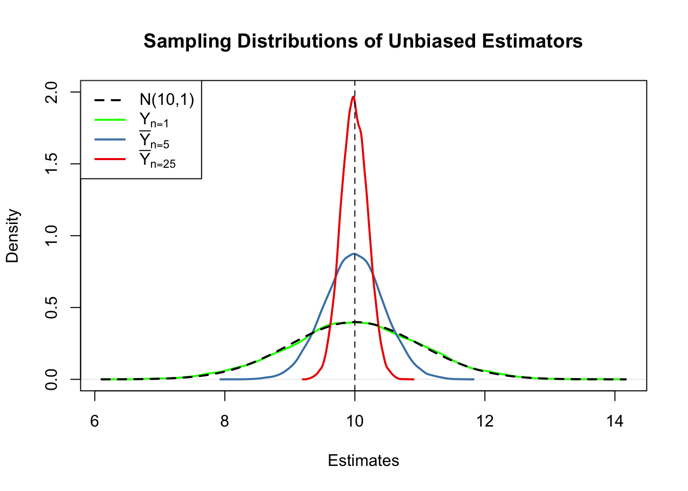

Notice that \@ref(eq:sqm) is a quadratic function so that there is only one minimum. The plot shows that this minimum lies exactly at the sample mean of the sample data.

\BeginKnitrBlock{rmdknit}<div class="rmdknit">Some <tt>R</tt> functions can only interact with functions that take a vector as an input and evaluate the function body on every entry of the vector, for example <tt>curve()</tt>. We call such functions vectorized functions and it is often a good idea to write vectorized functions yourself, although this is cumbersome in some cases. Having a vectorized function in <tt>R</tt> is never a drawback since these functions work on both single values and vectors.    

Let us look at the function <tt>sqm()</tt>, which is non-vectorized:

<tt>
sqm <- function(m) {  
&nbsp;&nbsp;&nbsp;&nbsp; sum((y-m)^2)   #body of the function    
}
</tt>
  
Providing, e.g., <tt>c(1,2,3)</tt> as the argument <tt>m</tt> would cause an error since then the operation <tt>y-m</tt> is invalid: the vectors <tt>y</tt> and <tt>m</tt> are of incompatible dimensions. This is why we cannot use <tt>sqm()</tt> in conjunction with <tt>curve()</tt>.

Here <tt>Vectorize()</tt> comes into play. It generates a vectorized version of a non-vectorized function.</div>\EndKnitrBlock{rmdknit}

#### Why Random Sampling is Important {-}

So far, we assumed (sometimes implicitly) that the observed data $Y_1, \dots, Y_n$ are the result of a sampling process that satisfies the assumption of simple random sampling. This assumption often is fulfilled when estimating a population mean using $\overline{Y}$. If this is not the case, estimates may be biased.

Let us fall back to <tt>pop</tt>, the fictive population of $10000$ observations and compute the population mean $\mu_{\texttt{pop}}$:


```r
# compute the population mean of pop
mean(pop)
#> [1] 9.992604
```

Next we sample $10$ observations from <tt>pop</tt> with <tt>sample()</tt> and estimate $\mu_{\texttt{pop}}$ using $\overline{Y}$ repeatedly. However, now we use a sampling scheme that deviates from simple random sampling: instead of ensuring that each member of the population has the same chance to end up in a sample, we assign a higher probability of being sampled to the $2500$ smallest observations of the population by setting the argument <tt>prob</tt> to a suitable vector of probability weights: 


```r
# simulate outcomes for the sample mean when the i.i.d. assumption fails
est3 <-  replicate(n = 25000, 
                   expr = mean(sample(x = sort(pop), 
                                      size = 10, 
                                      prob = c(rep(4, 2500), rep(1, 7500)))))

# compute the sample mean of the outcomes
mean(est3)
#> [1] 9.444113
```

Next we plot the sampling distribution of $\overline{Y}$ for this non-i.i.d. case and compare it to the sampling distribution when the i.i.d. assumption holds.


```r
# sampling distribution of sample mean, i.i.d. holds, n=25
plot(density(est2), 
      col = "steelblue",
      lwd = 2,
      xlim = c(8, 11),
      xlab = "Estimates",
      main = "When the i.i.d. Assumption Fails")

# sampling distribution of sample mean, i.i.d. fails, n=25
lines(density(est3),
      col = "red2",
      lwd = 2)

# add a legend
legend("topleft",
       legend = c(expression(bar(Y)[n == 25]~", i.i.d. fails"),
                  expression(bar(Y)[n == 25]~", i.i.d. holds")
                  ), 
       lty = c(1, 1), 
       col = c("red2", "steelblue"),
       lwd = 2)
```


Here, the failure of the i.i.d. assumption implies that, on average, we *underestimate* $\mu_Y$ using $\overline{Y}$: the corresponding distribution of $\overline{Y}$ is shifted to the left. In other words, $\overline{Y}$ is a *biased* estimator for $\mu_Y$ if the i.i.d. assumption does not hold.

## Hypothesis Tests Concerning the Population Mean

In this section we briefly review concepts in hypothesis testing and discuss how to conduct hypothesis tests in <tt>R</tt>. We focus on drawing inferences about an unknown population mean.

#### About Hypotheses and Hypothesis Testing {-}

In a significance test we want to exploit the information contained in a sample as evidence in favor or against a hypothesis. Essentially, hypotheses are simple questions that can be answered by 'yes' or 'no'. In a hypothesis test we typically deal with two different hypotheses:

- The *null hypothesis*, denoted $H_0$, is the hypothesis we are interested in testing.

- There must be an *alternative hypothesis*, denoted $H_1$, the hypothesis that is thought to hold if the null hypothesis is rejected. 

The null hypothesis that the population mean of $Y$ equals the value $\mu_{Y,0}$ is written as

$$ H_0: E(Y) = \mu_{Y,0}. $$

Often the alternative hypothesis chosen is the most general one,

$$ H_1: E(Y) \neq \mu_{Y,0}, $$

meaning that $E(Y)$ may be anything but the value under the null hypothesis. This is called a *two-sided* alternative.

For the sake of brevity, we only consider two-sided alternatives in the subsequent sections of this chapter.

### The p-Value {-}

Assume that the null hypothesis is *true*. The $p$-value is the probability of drawing data and observing a corresponding test statistic that is at least as adverse to what is stated under the null hypothesis as the test statistic actually computed using the sample data.

In the context of the population mean and the sample mean, this definition can be stated mathematically in the following way:

\begin{equation}
p \text{-value} = P_{H_0}\left[ \lvert \overline{Y} - \mu_{Y,0} \rvert > \lvert \overline{Y}^{act} - \mu_{Y,0} \rvert \right] (\#eq:pvalue)
\end{equation}

In \@ref(eq:pvalue), $\overline{Y}^{act}$ is the sample mean for the data at hand (a value). In order to compute the $p$-value as in \@ref(eq:pvalue), knowledge about the sampling distribution of $\overline{Y}$ (a random variable) when the null hypothesis is true (the *null distribution*) is required. However, in most cases the sampling distribution and thus the null distribution of $\overline{Y}$ are unknown. Fortunately, the CLT (see Key Concept 2.7) allows for the large-sample approximation $$ \overline{Y} \approx \mathcal{N}(\mu_{Y,0}, \, \sigma^2_{\overline{Y}}) \ \ , \ \ \sigma^2_{\overline{Y}} = \frac{\sigma_Y^2}{n}, $$ assuming the null hypothesis $H_0: E(Y) = \mu_{Y, 0}$ is true. With some algebra it follows for lage $n$ that

$$ \frac{\overline{Y} - \mu_{Y,0}}{\sigma_Y/\sqrt{n}} \sim \mathcal{N}(0,1). $$

So in large samples, the $p$-value can be computed *without* knowledge of the exact sampling distribution of $\overline{Y}$ using the above normal approximation.

### Calculating the p-Value when the Standard Deviation is Known {-}

For now, let us assume that $\sigma_{\overline{Y}}$ is known. Then, we can rewrite \@ref(eq:pvalue) as

\begin{align}
p \text{-value} =& \, P_{H_0}\left[ \left\lvert \frac{\overline{Y} - \mu_{Y,0}}{\sigma_{\overline{Y}}} \right\rvert > \left\lvert \frac{\overline{Y}^{act} - \mu_{Y,0}}{\sigma_{\overline{Y}}} \right\rvert \right] \\
=& \, 2 \cdot \Phi \left[ - \left\lvert \frac{\overline{Y}^{act} - \mu_{Y,0}}{\sigma_{\overline{Y}}}  \right\rvert\right].  (\#eq:pvaluenorm1)
\end{align}

The $p$-value is the area in the tails of the $\mathcal{N}(0,1)$ distribution that lies beyond

\begin{equation}
\pm \left\lvert \frac{\overline{Y}^{act} - \mu_{Y,0}}{\sigma_{\overline{Y}}} \right\rvert (\#eq:pvaluenorm2)
\end{equation}

We now use <tt>R</tt> to visualize what is stated in \@ref(eq:pvaluenorm1) and \@ref(eq:pvaluenorm2). The next code chunk replicates Figure 3.1 of the book.


```r
# plot the standard normal density on the interval [-4,4]
curve(dnorm(x),
      xlim = c(-4, 4),
      main = "Calculating a p-Value",
      yaxs = "i",
      xlab = "z",
      ylab = "",
      lwd = 2,
      axes = "F")

# add x-axis
axis(1, 
     at = c(-1.5, 0, 1.5), 
     padj = 0.75,
     labels = c(expression(-frac(bar(Y)^"act"~-~bar(mu)[Y,0], sigma[bar(Y)])),
                0,
                expression(frac(bar(Y)^"act"~-~bar(mu)[Y,0], sigma[bar(Y)]))))

# shade p-value/2 region in left tail
polygon(x = c(-6, seq(-6, -1.5, 0.01), -1.5),
        y = c(0, dnorm(seq(-6, -1.5, 0.01)),0), 
        col = "steelblue")

# shade p-value/2 region in right tail
polygon(x = c(1.5, seq(1.5, 6, 0.01), 6),
        y = c(0, dnorm(seq(1.5, 6, 0.01)), 0), 
        col = "steelblue")
```

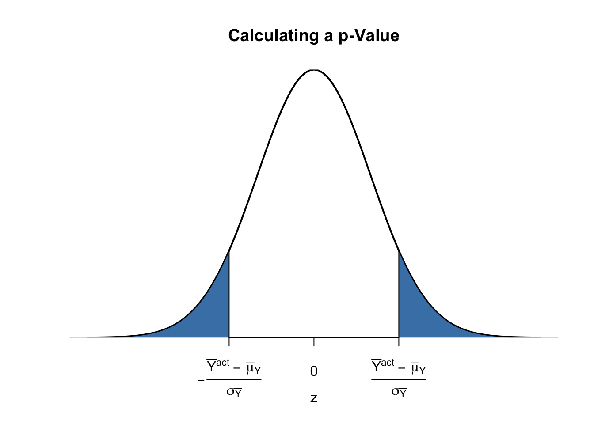

### Sample Variance, Sample Standard Deviation and Standard Error {- #SVSSDASE}

If $\sigma^2_Y$ is unknown, it must be estimated. This can be done using the sample variance

\begin{equation}
s_Y^2 = \frac{1}{n-1} \sum_{i=1}^n (Y_i - \overline{Y})^2.
\end{equation}

Furthermore

\begin{equation}
s_Y = \sqrt{\frac{1}{n-1} \sum_{i=1}^n (Y_i - \overline{Y})^2}
\end{equation}

is a suitable estimator for the standard deviation of $Y$. In <tt>R</tt>, $s_Y$ is implemented in the function <tt>sd()</tt>, see `?sd`.

Using <tt>R</tt> we can illustrate that $s_Y$ is a consistent estimator for $\sigma_Y$, that is

$$ s_Y \overset{p}{\longrightarrow} \sigma_Y. $$

The idea here is to generate a large number of samples $Y_1,\dots,Y_n$ where, $Y\sim \mathcal{N}(10, 9)$ say, estimate $\sigma_Y$ using $s_Y$ and investigate how the distribution of $s_Y$ changes as $n$ gets larger.


```r
# vector of sample sizes
n <- c(10000, 5000, 2000, 1000, 500)

# sample observations, estimate using 'sd()' and plot the estimated distributions
sq_y <- replicate(n = 10000, expr = sd(rnorm(n[1], 10, 3)))
plot(density(sq_y),
     main = expression("Sampling Distributions o" ~ s[Y]),
     xlab = expression(s[y]),
     lwd = 2)

for (i in 2:length(n)) {
  sq_y <- replicate(n = 10000, expr = sd(rnorm(n[i], 10, 3)))
  lines(density(sq_y), 
        col = i, 
        lwd = 2)
}

# add a legend
legend("topleft",
       legend = c(expression(n == 10000),
                  expression(n == 5000),
                  expression(n == 2000),
                  expression(n == 1000),
                  expression(n == 500)), 
       col = 1:5,
       lwd = 2)
```

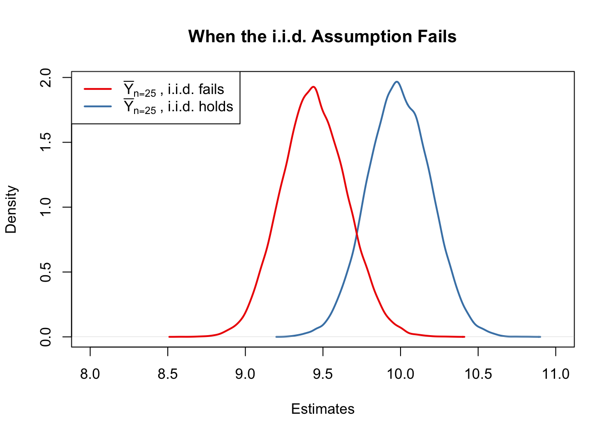

The plot shows that the distribution of $s_Y$ tightens around the true value $\sigma_Y = 3$ as $n$ increases.

The function that estimates the standard deviation of an estimator is called the *standard error of the estimator*. Key Concept 3.4 summarizes the terminology in the context of the sample mean.


<div class = "keyconcept" id="KC3.4">
<h3 class = "right"> Key Concept 3.4 </h3>          
<h3 class = "left"> The Standard Error of $\overline{Y}$ </h3>

Take an i.i.d. sample $Y_1, \dots, Y_n$. The mean of $Y$ is consistently estimated by $\overline{Y}$, the sample mean of the $Y_i$. Since $\overline{Y}$ is a random variable, it has a sampling distribution with variance $\frac{\sigma_Y^2}{n}$.

The standard error of $\overline{Y}$, denoted $SE(\overline{Y})$ is an estimator of the standard deviation of $\overline{Y}$:

$$ SE(\overline{Y}) = \hat\sigma_{\overline{Y}} = \frac{s_Y}{\sqrt{n}} $$

The caret (^) over $\sigma$ indicates that $\hat\sigma_{\overline{Y}}$ is an estimator for $\sigma_{\overline{Y}}$. 
</div>


As an example to underpin Key Concept 3.4, consider a sample of $n=100$ i.i.d. observations of the Bernoulli distributed variable $Y$ with success probability $p=0.1$. Thus $E(Y)=p=0.1$ and $\text{Var}(Y)=p(1-p)$. $E(Y)$ can be estimated by $\overline{Y}$, which then has variance

$$ \sigma^2_{\overline{Y}} = p(1-p)/n = 0.0009 $$

and standard deviation

$$ \sigma_{\overline{Y}} = \sqrt{p(1-p)/n} = 0.03. $$

In this case the standard error of $\overline{Y}$ can be estimated by

$$ SE(\overline{Y}) = \sqrt{\overline{Y}(1-\overline{Y})/n}. $$

Let us check whether $\overline{Y}$ and $SE(\overline{Y})$ estimate the respective true values, on average.


```r
# draw 10000 samples of size 100 and estimate the mean of Y and
# estimate the standard error of the sample mean

mean_estimates <- numeric(10000)
se_estimates <- numeric(10000)

for (i in 1:10000) {
  
  s <- sample(0:1, 
              size = 100,  
              prob = c(0.9, 0.1),
              replace = T)
  
  mean_estimates[i] <- mean(s)
  se_estimates[i] <- sqrt(mean(s) * (1 - mean(s)) / 100)

}

mean(mean_estimates)
#> [1] 0.10047
mean(se_estimates)
#> [1] 0.02961587
```

Both estimators seem to be unbiased for the true parameters. In fact, this is true for the sample mean, but not for $SE(\overline{Y})$. However, both estimators are *consistent* for the true parameters.

### Calculating the p-value When the Standard Deviation is Unknown {-}

When $\sigma_Y$ is unknown, the $p$-value for a hypothesis test concerning $\mu_Y$ using $\overline{Y}$ can be computed by replacing $\sigma_{\overline{Y}}$ in \@ref(eq:pvaluenorm1) by the standard error $SE(\overline{Y}) = \hat\sigma_{\overline{Y}}$. Then,

$$ p\text{-value} = 2\cdot\Phi\left(-\left\lvert \frac{\overline{Y}^{act}-\mu_{Y,0}}{SE(\overline{Y})} \right\rvert \right). $$

This is easily done in <tt>R</tt>:


```r
# sample and estimate, compute standard error
samplemean_act <- mean(
  sample(0:1, 
         prob = c(0.9, 0.1), 
         replace = T, 
         size = 100))

SE_samplemean <- sqrt(samplemean_act * (1 - samplemean_act) / 100)

# null hypothesis
mean_h0 <- 0.1

# compute the p-value
pvalue <- 2 * pnorm(- abs(samplemean_act - mean_h0) / SE_samplemean)
pvalue
#> [1] 0.7492705
```

Later in the book, we will encounter more convenient approaches to obtain $t$-statistics and $p$-values using <tt>R</tt>.

### The t-statistic {-}

In hypothesis testing, the standardized sample average

\begin{equation}
t = \frac{\overline{Y} - \mu_{Y,0}}{SE(\overline{Y})} (\#eq:tstat)
\end{equation}

is called a $t$-statistic. This $t$-statistic plays an important role in testing hypotheses about $\mu_Y$. It is a prominent example of a test statistic.

Implicitly, we already have computed a $t$-statistic for $\overline{Y}$ in the previous code chunk.


```r
# compute a t-statistic for the sample mean
tstatistic <- (samplemean_act - mean_h0) / SE_samplemean
tstatistic
#> [1] 0.3196014
```

Using <tt>R</tt> we can illustrate that if $\mu_{Y,0}$ equals the true value, that is, if the null hypothesis is true, \@ref(eq:tstat) is approximately $\mathcal{N}(0,1)$ distributed when $n$ is large.


```r
# prepare empty vector for t-statistics
tstatistics <- numeric(10000)

# set sample size
n <- 300

# simulate 10000 t-statistics
for (i in 1:10000) {
  
  s <- sample(0:1, 
              size = n,  
              prob = c(0.9, 0.1),
              replace = T)
  
  tstatistics[i] <- (mean(s)-0.1)/sqrt(var(s)/n)
  
}
```

In the simulation above we estimate the variance of the $Y_i$ using <tt>var(s)</tt>. This is more general then <tt>mean(s)*(1-mean(s))</tt> since the latter requires that the data are Bernoulli distributed and that we know this.


```r
# plot density and compare to N(0,1) density
plot(density(tstatistics),
     xlab = "t-statistic",
     main = "Estimated Distribution of the t-statistic when n=300",
     lwd = 2,
     xlim = c(-4, 4),
     col = "steelblue")

# N(0,1) density (dashed)
curve(dnorm(x), 
      add = T, 
      lty = 2, 
      lwd = 2)
```


Judging from the plot, the normal approximation works reasonably well for the chosen sample size. This normal approximation has already been used in the definition of the $p$-value, see \@ref(eq:tstat).

### Hypothesis Testing with a Prespecified Significance Level {-}


<div class = "keyconcept" id="KC3.5">
<h3 class = "right"> Key Concept 3.5 </h3>          
<h3 class = "left"> The Terminology of Hypothesis Testing </h3>

In hypothesis testing, two types of mistakes are possible:

1. The null hypothesis *is* rejected although it is true (type-I-error)  

2. The null hypothesis *is not* rejected although it is false (type-II-error) 

The **significance level** of the test is the probability to commit a type-I-error we are willing to accept in advance. E.g., using a prespecified significance level of $0.05$, we reject the null hypothesis if and only if the $p$-value is less than $0.05$. The significance level is chosen before the test is conducted.

An equivalent procedure is to reject the null hypothesis if the observed test statistic is, in absolute value terms, larger than the **critical value** of the test statistic. The critical value is determined by the significance level chosen and defines two disjoint sets of values which are called **acceptance region** and **rejection region**. The acceptance region contains all values of the test statistic for which the test does not reject while the rejection region contains all the values for which the test does reject.

The **$p$-value** is the probability that, in repeated sampling under the same conditions a test statistic is observed that provides just as much evidence against the null hypothesis as the test statistic actually observed.

The actual probability that the test rejects the true null hypothesis is called the **size of the test**. In an ideal setting, the size does equals the significance level.

The probability that the test correctly rejects a false null hypothesis is called **power**. 

</div>


Reconsider the <tt>pvalue</tt> computed further above:


```r
# check whether p-value < 0.05
pvalue < 0.05
#> [1] FALSE
```

The condition is not fulfilled so we do not reject the null hypothesis correctly.

When working with a $t$-statistic instead, it is equivalent to apply the following rule:

$$ \text{Reject } H_0 \text{ if } \lvert t^{act} \rvert > 1.96 $$

We reject the null hypothesis at the significance level of $5\%$ if the computed $t$-statistic lies beyond the critical value of 1.96 in absolute value terms. $1.96$ is the $0.975$-quantile of the standard normal distribution.


```r
# check the critical value
qnorm(p = 0.975)
#> [1] 1.959964

# check whether the null is rejected using the t-statistic computed further above
abs(tstatistic) > 1.96
#> [1] FALSE
```

Just like using the $p$-value, we cannot reject the null hypothesis using the corresponding $t$-statistic. Key Concept 3.6 summarizes the procedure of performing a two-sided hypothesis test about the population mean $E(Y)$.


<div class = "keyconcept" id="KC3.6">
<h3 class = "right"> Key Concept 3.6 </h3>          
<h3 class = "left"> Testing the Hypothesis $E(Y) = \mu_{Y,0}$ Against the Alternative $E(Y) \neq \mu_{Y,0}$ </h3>

1. Estimate $\mu_{Y}$ using $\overline{Y}$ and compute the $SE(\overline{Y})$, standard error of $\overline{Y}$.

2. Compute the $t$-statistic.

3. Compute the $p$-value and reject the null hypothesis at the $5\%$ level of significance if the $p$-value is smaller than $0.05$ or, equivalently, if
$$ \left\lvert t^{act} \right\rvert > 1.96. $$
</div>


### One-sided Alternatives {-}

Sometimes we are interested in testing if the mean is bigger or smaller than some value hypothesized under the null. To stick to the book, take the presumed wage gap between well and less educated working individuals. Since we anticipate that such a differential exists, a relevant alternative (to the null hypothesis that there is no wage differential) is that well educated individuals earn more, i.e., that the average hourly wage for this group, $\mu_Y$ is *bigger* than $\mu_{Y,0}$, the average wage of less educated workers which we assume to be known here for simplicity (Section \@ref{cmfdp} discusses how to test the equivalence of to unknown population means).

This is an example of a *right-sided test* and the hypotheses pair is chosen to be

$$ H_0: \mu_Y = \mu_{Y,0} \ \ \text{vs} \ \ H_1: \mu_Y > \mu_{Y,0}. $$

We reject the null hypothesis if the computed test-statistic is larger than the critical value $1.64$, the $0.95$-quantile of the $\mathcal{N}(0,1)$ distribution. This ensures that $1-0.95=5\%$ probability mass remains in the area to the right of the critical value. As before, we can visualize this in <tt>R</tt> using the function <tt>polygon()</tt>. 


```r
# plot the standard normal density on the domain [-4,4]
curve(dnorm(x),
      xlim = c(-4, 4),
      main = "Rejection Region of a Right-Sided Test",
      yaxs = "i",
      xlab = "t-statistic",
      ylab = "",
      lwd = 2,
      axes = "F")

# add the x-axis
axis(1, 
     at = c(-4, 0, 1.64, 4), 
     padj = 0.5,
     labels = c("", 0, expression(Phi^-1~(.95)==1.64), ""))

# shade the rejection region in the left tail
polygon(x = c(1.64, seq(1.64, 4, 0.01), 4),
        y = c(0, dnorm(seq(1.64, 4, 0.01)), 0), 
        col = "darkred")
```


Analogously, for the left-sided test we have  $$H_0: \mu_Y = \mu_{Y,0} \ \ \text{vs.} \ \ H_1: \mu_Y < \mu_{Y,0}.$$ The null is rejected if the observed test statistic falls short of the critical value which, for a test at the $0.05$ level of significance, is given by $-1.64$, the $0.05$-quantile of the $\mathcal{N}(0,1)$ distribution. $5\%$ probability mass lies to the left of the critical value.

It is straightforward to adapt the code chunk above to the case of a left-sided test. We only have to adjust the color shading and the tick marks.


```r
# plot the the standard normal density on the domain [-4,4]
curve(dnorm(x),
      xlim = c(-4, 4),
      main = "Rejection Region of a Left-Sided Test",
      yaxs = "i",
      xlab = "t-statistic",
      ylab = "",
      lwd = 2,
      axes = "F")

# add x-axis
axis(1, 
     at = c(-4, 0, -1.64, 4), 
     padj = 0.5,
     labels = c("", 0, expression(Phi^-1~(.05)==-1.64), ""))

# shade rejection region in right tail
polygon(x = c(-4, seq(-4, -1.64, 0.01), -1.64),
        y = c(0, dnorm(seq(-4, -1.64, 0.01)), 0), 
        col = "darkred")
```


## Confidence Intervals for the Population Mean

As stressed before, we will never estimate the *exact* value of the population mean of $Y$ using a random sample. However, we can compute confidence intervals for the population mean. In general, a confidence interval for an unknown parameter is a recipe that, in repeated samples, yields intervals that contain the true parameter with a prespecified probability, the *confidence level*. Confidence intervals are computed using the information available in the sample. Since this information is the result of a random process, confidence intervals are random variables themselves.

Key Concept 3.7 shows how to compute confidence intervals for the unknown population mean $E(Y)$.


<div class = "keyconcept" id="KC3.7">
<h3 class = "right"> Key Concept 3.7 </h3>          
<h3 class = "left"> Confidence Intervals for the Population Mean </h3>

A $95\%$ confidence interval for $\mu_Y$ is a random variable that contains the true $\mu_Y$ in $95\%$ of all possible random samples. When $n$ is large we can use the normal approximation. Then, $99\%$, $95\%$, $90\%$ confidence intervals are

\begin{align}
&99\%\text{ confidence interval for } \mu_Y = \left[ \overline{Y} \pm 2.58 \times SE(\overline{Y}) \right], \\
&95\%\text{ confidence interval for } \mu_Y = \left[\overline{Y} \pm 1.96 \times SE(\overline{Y}) \right], \\
&90\%\text{ confidence interval for } \mu_Y = \left[ \overline{Y} \pm 1.64 \times SE(\overline{Y}) \right].
\end{align}

These confidence intervals are sets of null hypotheses we cannot reject in a two-sided hypothesis test at the given level of confidence.

Now consider the following statements.

1. In repeated sampling, the interval
$$ \left[ \overline{Y} \pm 1.96 \times SE(\overline{Y}) \right] $$
covers the true value of $\mu_Y$ with a probability of $95\%$.

2. We have computed $\overline{Y} = 5.1$ and $SE(\overline{Y})=2.5$ so the interval
$$ \left[ 5.1  \pm 1.96 \times 2.5 \right] = \left[0.2,10\right] $$ covers the true value of $\mu_Y$ with a probability of $95\%$.

While 1. is right (this is in line with the definition above), 2. is wrong and none of your lecturers wants to read such a sentence in a term paper, written exam or similar, believe us.
The difference is that, while 1. is the definition of a random variable, 2. is one possible *outcome* of this random variable so there is no meaning in making any probabilistic statement about it. Either the computed interval does cover $\mu_Y$ *or* it does not!

</div>


In <tt>R</tt>, testing of hypotheses about the mean of a population on the basis of a random sample is very easy due to functions like <tt>t.test()</tt> from the <tt>stats</tt> package. It produces an object of type <tt>list</tt>. Luckily, one of the most simple ways to use <tt>t.test()</tt> is when you want to obtain a $95\%$ confidence interval for some population mean. We start by generating some random data and calling <tt>t.test()</tt> in conjunction with <tt>ls()</tt> to obtain a breakdown of the output components.


```r
# set seed
set.seed(1)

# generate some sample data
sampledata <- rnorm(100, 10, 10)

# check the type of the outcome produced by t.test
typeof(t.test(sampledata))
#> [1] "list"

# display the list elements produced by t.test
ls(t.test(sampledata))
#>  [1] "alternative" "conf.int"    "data.name"   "estimate"    "method"     
#>  [6] "null.value"  "p.value"     "parameter"   "statistic"   "stderr"
```

Though we find that many items are reported, at the moment we are only interested in computing a $95\%$ confidence set for the mean.


```r
t.test(sampledata)$"conf.int"
#> [1]  9.306651 12.871096
#> attr(,"conf.level")
#> [1] 0.95
```

This tells us that the $95\%$ confidence interval is

$$ \left[9.31, 12.87\right]. $$

In this example, the computed interval obviously does cover the true $\mu_Y$ which we know to be $10$.

Let us have a look at the whole standard output produced by <tt>t.test()</tt>.


```r
t.test(sampledata)
#> 
#> 	One Sample t-test
#> 
#> data:  sampledata
#> t = 12.346, df = 99, p-value < 2.2e-16
#> alternative hypothesis: true mean is not equal to 0
#> 95 percent confidence interval:
#>   9.306651 12.871096
#> sample estimates:
#> mean of x 
#>  11.08887
```

We see that <tt>t.test()</tt> does not only compute a $95\%$ confidence interval but automatically conducts a two-sided significance test of the hypothesis $H_0: \mu_Y = 0$ at the level of $5\%$ and reports relevant parameters thereof: the alternative hypothesis, the estimated mean, the resulting $t$-statistic, the degrees of freedom of the underlying $t$ distribution (<tt>t.test()</tt> does use perform the normal approximation) and the corresponding $p$-value. This is very convenient!

In this example, we come to the conclusion that the population mean *is* significantly different from $0$ (which is correct) at the level of $5\%$, since $\mu_Y = 0$ is not an element of the $95\%$ confidence interval

$$ 0 \not\in \left[9.31,12.87\right]. $$
We come to an equivalent result when using the $p$-value rejection rule since

$$ p\text{-value} = 2.2\cdot 10^{-16} \ll 0.05. $$

## Comparing Means from Different Populations {#cmfdp}

Suppose you are interested in the means of two different populations, denote them $\mu_1$ and $\mu_2$. More specifically, you are interested whether these population means are different from each other and plan to use a hypothesis test to verify this on the basis of independent sample data from both populations. A suitable pair of hypotheses is

\begin{equation}
H_0: \mu_1 - \mu_2 = d_0 \ \ \text{vs.} \ \ H_1: \mu_1 - \mu_2 \neq d_0 (\#eq:hypmeans)
\end{equation}

where $d_0$ denotes the hypothesized difference in means (so $d_0=0$ when the means are equal, under the null hypothesis). The book teaches us that $H_0$ can be tested with the $t$-statistic

\begin{equation}
t=\frac{(\overline{Y}_1 - \overline{Y}_2) - d_0}{SE(\overline{Y}_1 - \overline{Y}_2)} (\#eq:tstatmeans)
\end{equation}

where 

\begin{equation}
SE(\overline{Y}_1 - \overline{Y}_2) = \sqrt{\frac{s_1^2}{n_1} + \frac{s_2^2}{n_2}}.
\end{equation}

This is called a two sample $t$-test. For large $n_1$ and $n_2$, \@ref(eq:tstatmeans) is standard normal under the null hypothesis. Analogously to the simple $t$-test we can compute confidence intervals for the true difference in population means:

$$ (\overline{Y}_1 - \overline{Y}_2) \pm 1.96 \times SE(\overline{Y}_1 - \overline{Y}_2) $$

is a $95\%$ confidence interval for $d$. <br> In <tt>R</tt>, hypotheses as in \@ref(eq:hypmeans) can be tested with <tt>t.test()</tt>, too. Note that <tt>t.test()</tt> chooses $d_0 = 0$ by default. This can be changed by setting the argument <tt>mu</tt> accordingly.

The subsequent code chunk demonstrates how to perform a two sample $t$-test in <tt>R</tt> using simulated data.

```r
# set random seed
set.seed(1)

# draw data from two different populations with equal mean
sample_pop1 <- rnorm(100, 10, 10)
sample_pop2 <- rnorm(100, 10, 20)

# perform a two sample t-test
t.test(sample_pop1, sample_pop2)
#> 
#> 	Welch Two Sample t-test
#> 
#> data:  sample_pop1 and sample_pop2
#> t = 0.872, df = 140.52, p-value = 0.3847
#> alternative hypothesis: true difference in means is not equal to 0
#> 95 percent confidence interval:
#>  -2.338012  6.028083
#> sample estimates:
#> mean of x mean of y 
#> 11.088874  9.243838
```

We find that the two sample $t$-test does not reject the (true) null hypothesis that $d_0 = 0$.

## An Application to the Gender Gap of Earnings {#aattggoe}

This section discusses how to reproduce the results presented in the box *The Gender Gap of Earnings of College Graduates in the United States* of the book.

In order to reproduce Table 3.1 of the book you need to download the replication data which are hosted by Pearson and can be downloaded [here](https://wps.pearsoned.com/wps/media/objects/11422/11696965/datasets3e/datasets/cps_ch3.xlsx). This file contains data that range from $1992$ to $2008$ and earnings are reported in prices of $2008$.

There are several ways to import the <tt>.xlsx</tt>-files into <tt>R</tt>. Our suggestion is the function <tt>read_excel()</tt> from the <tt>readxl</tt> package [@R-readxl]. The package is not part of <tt>R</tt>'s base version and has to be installed manually.


```r
# load the 'readxl' package
library(readxl)
```

You are now ready to import the dataset. Make sure you use the correct path to import the downloaded file! In our example, the file is saved in a subfolder of the working directory named <tt>data</tt>. If you are not sure what your current working directory is, use <tt>getwd()</tt>, see also <tt>?getwd</tt>. This will give you the path that points to the place <tt>R</tt> is currently looking for files to work with.


```r
# import the data into R
cps <- read_excel(path = "data/cps_ch3.xlsx")
```

Next, install and load the package <tt>dyplr</tt> [@R-dplyr]. This package provides some handy functions that simplify data wrangling a lot. It makes use of the <tt>%>%</tt> operator.


```r
# load the 'dplyr' package
library(dplyr)
```

First, get an overview over the dataset. Next, use <tt>%>%</tt> and some functions from the <tt>dplyr</tt> package to group the observations by gender and year and compute descriptive statistics for both groups.


```r
# get an overview of the data structure
head(cps)
#> # A tibble: 6 × 3
#>   a_sex  year ahe08
#>   <dbl> <dbl> <dbl>
#> 1     1  1992  17.2
#> 2     1  1992  15.3
#> 3     1  1992  22.9
#> 4     2  1992  13.3
#> 5     1  1992  22.1
#> 6     2  1992  12.2

# group data by gender and year and compute the mean, standard deviation
# and number of observations for each group
avgs <- cps %>% 
        group_by(a_sex, year) %>% 
        summarise(mean(ahe08), 
                  sd(ahe08), 
                  n())

# print the results to the console
print(avgs)
#> # A tibble: 10 × 5
#> # Groups:   a_sex [2]
#>    a_sex  year `mean(ahe08)` `sd(ahe08)` `n()`
#>    <dbl> <dbl>         <dbl>       <dbl> <int>
#>  1     1  1992          23.3       10.2   1594
#>  2     1  1996          22.5       10.1   1379
#>  3     1  2000          24.9       11.6   1303
#>  4     1  2004          25.1       12.0   1894
#>  5     1  2008          25.0       11.8   1838
#>  6     2  1992          20.0        7.87  1368
#>  7     2  1996          19.0        7.95  1230
#>  8     2  2000          20.7        9.36  1181
#>  9     2  2004          21.0        9.36  1735
#> 10     2  2008          20.9        9.66  1871
```

With the pipe operator <tt>%>%</tt> we simply chain different <tt>R</tt> functions that produce compatible input and output. In the code above, we take the dataset <tt>cps</tt> and use it as an input for the function <tt>group_by()</tt>. The output of <tt>group_by</tt> is subsequently used as an input for <tt>summarise()</tt> and so forth.

Now that we have computed the statistics of interest for both genders, we can investigate how the gap in earnings between both groups evolves over time.


```r
# split the dataset by gender
male <- avgs %>% dplyr::filter(a_sex == 1) 

female <- avgs %>% dplyr::filter(a_sex == 2)

# rename columns of both splits
colnames(male)   <- c("Sex", "Year", "Y_bar_m", "s_m", "n_m")
colnames(female) <- c("Sex", "Year", "Y_bar_f", "s_f", "n_f")

# estimate gender gaps, compute standard errors and confidence intervals for all dates
gap <- male$Y_bar_m - female$Y_bar_f

gap_se <- sqrt(male$s_m^2 / male$n_m + female$s_f^2 / female$n_f)

gap_ci_l <- gap - 1.96 * gap_se

gap_ci_u <- gap + 1.96 * gap_se

result <- cbind(male[,-1], female[,-(1:2)], gap, gap_se, gap_ci_l, gap_ci_u)

# print the results to the console
print(result, digits = 3)
#>   Year Y_bar_m  s_m  n_m Y_bar_f  s_f  n_f  gap gap_se gap_ci_l gap_ci_u
#> 1 1992    23.3 10.2 1594    20.0 7.87 1368 3.23  0.332     2.58     3.88
#> 2 1996    22.5 10.1 1379    19.0 7.95 1230 3.49  0.354     2.80     4.19
#> 3 2000    24.9 11.6 1303    20.7 9.36 1181 4.14  0.421     3.32     4.97
#> 4 2004    25.1 12.0 1894    21.0 9.36 1735 4.10  0.356     3.40     4.80
#> 5 2008    25.0 11.8 1838    20.9 9.66 1871 4.10  0.354     3.41     4.80
```

We observe virtually the same results as the ones presented in the book. The computed statistics suggest that there *is* a gender gap in earnings. Note that we can reject the null hypothesis that the gap is zero for all periods. Further, estimates of the gap and bounds of the $95\%$ confidence intervals indicate that the gap has been quite stable in the recent past.

## Scatterplots, Sample Covariance and Sample Correlation

A scatter plot represents two dimensional data, for example $n$ observation on $X_i$ and $Y_i$, by points in a coordinate system. It is very easy to generate scatter plots using the <tt>plot()</tt> function in <tt>R</tt>. Let us generate some artificial data on age and earnings of workers and plot it.


```r
# set random seed
set.seed(123)

# generate dataset
X <- runif(n = 100, 
           min = 18, 
           max = 70)

Y <- X + rnorm(n=100, 50, 15)

# plot observations
plot(X, 
     Y, 
     type = "p",
     main = "A Scatterplot of X and Y",
     xlab = "Age",
     ylab = "Earnings",
     col = "steelblue",
     pch = 19)
```


The plot shows positive correlation between age and earnings. This is in line with the notion that older workers earn more than those who joined the working population recently.

#### Sample Covariance and Correlation {-}

By now you should be familiar with the concepts of variance and covariance. If not, we recommend you to work your way through Chapter 2 of the book. 

Just like the variance, covariance and correlation of two variables are properties that relate to the (unknown) joint probability distribution of these variables. We can estimate covariance and correlation by means of suitable estimators using a sample $(X_i,Y_i)$, $i=1,\dots,n$. 

The sample covariance 

$$ s_{XY} = \frac{1}{n-1} \sum_{i=1}^n (X_i - \overline{X})(Y_i - \overline{Y}) $$

is an estimator for the population variance of $X$ and $Y$ whereas the sample correlation

$$ r_{XY} = \frac{s_{XY}}{s_Xs_Y} $$
can be used to estimate the population correlation, a standardized measure for the strength of the linear relationship between $X$ and $Y$. See Chapter 3.7 in the book for a more detailed treatment of these estimators.

As for variance and standard deviation, these estimators are implemented as <tt>R</tt> functions in the <tt>stats</tt> package. We can use them to estimate population covariance and population correlation of the artificial data on age and earnings.


```r
# compute sample covariance of X and Y
cov(X, Y)
#> [1] 213.934

# compute sample correlation between X and Y
cor(X, Y)
#> [1] 0.706372

# an equivalent way to compute the sample correlation
cov(X, Y) / (sd(X) * sd(Y))
#> [1] 0.706372
```

The estimates indicate that $X$ and $Y$ are moderately correlated.

The next code chunk uses the function <tt>mvnorm()</tt> from package <tt>MASS</tt> [@R-MASS] to generate bivariate sample data with different degrees of correlation. 


```r
library(MASS)

# set random seed
set.seed(1)

# positive correlation (0.81)
example1 <- mvrnorm(100,
                    mu = c(0, 0), 
                    Sigma = matrix(c(2, 2, 2, 3), ncol = 2),
                    empirical = TRUE)

# negative correlation (-0.81)
example2 <- mvrnorm(100,
                    mu = c(0, 0), 
                    Sigma = matrix(c(2, -2, -2, 3), ncol = 2),
                    empirical = TRUE)

# no correlation 
example3 <- mvrnorm(100,
                    mu = c(0, 0), 
                    Sigma = matrix(c(1, 0, 0, 1), ncol = 2),
                    empirical = TRUE)

# no correlation (quadratic relationship)
X <- seq(-3, 3, 0.01)
Y <- - X^2 + rnorm(length(X))

example4 <- cbind(X, Y)

# divide plot area as 2-by-2 array
par(mfrow = c(2, 2))

# plot datasets
plot(example1, col = "steelblue", pch = 20, xlab = "X", ylab = "Y", 
     main = "Correlation = 0.81")

plot(example2, col = "steelblue", pch = 20, xlab = "X", ylab = "Y", 
     main = "Correlation = -0.81")

plot(example3, col = "steelblue", pch = 20, xlab = "X", ylab = "Y", 
     main = "Correlation = 0")

plot(example4, col = "steelblue", pch = 20, xlab = "X", ylab = "Y", 
     main = "Correlation = 0")
```


## Exercises {#exercises-3}


<div  class = "DCexercise">

#### 1. Biased ... {-}

Consider the following alternative estimator for $\mu_Y$, the mean of the $Y_i$

$$\widetilde{Y}=\frac{1}{n-1}\sum\limits_{i=1}^n Y_i$$

In this exercise we will illustrate that this estimator is a biased estimator for $\mu_Y$.

**Instructions:**

  + Define a function <tt>Y_tilde</tt> that implements the estimator above.
  
  + Randomly draw 5 observations from the $\mathcal{N}(10, 25)$ distribution and compute an estimate using <tt>Y_tilde()</tt>. Repeat this procedure 10000 times and store the results in <tt>est_biased</tt>. 
  
  + Plot a histogram of <tt>est_biased</tt>.
  
  + Add a red vertical line at $\mu=10$ using the function <tt>abline()</tt>.
  
<iframe src="DCL/ex3_1.html" frameborder="0" scrolling="no" style="width:100%;height:400px"></iframe>

**Hints:**

  + To compute the sum of a vector you can use <tt>sum()</tt>, to get the length of a vector you can use <tt>length()</tt>.
  
  + Use the function <tt>replicate()</tt> to compute repeatedly estimates of random samples. With the arguments <tt>expr</tt> and <tt>n</tt> you can specify the operation and how often it has to be replicated.
  
  + A histogram can be plotted with the function <tt>hist()</tt>.
  
  + The point on the x-axis as well as the color for the vertical line can be specified via the arguments <tt>v</tt> and <tt>col</tt>.

</div>


<div  class = "DCexercise">

#### 2. ... but consistent estimator {-}

Consider again the estimator from the previous exercise. It is available in your environment as the function <tt>Y_tilde()</tt>. You are requested to do the same procedure as in the previous exercise. This time, however, increase the number of observations to draw from 5 to 1000. 

What do you notice? What can you say about this estimator?

**Instructions:**

  + Randomly draw 1000 observations from the $\mathcal{N}(10, 25)$ distribution and compute an estimate of the mean using <tt>Y_tilde()</tt>. Repeat this procedure 10000 times and store the results in <tt>est_consistent</tt>. 
  
  + Plot a histogram of <tt>est_consistent</tt>.
  
  + Add a red vertical line at $\mu=10$ using the function <tt>abline()</tt>.
  
<iframe src="DCL/ex3_2.html" frameborder="0" scrolling="no" style="width:100%;height:340px"></iframe>

**Hints:**

  + Use the function <tt>replicate()</tt> to compute estimates of repeatedly drawn random samples. Using the arguments <tt>expr</tt> and <tt>n</tt> you may specify the operation and how often it will be replicated.
  
  + A histogram can be plotted with the function <tt>hist()</tt>.
  
  + The position on the x-axis as well as the color for the vertical line can be specified via the arguments <tt>v</tt> and <tt>col</tt>.

</div>


<div  class = "DCexercise">

#### 3. Efficiency of an Estimator {-}

In this exercise we want to illustrate the result that the sample mean

$$\hat{\mu}_Y=\sum\limits_{i=1}^{n}a_iY_i$$ with the equal weighting scheme $a_i=\frac{1}{n}$ for $i=1,...,n$ is the best linear unbiased estimator (BLUE) of $\mu_Y$. 

As an alternative, consider the estimator

$$\tilde{\mu}_Y=\sum\limits_{i=1}^{n}b_iY_i$$

where $b_i$ gives the first $\frac{n}{2}$ observations a higher weighting than the second $\frac{n}{2}$ observations (we assume that $n$ is even for simplicity). 

The vector of weights <tt>w</tt> has been defined already and is available in your working environment.

**Instructions:**

  + Verify that $\tilde{\mu}$ is an unbiased estimator of $\mu_Y$, the mean of the $Y_i$.
  
  + Implement the alternative estimator of $\mu_Y$ as a function <tt>mu_tilde()</tt>.

  + Randomly draw 100 observations from the $\mathcal{N}(5, 10)$ distribution and compute estimates with both estimators. Repeat this procedure 10000 times and store the results in <tt>est_bar</tt> and <tt>est_tilde</tt>.
  
  + Compute the sample variances of <tt>est_bar</tt> and <tt>est_tilde</tt>. What can you say about both estimators?
  
<iframe src="DCL/ex3_3.html" frameborder="0" scrolling="no" style="width:100%;height:420px"></iframe>

**Hints:**

  + In order for $\tilde{\mu}$ to be an unbiased estimator all weights have to sum up to 1.
  
  + Use the function <tt>replicate()</tt> to compute estimates of repeatedly drawn samples. With the arguments <tt>expr</tt> and <tt>n</tt> you can specify the operation and how often it is replicated.

  + You may use <tt>var()</tt> the compute the sample variance.

</div>


<div  class = "DCexercise">

#### 4. Hypothesis Test --- $t$-statistic {-}

Consider the CPS dataset from Chapter \@ref(aattggoe) again. The dataset <tt>cps</tt> is available in your working environment.

We suppose that the average hourly earnings (in prices of 2012) <tt>ahe12</tt> exceed 23.50 $\$/h$ and wish to test this hypothesis at a significance level of $\alpha=0.05$. Please do the following:

**Instructions:**

  + Compute the test statistic by hand and assign it to <tt>tstat</tt>.
  
  + Use <tt>tstat</tt> to accept or reject the null hypothesis. Please do so using the normal approximation. 
  
<iframe src="DCL/ex3_4.html" frameborder="0" scrolling="no" style="width:100%;height:340px"></iframe>

**Hints:**

  + We test $H_0:\mu_{Y_{ahe}}\leq 23.5$ vs. $H_1:\mu_{Y_{ahe}}>23.5$. That is, we conduct a right-sided test.
  
  + The $t$-statistic is defined as $\frac{\bar{Y}-\mu_{Y,0}}{s_{Y}/\sqrt{n}}$ where $s_Y$ denotes the sample variance.

  + To decide whether the null hypothesis is accepted or rejected you can compare the $t$-statistic with the respective quantile of the standard normal distribution. Use logical operators.

</div>


<div  class = "DCexercise">

#### 5. Hypothesis Test --- $p$-value {-}

Reconsider the test situation from the previous exercise. The dataset <tt>cps</tt> as well as the vector <tt>tstat</tt> are available in your working environment.

Instead of using the $t$-statistic as decision criterion you may also use the $p$-value. Now please do the following:

**Instructions:**

  + Compute the $p$-value by hand and assign it to <tt>pval</tt>.
  
  + Use <tt>pval</tt> to accept or reject the null hypothesis.
  
<iframe src="DCL/ex3_5.html" frameborder="0" scrolling="no" style="width:100%;height:340px"></iframe>

**Hints:**

  + The $p$-value for a right-sided test can be computed as $p=P(t>t^{act}|H_0)$.
  
  + We reject the null if $p<\alpha$. Use logical operators to check for this.

</div>


<div  class = "DCexercise">

#### 6. Hypothesis Test --- One Sample $t$-test {-}

In the last two exercises we discussed two ways of conducting a hypothesis test. These approaches are somewhat cumbersome to apply by hand which is why <tt>R</tt> provides the function <tt>t.test()</tt>. It does most of the work automatically. <tt>t.test()</tt> provides $t$-statistics, $p$-values and even confidence intervals (more on the latter in later exercises). Note that <tt>t.test()</tt> uses the $t$-distribution instead of the normal distribution which becomes important when the sample size is small. 

The dataset <tt>cps</tt> and the variable <tt>pval</tt> from Exercise 3.4 are available in your working environment.

**Instructions:**

  + Conduct the hypothesis test from previous exercises using the function <tt>t.test()</tt>.
  
  + Extract the $t$-statistic and the $p$-value from the list created by <tt>t.test()</tt>. Assign them to the variables <tt>tstat</tt> and <tt>pvalue</tt>.
  
  + Verify that using the normal approximation here is valid as well by computing the difference between both $p$-values.
  
<iframe src="DCL/ex3_6.html" frameborder="0" scrolling="no" style="width:100%;height:340px"></iframe>

**Hints:**

  + The type of the test as well as the null hypothesis can be specified via the arguments <tt>alternative</tt> and <tt>mu</tt>.
  
  + The $t$-statistic and the $p$-value can be obtained via <tt>\$statistic</tt> and <tt>\$p.value</tt>, respectively.

</div>


<div  class = "DCexercise">

#### 7. Hypothesis Test --- Two Sample $t$-test {-}

Consider the annual maximum sea levels at Port Pirie (Southern Australia) and Fremantle (Western Australia) for the last 30 years.

The observations are made available as vectors <tt>portpirie</tt> and <tt>fremantle</tt> in your working environment.

**Instructions:**

  + Test whether there is a significant difference in the annual maximum sea levels at a significance level of $\alpha=0.05$.

<iframe src="DCL/ex3_7.html" frameborder="0" scrolling="no" style="width:100%;height:340px"></iframe>

**Hints:**

  + We test $H_0:\mu_{P}-\mu_{F}=0$ vs. $H_1:\mu_{P}-\mu_{F}\ne 0$. That is, we conduct a two sample $t$-test.
  
  + For a two sample $t$-test the function <tt>t.test()</tt> expects two vectors containing the data.

</div>


<div  class = "DCexercise">

#### 8. Confidence Interval {-}

Reconsider the test situation concerning the annual maximum sea levels at Port Pirie and Fremantle.

The variables <tt>portpirie</tt> and <tt>fremantle</tt> are again available in your working environment.

**Instructions:**

  + Construct a $95\%$-confidence interval for the difference in the sea levels using <tt>t.test()</tt>.

<iframe src="DCL/ex3_8.html" frameborder="0" scrolling="no" style="width:100%;height:340px"></iframe>

**Hint:**

  + The function <tt>t.test()</tt> computes a $95\%$ confidence interval by default. This is accessible via <tt>$conf.int</tt>.

</div>


<div  class = "DCexercise">

#### 9. (Co)variance and Correlation I {-}

Consider a random sample $(X_i, Y_i)$ for $i=1,...,100$.

The respective vectors <tt>X</tt> and <tt>Y</tt> are available in your working environment.

**Instructions:**

  + Compute the variance of $X$ using the function <tt>cov()</tt>.
  
  + Compute the covariance of $X$ and $Y$.
  
  + Compute the correlation between $X$ and $Y$.

<iframe src="DCL/ex3_9.html" frameborder="0" scrolling="no" style="width:100%;height:340px"></iframe>

**Hints:**

  + The variance is a special case of the covariance.
  
  + <tt>cov()</tt> as well as <tt>cor()</tt> expect a vector for each variable.

</div>


<div  class = "DCexercise">

#### 10. (Co)variance and Correlation II {-}

In this exercise we want to examine the limitations of the correlation as a dependency measure. 

Once the session has initialized you will see the plot of 100 realizations from two random variables $X$ and $Y$.

The respective observations are available in the vectors <tt>X</tt> and <tt>Y</tt> in your working environment.

**Instructions:**

  + Compute the correlation between $X$ and $Y$. Interpret your result critically.

<iframe src="DCL/ex3_10.html" frameborder="0" scrolling="no" style="width:100%;height:340px"></iframe>

**Hint:**

  + <tt>cor()</tt> expects a vector for each variable.

</div>

<!--chapter:end:03-ch3.Rmd-->

# Linear Regression with One Regressor {#lrwor} 

This chapter introduces the basics in linear regression and shows how to perform regression analysis in <tt>R</tt>. In linear regression, the aim is to model the relationship between a dependent variable $Y$ and one or more explanatory variables denoted by $X_1, X_2, \dots, X_k$. Following the book we will focus on the concept of simple linear regression throughout the whole chapter. In simple linear regression, there is just one explanatory variable $X_1$. <br> 
If, for example, a school cuts its class sizes by hiring new teachers, that is, the school lowers $X_1$, the student-teacher ratios of its classes, how would this affect $Y$, the performance of the students involved in a standardized test? With linear regression we can not only examine whether the student-teacher ratio *does have* an impact on the test results but we can also learn about the *direction* and the *strength* of this effect. 

The following packages are needed for reproducing the code presented in this chapter:

+ <tt>AER</tt> - accompanies the Book *Applied Econometrics with R* @kleiber2008 and provides useful functions and data sets.

+ <tt>MASS</tt> - a collection of functions for applied statistics.

Make sure these are installed before you go ahead and try to replicate the examples. The safest way to do so is by checking whether the following code chunk executes without any errors.


```r
library(AER)
library(MASS)
```

## Simple Linear Regression 

To start with an easy example, consider the following combinations of average test score and the average student-teacher ratio in some fictional school districts.

\begin{table}
\centering
\begin{tabular}{lrrrrrrr}
\toprule
  & 1 & 2 & 3 & 4 & 5 & 6 & 7\\
\midrule
\cellcolor{gray!6}{TestScore} & \cellcolor{gray!6}{680} & \cellcolor{gray!6}{640} & \cellcolor{gray!6}{670} & \cellcolor{gray!6}{660} & \cellcolor{gray!6}{630} & \cellcolor{gray!6}{660.0} & \cellcolor{gray!6}{635}\\
STR & 15 & 17 & 19 & 20 & 22 & 23.5 & 25\\
\bottomrule
\end{tabular}
\end{table}


To work with these data in <tt>R</tt> we begin by generating two vectors: one for the student-teacher ratios (<tt>STR</tt>) and one for test scores (<tt>TestScore</tt>), both containing the data from the table above. 


```r
# Create sample data
STR <- c(15, 17, 19, 20, 22, 23.5, 25)
TestScore <- c(680, 640, 670, 660, 630, 660, 635) 

# Print out sample data
STR
#> [1] 15.0 17.0 19.0 20.0 22.0 23.5 25.0
TestScore
#> [1] 680 640 670 660 630 660 635
```

To build simple linear regression model, we hypothesize that the relationship between dependent and independent variable is linear, formally: $$ Y = b \cdot X + a. $$ For now, let us suppose that the function which relates test score and student-teacher ratio 
to each other is $$TestScore = 713 - 3 \times STR.$$

It is always a good idea to visualize the data you work with. Here, it is suitable to use <tt>plot()</tt> to produce a scatterplot with <tt>STR</tt> on the $x$-axis and <tt>TestScore</tt> on the $y$-axis. Just call `plot(y_variable ~ x_variable)` whereby <tt>y_variable</tt> and <tt>x_variable</tt> are placeholders for the vectors of observations we want to plot. Furthermore, we might want to add a systematic relationship to the plot. To draw a straight line, <tt>R</tt> provides the function <tt>abline()</tt>. We just have to call this function with arguments <tt>a</tt> (representing the intercept) 
and <tt>b</tt> (representing the slope) after executing <tt>plot()</tt> in order to add the line to our plot. 

The following code reproduces Figure 4.1 from the textbook. 


```r
# create a scatterplot of the data
plot(TestScore ~ STR)

# add the systematic relationship to the plot
abline(a = 713, b = -3)
```


We find that the line does not touch any of the points although we claimed that it represents the systematic relationship. The reason for this is randomness. Most of the time there are additional influences which imply that there is no bivariate relationship between the two variables. 

In order to account for these differences between observed data and the systematic relationship, we extend our model from above by an *error term* $u$ which captures additional random effects. Put differently, $u$ accounts for all the differences between the regression line and the actual observed data. Beside pure randomness, these deviations could also arise from measurement errors or, as will be discussed later, could be the consequence of leaving out other factors that are relevant in explaining the dependent variable.

Which other factors are plausible in our example? For one thing, the test scores might be driven by the teachers' quality and the background of the students. It is also possible that in some classes, the students were lucky on the test days and thus achieved higher scores. For now, we will summarize such influences by an additive component:

$$ TestScore = \beta_0 + \beta_1 \times STR + \text{other factors} $$

Of course this idea is very general as it can be easily extended to other situations that can be described with a linear model. The basic linear regression model we will work with hence is

$$ Y_i = \beta_0 + \beta_1 X_i + u_i. $$

Key Concept 4.1 summarizes the terminology of the simple linear regression model.   


<div class = "keyconcept" id="KC4.1">
<h3 class = "right"> Key Concept 4.1 </h3>          
<h3 class = "left"> Terminology for the Linear Regression Model with a Single Regressor </h3>

<p> The linear regression model is 

$$Y_i = \beta_0 + \beta_1 X_i + u_i$$

where

- the index $i$ runs over the observations, $i=1,\dots,n$
- $Y_i$ is the *dependent variable*, the *regressand*, or simply the *left-hand variable*
- $X_i$ is the *independent variable*, the *regressor*, or simply the *right-hand variable*
- $Y = \beta_0 + \beta_1 X$ is the *population regression line* also called the *population regression function*
- $\beta_0$ is the *intercept* of the population regression line
- $\beta_1$ is the *slope* of the population regression line
- $u_i$ is the *error term*.
</p>
</div>


## Estimating the Coefficients of the Linear Regression Model

In practice, the intercept $\beta_0$ and slope $\beta_1$ of the population regression line are unknown. Therefore, we must employ data to estimate both unknown parameters. In the following, a real world example will be used to demonstrate how this is achieved. We want to relate test scores to student-teacher ratios measured in Californian schools. The test score is the district-wide average of reading and math scores for fifth graders. Again, the class size is measured as the number of students divided by the number of teachers (the student-teacher ratio). As for the data, the California School data set (<tt>CASchools</tt>) comes with an <tt>R</tt> package called <tt>AER</tt>, an acronym for [Applied Econometrics with R](https://cran.r-project.org/web/packages/AER/AER.pdf) [@R-AER]. After installing the package with <tt>install.packages("AER")</tt> and attaching it with <tt>library(AER)</tt> the data set can be loaded using the function <tt>data()</tt>. 


```r
## # install the AER package (once)
## install.packages("AER")
## 
## # load the AER package
library(AER)

# load the the data set in the workspace
data(CASchools)
```

Once a package has been installed it is available for use at further occasions when invoked with <tt>library()</tt> --- there is no need to run <tt>install.packages()</tt> again!

It is interesting to know what kind of object we are dealing with. 
<tt>class()</tt> returns the class of an object. Depending on the class of an object some functions (for example <tt>plot()</tt> and <tt>summary()</tt>) behave differently.

Let us check the class of the object <tt>CASchools</tt>.


```r
class(CASchools)
#> [1] "data.frame"
```

It turns out that <tt>CASchools</tt> is of class <tt>data.frame</tt> which is a convenient format to work with, especially for performing regression analysis. 

With help of <tt>head()</tt> we get a first overview of our data. This function shows only the first 6 rows of the data set which prevents an overcrowded console output. 

\BeginKnitrBlock{rmdnote}<div class="rmdnote">Press <tt>ctrl + L</tt> to clear the console. This command deletes any code that has been typed in and executed by you or printed to the console by <tt>R</tt> functions. The good news is that anything else is left untouched. You neither loose defined variables etc. nor the code history. It is still possible to recall previously executed <tt>R</tt> commands using the up and down keys. If you are working in *RStudio*, press <tt>ctrl + Up</tt> on your keyboard (<tt>CMD + Up</tt> on a Mac) to review a list of previously entered commands.</div>\EndKnitrBlock{rmdnote}


```r
head(CASchools)
#>   district                          school  county grades students teachers
#> 1    75119              Sunol Glen Unified Alameda  KK-08      195    10.90
#> 2    61499            Manzanita Elementary   Butte  KK-08      240    11.15
#> 3    61549     Thermalito Union Elementary   Butte  KK-08     1550    82.90
#> 4    61457 Golden Feather Union Elementary   Butte  KK-08      243    14.00
#> 5    61523        Palermo Union Elementary   Butte  KK-08     1335    71.50
#> 6    62042         Burrel Union Elementary  Fresno  KK-08      137     6.40
#>   calworks   lunch computer expenditure    income   english  read  math
#> 1   0.5102  2.0408       67    6384.911 22.690001  0.000000 691.6 690.0
#> 2  15.4167 47.9167      101    5099.381  9.824000  4.583333 660.5 661.9
#> 3  55.0323 76.3226      169    5501.955  8.978000 30.000002 636.3 650.9
#> 4  36.4754 77.0492       85    7101.831  8.978000  0.000000 651.9 643.5
#> 5  33.1086 78.4270      171    5235.988  9.080333 13.857677 641.8 639.9
#> 6  12.3188 86.9565       25    5580.147 10.415000 12.408759 605.7 605.4
```

We find that the data set consists of plenty of variables and that most of them are numeric. 

By the way: an alternative to <tt>class()</tt> and <tt>head()</tt> is <tt>str()</tt> which is deduced from 'structure' and gives a comprehensive overview of the object. Try!

Turning back to <tt>CASchools</tt>, the two variables we are interested in (i.e., average test score and the student-teacher ratio) are *not* included. However, it is possible to calculate both from the provided data. To obtain the student-teacher ratios, we simply divide the number of students by the number of teachers. The average test score is the arithmetic mean of the test score for reading and the score of the math test. The next code chunk shows how the two variables can be constructed as vectors and how they are appended to <tt>CASchools</tt>.


```r
# compute STR and append it to CASchools
CASchools$STR <- CASchools$students/CASchools$teachers 

# compute TestScore and append it to CASchools
CASchools$score <- (CASchools$read + CASchools$math)/2     
```

If we ran <tt>head(CASchools)</tt> again we would find the two variables of interest as additional columns named <tt>STR</tt> and <tt>score</tt> (check this!).

Table 4.1 from the textbook summarizes the distribution of test scores and student-teacher ratios. There are several functions which can be used to produce similar results, e.g.,

- <tt>mean()</tt> (computes the arithmetic mean of the provided numbers),

- <tt>sd()</tt> (computes the sample standard deviation),

- <tt>quantile()</tt> (returns a vector of the specified sample quantiles for the data). 

The next code chunk shows how to achieve this. First, we compute summary statistics on the columns <tt>STR</tt> and <tt>score</tt> of <tt>CASchools</tt>. In order to get nice output we gather the measures in a <tt>data.frame</tt> named <tt>DistributionSummary</tt>. 


```r
# compute sample averages of STR and score
avg_STR <- mean(CASchools$STR) 
avg_score <- mean(CASchools$score)

# compute sample standard deviations of STR and score
sd_STR <- sd(CASchools$STR) 
sd_score <- sd(CASchools$score)

# set up a vector of percentiles and compute the quantiles 
quantiles <- c(0.10, 0.25, 0.4, 0.5, 0.6, 0.75, 0.9)
quant_STR <- quantile(CASchools$STR, quantiles)
quant_score <- quantile(CASchools$score, quantiles)

# gather everything in a data.frame 
DistributionSummary <- data.frame(Average = c(avg_STR, avg_score), 
                                  StandardDeviation = c(sd_STR, sd_score), 
                                  quantile = rbind(quant_STR, quant_score))

# print the summary to the console
DistributionSummary
#>               Average StandardDeviation quantile.10. quantile.25. quantile.40.
#> quant_STR    19.64043          1.891812      17.3486     18.58236     19.26618
#> quant_score 654.15655         19.053347     630.3950    640.05000    649.06999
#>             quantile.50. quantile.60. quantile.75. quantile.90.
#> quant_STR       19.72321      20.0783     20.87181     21.86741
#> quant_score    654.45000     659.4000    666.66249    678.85999
```

As for the sample data, we use <tt>plot()</tt>. This allows us to detect characteristics of our data, such as outliers which are harder to discover by looking at mere numbers. This time we add some additional arguments to the call of <tt>plot()</tt>.

The first argument in our call of <tt>plot()</tt>, <tt>score ~ STR</tt>, is again a formula that states variables on the y- and the x-axis. However, this time the two variables are not saved in separate vectors but are columns of <tt>CASchools</tt>. Therefore, <tt>R</tt> would not find them without the argument <tt>data</tt> being correctly specified. <tt>data</tt> must be in accordance with the name of the <tt>data.frame</tt> to which the variables belong to, in this case <tt>CASchools</tt>. Further arguments are used to change the appearance of the plot: while <tt>main</tt> adds a title, <tt>xlab</tt> and <tt>ylab</tt> add custom labels to both axes.  


```r
plot(score ~ STR, 
     data = CASchools,
     main = "Scatterplot of TestScore and STR", 
     xlab = "STR (X)",
     ylab = "Test Score (Y)")
```


The plot (Figure 4.2 in the book) shows the scatterplot of all observations on the student-teacher ratio and test score. We see that the points are strongly scattered, and that the variables are negatively correlated. That is, we expect to observe lower test scores in bigger classes.

The function <tt>cor()</tt> (see <tt>?cor</tt> for further info) can be used to compute the correlation between two *numeric* vectors. 


```r
cor(CASchools$STR, CASchools$score)
#> [1] -0.2263627
```

As the scatterplot already suggests, the correlation is negative but rather weak. 

The task we are now facing is to find a line which best fits the data. Of course we could simply stick with graphical inspection and correlation analysis and then select the best fitting line by eyeballing. However, this would be rather subjective: different observers would draw different regression lines. On this account, we are interested in techniques that are less arbitrary. Such a technique is given by ordinary least squares (OLS) estimation.   

### The Ordinary Least Squares Estimator {-}

The OLS estimator chooses the regression coefficients such that the estimated regression line is as "close" as possible to the observed data points. Here, closeness is measured by the sum of the squared mistakes made in predicting $Y$ given $X$. Let $b_0$ and $b_1$ be some estimators of $\beta_0$ and $\beta_1$. Then the sum of squared estimation mistakes can be expressed as 

$$ \sum^n_{i = 1} (Y_i - b_0 - b_1 X_i)^2. $$

The OLS estimator in the simple regression model is the pair of estimators for intercept and slope which minimizes the expression above. The derivation of the OLS estimators for both parameters are presented in Appendix 4.1 of the book. The results are summarized in Key Concept 4.2.


<div class = "keyconcept" id="KC4.2">
<h3 class = "right"> Key Concept 4.2 </h3>          
<h3 class = "left"> The OLS Estimator, Predicted Values, and Residuals </h3>
<p> The OLS estimators of the slope $\beta_1$ and the intercept $\beta_0$ in the simple linear regression model are
\begin{align}
  \hat\beta_1 & = \frac{ \sum_{i = 1}^n (X_i - \overline{X})(Y_i - \overline{Y}) } { \sum_{i=1}^n (X_i - \overline{X})^2},  \\
  \\
  \hat\beta_0 & =  \overline{Y} - \hat\beta_1 \overline{X}. 
\end{align}
The OLS predicted values $\widehat{Y}_i$ and residuals $\hat{u}_i$ are
\begin{align}
  \widehat{Y}_i & =  \hat\beta_0 + \hat\beta_1 X_i,\\
  \\
  \hat{u}_i & =  Y_i - \widehat{Y}_i. 
\end{align}

The estimated intercept $\hat{\beta}_0$, the slope parameter $\hat{\beta}_1$ and the residuals $\left(\hat{u}_i\right)$ are computed from a sample of $n$ observations of $X_i$ and $Y_i$, $i$, $...$,  $n$. These are *estimates* of the unknown population intercept $\left(\beta_0 \right)$, slope $\left(\beta_1\right)$, and error term $(u_i)$.
</p>

The formulas presented above may not be very intuitive at first glance. The following interactive application aims to help you understand the mechanics of OLS. You can add observations by clicking into the coordinate system where the data are represented by points. Once two or more observations are available, the application computes a regression line using OLS and some statistics which are displayed in the right panel. The results are updated as you add further observations to the left panel. A double-click resets the application, i.e., all data are removed.

<iframe height="410" width="900" frameborder="0" scrolling="no" src="SimpleRegression.html"></iframe>

</div>


There are many possible ways to compute $\hat{\beta}_0$ and $\hat{\beta}_1$ in <tt>R</tt>. For example, we could implement the formulas presented in Key Concept 4.2 with two of <tt>R</tt>'s most basic functions: <tt>mean()</tt> and <tt>sum()</tt>. Before doing so we *attach* the <tt>CASchools</tt> dataset.


```r
attach(CASchools) # allows to use the variables contained in CASchools directly

# compute beta_1_hat
beta_1 <- sum((STR - mean(STR)) * (score - mean(score))) / sum((STR - mean(STR))^2)

# compute beta_0_hat
beta_0 <- mean(score) - beta_1 * mean(STR)

# print the results to the console
beta_1
#> [1] -2.279808
beta_0
#> [1] 698.9329
```

\BeginKnitrBlock{rmdknit}<div class="rmdknit">Calling <tt>attach(CASchools)</tt> enables us to adress a variable contained in <tt>CASchools</tt> by its name: it is no longer necessary to use the <tt>$</tt> operator in conjunction with the dataset: <tt>R</tt> may evaluate the variable name directly.

<tt>R</tt> uses the object in the user environment if this object shares the name of variable contained in an attached database. However, it is a better practice to always use distinctive names in order to avoid such (seemingly) ambivalences! </div>\EndKnitrBlock{rmdknit}

<br>

**Notice that we adress variables contained in the attached dataset <tt>CASchools</tt> directly for the rest of this chapter!**

Of course, there are even more manual ways to perform these tasks. With OLS being one of the most widely-used estimation techniques, <tt>R</tt> of course already contains a built-in function named <tt>lm()</tt> (**l**inear **m**odel) which can be used to carry out regression analysis.

The first argument of the function to be specified is, similar to <tt>plot()</tt>, the regression formula with the basic syntax <tt>y ~ x</tt> where <tt>y</tt> is the dependent variable and <tt>x</tt> the explanatory variable. The argument <tt>data</tt> determines the data set to be used in the regression. We now revisit the example from the book where the relationship between the test scores and the class sizes is analyzed. The following code uses <tt>lm()</tt> to replicate the results presented in figure 4.3 of the book. 


```r
# estimate the model and assign the result to linear_model
linear_model <- lm(score ~ STR, data = CASchools)

# print the standard output of the estimated lm object to the console 
linear_model
#> 
#> Call:
#> lm(formula = score ~ STR, data = CASchools)
#> 
#> Coefficients:
#> (Intercept)          STR  
#>      698.93        -2.28
```

Let us add the estimated regression line to the plot. This time we also enlarge the ranges of both axes by setting the arguments <tt>xlim</tt> and <tt>ylim</tt>.


```r
# plot the data
plot(score ~ STR, 
     data = CASchools,
     main = "Scatterplot of TestScore and STR", 
     xlab = "STR (X)",
     ylab = "Test Score (Y)",
     xlim = c(10, 30),
     ylim = c(600, 720))

# add the regression line
abline(linear_model) 
```

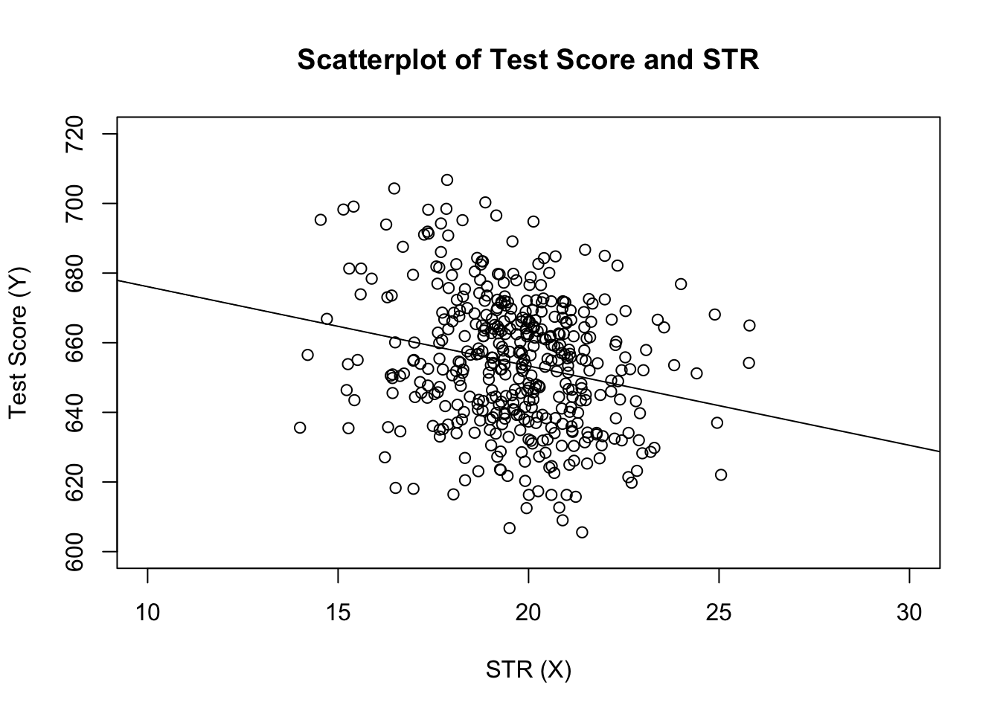


Did you notice that this time, we did not pass the intercept and slope parameters to <tt>abline</tt>? If you call <tt>abline()</tt> on an object of class <tt>lm</tt> which only contains a single regressor, <tt>R</tt> draws the regression line automatically! 

## Measures of Fit

After fitting a linear regression model, a natural question is how well the model describes the data. Visually, this amounts to assessing whether the observations are tightly clustered around the regression line. Both the *coefficient of determination* and the *standard error of the regression* measure how well the OLS Regression line fits the data. 

### The Coefficient of Determination {-}

$R^2$, the *coefficient of determination*, is the fraction of the sample variance of $Y_i$ that is explained by $X_i$. Mathematically, the $R^2$ can be written as the ratio of the explained sum of squares to the total sum of squares. The *explained sum of squares* ($ESS$) is the sum of squared deviations of the predicted values $\hat{Y_i}$, from the average of the $Y_i$. The *total sum of squares* ($TSS$) is the sum of squared deviations of the $Y_i$ from their average. Thus we have 

\begin{align}
  ESS & =  \sum_{i = 1}^n \left( \hat{Y_i} - \overline{Y} \right)^2,   \\
  TSS & =  \sum_{i = 1}^n \left( Y_i - \overline{Y} \right)^2,   \\
  R^2 & = \frac{ESS}{TSS}.
\end{align}

Since $TSS = ESS + SSR$ we can also write

$$ R^2 = 1- \frac{SSR}{TSS} $$ 

where $SSR$ is the sum of squared residuals, a measure for the errors made when predicting the $Y$ by $X$. The $SSR$ is defined as

$$ SSR = \sum_{i=1}^n \hat{u}_i^2. $$

$R^2$ lies between $0$ and $1$. It is easy to see that a perfect fit, i.e., no errors made when fitting the regression line, implies $R^2 = 1$ since then we have $SSR=0$. On the contrary, if our estimated regression line does not explain any variation in the $Y_i$, we have $ESS=0$ and consequently $R^2=0$.  

### The Standard Error of the Regression {-}

The *Standard Error of the Regression* ($SER$) is an estimator of the standard deviation of the residuals $\hat{u}_i$. As such it measures the magnitude of a typical deviation from the regression line, i.e., the magnitude of a typical residual.

$$ SER = s_{\hat{u}} = \sqrt{s_{\hat{u}}^2} \ \ \ \text{where} \ \ \ s_{\hat{u} }^2 = \frac{1}{n-2} \sum_{i = 1}^n \hat{u}^2_i = \frac{SSR}{n - 2} $$

Remember that the $u_i$ are *unobserved*. This is why we use their estimated counterparts, the residuals $\hat{u}_i$, instead. See Chapter 4.3 of the book for a more detailed comment on the $SER$.

### Application to the Test Score Data {-}

Both measures of fit can be obtained by using the  function <tt>summary()</tt> with an <tt>lm</tt> object provided as the only argument. While the function <tt>lm()</tt> only prints out the estimated coefficients to the console, <tt>summary()</tt> provides additional predefined information such as the regression's $R^2$ and the $SER$.  


```r
mod_summary <- summary(linear_model)
mod_summary
#> 
#> Call:
#> lm(formula = score ~ STR, data = CASchools)
#> 
#> Residuals:
#>     Min      1Q  Median      3Q     Max 
#> -47.727 -14.251   0.483  12.822  48.540 
#> 
#> Coefficients:
#>             Estimate Std. Error t value Pr(>|t|)    
#> (Intercept) 698.9329     9.4675  73.825  < 2e-16 ***
#> STR          -2.2798     0.4798  -4.751 2.78e-06 ***
#> ---
#> Signif. codes:  0 '***' 0.001 '**' 0.01 '*' 0.05 '.' 0.1 ' ' 1
#> 
#> Residual standard error: 18.58 on 418 degrees of freedom
#> Multiple R-squared:  0.05124,	Adjusted R-squared:  0.04897 
#> F-statistic: 22.58 on 1 and 418 DF,  p-value: 2.783e-06
```


The $R^2$ in the output is called *Multiple R-squared* and has a value of $0.051$. Hence, $5.1 \%$ of the variance of the dependent variable $score$ is explained by the explanatory variable $STR$. That is, the regression explains little of the variance in $score$, and much of the variation in test scores remains unexplained (cf. Figure 4.3 of the book).   

The $SER$ is called *Residual standard error* and equals $18.58$. The unit of the $SER$ is the same as the unit of the dependent variable. That is, on average the deviation of the actual achieved test score and the regression line is $18.58$ points. 

Now, let us check whether <tt>summary()</tt> uses the same definitions for $R^2$ and $SER$ as we do when computing them manually.


```r
# compute R^2 manually
SSR <- sum(mod_summary$residuals^2)
TSS <- sum((score - mean(score))^2)
R2 <- 1 - SSR/TSS

# print the value to the console
R2
#> [1] 0.05124009

# compute SER manually
n <- nrow(CASchools)
SER <- sqrt(SSR / (n-2))

# print the value to the console
SER
#> [1] 18.58097
```

We find that the results coincide. Note that the values provided by <tt>summary()</tt> are rounded to two decimal places.

## The Least Squares Assumptions {#tlsa}

OLS performs well under a quite broad variety of different circumstances. However, there are some assumptions which need to be satisfied in order to ensure that the estimates are normally distributed in large samples (we discuss this in Chapter \@ref(tsdotoe).


<div class = "keyconcept" id="KC4.3">
<h3 class = "right"> Key Concept 4.3 </h3>          
<h3 class = "left"> The Least Squares Assumptions </h3>
<p> 
$$Y_i = \beta_0 + \beta_1 X_i + u_i \text{, } i = 1,\dots,n$$
where

1. The error term $u_i$ has conditional mean zero given $X_i$: $E(u_i|X_i) = 0$.
2. $(X_i,Y_i), i = 1,\dots,n$ are independent and identically distributed (i.i.d.) draws from their joint distribution.
3. Large outliers are unlikely: $X_i$ and $Y_i$ have nonzero finite fourth moments.
</p>
</div>


### Assumption 1: The Error Term has Conditional Mean of Zero {-}

This means that no matter which value we choose for $X$, the error term $u$ must not show any systematic pattern and must have a mean of $0$.
Consider the case that, unconditionally, $E(u) = 0$, but for low and high values of $X$, the error term tends to be positive and for midrange values of
$X$ the error tends to be negative. We can use R to construct such an example. To do so we generate our own data using <tt>R</tt>'s built-in random number generators. 

We will use the following functions:

* <tt>runif()</tt> - generates uniformly distributed random numbers
* <tt>rnorm()</tt> - generates normally distributed random numbers
* <tt>predict()</tt> - does predictions based on the results of model fitting functions like <tt>lm()</tt>
* <tt>lines()</tt> - adds line segments to an existing plot

We start by creating a vector containing values that are uniformly distributed on the interval $[-5,5]$. This can be done with the function <tt>runif()</tt>. We also need to simulate the error term. For this we generate normally distributed random numbers with a mean equal to $0$ and a variance of $1$ using <tt>rnorm()</tt>. The $Y$ values are obtained as a quadratic function of the $X$ values and the error.

After generating the data we estimate both a simple regression model and a quadratic model that also includes the regressor $X^2$ (this is a multiple regression model, see Chapter \@ref(rmwmr)). Finally, we plot the simulated data and add the estimated regression line of a simple regression model as well as the predictions made with a quadratic model to compare the fit graphically.


```r
# set a seed to make the results reproducible
set.seed(321)

# simulate the data 
X <- runif(50, min = -5, max = 5)
u <- rnorm(50, sd = 1)  

# the true relation  
Y <- X^2 + 2 * X + u                

# estimate a simple regression model 
mod_simple <- lm(Y ~ X)

# predict using a quadratic model 
prediction <- predict(lm(Y ~ X + I(X^2)), data.frame(X = sort(X)))

# plot the results
plot(Y ~ X)
abline(mod_simple, col = "red")
lines(sort(X), prediction)
```


The plot shows what is meant by $E(u_i|X_i) = 0$ and why it does not hold for the linear model: 

Using the quadratic model (represented by the black curve) we see that there are no systematic deviations of the observation from the predicted relation. It is credible that the assumption is not violated when such a model is employed. However, using a simple linear regression model we see that the assumption is probably violated as $E(u_i|X_i)$ varies with the $X_i$.

### Assumption 2: Independently and Identically Distributed Data {-}

Most sampling schemes used when collecting data from populations produce i.i.d.-samples. For example, we could use <tt>R</tt>'s random number generator to randomly select student IDs from a university's enrollment list and record age $X$ and earnings $Y$ of the corresponding students. This is a typical example of simple random sampling and ensures that all the $(X_i, Y_i)$ are drawn randomly from the same population.

A prominent example where the i.i.d. assumption is not fulfilled is time series data where we have observations on the same unit over time. For example, take $X$ as the number of workers in a production company over time. Due to business transformations, the company cuts jobs periodically by a specific share but there are also some non-deterministic influences that relate to economics, politics etc. Using <tt>R</tt> we can easily simulate such a process and plot it. 

We start the series with a total of 5000 workers and simulate the reduction of employment with an autoregressive process that exhibits a downward movement in the long-run and has normally distributed errors:^[See Chapter \@ref(ittsraf) for more on autoregressive processes and time series analysis in general.]

$$ employment_t = -5 + 0.98 \cdot employment_{t-1} + u_t $$
 

```r
# set seed
set.seed(123)

# generate a date vector
Date <- seq(as.Date("1951/1/1"), as.Date("2000/1/1"), "years")

# initialize the employment vector
X <- c(5000, rep(NA, length(Date)-1))

# generate time series observations with random influences
for (i in 2:length(Date)) {
  
    X[i] <- -50 + 0.98 * X[i-1] + rnorm(n = 1, sd = 200)
    
}

#plot the results
plot(x = Date, 
     y = X, 
     type = "l", 
     col = "steelblue", 
     ylab = "Workers", 
     xlab = "Time")
```


It is evident that the observations on the number of employees cannot be independent in this example: the level of today's employment is correlated with tomorrows employment level. Thus, the i.i.d. assumption is violated.

### Assumption 3: Large Outliers are Unlikely {-}

It is easy to come up with situations where extreme observations, i.e., observations that deviate considerably from the usual range of the data, may occur. Such observations are called outliers. Technically speaking, assumption 3 requires that $X$ and $Y$ have a finite kurtosis.^[See Chapter 4.4 of the book.]

Common cases where we want to exclude or (if possible) correct such outliers is when they are apparently typos, conversion errors or measurement errors. Even if it seems like extreme observations have been recorded correctly, it is advisable to exclude them before estimating a model since OLS suffers from *sensitivity to outliers*.

What does this mean? One can show that extreme observations receive heavy weighting in the estimation of the unknown regression coefficients when using OLS. Therefore, outliers can lead to strongly distorted estimates of regression coefficients. To get a better impression of this issue, consider the following application where we have placed some sample data on $X$ and $Y$ which are highly correlated. The relation between $X$ and $Y$ seems to be explained pretty well by the plotted regression line: all of the white data points lie close to the red regression line and we have $R^2=0.92$.

Now go ahead and add a further observation at, say, $(18,2)$. This observations clearly is an outlier. The result is quite striking: the estimated regression line differs greatly from the one we adjudged to fit the data well. The slope is heavily downward biased and $R^2$ decreased to a mere $29\%$! <br>
Double-click inside the coordinate system to reset the app. Feel free to experiment. Choose different coordinates for the outlier or add additional ones.

<iframe height="410" width="900" frameborder="0" scrolling="no" src="Outlier.html"></iframe>

The following code roughly reproduces what is shown in figure 4.5 in the book. As done above we use sample data generated using <tt>R</tt>'s random number functions <tt>rnorm()</tt> and <tt>runif()</tt>. We estimate two simple regression models, one based on the original data set and another using a modified set where one observation is change to be an outlier and then plot the results. In order to understand the complete code you should be familiar with the function <tt>sort()</tt> which sorts the entries of a numeric vector in ascending order.


```r
# set seed
set.seed(123)

# generate the data
X <- sort(runif(10, min = 30, max = 70))
Y <- rnorm(10 , mean = 200, sd = 50)
Y[9] <- 2000

# fit model with outlier
fit <- lm(Y ~ X)

# fit model without outlier
fitWithoutOutlier <- lm(Y[-9] ~ X[-9])

# plot the results
plot(Y ~ X)
abline(fit)
abline(fitWithoutOutlier, col = "red")
```


## The Sampling Distribution of the OLS Estimator {#tsdotoe} 

Because $\hat{\beta}_0$ and $\hat{\beta}_1$ are computed from a sample, the estimators themselves are random variables with a probability distribution --- the so-called sampling distribution of the estimators --- which describes the values they could take on over different samples. Although the sampling distribution of $\hat\beta_0$ and $\hat\beta_1$ can be complicated when the sample size is small and generally changes with the number of observations, $n$, it is possible, provided the assumptions discussed in the book are valid, to make certain statements about it that hold for all $n$. In particular 
$$ E(\hat{\beta}_0) = \beta_0 \ \ \text{and} \ \  E(\hat{\beta}_1) = \beta_1,$$
that is, $\hat\beta_0$ and $\hat\beta_1$ are unbiased estimators of $\beta_0$ and $\beta_1$, the true parameters. If the sample is sufficiently large, by the central limit theorem the *joint* sampling distribution of the estimators is well approximated by the bivariate normal distribution (<a href="#mjx-eqn-2.1">2.1</a>). This implies that the marginal distributions are also normal in large samples. Core facts on the large-sample distributions of $\hat\beta_0$ and $\hat\beta_1$ are presented in Key Concept 4.4. 


<div class = "keyconcept" id="KC4.4">
<h3 class = "right"> Key Concept 4.4 </h3>          
<h3 class = "left"> Large Sample Distribution of $\hat\beta_0$ and $\hat\beta_1$ </h3>

<p> If the least squares assumptions in Key Concept 4.3 hold, then in large samples $\hat\beta_0$ and $\hat\beta_1$ have a joint normal sampling distribution. The large sample normal distribution of $\hat\beta_1$ is $\mathcal{N}(\beta_1, \sigma^2_{\hat\beta_1})$, where the variance of the distribution, $\sigma^2_{\hat\beta_1}$, is 

\begin{align}
\sigma^2_{\hat\beta_1} = \frac{1}{n} \frac{Var \left[ \left(X_i - \mu_X \right) u_i  \right]}  {\left[  Var \left(X_i \right)  \right]^2}. (\#eq:olsvar1)
\end{align}

The large sample normal distribution of $\hat\beta_0$ is $\mathcal{N}(\beta_0, \sigma^2_{\hat\beta_0})$ with

\begin{align}
\sigma^2_{\hat\beta_0} =  \frac{1}{n} \frac{Var \left( H_i u_i \right)}{ \left[  E \left(H_i^2  \right)  \right]^2 } \ , \ \text{where} \ \ H_i = 1 - \left[ \frac{\mu_X} {E \left( X_i^2\right)} \right] X_i. (\#eq:olsvar2)
\end{align}

The interactive simulation below continuously generates random samples $(X_i,Y_i)$ of $200$ observations where $E(Y\vert X) = 100 + 3X$, estimates a simple regression model, stores the estimate of the slope $\beta_1$ and visualizes the distribution of the $\widehat{\beta}_1$s observed so far using a histogram. The idea here is that for a large number of $\widehat{\beta}_1$s, the histogram gives a good approximation of the sampling distribution of the estimator. By decreasing the time between two sampling iterations, it becomes clear that the shape of the histogram approaches the characteristic bell shape of a normal distribution centered at the true slope of $3$.

<iframe height="470" width="700" frameborder="0" scrolling="no" src="SmallSampleDIstReg.html"></iframe>

(Double-click on the histogram to restart the simulation.)

</p>
</div>


### Simulation Study 1 {-}

Whether the statements of Key Concept 4.4 really hold can also be verified using <tt>R</tt>. For this we first we build our own population of $100000$ observations in total. To do this we need values for the independent variable $X$, for the error term $u$, and for the parameters $\beta_0$ and $\beta_1$. With these combined in a simple regression model, we compute the dependent variable $Y$. <br> In our example we generate the numbers $X_i$, $i = 1$, ... ,$100000$ by drawing a random sample from a uniform distribution on the interval $[0,20]$. The realizations of the error terms $u_i$ are drawn from a standard normal distribution with parameters $\mu = 0$ and $\sigma^2 = 100$ (note that <tt>rnorm()</tt> requires $\sigma$ as input for the argument <tt>sd</tt>, see <tt>?rnorm</tt>). Furthermore we chose $\beta_0 = -2$ and $\beta_1 = 3.5$ so the true model is

$$ Y_i = -2 + 3.5 \cdot X_i. $$

Finally, we store the results in a data.frame.  


```r
# simulate data
N <- 100000
X <- runif(N, min = 0, max = 20)
u <- rnorm(N, sd = 10)

# population regression
Y <- -2 + 3.5 * X + u
population <- data.frame(X, Y)
```

From now on we will consider the previously generated data as the true population (which of course would be *unknown* in a real world application, otherwise there would be no reason to draw a random sample in the first place). The knowledge about the true population and the true relationship between $Y$ and $X$ can be used to verify the statements made in Key Concept 4.4. 

First, let us calculate the true variances $\sigma^2_{\hat{\beta}_0}$ and $\sigma^2_{\hat{\beta}_1}$ for a randomly drawn sample of size $n = 100$. 


```r
# set sample size
n <- 100

# compute the variance of beta_hat_0
H_i <- 1 - mean(X) / mean(X^2) * X
var_b0 <- var(H_i * u) / (n * mean(H_i^2)^2 )

# compute the variance of hat_beta_1
var_b1 <- var( ( X - mean(X) ) * u ) / (100 * var(X)^2)
```


```r
# print variances to the console
var_b0
#> [1] 4.045066
var_b1
#> [1] 0.03018694
```

Now let us assume that we do not know the true values of $\beta_0$ and $\beta_1$ and that it is not possible to observe the whole population. However, we can observe a random sample of $n$ observations. Then, it would not be possible to compute the true parameters but we could obtain estimates of $\beta_0$ and $\beta_1$ from the sample data using OLS. However, we know that these estimates are outcomes of random variables themselves since the observations are randomly sampled from the population. Key Concept 4.4 describes their distributions for large $n$. When drawing a single sample of size $n$ it is not possible to make any statement about these distributions. Things change if we repeat the sampling scheme many times and compute the estimates for each sample: using this procedure we simulate outcomes of the respective distributions.    

To achieve this in R, we employ the following approach:

- We assign the number of repetitions, say $10000$, to <tt>reps</tt> and then initialize a matrix <tt>fit</tt> were the estimates obtained in each sampling iteration shall be stored row-wise. Thus <tt>fit</tt> has to be a matrix of dimensions <tt>reps</tt>$\times2$.
- In the next step we draw <tt>reps</tt> random samples of size <tt>n</tt> from the population and obtain the OLS estimates for each sample. The results are stored as row entries in the outcome matrix <tt>fit</tt>. This is done using a <tt>for()</tt> loop.
- At last, we estimate variances of both estimators using the sampled outcomes and plot histograms of the latter. We also add a plot of the density functions belonging to the distributions that follow from Key Concept 4.4. The function <tt>bquote()</tt> is used to obtain math expressions in the titles and labels of both plots. See <tt>?bquote</tt>.


```r
# set repetitions and sample size
n <- 100
reps <- 10000

# initialize the matrix of outcomes
fit <- matrix(ncol = 2, nrow = reps)

# loop sampling and estimation of the coefficients
for (i in 1:reps){
  
 sample <- population[sample(1:N, n), ]
 fit[i, ] <- lm(Y ~ X, data = sample)$coefficients
 
}

# compute variance estimates using outcomes
var(fit[, 1])
#> [1] 4.186832
var(fit[, 2])
#> [1] 0.03096199
```

 

```r
# divide plotting area as 1-by-2 array
par(mfrow = c(1, 2))

# plot histograms of beta_0 estimates
hist(fit[, 1],
     cex.main = 1,
     main = bquote(The ~ Distribution  ~ of ~ 10000 ~ beta[0] ~ Estimates), 
     xlab = bquote(hat(beta)[0]), 
     freq = F)

# add true distribution to plot
curve(dnorm(x, 
            -2, 
            sqrt(var_b0)), 
      add = T, 
      col = "darkred")

# plot histograms of beta_hat_1 
hist(fit[, 2],
    cex.main = 1,
     main = bquote(The ~ Distribution  ~ of ~ 10000 ~ beta[1] ~ Estimates), 
     xlab = bquote(hat(beta)[1]), 
     freq = F)

# add true distribution to plot
curve(dnorm(x, 
            3.5, 
            sqrt(var_b1)), 
      add = T, 
      col = "darkred")
```

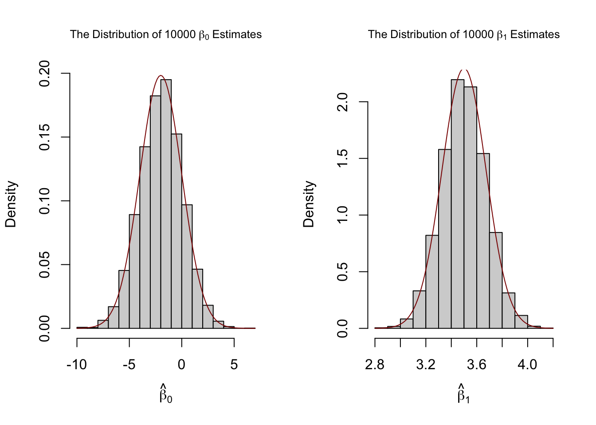


Our variance estimates support the statements made in Key Concept 4.4, coming close to the theoretical values. The histograms suggest that the distributions of the estimators can be well approximated by the respective theoretical normal distributions stated in Key Concept 4.4.    

### Simulation Study 2 {-}

A further result implied by Key Concept 4.4 is that both estimators are consistent, i.e., they converge in probability to the true parameters we are interested in. This is because they are asymptotically unbiased and their variances converge to $0$ as $n$ increases. We can check this by repeating the simulation above for a sequence of increasing sample sizes. This means we no longer assign the sample size but a *vector* of sample sizes: <tt>n <- c(...)</tt>. <br>
Let us look at the distributions of $\beta_1$. The idea here is to add an additional call of <tt>for()</tt> to the code. This is done in order to loop over the vector of sample sizes <tt>n</tt>. For each of the sample sizes we carry out the same simulation as before but plot a density estimate for the outcomes of each iteration over <tt>n</tt>. Notice that we have to change <tt>n</tt> to <tt>n[j]</tt> in the inner loop to ensure that the <tt>j</tt>$^{th}$ element of <tt>n</tt> is used. In the simulation, we use sample sizes of $100, 250, 1000$ and $3000$. Consequently we have a total of four distinct simulations using different sample sizes.

 

```r
# set seed for reproducibility
set.seed(1)

# set repetitions and the vector of sample sizes
reps <- 1000
n <- c(100, 250, 1000, 3000)

# initialize the matrix of outcomes
fit <- matrix(ncol = 2, nrow = reps)

# divide the plot panel in a 2-by-2 array
par(mfrow = c(2, 2))

# loop sampling and plotting

# outer loop over n
for (j in 1:length(n)) {
  
  # inner loop: sampling and estimating of the coefficients
  for (i in 1:reps){
    
    sample <- population[sample(1:N, n[j]), ]
    fit[i, ] <- lm(Y ~ X, data = sample)$coefficients
    
  }
  
  # draw density estimates
  plot(density(fit[ ,2]), xlim=c(2.5, 4.5), 
       col = j, 
       main = paste("n=", n[j]), 
       xlab = bquote(hat(beta)[1]))
  
}
```

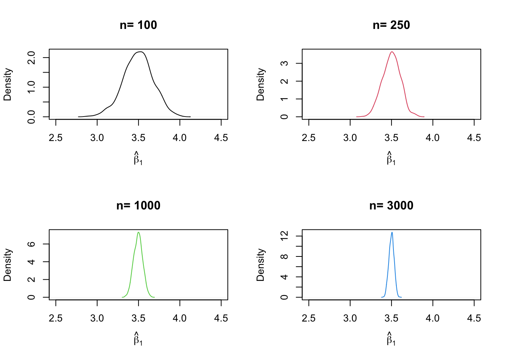


We find that, as $n$ increases, the distribution of $\hat\beta_1$ concentrates around its mean, i.e., its variance decreases. Put differently, the likelihood of observing estimates close to the true value of $\beta_1 = 3.5$ grows as we increase the sample size. The same behavior can be observed if we analyze the distribution of $\hat\beta_0$ instead. 

### Simulation Study 3 {-}

Furthermore, (4.1) reveals that the variance of the OLS estimator for $\beta_1$ decreases as the variance of the $X_i$ increases. In other words, as we increase the amount of information provided by the regressor, that is, increasing $Var(X)$, which is used to estimate $\beta_1$, we become more confident that the estimate is close to the true value (i.e., $Var(\hat\beta_1)$ decreases).<br>
We can visualize this by reproducing Figure 4.6 from the book. To do this, we sample observations $(X_i,Y_i)$, $i=1,\dots,100$ from a bivariate normal distribution with 

$$E(X)=E(Y)=5,$$ 
$$Var(X)=Var(Y)=5$$ 
and 
$$Cov(X,Y)=4.$$

Formally, this is written down as

\begin{equation}
  \begin{pmatrix}
    X \\
    Y \\
  \end{pmatrix}
  \overset{i.i.d.}{\sim} \ \mathcal{N} 
  \left[
    \begin{pmatrix}
      5 \\
      5 \\
    \end{pmatrix}, \ 
    \begin{pmatrix}
      5 & 4 \\
      4 & 5 \\
    \end{pmatrix}
  \right]. \tag{4.3}
\end{equation}

To carry out the random sampling, we make use of the function <tt>mvrnorm()</tt> from the package <tt>MASS</tt> [@R-MASS] which allows to draw random samples from multivariate normal distributions, see `?mvtnorm`. Next, we use <tt>subset()</tt> to split the sample into two subsets such that the first set, <tt>set1</tt>, consists of observations that fulfill the condition $\lvert X - \overline{X} \rvert > 1$ and the second set, <tt>set2</tt>, includes the remainder of the sample. We then plot both sets and use different colors to distinguish the observations.

 

```r
# load the MASS package
library(MASS)

# set seed for reproducibility
set.seed(4)

# simulate bivarite normal data
bvndata <- mvrnorm(100, 
                mu = c(5, 5), 
                Sigma = cbind(c(5, 4), c(4, 5))) 

# assign column names / convert to data.frame
colnames(bvndata) <- c("X", "Y")
bvndata <- as.data.frame(bvndata)

# subset the data
set1 <- subset(bvndata, abs(mean(X) - X) > 1)
set2 <- subset(bvndata, abs(mean(X) - X) <= 1)

# plot both data sets
plot(set1, 
     xlab = "X", 
     ylab = "Y", 
     pch = 19)

points(set2, 
       col = "steelblue", 
       pch = 19)
```


It is clear that observations that are close to the sample average of the $X_i$ have less variance than those that are farther away. Now, if we were to draw a line as accurately as possible through either of the two sets it is intuitive that choosing the observations indicated by the black dots, i.e., using the set of observations which has larger variance than the blue ones, would result in a more precise line. Now, let us use OLS to estimate slope and intercept for both sets of observations. We then plot the observations along with both regression lines.

 

```r
# estimate both regression lines
lm.set1 <- lm(Y ~ X, data = set1)
lm.set2 <- lm(Y ~ X, data = set2)

# plot observations
plot(set1, xlab = "X", ylab = "Y", pch = 19)
points(set2, col = "steelblue", pch = 19)

# add both lines to the plot
abline(lm.set1, col = "green")
abline(lm.set2, col = "red")
```


Evidently, the green regression line does far better in describing data sampled from the bivariate normal distribution stated in (<a href="#mjx-eqn-4.3">4.3</a>) than the red line. This is a nice example for demonstrating why we are interested in a high variance of the regressor $X$: more variance in the $X_i$ means more information from which the precision of the estimation benefits.

## Exercises {#exercises-4}


<div  class = "DCexercise">

#### 1. Class Sizes and Test Scores {-}

A researcher wants to analyze the relationship between class size (measured by the student-teacher ratio) and the average test score. Therefore he measures both variables in $10$ different classes and ends up with the following results.

preserve69563e92a495b4fc

**Instructions:**

+ Create the vectors <tt>cs</tt> (the class size) and <tt>ts</tt> (the test score), containing the observations above.  

+ Draw a scatterplot of the results using <tt>plot()</tt>.

<iframe src="DCL/ex4_1.html" frameborder="0" scrolling="no" style="width:100%;height:340px"></iframe>


</div>


<div  class = "DCexercise">

#### 2. Mean, Variance, Covariance and Correlation {-}

The vectors <tt>cs</tt> and <tt>ts</tt> are available in the working environment (you can check this: type their names into the console and press enter).

**Instructions:**

+ Compute the mean, the sample variance and the sample standard deviation of <tt>ts</tt>. 

+ Compute the covariance and the correlation coefficient for <tt>ts</tt> and <tt>cs</tt>.

<iframe src="DCL/ex4_2.html" frameborder="0" scrolling="no" style="width:100%;height:340px"></iframe>

**Hint:** Use the <tt>R</tt> functions presented in this chapter: <tt>mean()</tt>, <tt>sd()</tt>, <tt>cov()</tt>, <tt>cor()</tt> and <tt>var()</tt>.

</div>


<div  class = "DCexercise">

#### 3. Simple Linear Regression {-}

The vectors <tt>cs</tt> and <tt>ts</tt> are available in the working environment. 

**Instructions:**

+ The function <tt>lm()</tt> is part of the package <tt>AER</tt>. Attach the package using <tt>library()</tt>.

+ Use <tt>lm()</tt> to estimate the regression model $$TestScore_i = \beta_0 + \beta_1 STR_i + u_i.$$ Assign the result to <tt>mod</tt>.

+ Obtain a statistical summary of the model.

<iframe src="DCL/ex4_3.html" frameborder="0" scrolling="no" style="width:100%;height:340px"></iframe>

</div>


<div  class = "DCexercise">

#### 4. The Model Object {-}

Let us see how an object of class <tt>lm</tt> is structured. 

The vectors <tt>cs</tt> and <tt>ts</tt> as well as the model object <tt>mod</tt> from the previous exercise are available in your workspace.

**Instructions:**

+ Use <tt>class()</tt> to learn about the class of the object <tt>mod</tt>.
+ <tt>mod</tt> is an object of type <tt>list</tt> with named entries. Check this using the function <tt>is.list()</tt>.
+ See what information you can obtain from <tt>mod</tt> using <tt>names()</tt>. 
+ Read out an arbitrary entry of the object <tt>mod</tt> using the <tt>$</tt> operator.

<iframe src="DCL/ex4_4.html" frameborder="0" scrolling="no" style="width:100%;height:340px"></iframe>

</div>


<div  class = "DCexercise">

#### 5. Plotting the Regression Line {-}

You are provided with the code for the scatterplot in <tt>script.R</tt>

**Instructions:**

+ Add the regression line to the scatterplot from a few exercises before.

+ The object <tt>mod</tt> is available in your working environment.

<iframe src="DCL/ex4_5.html" frameborder="0" scrolling="no" style="width:100%;height:340px"></iframe>

**Hint:** Use the function <tt>abline()</tt>.

</div>


<div  class = "DCexercise">

#### 6. Summary of a Model Object {-}

Now read out and store some of the information that is contained in the output of <tt>summary()</tt>.

**Instructions:**

+ Assign the output of <tt>summary(mod)</tt> to the variable <tt>s</tt>.

+ Check entry names of the object <tt>s</tt>.

+ Create a new variable <tt>R2</tt> and assign the $R^2$ of the regression.

The object <tt>mod</tt> is available in your working environment.

<iframe src="DCL/ex4_6.html" frameborder="0" scrolling="no" style="width:100%;height:340px"></iframe>

</div>


<div  class = "DCexercise">

#### 7. Estimated Coefficients {-}

The function <tt>summary()</tt> also provides information on the statistical significance of the estimated coefficients.

**Instructions:**

Extract the named $2\times4$ matrix with estimated coefficients, standard errors, $t$-statistics and corresponding $p$-values from the model summary <tt>s</tt>. Save this matrix in an object named <tt>coefs</tt>.

The objects <tt>mod</tt> and <tt>s</tt> are available in your working environment.

<iframe src="DCL/ex4_7.html" frameborder="0" scrolling="no" style="width:100%;height:340px"></iframe>

</div>


<div  class = "DCexercise">

#### 8. Dropping the Intercept {-}

So far, we have estimated regression models consisting of an intercept and a single regressor. In this exercise you will learn how to specify and how to estimate regression a model without intercept.

Note that excluding the intercept from a regression model might be a dodgy practice in some applications as this imposes the conditional expectation function of the dependent variable to be zero if the regressor is zero.

**Instructions:**

+ Figure out how the <tt>formula</tt> argument must be specified for a regression of <tt>ts</tt> solely on <tt>cs</tt>, i.e., a regression without intercept. Google is your friend!

+ Estimate the regression model without intercept and store the result in <tt>mod_ni</tt>.

The vectors <tt>cs</tt>, <tt>ts</tt> and the model object <tt>mod</tt> from previous exercises are available in the working environment.

<iframe src="DCL/ex4_8.html" frameborder="0" scrolling="no" style="width:100%;height:340px"></iframe>

</div>


<div  class = "DCexercise">

#### 9. Regression Output: No Constant Case {-}

In Exercise 8 you have estimated a model without intercept. The estimated regression function is

$$\widehat{TestScore} = \underset{(1.36)}{12.65} \times STR.$$

**Instructions:**

Convince yourself that everything is as stated above: extract the coefficient matrix from the summary of <tt>mod_ni</tt> and store it in a variable named <tt>coef</tt>.

The vectors <tt>cs</tt>, <tt>ts</tt> as well as the model object <tt>mod_ni</tt> from the previous exercise are available in your working environment.

<iframe src="DCL/ex4_9.html" frameborder="0" scrolling="no" style="width:100%;height:340px"></iframe>

**Hint:** An entry of a named list can be accessed using the <tt>$</tt> operator.

</div>


<div  class = "DCexercise">

#### 10. Regression Output: No Constant Case --- Ctd. {-}

In Exercises 8 and 9 you have dealt with a model without intercept. The estimated regression function was

$$\widehat{TestScore_i} = \underset{(1.36)}{12.65} \times STR_i.$$

The coefficient matrix <tt>coef</tt> from Exercise 9 contains the estimated coefficient on $STR$, its standard error, the $t$-statistic of the significance test and the corresponding $p$-value.

**Instructions:**

+ Print the contents of <tt>coef</tt> to the console.
+ Convince yourself that the reported $t$-statistic is correct: use the entries of <tt>coef</tt> to compute the $t$-statistic and save it to <tt>t_stat</tt>.

The matrix <tt>coef</tt> from the previous exercise is available in your working environment.

<iframe src="DCL/ex4_10.html" frameborder="0" scrolling="no" style="width:100%;height:340px"></iframe>

**Hints:** 

+ <tt>X[a,b]</tt> returns the <tt>[a,b]</tt> element of the matrix <tt>X</tt>. 

+ The $t$-statistic for a test of the hypothesis $H_0: \beta_1 = 0$ is computed as $$t = \frac{\hat{\beta}_1}{SE(\hat{\beta}_1)}.$$

</div>


<div  class = "DCexercise">

#### 11. Two Regressions, One Plot {-}

The two estimated regression models from the previous exercises are

$$\widehat{TestScore_i} = \underset{(1.36)}{12.65} \times STR_i$$

and

$$\widehat{TestScore_i} = \underset{(23.96)}{567.4272} \underset{(0.85)}{-7.1501} \times STR_i.$$

You are provided with the code line <tt>plot(cs, ts)</tt> which creates a scatterplot of <tt>ts</tt> and <tt>cs</tt>. Note that this line must be executed before calling <tt>abline()</tt>! You may color the regression lines by using, e.g., <tt>col = "red"</tt> or <tt>col = "blue"</tt> as an additional argument to <tt>abline()</tt> for better distinguishability.

The vectors <tt>cs</tt> and <tt>ts</tt> as well as the list objects <tt>mod</tt> and <tt>mod_ni</tt> from previous exercises are available in your working environment.

**Instructions:**

Generate a scatterplot of <tt>ts</tt> and <tt>cs</tt> and add the estimated regression lines of <tt>mod</tt> and <tt>mod_ni</tt>.

<iframe src="DCL/ex4_11.html" frameborder="0" scrolling="no" style="width:100%;height:340px"></iframe>

</div>


<div  class = "DCexercise">

#### 12. $TSS$ and $SSR$ {-}

If graphical inspection does not help, researchers resort to analytic techniques in order to detect if a model fits the data at hand good or better than another model.

Let us go back to the simple regression model including an intercept. The estimated regression line for <tt>mod</tt> was

$$\widehat{TestScore_i} = 567.43 - 7.15 \times STR_i, \, R^2 = 0.8976, \, SER=15.19.$$

You can check this as <tt>mod</tt> and the vectors <tt>cs</tt> and <tt>ts</tt> are available in your working environment.

**Instructions:**

+ Compute $SSR$, the sum of squared residuals, and save it to <tt>ssr</tt>.
+ Compute $TSS$, the total sum of squares, and save it to <tt>tss</tt>.

<iframe src="DCL/ex4_12.html" frameborder="0" scrolling="no" style="width:100%;height:340px"></iframe>

</div>


<div  class = "DCexercise">

#### 13. The $R^2$ of a Regression Model {-}

The $R^2$ of the regression saved in <tt>mod</tt> is $0.8976$. You can check this by executing <tt>summary(mod)$r.squared</tt> in the console below.

Remember the formula of $R^2$:

$$R^2 = \frac{ESS}{TSS} = 1 - \frac{SSR}{TSS}$$

The objects <tt>mod</tt>, <tt>tss</tt> and <tt>ssr</tt> from the previous exercise are available in your working environment.

**Instructions:**

+ Use <tt>ssr</tt> and <tt>tss</tt> to compute $R^2$ manually. *Round* the result to *four* decimal places and save it to <tt>R2</tt>.
+ Use the logical operator <tt>==</tt> to check whether your result matches the value mentioned above.

<iframe src="DCL/ex4_13.html" frameborder="0" scrolling="no" style="width:100%;height:340px"></iframe>

**Hints:**

You may round numeric values using the function <tt>round()</tt>.

</div>


<div  class = "DCexercise">

#### 14. The Standard Error of The Regression {-}

The standard error of the Regression in the simple regression model is $$SER = \frac{1}{n-2} \sum_{i=1}^n \widehat{u}_i^2 =\sqrt{\frac{SSR}{n-2}}.$$ $SER$ measures the size of an average residual which is an estimate of the magnitude of a typical regression error.

The model object <tt>mod</tt> and the vectors <tt>cs</tt> and </tt>ts</tt> are available in your workspace.

**Instructions:**

+ Use <tt>summary()</tt> to obtain the $SER$ for the regression of <tt>ts</tt> on <tt>cs</tt> saved in the model object <tt>mod</tt>. Save the result in the variable <tt>SER</tt>.

+ Use <tt>SER</tt> to compute the $SSR$ and store it in <tt>SSR</tt>.

+ Check that <tt>SSR</tt> is indeed the $SSR$ by comparing <tt>SSR</tt> to the result of <tt>sum(mod$residuals^2)</tt>

<iframe src="DCL/ex4_14.html" frameborder="0" scrolling="no" style="width:100%;height:340px"></iframe>

</div>


<div  class = "DCexercise">

#### 15. The Estimated Covariance Matrix {-}

As has been discussed in Chapter \@ref(tlsa), the OLS estimators $\widehat{\beta}_0$ and $\widehat{\beta}_1$ are functions of the random error term. Therefore, they are random variables themselves. For two or more random variables, their covariances and variances are summarized by a *variance-covariance matrix* (which is often simply called the *covariance matrix*). Taking the square root of the diagonal elements of the estimated covariance matrix obtains $SE(\widehat\beta_0)$ and $SE(\widehat\beta_1)$, the standard errors of $\widehat{\beta}_0$ and $\widehat{\beta}_1$. 

<tt>summary()</tt> computes an estimate of this matrix. The respective entry in the output of summary (remember that <tt>summary()</tt> produces a list) is called <tt>cov.unscaled</tt>. The model object <tt>mod</tt> is available in your workspace.

**Instructions:**

+ Use <tt>summary()</tt> to obtain the covariance matrix estimate for the regression of test scores on student-teacher ratios stored in the model object <tt>mod</tt>. Save the result to <tt>cov_matrix</tt>.

+ Obtain the diagonal elements of <tt>cov_matrix</tt>, compute their square root and assign the result to the variable <tt>SEs</tt>.

<iframe src="DCL/ex4_15.html" frameborder="0" scrolling="no" style="width:100%;height:340px"></iframe>

**Hint:** <tt>diag(A)</tt> returns a vector containing the diagonal elements of the matrix <tt>A</tt>.

</div>


<!--chapter:end:04-ch4.Rmd-->

# Hypothesis Tests and Confidence Intervals in the Simple Linear Regression Model {#htaciitslrm}

This chapter, continues our treatment of the simple linear regression model. The following subsections discuss how we may use our knowledge about the sampling distribution of the OLS estimator in order to make statements regarding its uncertainty.

These subsections cover the following topics:

- Testing Hypotheses regarding regression coefficients.

- Confidence intervals for regression coefficients.

- Regression when $X$ is a dummy variable.

- Heteroskedasticity and Homoskedasticity.

The packages <tt>AER</tt> [@R-AER] and <tt>scales</tt> [@R-scales] are required for reproduction of the code chunks presented throughout this chapter. The package <tt>scales</tt> provides additional generic plot scaling methods. Make sure both packages are installed before you proceed. The safest way to do so is by checking whether the following code chunk executes without any errors.


```r
library(AER)
library(scales)
```

## Testing Two-Sided Hypotheses Concerning the Slope Coefficient

Using the fact that $\hat{\beta}_1$ is approximately normally distributed in large samples (see [Key Concept 4.4](#tsdotoe)), testing hypotheses about the true value $\beta_1$ can be done as in Chapter \@ref(potsm).


<div class = "keyconcept" id="KC5.1">
<h3 class = "right"> Key Concept 5.1 </h3>
<h3 class = "left"> General Form of the $t$-Statistic </h3>
Remember from Chapter \@ref(arosur) that a general $t$-statistic has the form
$$ t = \frac{\text{estimated value} - \text{hypothesized value}}{\text{standard error of the estimator}}.$$
</div>


<div class = "keyconcept" id="KC5.2">
<h3 class = "right"> Key Concept 5.2 </h3>
<h3 class = "left"> Testing Hypotheses regarding $\beta_1$ </h3>

For testing the hypothesis $H_0: \beta_1 = \beta_{1,0}$, we need to perform the following steps:

1. Compute the standard error of $\hat{\beta}_1$, $SE(\hat{\beta}_1)$

\[ SE(\hat{\beta}_1) = \sqrt{ \hat{\sigma}^2_{\hat{\beta}_1} } \ \ , \ \ 
  \hat{\sigma}^2_{\hat{\beta}_1} = \frac{1}{n} \times \frac{\frac{1}{n-2} \sum_{i=1}^n (X_i - \overline{X})^2 \hat{u_i}^2 }{ \left[ \frac{1}{n} \sum_{i=1}^n (X_i - \overline{X})^2 \right]^2}.
\]

2. Compute the $t$-statistic

\[ t = \frac{\hat{\beta}_1 - \beta_{1,0}}{ SE(\hat{\beta}_1) }. \]

3. Given a two sided alternative ($H_1:\beta_1 \neq \beta_{1,0}$) we reject at the $5\%$ level if $|t^{act}| > 1.96$ or, equivalently, if the $p$-value is less than $0.05$.<br>  
Recall the definition of the $p$-value:  

  \begin{align*}
    p \text{-value} =& \, \text{Pr}_{H_0} \left[ \left| \frac{ \hat{\beta}_1 - \beta_{1,0} }{ SE(\hat{\beta}_1) } \right| > \left|        \frac{ \hat{\beta}_1^{act} - \beta_{1,0} }{ SE(\hat{\beta}_1) } \right| \right] \\
    =& \, \text{Pr}_{H_0} (|t| > |t^{act}|) \\
    \approx& \, 2 \cdot \Phi(-|t^{act}|)
  \end{align*}  

&nbsp;&nbsp;&nbsp;&nbsp;&nbsp;&nbsp; The last transformation is due to the normal approximation for large samples.

</div>


Consider again the OLS regression stored in <tt>linear_model</tt> from Chapter \@ref(lrwor) that gave us the regression line

\[ \widehat{TestScore} \ = \underset{(9.47)}{698.9} - \underset{(0.49)}{2.28} \times STR \ , \ R^2=0.051 \ , \ SER=18.6. \]

Copy and execute the following code chunk if the above model object is not available in your working environment.


```r
# load the `CASchools` dataset
data(CASchools)

# add student-teacher ratio
CASchools$STR <- CASchools$students/CASchools$teachers

# add average test-score
CASchools$score <- (CASchools$read + CASchools$math)/2

# estimate the model
linear_model <- lm(score ~ STR, data = CASchools)          
```

For testing a hypothesis concerning the slope parameter (the coefficient on $STR$), we need $SE(\hat{\beta}_1)$, the standard error of the respective point estimator. As is common in the literature, standard errors are presented in parentheses below the point estimates. 

Key Concept 5.1 reveals that it is rather cumbersome to compute the standard error and thereby the $t$-statistic by hand. The question you should be asking yourself right now is: can we obtain these values with minimum effort using <tt>R</tt>? Yes, we can. Let us first use <tt>summary()</tt> to get a summary on the estimated coefficients in <tt>linear_model</tt>.

**Note**: Throughout the textbook, robust standard errors are reported. We consider it instructive keep things simple at the beginning and thus start out with simple examples that do not allow for robust inference. Standard errors that are robust to heteroskedasticity are introduced in Chapter \@ref(hah) where we also demonstrate how they can be computed using <tt>R</tt>. A discussion of heteroskedasticity-autocorrelation robust standard errors takes place in Chapter \@ref(eodce).


```r
# print the summary of the coefficients to the console
summary(linear_model)$coefficients
#>               Estimate Std. Error   t value      Pr(>|t|)
#> (Intercept) 698.932949  9.4674911 73.824516 6.569846e-242
#> STR          -2.279808  0.4798255 -4.751327  2.783308e-06
```

The second column of the coefficients' summary, reports $SE(\hat\beta_0)$ and $SE(\hat\beta_1)$. Also, in the third column <tt>t value</tt>, we find $t$-statistics $t^{act}$ suitable for tests of the separate hypotheses $H_0: \beta_0=0$ and $H_0: \beta_1=0$. Furthermore, the output provides us with $p$-values corresponding to both tests against the two-sided alternatives $H_1:\beta_0\neq0$ respectively $H_1:\beta_1\neq0$ in the fourth column of the table.

Let us have a closer look at the test of 

$$H_0: \beta_1=0 \ \ \ vs. \ \ \ H_1: \beta_1 \neq 0.$$ 

We have $$ t^{act} = \frac{-2.279808 - 0}{0.4798255} \approx - 4.75. $$

What does this tell us about the significance of the estimated coefficient? We reject the null hypothesis at the $5\%$ level of significance since $|t^{act}| > 1.96$. That is, the observed test statistic falls into the rejection region as $p\text{-value} = 2.78\cdot 10^{-6} < 0.05$. We conclude that the coefficient is significantly different from zero. In other words, we reject the hypothesis that the class size *has no influence* on the students test scores at the $5\%$ level.

Note that although the difference is negligible in the present case as we will see later, <tt>summary()</tt> does not perform the normal approximation but calculates $p$-values using the $t$-distribution instead. Generally, the degrees of freedom of the assumed $t$-distribution are determined in the following manner:

$$ \text{DF} = n - k - 1 $$

where $n$ is the number of observations used to estimate the model and $k$ is the number of regressors, excluding the intercept. In our case, we have $n=420$ observations and the only regressor is $STR$ so $k=1$. The simplest way to determine the model degrees of freedom is


```r
# determine residual degrees of freedom
linear_model$df.residual
#> [1] 418
```

Hence, for the assumed sampling distribution of $\hat\beta_1$ we have

$$\hat\beta_1 \sim t_{418}$$
such that the $p$-value for a two-sided significance test can be obtained by executing the following code:


```r
2 * pt(-4.751327, df = 418)
#> [1] 2.78331e-06
```

The result is very close to the value provided by <tt>summary()</tt>. However since $n$ is sufficiently large one could just as well use the standard normal density to compute the $p$-value:


```r
2 * pnorm(-4.751327)
#> [1] 2.02086e-06
```

The difference is indeed negligible. These findings tell us that, if $H_0: \beta_1 = 0$ is true and we were to repeat the whole process of gathering observations and estimating the model, observing a $\hat\beta_1 \geq |-2.28|$ is very unlikely! 

Using <tt>R</tt> we may visualize how such a statement is made when using the normal approximation. This reflects the principles depicted in figure 5.1 in the book. Do not let the following code chunk deter you: the code is somewhat longer than the usual examples and looks unappealing but there is a lot of repetition since color shadings and annotations are added on both tails of the normal distribution. We recommend to execute the code step by step in order to see how the graph is augmented with the annotations.


```r

# Plot the standard normal on the support [-6,6]
t <- seq(-6, 6, 0.01)

plot(x = t, 
     y = dnorm(t, 0, 1), 
     type = "l", 
     col = "steelblue", 
     lwd = 2, 
     yaxs = "i", 
     axes = F, 
     ylab = "", 
     main = expression("Calculating the p-value of a Two-sided Test when" ~ t^act ~ "=-4.75"), 
     cex.lab = 0.7,
     cex.main = 1)

tact <- -4.75

axis(1, at = c(0, -1.96, 1.96, -tact, tact), cex.axis = 0.7)

# Shade the critical regions using polygon():

# critical region in left tail
polygon(x = c(-6, seq(-6, -1.96, 0.01), -1.96),
        y = c(0, dnorm(seq(-6, -1.96, 0.01)), 0), 
        col = 'orange')

# critical region in right tail

polygon(x = c(1.96, seq(1.96, 6, 0.01), 6),
        y = c(0, dnorm(seq(1.96, 6, 0.01)), 0), 
        col = 'orange')

# Add arrows and texts indicating critical regions and the p-value
arrows(-3.5, 0.2, -2.5, 0.02, length = 0.1)
arrows(3.5, 0.2, 2.5, 0.02, length = 0.1)

arrows(-5, 0.16, -4.75, 0, length = 0.1)
arrows(5, 0.16, 4.75, 0, length = 0.1)

text(-3.5, 0.22, 
     labels = expression("0.025"~"="~over(alpha, 2)),
     cex = 0.7)
text(3.5, 0.22, 
     labels = expression("0.025"~"="~over(alpha, 2)),
     cex = 0.7)

text(-5, 0.18, 
     labels = expression(paste("-|",t[act],"|")), 
     cex = 0.7)
text(5, 0.18, 
     labels = expression(paste("|",t[act],"|")), 
     cex = 0.7)

# Add ticks indicating critical values at the 0.05-level, t^act and -t^act 
rug(c(-1.96, 1.96), ticksize  = 0.145, lwd = 2, col = "darkred")
rug(c(-tact, tact), ticksize  = -0.0451, lwd = 2, col = "darkgreen")
```


The $p$-Value is the area under the curve to left of $-4.75$ plus the area under the curve to the right of $4.75$. As we already know from the calculations above, this value is very small. 

## Confidence Intervals for Regression Coefficients {#cifrc}

As we already know, estimates of the regression coefficients $\beta_0$ and $\beta_1$ are subject to sampling uncertainty, see Chapter \@ref(lrwor). Therefore, we will *never* exactly estimate the true value of these parameters from sample data in an empirical application. However, we may construct confidence intervals for the intercept and the slope parameter.

A $95\%$ confidence interval for $\beta_i$ has two equivalent definitions:

- The interval is the set of values for which a hypothesis test to the level of $5\%$ cannot be rejected.
- The interval has a probability of $95\%$ to contain the true value of $\beta_i$. So in $95\%$ of all samples that could be drawn, the confidence interval will cover the true value of $\beta_i$.

We also say that the interval has a confidence level of $95\%$. The idea of the confidence interval is summarized in Key Concept 5.3.


<div class = "keyconcept" id="KC5.3">
<h3 class = "right"> Key Concept 5.3 </h3>
<h3 class = "left"> A Confidence Interval for $\beta_i$ </h3>

Imagine you could draw all possible random samples of given size. The interval that contains the true value $\beta_i$ in $95\%$ of all samples is given by the expression

\[ \text{CI}_{0.95}^{\beta_i} = \left[ \hat{\beta}_i - 1.96 \times SE(\hat{\beta}_i) \, , \, \hat{\beta}_i + 1.96 \times SE(\hat{\beta}_i) \right]. \]

Equivalently, this interval can be seen as the set of null hypotheses for which a $5\%$ two-sided hypothesis test does not reject.
</div>


### Simulation Study: Confidence Intervals {-}

To get a better understanding of confidence intervals we conduct another simulation study. For now, assume that we have the following sample of $n=100$ observations on a single variable $Y$ where 

$$ Y_i \overset{i.i.d}{\sim} \mathcal{N}(5,25), \ i = 1, \dots, 100.$$


```r
# set seed for reproducibility
set.seed(4)

# generate and plot the sample data
Y <- rnorm(n = 100, 
           mean = 5, 
           sd = 5)

plot(Y, 
     pch = 19, 
     col = "steelblue")
```


We assume that the data is generated by the model 

$$ Y_i = \mu + \epsilon_i $$

where $\mu$ is an unknown constant and we know that $\epsilon_i \overset{i.i.d.}{\sim} \mathcal{N}(0,25)$. In this model, the OLS estimator for $\mu$ is given by $$ \hat\mu = \overline{Y} = \frac{1}{n} \sum_{i=1}^n Y_i, $$ i.e., the sample average of the $Y_i$. It further holds that

$$ SE(\hat\mu) = \frac{\sigma_{\epsilon}}{\sqrt{n}} = \frac{5}{\sqrt{100}} $$

(see Chapter [2](#SVSSDASE)) A large-sample $95\%$ confidence interval for $\mu$ is then given by

\begin{equation} 
CI^{\mu}_{0.95} = \left[\hat\mu - 1.96 \times \frac{5}{\sqrt{100}} \ , \ \hat\mu + 1.96 \times \frac{5}{\sqrt{100}}  \right]. (\#eq:KI)
\end{equation}

It is fairly easy to compute this interval in <tt>R</tt> by hand. The following code chunk generates a named vector containing the interval bounds:


```r
cbind(CIlower = mean(Y) - 1.96 * 5 / 10, CIupper = mean(Y) + 1.96 * 5 / 10)
#>       CIlower  CIupper
#> [1,] 4.502625 6.462625
```

Knowing that $\mu = 5$ we see that, for our example data, the confidence interval covers true value.

As opposed to real world examples, we can use <tt>R</tt> to get a better understanding of confidence intervals by repeatedly sampling data, estimating $\mu$ and computing the confidence interval for $\mu$ as in \@ref(eq:KI).

The procedure is as follows:

- We initialize the vectors <tt>lower</tt> and <tt>upper</tt> in which the simulated interval limits are to be saved. We want to simulate $10000$ intervals so both vectors are set to have this length.
- We use a <tt>for()</tt> loop to sample $100$ observations from the $\mathcal{N}(5,25)$ distribution and compute $\hat\mu$ as well as the boundaries of the confidence interval in every iteration of the loop. 
- At last we join <tt>lower</tt> and <tt>upper</tt> in a matrix.


```r
# set seed
set.seed(1)

# initialize vectors of lower and upper interval boundaries
lower <- numeric(10000)
upper <- numeric(10000)

# loop sampling / estimation / CI
for(i in 1:10000) {
  
  Y <- rnorm(100, mean = 5, sd = 5)
  lower[i] <- mean(Y) - 1.96 * 5 / 10
  upper[i] <- mean(Y) + 1.96 * 5 / 10
  
}

# join vectors of interval bounds in a matrix
CIs <- cbind(lower, upper)
```

According to Key Concept 5.3 we expect that the fraction of the $10000$ simulated intervals saved in the matrix <tt>CIs</tt> that contain the true value $\mu=5$ should be roughly $95\%$. We can easily check this using logical operators.


```r
mean(CIs[, 1] <= 5 & 5 <= CIs[, 2])
#> [1] 0.9487
```

The simulation shows that the fraction of intervals covering $\mu=5$, i.e., those intervals for which $H_0: \mu = 5$ cannot be rejected is close to the theoretical value of $95\%$. 

Let us draw a plot of the first $100$ simulated confidence intervals and indicate those which *do not* cover the true value of $\mu$. We do this via horizontal lines representing the confidence intervals on top of each other.


```r
# identify intervals not covering mu
# (4 intervals out of 100)
ID <- which(!(CIs[1:100, 1] <= 5 & 5 <= CIs[1:100, 2]))

# initialize the plot
plot(0, 
     xlim = c(3, 7), 
     ylim = c(1, 100), 
     ylab = "Sample", 
     xlab = expression(mu), 
     main = "Confidence Intervals")

# set up color vector
colors <- rep(gray(0.6), 100)
colors[ID] <- "red"

# draw reference line at mu=5
abline(v = 5, lty = 2)

# add horizontal bars representing the CIs
for(j in 1:100) {
  
  lines(c(CIs[j, 1], CIs[j, 2]), 
        c(j, j), 
        col = colors[j], 
        lwd = 2)
  
}
```


For the first $100$ samples, the true null hypothesis is rejected in four cases so these intervals do not cover $\mu=5$. We have indicated the intervals which lead to a rejection of the null red.

Let us now come back to the example of test scores and class sizes. The regression model from Chapter \@ref(lrwor) is stored in <tt>linear_model</tt>. An easy way to get $95\%$ confidence intervals for $\beta_0$ and $\beta_1$, the coefficients on <tt>(intercept)</tt> and <tt>STR</tt>, is to use the function <tt>confint()</tt>. We only have to provide a fitted model object as an input to this function. The confidence level is set to $95\%$ by default but can be modified by setting the argument <tt>level</tt>, see <tt>?confint</tt>. 


```r
# compute 95% confidence interval for coefficients in 'linear_model'
confint(linear_model)
#>                 2.5 %     97.5 %
#> (Intercept) 680.32312 717.542775
#> STR          -3.22298  -1.336636
```

Let us check if the calculation is done as we expect it to be for $\beta_1$, the coefficient on <tt>STR</tt>.


```r
# compute 95% confidence interval for coefficients in 'linear_model' by hand
lm_summ <- summary(linear_model)

c("lower" = lm_summ$coef[2,1] - qt(0.975, df = lm_summ$df[2]) * lm_summ$coef[2, 2],
  "upper" = lm_summ$coef[2,1] + qt(0.975, df = lm_summ$df[2]) * lm_summ$coef[2, 2])
#>     lower     upper 
#> -3.222980 -1.336636
```

The upper and the lower bounds coincide. We have used the $0.975$-quantile of the $t_{418}$ distribution to get the exact result reported by <tt>confint</tt>.  Obviously, this interval *does not* contain the value zero which, as we have already seen in the previous section, leads to the rejection of the null hypothesis $\beta_{1,0} = 0$.

## Regression when X is a Binary Variable {#rwxiabv}

Instead of using a continuous regressor $X$, we might be interested in running the regression 

\[ Y_i = \beta_0 + \beta_1 D_i + u_i \tag{5.2} \]

where $D_i$ is a binary variable, a so-called *dummy variable*. For example, we may define $D_i$ as follows:

\[ D_i = \begin{cases}
        1 \ \ \text{if $STR$ in $i^{th}$ school district < 20} \\
        0 \ \ \text{if $STR$ in $i^{th}$ school district $\geq$ 20} \\
      \end{cases} \tag{5.3} \]

The regression model now is

\[ TestScore_i = \beta_0 + \beta_1 D_i + u_i. \tag{5.4} \]

Let us see how these data look like in a scatter plot:


```r
# Create the dummy variable as defined above
CASchools$D <- CASchools$STR < 20

# Plot the data
plot(CASchools$D, CASchools$score,            # provide the data to be plotted
     pch = 20,                                # use filled circles as plot symbols
     cex = 0.5,                               # set size of plot symbols to 0.5
     col = "Steelblue",                       # set the symbols' color to "Steelblue"
     xlab = expression(D[i]),                 # Set title and axis names
     ylab = "Test Score",
     main = "Dummy Regression")
```


With $D$ as the regressor, it is not useful to think of $\beta_1$ as a slope parameter since $D_i \in \{0,1\}$, i.e., we only observe two discrete values instead of a continuum of regressor values. There is no continuous line depicting the conditional expectation function $E(TestScore_i | D_i)$ since this function is solely defined for $x$-positions $0$ and $1$. 

Therefore, the interpretation of the coefficients in this regression model is as follows:

- $E(Y_i | D_i = 0) = \beta_0$, so $\beta_0$ is the expected test score in districts where $D_i=0$ where $STR$ is above $20$.

- $E(Y_i | D_i = 1) = \beta_0 + \beta_1$ or, using the result above, $\beta_1 = E(Y_i | D_i = 1) - E(Y_i | D_i = 0)$. Thus, $\beta_1$ is *the difference in group-specific expectations*, i.e., the difference in expected test score between districts with $STR < 20$ and those with $STR \geq 20$. 

We will now use <tt>R</tt> to estimate the dummy regression model as defined by the equations (<a href="#mjx-eqn-5.2">5.2</a>) and (<a href="#mjx-eqn-5.3">5.3</a>) .


```r
# estimate the dummy regression model
dummy_model <- lm(score ~ D, data = CASchools)
summary(dummy_model)
#> 
#> Call:
#> lm(formula = score ~ D, data = CASchools)
#> 
#> Residuals:
#>     Min      1Q  Median      3Q     Max 
#> -50.496 -14.029  -0.346  12.884  49.504 
#> 
#> Coefficients:
#>             Estimate Std. Error t value Pr(>|t|)    
#> (Intercept)  650.077      1.393 466.666  < 2e-16 ***
#> DTRUE          7.169      1.847   3.882  0.00012 ***
#> ---
#> Signif. codes:  0 '***' 0.001 '**' 0.01 '*' 0.05 '.' 0.1 ' ' 1
#> 
#> Residual standard error: 18.74 on 418 degrees of freedom
#> Multiple R-squared:  0.0348,	Adjusted R-squared:  0.0325 
#> F-statistic: 15.07 on 1 and 418 DF,  p-value: 0.0001202
```


\BeginKnitrBlock{rmdnote}<div class="rmdnote"><tt>summary()</tt> reports the $p$-value of the test that the coefficient on <tt>(Intercept)</tt> is zero to to be <tt>< 2e-16</tt>. This scientific notation states that the $p$-value is smaller than $\frac{2}{10^{16}}$, so a very small number. The reason for this is that computers cannot handle arbitrary small numbers. In fact, $\frac{2}{10^{16}}$ is the smallest possble number <tt>R</tt> can work with.</div>\EndKnitrBlock{rmdnote}

The vector <tt>CASchools\$D</tt> has the type <tt>logical</tt> (to see this, use <tt>typeof(CASchools$D)</tt>) which is shown in the output of <tt>summary(dummy_model)</tt>: the label <tt>DTRUE</tt> states that all entries <tt>TRUE</tt> are coded as <tt>1</tt> and all entries <tt>FALSE</tt> are coded as <tt>0</tt>. Thus, the interpretation of the coefficient <tt>DTRUE</tt> is as stated above for $\beta_1$.  

One can see that the expected test score in districts with $STR < 20$ ($D_i = 1$) is predicted to be $650.1 + 7.17 = 657.27$ while districts with $STR \geq 20$ ($D_i = 0$) are expected to have an average test score of only $650.1$.

Group specific predictions can be added to the plot by execution of the following code chunk.

```r
# add group specific predictions to the plot
points(x = CASchools$D, 
       y = predict(dummy_model), 
       col = "red", 
       pch = 20)
```

Here we use the function <tt>predict()</tt> to obtain estimates of the group specific means. The red dots represent these sample group averages. Accordingly, $\hat{\beta}_1 = 7.17$ can be seen as the difference in group averages.

<tt>summary(dummy_model)</tt> also answers the question whether there is a statistically significant difference in group means. This in turn would support the hypothesis that students perform differently when they are taught in small classes. We can assess this by a two-tailed test of the hypothesis $H_0: \beta_1 = 0$. Conveniently, the $t$-statistic and the corresponding $p$-value for this test are computed by <tt>summary()</tt>.

Since <tt>t value</tt> $= 3.88 > 1.96$ we reject the null hypothesis at the $5\%$ level of significance. The same conclusion results when using the $p$-value, which reports significance up to the $0.00012\%$ level. 

As done with <tt>linear_model</tt>, we may alternatively use the function <tt>confint()</tt> to compute a $95\%$ confidence interval for the true difference in means and see if the hypothesized value is an element of this confidence set. 


```r
# confidence intervals for coefficients in the dummy regression model
confint(dummy_model)
#>                  2.5 %    97.5 %
#> (Intercept) 647.338594 652.81500
#> DTRUE         3.539562  10.79931
```

We reject the hypothesis that there is no difference between group means at the $5\%$ significance level since $\beta_{1,0} = 0$ lies outside of $[3.54, 10.8]$, the $95\%$ confidence interval for the coefficient on $D$.

## Heteroskedasticity and Homoskedasticity {#hah}

All inference made in the previous chapters relies on the assumption that the error variance does not vary as regressor values change. But this will often not be the case in empirical applications.


<div class = "keyconcept" id="KC5.4">
<h3 class = "right"> Key Concept 5.4 </h3>          
<h3 class = "left"> Heteroskedasticity and Homoskedasticity </h3>
- The error term of our regression model is homoskedastic if the variance of the conditional distribution of $u_i$ given $X_i$, $Var(u_i|X_i=x)$, is constant *for all* observations in our sample:
\[ \text{Var}(u_i|X_i=x) = \sigma^2 \ \forall \ i=1,\dots,n. \]

- If instead there is dependence of the conditional variance of $u_i$ on $X_i$, the error term is said to be heteroskedastic. We then write
\[ \text{Var}(u_i|X_i=x) = \sigma_i^2 \ \forall \ i=1,\dots,n. \]

- Homoskedasticity is a *special case* of heteroskedasticity.
</div>


For a better understanding of heteroskedasticity, we generate some bivariate heteroskedastic data, estimate a linear regression model and then use box plots to depict the conditional distributions of the residuals.


```r
# load scales package for adjusting color opacities
library(scales)

# generate some heteroskedastic data:

# set seed for reproducibility
set.seed(123) 

# set up vector of x coordinates
x <- rep(c(10, 15, 20, 25), each = 25)

# initialize vector of errors
e <- c()

# sample 100 errors such that the variance increases with x
e[1:25] <- rnorm(25, sd = 10)
e[26:50] <- rnorm(25, sd = 15)
e[51:75] <- rnorm(25, sd = 20)
e[76:100] <- rnorm(25, sd = 25)

# set up y
y <- 720 - 3.3 * x + e

# Estimate the model 
mod <- lm(y ~ x)

# Plot the data
plot(x = x, 
     y = y, 
     main = "An Example of Heteroskedasticity",
     xlab = "Student-Teacher Ratio",
     ylab = "Test Score",
     cex = 0.5, 
     pch = 19, 
     xlim = c(8, 27), 
     ylim = c(600, 710))

# Add the regression line to the plot
abline(mod, col = "darkred")

# Add boxplots to the plot
boxplot(formula = y ~ x, 
        add = TRUE, 
        at = c(10, 15, 20, 25), 
        col = alpha("gray", 0.4), 
        border = "black")
```


We have used the <tt>formula</tt> argument <tt>y ~ x</tt> in <tt>boxplot()</tt> to specify that we want to split up the vector <tt>y</tt> into groups according to <tt>x</tt>. <tt>boxplot(y ~ x)</tt> generates a boxplot for each of the groups in <tt>y</tt> defined by <tt>x</tt>.

For this artificial data it is clear that the conditional error variances differ. Specifically, we observe that the variance in test scores (and therefore the variance of the errors committed) *increases* with the student teacher ratio.

### A Real-World Example for Heteroskedasticity {-}

Think about the economic value of education: if there were no expected economic value-added to receiving university education, you probably would not be reading this script right now. A starting point to empirically verify such a relation is to have data on working individuals. More precisely, we need data on wages and education of workers in order to estimate a model like

$$ wage_i = \beta_0 + \beta_1 \cdot education_i + u_i. $$

What can be presumed about this relation? It is likely that, on average, higher educated workers earn more than workers with less education, so we expect to estimate an upward sloping regression line. Also, it seems plausible that earnings of better educated workers have a higher dispersion than those of low-skilled workers: solid education is not a guarantee for a high salary so even highly qualified workers take on low-income jobs. However, they are more likely to meet the requirements for the well-paid jobs than workers with less education for whom opportunities in the labor market are much more limited.

To verify this empirically we may use real data on hourly earnings and the number of years of education of employees. Such data can be found in <tt>CPSSWEducation</tt>. This data set is part of the package <tt>AER</tt> and comes from the Current Population Survey (CPS) which is conducted periodically by the [Bureau of Labor Statistics](http://www.bls.gov/) in the United States. 

The subsequent code chunks demonstrate how to import the data into <tt>R</tt> and how to produce a plot in the fashion of Figure 5.3 in the book.


```r
# load package and attach data
library(AER)
data("CPSSWEducation")
attach(CPSSWEducation)

# get an overview
summary(CPSSWEducation)
#>       age          gender        earnings        education    
#>  Min.   :29.0   female:1202   Min.   : 2.137   Min.   : 6.00  
#>  1st Qu.:29.0   male  :1748   1st Qu.:10.577   1st Qu.:12.00  
#>  Median :29.0                 Median :14.615   Median :13.00  
#>  Mean   :29.5                 Mean   :16.743   Mean   :13.55  
#>  3rd Qu.:30.0                 3rd Qu.:20.192   3rd Qu.:16.00  
#>  Max.   :30.0                 Max.   :97.500   Max.   :18.00

# estimate a simple regression model
labor_model <- lm(earnings ~ education)

# plot observations and add the regression line
plot(education, 
     earnings, 
     ylim = c(0, 150))

abline(labor_model, 
       col = "steelblue", 
       lwd = 2)
```


The plot reveals that the mean of the distribution of earnings increases with the level of education. This is also supported by a formal analysis: the estimated regression model stored in <tt>labor_mod</tt> shows that there is a positive relation between years of education and earnings.


```r
# print the contents of labor_model to the console
labor_model
#> 
#> Call:
#> lm(formula = earnings ~ education)
#> 
#> Coefficients:
#> (Intercept)    education  
#>      -3.134        1.467
```

The estimated regression equation states that, on average, an additional year of education increases a worker's hourly earnings by about $\$ 1.47$. Once more we use <tt>confint()</tt> to obtain a $95\%$ confidence interval for both regression coefficients.


```r
# compute a 95% confidence interval for the coefficients in the model
confint(labor_model)
#>                 2.5 %    97.5 %
#> (Intercept) -5.015248 -1.253495
#> education    1.330098  1.603753
```

Since the interval is $[1.33, 1.60]$ we can reject the hypothesis that the coefficient on <tt>education</tt> is zero at the $5\%$ level.

Furthermore, the plot indicates that there is heteroskedasticity: if we assume the regression line to be a reasonably good representation of the conditional mean function $E(earnings_i\vert education_i)$, the dispersion of hourly earnings around that function clearly increases with the level of education, i.e., the variance of the distribution of earnings increases. In other words: the variance of the errors (the errors made in explaining earnings by education) increases with education so that the regression errors are heteroskedastic.

This example makes a case that the assumption of homoskedasticity is doubtful in economic applications. Should we care about heteroskedasticity? Yes, we should. As explained in the next section, heteroskedasticity can have serious negative consequences in hypothesis testing, if we ignore it. 

### Should We Care About Heteroskedasticity? {-}

To answer the question whether we should worry about heteroskedasticity being present, consider the variance of $\hat\beta_1$ under the assumption of homoskedasticity. In this case we have

$$ \sigma^2_{\hat\beta_1} = \frac{\sigma^2_u}{n \cdot \sigma^2_X} \tag{5.5} $$

which is a simplified version of the general equation (<a href="#mjx-eqn-4.1">4.1</a>) presented in Key Concept 4.4. See Appendix 5.1 of the book for details on the derivation. <tt>summary()</tt> estimates (<a href="#mjx-eqn-5.5">5.5</a>) by

$$ \overset{\sim}{\sigma}^2_{\hat\beta_1} = \frac{SER^2}{\sum_{i=1}^n (X_i - \overline{X})^2} \ \ \text{where} \ \ SER=\frac{1}{n-2} \sum_{i=1}^n \hat u_i^2. $$

Thus <tt>summary()</tt> estimates the *homoskedasticity-only* standard error

\[ \sqrt{ \overset{\sim}{\sigma}^2_{\hat\beta_1} } = \sqrt{ \frac{SER^2}{\sum_{i=1}^n(X_i - \overline{X})^2} }. \]

This is in fact an estimator for the standard deviation of the estimator $\hat{\beta}_1$ that is *inconsistent* for the true value $\sigma^2_{\hat\beta_1}$ when there is heteroskedasticity. The implication is that $t$-statistics computed in the manner of Key Concept 5.1 do not follow a standard normal distribution, even in large samples. This issue may invalidate inference when using the previously treated tools for hypothesis testing: we should be cautious when making statements about the significance of regression coefficients on the basis of $t$-statistics as computed by <tt>summary()</tt> or confidence intervals produced by <tt>confint()</tt> if it is doubtful for the assumption of homoskedasticity to hold! 

We will now use <tt>R</tt> to compute the homoskedasticity-only standard error for $\hat{\beta}_1$ in the test score regression model <tt>labor_model</tt> by hand and see that it matches the value produced by <tt>summary()</tt>.


```r
# Store model summary in 'model'
model <- summary(labor_model)

# Extract the standard error of the regression from model summary
SER <- model$sigma

# Compute the variation in 'education'
V <- (nrow(CPSSWEducation)-1) * var(education)

# Compute the standard error of the slope parameter's estimator and print it
SE.beta_1.hat <- sqrt(SER^2/V)
SE.beta_1.hat
#> [1] 0.06978281

# Use logical operators to see if the value computed by hand matches the one provided 
# in mod$coefficients. Round estimates to four decimal places
round(model$coefficients[2, 2], 4) == round(SE.beta_1.hat, 4)
#> [1] TRUE
```

Indeed, the estimated values are equal.

### Computation of Heteroskedasticity-Robust Standard Errors {-}

Consistent estimation of $\sigma_{\hat{\beta}_1}$ under heteroskedasticity is granted when the following *robust* estimator is used.

\[ SE(\hat{\beta}_1) = \sqrt{ \frac{1}{n} \cdot \frac{ \frac{1}{n} \sum_{i=1}^n (X_i - \overline{X})^2 \hat{u}_i^2 }{ \left[ \frac{1}{n} \sum_{i=1}^n (X_i - \overline{X})^2  \right]^2} } \tag{5.6} \]

Standard error estimates computed this way are also referred to as [Eicker-Huber-White standard errors](https://en.wikipedia.org/wiki/Heteroscedasticity-consistent_standard_errors), the most frequently cited paper on this is @white1980.

It can be quite cumbersome to do this calculation by hand. Luckily certain R functions exist, serving that purpose. A convenient one named <tt>vcovHC()</tt> is part of the package <tt>sandwich</tt>.^[The package <tt>sandwich</tt> is a dependency of the package <tt>AER</tt>, meaning that it is attached automatically if you load <tt>AER</tt>.] This function can compute a variety of standard errors. The one brought forward in (<a href="#mjx-eqn-5.6">5.6</a>) is computed when the argument <tt>type</tt> is set to <tt>"HC0"</tt>. Most of the examples presented in the book rely on a slightly different formula which is the default in the statistics package *STATA*:

\begin{align}
SE(\hat{\beta}_1)_{HC1} = \sqrt{ \frac{1}{n} \cdot \frac{ \frac{1}{n-2} \sum_{i=1}^n (X_i - \overline{X})^2 \hat{u}_i^2 }{ \left[ \frac{1}{n} \sum_{i=1}^n (X_i - \overline{X})^2  \right]^2}} (\#eq:hc1)
\end{align}

The difference is that we multiply by $\frac{1}{n-2}$ in the numerator of \@ref(eq:hc1). This is a degrees of freedom correction and was considered by @mackinnon1985. To get <tt>vcovHC()</tt> to use \@ref(eq:hc1), we have to set <tt>type = "HC1"</tt>.

Let us now compute robust standard error estimates for the coefficients in <tt>linear_model</tt>.


```r
# compute heteroskedasticity-robust standard errors
vcov <- vcovHC(linear_model, type = "HC1")
vcov
#>             (Intercept)        STR
#> (Intercept)  107.419993 -5.3639114
#> STR           -5.363911  0.2698692
```

The output of <tt>vcovHC()</tt> is the variance-covariance matrix of coefficient estimates. We are interested in the square root of the diagonal elements of this matrix, i.e., the standard error estimates.

\BeginKnitrBlock{rmdknit}<div class="rmdknit">When we have k > 1 regressors, writing down the equations for a regression model becomes very messy. A more convinient way to denote and estimate so-called multiple regression models (see Chapter \@ref(rmwmr)) is by using matrix algebra. This is why functions like <tt>vcovHC()</tt> produce matrices. In the simple linear regression model, the variances and covariances of the estimators can be gathered in the symmetric variance-covariance matrix

\begin{equation}
\text{Var}
  \begin{pmatrix}
    \hat\beta_0 \\
    \hat\beta_1
  \end{pmatrix} = 
\begin{pmatrix}
  \text{Var}(\hat\beta_0) & \text{Cov}(\hat\beta_0,\hat\beta_1) \\
\text{Cov}(\hat\beta_0,\hat\beta_1) & \text{Var}(\hat\beta_1)
\end{pmatrix},
\end{equation}

so <tt>vcovHC()</tt> gives us $\widehat{\text{Var}}(\hat\beta_0)$, $\widehat{\text{Var}}(\hat\beta_1)$ and $\widehat{\text{Cov}}(\hat\beta_0,\hat\beta_1)$, but most of the time we are interested in the diagonal elements of the estimated matrix.
</div>\EndKnitrBlock{rmdknit}


```r
# compute the square root of the diagonal elements in vcov
robust_se <- sqrt(diag(vcov))
robust_se
#> (Intercept)         STR 
#>  10.3643617   0.5194893
```

Now assume we want to generate a coefficient summary as provided by <tt>summary()</tt> but with *robust* standard errors of the coefficient estimators, robust $t$-statistics and corresponding $p$-values for the regression model <tt>linear_model</tt>. This can be done using <tt>coeftest()</tt> from the package <tt>lmtest</tt>, see `?coeftest`. Further we specify in the argument <tt>vcov.</tt> that <tt>vcov</tt>, the Eicker-Huber-White estimate of the variance matrix we have computed before, should be used.


```r
# we invoke the function `coeftest()` on our model
coeftest(linear_model, vcov. = vcov)
#> 
#> t test of coefficients:
#> 
#>              Estimate Std. Error t value  Pr(>|t|)    
#> (Intercept) 698.93295   10.36436 67.4362 < 2.2e-16 ***
#> STR          -2.27981    0.51949 -4.3886 1.447e-05 ***
#> ---
#> Signif. codes:  0 '***' 0.001 '**' 0.01 '*' 0.05 '.' 0.1 ' ' 1
```

We see that the values reported in the column <tt>Std. Error</tt> are equal those from <tt>sqrt(diag(vcov))</tt>.

How severe are the implications of using homoskedasticity-only standard errors in the presence of heteroskedasticity? The answer is: it depends. As mentioned above we face the risk of drawing wrong conclusions when conducting significance tests. <br> Let us illustrate this by generating another example of a heteroskedastic data set and using it to estimate a simple regression model. We take

$$ Y_i = \beta_1 \cdot X_i + u_i \ \ , \ \ u_i \overset{i.i.d.}{\sim} \mathcal{N}(0,0.36 \cdot X_i^2)  $$ 

with $\beta_1=1$ as the data generating process. Clearly, the assumption of homoskedasticity is violated here since the variance of the errors is a nonlinear, increasing function of $X_i$ but the errors have zero mean and are i.i.d. such that the assumptions made in Key Concept 4.3 are not violated. As before, we are interested in estimating $\beta_1$.


```r
set.seed(905)

# generate heteroskedastic data 
X <- 1:500
Y <- rnorm(n = 500, mean = X, sd = 0.6 * X)

# estimate a simple regression model
reg <- lm(Y ~ X)
```

We plot the data and add the regression line.


```r
# plot the data
plot(x = X, y = Y, 
     pch = 19, 
     col = "steelblue", 
     cex = 0.8)

# add the regression line to the plot
abline(reg, 
       col = "darkred", 
       lwd = 1.5)
```


The plot shows that the data are heteroskedastic as the variance of $Y$ grows with $X$. We next conduct a significance test of the (true) null hypothesis $H_0: \beta_1 = 1$ twice, once using the homoskedasticity-only standard error formula and once with the robust version (<a href="#mjx-eqn-5.6">5.6</a>). An easy way to do this in <tt>R</tt> is the function <tt>linearHypothesis()</tt> from the package <tt>car</tt>, see `?linearHypothesis`. It allows to test linear hypotheses about parameters in linear models in a similar way as done with a $t$-statistic and offers various robust covariance matrix estimators. We test by comparing the tests' $p$-values to the significance level of $5\%$.   

\BeginKnitrBlock{rmdknit}<div class="rmdknit"><tt>linearHypothesis()</tt> computes a test statistic that follows an $F$-distribution under the null hypothesis. We will not focus on the details of the underlying theory. In general, the idea of the $F$-test is to compare the fit of different models. When testing a hypothesis about a *single* coefficient using an $F$-test, one can show that the test statistic is simply the square of the corresponding $t$-statistic:

$$F = t^2 = \left(\frac{\hat\beta_i - \beta_{i,0}}{SE(\hat\beta_i)}\right)^2 \sim F_{1,n-k-1}$$

In <tt>linearHypothesis()</tt>, there are different ways to specify the hypothesis to be tested, e.g., using a vector of the type <tt>character</tt> (as done in the next code chunk), see <tt>?linearHypothesis</tt> for alternatives. The function returns an object of class <tt>anova</tt> which contains further information on the test that can be accessed using the <tt>$</tt> operator.</div>\EndKnitrBlock{rmdknit}


```r
# test hypthesis using the default standard error formula
linearHypothesis(reg, hypothesis.matrix = "X = 1")$'Pr(>F)'[2] < 0.05
#> [1] TRUE

# test hypothesis using the robust standard error formula
linearHypothesis(reg, hypothesis.matrix = "X = 1", white.adjust = "hc1")$'Pr(>F)'[2] < 0.05
#> [1] FALSE
```

This is a good example of what can go wrong if we ignore heteroskedasticity: for the data set at hand the default method rejects the null hypothesis $\beta_1 = 1$ although it is true. When using the robust standard error formula the test does not reject the null. Of course, we could think this might just be a coincidence and both tests do equally well in maintaining the type I error rate of $5\%$. This can be further investigated by computing *Monte Carlo* estimates of the rejection frequencies of both tests on the basis of a large number of random samples. We proceed as follows:

- initialize vectors <tt>t</tt> and <tt>t.rob</tt>.
- Using a <tt>for()</tt> loop, we generate $10000$ heteroskedastic random samples of size $1000$, estimate the regression model and check whether the tests falsely reject the null at the level of $5\%$ using comparison operators. The results are stored in the respective vectors <tt>t</tt> and <tt>t.rob</tt>.
- After the simulation, we compute the fraction of false rejections for both tests.


```r

# initialize vectors t and t.rob
t <- c()
t.rob <- c()

# loop sampling and estimation
for (i in 1:10000) {
  
  # sample data
  X <- 1:1000
  Y <- rnorm(n = 1000, mean = X, sd = 0.6 * X)

  # estimate regression model
  reg <- lm(Y ~ X)

  # homoskedasdicity-only significance test
  t[i] <- linearHypothesis(reg, "X = 1")$'Pr(>F)'[2] < 0.05

  # robust significance test
  t.rob[i] <- linearHypothesis(reg, "X = 1", white.adjust = "hc1")$'Pr(>F)'[2] < 0.05

}

# compute the fraction of false rejections
round(cbind(t = mean(t), t.rob = mean(t.rob)), 3)
#>          t t.rob
#> [1,] 0.073  0.05
```

These results reveal the increased risk of falsely rejecting the null using the homoskedasticity-only standard error for the testing problem at hand: with the common standard error, $7.28\%$ of all tests falsely reject the null hypothesis. In contrast, with the robust test statistic we are closer to the nominal level of $5\%$.
 
## The Gauss-Markov Theorem

When estimating regression models, we know that the results of the estimation procedure are random. However, when using unbiased estimators, at least on average, we estimate the true parameter. When comparing different unbiased estimators, it is therefore interesting to know which one has the highest precision: being aware that the likelihood of estimating the *exact* value of the parameter of interest is $0$ in an empirical application, we want to make sure that the likelihood of obtaining an estimate very close to the true value is as high as possible. This means we want to use the estimator with the lowest variance of all unbiased estimators, provided we care about unbiasedness. The Gauss-Markov theorem states that, in the class of conditionally unbiased linear estimators, the OLS estimator has this property under certain conditions.


<div class = "keyconcept" id="KC5.5">
<h3 class = "right"> Key Concept 5.5 </h3>          
<h3 class = "left"> The Gauss-Markov Theorem for $\hat{\beta}_1$ </h3>
Suppose that the assumptions made in Key Concept 4.3 hold *and* that the errors are *homoskedastic*. The OLS estimator is the best (in the sense of smallest variance) linear conditionally unbiased estimator (BLUE) in this setting.

Let us have a closer look at what this means:

- Estimators of $\beta_1$ that are linear functions of the $Y_1, \dots, Y_n$ and that are unbiased conditionally on the regressor $X_1, \dots, X_n$ can be written as \[ \overset{\sim}{\beta}_1 = \sum_{i=1}^n a_i Y_i \] where the $a_i$ are weights that are allowed to depend on the $X_i$ but *not* on the $Y_i$. 

- We already know that $\overset{\sim}{\beta}_1$ has a sampling distribution: $\overset{\sim}{\beta}_1$ is a linear function of the $Y_i$ which are random variables. If now \[ E(\overset{\sim}{\beta}_1 | X_1, \dots, X_n) = \beta_1, \] $\overset{\sim}{\beta}_1$ is a linear unbiased estimator of $\beta_1$, conditionally on the $X_1, \dots, X_n$.

- We may ask if $\overset{\sim}{\beta}_1$ is also the *best* estimator in this class, i.e., the most efficient one of all linear conditionally unbiased estimators where "most efficient" means smallest variance. The weights $a_i$ play an important role here and it turns out that OLS uses just the right weights to have the BLUE property. 
</div>


### Simulation Study: BLUE Estimator {-}

Consider the case of a regression of $Y_i,\dots,Y_n$ only on a constant. Here, the $Y_i$ are assumed to be a random sample from a population with mean $\mu$ and variance $\sigma^2$. The OLS estimator in this model is simply the sample mean, see Chapter \@ref(potsm).

\begin{equation}
\hat{\beta}_1 = \sum_{i=1}^n \underbrace{\frac{1}{n}}_{=a_i} Y_i (\#eq:bluemean)
\end{equation}

Clearly, each observation is weighted by 

$$a_i = \frac{1}{n}.$$

and we also know that $\text{Var}(\hat{\beta}_1)=\frac{\sigma^2}{n}$.

We now use <tt>R</tt> to conduct a simulation study that demonstrates what happens to the variance of \@ref(eq:bluemean) if different weights \[ w_i = \frac{1 \pm \epsilon}{n} \] are assigned to either half of the sample $Y_1, \dots, Y_n$ instead of using $\frac{1}{n}$, the OLS weights.  


```r
# set sample size and number of repetitions
n <- 100      
reps <- 1e5

# choose epsilon and create a vector of weights as defined above
epsilon <- 0.8
w <- c(rep((1 + epsilon) / n, n / 2), 
       rep((1 - epsilon) / n, n / 2) )

# draw a random sample y_1,...,y_n from the standard normal distribution, 
# use both estimators 1e5 times and store the result in the vectors 'ols' and 
# 'weightedestimator'

ols <- rep(NA, reps)
weightedestimator <- rep(NA, reps)

for (i in 1:reps) {
  
  y <- rnorm(n)
  ols[i] <- mean(y)
  weightedestimator[i] <- crossprod(w, y)
  
}

# plot kernel density estimates of the estimators' distributions: 

# OLS
plot(density(ols), 
     col = "purple", 
     lwd = 3, 
     main = "Density of OLS and Weighted Estimator",
     xlab = "Estimates")

# weighted
lines(density(weightedestimator), 
      col = "steelblue", 
      lwd = 3) 

# add a dashed line at 0 and add a legend to the plot
abline(v = 0, lty = 2)

legend('topright', 
       c("OLS", "Weighted"), 
       col = c("purple", "steelblue"), 
       lwd = 3)
```

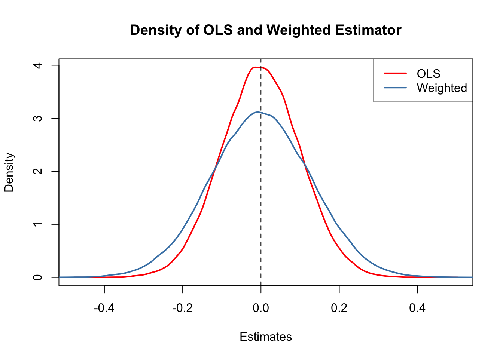


What conclusion can we draw from the result?

- Both estimators seem to be unbiased: the means of their estimated distributions are zero.
- The estimator using weights that deviate from those implied by OLS is less efficient than the OLS estimator: there is higher dispersion when weights are $w_i = \frac{1 \pm 0.8}{100}$ instead of $w_i=\frac{1}{100}$ as required by the OLS solution. 

Hence, the simulation results support the Gauss-Markov Theorem.

## Using the t-Statistic in Regression When the Sample Size Is Small

The three OLS assumptions discussed in Chapter \@ref(lrwor) (see Key Concept 4.3) are the foundation for the results on the large sample distribution of the OLS estimators in the simple regression model. What can be said about the distribution of the estimators and their $t$-statistics when the sample size is small and the population distribution of the data is unknown? Provided that the three least squares assumptions hold and the errors are normally distributed and homoskedastic (we refer to these conditions as the homoskedastic normal regression assumptions), we have normally distributed estimators and $t$-distributed test statistics in small samples. 

Recall the [definition](#thetdist) of a $t$-distributed variable

$$ \frac{Z}{\sqrt{W/M}} \sim t_M$$ 

where $Z$ is a standard normal random variable, $W$ is $\chi^2$ distributed with $M$ degrees of freedom and $Z$ and $W$ are independent. See section 5.6 in the book for a more detailed discussion of the small sample distribution of $t$-statistics in regression methods.

Let us simulate the distribution of regression $t$-statistics based on a large number of small random samples, say $n=20$, and compare the simulated distributions to the theoretical distributions which should be $t_{18}$, the $t$-distribution with $18$ degrees of freedom (recall that $\text{DF}=n-k-1$). 

 

```r
# initialize two vectors
beta_0 <- c()
beta_1 <- c()

# loop sampling / estimation / t statistics
for (i in 1:10000) {
  
  X <- runif(20, 0, 20)
  Y <- rnorm(n = 20, mean = X)
  reg <- summary(lm(Y ~ X))
  beta_0[i] <- (reg$coefficients[1, 1] - 0)/(reg$coefficients[1, 2])
  beta_1[i] <- (reg$coefficients[2, 1] - 1)/(reg$coefficients[2, 2])
  
}

# plot the distributions and compare with t_18 density:

# divide plotting area
par(mfrow = c(1, 2))

# plot the simulated density of beta_0
plot(density(beta_0), 
     lwd = 2 , 
     main = expression(widehat(beta)[0]), 
     xlim = c(-4, 4))

# add the t_18 density to the plot
curve(dt(x, df = 18), 
      add = T, 
      col = "red", 
      lwd = 2, 
      lty = 2)

# plot the simulated density of beta_1
plot(density(beta_1), 
     lwd = 2, 
     main = expression(widehat(beta)[1]), xlim = c(-4, 4)
     )

# add the t_18 density to the plot
curve(dt(x, df = 18), 
      add = T, 
      col = "red", 
      lwd = 2, 
      lty = 2) 
```


The outcomes are consistent with our expectations: the empirical distributions of both estimators seem to track the theoretical $t_{18}$ distribution quite closely.

## Exercises {#exercises-5}


<div  class = "DCexercise">

#### 1. Testing Two Null Hypotheses Separately {-}

Consider the estimated regression model

$$ \widehat{TestScore} = \underset{(23.96)}{567.43} - \underset{(0.85)}{7.15} \times STR, \, R^2 = 0.8976, \, SER=15.19 $$

with standard errors in parentheses.

**Instructions:**

+ Compute the $p$-value for a $t$-test of the hypothesis that the intercept is zero against the two-sided alternative that it is non-zero. Save the result to <tt>p_int</tt>
+ Compute the $p$-value for a $t$-test of the hypothesis that the coefficient of <tt>STR</tt> is zero against the two-sided alternative that it is non-zero. Save the result to <tt>p_STR</tt>

<iframe src="DCL/ex5_1.html" frameborder="0" scrolling="no" style="width:100%;height:340px"></iframe>

**Hint:** 

Both hypotheses can be tested individually using a two-sided test. Use <tt>pnorm()</tt> to obtain cumulated probabilities for standard normally distributed outcomes.

</div>


<div  class = "DCexercise">

#### 2. Two Null Hypotheses You Cannot Reject, Can You? {-}

Consider again the estimated regression model

$$\widehat{TestScore} = \underset{(23.96)}{567.43} - \underset{(0.85)}{7.15} \times STR, \, R^2 = 0.8976, \,SER=15.19$$

Can you reject the null hypotheses discussed in the previous code exercise using individual $t$-tests at the $5\%$ significance level?

The variables <tt>t_int</tt> and <tt>t_STR</tt> are the $t$-statistics. Both are available in your working environment.

**Instructions:**

+ Gather <tt>t_int</tt> and <tt>t_STR</tt> in a vector <tt>test</tt> and use logical operators to check whether the corresponding rejection rule applies.

<iframe src="DCL/ex5_2.html" frameborder="0" scrolling="no" style="width:100%;height:340px"></iframe>

**Hints:**

+ Both tests are two-sided $t$-tests. Key Concept 5.2 recaps how a two-sided $t$-test is conducted. 
+ Use <tt>qnorm()</tt> to obtain standard normal critical values.

</div>

    
<div  class = "DCexercise">

#### 3. Confidence Intervals {-}

<tt>mod</tt>, the object of class <tt>lm</tt> which contains the estimated regression model $$\widehat{TestScore} = \underset{(23.96)}{567.43} - \underset{(0.85)}{7.15} \times STR, \, R^2 = 0.8976, \,SER=15.19$$ is available in your working environment.

**Instructions:**

Compute $90\%$ confidence intervals for both coefficients. 

<iframe src="DCL/ex5_3.html" frameborder="0" scrolling="no" style="width:100%;height:340px"></iframe>

**Hint:**

Use the function <tt>confint()</tt>, see <tt>?confint</tt>. The argument <tt>level</tt> sets the confidence level to be used.

</div>


<div  class = "DCexercise">

#### 4. A Confidence Interval for the Mean I {-}

Consider the regression model $$Y_i = \beta_1 + u_i$$ where $Y_i \sim \mathcal{N}(\mu, \sigma^2)$. Following the discussion preceding equation \@ref(eq:KI), a $95\%$ confidence interval for the mean of the $Y_i$ can be computed as

$$CI^{\mu}_{0.95} = \left[\hat\mu - 1.96 \times \frac{\sigma}{\sqrt{n}}; \, \hat\mu + 1.96 \times \frac{\sigma}{\sqrt{n}} \right].$$

**Instructions:**

+ Sample $n=100$ observations from a normal distribution with variance $100$ and mean $10$.
+ Use the sample to estimate $\beta_1$. Save the estimate in <tt>mu_hat</tt>.
+ Assume that $\sigma^2 = 100$ is known. Replace the <tt>NA</tt>s in the code below to obtain a $95\%$ confidence interval for the mean of the $Y_i$.

<iframe src="DCL/ex5_4.html" frameborder="0" scrolling="no" style="width:100%;height:340px"></iframe>

**Hint:**

Use the function <tt>confint()</tt>, see <tt>?confint</tt>. The argument <tt>level</tt> sets the confidence level.

</div>


<div  class = "DCexercise">

#### 5. A Confidence Interval for the Mean II {-}

For historical reasons, some <tt>R</tt> functions which we use to obtain inference on model parameters, among them <tt>confint()</tt> and <tt>summary()</tt>, rely on the $t$-distribution instead of using the large-sample normal approximation. This is why for small sample sizes (and hence small degrees of freedom), $p$-values and confidence intervals reported by these functions deviate from those computed using critical values or cumulative probabilities of the standard normal distribution.

The $95\%$ confidence interval for the mean in the previous exercise is $[9.13, 13.05]$.

**Instructions:**

100 observations sampled from a normal distribution with $\mu=10$ and $\sigma^2=100$ have been assigned to the vector <tt>s</tt> which is available in your environment.

Set up a suitable regression model to estimate the mean of the observations in <tt>s</tt>. Then use <tt>confint()</tt> to compute a $95\%$ confidence interval for the mean.

(Check that the result is different from the interval reported above.)

<iframe src="DCL/ex5_5.html" frameborder="0" scrolling="no" style="width:100%;height:340px"></iframe>

</div>


<div  class = "DCexercise">

#### 6. Regression on a Dummy Variable I {-}

Chapter \@ref(rwxiabv) discusses regression when $X$ is a dummy variable. We have used a <tt>for()</tt> loop to generate a binary variable indicating whether a schooling district in the <tt>CASchools</tt> data set has a student-teacher ratio below $20$. Though it is instructive to use a loop for this, there are alternate ways to achieve the same with fewer lines of code.

A <tt>data.frame</tt> <tt>DF</tt> with $100$ observations of a variable <tt>X</tt> is available in your working environment.

**Instructions:**

+ Use <tt>ifelse()</tt> to generate a binary vector <tt>dummy</tt> indicating whether the observations in <tt>X</tt> are *positive*.

+ Append <tt>dummy</tt> to the <tt>data.frame</tt> <tt>DF</tt>.

<iframe src="DCL/ex5_6.html" frameborder="0" scrolling="no" style="width:100%;height:340px"></iframe>

</div>


<div  class = "DCexercise">

#### 7. Regression on a Dummy Variable II {-}

A <tt>data.frame</tt> <tt>DF</tt> with 100 observations on <tt>Y</tt> and the binary variable <tt>D</tt> from the previous exercise is available in your working environment.

**Instructions:**

+ Compute the group-specific sample means of the observations in <tt>Y</tt>: save the mean of observations in <tt>Y</tt> where <tt>dummy == 1</tt> to <tt>mu_Y_D1</tt> and assign the mean of those observations with <tt>D == 0</tt> to <tt>mu_Y_D0</tt>. 

+ Use <tt>lm()</tt> to regress <tt>Y</tt> on <tt>D</tt>, i.e., estimate the coefficients in the model $$Y_i = \beta_0 + \beta_1 \times D_i + u_i.$$

Also check that the estimates of the coefficients $\beta_0$ and $\beta_1$ reflect specific sample means. Can you tell which (no code submission needed)?

<iframe src="DCL/ex5_7.html" frameborder="0" scrolling="no" style="width:100%;height:340px"></iframe>

</div>


<div  class = "DCexercise">

#### 8. Regression on a Dummy Variable III {-}

In this exercise, you have to visualize some of the results from the dummy regression model $$\widehat{Y}_i = -0.66 + 1.43 \times D_i$$ estimated in the previous exercise.

A <tt>data.frame</tt> <tt>DF</tt> with 100 observations on <tt>X</tt> and the binary variable <tt>dummy</tt> as well as the model object <tt>dummy_mod</tt> from the previous exercise are available in your working environment.

**Instructions:**

+ Start by drawing a visually appealing plot of the observations on $Y$ and $D$ based on the code chunk provided in <tt>Script.R</tt>. Replace the <tt>???</tt> by the correct expressions!

+ Add the regression line to the plot.

<iframe src="DCL/ex5_8.html" frameborder="0" scrolling="no" style="width:100%;height:340px"></iframe>

</div>


<div  class = "DCexercise">

#### 9. Gender Wage Gap I {-}

The cross-section data set <tt>CPS1985</tt> is a subsample from the May 1985 *Current Population Survey* conducted by the *US Census Bureau* which contains observations on, among others things, wage and the gender of employees.

<tt>CPS1985</tt> is part of the package <tt>AER</tt>.

**Instructions:**

+ Attach the package <tt>AER</tt> and load the data set <tt>CPS1985</tt>.

+ Estimate the dummy regression model $$wage_i = \beta_0 + \beta_1 \cdot female_i + u_i$$ where 
  
    \begin{align*}
      female_i = 
      \begin{cases}
        1, & \text{if employee} \, i \, \text{is female,} \\
        0, & \text{if employee} \, i \,  \text{is male.}
      \end{cases}
    \end{align*}
  
    Save the result in <tt>wage_mod</tt>.

<iframe src="DCL/ex5_9.html" frameborder="0" scrolling="no" style="width:100%;height:340px"></iframe>

</div>


<div  class = "DCexercise">

#### 10. Gender Wage Gap II {-}

The wage regression from the previous exercise yields $$\widehat{wage}_i = 9.995 - 2.116 \cdot female_i.$$

The model object <tt>dummy_mod</tt> is available in your working environment.

**Instructions:**

+ Test the hypothesis that the coefficient on $female_i$ is zero against the alternative that it is non-zero. The null hypothesis implies that there is no gender wage gap. Use the heteroskedasticity-robust estimator proposed by @white1980.

<iframe src="DCL/ex5_10.html" frameborder="0" scrolling="no" style="width:100%;height:340px"></iframe>

**Hints:**

+ <tt>vcovHC()</tt> computes heteroskedasticity-robust estimates of the covariance matrix of the coefficient estimators for the model supplied. The estimator proposed by @white1980 is computed if you set <tt>type = "HC0"</tt>.

+ The function <tt>coeftest()</tt> performs significance tests for the coefficients in model objects. A covariance matrix can be supplied using the argument <tt>vcov.</tt>.

</div>


<div  class = "DCexercise">

#### 11. Computation of Heteroskedasticity-Robust Standard Errors {-}

In the simple regression model, the covariance matrix of the coefficient estimators is denoted

\begin{equation}
\text{Var}
  \begin{pmatrix}
    \hat\beta_0 \
    \hat\beta_1
  \end{pmatrix} = 
\begin{pmatrix}
  \text{Var}(\hat\beta_0) & \text{Cov}(\hat\beta_0,\hat\beta_1) \\
\text{Cov}(\hat\beta_0,\hat\beta_1) & \text{Var}(\hat\beta_1)
\end{pmatrix}
\end{equation}

The function <tt>vcovHC</tt> can be used to obtain estimates of this matrix for a model object of interest.

<tt>dummy_mod</tt>, a model object containing the wage regression dealt with in Exercises 9 and 10 is available in your working environment.

**Instructions:**

+ Compute robust standard errors of the type <tt>HC1</tt> for the coefficients estimators in the model object <tt>dummy_mod</tt>. Store the standard errors in a vector named <tt>rob_SEs</tt>.

<iframe src="DCL/ex5_11.html" frameborder="0" scrolling="no" style="width:100%;height:340px"></iframe>

**Hints**

+ The standard errors we seek can be obtained by taking the square root of the diagonal elements of the estimated covariance matrix. 
+ <tt>diag(A)</tt> returns the diagonal elements of the matrix <tt>A</tt>.


</div>


<div  class = "DCexercise">

#### 12. Robust Confidence Intervals {-}

The function <tt>confint()</tt> computes confidence intervals for regression models using homoskedasticity-only standard errors so this function is not an option when there is heteroskedasticity.

The function <tt>Rob_CI()</tt> in <tt>script.R</tt> is meant to compute and report heteroskedasticity-robust confidence intervals for both model coefficients in a simple regression model.

<tt>gender_mod</tt>, a model object containing the wage regression dealt with in the previous exercises is available in your working environment.

**Instructions:**

+ Complete the code of <tt>Rob_CI()</tt> given in <tt>Script.R</tt> such that lower and upper bounds of $95\%$ robust confidence intervals are returned. Use standard errors of the type <tt>HC1</tt>.

+ Use the function <tt>Rob_CI()</tt> to obtain $95\%$ confidence intervals for the model coefficients in <tt>dummy_mod</tt>.

<iframe src="DCL/ex5_12.html" frameborder="0" scrolling="no" style="width:100%;height:340px"></iframe>

</div>


<div  class = "DCexercise">

#### 13. A Small Simulation Study --- I {-}

Consider the data generating process (DGP)
\begin{align}
  X_i \sim& \, \mathcal{U}[2,10], \notag \\
  e_i \sim& \, \mathcal{N}(0, X_i), \notag \\
  Y_i =& \, \beta_1 X_i + e_i, (\#eq:asss)  
\end{align}
where $\mathcal{U}[2,10]$ denotes the uniform distribution on the interval $[2,10]$ and $\beta_1=2$.

Notice that the errors $e_i$ are heteroskedastic since the variance of the $e_i$ is a function of $X_i$.

**Instructions:**

+ Write a function <tt>DGP_OLS</tt> that generates a sample $(X_i,Y_i)$, $i=1,…,100$ using the DGP above and returns the OLS estimate of $\beta_1$ based on this sample.

<iframe src="DCL/ex5_13.html" frameborder="0" scrolling="no" style="width:100%;height:340px"></iframe>

**Hint:**

<tt>runif()</tt> can be used to obtain random samples from a uniform distribution, see <tt>?runif</tt>.

</div>


<div  class = "DCexercise">

#### 14. A Small Simulation Study --- II {-}

The function <tt>DGP_OLS()</tt> from the previous exercise is available in your working environment.

**Instructions:**

+ Use <tt>replicate()</tt> to generate a sample of $1000$ OLS estimates $\widehat{\beta}_1$ using the function <tt>DGP_OLS</tt>. Store the estimates in a vector named <tt>estimates</tt>.

+ Next, estimate the variance of $\widehat{\beta}_1$ in \@ref(eq:asss): compute the sample variance of the $1000$ OLS estimates in <tt>estimates</tt>. Store the result in <tt>est_var_OLS</tt>.

<iframe src="DCL/ex5_14.html" frameborder="0" scrolling="no" style="width:100%;height:340px"></iframe>

</div>


<div  class = "DCexercise">

#### 15. A Small Simulation Study --- III {-}

According to the the Gauss-Markov theorem, the OLS estimator in linear regression models is no longer the most efficient estimator among the conditionally unbiased linear estimators when there is heteroskedasticity. In other words, the OLS estimator loses the BLUE property when the assumption of homoskedasticity is violated.

It turns out that OLS applied to the weighted observations $(w_i X_i, w_i Y_i)$ where $w_i=\frac{1}{\sigma_i}$ is the BLUE estimator under heteroskedasticity. This estimator is called the *weighted least squares* (WLS) estimator. Thus, when there is heteroskedasticity, the WLS estimator has lower variance than OLS.

The function <tt>DGP_OLS()</tt> and the estimated variance <tt>est_var_OLS</tt> from the previous exercises are available in your working environment.

**Instructions:**

+ Write a function <tt>DGP_WLS()</tt> that generates $100$ samples using the DGP introduced in Exercise 13 and returns the WLS estimate of $\beta_1$. Treat $\sigma_i$ as known, i.e., set $w_i=\frac{1}{\sqrt{X_i}}$.

+ Repeat exercise 14 using <tt>DGP_WLS()</tt>. Store the variance estimate in <tt>est_var_GLS</tt>.

+ Compare the estimated variances <tt>est_var_OLS</tt> and <tt>est_var_GLS</tt> using logical operators (<tt><</tt> or <tt>></tt>).

<iframe src="DCL/ex5_15.html" frameborder="0" scrolling="no" style="width:100%;height:340px"></iframe>

**Hints:**

+ <tt>DGP_WLS()</tt> can be obtained using a modified code of <tt>DGP_OLS()</tt>.

+ Remember that functions are objects and you may print the code of a function to the console.

</div>


<!--chapter:end:05-ch5.Rmd-->

# Regression Models with Multiple Regressors {#rmwmr}

In what follows we introduce linear regression models that use more than just one explanatory variable and discuss important key concepts in multiple regression. As we broaden our scope beyond the relationship of only two variables (the dependent variable and a single regressor) some potential new issues arise such as *multicollinearity* and *omitted variable bias* (OVB). In particular, this chapter deals with omitted variables and its implication for causal interpretation of OLS-estimated coefficients. 

Naturally, we will discuss estimation of multiple regression models using <tt>R</tt>. We will also illustrate the importance of thoughtful usage of multiple regression models via simulation studies that demonstrate the consequences of using highly correlated regressors or misspecified models. 

The packages <tt>AER</tt> [@R-AER] and <tt>MASS</tt> [@R-MASS] are needed for reproducing the code presented in this chapter. Make sure that the following code chunk executes without any errors.


```r
library(AER)
library(MASS)
```

## Omitted Variable Bias

The previous analysis of the relationship between test score and class size discussed in Chapters \@ref(lrwor) and \@ref(htaciitslrm) has a major flaw: we ignored other determinants of the dependent variable (test score) that correlate with the regressor (class size). Remember that influences on the dependent variable which are not captured by the model are collected in the error term, which we so far assumed to be uncorrelated with the regressor. However, this assumption is violated if we exclude determinants of the dependent variable which vary with the regressor. This might induce an estimation bias, i.e., the mean of the OLS estimator's sampling distribution is no longer equals the true mean. In our example we therefore wrongly estimate the causal effect on test scores of a unit change in the student-teacher ratio, on average. This issue is called *omitted variable bias* (OVB) and is summarized by Key Concept 6.1.


<div class = "keyconcept" id="KC6.1">
<h3 class = "right"> Key Concept 6.1 </h3>          
<h3 class = "left"> Omitted Variable Bias in Regression with a Single Regressor </h3>

Omitted variable bias is the bias in the OLS estimator that arises when the regressor, $X$, is *correlated* with an omitted variable. For omitted variable bias to occur, two conditions must be fulfilled:

1. $X$ is correlated with the omitted variable. 
2. The omitted variable is a determinant of the dependent variable $Y$.

Together, 1. and 2. result in a violation of the first OLS assumption $E(u_i\vert X_i) = 0$. Formally, the resulting bias can be expressed as

$$ \hat\beta_1 \xrightarrow[]{p} \beta_1 + \rho_{Xu} \frac{\sigma_u}{\sigma_X}. \tag{6.1} $$
See Appendix 6.1 of the book for a detailed derivation. (<a href="#mjx-eqn-6.1">6.1</a>) states that OVB is a problem that cannot be solved by increasing the number of observations used to estimate $\beta_1$, as $\hat\beta_1$ is inconsistent: OVB prevents the estimator from converging in probability to the true parameter value. Strength and direction of the bias are determined by $\rho_{Xu}$, the correlation between the error term and the regressor.

</div>


In the example of test score and class size, it is easy to come up with variables that may cause such a bias, if omitted from the model. As mentioned in the book, a highly relevant variable could be the percentage of English learners in the school district: it is plausible that the ability to speak, read and write English is an important factor for successful learning. Therefore, students that are still learning English are likely to perform worse in tests than native speakers. Also, it is conceivable that the share of English learning students is bigger in school districts where class sizes are relatively large: think of poor urban districts where a lot of immigrants live. <br>

Let us think about a possible bias induced by omitting the share of English learning students ($PctEL$) in view of (6.1). When the estimated regression model does not include $PctEL$ as a regressor although the true data generating process (DGP) is 

$$ TestScore = \beta_0 + \beta_1 \times STR + \beta_2 \times PctEL \tag{6.2}$$ 

where $STR$ and $PctEL$ are correlated, we have 

$$\rho_{STR,PctEL}\neq0.$$

Let us investigate this using <tt>R</tt>. After defining our variables we may compute the correlation between $STR$ and $PctEL$ as well as the correlation between $STR$ and $TestScore$.


```r
# load the AER package
library(AER)

# load the data set
data(CASchools)   

# define variables
CASchools$STR <- CASchools$students/CASchools$teachers       
CASchools$score <- (CASchools$read + CASchools$math)/2

# compute correlations
cor(CASchools$STR, CASchools$score)
#> [1] -0.2263627
cor(CASchools$STR, CASchools$english)
#> [1] 0.1876424
```

The fact that $\widehat{\rho}_{STR, Testscore} = -0.2264$ is cause for concern that omitting $PctEL$ leads to a negatively biased estimate $\hat\beta_1$ since this indicates that $\rho_{Xu} < 0$. As a consequence we expect $\hat\beta_1$,  the coefficient on $STR$, to be too large in absolute value. Put differently, the OLS estimate of $\hat\beta_1$ suggests that small classes improve test scores, but that the effect of small classes is overestimated as it captures the effect of having fewer English learners, too. 

What happens to the magnitude of $\hat\beta_1$ if we add the variable $PctEL$ to the regression, that is, if we estimate the model 
$$ TestScore = \beta_0 + \beta_1 \times STR + \beta_2 \times PctEL + u $$

instead? And what do we expect about the sign of $\hat\beta_2$, the estimated coefficient on $PctEL$? Following the reasoning above we should still end up with a negative but larger coefficient estimate $\hat\beta_1$ than before and a negative estimate $\hat\beta_2$. 

Let us estimate both regression models and compare. Performing a multiple regression in <tt>R</tt> is straightforward. One can simply add additional variables to the right hand side of the `formula` argument of the function <tt>lm()</tt> by using their names and the <tt>+</tt> operator. 


```r
# estimate both regression models
mod <- lm(score ~ STR, data = CASchools) 
mult.mod <- lm(score ~ STR + english, data = CASchools)

# print the results to the console
mod
#> 
#> Call:
#> lm(formula = score ~ STR, data = CASchools)
#> 
#> Coefficients:
#> (Intercept)          STR  
#>      698.93        -2.28
mult.mod
#> 
#> Call:
#> lm(formula = score ~ STR + english, data = CASchools)
#> 
#> Coefficients:
#> (Intercept)          STR      english  
#>    686.0322      -1.1013      -0.6498
```

We find the outcomes to be consistent with our expectations.

The following section discusses some theory on multiple regression models.

## The Multiple Regression Model {#tmrm}

The multiple regression model extends the basic concept of the simple regression model discussed in Chapters \@ref(lrwor) and \@ref(htaciitslrm). A multiple regression model enables us to estimate the effect on $Y_i$ of changing a regressor $X_{1i}$ if the remaining regressors $X_{2i},X_{3i}\dots,X_{ki}$ *do not vary*. In fact we already have performed estimation of the multiple regression model (<a href="#mjx-eqn-6.2">6.2</a>) using <tt>R</tt> in the previous section. The interpretation of the coefficient on student-teacher ratio is the effect on test scores of a one unit change student-teacher ratio if the percentage of English learners is kept constant.

Just like in the simple regression model, we assume the true relationship between $Y$ and $X_{1i},X_{2i}\dots\dots,X_{ki}$ to be linear. On average, this relation is given by the population regression function

$$ E(Y_i\vert X_{1i}=x_1, X_{2i}=x_2,  X_{3i}=x_3,\dots, X_{ki}=x_k) = \beta_0 + \beta_1 x_1 + \beta_2 x_2 + \beta_3 x_3 + \dots + \beta_k x_k. \tag{6.3} $$

As in the simple regression model, the relation $$Y_i = \beta_0 + \beta_1 X_{1i} + \beta_2 X_{2i} + \beta_3 X_{3i} + \dots + \beta_k X_{ki}$$ does not hold exactly since there are disturbing influences to the dependent variable $Y$ we cannot observe as explanatory variables. Therefore we add an error term $u$ which represents deviations of the observations from the population regression line to (<a href="#mjx-eqn-6.3">6.3</a>). This yields the population multiple regression model $$ Y_i = \beta_0 + \beta_1 X_{1i} + \beta_2 X_{2i} + \beta_3 X_{3i} + \dots + \beta_k X_{ki} + u_i, \ i=1,\dots,n. \tag{6.4} $$ 

Key Concept 6.2 summarizes the core concepts of the multiple regression model.


<div class = "keyconcept" id="KC6.2">
<h3 class = "right"> Key Concept 6.2 </h3>          
<h3 class = "left"> The Multiple Regression Model </h3>

The multiple regression model is

$$ Y_i = \beta_0 + \beta_1 X_{1i} + \beta_2 X_{2i} + \beta_3 X_{3i} + \dots + \beta_k X_{ki} + u_i \ \ , \ \ i=1,\dots,n.  $$ 

The designations are similar to those in the simple regression model:

- $Y_i$ is the $i^{th}$ observation in the dependent variable. Observations on the $k$ regressors are denoted by $X_{1i},X_{2i},\dots,X_{ki}$ and $u_i$ is the error term.
- The average relationship between $Y$ and the regressors is given by the population regression line
$$ E(Y_i\vert X_{1i}=x_1, X_{2i}=x_2,  X_{3i}=x_3,\dots, X_{ki}=x_k) = \beta_0 + \beta_1 x_1 + \beta_2 x_2 + \beta_3 x_3 + \dots + \beta_k x_k. $$
- $\beta_0$ is the intercept; it is the expected value of $Y$ when all $X$s equal $0$. $\beta_j \ , \ j=1,\dots,k$ are the coefficients on $X_j \ , \ j=1,\dots,k$. $\beta_1$ measures the expected change in $Y_i$ that results from a one unit change in $X_{1i}$ while holding all other regressors constant. 
</div>


How can we estimate the coefficients of the multiple regression model (<a href="#mjx-eqn-6.4">6.4</a>)? We will not go too much into detail on this issue as our focus is on using <tt>R</tt>. However, it should be pointed out that, similarly to the simple regression model, the coefficients of the multiple regression model can be estimated using OLS. As in the simple model, we seek to minimize the sum of squared mistakes by choosing estimates $b_0,b_1,\dots,b_k$ for the coefficients $\beta_0,\beta_1,\dots,\beta_k$ such that 

$$\sum_{i=1}^n (Y_i - b_0 - b_1 X_{1i} - b_2 X_{2i} - \dots -  b_k X_{ki})^2 \tag{6.5}$$

is minimized. Note that (<a href="#mjx-eqn-6.5">6.5</a>) is simply an extension of $SSR$ in the case with just one regressor and a constant. The estimators that minimize (<a href="#mjx-eqn-6.5">6.5</a>) are hence denoted $\hat\beta_0,\hat\beta_1,\dots,\hat\beta_k$ and, as in the simple regression model, we call them the ordinary least squares estimators of $\beta_0,\beta_1,\dots,\beta_k$. For the predicted value of $Y_i$ given the regressors and the estimates $\hat\beta_0,\hat\beta_1,\dots,\hat\beta_k$ we have

$$ \hat{Y}_i = \hat\beta_0 + \hat\beta_1 X_{1i} + \dots +\hat\beta_k X_{ki}. $$
The difference between $Y_i$ and its predicted value $\hat{Y}_i$ is called the OLS residual of observation $i$: $\hat{u} = Y_i - \hat{Y}_i$.

For further information regarding the theory behind multiple regression, see Chapter 18.1 of the book which inter alia presents a derivation of the OLS estimator in the multiple regression model using matrix notation.

Now let us jump back to the example of test scores and class sizes. The estimated model object is `mult.mod`. As for simple regression models we can use <tt>summary()</tt> to obtain information on estimated coefficients and model statistics.


```r
summary(mult.mod)$coef
#>                Estimate Std. Error    t value      Pr(>|t|)
#> (Intercept) 686.0322445 7.41131160  92.565565 3.871327e-280
#> STR          -1.1012956 0.38027827  -2.896026  3.978059e-03
#> english      -0.6497768 0.03934254 -16.515882  1.657448e-47
```

So the estimated multiple regression model is

$$ \widehat{TestScore} = 686.03 - 1.10 \times STR - 0.65 \times PctEL \tag{6.6}.  $$

Unlike in the simple regression model where the data can be represented by points in the two-dimensional coordinate system, we now have three dimensions. Hence observations can be represented by points in three-dimensional space. Therefore (<a href="#mjx-eqn-6.6">6.6</a>) is now longer a regression line but a *regression plane*. This idea extends to higher dimensions when we further expand the number of regressors $k$. We then say that the regression model can be represented by a hyperplane in the $k+1$ dimensional space. It is already hard to imagine such a space if $k=3$ and we best stick with the general idea that, in the multiple regression model, the dependent variable is explained by a *linear combination of the regressors*. However, in the present case we are able to visualize the situation. The following figure is an interactive 3D visualization of the data and the estimated regression plane (<a href="#mjx-eqn-6.6">6.6</a>).

<center>

```{=html}
<div class="plotly html-widget html-fill-item-overflow-hidden html-fill-item" id="htmlwidget-c06bba767a7c38b8d4bb" style="width:80%;height:480px;"></div>
<script type="application/json" data-for="htmlwidget-c06bba767a7c38b8d4bb">{"x":{"visdat":{"cf592ad3beb":["function () ","plotlyVisDat"],"cf593b38c2ac":["function () ","data"]},"cur_data":"cf593b38c2ac","attrs":{"cf592ad3beb":{"x":[14,14.4916666666667,14.9833333333333,15.475,15.9666666666667,16.4583333333333,16.95,17.4416666666667,17.9333333333333,18.425,18.9166666666667,19.4083333333333,19.9,20.3916666666667,20.8833333333333,21.375,21.8666666666667,22.3583333333333,22.85,23.3416666666667,23.8333333333333,24.325,24.8166666666667,25.3083333333333,25.8],"y":[0,3.5641549428304,7.12830988566081,10.6924648284912,14.2566197713216,17.820774714152,21.3849296569824,24.9490845998128,28.5132395426432,32.0773944854736,35.641549428304,39.2057043711344,42.7698593139648,46.3340142567952,49.8981691996257,53.4623241424561,57.0264790852865,60.5906340281169,64.1547889709473,67.7189439137777,71.2830988566081,74.8472537994385,78.4114087422689,81.9755636850993,85.5397186279297],"z":[[670.614105498156,670.072635138979,669.531164779801,668.989694420623,668.448224061446,667.906753702268,667.36528334309,666.823812983912,666.282342624735,665.740872265557,665.199401906379,664.657931547202,664.116461188024,663.574990828846,663.033520469668,662.492050110491,661.950579751313,661.409109392135,660.867639032958,660.32616867378,659.784698314602,659.243227955425,658.701757596247,658.160287237069,657.618816877891],[668.298200193628,667.75672983445,667.215259475273,666.673789116095,666.132318756917,665.590848397739,665.049378038562,664.507907679384,663.966437320206,663.424966961029,662.883496601851,662.342026242673,661.800555883496,661.259085524318,660.71761516514,660.176144805962,659.634674446785,659.093204087607,658.551733728429,658.010263369252,657.468793010074,656.927322650896,656.385852291718,655.844381932541,655.302911573363],[665.9822948891,665.440824529922,664.899354170744,664.357883811567,663.816413452389,663.274943093211,662.733472734034,662.192002374856,661.650532015678,661.1090616565,660.567591297323,660.026120938145,659.484650578967,658.94318021979,658.401709860612,657.860239501434,657.318769142257,656.777298783079,656.235828423901,655.694358064723,655.152887705546,654.611417346368,654.06994698719,653.528476628013,652.987006268835],[663.666389584572,663.124919225394,662.583448866216,662.041978507038,661.500508147861,660.959037788683,660.417567429505,659.876097070328,659.33462671115,658.793156351972,658.251685992794,657.710215633617,657.168745274439,656.627274915261,656.085804556084,655.544334196906,655.002863837728,654.461393478551,653.919923119373,653.378452760195,652.836982401017,652.29551204184,651.754041682662,651.212571323484,650.671100964307],[661.350484280043,660.809013920866,660.267543561688,659.72607320251,659.184602843333,658.643132484155,658.101662124977,657.560191765799,657.018721406622,656.477251047444,655.935780688266,655.394310329089,654.852839969911,654.311369610733,653.769899251555,653.228428892378,652.6869585332,652.145488174022,651.604017814845,651.062547455667,650.521077096489,649.979606737312,649.438136378134,648.896666018956,648.355195659778],[659.034578975515,658.493108616337,657.95163825716,657.410167897982,656.868697538804,656.327227179626,655.785756820449,655.244286461271,654.702816102093,654.161345742916,653.619875383738,653.07840502456,652.536934665383,651.995464306205,651.453993947027,650.912523587849,650.371053228672,649.829582869494,649.288112510316,648.746642151139,648.205171791961,647.663701432783,647.122231073605,646.580760714428,646.03929035525],[656.718673670987,656.177203311809,655.635732952631,655.094262593454,654.552792234276,654.011321875098,653.46985151592,652.928381156743,652.386910797565,651.845440438387,651.30397007921,650.762499720032,650.221029360854,649.679559001676,649.138088642499,648.596618283321,648.055147924143,647.513677564966,646.972207205788,646.43073684661,645.889266487433,645.347796128255,644.806325769077,644.264855409899,643.723385050722],[654.402768366459,653.861298007281,653.319827648103,652.778357288925,652.236886929748,651.69541657057,651.153946211392,650.612475852215,650.071005493037,649.529535133859,648.988064774681,648.446594415504,647.905124056326,647.363653697148,646.822183337971,646.280712978793,645.739242619615,645.197772260438,644.65630190126,644.114831542082,643.573361182904,643.031890823727,642.490420464549,641.948950105371,641.407479746194],[652.08686306193,651.545392702752,651.003922343575,650.462451984397,649.920981625219,649.379511266042,648.838040906864,648.296570547686,647.755100188509,647.213629829331,646.672159470153,646.130689110975,645.589218751798,645.04774839262,644.506278033442,643.964807674265,643.423337315087,642.881866955909,642.340396596731,641.798926237554,641.257455878376,640.715985519198,640.174515160021,639.633044800843,639.091574441665],[649.770957757402,649.229487398224,648.688017039047,648.146546679869,647.605076320691,647.063605961513,646.522135602336,645.980665243158,645.43919488398,644.897724524803,644.356254165625,643.814783806447,643.27331344727,642.731843088092,642.190372728914,641.648902369736,641.107432010559,640.565961651381,640.024491292203,639.483020933026,638.941550573848,638.40008021467,637.858609855492,637.317139496315,636.775669137137],[647.455052452874,646.913582093696,646.372111734518,645.830641375341,645.289171016163,644.747700656985,644.206230297807,643.66475993863,643.123289579452,642.581819220274,642.040348861097,641.498878501919,640.957408142741,640.415937783563,639.874467424386,639.332997065208,638.79152670603,638.250056346853,637.708585987675,637.167115628497,636.62564526932,636.084174910142,635.542704550964,635.001234191786,634.459763832609],[645.139147148345,644.597676789168,644.05620642999,643.514736070812,642.973265711635,642.431795352457,641.890324993279,641.348854634101,640.807384274924,640.265913915746,639.724443556568,639.182973197391,638.641502838213,638.100032479035,637.558562119857,637.01709176068,636.475621401502,635.934151042324,635.392680683147,634.851210323969,634.309739964791,633.768269605614,633.226799246436,632.685328887258,632.14385852808],[642.823241843817,642.281771484639,641.740301125462,641.198830766284,640.657360407106,640.115890047929,639.574419688751,639.032949329573,638.491478970396,637.950008611218,637.40853825204,636.867067892862,636.325597533685,635.784127174507,635.242656815329,634.701186456152,634.159716096974,633.618245737796,633.076775378618,632.535305019441,631.993834660263,631.452364301085,630.910893941908,630.36942358273,629.827953223552],[640.507336539289,639.965866180111,639.424395820933,638.882925461756,638.341455102578,637.7999847434,637.258514384223,636.717044025045,636.175573665867,635.634103306689,635.092632947512,634.551162588334,634.009692229156,633.468221869979,632.926751510801,632.385281151623,631.843810792446,631.302340433268,630.76087007409,630.219399714912,629.677929355735,629.136458996557,628.594988637379,628.053518278202,627.512047919024],[638.191431234761,637.649960875583,637.108490516405,636.567020157227,636.02554979805,635.484079438872,634.942609079694,634.401138720517,633.859668361339,633.318198002161,632.776727642984,632.235257283806,631.693786924628,631.15231656545,630.610846206273,630.069375847095,629.527905487917,628.98643512874,628.444964769562,627.903494410384,627.362024051207,626.820553692029,626.279083332851,625.737612973673,625.196142614496],[635.875525930232,635.334055571055,634.792585211877,634.251114852699,633.709644493522,633.168174134344,632.626703775166,632.085233415988,631.543763056811,631.002292697633,630.460822338455,629.919351979278,629.3778816201,628.836411260922,628.294940901744,627.753470542567,627.212000183389,626.670529824211,626.129059465034,625.587589105856,625.046118746678,624.504648387501,623.963178028323,623.421707669145,622.880237309967],[633.559620625704,633.018150266526,632.476679907349,631.935209548171,631.393739188993,630.852268829815,630.310798470638,629.76932811146,629.227857752282,628.686387393105,628.144917033927,627.603446674749,627.061976315572,626.520505956394,625.979035597216,625.437565238038,624.896094878861,624.354624519683,623.813154160505,623.271683801328,622.73021344215,622.188743082972,621.647272723794,621.105802364617,620.564332005439],[631.243715321176,630.702244961998,630.16077460282,629.619304243643,629.077833884465,628.536363525287,627.99489316611,627.453422806932,626.911952447754,626.370482088576,625.829011729399,625.287541370221,624.746071011043,624.204600651866,623.663130292688,623.12165993351,622.580189574333,622.038719215155,621.497248855977,620.955778496799,620.414308137622,619.872837778444,619.331367419266,618.789897060089,618.248426700911],[628.927810016648,628.38633965747,627.844869298292,627.303398939114,626.761928579937,626.220458220759,625.678987861581,625.137517502404,624.596047143226,624.054576784048,623.51310642487,622.971636065693,622.430165706515,621.888695347337,621.34722498816,620.805754628982,620.264284269804,619.722813910627,619.181343551449,618.639873192271,618.098402833093,617.556932473916,617.015462114738,616.47399175556,615.932521396383],[626.611904712119,626.070434352941,625.528963993764,624.987493634586,624.446023275408,623.904552916231,623.363082557053,622.821612197875,622.280141838698,621.73867147952,621.197201120342,620.655730761164,620.114260401987,619.572790042809,619.031319683631,618.489849324454,617.948378965276,617.406908606098,616.865438246921,616.323967887743,615.782497528565,615.241027169388,614.69955681021,614.158086451032,613.616616091854],[624.295999407591,623.754529048413,623.213058689236,622.671588330058,622.13011797088,621.588647611702,621.047177252525,620.505706893347,619.964236534169,619.422766174992,618.881295815814,618.339825456636,617.798355097459,617.256884738281,616.715414379103,616.173944019925,615.632473660748,615.09100330157,614.549532942392,614.008062583215,613.466592224037,612.925121864859,612.383651505681,611.842181146504,611.300710787326],[621.980094103063,621.438623743885,620.897153384707,620.35568302553,619.814212666352,619.272742307174,618.731271947996,618.189801588819,617.648331229641,617.106860870463,616.565390511286,616.023920152108,615.48244979293,614.940979433752,614.399509074575,613.858038715397,613.316568356219,612.775097997042,612.233627637864,611.692157278686,611.150686919509,610.609216560331,610.067746201153,609.526275841975,608.984805482798],[619.664188798534,619.122718439357,618.581248080179,618.039777721001,617.498307361824,616.956837002646,616.415366643468,615.87389628429,615.332425925113,614.790955565935,614.249485206757,613.70801484758,613.166544488402,612.625074129224,612.083603770047,611.542133410869,611.000663051691,610.459192692514,609.917722333336,609.376251974158,608.83478161498,608.293311255803,607.751840896625,607.210370537447,606.668900178269],[617.348283494006,616.806813134828,616.265342775651,615.723872416473,615.182402057295,614.640931698118,614.09946133894,613.557990979762,613.016520620585,612.475050261407,611.933579902229,611.392109543051,610.850639183874,610.309168824696,609.767698465518,609.22622810634,608.684757747163,608.143287387985,607.601817028807,607.06034666963,606.518876310452,605.977405951274,605.435935592097,604.894465232919,604.352994873741],[615.032378189478,614.4909078303,613.949437471123,613.407967111945,612.866496752767,612.325026393589,611.783556034412,611.242085675234,610.700615316056,610.159144956879,609.617674597701,609.076204238523,608.534733879345,607.993263520168,607.45179316099,606.910322801812,606.368852442635,605.827382083457,605.285911724279,604.744441365102,604.202971005924,603.661500646746,603.120030287568,602.578559928391,602.037089569213]],"opacity":0.9,"name":"Reg.Plane","colors":"red","alpha_stroke":1,"sizes":[10,100],"spans":[1,20],"type":"surface"},"cf593b38c2ac":{"x":[17.8899088829779,21.5246644135433,18.6972252288335,17.3571428571429,18.6713286713287,21.406249681022,19.5,20.8941176470588,19.9473684210526,20.8055555555556,21.2380952380952,21,20.6,20.0082168014375,18.0277777777778,20.2519611642598,16.9778699413794,16.5098039215686,22.7040227954819,19.9111111111111,18.3333333333333,22.6190476190476,19.448275862069,25.0526315789474,20.6754385964912,18.6823529411765,22.8455293273174,19.2666666666667,19.25,20.5454545454545,20.6069651741294,21.0726817042607,21.5358144363179,19.904,21.1940684544254,21.8653548739123,18.3296457083095,16.2285714285714,19.1785714285714,20.2773673693064,22.9861365135517,20.4444444444444,19.8208464129607,23.205223880597,19.2669683257919,23.3018867924528,21.1882860271413,20.8717948717949,19.0174947515745,21.9193802349385,20.1012373453318,21.4765100671141,20.0657888748265,20.3750946304228,22.446482206684,22.8952380952381,20.4979697160857,19.9999997290939,22.2565805492426,21.5643629196127,19.4773712501098,17.6700201456427,21.9475616151023,21.7833935018051,19.14,18.1104972375691,20.6824250654847,22.6236080178174,21.7864987387076,18.5829312134509,21.5454545454545,21.1528918488938,16.6333333333333,21.1443830899838,19.7818181818182,18.9837288944761,17.6676680724533,17.754991247092,15.2727272727273,14,20.5961335276821,16.3116883116883,21.1279620853081,17.4880123598627,17.8867924528302,19.3067588435028,20.8923076923077,21.2868392089495,20.1955990220049,24.95,18.1304347826087,20,18.7295084895385,18.25,18.9925686639621,19.8876413018577,19.3789473684211,20.4625850340136,22.2915734818168,20.7047392724654,19.0600525989991,20.2324702908189,19.6901229507238,20.3625387030444,19.7542237411884,19.3797669431263,22.9235094024774,19.3733975555516,19.1551557767,21.3,18.3035717402794,21.0792562824344,18.791208003486,19.6266181276984,19.590164240699,20.8718719045074,21.1150007392067,20.0845208845209,19.9104890079458,17.8128519025892,18.1333333333333,19.2222109626064,18.6607146035044,19.6,19.2838427947598,22.8181818181818,18.8092193175492,21.3736332119715,20.0204081632653,21.4986149584488,15.4285714285714,22.4,20.1270869566436,19.0379746835443,17.3421579447488,17.0186331371371,20.8,21.1538461538462,18.4583333333333,19.1408207270671,19.4076576857931,19.5689648737097,21.5012000186184,17.5294117647059,16.4301713487041,19.7965402233519,17.1861336595179,17.6158935947066,20.1253715192381,22.1666666666667,19.9615384615385,19.0394513640815,15.2243595327852,21.1447499009334,19.6438998246679,21.0486891385768,20.1754385964912,21.3913043478261,20.0083249004548,20.2913719276809,17.6666666666667,18.2205506816453,20.2710018717861,20.1989464047365,21.3842445345418,20.9736842105263,20,17.1532849103452,22.3497705836374,22.1700710363591,18.1818181818182,18.9571428571429,19.7453305580818,16.4262295081967,16.6253976791474,16.38176709392,20.0741582358159,17.9954440870962,19.3913043478261,16.4285717083483,16.7294869588045,24.4134521894715,18.2641509433962,18.9550418244691,21.0389615601121,20.7407407407407,18.1,19.8461538461538,21.6,22.4424209045409,23.0143764873862,17.7489176651741,18.2866407796733,19.2654419132432,22.6666666666667,19.2941176470588,17.3636363636364,19.8214290624205,20.4337797063172,21.0372093023256,19.9246234975196,19.0098568462085,23.8222222222222,19.3690847073363,19.8285714285714,15.2588552686217,17.1612903225806,21.8133333333333,19.0747133426306,25.7851231540294,18.212614444761,18.166064157175,16.972972972973,21.5008728866294,20.6,16.9902909475106,20.7795456185188,15.5124660296439,19.8850574712644,21.3988234659086,20.497512048797,19.3637581871342,17.659575184744,21.0179561441264,19.0556494863121,22.5384615384615,21.1078711835393,20.0513538034642,14.2017629244119,18.4768683274021,18.6354166666667,20.9459459459459,21.0854825556009,18.6928802180985,20.8680790498909,19.8255776972916,19.75,19.5,18.3908050008928,18.7867641789278,19.7701804862839,19.3333333333333,21.4639175257732,23.0849235566616,21.0629924423187,18.6868694069167,20.7702354006901,19.3055560669781,20.1328025598196,20.6696349496271,22.2815533980583,20.6002719936284,20.8273387010791,19.2249242350677,17.654770182971,17,16.4977277151551,19.7826084222295,22.3021585029028,17.7307692307692,20.4483612471435,20.3716944004797,20.1647869771202,21.6153779636056,20.5614288634761,19.9555109812711,21.183870895869,18.8104238242347,20.5783834180104,18.3246072688457,18.8206265775451,20.8163265306122,20,19.6818181818182,19.3901773923638,20.9273188292824,19.9443667533701,20.7910936237841,19.2035394988686,19.0243905162187,17.620578201782,20.2371534527511,19.2937402041726,18.8299814558293,20.3394923570245,19.2289969016058,17.8913043478261,19.5188096275881,19.0845072985972,19.9354838709677,18.8732569838045,20.1417852051784,23.5563711810368,21.4647887323944,19.1910112359551,20.1307996029783,25.8,18.7777401224092,19.1098147138764,19.7010865991333,18.6159420289855,20.9972114934227,20,20.9832509897728,21.6426229508197,20.0296731370496,19.8113968408637,18,19.3581078586307,20.1791214452076,21.1198631939305,23.3897364771151,22.1818181818182,19.9428279074446,17.7882555232377,14.7058821982578,19.040767037723,20.8919540229885,19.8385070816457,19.5219120539036,20.6862176489988,18.1818181818182,18.8922429984947,24.8888888888889,18.5806451612903,18.04,17.7339901477833,21.4545454545455,19.9234247876565,20.3394199785177,22.5460750853242,21.1034424809305,18.1974254885637,20.1076808229449,19.1598356162563,19.5454548278788,20.8888888888889,18.3915018503307,19.1799030878106,19.3977064458372,21.6782728550361,19.2888888888889,20.3492739161628,20.9641618174683,19.4603902706826,19.2857151615377,20.9197933397877,20.9002141266009,20.5957446808511,19.375,19.9512232540535,18.8497340903631,18.1178712480167,19.1834085642053,22,21.5841576006235,20.3888888888889,16.2931029124719,18.2777821171534,19.3747164524626,18.9090909090909,16.406926135985,15.5913975296964,18.7069414043726,18.3298532783061,17.9023506490849,18.9115648712309,20.3249661880789,20.0245691799889,24,17.6078431372549,19.3485337211153,19.6784651300815,18.7286056582498,15.8823532381685,20.0549127852273,17.9882527208952,16.9662928620368,19.2393743182499,19.1958581618667,19.5990618887251,20.5434782608696,18.5884843645164,15.6041861492374,15.2930401861936,17.6553674218923,17.5797611320959,22.3333333333333,18.75,18.1024099158844,20.2564097610765,18.8020749650075,18.7723051893905,20.405210291402,18.6507930861339,20.7070715049617,22,17.6997754983767,21.4832888462028,16.7010312562339,19.5756726978814,17.258064516129,17.3752559601841,17.3493114406599,16.2622843263867,17.7004542663956,20.1288155606007,18.2653941392753,14.5421361585846,19.1526116141991,17.3657415845815,15.1389850328556,17.8426602888311,15.407041884931,18.8653402295668,16.4741337274612,17.8626250782683,21.8858564937366,20.2,19.0364022585948],"y":[0,4.58333349227905,30.0000019073486,0,13.8576774597168,12.4087591171265,68.7179489135742,46.9594612121582,30.0791568756104,40.2759208679199,52.9147987365723,54.6099319458008,42.7184448242188,20.5338802337646,80.1232604980469,49.413143157959,85.5397186279297,58.9073638916016,77.0058135986328,49.8139877319336,40.6818199157715,16.2105255126953,45.0748634338379,39.0756301879883,76.6652526855469,40.4911842346191,73.7202301025391,70.0115356445312,55.962215423584,11.0619468688965,80.4200897216797,63.1303558349609,65.1218566894531,53.4164009094238,49.823070526123,35.4653701782227,56.1255264282227,32.3943672180176,65.5121002197266,53.0554428100586,49.6425323486328,45.1086959838867,30.3204593658447,52.2431259155273,36.8013153076172,30.2833995819092,49.8645668029785,13.7592134475708,28.8637046813965,52.8047866821289,44.0850601196289,35.25,37.4944610595703,50.3905906677246,31.0725784301758,18.2612323760986,34.7002067565918,33.288948059082,33.4877090454102,38.1587524414062,36.9294624328613,32.9894905090332,58.2166557312012,17.0036468505859,17.6593532562256,7.32153749465942,31.1981563568115,16.6174449920654,58.0810356140137,55.8925437927246,5.48523235321045,14.4291934967041,22.8456916809082,38.7833366394043,64.2463226318359,25.225564956665,5.38243627548218,6.07902765274048,0,0,34.8891792297363,13.0573244094849,36.0251235961914,34.6534652709961,28.6919822692871,1.79533219337463,30.6332855224609,59.0334548950195,13.5593223571777,5.01001977920532,0.95923262834549,0.666666686534882,38.512035369873,0,17.1739139556885,9.88700580596924,19.3916358947754,36.4893608093262,39.3999977111816,28.6776218414307,13.6986303329468,11.3498363494873,3.44262313842773,15.4302673339844,17.973783493042,22.7177333831787,18.4362449645996,16.1717147827148,2.02212882041931,9.62441349029541,41.4634132385254,9.89903450012207,16.0818710327148,43.4949378967285,8.78661060333252,39.0243873596191,53.8903045654297,41.1332931518555,1.38328528404236,35.4430389404297,8.63970565795898,15.3497743606567,19.8564586639404,3.06122446060181,9.87318801879883,16.0956172943115,43.4989776611328,45.0379524230957,18.1957187652588,15.4876947402954,0.92592591047287,7.5892858505249,29.0858383178711,0.132978722453117,50.8576316833496,11.4963502883911,13.4615392684937,4.72727251052856,21.444694519043,12.3536806106567,30.1488838195801,15.8590297698975,43.75,0,0,16.6522121429443,3.22033905982971,0,48.5245895385742,0.751879692077637,1.92678236961365,13.5135126113892,0,16.7146053314209,5.94353628158569,36.1743774414062,44.971866607666,16.6666679382324,15.1872396469116,34.3377990722656,0,13.0673999786377,4.27807474136353,39.5946311950684,21.6683731079102,3.2622332572937,7.85714292526245,39.5744667053223,10.1278028488159,27.5217914581299,14,8.84200000762939,6.40584659576416,2.39520978927612,5.95744705200195,8.17391300201416,15.4589366912842,0,0,0,31.8245830535889,12.8009166717529,0,3.84615397453308,2.46913576126099,10.7142858505249,0,1.93798446655273,4.62962961196899,5.25059652328491,27.5403823852539,14.9825782775879,47.8793754577637,0,1.76470601558685,0,0,7.28910732269287,17.028003692627,10.4355516433716,2.26986122131348,28.2479133605957,8.76865673065186,7.49185657501221,9.79827117919922,12.5,0,31.2041549682617,1.36919319629669,9.61538505554199,0,24.2572898864746,9.55414009094238,5.92532444000244,0.970873773097992,18.2857131958008,4.9843487739563,4.28571462631226,3.35260105133057,32.7074966430664,9.46601963043213,6.26078748703003,13.2530126571655,3.16913533210754,16.9911499023438,0.853242337703705,6.64956569671631,0.116414435207844,0,6.93374443054199,9.55841255187988,0.903225779533386,1.15830111503601,40.1080169677734,16.6632118225098,21.955358505249,8.86075973510742,0.854700922966003,0,3.91389417648315,11.9494590759277,3.99274039268494,22.9394817352295,2.48563003540039,9.87149524688721,0.54054057598114,8.95663166046143,6.47481966018677,20.7254314422607,0.187265917658806,13.9869289398193,8.74172115325928,20.0345420837402,1.38339924812317,2.06270623207092,28.5714302062988,0.169491529464722,13.7362642288208,0,0.216919749975204,3.12103939056396,47.3684234619141,22.7096786499023,29.1207408905029,4.43262434005737,4.81421661376953,5.24920463562012,1.89944136142731,8.66293334960938,10.4761905670166,1.24223601818085,0,9.375,1.38568139076233,35.3421211242676,9.64071846008301,2.23152017593384,0.366403609514236,0.576036870479584,0,0.851581513881683,5.52455377578735,0,0,2.43722319602966,20.766773223877,2.18712043762207,13.6261758804321,13.2841329574585,1.94174754619598,23.0615653991699,0.621118009090424,3.25551223754883,0,2.22482442855835,18.5583763122559,6.20155048370361,18.4574813842773,32.0725517272949,3.96551704406738,15.3367071151733,27.6652278900146,12.537314414978,12.6801748275757,6.90804433822632,14.9629621505737,11.2693252563477,9.72222232818604,3.31588125228882,0.693481266498566,5.14112901687622,4.96916532516479,6.96721315383911,7.99606513977051,0.48192772269249,2.5,3.84131002426147,1.32042253017426,4.91228055953979,0,0.222386956214905,0,17.8540592193604,4.4642858505249,9.54861164093018,3.99113082885742,20.6666660308838,7.6271185874939,27.4536724090576,10.8576259613037,5.02573394775391,14.2361688613892,0.235849052667618,2.0706889629364,8.55614948272705,0,4.78723430633545,3.96039605140686,1.57935285568237,3.5939085483551,8.72622680664062,0,0.264061272144318,1.44792151451111,0.147492617368698,0,3.70500636100769,0.268528461456299,0,4.51612901687622,2.44479489326477,0,0,5.40540552139282,0,6.42201805114746,6.53950929641724,14.2857151031494,3.67879748344421,0.502176105976105,0,22.6912937164307,0,0.141643062233925,2.73348522186279,1.68350172042847,0,0.143609374761581,0,11.0465116500854,0,0,0.0633312240242958,0,0,15.0598974227905,1.47959184646606,2.64900660514832,1.47991538047791,4.46989297866821,0.326441794633865,2.53968262672424,0.54200541973114,11.5853662490845,11.3772449493408,0,1.37488543987274,2.2388060092926,5.33333349227905,2.77315592765808,0,17.7257518768311,0,0,0.425531893968582,6.06707334518433,10.1275911331177,3.37552738189697,8.6485424041748,12.3456792831421,1.58959531784058,1.4953271150589,10.3855228424072,6.13402032852173,2.2662889957428,2.47863245010376,0.893629252910614,2.42165231704712,3.76569032669067,1.96286475658417,0.578034639358521,2.80728387832642,1.36363637447357,1.16448330879211,2.05040574073792,5.99593496322632,4.72610092163086,24.2630386352539,2.97029709815979,5.00562429428101],"z":[690.799987792969,661.200012207031,643.600006103516,647.700012207031,640.850006103516,605.550018310547,606.75,609,612.5,612.650024414062,615.75,616.299987792969,616.299987792969,616.299987792969,616.450012207031,617.350006103516,618.050018310547,618.300018310547,619.799987792969,620.299987792969,620.5,621.400024414062,621.75,622.050018310547,622.600006103516,623.100006103516,623.200012207031,623.450012207031,623.599975585938,624.150024414062,624.550018310547,624.950012207031,625.299987792969,625.849975585938,626.100006103516,626.800018310547,626.899993896484,627.100006103516,627.25,627.299987792969,628.25,628.399993896484,628.550018310547,628.649993896484,628.75,629.800018310547,630.350006103516,630.400024414062,630.549987792969,630.549987792969,631.050018310547,631.399993896484,631.850006103516,631.899993896484,631.950012207031,632,632.200012207031,632.25,632.449981689453,632.850006103516,632.950012207031,633.049987792969,633.149993896484,633.650024414062,633.899993896484,634,634.050018310547,634.100006103516,634.100006103516,634.149993896484,634.199981689453,634.399993896484,634.549987792969,634.700012207031,634.899993896484,634.949981689453,635.049987792969,635.199981689453,635.450012207031,635.599975585938,635.600006103516,635.75,635.950012207031,636.100006103516,636.5,636.600006103516,636.699981689453,636.900024414062,636.950012207031,637,637.100006103516,637.350006103516,637.650024414062,637.949981689453,637.950012207031,638,638.200012207031,638.300018310547,638.300018310547,638.349975585938,638.549987792969,638.700012207031,639.25,639.300018310547,639.350006103516,639.5,639.75,639.799987792969,639.850006103516,639.899993896484,640.100006103516,640.150024414062,640.5,640.75,640.900024414062,641.100006103516,641.449981689453,641.449981689453,641.549987792969,641.800018310547,642.199981689453,642.200012207031,642.399993896484,642.75,643.049987792969,643.199981689453,643.25,643.400024414062,643.399993896484,643.5,643.5,643.699981689453,643.700012207031,644.199981689453,644.200012207031,644.399993896484,644.450012207031,644.450012207031,644.5,644.549987792969,644.699981689453,644.950012207031,645.100006103516,645.25,645.549987792969,645.550018310547,645.600006103516,645.75,645.75,646,646.200012207031,646.350006103516,646.399993896484,646.5,646.549987792969,646.700012207031,646.899993896484,646.949981689453,647.049987792969,647.25,647.299987792969,647.600006103516,647.599975585938,648,648.200012207031,648.25,648.349975585938,648.700012207031,648.949981689453,649.149993896484,649.300018310547,649.5,649.699981689453,649.849975585938,650.449981689453,650.549987792969,650.600006103516,650.649993896484,650.899993896484,650.899993896484,651.149993896484,651.200012207031,651.350006103516,651.399993896484,651.450012207031,651.800018310547,651.850006103516,651.899993896484,652,652.100006103516,652.099975585938,652.299987792969,652.300018310547,652.350006103516,652.399993896484,652.399993896484,652.5,652.850006103516,653.099975585938,653.399993896484,653.5,653.549987792969,653.550018310547,653.699981689453,653.799987792969,653.850006103516,653.949981689453,654.100006103516,654.199981689453,654.199981689453,654.299987792969,654.600006103516,654.850006103516,654.850006103516,654.899993896484,655.049987792969,655.050018310547,655.050018310547,655.199981689453,655.300018310547,655.350006103516,655.349975585938,655.399993896484,655.549987792969,655.699981689453,655.799987792969,655.850006103516,656.399993896484,656.5,656.550018310547,656.650024414062,656.700012207031,656.800018310547,656.800018310547,657,657,657.149993896484,657.400024414062,657.5,657.550018310547,657.649993896484,657.75,657.799987792969,657.899993896484,658,658.350006103516,658.600006103516,658.799987792969,659.050018310547,659.149993896484,659.350006103516,659.399993896484,659.399993896484,659.799987792969,659.900024414062,660.050018310547,660.099975585938,660.199981689453,660.299987792969,660.75,660.949981689453,661.349975585938,661.450012207031,661.599975585938,661.600006103516,661.849975585938,661.850006103516,661.850006103516,661.899993896484,661.899993896484,661.950012207031,662.399993896484,662.400024414062,662.450012207031,662.5,662.550018310547,662.550018310547,662.649993896484,662.700012207031,662.75,662.899993896484,663.350006103516,663.449981689453,663.5,663.850006103516,663.850006103516,663.899993896484,664,664,664.149993896484,664.149993896484,664.299987792969,664.400024414062,664.449981689453,664.700012207031,664.75,664.949981689453,664.950012207031,665.100006103516,665.200012207031,665.350006103516,665.650024414062,665.899993896484,665.950012207031,666,666.050018310547,666.100006103516,666.150024414062,666.149993896484,666.449981689453,666.550018310547,666.600006103516,666.649993896484,666.649993896484,666.699981689453,666.850006103516,666.850006103516,667.149993896484,667.199981689453,667.450012207031,667.450012207031,667.600006103516,668,668.100006103516,668.399993896484,668.600006103516,668.649993896484,668.799987792969,668.899993896484,668.950012207031,669.099975585938,669.300018310547,669.300018310547,669.350006103516,669.349975585938,669.799987792969,669.850006103516,669.950012207031,670,670.699981689453,671.25,671.299987792969,671.600006103516,671.600006103516,671.649993896484,671.699981689453,671.75,671.899993896484,671.899993896484,671.949981689453,672.049987792969,672.050018310547,672.299987792969,672.349975585938,672.450012207031,672.550018310547,672.699981689453,673.049987792969,673.25,673.299987792969,673.549987792969,673.549987792969,673.899993896484,674.25,675.399993896484,675.700012207031,676.149993896484,676.549987792969,676.600006103516,676.850006103516,676.949981689453,677.25,677.950012207031,678.050018310547,678.399993896484,678.799987792969,679.399993896484,679.5,679.649993896484,679.75,679.800018310547,680.050018310547,680.450012207031,681.299987792969,681.299987792969,681.600006103516,681.899993896484,682.149993896484,682.450012207031,682.549987792969,682.649993896484,683.350006103516,683.399993896484,684.300018310547,684.350006103516,684.800018310547,684.950012207031,686.050018310547,686.699981689453,687.549987792969,689.099975585938,691.049987792969,691.350006103516,691.899993896484,693.950012207031,694.25,694.800018310547,695.199981689453,695.299987792969,696.550018310547,698.199981689453,698.25,698.449981689453,699.100006103516,700.300018310547,704.300018310547,706.75,645,672.200012207031,655.75],"opacity":0.9,"name":"CASchools","colors":"red","alpha_stroke":1,"sizes":[10,100],"spans":[1,20],"type":"scatter3d","mode":"markers","marker":{"color":["#71008D","#FF0000","#FF0000","#AA0055","#AA0055","#0000FF","#C60038","#8D0071","#5500AA","#8D0071","#C60038","#C60038","#AA0055","#3800C6","#FF0000","#C60038","#E2001C","#C60038","#E2001C","#C60038","#AA0055","#71008D","#C60038","#C60038","#E2001C","#AA0055","#C60038","#FF0000","#FF0000","#5500AA","#C60038","#FF0000","#E2001C","#FF0000","#FF0000","#C60038","#FF0000","#8D0071","#FF0000","#FF0000","#FF0000","#E2001C","#AA0055","#FF0000","#C60038","#C60038","#FF0000","#8D0071","#AA0055","#FF0000","#FF0000","#E2001C","#E2001C","#FF0000","#E2001C","#AA0055","#E2001C","#C60038","#E2001C","#FF0000","#E2001C","#C60038","#E2001C","#AA0055","#8D0071","#71008D","#E2001C","#AA0055","#E2001C","#FF0000","#71008D","#AA0055","#AA0055","#FF0000","#C60038","#C60038","#71008D","#71008D","#5500AA","#3800C6","#E2001C","#8D0071","#FF0000","#E2001C","#C60038","#71008D","#E2001C","#C60038","#AA0055","#AA0055","#71008D","#71008D","#FF0000","#71008D","#AA0055","#8D0071","#C60038","#FF0000","#FF0000","#E2001C","#AA0055","#AA0055","#8D0071","#C60038","#C60038","#C60038","#E2001C","#C60038","#8D0071","#AA0055","#FF0000","#AA0055","#C60038","#FF0000","#AA0055","#FF0000","#C60038","#FF0000","#8D0071","#FF0000","#AA0055","#C60038","#C60038","#8D0071","#AA0055","#E2001C","#E2001C","#C60038","#E2001C","#E2001C","#71008D","#C60038","#FF0000","#8D0071","#C60038","#AA0055","#C60038","#AA0055","#E2001C","#C60038","#FF0000","#E2001C","#C60038","#8D0071","#8D0071","#E2001C","#AA0055","#8D0071","#C60038","#AA0055","#AA0055","#C60038","#8D0071","#E2001C","#C60038","#E2001C","#C60038","#FF0000","#E2001C","#E2001C","#AA0055","#C60038","#C60038","#C60038","#FF0000","#C60038","#C60038","#E2001C","#E2001C","#E2001C","#E2001C","#C60038","#C60038","#AA0055","#C60038","#C60038","#FF0000","#AA0055","#C60038","#AA0055","#FF0000","#FF0000","#C60038","#C60038","#E2001C","#FF0000","#C60038","#C60038","#E2001C","#E2001C","#E2001C","#FF0000","#AA0055","#C60038","#E2001C","#C60038","#C60038","#E2001C","#FF0000","#FF0000","#E2001C","#E2001C","#FF0000","#E2001C","#FF0000","#E2001C","#C60038","#C60038","#C60038","#FF0000","#C60038","#FF0000","#E2001C","#FF0000","#E2001C","#FF0000","#FF0000","#C60038","#E2001C","#C60038","#FF0000","#E2001C","#FF0000","#E2001C","#FF0000","#FF0000","#FF0000","#E2001C","#C60038","#FF0000","#FF0000","#E2001C","#E2001C","#AA0055","#FF0000","#E2001C","#FF0000","#E2001C","#E2001C","#E2001C","#FF0000","#FF0000","#C60038","#FF0000","#FF0000","#E2001C","#FF0000","#FF0000","#E2001C","#FF0000","#E2001C","#FF0000","#E2001C","#FF0000","#E2001C","#C60038","#E2001C","#FF0000","#FF0000","#E2001C","#FF0000","#71008D","#C60038","#AA0055","#FF0000","#FF0000","#FF0000","#FF0000","#FF0000","#FF0000","#FF0000","#FF0000","#FF0000","#FF0000","#8D0071","#E2001C","#FF0000","#FF0000","#FF0000","#FF0000","#FF0000","#FF0000","#FF0000","#FF0000","#FF0000","#C60038","#FF0000","#E2001C","#E2001C","#FF0000","#C60038","#FF0000","#E2001C","#FF0000","#FF0000","#C60038","#C60038","#C60038","#8D0071","#FF0000","#E2001C","#8D0071","#C60038","#C60038","#E2001C","#C60038","#E2001C","#E2001C","#FF0000","#FF0000","#E2001C","#E2001C","#E2001C","#E2001C","#FF0000","#FF0000","#FF0000","#E2001C","#E2001C","#FF0000","#FF0000","#FF0000","#C60038","#C60038","#E2001C","#E2001C","#AA0055","#C60038","#8D0071","#C60038","#C60038","#AA0055","#FF0000","#E2001C","#C60038","#E2001C","#C60038","#E2001C","#E2001C","#E2001C","#AA0055","#E2001C","#E2001C","#E2001C","#E2001C","#E2001C","#C60038","#E2001C","#E2001C","#C60038","#E2001C","#E2001C","#E2001C","#C60038","#C60038","#C60038","#C60038","#C60038","#E2001C","#E2001C","#E2001C","#8D0071","#E2001C","#E2001C","#C60038","#C60038","#C60038","#C60038","#C60038","#8D0071","#C60038","#C60038","#C60038","#C60038","#C60038","#71008D","#C60038","#C60038","#AA0055","#AA0055","#AA0055","#AA0055","#AA0055","#8D0071","#AA0055","#AA0055","#AA0055","#8D0071","#8D0071","#AA0055","#AA0055","#5500AA","#AA0055","#8D0071","#AA0055","#71008D","#5500AA","#8D0071","#5500AA","#71008D","#71008D","#71008D","#5500AA","#71008D","#71008D","#71008D","#5500AA","#5500AA","#71008D","#5500AA","#5500AA","#5500AA","#5500AA","#5500AA","#3800C6","#1C00E2","#1C00E2","#FF0000","#C60038","#E2001C"],"opacity":0.85,"symbol":105,"size":4},"inherit":true}},"layout":{"margin":{"b":40,"l":60,"t":5,"r":10},"scene":{"xaxis":{"title":"STR"},"yaxis":{"title":"PctEL"},"zaxis":{"title":"TestScore"},"aspectmode":"manual","aspectratio":{"x":1,"y":1.3,"z":1},"camera":{"eye":{"x":-2,"y":-0.1,"z":0.05},"center":{"x":0,"y":0,"z":0}}},"hovermode":"closest","showlegend":false,"legend":{"yanchor":"top","y":0.5}},"source":"A","config":{"modeBarButtonsToAdd":["hoverclosest","hovercompare"],"showSendToCloud":false,"showLink":false,"displayModeBar":false},"data":[{"colorbar":{"title":"","ticklen":2,"len":0.5,"lenmode":"fraction","y":1,"yanchor":"top"},"colorscale":[["0","rgba(255,0,0,1)"],["0.0416666666666665","rgba(255,0,0,1)"],["0.083333333333333","rgba(255,0,0,1)"],["0.125","rgba(255,0,0,1)"],["0.166666666666666","rgba(255,0,0,1)"],["0.208333333333333","rgba(255,0,0,1)"],["0.250000000000001","rgba(255,0,0,1)"],["0.291666666666667","rgba(255,0,0,1)"],["0.333333333333334","rgba(255,0,0,1)"],["0.375","rgba(255,0,0,1)"],["0.416666666666667","rgba(255,0,0,1)"],["0.458333333333333","rgba(255,0,0,1)"],["0.5","rgba(255,0,0,1)"],["0.541666666666667","rgba(255,0,0,1)"],["0.583333333333333","rgba(255,0,0,1)"],["0.625","rgba(255,0,0,1)"],["0.666666666666666","rgba(255,0,0,1)"],["0.708333333333333","rgba(255,0,0,1)"],["0.749999999999999","rgba(255,0,0,1)"],["0.791666666666667","rgba(255,0,0,1)"],["0.833333333333334","rgba(255,0,0,1)"],["0.875","rgba(255,0,0,1)"],["0.916666666666667","rgba(255,0,0,1)"],["0.958333333333333","rgba(255,0,0,1)"],["1","rgba(255,0,0,1)"]],"showscale":false,"x":[14,14.4916666666667,14.9833333333333,15.475,15.9666666666667,16.4583333333333,16.95,17.4416666666667,17.9333333333333,18.425,18.9166666666667,19.4083333333333,19.9,20.3916666666667,20.8833333333333,21.375,21.8666666666667,22.3583333333333,22.85,23.3416666666667,23.8333333333333,24.325,24.8166666666667,25.3083333333333,25.8],"y":[0,3.5641549428304,7.12830988566081,10.6924648284912,14.2566197713216,17.820774714152,21.3849296569824,24.9490845998128,28.5132395426432,32.0773944854736,35.641549428304,39.2057043711344,42.7698593139648,46.3340142567952,49.8981691996257,53.4623241424561,57.0264790852865,60.5906340281169,64.1547889709473,67.7189439137777,71.2830988566081,74.8472537994385,78.4114087422689,81.9755636850993,85.5397186279297],"z":[[670.614105498156,670.072635138979,669.531164779801,668.989694420623,668.448224061446,667.906753702268,667.36528334309,666.823812983912,666.282342624735,665.740872265557,665.199401906379,664.657931547202,664.116461188024,663.574990828846,663.033520469668,662.492050110491,661.950579751313,661.409109392135,660.867639032958,660.32616867378,659.784698314602,659.243227955425,658.701757596247,658.160287237069,657.618816877891],[668.298200193628,667.75672983445,667.215259475273,666.673789116095,666.132318756917,665.590848397739,665.049378038562,664.507907679384,663.966437320206,663.424966961029,662.883496601851,662.342026242673,661.800555883496,661.259085524318,660.71761516514,660.176144805962,659.634674446785,659.093204087607,658.551733728429,658.010263369252,657.468793010074,656.927322650896,656.385852291718,655.844381932541,655.302911573363],[665.9822948891,665.440824529922,664.899354170744,664.357883811567,663.816413452389,663.274943093211,662.733472734034,662.192002374856,661.650532015678,661.1090616565,660.567591297323,660.026120938145,659.484650578967,658.94318021979,658.401709860612,657.860239501434,657.318769142257,656.777298783079,656.235828423901,655.694358064723,655.152887705546,654.611417346368,654.06994698719,653.528476628013,652.987006268835],[663.666389584572,663.124919225394,662.583448866216,662.041978507038,661.500508147861,660.959037788683,660.417567429505,659.876097070328,659.33462671115,658.793156351972,658.251685992794,657.710215633617,657.168745274439,656.627274915261,656.085804556084,655.544334196906,655.002863837728,654.461393478551,653.919923119373,653.378452760195,652.836982401017,652.29551204184,651.754041682662,651.212571323484,650.671100964307],[661.350484280043,660.809013920866,660.267543561688,659.72607320251,659.184602843333,658.643132484155,658.101662124977,657.560191765799,657.018721406622,656.477251047444,655.935780688266,655.394310329089,654.852839969911,654.311369610733,653.769899251555,653.228428892378,652.6869585332,652.145488174022,651.604017814845,651.062547455667,650.521077096489,649.979606737312,649.438136378134,648.896666018956,648.355195659778],[659.034578975515,658.493108616337,657.95163825716,657.410167897982,656.868697538804,656.327227179626,655.785756820449,655.244286461271,654.702816102093,654.161345742916,653.619875383738,653.07840502456,652.536934665383,651.995464306205,651.453993947027,650.912523587849,650.371053228672,649.829582869494,649.288112510316,648.746642151139,648.205171791961,647.663701432783,647.122231073605,646.580760714428,646.03929035525],[656.718673670987,656.177203311809,655.635732952631,655.094262593454,654.552792234276,654.011321875098,653.46985151592,652.928381156743,652.386910797565,651.845440438387,651.30397007921,650.762499720032,650.221029360854,649.679559001676,649.138088642499,648.596618283321,648.055147924143,647.513677564966,646.972207205788,646.43073684661,645.889266487433,645.347796128255,644.806325769077,644.264855409899,643.723385050722],[654.402768366459,653.861298007281,653.319827648103,652.778357288925,652.236886929748,651.69541657057,651.153946211392,650.612475852215,650.071005493037,649.529535133859,648.988064774681,648.446594415504,647.905124056326,647.363653697148,646.822183337971,646.280712978793,645.739242619615,645.197772260438,644.65630190126,644.114831542082,643.573361182904,643.031890823727,642.490420464549,641.948950105371,641.407479746194],[652.08686306193,651.545392702752,651.003922343575,650.462451984397,649.920981625219,649.379511266042,648.838040906864,648.296570547686,647.755100188509,647.213629829331,646.672159470153,646.130689110975,645.589218751798,645.04774839262,644.506278033442,643.964807674265,643.423337315087,642.881866955909,642.340396596731,641.798926237554,641.257455878376,640.715985519198,640.174515160021,639.633044800843,639.091574441665],[649.770957757402,649.229487398224,648.688017039047,648.146546679869,647.605076320691,647.063605961513,646.522135602336,645.980665243158,645.43919488398,644.897724524803,644.356254165625,643.814783806447,643.27331344727,642.731843088092,642.190372728914,641.648902369736,641.107432010559,640.565961651381,640.024491292203,639.483020933026,638.941550573848,638.40008021467,637.858609855492,637.317139496315,636.775669137137],[647.455052452874,646.913582093696,646.372111734518,645.830641375341,645.289171016163,644.747700656985,644.206230297807,643.66475993863,643.123289579452,642.581819220274,642.040348861097,641.498878501919,640.957408142741,640.415937783563,639.874467424386,639.332997065208,638.79152670603,638.250056346853,637.708585987675,637.167115628497,636.62564526932,636.084174910142,635.542704550964,635.001234191786,634.459763832609],[645.139147148345,644.597676789168,644.05620642999,643.514736070812,642.973265711635,642.431795352457,641.890324993279,641.348854634101,640.807384274924,640.265913915746,639.724443556568,639.182973197391,638.641502838213,638.100032479035,637.558562119857,637.01709176068,636.475621401502,635.934151042324,635.392680683147,634.851210323969,634.309739964791,633.768269605614,633.226799246436,632.685328887258,632.14385852808],[642.823241843817,642.281771484639,641.740301125462,641.198830766284,640.657360407106,640.115890047929,639.574419688751,639.032949329573,638.491478970396,637.950008611218,637.40853825204,636.867067892862,636.325597533685,635.784127174507,635.242656815329,634.701186456152,634.159716096974,633.618245737796,633.076775378618,632.535305019441,631.993834660263,631.452364301085,630.910893941908,630.36942358273,629.827953223552],[640.507336539289,639.965866180111,639.424395820933,638.882925461756,638.341455102578,637.7999847434,637.258514384223,636.717044025045,636.175573665867,635.634103306689,635.092632947512,634.551162588334,634.009692229156,633.468221869979,632.926751510801,632.385281151623,631.843810792446,631.302340433268,630.76087007409,630.219399714912,629.677929355735,629.136458996557,628.594988637379,628.053518278202,627.512047919024],[638.191431234761,637.649960875583,637.108490516405,636.567020157227,636.02554979805,635.484079438872,634.942609079694,634.401138720517,633.859668361339,633.318198002161,632.776727642984,632.235257283806,631.693786924628,631.15231656545,630.610846206273,630.069375847095,629.527905487917,628.98643512874,628.444964769562,627.903494410384,627.362024051207,626.820553692029,626.279083332851,625.737612973673,625.196142614496],[635.875525930232,635.334055571055,634.792585211877,634.251114852699,633.709644493522,633.168174134344,632.626703775166,632.085233415988,631.543763056811,631.002292697633,630.460822338455,629.919351979278,629.3778816201,628.836411260922,628.294940901744,627.753470542567,627.212000183389,626.670529824211,626.129059465034,625.587589105856,625.046118746678,624.504648387501,623.963178028323,623.421707669145,622.880237309967],[633.559620625704,633.018150266526,632.476679907349,631.935209548171,631.393739188993,630.852268829815,630.310798470638,629.76932811146,629.227857752282,628.686387393105,628.144917033927,627.603446674749,627.061976315572,626.520505956394,625.979035597216,625.437565238038,624.896094878861,624.354624519683,623.813154160505,623.271683801328,622.73021344215,622.188743082972,621.647272723794,621.105802364617,620.564332005439],[631.243715321176,630.702244961998,630.16077460282,629.619304243643,629.077833884465,628.536363525287,627.99489316611,627.453422806932,626.911952447754,626.370482088576,625.829011729399,625.287541370221,624.746071011043,624.204600651866,623.663130292688,623.12165993351,622.580189574333,622.038719215155,621.497248855977,620.955778496799,620.414308137622,619.872837778444,619.331367419266,618.789897060089,618.248426700911],[628.927810016648,628.38633965747,627.844869298292,627.303398939114,626.761928579937,626.220458220759,625.678987861581,625.137517502404,624.596047143226,624.054576784048,623.51310642487,622.971636065693,622.430165706515,621.888695347337,621.34722498816,620.805754628982,620.264284269804,619.722813910627,619.181343551449,618.639873192271,618.098402833093,617.556932473916,617.015462114738,616.47399175556,615.932521396383],[626.611904712119,626.070434352941,625.528963993764,624.987493634586,624.446023275408,623.904552916231,623.363082557053,622.821612197875,622.280141838698,621.73867147952,621.197201120342,620.655730761164,620.114260401987,619.572790042809,619.031319683631,618.489849324454,617.948378965276,617.406908606098,616.865438246921,616.323967887743,615.782497528565,615.241027169388,614.69955681021,614.158086451032,613.616616091854],[624.295999407591,623.754529048413,623.213058689236,622.671588330058,622.13011797088,621.588647611702,621.047177252525,620.505706893347,619.964236534169,619.422766174992,618.881295815814,618.339825456636,617.798355097459,617.256884738281,616.715414379103,616.173944019925,615.632473660748,615.09100330157,614.549532942392,614.008062583215,613.466592224037,612.925121864859,612.383651505681,611.842181146504,611.300710787326],[621.980094103063,621.438623743885,620.897153384707,620.35568302553,619.814212666352,619.272742307174,618.731271947996,618.189801588819,617.648331229641,617.106860870463,616.565390511286,616.023920152108,615.48244979293,614.940979433752,614.399509074575,613.858038715397,613.316568356219,612.775097997042,612.233627637864,611.692157278686,611.150686919509,610.609216560331,610.067746201153,609.526275841975,608.984805482798],[619.664188798534,619.122718439357,618.581248080179,618.039777721001,617.498307361824,616.956837002646,616.415366643468,615.87389628429,615.332425925113,614.790955565935,614.249485206757,613.70801484758,613.166544488402,612.625074129224,612.083603770047,611.542133410869,611.000663051691,610.459192692514,609.917722333336,609.376251974158,608.83478161498,608.293311255803,607.751840896625,607.210370537447,606.668900178269],[617.348283494006,616.806813134828,616.265342775651,615.723872416473,615.182402057295,614.640931698118,614.09946133894,613.557990979762,613.016520620585,612.475050261407,611.933579902229,611.392109543051,610.850639183874,610.309168824696,609.767698465518,609.22622810634,608.684757747163,608.143287387985,607.601817028807,607.06034666963,606.518876310452,605.977405951274,605.435935592097,604.894465232919,604.352994873741],[615.032378189478,614.4909078303,613.949437471123,613.407967111945,612.866496752767,612.325026393589,611.783556034412,611.242085675234,610.700615316056,610.159144956879,609.617674597701,609.076204238523,608.534733879345,607.993263520168,607.45179316099,606.910322801812,606.368852442635,605.827382083457,605.285911724279,604.744441365102,604.202971005924,603.661500646746,603.120030287568,602.578559928391,602.037089569213]],"opacity":0.9,"name":"Reg.Plane","type":"surface","frame":null},{"x":[17.8899088829779,21.5246644135433,18.6972252288335,17.3571428571429,18.6713286713287,21.406249681022,19.5,20.8941176470588,19.9473684210526,20.8055555555556,21.2380952380952,21,20.6,20.0082168014375,18.0277777777778,20.2519611642598,16.9778699413794,16.5098039215686,22.7040227954819,19.9111111111111,18.3333333333333,22.6190476190476,19.448275862069,25.0526315789474,20.6754385964912,18.6823529411765,22.8455293273174,19.2666666666667,19.25,20.5454545454545,20.6069651741294,21.0726817042607,21.5358144363179,19.904,21.1940684544254,21.8653548739123,18.3296457083095,16.2285714285714,19.1785714285714,20.2773673693064,22.9861365135517,20.4444444444444,19.8208464129607,23.205223880597,19.2669683257919,23.3018867924528,21.1882860271413,20.8717948717949,19.0174947515745,21.9193802349385,20.1012373453318,21.4765100671141,20.0657888748265,20.3750946304228,22.446482206684,22.8952380952381,20.4979697160857,19.9999997290939,22.2565805492426,21.5643629196127,19.4773712501098,17.6700201456427,21.9475616151023,21.7833935018051,19.14,18.1104972375691,20.6824250654847,22.6236080178174,21.7864987387076,18.5829312134509,21.5454545454545,21.1528918488938,16.6333333333333,21.1443830899838,19.7818181818182,18.9837288944761,17.6676680724533,17.754991247092,15.2727272727273,14,20.5961335276821,16.3116883116883,21.1279620853081,17.4880123598627,17.8867924528302,19.3067588435028,20.8923076923077,21.2868392089495,20.1955990220049,24.95,18.1304347826087,20,18.7295084895385,18.25,18.9925686639621,19.8876413018577,19.3789473684211,20.4625850340136,22.2915734818168,20.7047392724654,19.0600525989991,20.2324702908189,19.6901229507238,20.3625387030444,19.7542237411884,19.3797669431263,22.9235094024774,19.3733975555516,19.1551557767,21.3,18.3035717402794,21.0792562824344,18.791208003486,19.6266181276984,19.590164240699,20.8718719045074,21.1150007392067,20.0845208845209,19.9104890079458,17.8128519025892,18.1333333333333,19.2222109626064,18.6607146035044,19.6,19.2838427947598,22.8181818181818,18.8092193175492,21.3736332119715,20.0204081632653,21.4986149584488,15.4285714285714,22.4,20.1270869566436,19.0379746835443,17.3421579447488,17.0186331371371,20.8,21.1538461538462,18.4583333333333,19.1408207270671,19.4076576857931,19.5689648737097,21.5012000186184,17.5294117647059,16.4301713487041,19.7965402233519,17.1861336595179,17.6158935947066,20.1253715192381,22.1666666666667,19.9615384615385,19.0394513640815,15.2243595327852,21.1447499009334,19.6438998246679,21.0486891385768,20.1754385964912,21.3913043478261,20.0083249004548,20.2913719276809,17.6666666666667,18.2205506816453,20.2710018717861,20.1989464047365,21.3842445345418,20.9736842105263,20,17.1532849103452,22.3497705836374,22.1700710363591,18.1818181818182,18.9571428571429,19.7453305580818,16.4262295081967,16.6253976791474,16.38176709392,20.0741582358159,17.9954440870962,19.3913043478261,16.4285717083483,16.7294869588045,24.4134521894715,18.2641509433962,18.9550418244691,21.0389615601121,20.7407407407407,18.1,19.8461538461538,21.6,22.4424209045409,23.0143764873862,17.7489176651741,18.2866407796733,19.2654419132432,22.6666666666667,19.2941176470588,17.3636363636364,19.8214290624205,20.4337797063172,21.0372093023256,19.9246234975196,19.0098568462085,23.8222222222222,19.3690847073363,19.8285714285714,15.2588552686217,17.1612903225806,21.8133333333333,19.0747133426306,25.7851231540294,18.212614444761,18.166064157175,16.972972972973,21.5008728866294,20.6,16.9902909475106,20.7795456185188,15.5124660296439,19.8850574712644,21.3988234659086,20.497512048797,19.3637581871342,17.659575184744,21.0179561441264,19.0556494863121,22.5384615384615,21.1078711835393,20.0513538034642,14.2017629244119,18.4768683274021,18.6354166666667,20.9459459459459,21.0854825556009,18.6928802180985,20.8680790498909,19.8255776972916,19.75,19.5,18.3908050008928,18.7867641789278,19.7701804862839,19.3333333333333,21.4639175257732,23.0849235566616,21.0629924423187,18.6868694069167,20.7702354006901,19.3055560669781,20.1328025598196,20.6696349496271,22.2815533980583,20.6002719936284,20.8273387010791,19.2249242350677,17.654770182971,17,16.4977277151551,19.7826084222295,22.3021585029028,17.7307692307692,20.4483612471435,20.3716944004797,20.1647869771202,21.6153779636056,20.5614288634761,19.9555109812711,21.183870895869,18.8104238242347,20.5783834180104,18.3246072688457,18.8206265775451,20.8163265306122,20,19.6818181818182,19.3901773923638,20.9273188292824,19.9443667533701,20.7910936237841,19.2035394988686,19.0243905162187,17.620578201782,20.2371534527511,19.2937402041726,18.8299814558293,20.3394923570245,19.2289969016058,17.8913043478261,19.5188096275881,19.0845072985972,19.9354838709677,18.8732569838045,20.1417852051784,23.5563711810368,21.4647887323944,19.1910112359551,20.1307996029783,25.8,18.7777401224092,19.1098147138764,19.7010865991333,18.6159420289855,20.9972114934227,20,20.9832509897728,21.6426229508197,20.0296731370496,19.8113968408637,18,19.3581078586307,20.1791214452076,21.1198631939305,23.3897364771151,22.1818181818182,19.9428279074446,17.7882555232377,14.7058821982578,19.040767037723,20.8919540229885,19.8385070816457,19.5219120539036,20.6862176489988,18.1818181818182,18.8922429984947,24.8888888888889,18.5806451612903,18.04,17.7339901477833,21.4545454545455,19.9234247876565,20.3394199785177,22.5460750853242,21.1034424809305,18.1974254885637,20.1076808229449,19.1598356162563,19.5454548278788,20.8888888888889,18.3915018503307,19.1799030878106,19.3977064458372,21.6782728550361,19.2888888888889,20.3492739161628,20.9641618174683,19.4603902706826,19.2857151615377,20.9197933397877,20.9002141266009,20.5957446808511,19.375,19.9512232540535,18.8497340903631,18.1178712480167,19.1834085642053,22,21.5841576006235,20.3888888888889,16.2931029124719,18.2777821171534,19.3747164524626,18.9090909090909,16.406926135985,15.5913975296964,18.7069414043726,18.3298532783061,17.9023506490849,18.9115648712309,20.3249661880789,20.0245691799889,24,17.6078431372549,19.3485337211153,19.6784651300815,18.7286056582498,15.8823532381685,20.0549127852273,17.9882527208952,16.9662928620368,19.2393743182499,19.1958581618667,19.5990618887251,20.5434782608696,18.5884843645164,15.6041861492374,15.2930401861936,17.6553674218923,17.5797611320959,22.3333333333333,18.75,18.1024099158844,20.2564097610765,18.8020749650075,18.7723051893905,20.405210291402,18.6507930861339,20.7070715049617,22,17.6997754983767,21.4832888462028,16.7010312562339,19.5756726978814,17.258064516129,17.3752559601841,17.3493114406599,16.2622843263867,17.7004542663956,20.1288155606007,18.2653941392753,14.5421361585846,19.1526116141991,17.3657415845815,15.1389850328556,17.8426602888311,15.407041884931,18.8653402295668,16.4741337274612,17.8626250782683,21.8858564937366,20.2,19.0364022585948],"y":[0,4.58333349227905,30.0000019073486,0,13.8576774597168,12.4087591171265,68.7179489135742,46.9594612121582,30.0791568756104,40.2759208679199,52.9147987365723,54.6099319458008,42.7184448242188,20.5338802337646,80.1232604980469,49.413143157959,85.5397186279297,58.9073638916016,77.0058135986328,49.8139877319336,40.6818199157715,16.2105255126953,45.0748634338379,39.0756301879883,76.6652526855469,40.4911842346191,73.7202301025391,70.0115356445312,55.962215423584,11.0619468688965,80.4200897216797,63.1303558349609,65.1218566894531,53.4164009094238,49.823070526123,35.4653701782227,56.1255264282227,32.3943672180176,65.5121002197266,53.0554428100586,49.6425323486328,45.1086959838867,30.3204593658447,52.2431259155273,36.8013153076172,30.2833995819092,49.8645668029785,13.7592134475708,28.8637046813965,52.8047866821289,44.0850601196289,35.25,37.4944610595703,50.3905906677246,31.0725784301758,18.2612323760986,34.7002067565918,33.288948059082,33.4877090454102,38.1587524414062,36.9294624328613,32.9894905090332,58.2166557312012,17.0036468505859,17.6593532562256,7.32153749465942,31.1981563568115,16.6174449920654,58.0810356140137,55.8925437927246,5.48523235321045,14.4291934967041,22.8456916809082,38.7833366394043,64.2463226318359,25.225564956665,5.38243627548218,6.07902765274048,0,0,34.8891792297363,13.0573244094849,36.0251235961914,34.6534652709961,28.6919822692871,1.79533219337463,30.6332855224609,59.0334548950195,13.5593223571777,5.01001977920532,0.95923262834549,0.666666686534882,38.512035369873,0,17.1739139556885,9.88700580596924,19.3916358947754,36.4893608093262,39.3999977111816,28.6776218414307,13.6986303329468,11.3498363494873,3.44262313842773,15.4302673339844,17.973783493042,22.7177333831787,18.4362449645996,16.1717147827148,2.02212882041931,9.62441349029541,41.4634132385254,9.89903450012207,16.0818710327148,43.4949378967285,8.78661060333252,39.0243873596191,53.8903045654297,41.1332931518555,1.38328528404236,35.4430389404297,8.63970565795898,15.3497743606567,19.8564586639404,3.06122446060181,9.87318801879883,16.0956172943115,43.4989776611328,45.0379524230957,18.1957187652588,15.4876947402954,0.92592591047287,7.5892858505249,29.0858383178711,0.132978722453117,50.8576316833496,11.4963502883911,13.4615392684937,4.72727251052856,21.444694519043,12.3536806106567,30.1488838195801,15.8590297698975,43.75,0,0,16.6522121429443,3.22033905982971,0,48.5245895385742,0.751879692077637,1.92678236961365,13.5135126113892,0,16.7146053314209,5.94353628158569,36.1743774414062,44.971866607666,16.6666679382324,15.1872396469116,34.3377990722656,0,13.0673999786377,4.27807474136353,39.5946311950684,21.6683731079102,3.2622332572937,7.85714292526245,39.5744667053223,10.1278028488159,27.5217914581299,14,8.84200000762939,6.40584659576416,2.39520978927612,5.95744705200195,8.17391300201416,15.4589366912842,0,0,0,31.8245830535889,12.8009166717529,0,3.84615397453308,2.46913576126099,10.7142858505249,0,1.93798446655273,4.62962961196899,5.25059652328491,27.5403823852539,14.9825782775879,47.8793754577637,0,1.76470601558685,0,0,7.28910732269287,17.028003692627,10.4355516433716,2.26986122131348,28.2479133605957,8.76865673065186,7.49185657501221,9.79827117919922,12.5,0,31.2041549682617,1.36919319629669,9.61538505554199,0,24.2572898864746,9.55414009094238,5.92532444000244,0.970873773097992,18.2857131958008,4.9843487739563,4.28571462631226,3.35260105133057,32.7074966430664,9.46601963043213,6.26078748703003,13.2530126571655,3.16913533210754,16.9911499023438,0.853242337703705,6.64956569671631,0.116414435207844,0,6.93374443054199,9.55841255187988,0.903225779533386,1.15830111503601,40.1080169677734,16.6632118225098,21.955358505249,8.86075973510742,0.854700922966003,0,3.91389417648315,11.9494590759277,3.99274039268494,22.9394817352295,2.48563003540039,9.87149524688721,0.54054057598114,8.95663166046143,6.47481966018677,20.7254314422607,0.187265917658806,13.9869289398193,8.74172115325928,20.0345420837402,1.38339924812317,2.06270623207092,28.5714302062988,0.169491529464722,13.7362642288208,0,0.216919749975204,3.12103939056396,47.3684234619141,22.7096786499023,29.1207408905029,4.43262434005737,4.81421661376953,5.24920463562012,1.89944136142731,8.66293334960938,10.4761905670166,1.24223601818085,0,9.375,1.38568139076233,35.3421211242676,9.64071846008301,2.23152017593384,0.366403609514236,0.576036870479584,0,0.851581513881683,5.52455377578735,0,0,2.43722319602966,20.766773223877,2.18712043762207,13.6261758804321,13.2841329574585,1.94174754619598,23.0615653991699,0.621118009090424,3.25551223754883,0,2.22482442855835,18.5583763122559,6.20155048370361,18.4574813842773,32.0725517272949,3.96551704406738,15.3367071151733,27.6652278900146,12.537314414978,12.6801748275757,6.90804433822632,14.9629621505737,11.2693252563477,9.72222232818604,3.31588125228882,0.693481266498566,5.14112901687622,4.96916532516479,6.96721315383911,7.99606513977051,0.48192772269249,2.5,3.84131002426147,1.32042253017426,4.91228055953979,0,0.222386956214905,0,17.8540592193604,4.4642858505249,9.54861164093018,3.99113082885742,20.6666660308838,7.6271185874939,27.4536724090576,10.8576259613037,5.02573394775391,14.2361688613892,0.235849052667618,2.0706889629364,8.55614948272705,0,4.78723430633545,3.96039605140686,1.57935285568237,3.5939085483551,8.72622680664062,0,0.264061272144318,1.44792151451111,0.147492617368698,0,3.70500636100769,0.268528461456299,0,4.51612901687622,2.44479489326477,0,0,5.40540552139282,0,6.42201805114746,6.53950929641724,14.2857151031494,3.67879748344421,0.502176105976105,0,22.6912937164307,0,0.141643062233925,2.73348522186279,1.68350172042847,0,0.143609374761581,0,11.0465116500854,0,0,0.0633312240242958,0,0,15.0598974227905,1.47959184646606,2.64900660514832,1.47991538047791,4.46989297866821,0.326441794633865,2.53968262672424,0.54200541973114,11.5853662490845,11.3772449493408,0,1.37488543987274,2.2388060092926,5.33333349227905,2.77315592765808,0,17.7257518768311,0,0,0.425531893968582,6.06707334518433,10.1275911331177,3.37552738189697,8.6485424041748,12.3456792831421,1.58959531784058,1.4953271150589,10.3855228424072,6.13402032852173,2.2662889957428,2.47863245010376,0.893629252910614,2.42165231704712,3.76569032669067,1.96286475658417,0.578034639358521,2.80728387832642,1.36363637447357,1.16448330879211,2.05040574073792,5.99593496322632,4.72610092163086,24.2630386352539,2.97029709815979,5.00562429428101],"z":[690.799987792969,661.200012207031,643.600006103516,647.700012207031,640.850006103516,605.550018310547,606.75,609,612.5,612.650024414062,615.75,616.299987792969,616.299987792969,616.299987792969,616.450012207031,617.350006103516,618.050018310547,618.300018310547,619.799987792969,620.299987792969,620.5,621.400024414062,621.75,622.050018310547,622.600006103516,623.100006103516,623.200012207031,623.450012207031,623.599975585938,624.150024414062,624.550018310547,624.950012207031,625.299987792969,625.849975585938,626.100006103516,626.800018310547,626.899993896484,627.100006103516,627.25,627.299987792969,628.25,628.399993896484,628.550018310547,628.649993896484,628.75,629.800018310547,630.350006103516,630.400024414062,630.549987792969,630.549987792969,631.050018310547,631.399993896484,631.850006103516,631.899993896484,631.950012207031,632,632.200012207031,632.25,632.449981689453,632.850006103516,632.950012207031,633.049987792969,633.149993896484,633.650024414062,633.899993896484,634,634.050018310547,634.100006103516,634.100006103516,634.149993896484,634.199981689453,634.399993896484,634.549987792969,634.700012207031,634.899993896484,634.949981689453,635.049987792969,635.199981689453,635.450012207031,635.599975585938,635.600006103516,635.75,635.950012207031,636.100006103516,636.5,636.600006103516,636.699981689453,636.900024414062,636.950012207031,637,637.100006103516,637.350006103516,637.650024414062,637.949981689453,637.950012207031,638,638.200012207031,638.300018310547,638.300018310547,638.349975585938,638.549987792969,638.700012207031,639.25,639.300018310547,639.350006103516,639.5,639.75,639.799987792969,639.850006103516,639.899993896484,640.100006103516,640.150024414062,640.5,640.75,640.900024414062,641.100006103516,641.449981689453,641.449981689453,641.549987792969,641.800018310547,642.199981689453,642.200012207031,642.399993896484,642.75,643.049987792969,643.199981689453,643.25,643.400024414062,643.399993896484,643.5,643.5,643.699981689453,643.700012207031,644.199981689453,644.200012207031,644.399993896484,644.450012207031,644.450012207031,644.5,644.549987792969,644.699981689453,644.950012207031,645.100006103516,645.25,645.549987792969,645.550018310547,645.600006103516,645.75,645.75,646,646.200012207031,646.350006103516,646.399993896484,646.5,646.549987792969,646.700012207031,646.899993896484,646.949981689453,647.049987792969,647.25,647.299987792969,647.600006103516,647.599975585938,648,648.200012207031,648.25,648.349975585938,648.700012207031,648.949981689453,649.149993896484,649.300018310547,649.5,649.699981689453,649.849975585938,650.449981689453,650.549987792969,650.600006103516,650.649993896484,650.899993896484,650.899993896484,651.149993896484,651.200012207031,651.350006103516,651.399993896484,651.450012207031,651.800018310547,651.850006103516,651.899993896484,652,652.100006103516,652.099975585938,652.299987792969,652.300018310547,652.350006103516,652.399993896484,652.399993896484,652.5,652.850006103516,653.099975585938,653.399993896484,653.5,653.549987792969,653.550018310547,653.699981689453,653.799987792969,653.850006103516,653.949981689453,654.100006103516,654.199981689453,654.199981689453,654.299987792969,654.600006103516,654.850006103516,654.850006103516,654.899993896484,655.049987792969,655.050018310547,655.050018310547,655.199981689453,655.300018310547,655.350006103516,655.349975585938,655.399993896484,655.549987792969,655.699981689453,655.799987792969,655.850006103516,656.399993896484,656.5,656.550018310547,656.650024414062,656.700012207031,656.800018310547,656.800018310547,657,657,657.149993896484,657.400024414062,657.5,657.550018310547,657.649993896484,657.75,657.799987792969,657.899993896484,658,658.350006103516,658.600006103516,658.799987792969,659.050018310547,659.149993896484,659.350006103516,659.399993896484,659.399993896484,659.799987792969,659.900024414062,660.050018310547,660.099975585938,660.199981689453,660.299987792969,660.75,660.949981689453,661.349975585938,661.450012207031,661.599975585938,661.600006103516,661.849975585938,661.850006103516,661.850006103516,661.899993896484,661.899993896484,661.950012207031,662.399993896484,662.400024414062,662.450012207031,662.5,662.550018310547,662.550018310547,662.649993896484,662.700012207031,662.75,662.899993896484,663.350006103516,663.449981689453,663.5,663.850006103516,663.850006103516,663.899993896484,664,664,664.149993896484,664.149993896484,664.299987792969,664.400024414062,664.449981689453,664.700012207031,664.75,664.949981689453,664.950012207031,665.100006103516,665.200012207031,665.350006103516,665.650024414062,665.899993896484,665.950012207031,666,666.050018310547,666.100006103516,666.150024414062,666.149993896484,666.449981689453,666.550018310547,666.600006103516,666.649993896484,666.649993896484,666.699981689453,666.850006103516,666.850006103516,667.149993896484,667.199981689453,667.450012207031,667.450012207031,667.600006103516,668,668.100006103516,668.399993896484,668.600006103516,668.649993896484,668.799987792969,668.899993896484,668.950012207031,669.099975585938,669.300018310547,669.300018310547,669.350006103516,669.349975585938,669.799987792969,669.850006103516,669.950012207031,670,670.699981689453,671.25,671.299987792969,671.600006103516,671.600006103516,671.649993896484,671.699981689453,671.75,671.899993896484,671.899993896484,671.949981689453,672.049987792969,672.050018310547,672.299987792969,672.349975585938,672.450012207031,672.550018310547,672.699981689453,673.049987792969,673.25,673.299987792969,673.549987792969,673.549987792969,673.899993896484,674.25,675.399993896484,675.700012207031,676.149993896484,676.549987792969,676.600006103516,676.850006103516,676.949981689453,677.25,677.950012207031,678.050018310547,678.399993896484,678.799987792969,679.399993896484,679.5,679.649993896484,679.75,679.800018310547,680.050018310547,680.450012207031,681.299987792969,681.299987792969,681.600006103516,681.899993896484,682.149993896484,682.450012207031,682.549987792969,682.649993896484,683.350006103516,683.399993896484,684.300018310547,684.350006103516,684.800018310547,684.950012207031,686.050018310547,686.699981689453,687.549987792969,689.099975585938,691.049987792969,691.350006103516,691.899993896484,693.950012207031,694.25,694.800018310547,695.199981689453,695.299987792969,696.550018310547,698.199981689453,698.25,698.449981689453,699.100006103516,700.300018310547,704.300018310547,706.75,645,672.200012207031,655.75],"opacity":0.9,"name":"CASchools","type":"scatter3d","mode":"markers","marker":{"color":["#71008D","#FF0000","#FF0000","#AA0055","#AA0055","#0000FF","#C60038","#8D0071","#5500AA","#8D0071","#C60038","#C60038","#AA0055","#3800C6","#FF0000","#C60038","#E2001C","#C60038","#E2001C","#C60038","#AA0055","#71008D","#C60038","#C60038","#E2001C","#AA0055","#C60038","#FF0000","#FF0000","#5500AA","#C60038","#FF0000","#E2001C","#FF0000","#FF0000","#C60038","#FF0000","#8D0071","#FF0000","#FF0000","#FF0000","#E2001C","#AA0055","#FF0000","#C60038","#C60038","#FF0000","#8D0071","#AA0055","#FF0000","#FF0000","#E2001C","#E2001C","#FF0000","#E2001C","#AA0055","#E2001C","#C60038","#E2001C","#FF0000","#E2001C","#C60038","#E2001C","#AA0055","#8D0071","#71008D","#E2001C","#AA0055","#E2001C","#FF0000","#71008D","#AA0055","#AA0055","#FF0000","#C60038","#C60038","#71008D","#71008D","#5500AA","#3800C6","#E2001C","#8D0071","#FF0000","#E2001C","#C60038","#71008D","#E2001C","#C60038","#AA0055","#AA0055","#71008D","#71008D","#FF0000","#71008D","#AA0055","#8D0071","#C60038","#FF0000","#FF0000","#E2001C","#AA0055","#AA0055","#8D0071","#C60038","#C60038","#C60038","#E2001C","#C60038","#8D0071","#AA0055","#FF0000","#AA0055","#C60038","#FF0000","#AA0055","#FF0000","#C60038","#FF0000","#8D0071","#FF0000","#AA0055","#C60038","#C60038","#8D0071","#AA0055","#E2001C","#E2001C","#C60038","#E2001C","#E2001C","#71008D","#C60038","#FF0000","#8D0071","#C60038","#AA0055","#C60038","#AA0055","#E2001C","#C60038","#FF0000","#E2001C","#C60038","#8D0071","#8D0071","#E2001C","#AA0055","#8D0071","#C60038","#AA0055","#AA0055","#C60038","#8D0071","#E2001C","#C60038","#E2001C","#C60038","#FF0000","#E2001C","#E2001C","#AA0055","#C60038","#C60038","#C60038","#FF0000","#C60038","#C60038","#E2001C","#E2001C","#E2001C","#E2001C","#C60038","#C60038","#AA0055","#C60038","#C60038","#FF0000","#AA0055","#C60038","#AA0055","#FF0000","#FF0000","#C60038","#C60038","#E2001C","#FF0000","#C60038","#C60038","#E2001C","#E2001C","#E2001C","#FF0000","#AA0055","#C60038","#E2001C","#C60038","#C60038","#E2001C","#FF0000","#FF0000","#E2001C","#E2001C","#FF0000","#E2001C","#FF0000","#E2001C","#C60038","#C60038","#C60038","#FF0000","#C60038","#FF0000","#E2001C","#FF0000","#E2001C","#FF0000","#FF0000","#C60038","#E2001C","#C60038","#FF0000","#E2001C","#FF0000","#E2001C","#FF0000","#FF0000","#FF0000","#E2001C","#C60038","#FF0000","#FF0000","#E2001C","#E2001C","#AA0055","#FF0000","#E2001C","#FF0000","#E2001C","#E2001C","#E2001C","#FF0000","#FF0000","#C60038","#FF0000","#FF0000","#E2001C","#FF0000","#FF0000","#E2001C","#FF0000","#E2001C","#FF0000","#E2001C","#FF0000","#E2001C","#C60038","#E2001C","#FF0000","#FF0000","#E2001C","#FF0000","#71008D","#C60038","#AA0055","#FF0000","#FF0000","#FF0000","#FF0000","#FF0000","#FF0000","#FF0000","#FF0000","#FF0000","#FF0000","#8D0071","#E2001C","#FF0000","#FF0000","#FF0000","#FF0000","#FF0000","#FF0000","#FF0000","#FF0000","#FF0000","#C60038","#FF0000","#E2001C","#E2001C","#FF0000","#C60038","#FF0000","#E2001C","#FF0000","#FF0000","#C60038","#C60038","#C60038","#8D0071","#FF0000","#E2001C","#8D0071","#C60038","#C60038","#E2001C","#C60038","#E2001C","#E2001C","#FF0000","#FF0000","#E2001C","#E2001C","#E2001C","#E2001C","#FF0000","#FF0000","#FF0000","#E2001C","#E2001C","#FF0000","#FF0000","#FF0000","#C60038","#C60038","#E2001C","#E2001C","#AA0055","#C60038","#8D0071","#C60038","#C60038","#AA0055","#FF0000","#E2001C","#C60038","#E2001C","#C60038","#E2001C","#E2001C","#E2001C","#AA0055","#E2001C","#E2001C","#E2001C","#E2001C","#E2001C","#C60038","#E2001C","#E2001C","#C60038","#E2001C","#E2001C","#E2001C","#C60038","#C60038","#C60038","#C60038","#C60038","#E2001C","#E2001C","#E2001C","#8D0071","#E2001C","#E2001C","#C60038","#C60038","#C60038","#C60038","#C60038","#8D0071","#C60038","#C60038","#C60038","#C60038","#C60038","#71008D","#C60038","#C60038","#AA0055","#AA0055","#AA0055","#AA0055","#AA0055","#8D0071","#AA0055","#AA0055","#AA0055","#8D0071","#8D0071","#AA0055","#AA0055","#5500AA","#AA0055","#8D0071","#AA0055","#71008D","#5500AA","#8D0071","#5500AA","#71008D","#71008D","#71008D","#5500AA","#71008D","#71008D","#71008D","#5500AA","#5500AA","#71008D","#5500AA","#5500AA","#5500AA","#5500AA","#5500AA","#3800C6","#1C00E2","#1C00E2","#FF0000","#C60038","#E2001C"],"opacity":0.85,"symbol":105,"size":4,"line":{"color":"rgba(255,127,14,1)"},"showscale":false},"error_y":{"color":"rgba(255,127,14,1)"},"error_x":{"color":"rgba(255,127,14,1)"},"line":{"color":"rgba(255,127,14,1)"},"frame":null}],"highlight":{"on":"plotly_click","persistent":false,"dynamic":false,"selectize":false,"opacityDim":0.2,"selected":{"opacity":1},"debounce":0},"shinyEvents":["plotly_hover","plotly_click","plotly_selected","plotly_relayout","plotly_brushed","plotly_brushing","plotly_clickannotation","plotly_doubleclick","plotly_deselect","plotly_afterplot","plotly_sunburstclick"],"base_url":"https://plot.ly"},"evals":[],"jsHooks":[]}</script>
```
</center>


We observe that the estimated regression plane fits the data reasonably well --- at least with regard to the shape and spatial position of the points. The color of the markers is an indicator for the absolute deviation from the predicted regression plane. Observations that are colored more reddish lie close to the regression plane while the color shifts to blue with growing distance. An anomaly that can be seen from the plot is that there might be heteroskedasticity: we see that the dispersion of regression errors made, i.e., the distance of observations to the regression plane tends to decrease as the share of English learning students increases.   

## Measures of Fit in Multiple Regression {#mofimr}

In multiple regression, common summary statistics are $SER$, $R^2$ and the adjusted $R^2$.

Taking the code from Section \@ref(tmrm), simply use `summary(mult.mod)` to obtain the $SER$, $R^2$ and adjusted-$R^2$. For multiple regression models the $SER$ is computed as

$$ SER = s_{\hat u} = \sqrt{s_{\hat u}^2} $$
where modify the denominator of the premultiplied factor in $s_{\hat u}^2$ in order to accommodate for additional regressors. Thus,

$$ s_{\hat u}^2 = \frac{1}{n-k-1} \, SSR $$

with $k$ denoting the number of regressors *excluding* the intercept.

While <tt>summary()</tt> computes the $R^2$ just as in the case of a single regressor, it is no reliable measure for multiple regression models. This is due to $R^2$ increasing whenever an additional regressor is added to the model. Adding a regressor decreases the $SSR$ --- at least unless the respective estimated coefficient is exactly zero what practically never happens (see Chapter 6.4 of the book for a detailed argument). The adjusted $R^2$ takes this into consideration by "punishing" the addition of regressors using a correction factor. So the adjusted $R^2$, or simply $\bar{R}^2$, is a modified version of $R^2$. It is defined as

$$ \bar{R}^2 = 1-\frac{n-1}{n-k-1} \, \frac{SSR}{TSS}. $$

As you may have already suspected, <tt>summary()</tt> adjusts the formula for $SER$ and it computes $\bar{R}^2$ and of course $R^2$ by default, thereby leaving the decision which measure to rely on to the user. 

You can find both measures at the bottom of the output produced by calling `summary(mult.mod)`. 


```r
summary(mult.mod)
#> 
#> Call:
#> lm(formula = score ~ STR + english, data = CASchools)
#> 
#> Residuals:
#>     Min      1Q  Median      3Q     Max 
#> -48.845 -10.240  -0.308   9.815  43.461 
#> 
#> Coefficients:
#>              Estimate Std. Error t value Pr(>|t|)    
#> (Intercept) 686.03224    7.41131  92.566  < 2e-16 ***
#> STR          -1.10130    0.38028  -2.896  0.00398 ** 
#> english      -0.64978    0.03934 -16.516  < 2e-16 ***
#> ---
#> Signif. codes:  0 '***' 0.001 '**' 0.01 '*' 0.05 '.' 0.1 ' ' 1
#> 
#> Residual standard error: 14.46 on 417 degrees of freedom
#> Multiple R-squared:  0.4264,	Adjusted R-squared:  0.4237 
#> F-statistic:   155 on 2 and 417 DF,  p-value: < 2.2e-16
```

We can also compute the measures by hand using the formulas above. Let us check that the results coincide with the values provided by <tt>summary()</tt>.


```r
# define the components
n <- nrow(CASchools)                            # number of observations (rows)
k <- 2                                          # number of regressors

y_mean <- mean(CASchools$score)                 # mean of avg. test-scores

SSR <- sum(residuals(mult.mod)^2)               # sum of squared residuals
TSS <- sum((CASchools$score - y_mean )^2)       # total sum of squares
ESS <- sum((fitted(mult.mod) - y_mean)^2)       # explained sum of squares

# compute the measures

SER <- sqrt(1/(n-k-1) * SSR)                    # standard error of the regression
Rsq <- 1 - (SSR / TSS)                          # R^2
adj_Rsq <- 1 - (n-1)/(n-k-1) * SSR/TSS          # adj. R^2

# print the measures to the console
c("SER" = SER, "R2" = Rsq, "Adj.R2" = adj_Rsq)
#>        SER         R2     Adj.R2 
#> 14.4644831  0.4264315  0.4236805
```

Now, what can we say about the fit of our multiple regression model for test scores with the percentage of English learners as an additional regressor? Does it improve on the simple model including only an intercept and a measure of class size? The answer is yes: compare $\bar{R}^2$ with that obtained for the simple regression model <tt>mod</tt>.

Including $PctEL$ as a regressor improves the $\bar{R}^2$, which we deem to be more reliable in view of the above discussion. Notice that the difference between $R^2$ and $\bar{R}^2$ is small since $k=2$ and $n$ is large. In short, the fit of (<a href="#mjx-eqn-6.6">6.6</a>) improves vastly on the fit of the simple regression model with $STR$ as the only regressor.<br>
Comparing regression errors we find that the precision of the multiple regression model (<a href="#mjx-eqn-6.6">6.6</a>) improves upon the simple model as adding $PctEL$ lowers the $SER$ from $18.6$ to $14.5$ units of test score.

As already mentioned, $\bar{R}^2$ may be used to quantify how good a model fits the data. However, it is rarely a good idea to maximize these measures by stuffing the model with regressors. You will not find any serious study that does so. Instead, it is more useful to include regressors that improve the estimation of the causal effect of interest which is *not* assessed by means the $R^2$ of the model. The issue of variable selection is covered in Chapter \@ref(nrf).

## OLS Assumptions in Multiple Regression

In the multiple regression model we extend the three least squares assumptions of the simple regression model (see Chapter \@ref(lrwor)) and add a fourth assumption. These assumptions are presented in Key Concept 6.4. We will not go into the details of assumptions 1-3 since their ideas generalize easy to the case of multiple regressors. We will focus on the fourth assumption. This assumption rules out perfect correlation between regressors. 


<div class = "keyconcept" id="KC6.4">
<h3 class = "right"> Key Concept 6.4 </h3>          
<h3 class = "left"> The Least Squares Assumptions in the Multiple Regression Model </h3>

The multiple regression model is given by

$$ Y_i = \beta_0 + \beta_1 X_{1i} + \beta_1 X_{2i} + \dots + \beta_k X_{ki} + u_i \ , \ i=1,\dots,n. $$

The OLS assumptions in the multiple regression model are an extension of the ones made for the simple regression model:

1. Regressors $(X_{1i}, X_{2i}, \dots, X_{ki}, Y_i) \ , \ i=1,\dots,n$, are drawn such that the i.i.d. assumption holds. 
2. $u_i$ is an error term with conditional mean zero given the regressors, i.e.,
$$ E(u_i\vert X_{1i}, X_{2i}, \dots, X_{ki}) = 0. $$
3. Large outliers are unlikely, formally $X_{1i},\dots,X_{ki}$ and $Y_i$ have finite fourth moments.
4. No perfect multicollinearity.

</div>


### Multicollinearity {-}

*Multicollinearity* means that two or more regressors in a multiple regression model are *strongly* correlated. If the correlation between two or more regressors is perfect, that is, one regressor can be written as a linear combination of the other(s), we have *perfect multicollinearity*. While strong multicollinearity in general is unpleasant as it causes the variance of the OLS estimator to be large (we will discuss this in more detail later), the presence of perfect multicollinearity makes it impossible to solve for the OLS estimator, i.e., the model cannot be estimated in the first place.  

The next section presents some examples of perfect multicollinearity and demonstrates how <tt>lm()</tt> deals with them.

#### Examples of Perfect Multicollinearity {-}

How does <tt>R</tt> react if we try to estimate a model with perfectly correlated regressors?

<tt>lm</tt> will produce a warning in the first line of the coefficient section of the output (<tt>1 not defined because of singularities</tt>) and ignore the regressor(s) which is (are) assumed to be a linear combination of the other(s). Consider the following example where we add another variable <tt>FracEL</tt>, the fraction of English learners, to <tt>CASchools</tt> where observations are scaled values of the observations for <tt>english</tt> and use it as a regressor together with <tt>STR</tt> and <tt>english</tt> in a multiple regression model. In this example <tt>english</tt> and <tt>FracEL</tt> are perfectly collinear. The <tt>R</tt> code is as follows.


```r
# define the fraction of English learners        
CASchools$FracEL <- CASchools$english / 100

# estimate the model
mult.mod <- lm(score ~ STR + english + FracEL, data = CASchools) 

# obtain a summary of the model
summary(mult.mod)                                                 
#> 
#> Call:
#> lm(formula = score ~ STR + english + FracEL, data = CASchools)
#> 
#> Residuals:
#>     Min      1Q  Median      3Q     Max 
#> -48.845 -10.240  -0.308   9.815  43.461 
#> 
#> Coefficients: (1 not defined because of singularities)
#>              Estimate Std. Error t value Pr(>|t|)    
#> (Intercept) 686.03224    7.41131  92.566  < 2e-16 ***
#> STR          -1.10130    0.38028  -2.896  0.00398 ** 
#> english      -0.64978    0.03934 -16.516  < 2e-16 ***
#> FracEL             NA         NA      NA       NA    
#> ---
#> Signif. codes:  0 '***' 0.001 '**' 0.01 '*' 0.05 '.' 0.1 ' ' 1
#> 
#> Residual standard error: 14.46 on 417 degrees of freedom
#> Multiple R-squared:  0.4264,	Adjusted R-squared:  0.4237 
#> F-statistic:   155 on 2 and 417 DF,  p-value: < 2.2e-16
```

The row <tt>FracEL</tt> in the coefficients section of the output consists of <tt>NA</tt> entries since <tt>FracEL</tt> was excluded from the model.

If we were to compute OLS by hand, we would run into the same problem but no one would be helping us out! The computation simply fails. Why is this? Take the following example:

Assume you want to estimate a simple linear regression model with a constant and a single regressor $X$. As mentioned above, for perfect multicollinearity to be present $X$ has to be a linear combination of the other regressors. Since the only other regressor is a constant (think of the right hand side of the model equation as $\beta_0 \times 1 + \beta_1 X_i + u_i$ so that $\beta_1$ is always multiplied by $1$ for every observation), $X$ has to be constant as well. For $\hat\beta_1$ we have

\[ \hat\beta_1 =  \frac{\sum_{i = 1}^n (X_i - \bar{X})(Y_i - \bar{Y})} { \sum_{i=1}^n (X_i - \bar{X})^2} = \frac{\widehat{Cov}(X,Y)}{\widehat{Var}(X)}. \tag{6.7} \]

The variance of the regressor $X$ is in the denominator. Since the variance of a constant is zero, we are not able to compute this fraction and $\hat{\beta}_1$ is undefined.

**Note:** In this special case the denominator in (<a href="#mjx-eqn-6.7">6.7</a>) equals zero, too. Can you show that?

Let us consider two further examples where our selection of regressors induces perfect multicollinearity. First, assume that we intend to analyze the effect of class size on test score by using a dummy variable that identifies classes which are not small ($NS$). We define that a school has the $NS$ attribute when the school's average student-teacher ratio is at least $12$,

$$ NS = \begin{cases} 0, \ \ \ \text{if STR < 12} \\ 1 \ \ \ \text{otherwise.} \end{cases} $$

We add the corresponding column to <tt>CASchools</tt> and estimate a multiple regression model with covariates <tt>computer</tt> and <tt>english</tt>.


```r
# if STR smaller 12, NS = 0, else NS = 1
CASchools$NS <- ifelse(CASchools$STR < 12, 0, 1)

# estimate the model
mult.mod <- lm(score ~ computer + english + NS, data = CASchools)

# obtain a model summary
summary(mult.mod)                                                  
#> 
#> Call:
#> lm(formula = score ~ computer + english + NS, data = CASchools)
#> 
#> Residuals:
#>     Min      1Q  Median      3Q     Max 
#> -49.492  -9.976  -0.778   8.761  43.798 
#> 
#> Coefficients: (1 not defined because of singularities)
#>               Estimate Std. Error t value Pr(>|t|)    
#> (Intercept) 663.704837   0.984259 674.319  < 2e-16 ***
#> computer      0.005374   0.001670   3.218  0.00139 ** 
#> english      -0.708947   0.040303 -17.591  < 2e-16 ***
#> NS                  NA         NA      NA       NA    
#> ---
#> Signif. codes:  0 '***' 0.001 '**' 0.01 '*' 0.05 '.' 0.1 ' ' 1
#> 
#> Residual standard error: 14.43 on 417 degrees of freedom
#> Multiple R-squared:  0.4291,	Adjusted R-squared:  0.4263 
#> F-statistic: 156.7 on 2 and 417 DF,  p-value: < 2.2e-16
```

Again, the output of <tt>summary(mult.mod)</tt> tells us that inclusion of <tt>NS</tt> in the regression would render the estimation infeasible. What happened here? This is an example where we made a logical mistake when defining the regressor <tt>NS</tt>: taking a closer look at $NS$, the redefined measure for class size, reveals that there is not a single school with $STR<12$ hence $NS$ equals one for all observations. We can check this by printing the contents of <tt>CASchools\$NS</tt> or by using the function <tt>table()</tt>, see `?table`.


```r
table(CASchools$NS)
#> 
#>   1 
#> 420
```

<tt>CASchools$NS</tt> is a vector of $420$ ones and our data set includes $420$ observations. This obviously violates assumption 4 of Key Concept 6.4: the observations for the intercept are always $1$,

\begin{align*}
  intercept = \, & \lambda \cdot NS
\end{align*}

\begin{align*}
\begin{pmatrix} 1 
  \\ \vdots \\ 1
  \end{pmatrix} = \, & \lambda \cdot 
  \begin{pmatrix} 1 \\ 
  \vdots \\ 1
  \end{pmatrix} \\   
  \Leftrightarrow \, & \lambda = 1.
\end{align*}

Since the regressors can be written as a linear combination of each other, we face perfect multicollinearity and <tt>R</tt> excludes <tt>NS</tt> from the model. Thus the take-away message is: think carefully about how the regressors in your models relate!

Another example of perfect multicollinearity is known as the *dummy variable trap*. This may occur when multiple dummy variables are used as regressors. A common case for this is when dummies are used to sort the data into mutually exclusive categories. For example, suppose we have spatial information that indicates whether a school is located in the North, West, South or East of the U.S. This allows us to create the dummy variables

\begin{align*}
  North_i =& 
  \begin{cases}
    1 \ \ \text{if located in the north} \\
    0 \ \ \text{otherwise}
  \end{cases} \\
    West_i =& 
  \begin{cases}
    1 \ \ \text{if located in the west} \\
    0 \ \ \text{otherwise}
  \end{cases} \\
    South_i =& 
  \begin{cases}
    1 \ \ \text{if located in the south} \\
    0 \ \ \text{otherwise}
  \end{cases} \\
    East_i =& 
  \begin{cases}
    1 \ \ \text{if located in the east} \\
    0 \ \ \text{otherwise}.
  \end{cases}
\end{align*}

Since the regions are mutually exclusive, for every school $i=1,\dots,n$ we have $$ North_i + West_i + South_i + East_i = 1. $$

We run into problems when trying to estimate a model that includes a constant and *all four* direction dummies in the model, e.g., $$ TestScore = \beta_0 + \beta_1 \times STR + \beta_2 \times english + \beta_3 \times North_i + \beta_4 \times West_i + \beta_5 \times South_i + \beta_6 \times East_i + u_i \tag{6.8}$$
since then for all observations $i=1,\dots,n$ the constant term is a linear combination of the dummies:

\begin{align}
  intercept = \, & \lambda_1 \cdot (North + West + South + East) \\
  \begin{pmatrix} 1 \\ \vdots \\ 1\end{pmatrix} = \, & \lambda_1 \cdot \begin{pmatrix} 1 \\ \vdots \\ 1\end{pmatrix} \\   \Leftrightarrow \, & \lambda_1 = 1
\end{align}

and we have perfect multicollinearity. Thus the "dummy variable trap" means not paying attention and falsely including exhaustive dummies *and* a constant in a regression model.

How does <tt>lm()</tt> handle a regression like (<a href="#mjx-eqn-6.8">6.8</a>)? Let us first generate some artificial categorical data and append a new column named <tt>directions</tt> to <tt>CASchools</tt> and see how <tt>lm()</tt> behaves when asked to estimate the model.


```r
# set seed for reproducibility
set.seed(1)

# generate artificial data on location
CASchools$direction <- sample(c("West", "North", "South", "East"), 
                              420, 
                              replace = T)

# estimate the model
mult.mod <- lm(score ~ STR + english + direction, data = CASchools)

# obtain a model summary
summary(mult.mod)                                                 
#> 
#> Call:
#> lm(formula = score ~ STR + english + direction, data = CASchools)
#> 
#> Residuals:
#>     Min      1Q  Median      3Q     Max 
#> -49.603 -10.175  -0.484   9.524  42.830 
#> 
#> Coefficients:
#>                 Estimate Std. Error t value Pr(>|t|)    
#> (Intercept)    684.80477    7.54130  90.807  < 2e-16 ***
#> STR             -1.08873    0.38153  -2.854  0.00454 ** 
#> english         -0.65597    0.04018 -16.325  < 2e-16 ***
#> directionNorth   1.66314    2.05870   0.808  0.41964    
#> directionSouth   0.71619    2.06321   0.347  0.72867    
#> directionWest    1.79351    1.98174   0.905  0.36598    
#> ---
#> Signif. codes:  0 '***' 0.001 '**' 0.01 '*' 0.05 '.' 0.1 ' ' 1
#> 
#> Residual standard error: 14.5 on 414 degrees of freedom
#> Multiple R-squared:  0.4279,	Adjusted R-squared:  0.421 
#> F-statistic: 61.92 on 5 and 414 DF,  p-value: < 2.2e-16
```

Notice that <tt>R</tt> solves the problem on its own by generating and including the dummies <tt>directionNorth</tt>, <tt>directionSouth</tt> and <tt>directionWest</tt> but omitting <tt>directionEast</tt>. Of course, the omission of every other dummy instead would achieve the same. Another solution would be to exclude the constant and to include all dummies instead.

Does this mean that the information on schools located in the East is lost? Fortunately, this is not the case: exclusion of <tt>directEast</tt> just alters the interpretation of coefficient estimates on the remaining dummies from absolute to relative. For example, the coefficient estimate on <tt>directionNorth</tt> states that, on average, test scores in the North are about $1.61$ points higher than in the East. 

A last example considers the case where a perfect linear relationship arises from redundant regressors. Suppose we have a regressor $PctES$, the percentage of English speakers in the school where

$$ PctES = 100 -  PctEL$$

and both $PctES$ and $PctEL$ are included in a regression model. One regressor is redundant since the other one conveys the same information. Since this obviously is a case where the regressors can be written as linear combination, we end up with perfect multicollinearity, again. 

Let us do this in <tt>R</tt>.


```r
# Percentage of english speakers 
CASchools$PctES <- 100 - CASchools$english

# estimate the model
mult.mod <- lm(score ~ STR + english + PctES, data = CASchools)

# obtain a model summary
summary(mult.mod)                                                 
#> 
#> Call:
#> lm(formula = score ~ STR + english + PctES, data = CASchools)
#> 
#> Residuals:
#>     Min      1Q  Median      3Q     Max 
#> -48.845 -10.240  -0.308   9.815  43.461 
#> 
#> Coefficients: (1 not defined because of singularities)
#>              Estimate Std. Error t value Pr(>|t|)    
#> (Intercept) 686.03224    7.41131  92.566  < 2e-16 ***
#> STR          -1.10130    0.38028  -2.896  0.00398 ** 
#> english      -0.64978    0.03934 -16.516  < 2e-16 ***
#> PctES              NA         NA      NA       NA    
#> ---
#> Signif. codes:  0 '***' 0.001 '**' 0.01 '*' 0.05 '.' 0.1 ' ' 1
#> 
#> Residual standard error: 14.46 on 417 degrees of freedom
#> Multiple R-squared:  0.4264,	Adjusted R-squared:  0.4237 
#> F-statistic:   155 on 2 and 417 DF,  p-value: < 2.2e-16
```

Once more, <tt>lm()</tt> refuses to estimate the full model using OLS and excludes <tt>PctES</tt>.

See Chapter 18.1 of the book for an explanation of perfect multicollinearity and its consequences to the OLS estimator in general multiple regression models using matrix notation.

#### Imperfect Multicollinearity {-}

As opposed to perfect multicollinearity, imperfect multicollinearity is --- to a certain extent --- less of a problem. In fact, imperfect multicollinearity is the reason why we are interested in estimating multiple regression models in the first place: the OLS estimator allows us to *isolate* influences of *correlated* regressors on the dependent variable. If it was not for these dependencies, there would not be a reason to resort to a multiple regression approach and we could simply work with a single-regressor model. However, this is rarely the case in applications. We already know that ignoring dependencies among regressors which influence the outcome variable has an adverse effect on estimation results.

So when and why is imperfect multicollinearity a problem? Suppose you have the regression model

$$ Y_i = \beta_0 + \beta_1 X_{1i} + \beta_2 X_{2i} + u_i \tag{6.9} $$

and you are interested in estimating $\beta_1$, the effect on $Y_i$ of a one unit change in $X_{1i}$, while holding $X_{2i}$ constant. You do not know that the true model indeed includes $X_2$. You follow some reasoning and add $X_2$ as a covariate to the model in order to address a potential omitted variable bias. You are confident that $E(u_i\vert X_{1i}, X_{2i})=0$ and that there is no reason to suspect a violation of the assumptions 2 and 3 made in Key Concept 6.4. If $X_1$ and $X_2$ are highly correlated, OLS struggles to precisely estimate $\beta_1$. That means that although $\hat\beta_1$ is a consistent and unbiased estimator for $\beta_1$, it has a large variance due to $X_2$ being included in the model. If the errors are homoskedastic, this issue can be better understood from the formula for the variance of $\hat\beta_1$ in the model (<a href="#mjx-eqn-6.9">6.9</a>) (see Appendix 6.2 of the book):

$$ \sigma^2_{\hat\beta_1} = \frac{1}{n} \left( \frac{1}{1-\rho^2_{X_1,X_2}} \right) \frac{\sigma^2_u}{\sigma^2_{X_1}}. \tag{6.10} $$

First, if $\rho_{X_1,X_2}=0$, i.e., if there is no correlation between both regressors, including $X_2$ in the model has no influence on the variance of $\hat\beta_1$. Secondly, if $X_1$ and $X_2$ are correlated, $\sigma^2_{\hat\beta_1}$ is inversely proportional to $1-\rho^2_{X_1,X_2}$ so the stronger the correlation between $X_1$ and $X_2$, the smaller is $1-\rho^2_{X_1,X_2}$ and thus the bigger is the variance of $\hat\beta_1$. Thirdly, increasing the sample size helps to reduce the variance of $\hat\beta_1$. Of course, this is not limited to the case with two regressors: in multiple regressions, imperfect multicollinearity inflates the variance of one or more coefficient estimators. It is an empirical question which coefficient estimates are severely affected by this and which are not. When the sample size is small, one often faces the decision whether to accept the consequence of adding a large number of covariates (higher variance) or to use a model with only few regressors (possible omitted variable bias). This is called *bias-variance trade-off*.

In sum, undesirable consequences of imperfect multicollinearity are generally not the result of a logical error made by the researcher (as is often the case for perfect multicollinearity) but are rather a problem that is linked to the data used, the model to be estimated and the research question at hand.

### Simulation Study: Imperfect Multicollinearity {-}

Let us conduct a simulation study to illustrate the issues sketched above. 

1. We use (<a href="#mjx-eqn-6.8">6.9</a>) as the data generating process and choose $\beta_0 = 5$, $\beta_1 = 2.5$ and $\beta_2 = 3$ and $u_i$ is an error term distributed as $\mathcal{N}(0,5)$. In a first step, we sample the regressor data from a bivariate normal distribution: $$ X_i = (X_{1i}, X_{2i}) \overset{i.i.d.}{\sim} \mathcal{N} \left[\begin{pmatrix} 0 \\ 0  \end{pmatrix}, \begin{pmatrix} 10 & 2.5 \\ 2.5 & 10 \end{pmatrix} \right] $$ It is straightforward to see that the correlation between $X_1$ and $X_2$ in the population is rather low:

$$ \rho_{X_1,X_2} = \frac{Cov(X_1,X_2)}{\sqrt{Var(X_1)}\sqrt{Var{(X_2)}}} = \frac{2.5}{10} = 0.25 $$

2. Next, we estimate the model (<a href="#mjx-eqn-6.9">6.9</a>) and save the estimates for $\beta_1$ and $\beta_2$. This is repeated $10000$ times with a `for` loop so we end up with a large number of estimates that allow us to describe the distributions of $\hat\beta_1$ and $\hat\beta_2$.

3. We repeat steps 1 and 2 but increase the covariance between $X_1$ and $X_2$ from $2.5$ to $8.5$ such that the correlation between the regressors is high: $$ \rho_{X_1,X_2} = \frac{Cov(X_1,X_2)}{\sqrt{Var(X_1)}\sqrt{Var{(X_2)}}} = \frac{8.5}{10} = 0.85 $$

4. In order to assess the effect on the precision of the estimators of increasing the collinearity between $X_1$ and $X_2$ we estimate the variances of $\hat\beta_1$ and $\hat\beta_2$ and compare.


```r
# load packages
library(MASS)
library(mvtnorm)

# set number of observations
n <- 50

# initialize vectors of coefficients
coefs1 <- cbind("hat_beta_1" = numeric(10000), "hat_beta_2" = numeric(10000))
coefs2 <- coefs1

# set seed
set.seed(1)

# loop sampling and estimation
for (i in 1:10000) {
  
  # for cov(X_1,X_2) = 0.25
  X <- rmvnorm(n, c(50, 100), sigma = cbind(c(10, 2.5), c(2.5, 10)))
  u <- rnorm(n, sd = 5)
  Y <- 5 + 2.5 * X[, 1] + 3 * X[, 2] + u
  coefs1[i, ] <- lm(Y ~ X[, 1] + X[, 2])$coefficients[-1]
  
  # for cov(X_1,X_2) = 0.85
  X <- rmvnorm(n, c(50, 100), sigma = cbind(c(10, 8.5), c(8.5, 10)))
  Y <- 5 + 2.5 * X[, 1] + 3 * X[, 2] + u
  coefs2[i, ] <- lm(Y ~ X[, 1] + X[, 2])$coefficients[-1]
  
}

# obtain variance estimates
diag(var(coefs1))
#> hat_beta_1 hat_beta_2 
#> 0.05674375 0.05712459
diag(var(coefs2))
#> hat_beta_1 hat_beta_2 
#>  0.1904949  0.1909056
```

We are interested in the variances which are the diagonal elements. We see that due to the high collinearity, the variances of $\hat\beta_1$ and $\hat\beta_2$ have more than tripled, meaning it is more difficult to precisely estimate the true coefficients.

## The Distribution of the OLS Estimators in Multiple Regression

As in simple linear regression, different samples will produce different values of the OLS estimators in the multiple regression model. Again, this variation leads to uncertainty of those estimators which we seek to describe using their sampling distribution(s). In short, if the assumption made in Key Concept 6.4 hold, the large sample distribution of $\hat\beta_0,\hat\beta_1,\dots,\hat\beta_k$ is multivariate normal such that the individual estimators themselves are also normally distributed. Key Concept 6.5 summarizes the corresponding statements made in Chapter 6.6 of the book. A more technical derivation of these results can be found in Chapter 18 of the book. 


<div class = "keyconcept" id="KC6.5">
<h3 class = "right"> Key Concept 6.5 </h3>          
<h3 class = "left"> Large-sample distribution of $\hat\beta_0,\hat\beta_1,\dots,\hat\beta_k$ </h3>

If the least squares assumptions in the multiple regression model (see Key Concept 6.4) hold, then, in large samples, the OLS estimators $\hat\beta_0,\hat\beta_1,\dots,\hat\beta_k$ are jointly normally distributed. We also say that their joint distribution is *multivariate* normal. Further, each $\hat\beta_j$ is distributed as $\mathcal{N}(\beta_j,\sigma_{\beta_j}^2)$.

</div>


Essentially, Key Concept 6.5 states that, if the sample size is large, we can approximate the individual sampling distributions of the coefficient estimators by specific normal distributions and their joint sampling distribution by a multivariate normal distribution.

How can we use <tt>R</tt> to get an idea of what the joint PDF of the coefficient estimators in multiple regression model looks like? When estimating a model on some data, we end up with a set of point estimates that do not reveal much information on the *joint* density of the estimators. However, with a large number of estimations using repeatedly randomly sampled data from the same population we can generate a large set of point estimates that allows us to plot an *estimate* of the joint density function.

The approach we will use to do this in <tt>R</tt> is a follows:

- Generate $10000$ random samples of size $50$ using the DGP $$ Y_i = 5 + 2.5 \cdot X_{1i} + 3 \cdot X_{2i} + u_i  $$ where the regressors $X_{1i}$ and $X_{2i}$ are sampled for each observation as $$ X_i = (X_{1i}, X_{2i}) \sim \mathcal{N} \left[\begin{pmatrix} 0 \\ 0  \end{pmatrix}, \begin{pmatrix} 10 & 2.5 \\ 2.5 & 10 \end{pmatrix} \right] $$ and $$ u_i \sim \mathcal{N}(0,5) $$ is an error term.

- For each of the $10000$ simulated sets of sample data, we estimate the model $$ Y_i = \beta_0 + \beta_1 X_{1i} + \beta_2 X_{2i} + u_i $$ and save the coefficient estimates $\hat\beta_1$ and $\hat\beta_2$.

- We compute a density estimate of the joint distribution of $\hat\beta_1$ and $\hat\beta_2$ in the model above using the function <tt>kde2d()</tt> from the package <tt>MASS</tt>, see `?MASS`. This estimate is then plotted using the function <tt>persp()</tt>.


```r
# load packages
library(MASS)
library(mvtnorm)

# set sample size
n <- 50

# initialize vector of coefficients
coefs <- cbind("hat_beta_1" = numeric(10000), "hat_beta_2" = numeric(10000))

# set seed for reproducibility
set.seed(1)

# loop sampling and estimation
for (i in 1:10000) {
  
  X <- rmvnorm(n, c(50, 100), sigma = cbind(c(10, 2.5), c(2.5, 10)))
  u <- rnorm(n, sd = 5)
  Y <- 5 + 2.5 * X[, 1] + 3 * X[, 2] + u
  coefs[i,] <- lm(Y ~ X[, 1] + X[, 2])$coefficients[-1]
  
}

# compute density estimate
kde <- kde2d(coefs[, 1], coefs[, 2])

# plot density estimate
persp(kde, 
      theta = 310, 
      phi = 30, 
      xlab = "beta_1", 
      ylab = "beta_2", 
      zlab = "Est. Density")
```


From the plot above we can see that the density estimate has some similarity to a bivariate normal distribution (see Chapter \@ref(pt)) though it is not very pretty and probably a little rough. Furthermore, there is a correlation between the estimates such that $\rho\neq0$ in (<a href="#mjx-eqn-2.1">2.1</a>). Also, the distribution's shape deviates from the symmetric bell shape of the bivariate standard normal distribution and has an elliptical surface area instead.


```r
# estimate the correlation between estimators
cor(coefs[, 1], coefs[, 2])
#> [1] -0.2503028
```

Where does this correlation come from? Notice that, due to the way we generated the data, there is correlation between the regressors $X_1$ and $X_2$. Correlation between the regressors in a multiple regression model always translates into correlation between the estimators (see Appendix 6.2 of the book). In our case, the positive correlation between $X_1$ and $X_2$ translates to negative correlation between $\hat\beta_1$ and $\hat\beta_2$. To get a better idea of the distribution you can vary the point of view in the subsequent smooth interactive 3D plot of the same density estimate used for plotting with <tt>persp()</tt>. Here you can see that the shape of the distribution is somewhat stretched due to $\rho=-0.20$ and it is also apparent that both estimators are unbiased since their joint density seems to be centered close to the true parameter vector $(\beta_1,\beta_2) = (2.5,3)$. 

<center>

```{=html}
<div class="plotly html-widget html-fill-item-overflow-hidden html-fill-item" id="htmlwidget-7b43f271904e432cb7c7" style="width:80%;height:480px;"></div>
<script type="application/json" data-for="htmlwidget-7b43f271904e432cb7c7">{"x":{"visdat":{"cf5925ab9a15":["function () ","plotlyVisDat"]},"cur_data":"cf5925ab9a15","attrs":{"cf5925ab9a15":{"x":[1.43134001510477,1.45235563835942,1.47337126161407,1.49438688486872,1.51540250812337,1.53641813137802,1.55743375463267,1.57844937788733,1.59946500114198,1.62048062439663,1.64149624765128,1.66251187090593,1.68352749416058,1.70454311741523,1.72555874066988,1.74657436392453,1.76758998717918,1.78860561043383,1.80962123368848,1.83063685694313,1.85165248019778,1.87266810345244,1.89368372670709,1.91469934996174,1.93571497321639,1.95673059647104,1.97774621972569,1.99876184298034,2.01977746623499,2.04079308948964,2.06180871274429,2.08282433599894,2.10383995925359,2.12485558250824,2.14587120576289,2.16688682901755,2.1879024522722,2.20891807552685,2.2299336987815,2.25094932203615,2.2719649452908,2.29298056854545,2.3139961918001,2.33501181505475,2.3560274383094,2.37704306156405,2.3980586848187,2.41907430807335,2.44008993132801,2.46110555458266,2.48212117783731,2.50313680109196,2.52415242434661,2.54516804760126,2.56618367085591,2.58719929411056,2.60821491736521,2.62923054061986,2.65024616387451,2.67126178712916,2.69227741038381,2.71329303363846,2.73430865689312,2.75532428014777,2.77633990340242,2.79735552665707,2.81837114991172,2.83938677316637,2.86040239642102,2.88141801967567,2.90243364293032,2.92344926618497,2.94446488943962,2.96548051269427,2.98649613594892,3.00751175920357,3.02852738245823,3.04954300571288,3.07055862896753,3.09157425222218,3.11258987547683,3.13360549873148,3.15462112198613,3.17563674524078,3.19665236849543,3.21766799175008,3.23868361500473,3.25969923825938,3.28071486151403,3.30173048476868,3.32274610802334,3.34376173127799,3.36477735453264,3.38579297778729,3.40680860104194,3.42782422429659,3.44883984755124,3.46985547080589,3.49087109406054,3.51188671731519],"y":[2.03952549432711,2.05920615619286,2.0788868180586,2.09856747992435,2.11824814179009,2.13792880365583,2.15760946552158,2.17729012738732,2.19697078925306,2.21665145111881,2.23633211298455,2.2560127748503,2.27569343671604,2.29537409858178,2.31505476044753,2.33473542231327,2.35441608417901,2.37409674604476,2.3937774079105,2.41345806977625,2.43313873164199,2.45281939350773,2.47250005537348,2.49218071723922,2.51186137910496,2.53154204097071,2.55122270283645,2.5709033647022,2.59058402656794,2.61026468843368,2.62994535029943,2.64962601216517,2.66930667403091,2.68898733589666,2.7086679977624,2.72834865962814,2.74802932149389,2.76770998335963,2.78739064522538,2.80707130709112,2.82675196895686,2.84643263082261,2.86611329268835,2.88579395455409,2.90547461641984,2.92515527828558,2.94483594015133,2.96451660201707,2.98419726388281,3.00387792574856,3.0235585876143,3.04323924948004,3.06291991134579,3.08260057321153,3.10228123507728,3.12196189694302,3.14164255880876,3.16132322067451,3.18100388254025,3.20068454440599,3.22036520627174,3.24004586813748,3.25972653000323,3.27940719186897,3.29908785373471,3.31876851560046,3.3384491774662,3.35812983933194,3.37781050119769,3.39749116306343,3.41717182492918,3.43685248679492,3.45653314866066,3.47621381052641,3.49589447239215,3.51557513425789,3.53525579612364,3.55493645798938,3.57461711985512,3.59429778172087,3.61397844358661,3.63365910545236,3.6533397673181,3.67302042918384,3.69270109104959,3.71238175291533,3.73206241478107,3.75174307664682,3.77142373851256,3.79110440037831,3.81078506224405,3.83046572410979,3.85014638597554,3.86982704784128,3.88950770970702,3.90918837157277,3.92886903343851,3.94854969530426,3.96823035717,3.98791101903574],"z":[[1.74793112339092e-53,5.00573696158945e-51,1.13356688606497e-48,2.02983970952988e-46,2.87416655206788e-44,3.21808876149447e-42,2.84918574268412e-40,1.99472033490735e-38,1.10429809034053e-36,4.83442502082799e-35,1.67372799762715e-33,4.58324964626228e-32,9.93058736527922e-31,1.70408209140544e-29,2.32111163209611e-28,2.52309224448223e-27,2.21639718513921e-26,1.61659418916743e-25,1.02869277888053e-24,6.08310830612498e-24,3.4565658328211e-23,1.83119879034301e-22,8.50665016096826e-22,3.38714679541162e-21,1.64269318887755e-20,2.99754769697153e-19,9.64422446347102e-18,2.65443607436317e-16,5.80414505285129e-15,1.00381736253526e-13,1.37281828940582e-12,1.48459215896239e-11,1.26951159872379e-10,8.58423447958354e-10,4.58988572762437e-09,1.9406072830902e-08,6.48797777260665e-08,1.71521788634228e-07,3.58575145896696e-07,5.92872210647421e-07,7.75956941206693e-07,8.07685441346813e-07,6.85324536292839e-07,5.31559559333503e-07,5.18244551207288e-07,7.5183829089218e-07,1.18367717758147e-06,1.59664407897987e-06,1.73017609991485e-06,1.48692086316815e-06,1.01101319530976e-06,5.43632458567499e-07,2.31153103721941e-07,7.7720891328223e-08,2.06647736454996e-08,4.34525120638897e-09,7.22900435076655e-10,9.59645088886738e-11,1.31315508093805e-11,1.1773477580114e-11,5.3654743634523e-11,6.03048450097714e-10,8.21527123844134e-09,9.40864473069755e-08,8.57717112567498e-07,6.1872293440762e-06,3.52951382319733e-05,0.000159210675716365,0.000567891286309979,0.00160174597577209,0.00357237847019383,0.00630023380772047,0.00878600106777462,0.00968860427747992,0.00844824627260689,0.00582515242861002,0.00317602128462798,0.00136928829479663,0.000466811738530801,0.000125841539419972,2.68251190335997e-05,4.52162639128125e-06,6.02674861655989e-07,6.35194721997032e-08,5.29378374325641e-09,3.48868458696837e-10,1.81801598882016e-11,7.49205605762461e-13,2.44252927923854e-14,6.31486894682952e-16,1.31415534762744e-17,2.39553021341855e-19,5.27410906984329e-21,1.93530008441015e-22,8.5709701710441e-24,3.3413409157662e-25,1.06680391845498e-26,2.8383134306486e-28,6.76628411256167e-30,1.61942860877593e-31],[2.21819502978144e-51,6.35248180341189e-49,1.43854196972015e-46,2.57594795986263e-44,3.64743162986015e-42,4.08388000865163e-40,3.61572210441055e-38,2.53136427321666e-36,1.40137673608635e-34,6.13484338132394e-33,2.12382717666693e-31,5.81497810177892e-30,1.25951454004319e-28,2.15953844495217e-27,2.93558988339425e-26,3.17566861908136e-25,2.75823276489838e-24,1.96212111785161e-23,1.18941031684473e-22,6.52868480118373e-22,3.41987383535033e-21,1.7033101360419e-20,7.62862783207782e-20,2.90374166539151e-19,9.48550597670353e-19,4.50929010504995e-18,8.4176035365964e-17,2.21338191024113e-15,4.82686871838368e-14,8.34672781737187e-13,1.14148678363208e-11,1.23442524169709e-10,1.05558766916293e-09,7.13771541926739e-09,3.81644984418293e-08,1.61359810810707e-07,5.39469723519016e-07,1.42618805133038e-06,2.98150890048396e-06,4.92955823314917e-06,6.45111596083674e-06,6.71073818073784e-06,5.67569356762209e-06,4.33989907415658e-06,4.08666573880483e-06,5.76205481691754e-06,8.99091376128356e-06,1.21051701212309e-05,1.31129741686329e-05,1.12686306617268e-05,7.66189541964768e-06,4.11990652319731e-06,1.75182777913217e-06,5.89056536444234e-07,1.56648737276686e-07,3.29556883009258e-08,5.49240683006093e-09,7.42396649087931e-10,1.42320811432807e-10,2.08758761688673e-10,5.13175141416764e-10,1.41798393697417e-09,8.52504346067788e-09,8.38025619439609e-08,7.5076674872689e-07,5.40581563508367e-06,3.08316404788552e-05,0.000139073746441176,0.000496063453440136,0.00139915414877269,0.00312053727041605,0.0055033682736513,0.00767473096625152,0.00846317120667695,0.00737969603785442,0.00508837608537615,0.00277431208014848,0.00119609811055461,0.000407768503330874,0.00010992486272452,2.34322273338953e-05,3.94972282046552e-06,5.26447670376539e-07,5.54855868857181e-08,4.62430893038659e-09,3.04781307588351e-10,1.58932317126588e-11,6.57679787591552e-13,2.19962890428243e-14,6.58204417150365e-16,2.50850454220054e-17,1.58283907082589e-18,1.14331722901483e-19,7.11326068503657e-21,3.57017491098667e-22,1.44439997832888e-23,4.84982343604071e-25,1.45366675798456e-26,4.3585156536008e-28,1.38530396103754e-29],[2.14792424023533e-49,6.15123977143203e-47,1.39296995901628e-44,2.49434353762349e-42,3.53188265056666e-40,3.95450282955973e-38,3.50117243085323e-36,2.45116174422566e-34,1.3569675107365e-32,5.94033876773033e-31,2.05641231082306e-29,5.62986685102077e-28,1.21913775364726e-26,2.08912611911384e-25,2.83595352358325e-24,3.05763682912505e-23,2.63467365832398e-22,1.84057314942584e-21,1.07464368805164e-20,5.53065673837535e-20,2.66939110881927e-19,1.23723057653726e-18,5.29444504163144e-18,1.9642004441727e-17,6.05561042303648e-17,1.63471236760408e-16,8.00045967736955e-16,1.44592403884381e-14,3.06759544713018e-13,5.2961372156811e-12,7.24227057514928e-11,7.83188806741087e-10,6.69724085825845e-09,4.52856818999806e-08,2.42137108883777e-07,1.02375801875726e-06,3.42270273864617e-06,9.04854853916527e-06,1.89163403924383e-05,3.12752815567014e-05,4.09245011482378e-05,4.25475068097991e-05,3.58787303647725e-05,2.70726047534218e-05,2.46417330726509e-05,3.37277532825006e-05,5.21210012608888e-05,7.0031894093335e-05,7.58332975762253e-05,6.51629442299311e-05,4.4306214315004e-05,2.38246984026822e-05,1.01313338920519e-05,3.40746086434915e-06,9.06726946862162e-07,1.91099738593501e-07,3.20396005925897e-08,4.55484212886565e-09,1.51426147097293e-09,3.2417927149306e-09,7.75405432536948e-09,1.51211540516797e-08,2.71502490001295e-08,8.16108728958886e-08,5.24921767125033e-07,3.62169178316169e-06,2.05613243458953e-05,9.27015619097559e-05,0.000330640455306344,0.000932570515509698,0.00207991295445362,0.00366812657808545,0.00511539164291259,0.00564090588392827,0.00491874378187444,0.00339152427035093,0.00184914530631929,0.000797227978614905,0.000271787457236478,7.32675555546996e-05,1.56181494372252e-05,2.63259510759795e-06,3.50898676706732e-07,3.69882267210401e-08,3.08521729911641e-09,2.04384333529527e-10,1.09980689338387e-11,5.42859338179864e-13,3.59913662228198e-14,3.88182978676361e-15,4.5629924429663e-16,4.54596370152156e-17,3.62974408974196e-18,2.30867047112719e-19,1.18058986815047e-20,5.00102379393925e-22,1.88485414069308e-23,7.08013593585091e-25,2.82013781989944e-26,1.10881889023309e-27],[1.58701857179095e-47,4.54491433813395e-45,1.02921187387991e-42,1.84297431759016e-40,2.60957166915973e-38,2.92182852681476e-36,2.58687841838971e-34,1.81106363571371e-32,1.00260365662138e-30,4.38900799162489e-29,1.51933619722477e-27,4.15923715636962e-26,9.00532470645392e-25,1.54256092174704e-23,2.09201053123083e-22,2.25033254934315e-21,1.92831294660038e-20,1.32981365523232e-19,7.54923433325637e-19,3.68518005391642e-18,1.64668494209696e-17,7.05163280324586e-17,2.85128434017534e-16,1.02529688714262e-15,3.1012767452257e-15,7.69092793742903e-15,1.74448328072051e-14,9.12177788581718e-14,1.51134767377276e-12,2.56649975780222e-11,3.5062683430285e-10,3.79152253269844e-09,3.24221613164064e-08,2.19233626801383e-07,1.17221698019264e-06,4.95615096732138e-06,1.65697947881033e-05,4.3805405159114e-05,9.15769166600563e-05,0.000151406529802097,0.000198101711007274,0.000205853718407086,0.000173120612179504,0.000129027669534056,0.000113621351879259,0.000150795466838755,0.000230605786296801,0.000309161729015927,0.000334632884477823,0.000287528774329328,0.000195503832070085,0.000105138619875331,4.47226911762847e-05,1.50537760354702e-05,4.01491115583031e-06,8.51573125528e-07,1.45661684544403e-07,2.36113384254531e-08,1.51735881467608e-08,3.90883729374601e-08,9.38935393591785e-08,1.79816679071332e-07,2.74693643121975e-07,3.54993973812189e-07,5.66362215843538e-07,2.07033187772768e-06,1.05976835594123e-05,4.72174041313277e-05,0.000168188008515801,0.000474299050586159,0.00105780737330623,0.00186553877274049,0.00260158824647267,0.00286885403500258,0.00250157643358082,0.00172486257319542,0.000940438961471655,0.000405454523828406,0.000138225864933294,3.72626213971205e-05,7.94332821014517e-06,1.33914399612159e-06,1.78675315517179e-07,1.89534504813342e-08,1.64316771342182e-09,1.34522573363267e-10,1.55731448511593e-11,2.85194494134715e-12,5.44090350118796e-13,8.6859292172119e-14,1.10752308501681e-14,1.12035185882559e-15,9.01162697408834e-17,5.82298519717865e-18,3.11196668268077e-19,1.4749790962246e-20,6.94179953799786e-22,3.46483316990951e-23,1.71354998102659e-24,7.50211973408086e-26],[8.94723567231075e-46,2.56231528650043e-43,5.80245321436933e-41,1.03902531265269e-38,1.47121463819616e-36,1.64725731521599e-34,1.45841969354753e-32,1.02103276655861e-30,5.65241375537231e-29,2.47438811913778e-27,8.56539626766279e-26,2.34470356412071e-24,5.07605443160966e-23,8.69266893008434e-22,1.17812298374832e-20,1.26526326494735e-19,1.08003544488767e-18,7.38059725141296e-18,4.10475942410918e-17,1.92230192259396e-16,8.02304934773922e-16,3.16653077996679e-15,1.19692234246459e-14,4.13268414077751e-14,1.22479570041302e-13,2.98727517993117e-13,5.94142037077812e-13,1.16383852711186e-12,6.60668101998817e-12,9.58089369308947e-11,1.2959761283496e-09,1.40061766237743e-08,1.19766288583726e-07,8.0984147042016e-07,4.33014312008552e-06,1.83079950148426e-05,6.1209124719506e-05,0.000161819343593685,0.000338292942071691,0.000559309463747306,0.000731759754663262,0.000760061835615438,0.000637646204326941,0.000469841554352946,0.000400662810627486,0.000515024938314786,0.000778738377762786,0.00104146793995741,0.00112676665890832,0.000968121871332214,0.000658347654900954,0.000354179578537102,0.000150814157739012,5.09120673399194e-05,1.36880790577472e-05,2.96808546734827e-06,5.41145031618997e-07,1.16193119273049e-07,1.31061849890185e-07,3.61604847083358e-07,8.69896705685474e-07,1.66555919827774e-06,2.52820543459958e-06,3.05461418147684e-06,3.0185889046958e-06,2.95825520863252e-06,5.46276194859022e-06,1.90305715426361e-05,6.55919612809998e-05,0.000184197265710795,0.000410556219362088,0.00072397468653702,0.00100959518304786,0.00111330546435779,0.000970775408186779,0.000669359158865212,0.000364951834568673,0.000157343672504531,5.3642674909177e-05,1.44637802648567e-05,3.08713756952881e-06,5.24533373979306e-07,7.33888108142892e-08,1.00273669471751e-08,2.03181418587579e-09,6.27485399533865e-10,1.93783262554876e-10,4.95619442192678e-11,1.0102923910293e-11,1.63147920151497e-12,2.08732562519294e-13,2.1226548044508e-14,1.73306195357527e-15,1.16857470268666e-16,6.9661350072525e-18,4.10802708790472e-19,2.56912356472379e-20,1.59795741617171e-21,8.82674512370086e-23,4.03513282006351e-24],[3.84892601113591e-44,1.10225797977899e-41,2.49610199447131e-39,4.46968376819853e-37,6.32887739305934e-35,7.08617753689673e-33,6.27383300814254e-31,4.39227726853273e-29,2.43154949280946e-27,1.06442431190574e-25,3.68458867827366e-24,1.00859364107415e-22,2.18334318119999e-21,3.73825635242858e-20,5.06420358800973e-19,5.4328043653783e-18,4.62511145315129e-17,3.14053263061624e-16,1.72106184768711e-15,7.81029741423009e-15,3.07876299176227e-14,1.12305008880629e-13,3.93535819998884e-13,1.29079464840974e-12,3.72322970024392e-12,8.96262044368442e-12,1.75011767826356e-11,2.79311353341512e-11,4.9117427036733e-11,2.99942431170344e-10,3.67610060662162e-09,3.94928074349651e-08,3.37587867365023e-07,2.28269110063905e-06,1.22054551489337e-05,5.1605944123834e-05,0.000172538183770192,0.000456156025905616,0.000953661888071326,0.00157679294182551,0.00206297751747229,0.00214210335332612,0.00179329954889848,0.00130758629622095,0.00108087816968138,0.00134402852282877,0.00200729191540014,0.00267726705565934,0.00289520622054224,0.00248775594761069,0.00169251917429417,0.000911762169387058,0.000389686791037329,0.000132908238628819,3.67385772112344e-05,8.55592145044191e-06,1.85164642042841e-06,5.98195936868611e-07,9.16259676343636e-07,2.56092361917484e-06,6.15647382919325e-06,1.17949981008274e-05,1.7929566544094e-05,2.16717471487304e-05,2.095652753867e-05,1.65268785363904e-05,1.16722024103066e-05,1.11448877353725e-05,2.21412746780379e-05,5.58293173766802e-05,0.000122181266617461,0.000214674620538351,0.000299104867546899,0.000329746423552244,0.000287506424450313,0.000198233252738406,0.000108084831489086,4.66107621263749e-05,1.59158120785201e-05,4.33333589848993e-06,9.80652116904702e-07,2.25250099852718e-07,7.99834083658776e-08,4.13699607974066e-08,2.06281211142726e-08,8.44714040924686e-09,2.75298235174047e-09,7.10414967964771e-10,1.45081263615194e-10,2.34695301281069e-11,3.01718391115301e-12,3.11259735430479e-13,2.64811965719555e-14,1.9856596268734e-15,1.46734541601282e-16,1.149700134623e-17,8.99228302537423e-19,6.26641491291906e-20,3.61959120047675e-21,1.68084903121758e-22],[1.26338019929263e-42,3.61807657104694e-40,8.1932616972258e-38,1.46713909573104e-35,2.07740492889009e-33,2.32598260465371e-31,2.0593363509123e-29,1.44172963854434e-27,7.9813540171986e-26,3.49386990523286e-24,1.20942025537904e-22,3.31051320937257e-21,7.16603163655712e-20,1.22679193771294e-18,1.66141644624136e-17,1.78099399399132e-16,1.51341959339081e-15,1.02307861504534e-14,5.54830260932162e-14,2.46005102794111e-13,9.26478140581331e-13,3.14655334481493e-12,1.01781462665629e-11,3.13761175751276e-11,8.73269213361995e-11,2.0663379650389e-10,3.99994658352608e-10,6.22663845943991e-10,8.0074357399816e-10,1.32617468899302e-09,8.43565374405305e-09,8.52705096913923e-08,7.26276904777996e-07,4.90999825663687e-06,2.62542612373279e-05,0.000111012215273063,0.000371186817723102,0.000981457222554476,0.00205221145255207,0.0033938681913785,0.00444139987948488,0.00461193422666216,0.00385512020032839,0.00278491757371861,0.00223358453357643,0.00268183462822453,0.00395029591277531,0.00525260456782354,0.00567791260840269,0.00488126679493296,0.00332654718700968,0.00180056633367653,0.00077970725513275,0.000275416777783057,8.30960109669736e-05,2.3337228936508e-05,6.86916425459466e-06,3.10334434025919e-06,5.05322507390355e-06,1.38980825009976e-05,3.3314947127691e-05,6.38719309428445e-05,9.73349919839674e-05,0.000118231889955011,0.000115310922916703,9.16263387730609e-05,6.10811300892994e-05,3.64788985143881e-05,2.32764636625486e-05,2.2212692460279e-05,3.26694260524022e-05,5.12405174692795e-05,6.91510627539603e-05,7.54772960999494e-05,6.55781381786783e-05,4.51664024664099e-05,2.46616695332874e-05,1.07640536510973e-05,3.95165710213552e-06,1.53757183788992e-06,9.54601033119479e-07,8.19988800697355e-07,6.57928119309565e-07,4.30779287789855e-07,2.24305616010613e-07,9.24791009148083e-08,3.01692680996846e-08,7.78873793349442e-09,1.59283691282639e-09,2.58841225137187e-10,3.37379773346348e-11,3.62168909566771e-12,3.41622530143626e-13,3.1636226282859e-14,3.10522111347084e-15,3.05364367269142e-16,2.68437982908027e-17,1.95907804691715e-18,1.15013546745836e-19,5.3702593942941e-21],[3.16426164421023e-41,9.06183340908957e-39,2.05208405033793e-36,3.67459604740321e-34,5.20306749127572e-32,5.82565464466926e-30,5.15781175725669e-28,3.61095316389498e-26,1.99900637007375e-24,8.75070996704952e-23,3.02908344720426e-21,8.29130792647096e-20,1.79469657665249e-18,3.07217140506561e-17,4.1596847141856e-16,4.456743065602e-15,3.78234322348848e-14,2.54899525573642e-13,1.37222392087377e-12,5.98279958214955e-12,2.17545740743959e-11,6.95021743443892e-11,2.0769030458899e-10,5.96298602379211e-10,1.58568287811684e-09,3.66593603087657e-09,7.02201991621474e-09,1.08605370773163e-08,1.34481095375083e-08,1.40577475336342e-08,2.30774071380051e-08,1.45711722316996e-07,1.1952620511213e-06,8.06263282051285e-06,4.31104728180711e-05,0.000182320496048461,0.00060979686690275,0.00161304197960778,0.00337481095800072,0.00558560527760564,0.00731738746168923,0.00760739570117802,0.00635980586485531,0.00456165485521586,0.00355221717089324,0.00410182830773934,0.00594042718393792,0.00786832389279963,0.00850475071710125,0.00732627231405089,0.0050231578396626,0.00276463693070259,0.00125120498380007,0.000491887165245498,0.000183930325408406,7.0463387922663e-05,2.79610148110571e-05,1.46307229784807e-05,2.20100742080761e-05,5.80637645063649e-05,0.000138175932336479,0.000264994211561406,0.000405258574306651,0.000495906373187664,0.000490478100059307,0.000399835563842803,0.000277947779079902,0.000173334386187883,0.000102839712702787,6.12231379172311e-05,3.88322271945774e-05,2.84130021275233e-05,2.41923981527402e-05,2.12168175567501e-05,1.67788978010003e-05,1.12095351073752e-05,6.43726014433912e-06,3.90377825510821e-06,3.72674907566349e-06,4.99776109280582e-06,6.34793871498612e-06,6.61130899560404e-06,5.48604362358747e-06,3.60809419884956e-06,1.87871592694563e-06,7.74255921646522e-07,2.52579946297117e-07,6.52801360444111e-08,1.34064644320865e-08,2.20751690566814e-09,2.98985084617926e-10,3.54786130092385e-11,4.11740919149023e-12,5.0621123470797e-13,6.25784514913796e-14,6.9387922279987e-15,6.3979379470458e-16,4.74850846983852e-17,2.80361281189311e-18,1.31153983896667e-19],[6.04720269306309e-40,1.73180190034439e-37,3.92172630648907e-35,7.02249982042597e-33,9.94355280716196e-31,1.11333750802752e-28,9.8570632746942e-27,6.90086914825419e-25,3.82028551769469e-23,1.67233860322905e-21,5.7888247053158e-20,1.58452055528262e-18,3.42969302447185e-17,5.87061521317688e-16,7.94757674890422e-15,8.51207551636251e-14,7.21765824140437e-13,4.85371159556491e-12,2.59952563766964e-11,1.1198382631577e-10,3.96650260619286e-10,1.20565889822526e-09,3.34695585815377e-09,8.89875280872085e-09,2.23794655535818e-08,5.01737919309301e-08,9.4736648517638e-08,1.45595971326445e-07,1.79210806391081e-07,1.76441859889475e-07,1.5232587939846e-07,2.59599354977606e-07,1.53971370469968e-06,1.01366189415083e-05,5.41189316556304e-05,0.000228976162373555,0.000766596620776337,0.00203079913374289,0.0042576825531805,0.00706717337823366,0.0092948281624829,0.00971295231348497,0.00816384156253075,0.00584807829491862,0.00442260551593534,0.00485365545107876,0.00684822648169451,0.00901387158698868,0.00975384921293766,0.00846479593812911,0.00592777342061608,0.00344798224596139,0.00177613466617297,0.00088959512450747,0.000456187085707908,0.000229348569229981,0.000108225248265158,5.95745373756128e-05,7.77351816989002e-05,0.000189039372375623,0.000441752523319458,0.000845839269768077,0.00129960386550652,0.00160726007500413,0.00162178614607446,0.00137006353171334,0.00100971637759134,0.000683614338079145,0.000444008409348764,0.000282006527769448,0.000177069708291387,0.000113734418253286,7.80577080438195e-05,5.63414215644005e-05,3.94528724119352e-05,2.52684391889261e-05,1.60645872104617e-05,1.43970089386259e-05,2.05738114382452e-05,3.14726320565474e-05,4.08398640861679e-05,4.25587463411407e-05,3.52408589884595e-05,2.31329189129246e-05,1.20288088240672e-05,4.95408510575861e-06,1.61712102004675e-06,4.19511149418911e-07,8.72360503050719e-08,1.4904229771738e-08,2.22471688371222e-09,3.23537386417483e-10,4.98139321859795e-11,7.73962233532555e-12,1.0823256506256e-12,1.26077210584634e-13,1.18293627944387e-14,8.83141425950078e-16,5.2244047598835e-17,2.44556100728618e-18],[8.81821114165596e-39,2.52536507214465e-36,5.71877798122062e-34,1.02404181131683e-31,1.44999842724812e-29,1.62350179656409e-27,1.43738610993475e-25,1.00630495117409e-23,5.57084963997544e-22,2.43864921027051e-20,8.44139649316139e-19,2.31056819685647e-17,5.00113796594403e-16,8.56010759404081e-15,1.1587406625109e-13,1.24073465881482e-12,1.05141762210241e-11,7.06005028484435e-11,3.76762844584781e-10,1.60929185784264e-09,5.59177666184832e-09,1.63469907596431e-08,4.25416331090515e-08,1.04621276619436e-07,2.46549872212836e-07,5.31404368851659e-07,9.84113632356347e-07,1.49956045806279e-06,1.8386907386828e-06,1.79755361878605e-06,1.41116653723991e-06,1.03987994194574e-06,1.90787117670812e-06,1.00184486985203e-05,5.24015735714814e-05,0.000221429311077308,0.000743274295288742,0.00197866192938255,0.00417820425690258,0.00700469031480922,0.009338444093319,0.00993543682327713,0.00853414658752305,0.00620964154143542,0.00456247911857691,0.00459552516464818,0.00612781126032579,0.00794480286442817,0.0086411763731225,0.00769467019078053,0.00577107915347687,0.00391767984870478,0.00263716766172079,0.00180795560902559,0.00118238119722451,0.000689267796890039,0.000362232523122461,0.000211811304548552,0.000235873793131246,0.000493845568371108,0.00110334527358159,0.0020960035694818,0.00323712472768246,0.00406265940589612,0.00421396432331738,0.00373031436180363,0.00294979796605581,0.00218253267418804,0.00155202284110748,0.00106711557955834,0.000718980009540791,0.000495824545565259,0.000364165275638518,0.000276173890871053,0.000198954470433915,0.000129490277629382,8.31277295058342e-05,7.42322013152679e-05,0.000104477453015658,0.000157860342925297,0.000203142018686869,0.000210442749606604,0.000173509799626421,0.00011354766934013,5.89303457678173e-05,2.42617578147326e-05,7.94250078028822e-06,2.08430000029406e-06,4.48981495484554e-07,8.42770624827094e-08,1.53549347522327e-08,2.95974851428623e-09,5.77789281212196e-10,1.01884522928139e-10,1.49923148547225e-11,1.77819477406119e-12,1.67858684318059e-13,1.25569971755928e-14,7.43324090695343e-16,3.48026595182422e-17],[9.81184365263204e-38,2.80992033496057e-35,6.36316260052317e-33,1.1394295084079e-30,1.61338233920399e-28,1.8064357983349e-26,1.59934876016514e-24,1.11969383420177e-22,6.19856235139547e-21,2.71342940781003e-19,9.392531318846e-18,2.57089936989766e-16,5.564550057945e-15,9.52418903786424e-14,1.28915319372427e-12,1.38013765900076e-11,1.16905663740016e-10,7.84188540768393e-10,4.17439694328432e-09,1.77238947479308e-08,6.07382208193471e-08,1.72387485159516e-07,4.25121389267988e-07,9.7051848089653e-07,2.12892698585465e-06,4.3709435764303e-06,7.89017815210539e-06,1.18836661279019e-05,1.44997699687308e-05,1.41414893436288e-05,1.09954670151394e-05,7.00722461534751e-06,4.85670707934307e-06,9.79320078156645e-06,4.19393982142907e-05,0.000171143491540961,0.000573916647426917,0.00154750564493779,0.00334064520276538,0.00577609375075478,0.0080196370171966,0.00898098407793253,0.00819071920086853,0.00627606216974469,0.00450630171071702,0.00387012000927716,0.00445738815271815,0.00551138143865435,0.00609644565550117,0.0058848547595555,0.00528757463532795,0.00478999171982057,0.00437071234697222,0.00371084897376306,0.00274440876693894,0.00175598890296099,0.00103987016644926,0.000679441234441323,0.000663964013635341,0.00109895517109319,0.00221928097838971,0.00411151254679579,0.00636708966353319,0.00814000015957469,0.00874855138457901,0.00819749151721903,0.00700402006835903,0.00564885827354825,0.00434801063374279,0.00319851364616541,0.00230135685700275,0.00170825227038452,0.00134856558835516,0.00107790538858223,0.000800916099074302,0.000530661778922001,0.000343295397505086,0.000302275756634447,0.000414136755588131,0.000613869904443273,0.000780144504225562,0.000801056232163105,0.000656232476192457,0.000427538747437319,0.000221378238293458,9.12631969190982e-05,3.0177462243766e-05,8.18702366893677e-06,1.93101380366859e-06,4.40501910045252e-07,1.0623659969627e-07,2.60447564785363e-08,5.78933211087016e-09,1.07596347472621e-09,1.61306388015063e-10,1.92524303154719e-11,1.82115250662029e-12,1.36325967467117e-13,8.07165955083476e-15,3.77941628805581e-16],[8.33057443000456e-37,2.38566541946991e-34,5.40240290933027e-32,9.67388947932501e-30,1.36978024896189e-27,1.53368480346992e-25,1.3578654639173e-23,9.50632835537781e-22,5.26264895468997e-20,2.30373073681923e-18,7.97434934261148e-17,2.18271107083279e-15,4.72430266178834e-14,8.08587537935027e-13,1.09441594628466e-11,1.17151649827361e-10,9.92051923045192e-10,6.64979512182823e-09,3.53365166392483e-08,1.49404081196438e-07,5.0695691501558e-07,1.4076276472004e-06,3.32525918325454e-06,7.09957711751484e-06,1.44557404836649e-05,2.80265723697405e-05,4.89617625698047e-05,7.26038123930464e-05,8.79976198283949e-05,8.55991711220876e-05,6.64760012608207e-05,4.18577120176087e-05,2.40290777584264e-05,2.08707451637851e-05,4.35564572672959e-05,0.000132932759605074,0.000407272086097661,0.00109940839083501,0.00248183098147286,0.00459597152492421,0.00694221357017707,0.00854616934168609,0.00859256540773366,0.00713135705481614,0.00509889462383444,0.00358195479892166,0.00305542498214989,0.00326857677847302,0.00375982416279675,0.00439823004522965,0.005333587544755,0.00643590815461751,0.0070651928217839,0.00664471368147935,0.00531666811241217,0.00378685795971044,0.00263197868550674,0.00198034378950998,0.00179657192569846,0.00226785670178703,0.00381437471392335,0.00663890505138984,0.0101978006031808,0.0132796656298468,0.014855440076542,0.0147966062613023,0.0136310906343076,0.0118515797439582,0.00972825635398362,0.00756966853617631,0.00578549724559751,0.00460987929522108,0.00389128750568527,0.00325859932584819,0.00248933333788875,0.00167966667763992,0.00110075243931969,0.000963868380683055,0.00128656212963383,0.0018621506811553,0.00232580579536876,0.00235774211144924,0.00191348963149016,0.00123907124879656,0.000640522758609812,0.00026602701952841,9.0682330230568e-05,2.68289466822588e-05,7.65227099279648e-06,2.30629627877384e-06,7.09410019479512e-07,1.98668386428479e-07,4.66187745715536e-08,8.83220792581104e-09,1.33265027709832e-09,1.59389189050719e-10,1.50871317527642e-11,1.12960036688985e-12,6.6885427490791e-14,3.13182071284148e-15],[5.40083996826322e-36,1.545701637157e-33,3.49989532777376e-31,6.267012107911e-29,8.87378094659334e-27,9.93558864071619e-25,8.79658601884571e-23,6.15843241030802e-21,3.40927236271737e-19,1.49241239212842e-17,5.1659712010991e-16,1.41400836389432e-14,3.06049021805517e-13,5.23810655790337e-12,7.08948979622658e-11,7.58830674794132e-10,6.42454476129963e-09,4.30426963425106e-08,2.2844717406555e-07,9.63035689160889e-07,3.24489090818027e-06,8.86665063585072e-06,2.02610004769725e-05,4.08511822640173e-05,7.73271037016635e-05,0.000140597824047349,0.00023587975099619,0.000342739451002846,0.000411706744584024,0.000399095657482426,0.000309786685908324,0.000195586587295963,0.000111940996385994,8.4868389226852e-05,0.000114913062590487,0.000207681233090367,0.000428275752850549,0.000972888463295145,0.00217125763604554,0.00426740812586619,0.00699422899110198,0.00936375607145562,0.0101752187705886,0.00899283502554352,0.00656364978607021,0.00416376230387753,0.00263892563337561,0.00212703842577471,0.0024877969233555,0.00371812380090246,0.0057928069430254,0.00816028780954793,0.00975137015706606,0.00981984730150499,0.00864878651936855,0.0071549681794019,0.00594960482071808,0.00506340866361749,0.00446457766950105,0.00455834677222505,0.0060779412925511,0.00941691383497454,0.0139828114991373,0.0183440414139884,0.0212320166298201,0.0223118102369772,0.0218710153606718,0.020149290894998,0.0173679416884291,0.0141595447738545,0.0114546370846762,0.00977433150793442,0.0087778531462813,0.00766479289082888,0.0060109162551161,0.00413965771387419,0.00276796222517307,0.00243291096365861,0.00316509635660231,0.00444686212676615,0.00542420204276455,0.00540042768579426,0.00432614121403158,0.00278123124166351,0.00144177066186608,0.000614565991083015,0.000227239328794134,8.0801911818808e-05,3.03588474365817e-05,1.16955907385023e-05,4.12173126851141e-06,1.22030615577501e-06,2.92037377220403e-07,5.56894623756653e-08,8.42005960955391e-09,1.00768286897766e-09,9.53980620276079e-11,7.14277241805113e-12,4.22929234533544e-13,1.98027457295485e-14],[2.73191071416505e-35,7.67214664084674e-33,1.73132311840776e-30,3.09828103063093e-28,4.38653070364267e-26,4.91130731871381e-24,4.34826380833417e-22,3.04418827600538e-20,1.68524437506973e-18,7.3771717083948e-17,2.55359920083057e-15,6.98959532944474e-14,1.51282726154909e-12,2.58921721959015e-11,3.50428049931723e-10,3.75062411626433e-09,3.1749666908796e-08,2.12639881519037e-07,1.12761401018808e-06,4.74368518659537e-06,1.5904155239184e-05,4.29574464658161e-05,9.57280575942845e-05,0.000184169565654037,0.000325848647553542,0.000553443033299547,0.000885014520510188,0.0012532059701964,0.00148780207006548,0.00143563388646691,0.00111396655608218,0.000707414585459129,0.000413906558449481,0.000322399512117415,0.000411732800475603,0.00061417461277374,0.000908873215061477,0.00145209003021973,0.00263574753985576,0.0048496051542839,0.00793657209960823,0.0108535147750761,0.0121765523834465,0.0112209996424288,0.00860886153761615,0.00566112256438021,0.00340608708797566,0.00223481557194958,0.00222512263825359,0.00345449294468763,0.00583496084963386,0.0087204016816339,0.0110414754097709,0.0121416957622368,0.0122968304097624,0.0121236681424537,0.0117268138067036,0.0108019566529135,0.00944967687492808,0.00858107416445345,0.00943386767136043,0.0126124133608706,0.0174709383837775,0.0224834054923849,0.0263369922810397,0.02857160529513,0.0291469480297049,0.0278984545014313,0.0249041128886717,0.0211252609811325,0.0180567431529554,0.0164695992369977,0.0156663925252602,0.0142215823893111,0.0114575428559603,0.00809182748260078,0.00556791678667086,0.00494616254868118,0.00625389424778401,0.00846124087331251,0.0100001742114636,0.00971631106921146,0.00765445061856524,0.00489537840168892,0.00258559907241403,0.0011862567878107,0.000522765286588353,0.000243656584008252,0.00011713460965613,5.18239904134487e-05,1.93293836979588e-05,5.83745648327523e-06,1.40594006186945e-06,2.68610791101887e-07,4.06321659622705e-08,4.86296536977088e-09,4.60356613414313e-10,3.44662855663371e-11,2.04067401335154e-12,9.5546909248806e-14],[1.75471808595624e-34,3.25919548717462e-32,6.67738773709225e-30,1.17336275051809e-27,1.65574712833132e-25,1.85270206193766e-23,1.64011441060609e-21,1.14820552605846e-19,6.35636348586765e-18,2.78249934948866e-16,9.63158009341718e-15,2.63630887159118e-13,5.70600805495982e-12,9.76581689714863e-11,1.32169649026273e-09,1.41455134639667e-08,1.19732189763952e-07,8.01696543109375e-07,4.24878884562079e-06,1.78478183837263e-05,5.96273417102736e-05,0.000159717414204079,0.000349344384898456,0.000647589908144331,0.00107963256534361,0.00171241050467165,0.00259355496553592,0.00355817135734938,0.00416130830889672,0.0039919249829276,0.00309745235968388,0.00198515231612813,0.00120050175140006,0.00098420531965272,0.00125855247229054,0.001780461680814,0.00233880160579122,0.00300306489819956,0.00423542440752767,0.00654497836725752,0.00979923733001211,0.0129214752180862,0.0145197314434999,0.0139346381129927,0.0116214059587457,0.00861150011834283,0.00582356996309109,0.00383154005827414,0.00297426308066351,0.00345114200932033,0.0052144620019466,0.00780709595890885,0.0105718014600339,0.0132010131361255,0.0157978156385949,0.0181466155095038,0.0193257567933588,0.0185336601707363,0.0162077576728488,0.0140589920298617,0.0139340805407219,0.0165190956624395,0.0209509135077037,0.0256267378758589,0.0293969403410732,0.031922329055581,0.0330178371122791,0.0322185834605874,0.0294585661516669,0.0258967205018991,0.0233765466478409,0.0227243507562063,0.022780829213375,0.0214566279983057,0.0178092053997382,0.0129891585901236,0.00927063341850353,0.00832008203782263,0.0101246133133674,0.0130395367950537,0.0147867123147303,0.013924118192912,0.0107741229985794,0.00693953096636104,0.0038990282807452,0.00210601649797579,0.0012062146750689,0.000718338412119959,0.000397006877817139,0.00018593608006442,7.07083098940016e-05,2.14783595625365e-05,5.18033528205723e-06,9.89840865080462e-07,1.49701896522499e-07,1.79127934275272e-08,1.69543433323579e-09,1.26919499633894e-10,7.51407959930051e-12,3.5181165545079e-13],[6.95377910211299e-33,4.17838140232423e-31,3.21922079663989e-29,3.7923929572808e-27,4.87227880957627e-25,5.35450843852262e-23,4.7241426838808e-21,3.30510752446639e-19,1.82943213397438e-17,8.00809434280633e-16,2.77196624300185e-14,7.58726458139954e-13,1.64217742369483e-11,2.81056767478018e-10,3.80375077461126e-09,4.07086324756313e-08,3.44546664968173e-07,2.30659807779746e-06,1.22192011411938e-05,5.12758332929543e-05,0.000170876123733511,0.000454972805636157,0.00098158324008824,0.00176808793090273,0.00280341937552471,0.0041657088750522,0.005950386729497,0.00786432602316326,0.00902810027697138,0.00859868118137819,0.00667836604050198,0.00434397038285615,0.00275430381243686,0.0024034226134054,0.00308216220924747,0.00421150783879256,0.00525207231211181,0.00616332680457902,0.00756700206715313,0.0101490997144753,0.0137128191946328,0.0170427934190214,0.0188724802851139,0.0187815851542615,0.017082550479683,0.0142737965141486,0.0109159336641852,0.0077312157034246,0.005442025205792,0.00449588020690089,0.00497118354701474,0.00668668228456279,0.00948794249864493,0.0134403269941785,0.0183876932704195,0.0231672551928642,0.025827216084277,0.0252029849338836,0.0222074684874219,0.0193275250292245,0.0187959533623957,0.021088056750911,0.0249369830077248,0.0286635106645316,0.0314271285668182,0.0332308617653018,0.0340157652997837,0.0332831238194043,0.0309239353164773,0.0281076570022132,0.0266848916606744,0.0273497949066599,0.028581208693783,0.027812309618138,0.023842806288384,0.0180747233276778,0.0134183232790639,0.0120318291938918,0.01382867188397,0.0166700865151782,0.0179173027529507,0.0162587421137974,0.0124515917758229,0.00838472376473767,0.0054467066789894,0.00376904861454582,0.00274234933342687,0.00187441584979454,0.00109478653536594,0.000521815780916343,0.000199282466332852,6.05486098869546e-05,1.45932752775933e-05,2.78631392311114e-06,4.2114523838949e-07,5.03714322724322e-08,4.76631927751592e-09,3.5675516695417e-10,2.11218494201536e-11,9.89300802970061e-13],[4.54117993966029e-31,2.28974517645072e-29,9.46665780035019e-28,3.61771707978122e-26,1.77917032822328e-24,1.32157398882321e-22,1.06189993825518e-20,7.29242841115875e-19,4.02163382775161e-17,1.7590423605238e-15,6.08771513439346e-14,1.66620741872695e-12,3.6062524099544e-11,6.17200122583592e-10,8.35294012470711e-09,8.93932092387637e-08,7.56561253339265e-07,5.06424164752546e-06,2.68197168161176e-05,0.000112461390309068,0.000374103704976223,0.000991796430812634,0.00211836534704555,0.00373339525888329,0.005682266491093,0.00795807453815888,0.0107059841304417,0.0135663548158973,0.0152349570876745,0.0143926628953787,0.0112148516745835,0.00747378651870482,0.00507000632662949,0.00475797595976815,0.00607798439734678,0.00797829833361689,0.00955908656612893,0.0107873521009078,0.0126356631675628,0.0160559876305095,0.0206376755538366,0.0247270228366078,0.0270077460904982,0.0273928415710107,0.026248030293191,0.0235924815502701,0.019529550583498,0.0148576269941527,0.0107491055250517,0.00803976355015431,0.00699333370378361,0.00756947550125205,0.0098204220906301,0.0139320835175181,0.0195445806226361,0.0250174168945677,0.0280411286679057,0.0275438653908316,0.0248636016521966,0.0227779992595932,0.0233348058425192,0.0264712389574795,0.0304798590152128,0.033656215449736,0.0354564622197403,0.0362207596204144,0.0361641862251526,0.035027192837298,0.0328169740884307,0.0305879022630584,0.0299545261847992,0.0314549276926772,0.0334794186080536,0.0332714246407469,0.0293735743425877,0.0231473992567565,0.0177711998761293,0.0156455490295309,0.0166042904302037,0.0183406728853852,0.0184201368585554,0.0161038432613036,0.0125635243284167,0.00952450164385242,0.00774865341660775,0.00672808332243522,0.00558376796809919,0.00401262875396184,0.00237422781209496,0.00113233432769469,0.000431393287111137,0.000130734125856732,3.14451305739972e-05,5.99516006359711e-06,9.05277438165206e-07,1.08213795943533e-07,1.0237613916512e-08,7.66586943201016e-10,4.54652098620601e-11,2.14083553028803e-12],[2.35793902889964e-29,1.17820820826604e-27,4.68445943275822e-26,1.49175650310132e-24,3.91265713279757e-23,9.54053970424376e-22,2.98090359085184e-20,1.38381385501672e-18,6.92259662596575e-17,2.96578381210916e-15,1.0217300364799e-13,2.79332601991475e-12,6.04376815179256e-11,1.03426052702525e-09,1.3996628228671e-08,1.49787431930498e-07,1.26764172290243e-06,8.48452242700824e-06,4.49234234093863e-05,0.000188274821436655,0.000625490883372392,0.00165310654482659,0.00350507098914304,0.00607720278509535,0.0089551424003526,0.0119157713606068,0.0151290239512771,0.0183356783588202,0.0201000645707467,0.0188451884506348,0.0148095113134378,0.0102686086241427,0.00764107089616479,0.00776002387785009,0.00979410522331807,0.0122392530800375,0.0140602690917102,0.0155463962150118,0.0182098353797186,0.0232341184299978,0.0297856542693697,0.035470763795771,0.0386544627564984,0.0395349714632142,0.0387589592479024,0.0361462411077697,0.0314230828051186,0.0253813642466159,0.0196135068209333,0.015414915571211,0.0132153434242346,0.0128269550323762,0.0140371685366448,0.0168361857449653,0.0208406650597598,0.0246592959331084,0.0265276108158882,0.0259787100387948,0.0246095988895814,0.0248736212045126,0.0280736358625193,0.0334289449320645,0.0388789284813741,0.0426986368144106,0.0444249272408426,0.0445003954804276,0.0434024323959434,0.0413180321232902,0.0385735520127216,0.0361425458448498,0.0353679480175811,0.0367268348968133,0.0387598630206743,0.0387234976866557,0.0349035225935897,0.0283952828138958,0.0223084795161015,0.0190389758225644,0.0183884553529853,0.0182737278218375,0.0169573893884643,0.0144811896094065,0.0121945676803722,0.0111822977633928,0.0111920780552894,0.0109611488781612,0.00947021270058018,0.0068317431493093,0.00401447427162858,0.00189915605160738,0.000718734838459571,0.00021675745614081,5.19625615131614e-05,9.88577131075918e-06,1.49111229682633e-06,1.78259861059407e-07,1.69031343999392e-08,1.27540655493739e-09,7.73232438381168e-11,3.8673664898314e-12],[9.36489463150914e-28,4.66800352126778e-26,1.84812479340124e-24,5.82149762218144e-23,1.46341009966229e-21,2.95949784720682e-20,4.96213228299685e-19,7.77353611886487e-18,1.53492938240103e-16,4.38943973471113e-15,1.35488962751377e-13,3.6075481291673e-12,7.75207759103324e-11,1.32388230034387e-09,1.79034446703209e-08,1.91544267021011e-07,1.62081399165549e-06,1.08472014115071e-05,5.74233020248137e-05,0.000240569324547931,0.000798487213064791,0.00210562789986656,0.00444109027863342,0.00760877489848662,0.0109408511112457,0.0139684551297321,0.016857239874476,0.0195994815548138,0.0210313999337401,0.0196817320199443,0.0157893518831481,0.0116618712392604,0.00972868238968334,0.0106235051129638,0.0131273252347027,0.0155280741310327,0.017097878369917,0.0188102337339409,0.0227120755843778,0.0299387807822671,0.0390333884252383,0.0468426612631219,0.051363548717738,0.052957716732379,0.052591434106276,0.0501303199462461,0.0451120787507913,0.0383202040424921,0.0317200719853646,0.0270429867436318,0.0247343620248116,0.0241089942616969,0.0243299442771155,0.0250789875895415,0.0261667254824511,0.0268920900839213,0.0264829666539474,0.0252989371090066,0.0251171173912346,0.0278567944250943,0.0339794900449802,0.0420663177531494,0.0497870357253326,0.0552864897401188,0.0578787774092541,0.0577797345040631,0.0555493826260564,0.0518806230276887,0.0476681684904104,0.0440772588732913,0.0423403348683047,0.0429217460325368,0.0445288537580024,0.0444659048285774,0.0407541228467617,0.034065480782883,0.0271796657020384,0.0223660074364474,0.0195937357528584,0.0173859327664222,0.0149186716611801,0.0128690879668745,0.0123898145353203,0.0136049649262745,0.0151791956456741,0.0152925880761526,0.0130845029582029,0.0092536952486408,0.00533572595006917,0.00248672147368617,0.000930951640049856,0.000278701253747762,6.65149053446295e-05,1.26337037657328e-05,1.91016143896235e-06,2.30826362557193e-07,2.25889158445848e-08,1.85358518906979e-09,1.37374819357664e-10,1.01710694639739e-11],[2.84085403446014e-26,1.41335816350335e-24,5.58122325107213e-23,1.75157526746989e-21,4.37637194232913e-20,8.72838470714866e-19,1.39610202783405e-17,1.81043831664079e-16,1.96884447248973e-15,2.01249289872692e-14,2.50336958197682e-13,4.30447869716975e-12,8.04181824381528e-11,1.31837392944489e-09,1.75996923202247e-08,1.87433959479943e-07,1.58322114354661e-06,1.05876413103489e-05,5.60269053239343e-05,0.000234630872671463,0.000778257606540545,0.00204920565379297,0.00430703192009205,0.00732146457749325,0.0103598470346785,0.0128703966844192,0.0150256610994434,0.0170640913410301,0.0182566571403991,0.0174154528642856,0.0146451763526686,0.0118450599968092,0.0110528403179113,0.0125904637485636,0.0150330534724795,0.0168355380957841,0.0179656464193502,0.020191454278892,0.0257623620571977,0.035274959529652,0.0465348384391563,0.0560062299018257,0.0617090971686327,0.0641984704518655,0.0646244308089893,0.0628953892815339,0.0584248907411204,0.0519641525727555,0.0457801650697422,0.0419497700530892,0.0407489634770854,0.0407919889501826,0.04061958259852,0.0398183325822348,0.0385233765590603,0.0365537917334883,0.0337815070030313,0.0311590116008578,0.0307132554001923,0.0341948502602353,0.0417006002893045,0.051503626766612,0.0610623246997454,0.0682678237661681,0.0720238496444583,0.0720553115106176,0.0686800891772604,0.0629321736492026,0.0564831948301409,0.0511344711325425,0.0482907034451796,0.0483357725256555,0.0499379288344534,0.0503578003357186,0.0472997450921735,0.0407925122622187,0.0330099830366605,0.0261381944370601,0.0207590543315198,0.016424290306183,0.0131916132987443,0.0119529946320665,0.013259525133596,0.0161719323043123,0.0184948296850489,0.0182559876085955,0.0150873935080527,0.01030897262611,0.00577578880370606,0.00263410385364528,0.000971655902092556,0.000288539576396803,6.88544074686681e-05,1.32552615083347e-05,2.09283735687997e-06,2.82930543686204e-07,3.55523030915593e-08,4.52794720658616e-09,5.85517183576179e-10,7.06376243385172e-11],[6.58097159672424e-25,3.26882982382854e-23,1.28805020671902e-21,4.03060993396788e-20,1.00304916757724e-18,1.98900492593879e-17,3.1516898024788e-16,4.00859372399649e-15,4.12531413155328e-14,3.4927373675833e-13,2.53305786282938e-12,1.74252049336111e-11,1.37184809196819e-10,1.36802274152625e-09,1.48646055732836e-08,1.46621721514966e-07,1.2029230724203e-06,7.95180522353304e-06,4.18781366294848e-05,0.000175017060242868,0.000579926645824223,0.00152575151989485,0.0032031093780286,0.00543417657304166,0.00767021655694512,0.00953259375316462,0.0112631366879509,0.0132057404095015,0.0148681413096292,0.0151608488417175,0.0138664942416844,0.0123356972002238,0.0122217415445336,0.0137227289610674,0.015521750789483,0.0165441101546909,0.0175469381247868,0.0208299746066014,0.0282905413922837,0.0394918539121265,0.0515167022334296,0.0610569306950363,0.0668910616435141,0.0701019661349574,0.0719259823738694,0.0720711685511315,0.0695730128988464,0.0648721723065472,0.0602910113565022,0.0581144715492445,0.0584581660760797,0.0594824803106499,0.0596056401319268,0.0587561062795623,0.0573042454096861,0.054882457121711,0.0511128143399758,0.0470062778978051,0.0449115414053383,0.0469674998606406,0.0535835837868205,0.0631461473912238,0.0729783242542427,0.0806710509443752,0.084734576890781,0.0844018334596698,0.0795794351860564,0.0714019734126975,0.0623032051797507,0.0550001301513651,0.051311016077315,0.0514725183224818,0.0539131995549097,0.0557722533044915,0.0543634714200358,0.0487715370293827,0.0402204751222401,0.0308743030359173,0.0224313898630064,0.0158961782308442,0.0121267173923142,0.011812548039473,0.014610409114807,0.018573151580007,0.0209473878435668,0.0199301798169388,0.0157915253434412,0.0103770078969068,0.00563339306990019,0.00251466758924998,0.000919805213704068,0.0002763004382792,6.93006369981598e-05,1.51846321419653e-05,3.14878312540884e-06,6.62386911487596e-07,1.38884902174458e-07,2.66879880968466e-08,4.37178732442225e-09,5.87571820846637e-10],[1.1640565797785e-23,5.7739943286958e-22,2.27100627433684e-20,7.08910889061958e-19,1.7583837036697e-17,3.47117075176646e-16,5.46549036060723e-15,6.88567745810091e-14,6.97530598001086e-13,5.72892104142682e-12,3.87171390781464e-11,2.21185630270361e-10,1.11989868803037e-09,5.41551843087435e-09,2.74281291319497e-08,1.53735726423846e-07,9.12696429496696e-07,5.15577249277298e-06,2.53100749534599e-05,0.000102641394714073,0.000336073555309312,0.000881626323645879,0.0018577659563892,0.00319347556558418,0.0046553085672101,0.00619235286991385,0.00817399379824115,0.0109110704676331,0.0138275894099146,0.0155909383159119,0.0155137380327733,0.0145312248848571,0.0142198025898925,0.0149773046934737,0.0158403396995246,0.0162786729933937,0.0176396719260436,0.0223224671777927,0.0314311958126619,0.0432991948174172,0.0544709639072629,0.0623835470604036,0.067176525452654,0.0708251712850427,0.0746285029535294,0.0777993123084296,0.0786147837120731,0.0768086947843085,0.0743972369100791,0.0737247295419406,0.0750219704651645,0.0766973032846624,0.0778163918392682,0.0789470641304791,0.0802727842559686,0.0804017524412951,0.0779842564688102,0.0737439307414199,0.0703157887030192,0.0703889411894983,0.0749680360420349,0.0828161512574795,0.0912338061216948,0.0975206827977031,0.0999029051299063,0.0974313908243633,0.08988796545637,0.0784652364453264,0.0660821785235786,0.0562377972354081,0.0512656429356013,0.0513760555062506,0.054799252263185,0.0585774759301944,0.0596051300760207,0.0558301754217555,0.047246355899357,0.0358752325935646,0.0246507850506096,0.0161755201997,0.0120811266122036,0.0127288198142001,0.0168568034831092,0.0216507084590046,0.0239718531869906,0.0222179142233724,0.017170540562856,0.0110731993512129,0.00596270468261241,0.00268750349390013,0.00102601300759935,0.000343589093358063,0.000107953586383254,3.40680294210301e-05,1.07730541495707e-05,3.17031871728006e-06,8.05701258731139e-07,1.69333565418867e-07,2.88499608814262e-08,3.94978458046295e-09],[1.57201968976785e-22,7.78835210352955e-21,3.05846528320308e-19,9.52726903032297e-18,2.35657757064087e-16,4.63473083888215e-15,7.26057447442124e-14,9.08204327465166e-13,9.1032982227737e-12,7.35199547203092e-11,4.82822460820471e-10,2.61949344362644e-09,1.20527250207559e-08,4.88313887184014e-08,1.81337500201658e-07,6.33811713974196e-07,2.10780629120331e-06,6.76035499654515e-06,2.12835818902018e-05,6.51011198536356e-05,0.000184104293447041,0.000455854812152539,0.000961270464870015,0.00174263403072017,0.00285283469392701,0.0045346049469492,0.00725634604855494,0.0112190069539334,0.0156080510918231,0.018711011115135,0.0193886329204163,0.0183507623404062,0.0173581430803461,0.0172294812675029,0.017437859036298,0.0178495494642575,0.0200344943658011,0.0261184111604628,0.0363294392761547,0.048054198595545,0.0576917514035807,0.0636292259076739,0.0673605719769903,0.0716552249370361,0.0777018069725078,0.0840119910946203,0.0880250837863926,0.0888106405597734,0.0880613632282899,0.0881715852474538,0.0898124202176427,0.0922874124956519,0.095710628707244,0.100969252178724,0.107297867477554,0.111826033330017,0.112405393316847,0.109816298316196,0.106899727808377,0.106405438307585,0.10955252160337,0.11551188855051,0.121771847058476,0.125403162301029,0.124355100138207,0.117760165366625,0.105702619571547,0.0895597719834877,0.0724456366420577,0.0583680923714358,0.0502838480313492,0.048727576131341,0.0519585214338889,0.0569215038248798,0.060092951603698,0.0584408350054365,0.0508418553160036,0.0389700399462523,0.0265099352546846,0.0172181625224274,0.0133560386335064,0.0150985915120377,0.020526016512648,0.0261977632573337,0.0286955225656171,0.0264918701878878,0.0206127195836584,0.0135620026325585,0.00759383335992788,0.00368331931116518,0.00161484162063034,0.000684479222179055,0.000293347317927914,0.000123072129459232,4.67472629409876e-05,1.50928806595354e-05,4.00401252081525e-06,8.59398005305947e-07,1.48185233140159e-07,2.04529393423304e-08],[1.62070929814336e-21,8.02141376466043e-20,3.14573208830131e-18,9.78155260310864e-17,2.4137323047693e-15,4.73218891563462e-14,7.38205043993759e-13,9.18115294228363e-12,9.12863010050164e-11,7.28476604330951e-10,4.69460002932626e-09,2.46832416013667e-08,1.07739376305829e-07,4.01333053236386e-07,1.32269514750101e-06,3.97907235648398e-06,1.1011268629148e-05,2.76024478451157e-05,6.18066204627857e-05,0.000125112504962558,0.000238604985160427,0.000447925150895927,0.000838656992767156,0.00154984521168848,0.00281130250114644,0.00499623661219385,0.00853354713702691,0.013462668830781,0.0188170050607162,0.0227268242616348,0.0238246954322689,0.0226749855905034,0.0212155299592452,0.020731812228701,0.0211604577718417,0.0225621206855233,0.0263127542689518,0.0339639923159975,0.0450192673658266,0.0564851139257928,0.0651195618150709,0.0702303716574536,0.0741524458763254,0.079854719847494,0.08797293592497,0.0961366701550466,0.101247841527144,0.10246096234929,0.101838098824064,0.102125325567728,0.104552355330856,0.109343559507399,0.117207833397123,0.128335462770677,0.140202981312664,0.148683402562722,0.151886724024428,0.151484425068068,0.150393939588833,0.150648592929192,0.153140691394136,0.157558642744905,0.161954903387381,0.163280200509977,0.159013405386152,0.148188862891165,0.131173859653598,0.109528848150741,0.0864503733879134,0.066358411552567,0.0529943887498461,0.0475943906806322,0.0486510224660328,0.0528989127994784,0.0564258497740472,0.055784169967343,0.0494162773887761,0.0386569665490341,0.027125419699667,0.0187595797574283,0.0159959662492844,0.01893478647252,0.0253433788341909,0.0315220631926075,0.0340676260299057,0.0315983509117154,0.0251898992150576,0.0173646564571183,0.0105217603458148,0.0058274813277511,0.00313407595823733,0.00169811122357021,0.000895581005870163,0.000426549377675843,0.000172708708491202,5.75177676103064e-05,1.55140974520387e-05,3.3648996708235e-06,5.84676901975458e-07,8.11956240452864e-08],[1.27551163414869e-20,6.30740698790185e-19,2.47068393222114e-17,7.67068354717348e-16,1.88899059200747e-14,3.69345114418319e-13,5.74113894255303e-12,7.10643650019158e-11,7.02024453696104e-10,5.55149709644793e-09,3.52961892567119e-08,1.81668820360589e-07,7.6561825860793e-07,2.69271939480363e-06,8.13727885432903e-06,2.18927724465662e-05,5.38527036413541e-05,0.000121291708962208,0.000245616541977053,0.000441712086040571,0.000717102305793076,0.00110458651466477,0.00171284640554773,0.0027478658358036,0.00449415272305219,0.00726949023999337,0.0113105365666558,0.0164961053929056,0.0219609804720003,0.0261193645022422,0.0276889988588225,0.0270113241328353,0.0259035297102161,0.0259803899374704,0.0277026685243508,0.0312902779940411,0.0376738543134935,0.0475948203575797,0.0598878039862526,0.0715333800271682,0.080000852175303,0.0855314820005326,0.0909330193882201,0.098843973309483,0.108838093447441,0.11735520861576,0.121007097483357,0.119965135764927,0.117747468135408,0.118019791672008,0.122483191788846,0.131677388514537,0.145867133854035,0.163513559946175,0.180092860208025,0.190951587718232,0.195362060617384,0.196118820209603,0.19581413385692,0.1954407048081,0.195818225760229,0.197788517214375,0.200432588722551,0.200590997602306,0.194936581110486,0.181948887514389,0.161914452010934,0.136407890290786,0.108570151175173,0.0829624622934176,0.0639121773446572,0.0534601981624365,0.0505285379530246,0.0517052115224841,0.0529282048664491,0.0510921293195124,0.045088344136743,0.0361132568316473,0.027026067102168,0.0209783235392786,0.0200165690796634,0.0240877857176606,0.0308065463189069,0.0365312157948317,0.0383495170186466,0.035440047434305,0.0289959603777556,0.0212754310042167,0.0144275515776609,0.00950407991772085,0.00629134388328321,0.00406874174100743,0.00239544146796483,0.00120731239262609,0.000502745698005985,0.000170017676526386,4.63148925423309e-05,1.01202593186284e-05,1.76915847271165e-06,2.46944807360774e-07],[7.66249744478082e-20,3.78626094286061e-18,1.48164135892639e-16,4.59392948293704e-15,1.12932313020067e-13,2.20300405700836e-12,3.41394192870527e-11,4.2088341898011e-10,4.13558588068647e-09,3.24668795788375e-08,2.04323309276367e-07,1.03578794437942e-06,4.26183130016899e-06,1.44131472026433e-05,4.0902308297127e-05,0.000100421332994146,0.000220851665108957,0.000445220307613097,0.000821929589503762,0.00137050005551206,0.00206298243881929,0.00288655288666871,0.00394396197682637,0.00545309005062019,0.00763679862714678,0.010635058577226,0.0144830605593183,0.0190684149233373,0.0239602193018579,0.0282511380754633,0.0309560086264893,0.031987688859374,0.0325296216040201,0.0341336616679223,0.0377877788790217,0.0441279373842943,0.0538337864252621,0.0668040357276829,0.0810109430063519,0.0932501348656317,0.101748174990962,0.107919018034914,0.115265148754681,0.126088633662155,0.138627792120157,0.14772576908687,0.149458987462614,0.145237285404104,0.140668095539956,0.140906248010309,0.148150430851263,0.162640655080196,0.183399718088332,0.206979174313858,0.227534189302007,0.240518440436237,0.245909861293851,0.246364147996149,0.243436792233185,0.237728968758372,0.231475781137038,0.22789033494755,0.227452030841817,0.226644568485101,0.220943659837244,0.208001974349884,0.187952910745753,0.162353933131066,0.133883827627196,0.106329520983464,0.0837035905798455,0.0685615800485425,0.0605737375263772,0.0567418834175883,0.053460045020984,0.048570448893948,0.0418353067415875,0.0343271110110788,0.0278137229818549,0.0243027214677408,0.0252659280002392,0.0303976842826665,0.037033061023765,0.0415480345586934,0.0417598605866144,0.0378777936012115,0.0315941323511699,0.024894253446793,0.0192607755246128,0.0150681414448681,0.0116648313388081,0.00835876061387872,0.00519545138334327,0.0026897942985237,0.00113623551870316,0.000387739857251465,0.000106340799635444,2.33666731870573e-05,4.10448739365119e-06,5.75302867931866e-07],[3.51358590779387e-19,1.73502333357188e-17,6.78363384129538e-16,2.1009076431002e-14,5.15684513421216e-13,1.00395602343286e-11,1.55172821973232e-10,1.90644706586687e-09,1.86480085812872e-08,1.4552160412806e-07,9.08391273505351e-07,4.55254432241111e-06,1.84154085309135e-05,6.06302862035455e-05,0.000164734026841543,0.000377716886697146,0.00075444500021989,0.00135810321891588,0.00224929828336674,0.0034272231992008,0.00477977153684681,0.00618121672402445,0.00766868649618641,0.00941375564750135,0.0115055616849788,0.0139007413555167,0.0166151579614183,0.0198729008126236,0.0239617779784824,0.0287971620644595,0.0337034672601319,0.0379601145185797,0.0416064881161843,0.0455484024071297,0.0511263052731572,0.0598143837320935,0.0726537754363698,0.0889114134270339,0.105369258845101,0.118186495749346,0.126270757840896,0.132607860157985,0.141933494792838,0.156552630615657,0.173463673279857,0.185738086246322,0.188307385872082,0.182945132816758,0.176856079423801,0.176914168143489,0.186269062453552,0.204958354007134,0.230824351954048,0.259258448111003,0.284169917051508,0.301034875203363,0.30867448322436,0.307426021717579,0.297308612525224,0.280040378672674,0.261390037658367,0.248224581110055,0.242545060109568,0.239988912667289,0.234372090234886,0.222461018995498,0.204582200343359,0.182528795685182,0.158050434180313,0.132978175827995,0.109820181108114,0.0911487665679344,0.0777523295461779,0.0679308201918898,0.0593071141929693,0.0508688277380416,0.042921904674222,0.0360327069077173,0.0308751009196539,0.0287032023387998,0.0308430842490844,0.0368766108492426,0.0436504483486871,0.0471485901126392,0.0455916851946133,0.0402764919441375,0.0338304945997752,0.0283587615304722,0.0246155267967099,0.0218485429837385,0.0185558147176321,0.0139988128897603,0.00892100136570753,0.00467543376735739,0.00198885417943205,0.000682082905917119,0.000187852537045006,4.1433869134164e-05,7.30316230632352e-06,1.02680545956527e-06],[1.23002387604029e-18,6.0695779551509e-17,2.37119898319829e-15,7.33621513123563e-14,1.79835750869129e-12,3.49506526130524e-11,5.3897745738949e-10,6.60220574911907e-09,6.43294328750194e-08,4.9945504986847e-07,3.09688449284097e-06,1.53803313533598e-05,6.14252435148569e-05,0.000198424381969882,0.000523238298158059,0.00114347180970076,0.00212128347489439,0.00345251808093816,0.00509900917217536,0.00697477447273825,0.00887912011149243,0.0105861474403361,0.0120688085855272,0.0134507603581638,0.0147071209839356,0.0157094612216293,0.0166783190648805,0.0184177631422232,0.0219779825771146,0.0279199722431067,0.0357296246284839,0.0440457098882162,0.0516583132660924,0.058481229418021,0.0659584535417861,0.0766338517926547,0.0924037895618211,0.112070880484649,0.130925115880797,0.144165059892547,0.151408922777056,0.157494149380506,0.168652369014429,0.18747290221801,0.210247138577755,0.228820213663648,0.23668612468942,0.23450556370541,0.229434888063635,0.229530016734128,0.239472498425396,0.259975707829969,0.288598399338455,0.320603929462524,0.350256673267758,0.37230602090137,0.382552360378204,0.377622335228937,0.356314846183252,0.323054309932717,0.288593011420748,0.263916088308977,0.252228002626824,0.247802348945758,0.242459341882817,0.232085718414307,0.21749216767049,0.200928421305629,0.182993993424208,0.16291171070552,0.140964830700733,0.11940411524448,0.100467090912012,0.0845350108636845,0.0709746174945884,0.059642914216659,0.0505780606045474,0.043242568207919,0.0373479538112919,0.0341209672043238,0.0355229767195749,0.0414875929997001,0.0484509991898462,0.0516662326271166,0.049092258477187,0.042571342721344,0.0356732653081218,0.0310213104054342,0.0289336557816246,0.0275458859847058,0.0244409286793968,0.0188169517894274,0.0120829528238123,0.00634791065050739,0.00270272932920645,0.000927669328679336,0.00025578269456573,5.64998369457157e-05,9.97523783514894e-06,1.40489566853395e-06],[3.29967201412295e-18,1.62262654481779e-16,6.33083735258132e-15,1.95645876546704e-13,4.78980194416454e-12,9.29420788276195e-11,1.43039347356452e-09,1.74761867181269e-08,1.69708880656304e-07,1.31187372871822e-06,8.08813723242666e-06,3.98692925517663e-05,0.000157630387373998,0.000502026086611082,0.00129612954693895,0.00274013253194407,0.00482241104455508,0.00725031965230433,0.00964132363520332,0.0117468689609699,0.0134358589363038,0.0146317544842048,0.015400761796079,0.0158649172889767,0.0159265107389487,0.0154632224080273,0.014990599459896,0.0158673836256133,0.0196460848137261,0.0270910006607748,0.0375724887711554,0.0493094641735452,0.06041168044378,0.0702120126594932,0.0802668591390883,0.0939959006626784,0.113959168536482,0.138288083889504,0.160579794484747,0.174990118125051,0.181784894487549,0.187390723491064,0.199244559261961,0.220486860054096,0.247867017843134,0.273523836548158,0.290102885646216,0.295994227174076,0.296134577123196,0.29812983018965,0.307886189290813,0.327574160854122,0.355742268875228,0.388553158702189,0.420799796250047,0.445989141386051,0.456568755079524,0.445931773837373,0.412652381267427,0.364459631021169,0.31663622373496,0.283058145669112,0.267094523102384,0.261506325947186,0.256688471871589,0.248194263871908,0.237341483716504,0.226531922046923,0.215048171605821,0.199562234295062,0.178215131607196,0.153081457972799,0.128250660149658,0.10663487300962,0.0892935619017552,0.0762459984300469,0.0663691158067592,0.0575298093816003,0.0486252099832938,0.0414521303442041,0.0392888338297829,0.0430037597161099,0.049076301368549,0.0521544251095344,0.0495007592105621,0.0427123013339317,0.0357033411481903,0.0315152373614556,0.0303226466824393,0.0296283582928288,0.0265604061076007,0.0204206236563102,0.0130274124948918,0.00679283461324186,0.00287323752358212,0.000981305546020211,0.00026966284975254,5.94461403563656e-05,1.04852082106716e-05,1.47639484197812e-06],[7.40024968024454e-18,3.3624309907042e-16,1.29721444652721e-14,3.99440991349975e-13,9.75622712856286e-12,1.88923007909751e-10,2.90135146985255e-09,3.53602488755012e-08,3.42332703154992e-07,2.63608880436603e-06,1.61723171161154e-05,7.9213213100889e-05,0.000310589870187154,0.000978194975484988,0.00248618946883015,0.00513462239323096,0.00871265065846238,0.0123706990510805,0.0151253223339498,0.0165591749925837,0.0169332362782218,0.0167546623531672,0.016420093621391,0.0160257996020149,0.0153081859768788,0.0141263413237219,0.0132693596156878,0.0145046220018422,0.019531812027147,0.028780020922036,0.0410918672945832,0.0544913866363329,0.0673993726835164,0.0797049865461231,0.0935222487192045,0.112689672341316,0.139620562458163,0.17128992538969,0.19960338194442,0.217692007252955,0.22590397923041,0.231160917185258,0.241393161384677,0.260851768791766,0.288495511670549,0.318770567166404,0.34469972797198,0.3622005514274,0.372398077535085,0.380161345865434,0.39074861899803,0.407371640538661,0.430662216924931,0.459078760825582,0.488664147143444,0.512233524621406,0.520157594160314,0.504280501322481,0.463781445392637,0.408750932615627,0.356420926368559,0.320558125321997,0.303003715260549,0.295595326147727,0.289388208689855,0.281215923213006,0.272868551161649,0.265969983945225,0.258108675249725,0.24395414863526,0.220374538058676,0.189985044486704,0.159131668112326,0.133114311130819,0.1138833785058,0.100561048289418,0.0901714879829699,0.0789262282073868,0.0652601935431234,0.0519280827254879,0.0437822774480839,0.042885528580661,0.0461816013972263,0.0481672672356077,0.0455378415760948,0.0392445354106551,0.0328213217745432,0.0291618986079274,0.0282830084430232,0.0275876692154664,0.0244026297592709,0.0183874861479293,0.0114747001818078,0.00586001813541925,0.00243460140100042,0.000819572990748334,0.000222772750933819,4.8733917564225e-05,8.55468324256789e-06,1.20193626701352e-06],[4.42571407298507e-17,7.01609939207867e-16,2.15469415808127e-14,6.37925516813952e-13,1.53745144054331e-11,2.95490107897877e-10,4.51474818385115e-09,5.48011529146846e-08,5.28558839944757e-07,4.05389130344046e-06,2.47551326332988e-05,0.000120564086963231,0.000469348204184141,0.00146461497162829,0.00367700577298408,0.00746461960494577,0.012348366124106,0.0168600221999719,0.0194238698582643,0.0195869079502575,0.0182473581396202,0.0167263881421169,0.0157930376045022,0.0153487094005649,0.0147700320422179,0.0138450955796049,0.0136779564134,0.0164104992172673,0.0236547864213936,0.0350686252537732,0.0485648188509412,0.0620666485410249,0.0751421215175662,0.0893614101437625,0.107934024621471,0.13468406170424,0.171051633749547,0.212542904452416,0.249710420604211,0.274782414053272,0.287298909247975,0.293208467759647,0.300225997255968,0.314435551225821,0.338436305342057,0.370123676620257,0.403665455249159,0.433171425298705,0.456018414041054,0.472988718705736,0.486342661554069,0.498740096796451,0.513212102475877,0.532001924210108,0.553825115470124,0.572102129574694,0.576756235247283,0.559580647398074,0.520523157950937,0.470125532172581,0.424039736884718,0.392430834588203,0.374186677470464,0.361648183030395,0.349389407439543,0.337374067413516,0.327640893596105,0.319923853871937,0.30989107934752,0.291317214490684,0.261392084263303,0.22433250973074,0.188689297702705,0.161002107149832,0.142497921995265,0.130215964060796,0.119149026144924,0.104560554971965,0.0852735395543479,0.0652691272419054,0.0506287798180097,0.0441965533924362,0.0433497150768573,0.0428177600582573,0.0392576265702217,0.0332443625011316,0.0276926222144309,0.0248274057270346,0.0242241365774285,0.0233593370175838,0.0201030145402747,0.0146055181690235,0.00875951355224517,0.0043025145781636,0.00172575551667187,0.000564256289946158,0.000150110601760554,3.24305772691942e-05,5.68161924641055e-06,8.06890507244107e-07],[1.39237124977142e-15,7.10830021656263e-15,5.49448171838906e-14,9.69907665814471e-13,2.05614508829886e-11,3.74957906524059e-10,5.55995662251599e-09,6.62456919879152e-08,6.31216847298393e-07,4.79934307730086e-06,2.9100237351479e-05,0.000140778656593799,0.00054411759516723,0.00168377296567878,0.00418385128314604,0.0083814853737311,0.0136188813471086,0.0181340612519977,0.0201750001878677,0.0194813262278273,0.0174846438477611,0.0159892984057301,0.0157785401029586,0.0163235773732818,0.0166225944442914,0.0165837972655086,0.0178482633857815,0.0229500445823233,0.0331790467661151,0.0471308335407791,0.0616857975019535,0.0748604089220457,0.0877827883015312,0.104080102408361,0.128073644783027,0.163153329821507,0.209343491427531,0.260792697503753,0.307354510881003,0.340808721945241,0.359596987620209,0.368083330286644,0.373596164274415,0.384242666892231,0.405952111870638,0.438992537006059,0.477925032555106,0.515829106177136,0.548241419688275,0.573221538765802,0.589839530998807,0.599029861558206,0.605248282225015,0.614257395863971,0.627703184605397,0.640270378982458,0.642566854683461,0.627554249088526,0.596185717572563,0.557843583422634,0.523675570538968,0.497975751737604,0.476780958729325,0.455015470599516,0.432698706338713,0.413162631283012,0.397671032360098,0.383286662580951,0.364261935058458,0.335189686726558,0.295518856552953,0.251964521359807,0.21444788709789,0.188677932564073,0.173159777876332,0.162027544890453,0.148893717733278,0.129614798064845,0.104642193332146,0.0792152843540656,0.0596886927502987,0.0487007138527138,0.043663415624341,0.0397246677649538,0.0340407977368671,0.0273912921391936,0.0223456289017486,0.0203395363760679,0.0202493966604543,0.0194604877639176,0.0163027333890151,0.0113593691575447,0.00648386481606358,0.00302743976248492,0.00116162160864586,0.000369084329772515,9.80357763522814e-05,2.19932540594784e-05,4.20507549351846e-06,6.88670632662912e-07],[4.41533840490845e-14,1.99409454906807e-13,7.82243287974697e-13,3.89351499200854e-12,3.91765075810297e-11,5.31641790973252e-10,6.68172755240901e-09,7.13629645044501e-08,6.3274054704956e-07,4.59305063141962e-06,2.70303934272894e-05,0.000128181222067808,0.000488291717131928,0.0014930962508371,0.0036687836869388,0.00726533473515205,0.0116620892692098,0.01535165712914,0.0170041086446263,0.0167535978851919,0.0161804583267338,0.0168421052795188,0.0188960255821434,0.0211589906742871,0.0225214882492599,0.0235635285227468,0.0268519753899699,0.0351891417381467,0.0490475170930887,0.065669714652582,0.0811984322769606,0.0943242829716961,0.107963790072082,0.127414067437875,0.157385172620665,0.200224261434502,0.254385917306927,0.313093679681266,0.366357871495081,0.406473827944981,0.431729982507915,0.445762851641422,0.455765734050898,0.47076862077495,0.497524517227358,0.535741246437005,0.578476699233879,0.618084578104627,0.650985853695789,0.676619321419064,0.694313040528997,0.704098329989671,0.709613587158114,0.716391773695429,0.725974347356489,0.733329301677414,0.730920182553163,0.715179406779053,0.689653886344616,0.662115257708444,0.637543686376595,0.613890860055383,0.586079394414886,0.553611124557366,0.521746901777113,0.495018390891433,0.472080387199731,0.447278224036175,0.414888268996359,0.372250478920805,0.322451047161247,0.274660324339824,0.238624760562705,0.217164786458271,0.204779504012218,0.192851045858257,0.17502435113846,0.149540180369005,0.119466510333612,0.0908950927280124,0.0691957680799117,0.0557176012412495,0.047497298848557,0.0402036391513445,0.0318238868803479,0.0237545847253636,0.0185849160627973,0.017150990092969,0.0176140242179396,0.0170960420073846,0.0141493672447665,0.00962731717108552,0.00536347636496795,0.00247958051574928,0.000976730587397613,0.000338851379862417,0.000106037642575766,2.9863586106998e-05,7.36696223161236e-06,1.53831590591339e-06],[1.08443156960414e-12,4.83411456499231e-12,1.73507650482318e-11,5.49800253760849e-11,2.21506624870632e-10,1.60098252668109e-09,1.42863974317302e-08,1.1591129298107e-07,8.05856519013943e-07,4.78474326267169e-06,2.41883765506247e-05,0.000103096297744783,0.000365721336173263,0.00106739825247397,0.00254400570887959,0.00494066773098732,0.00786130346949504,0.0104542775367545,0.0122143800269754,0.0137843466001203,0.0165999448045096,0.0213954450199207,0.0271126945145564,0.0316270333700887,0.0339520322600532,0.0359446233073494,0.041542276401029,0.0536484228897546,0.0713279725845985,0.0901841470894913,0.106088819936277,0.119191396115286,0.13442242758862,0.158083497499561,0.194215018066694,0.243417432978808,0.302619505311028,0.364812945193825,0.42120198294153,0.465884799232873,0.498544889052795,0.523268406307762,0.546632538799496,0.57601709761526,0.615693208728799,0.662465918829029,0.706902283277598,0.740848521994418,0.763673378933462,0.780593120499285,0.796281098915398,0.812160053622277,0.828355546262588,0.844053717941742,0.855186548514458,0.855166038352095,0.840323848263349,0.814269345650409,0.785820006285076,0.761610799301593,0.740064206740897,0.713622700348675,0.678000226163715,0.637748352611346,0.601002278131052,0.570169729724298,0.539898653123976,0.503029479259283,0.45619528500045,0.401134062322808,0.344472778783695,0.296089785147301,0.263473362343884,0.245624519368345,0.233644093772464,0.217655903746815,0.192885119712931,0.160899900467709,0.127342743141939,0.098307440394227,0.077153098659226,0.0632794223190003,0.0531802975934195,0.0431780104211087,0.0322675210931664,0.0225879647156983,0.0168958136363567,0.015637367593536,0.0164322075479158,0.0161593229004457,0.0134642374472145,0.00931020278156544,0.00544108786313648,0.00279862605399208,0.00132074599464293,0.000577754458667088,0.000227015198576636,7.64447936336564e-05,2.12592102463875e-05,4.77868857030343e-06],[2.03583259310696e-11,9.05221234653334e-11,3.19585671611386e-10,9.15870510147939e-10,2.41349104730206e-09,8.76230264614494e-09,5.34473588599035e-08,3.58147682794421e-07,2.05881991132303e-06,9.71405388021127e-06,3.78133994935546e-05,0.000123327816962273,0.000342437728085545,0.000818013958170309,0.00168516585276904,0.0029908926079075,0.0046149086511345,0.00644494169406338,0.0088750779633064,0.0131030673201585,0.0204284752402619,0.0306627392676001,0.0412426886112107,0.0487182233106874,0.0520357396208347,0.0544831528554469,0.0616461061079838,0.0766373021096419,0.0971041534805706,0.117177624881258,0.132873393410153,0.14611089130754,0.163616512257884,0.191944308435859,0.233678208391393,0.287451784505733,0.349221564052037,0.412732838626806,0.471339468326796,0.521816940498856,0.566044287018714,0.608509261371078,0.653278780138785,0.702984211240984,0.757456955107394,0.811086252518609,0.85350534578347,0.876850390538556,0.883839154181566,0.887072698437819,0.899347090408512,0.925065798458094,0.959047422118909,0.989704174075248,1.0036020877828,0.992075882190291,0.957526662566099,0.91313412715388,0.873936802648639,0.845681024372005,0.821405631937445,0.790077636085455,0.749030816910711,0.705980555268506,0.668480481220155,0.634520223710522,0.59520543644726,0.544402119713008,0.483712230347001,0.420066320260716,0.361816052235971,0.316278526070043,0.286559076005694,0.268541111291225,0.252608512983405,0.230093118284716,0.198655119627405,0.162486180362737,0.128432088929177,0.101506101601068,0.0826796200373975,0.0695335503500421,0.0583193030639457,0.0462807903642079,0.033496939053591,0.0226995178180029,0.0166531151951495,0.0154628037046342,0.016414290041998,0.0163180420749893,0.0139427475865773,0.010258412752295,0.0067726905696507,0.00417507371749744,0.00239863882523615,0.00122909320562412,0.000534032258767942,0.000190039703611733,5.43839285877967e-05,1.24299296614213e-05],[2.9172892590072e-10,1.29641029682379e-09,4.55992774563563e-09,1.27616549996673e-08,2.93698198910417e-08,6.6111306798029e-08,2.25906097835716e-07,1.20327171239755e-06,6.41924461224513e-06,2.8413500292265e-05,0.000100851791243434,0.00028675968270501,0.000658130304044712,0.00123722613413888,0.00195606461734631,0.00272848426337811,0.00365427709493152,0.00528213593544515,0.00881788543208576,0.0159854977822082,0.0280443915513632,0.0440544792006791,0.0600145921226681,0.0709534985367554,0.0753189738392033,0.0773705944392296,0.0841556589457213,0.0993895786420623,0.120318813773867,0.140719032885194,0.157141147912626,0.172572567234056,0.194198930846483,0.227727296919939,0.274090532477635,0.330808632650736,0.394284779265701,0.460091731065169,0.523848140858804,0.58442841744097,0.645174849781706,0.709900172838133,0.778356787385126,0.846819306134936,0.911125223305594,0.966110045735735,1.00360156280416,1.01694937975056,1.01065682049098,1.0023290394755,1.01129653841719,1.04450591627943,1.09177410313118,1.13175515630059,1.14372308362213,1.1193636978044,1.06773425074117,1.00894296511344,0.960318196722001,0.925445345458045,0.894748104147399,0.857279914309625,0.812309757180239,0.767831370667405,0.728232808134301,0.687277246608208,0.63492956070262,0.568703183010961,0.496387479409395,0.429124362256713,0.374114571072625,0.333086187174048,0.303872927355535,0.281270828421695,0.258248761364873,0.229395461931336,0.194436638691278,0.158188968110878,0.126718036369798,0.103138045783806,0.0864503339787345,0.0733982969070368,0.0608390567107966,0.047288094464247,0.0336955497246565,0.0228479011359057,0.0170942289448005,0.0161547170444827,0.0172123729940476,0.0172611853755122,0.0153061401859315,0.0122647002321861,0.00924849228638974,0.00658086027831342,0.00422335494549928,0.00231274342897753,0.00103996909489312,0.000376406695455504,0.000108872426732936,2.53538983615737e-05],[3.19003664491935e-09,1.41742669483558e-08,4.98126355004577e-08,1.38629297502959e-07,3.08000509028945e-07,5.7417597323235e-07,1.13928899517048e-06,3.72215300182883e-06,1.71326775551461e-05,7.3509283371155e-05,0.000257060050612625,0.000715863888698138,0.00158520717429386,0.00280591265890936,0.00403294617338682,0.00492090172177181,0.00570769316173898,0.00758165924372917,0.0124996828511249,0.0225439315692501,0.0387671710320052,0.0595421952271454,0.0798226566672266,0.0935648458794572,0.0986895754936018,0.0997038901358731,0.104309264441348,0.11700663131147,0.136153099079249,0.156944897949664,0.176926268197251,0.198766786035872,0.227913747094205,0.267813495074435,0.318012523030909,0.376608199904781,0.442430095279968,0.513712260656219,0.587228208753641,0.661521007309239,0.739249522811345,0.822834076057091,0.908426537746713,0.987627772642367,1.05467831311035,1.10760062905433,1.14241318471055,1.15343280555794,1.14379761733196,1.13111043319865,1.13669667058592,1.16834441982139,1.2133413249875,1.24686871422522,1.24857117107923,1.21535151256205,1.16133531918261,1.10590625583792,1.06026829132277,1.022597661142,0.98345771303916,0.936081467122491,0.882795385810255,0.830765474723043,0.781338647501416,0.726555519263779,0.658155924950549,0.578298268584925,0.499342380485985,0.433495134294303,0.384138189089893,0.346788566172877,0.315528477875802,0.286472989225435,0.256863251003944,0.224558373272362,0.189866599427923,0.156335652090044,0.128108578869419,0.106497784541673,0.0896007332595717,0.0746829623633048,0.0601353013246589,0.0457937267420381,0.0327659603178122,0.0230272648093565,0.018076695074917,0.017348527857713,0.0182602075912365,0.0182589287565941,0.0166765659121839,0.0143302963469973,0.0118454562878721,0.0091242732578155,0.00615750081308171,0.00346240562060905,0.00157771388689439,0.000576378184445068,0.000170091286297864,4.29639709545533e-05],[2.66172854912172e-08,1.18264681468507e-07,4.15532838941479e-07,1.15490173557767e-06,2.54404189679831e-06,4.49805430554829e-06,6.88599615790294e-06,1.25069614832263e-05,3.90160606967325e-05,0.000152336208360406,0.000525154815211981,0.00146022951659561,0.00322981656722076,0.00569412242519259,0.00810327988531074,0.0096716913411293,0.0107032598241561,0.0130821578505858,0.0194826842223387,0.0320212113263577,0.0510832914436224,0.0742664358689373,0.0961729929260039,0.110875695283333,0.116453611434741,0.117115187845917,0.119990744802423,0.129832057293177,0.146876144684952,0.168977433537065,0.195058916240328,0.226546182428433,0.265667864715883,0.312769488481884,0.366395257868454,0.426488043970312,0.495609653168461,0.574998911339271,0.661128576807957,0.749172176557465,0.838397527277426,0.929884806910146,1.01957062878788,1.09902523357478,1.16409746870429,1.21691848888136,1.25712481680941,1.27821446159303,1.27835769204787,1.270107666252,1.27242650535862,1.29277121224895,1.31919713108081,1.33052089738519,1.31479862717163,1.27875242777717,1.23960911655601,1.20862036416562,1.18290369295776,1.15110758852049,1.10415264724746,1.04150629455935,0.970496540017052,0.899561860840732,0.830034723376438,0.755511336249754,0.671247043868595,0.58285442000014,0.50342536056823,0.442170114621441,0.397385870009093,0.360635426408278,0.325663739157258,0.291546026062584,0.258875660859453,0.226635254107664,0.193977719512878,0.162598165193926,0.135180151896002,0.112278201162268,0.0922638766865627,0.0738625912970558,0.0573125100341264,0.0432753714497423,0.0320534654134772,0.024052208716311,0.0197682756361107,0.018669859328407,0.0188071662917211,0.0182785782330131,0.0167322450036061,0.0148466402702447,0.0128250936723412,0.0102360567386413,0.00705607609875383,0.0040135119322577,0.00184560428892112,0.000689472725087306,0.000223066576855534,7.77145146398661e-05],[1.69464042677149e-07,7.52949118781674e-07,2.64542113681208e-06,7.35016343412709e-06,1.61577516564374e-05,2.81910706557063e-05,3.98342628105903e-05,5.11910068457677e-05,8.87083417793608e-05,0.000260193634948532,0.000847156501792981,0.0023425694819913,0.00519719343364202,0.00920516048679037,0.0131670436560715,0.0157754750851551,0.0173457487016973,0.0204189952661245,0.0282273006761852,0.0425492897219325,0.0627114976961506,0.0855931367744421,0.106296764604758,0.120355148084976,0.126919709511803,0.129707017651207,0.134253901176528,0.14449355928424,0.161829336419265,0.186382736481442,0.21837916652921,0.258331937374612,0.305973591064068,0.359401000397492,0.416607126370818,0.479027028428686,0.552145415464294,0.63966521750166,0.737354137187518,0.83586896927089,0.92946319047545,1.01787350784591,1.0999385399416,1.17180017279099,1.23361872416525,1.29116888131265,1.34573356432843,1.38798500052239,1.40872285920896,1.41253878788397,1.41407709878098,1.42079487725281,1.42381605951405,1.40855932447353,1.37392814253495,1.33761638673492,1.31968934012972,1.32208996141921,1.3261466391239,1.30853826235258,1.25757755595361,1.17709623470474,1.08039062286138,0.980740959326876,0.883533026770089,0.786463806434645,0.688429535744047,0.596149879100858,0.519634773687562,0.462294850619749,0.417903908122867,0.377536109697198,0.337757659832486,0.300795824947519,0.268230794895651,0.237686810037081,0.206307443558371,0.174611640206794,0.145029307869756,0.11836482491262,0.0938461841170333,0.0717690311209702,0.0538660805933754,0.0409992248320875,0.0321124535552535,0.0258038820240313,0.0216542828560951,0.0194476597595342,0.0181515860388795,0.0166100949874159,0.014694055835967,0.0129052970200987,0.0112000243335132,0.00901330913646965,0.00625649257039873,0.00358781659856528,0.00169111153301078,0.000700905579432467,0.000322018479968861,0.000207825950808078],[8.23257367907312e-07,3.65782491709898e-06,1.28512984703684e-05,3.57039174499471e-05,7.84479953558765e-05,0.000136423636555824,0.000188755495048155,0.000214786170677299,0.000239875685238838,0.000411728110108801,0.00110608382999113,0.00296438006260289,0.00658083177093064,0.0117370431354817,0.0169632900042557,0.0206184852064041,0.0230155343317289,0.0270625184839473,0.0361549949859758,0.0514967002416365,0.0714351536836019,0.0925442415170197,0.111036623322403,0.124447909699166,0.133310933005866,0.141010233779409,0.15147655718816,0.167178886670401,0.18908330942775,0.217663416412219,0.253571593139879,0.297442756092877,0.349068017869089,0.406869796448966,0.469061053016453,0.536714127345556,0.615072810976487,0.708559233759446,0.813325789872348,0.917861538136674,1.0124042756089,1.09470845366907,1.16629818612546,1.22909850867288,1.28865355636536,1.35386394056816,1.42645272458589,1.49382140049553,1.53953511743635,1.56026469373105,1.56665232488952,1.56705274188184,1.55591816647051,1.52311042596543,1.47397929944062,1.43374489890688,1.42656721132448,1.45119176431141,1.47965378218217,1.4783710794702,1.42915285887492,1.33486648313183,1.2125183860084,1.08163744624987,0.954301155976692,0.833933191258148,0.722848435284081,0.627121482917174,0.551761645154133,0.494023205834562,0.444895996142159,0.397373253396375,0.351825418682612,0.312554276743211,0.280317141916069,0.250526089243072,0.218786784133365,0.185360755489229,0.152950776190681,0.122649399649296,0.0943113484921231,0.0693817398554967,0.0506148733881299,0.0388875271786342,0.0320011637792401,0.0270313728411695,0.0227060808928083,0.0190886310309515,0.0161158511041117,0.0134231428808464,0.011027071059912,0.00919509291515142,0.00775301249742521,0.00617005549073718,0.00428873321389929,0.00252200469774221,0.00133519657231256,0.000809411290068908,0.00069214120734363,0.000673394719539561],[3.05167033277534e-06,1.35589080354307e-05,4.7637346711147e-05,0.000132345205441764,0.000290750311098545,0.00050521119816314,0.000695278020813785,0.000764656952812119,0.000710727370444928,0.000726498371201065,0.0012627944100235,0.0030143154632646,0.00661188497720069,0.0118999378174517,0.0175115454854013,0.0219054454336016,0.0254170744185401,0.030814887130116,0.0411232812736509,0.0570153295365798,0.0765086451534,0.096522171778675,0.114334828181509,0.128674113259943,0.140760540901838,0.154098003860146,0.172329977326803,0.197069775510871,0.227710929945375,0.262934912768465,0.30237084868721,0.347247385486826,0.399768087488469,0.461473421246609,0.531855324246903,0.609655387196299,0.696010255592821,0.793592629239192,0.900544810583924,1.00778512237291,1.10484114795173,1.18662584539702,1.2538904115401,1.31169555947212,1.37025219598907,1.44171087661725,1.52876025792117,1.61712806626515,1.68561477655889,1.72490390837987,1.7422356834394,1.74660788231473,1.73472059227797,1.69736923717723,1.63967794633181,1.58825463264899,1.57182911737186,1.59452258667193,1.62998935106636,1.64010962242918,1.5982170668793,1.49999119483975,1.36057653702002,1.20322161089224,1.04695274916121,0.902374764643737,0.776057866597064,0.673232743693345,0.594033943367329,0.530944294710049,0.473787655137304,0.41774643611378,0.365764037863374,0.322839360267018,0.288725498953996,0.25762631159761,0.22466979047857,0.190087627815186,0.156375473843477,0.124332458293484,0.0939845163847048,0.0674510319631485,0.0481257706380504,0.0370147383519211,0.0313909047121313,0.0273514338633825,0.0228303262311473,0.0179456915209547,0.0134667668932475,0.00981204297080162,0.00712054906569279,0.00537081003236822,0.00424653981111233,0.00329100433464939,0.00232502198559455,0.00155049749499464,0.0012354903881891,0.00139490108068993,0.00174545373466432,0.0019083793737735],[8.63144405013926e-06,3.83504554610694e-05,0.00013473892971993,0.00037432751004449,0.000822337778211081,0.00142860854270689,0.00196337737904504,0.00213994387678856,0.00188014137522114,0.00146836781722656,0.00147885901326125,0.00260907661835473,0.00542431256222086,0.00988686776840617,0.0150805434638709,0.0199682716180022,0.024887119195878,0.0319331538995617,0.0433362142627675,0.0595964840083488,0.0793780850465394,0.100539363308073,0.120723836629059,0.138096018673565,0.153281400678357,0.170442329340187,0.194839896973952,0.228748812621937,0.270082636880491,0.314784971385869,0.360356743635474,0.408051875067671,0.462859431277176,0.530548462581125,0.612783567584595,0.705552327877998,0.803940170785817,0.906894269757444,1.01493990087655,1.12470344432602,1.22825780253165,1.31746449219465,1.38870067771779,1.44638305688686,1.50388477914855,1.57720038820996,1.67163536916928,1.77366559295176,1.85999798546726,1.91664380129027,1.94657662142567,1.95800911343181,1.94971191595775,1.91309257937188,1.84961521441476,1.78177323889612,1.74082694151967,1.74100562105919,1.76599054346839,1.77939772403429,1.74706687372388,1.65384796377446,1.50749778790564,1.33066438841266,1.14812867203021,0.978941775975882,0.835326918508653,0.722298702606671,0.636036385097146,0.565710803533077,0.500533693156211,0.436711464525842,0.378021256428524,0.329600208745904,0.291300793820947,0.25766349700671,0.223816637395619,0.189281275495366,0.155642088297096,0.123354859736304,0.0927391646664969,0.0662519244237114,0.0473098721769011,0.0367998047465104,0.0318245910927821,0.0280984217215819,0.0231234621480915,0.0170695566407205,0.0113458038415555,0.00698930165287011,0.00420421827912183,0.00266655520781229,0.00187442131403335,0.00140686784234552,0.00111882261545645,0.00114937428472042,0.00170140787051567,0.00273170137166576,0.00379044463694021,0.0042409930812954],[1.86282987539474e-05,8.27675940634664e-05,0.000290792361281689,0.000807870063110751,0.00177475127124063,0.0030830462386372,0.00423570006148893,0.00460608143115725,0.00398594897595801,0.00284090054233219,0.00200782213940702,0.00225274864929566,0.00406064478259917,0.00752210755487633,0.0122783411488578,0.0178840125240226,0.0245276928707724,0.0332837753305705,0.0454901394712139,0.0620092144025158,0.0829934933254265,0.107478135342258,0.132546137021232,0.154272071798774,0.17181407491356,0.190407579473867,0.218077086358441,0.258830716477151,0.309955003472464,0.365359455656187,0.420537488101308,0.475781772582929,0.537085758157062,0.613117544834515,0.708076435857331,0.817148583119246,0.931044701386367,1.04455559763504,1.1586756157013,1.2747469329794,1.38821592139726,1.4888664767238,1.56807085583325,1.62775929903884,1.68321140199119,1.75465685534704,1.85161623154546,1.96304052182536,2.06429248722932,2.13565877599236,2.17361945675437,2.18460793101864,2.17143606175699,2.12948092463525,2.05769127224539,1.97204341162231,1.90287864579772,1.8731576148564,1.87803169622838,1.88602826434415,1.85870804701324,1.77141354886177,1.62308230121193,1.43302519185703,1.22990033408603,1.04058927252844,0.882793692449778,0.761540371037924,0.669983724897389,0.594791632778188,0.524204578707019,0.454306582643712,0.389070631020705,0.334322941312516,0.29128643030576,0.255633267357833,0.221999357086645,0.188075065381021,0.154248523980116,0.121496787326623,0.0912835868577962,0.0662690520421123,0.0490306746295256,0.0395878627906403,0.0347743052480036,0.0304432572649845,0.0243413418869412,0.0169883832466087,0.0102360415164162,0.00539972525305541,0.00260806500258682,0.00127121657052838,0.000722420971149176,0.000547097298053929,0.0006617813546387,0.00125758793310761,0.00258142357831605,0.00454311652037086,0.00643243169706111,0.00722712325956523],[3.06765941864788e-05,0.000136299651147202,0.000478870809898544,0.00133038970706454,0.00292266424944034,0.00507725023013979,0.00697548550236242,0.00758342044783611,0.0065454367673126,0.0045754271574926,0.00289777688100012,0.00247483790247902,0.00378393974138703,0.00699696052461208,0.0121158192138591,0.0190146049112311,0.0275437063545267,0.0377906547412611,0.0505042549135474,0.0673388830885583,0.090118409493883,0.118670269481113,0.148827159721177,0.174324817850786,0.193272006592837,0.212320078677354,0.241927358951519,0.287441613558966,0.34614260859713,0.411558011169277,0.478480088041344,0.545613617100041,0.617205704508237,0.70185951620041,0.80600308511617,0.927452923292293,1.05710474532934,1.1869322158348,1.31506099753774,1.44277634043179,1.56705323404106,1.67754214980852,1.76341855733153,1.82492092634062,1.87822845107583,1.94715743655802,2.04610897631987,2.16729548775706,2.28403159514472,2.36857386011701,2.40870464350619,2.40889762796211,2.37820289606834,2.31945344682681,2.23234185068081,2.12759723064079,2.03252735112718,1.97401593662175,1.95442509580628,1.946981123686,1.91331141378667,1.82500244674998,1.67558095686276,1.48076356342678,1.26994367259343,1.07344997683037,0.91121165330936,0.787927797933386,0.695416825186577,0.619089212085431,0.546110646699172,0.472102913985996,0.401563410888695,0.341676467846955,0.295411087349041,0.259384023555435,0.227041945761311,0.193564198657333,0.158241681194623,0.123472583273949,0.0926982110406092,0.0688958490478405,0.0533552365533979,0.0447266554355509,0.0394186078852527,0.0337207627965895,0.0260752685515638,0.0174925750117984,0.0099972010528048,0.00485190361622793,0.00202585709747878,0.000766875890083143,0.000320691874875193,0.000269228397936502,0.000569752596174513,0.00147395002759985,0.00328602318830077,0.00588672436327417,0.00836521740630764,0.00940567387136758],[3.85467059387238e-05,0.000171268529319506,0.000601736998855049,0.00167177900012695,0.0036728613678146,0.00638138330155789,0.00877043756273289,0.00954560220385983,0.00827205385573567,0.00587163425311347,0.00391587889031363,0.00362287401210671,0.00553307056698334,0.00974949103886018,0.0161852146154118,0.0245941163702405,0.0345293395314594,0.0456943779010247,0.0589160468404482,0.0767319074196073,0.101924036501168,0.134056807634788,0.167352743371887,0.194249862707001,0.213440249789901,0.233411651824411,0.265721529073278,0.315524505354466,0.38011874394521,0.454246824414645,0.533610778268388,0.615250969019977,0.69939373404312,0.791536528209754,0.899306206313735,1.02582609054633,1.16684262294005,1.3139781308203,1.46026471325993,1.60219437924065,1.73576435432838,1.8523210278957,1.94238423168102,2.00590989301475,2.05855005225057,2.12579040308215,2.22649704053247,2.35691012135862,2.48876800550418,2.58581817468214,2.62624120430029,2.61178297820515,2.55728713409006,2.47377558279783,2.36458283976288,2.23857398076977,2.11991698885455,2.03463616053187,1.98685667549733,1.95347515270332,1.90075356261168,1.80359223452291,1.65543897712475,1.46916252176718,1.27042008054074,1.085643371353,0.931479370239198,0.811723029758715,0.719762446106456,0.642688642088793,0.568075460089854,0.491631226060392,0.418421846145859,0.356390522324306,0.309224079360225,0.273808855139204,0.242564643477473,0.208786167495253,0.171058221623107,0.133108286299584,0.100112310758922,0.0754249448979119,0.0594853474985358,0.0500772634178721,0.0434683196390237,0.0363836793492313,0.0277001068237938,0.0184974432556473,0.0106175559986694,0.00517871945672538,0.00213376822967446,0.000748557412265485,0.000254644761010089,0.000201059392686601,0.000517176743891506,0.00143589415032191,0.00325090535464881,0.00584219331403649,0.00830725009809669,0.00934170897021448],[3.6959510665694e-05,0.000164222250728066,0.000577022463778015,0.00160335741571937,0.00352367661283837,0.00612663452120251,0.00843538687707641,0.00922719936292529,0.00812987154114972,0.00613232722384583,0.0049389831622681,0.00595311570660778,0.00974914455343325,0.0160704503162998,0.0241708362884574,0.0333486203628426,0.0433268591676749,0.0545282188510417,0.0686659653825948,0.0888850044170141,0.117682913141123,0.153100131055824,0.187613443245035,0.213703791980534,0.232294878292008,0.253936434629186,0.289894273882677,0.343752347210414,0.412837244714413,0.494215834083041,0.585562464208048,0.682431172901064,0.779997195472462,0.878745051612486,0.985995638940727,1.11054458289807,1.25529945504633,1.41402987560995,1.57541182081424,1.73011817621316,1.87223703621582,1.99517002868194,2.09149139169026,2.16036075756783,2.21485576515893,2.27964490133143,2.37678145558829,2.50762616032711,2.64553604217223,2.7492234572585,2.78873784671927,2.76157947308799,2.68530770352162,2.577505504176,2.44663535650915,2.30221699909754,2.16504726088392,2.05675733009177,1.97992262361914,1.9152533648201,1.83719707365662,1.72879113887946,1.58714064886346,1.42281216967012,1.25404915334817,1.09715475172291,0.960574008848797,0.8462490290701,0.751611288971657,0.669150256846152,0.589961142601301,0.511213720602654,0.437892767174998,0.376728900581835,0.330112893526978,0.294463760630322,0.262308610869535,0.22704010165149,0.187379826914456,0.147322499854654,0.112117290270462,0.0849376031161583,0.0662183457384168,0.0541716529677906,0.0456808164341724,0.0377972607191321,0.0291361857311639,0.0201291679559822,0.0121341082576312,0.00625917245134837,0.00272468667161263,0.000997565119413316,0.00032868542100568,0.000186329863114319,0.000397921550753006,0.00108845242722056,0.00246348435308517,0.00442754965852591,0.00629583707535893,0.00707982325125509],[2.70468322408676e-05,0.000120201578803788,0.000422523701050891,0.0011750586481855,0.00258703516061602,0.00451554479982162,0.00627236579054091,0.00701274947952846,0.00655632780567001,0.0058107755039014,0.00635728047156414,0.00961393191787699,0.0160474575433296,0.0247430467595223,0.0339261484201143,0.0424598936843737,0.050960458578924,0.0615798505789078,0.0773314839281026,0.101393965065671,0.134965598171139,0.17401107090574,0.209603887197253,0.235082107199221,0.253904889489427,0.277948939052865,0.317117130505087,0.373182111393359,0.444225337735849,0.530426286986762,0.631743553762874,0.742389494388863,0.852603634769096,0.957411351806066,1.06248806607516,1.18073481016559,1.32175303658203,1.48296313204228,1.65167598706446,1.81562657706363,1.96817911500322,2.10372251906606,2.21443042212179,2.29623748732831,2.35745900254172,2.41920498514854,2.50409402598782,2.61876841234998,2.74277213298987,2.8367106652752,2.86734415520253,2.82794030055935,2.73548629443986,2.61129921561187,2.46830313149928,2.31656300855274,2.17211999265088,2.05024949392614,1.95124221578134,1.86021759809518,1.76055443694793,1.64403434898407,1.51230324665956,1.37436872506681,1.24079112552904,1.11646990084952,1.00004659143507,0.890323244214161,0.788693468611026,0.694904625919053,0.60642853687552,0.523529500129423,0.45054611289307,0.391240034256944,0.34511966862674,0.307610851493653,0.272411223826042,0.235033939055656,0.195384499961877,0.156646503812922,0.12207552798092,0.0935412589890772,0.0718639623769708,0.0567272217501073,0.0463456552966723,0.0381612125696755,0.0301821913638639,0.0218478307221304,0.0139283287032862,0.00761696675989003,0.00352912832543897,0.00139733961942703,0.000502623885561197,0.000225395512270778,0.000277111138805155,0.000649629572179859,0.00143361216838911,0.00256430244751525,0.00364231118005324,0.00409464216488173],[1.51360232665532e-05,6.73413328911938e-05,0.000237262898826231,0.000663009759582759,0.00147420620579301,0.00262668222007928,0.00381034198273076,0.0046685321170695,0.00524524959225739,0.00624680968250341,0.00888819097399612,0.0143512558516834,0.0228508551463061,0.0328542386694213,0.0418324775186087,0.0486893844089791,0.055393683445937,0.0659033024669187,0.0840254584701118,0.112215014767031,0.150143566047574,0.192513072616146,0.230309221102784,0.258133414326616,0.280617823068181,0.308776272152884,0.350074279155834,0.405263160685841,0.474640782197713,0.562164329900624,0.669942064483331,0.790985245401596,0.91148768011298,1.0217951521412,1.12530207449012,1.23672750647425,1.37000970799157,1.52611593456189,1.69386873388278,1.86200588724699,2.02536680511729,2.17881906312587,2.31235705000057,2.41713376074832,2.49470988146109,2.55876729281517,2.62777138681609,2.71172243744879,2.79992061346771,2.86270759058544,2.87109084197553,2.81695419640969,2.71436224934427,2.58413007270387,2.44074218228412,2.29366346592885,2.15387300491337,2.03055411711405,1.92214721230348,1.81735758176006,1.70575300073707,1.58490488005363,1.46010356121887,1.34042937150435,1.23201796214021,1.13199342111881,1.03132714485853,0.924902800806694,0.815600899529903,0.709007065698343,0.609336726867811,0.520569563452755,0.446413386656001,0.387651521590323,0.341143680098519,0.301411752346045,0.263363353857535,0.225011223674951,0.187815402457533,0.153844832236722,0.123509563728189,0.0966678794789912,0.0742710378981295,0.0574817640591286,0.045933015779683,0.0376492262900833,0.0303469943493643,0.0227650031902845,0.0151834420665697,0.00878288602252988,0.00442227623408455,0.00202053918346464,0.000907721191347488,0.000446952315231552,0.00030274786831892,0.000380647687384292,0.000680353238320262,0.00115398274317259,0.00161638106461474,0.00180989311252057],[6.63069452216347e-06,2.96437219243466e-05,0.000105671998703245,0.000302715430383023,0.000707353160073145,0.00138471371021772,0.00236819255825333,0.00372843546941915,0.00565968078240108,0.00851813436982737,0.012864037392873,0.019336225508978,0.0279177355308141,0.037078718967861,0.044548668906007,0.049961706394939,0.0563737072774159,0.0684111789722276,0.0893926588722864,0.120431334565873,0.160271351304074,0.204204027102297,0.245200576275421,0.279517895996811,0.310802070288601,0.346184494733144,0.38944642338754,0.441367338399321,0.505956449927063,0.591295811141665,0.701252023252599,0.827971150175037,0.955279295814634,1.07076388215139,1.17569081630654,1.2840950598422,1.41077744471301,1.55870320957773,1.71952959638653,1.88536797943937,2.0541733535604,2.22263877658026,2.38051153260473,2.51547017390136,2.62074370135793,2.6978620694906,2.75575229781369,2.80496487696772,2.84621518429945,2.86525728801517,2.84394618218574,2.77586238246541,2.6696464566623,2.54040310439376,2.40116398807806,2.26169928591386,2.13060633719736,2.0128781290516,1.90512070505312,1.79739825158917,1.6814992303481,1.55709556153097,1.43186612500601,1.31662898879021,1.21697964950905,1.12724341261497,1.03466354701526,0.930867411550819,0.817745901922237,0.703445766267964,0.596536189977008,0.503437666907795,0.427229334219897,0.367154055218954,0.319408460931536,0.278582486183181,0.240095751691274,0.203000547776948,0.169524324671599,0.141041351801743,0.116081180071746,0.0929982263925787,0.0725194602276577,0.0564427544930906,0.045154987479788,0.0372014245460829,0.0304728842766508,0.0235522661163205,0.0164671035605967,0.0102929187896325,0.00592706131916372,0.00334783931118753,0.00194413695374333,0.00115873939808876,0.000710516966092373,0.000485734522384129,0.000427908280865808,0.000487538001201889,0.000586025951188752,0.000623821363390101],[2.99818394361343e-06,1.34371432831918e-05,4.93630790142025e-05,0.000152533287709774,0.000410585745709146,0.000995251412543358,0.00220233843003493,0.00440273811130921,0.00781559489976422,0.0122876733393937,0.0174732367576272,0.0232701351713907,0.029678184655597,0.0361051181870662,0.0417113185070637,0.0472587032328007,0.0559330514286941,0.0713274132543478,0.0950497874451359,0.126824752772062,0.16553877105727,0.20887657243047,0.253496596780672,0.297567097767228,0.342006655015122,0.387714563036276,0.433839936238688,0.481905560282907,0.540424857657215,0.621246171693758,0.729161054121799,0.855924600067394,0.985534700537728,1.10584423816266,1.21667871208652,1.32866498023603,1.45359251884593,1.594565431621,1.74652890751241,1.90553714838171,2.07268816522891,2.24784516051776,2.42374472386238,2.5872220108477,2.7230985598168,2.81884492775038,2.87189637924004,2.89199630839379,2.89082853540597,2.87047557001036,2.82515183463489,2.75004326015264,2.64559222664974,2.51796148982806,2.37855967554468,2.2408092873415,2.11459038117249,2.00191307004136,1.89656213838896,1.7882542858088,1.66920721766844,1.53959353370391,1.40859765354525,1.28895199634941,1.18714159244313,1.09746751752145,1.00672479189657,0.905313007322029,0.793771189163173,0.680378802981953,0.574755919804817,0.483048961691636,0.406842868203854,0.345073190371858,0.295543525222438,0.254492400101628,0.217517612644142,0.182897325111121,0.152269325839009,0.126863116707469,0.105177482362479,0.0854520111894004,0.0681833974580683,0.0548415465055455,0.04555086875415,0.03886631060542,0.0329029458642115,0.0264316319404585,0.0195581430906625,0.0134138027688206,0.0089208215080119,0.00602725989304245,0.00413823869328933,0.00281198892880696,0.0018731481103909,0.00121868776430558,0.000762348125802915,0.000463654288815421,0.000296434837649369,0.000211177575822087],[4.05369081348745e-06,1.72024038400575e-05,6.04830913135428e-05,0.000182608675807248,0.000494486927049276,0.00123672523812622,0.00284140720494831,0.00581532645000376,0.0103020678221279,0.0156487767160113,0.0206825478031212,0.0247009330068359,0.0280467462423876,0.0316439290589712,0.0365757001626455,0.0445008868706331,0.0576160421207777,0.0772370906237807,0.102870979175048,0.13346907712179,0.169055988630241,0.210509309371012,0.258549355337491,0.313120145219268,0.371894351859478,0.429061672562343,0.479057014562331,0.524324056125856,0.577689237578808,0.653726207719972,0.756907683600517,0.87882694063184,1.00615488599819,1.13009559406329,1.24984602735135,1.37039914237077,1.49769449030731,1.63417522673511,1.77888996556952,1.9318425015744,2.09579314226974,2.27241097034876,2.4572641924804,2.63731448035505,2.79161838651238,2.8982156436237,2.94724753946154,2.9480602284575,2.91975000513083,2.87588895540022,2.81908568751705,2.7437542564902,2.64168841406484,2.51167200398481,2.36637645378528,2.22556931290839,2.10132328082116,1.99156066430979,1.88573233346008,1.77301351232792,1.64715961687964,1.50991441595709,1.37199135579493,1.24708492651717,1.1414831971108,1.04923465556023,0.957844441638781,0.85860442173745,0.75236938427003,0.647303691838779,0.55183857515136,0.469108319926558,0.397552175735768,0.335733779257271,0.284210689547739,0.242351345684161,0.206557016974571,0.17360890677647,0.143558793939233,0.117699807383231,0.0959098759661617,0.0776081239132926,0.0633222260089747,0.0536073089661647,0.0475011868916672,0.0429272665552242,0.0379525679181441,0.0316441803940841,0.0245070374354872,0.0180093979732696,0.0131905085826471,0.0099149239418348,0.00752826961980493,0.00564822309618721,0.00414623964488229,0.00289525422603848,0.00182214898771736,0.000984301559593024,0.000448714956874769,0.00017859940596305],[1.11619512117681e-05,4.55591630706746e-05,0.000150278100484637,0.000409365045055403,0.000955300600112854,0.00200291967940347,0.00391080716972749,0.00710172806807054,0.0116241582503537,0.0166459498630435,0.0207193337010786,0.0230150869166812,0.0243609506150093,0.0269791975680258,0.0333728774754045,0.0453835941977756,0.0635501098143719,0.0867746832852168,0.11307753308043,0.141504642839224,0.173519570232472,0.212617463861646,0.262652418770412,0.325045449059405,0.395156324206334,0.462061740998711,0.516406710356511,0.561169022649921,0.612314390771391,0.685889701533823,0.785115058513898,0.901243273794127,1.024416112797,1.15033581841605,1.2780736264944,1.40669502485633,1.5360556323396,1.66847524206237,1.8079921195906,1.95857724703982,2.1228818188338,2.30083592456057,2.48690732068619,2.66699532057586,2.81902186029355,2.92091541580201,2.96320543016297,2.95511719109437,2.9166339332213,2.86467636901675,2.804853997094,2.7299445411198,2.62647979595079,2.49093617835261,2.34037433601505,2.20048746296603,2.08291308430703,1.97876997706032,1.87168470202064,1.75068343169608,1.61316644427062,1.46490107166736,1.31942202956133,1.19116292387746,1.08492036622199,0.992723587935389,0.901650317767068,0.804515742670636,0.70439479994692,0.610581054696647,0.529945849149803,0.461412664394706,0.399096880634577,0.340178869730441,0.287431978392913,0.243759997763123,0.207357882033894,0.174101530789271,0.142387674250655,0.113523824657664,0.0891778818209184,0.0704641354988935,0.0581077681834196,0.0515656463796761,0.0484815899407206,0.045886692954832,0.0417075490187147,0.035408567989628,0.0280328919094081,0.0214039061933372,0.0166151798633755,0.0134157598721587,0.0110665748263791,0.00913280667643813,0.00736004129708433,0.00550926196906524,0.00360162299426139,0.00196216559749939,0.000868216003442488,0.000309305604548158],[2.69628637969539e-05,0.000108708865330579,0.000349727180397806,0.00090644007884131,0.00192879108463373,0.00348384731786149,0.00560252844314739,0.00838825830731799,0.0118480311257809,0.0154629414625078,0.0182438117707219,0.0197236541633123,0.0210523896732689,0.0249368690488806,0.0342401991399354,0.0502582982813952,0.0719644915359283,0.0968396247378902,0.122707914308841,0.149269693518212,0.178629672861625,0.215128400762509,0.264192580568018,0.328672315211387,0.403620676126167,0.475997376030217,0.534402044422103,0.581598132417301,0.634676467090569,0.710032047356928,0.809799061940312,0.924777643710763,1.0470410241118,1.17487005451167,1.30702797193356,1.43872863739113,1.5662125156735,1.69259782172346,1.8265199669554,1.97548951475678,2.14131878249861,2.31973017696105,2.5004714915361,2.6672243721191,2.80102932718507,2.88741002600802,2.92251901787991,2.91412528835838,2.87689305480866,2.82502124894788,2.76460628571682,2.68830289225013,2.58152888475744,2.44245952326179,2.29354724452561,2.16410894880791,2.06210732094733,1.96959351760886,1.8632268493109,1.73198934745797,1.57866965278201,1.41557866034216,1.26090691005321,1.13058794882917,1.02761446681628,0.940238014552535,0.852582435569049,0.757631925617622,0.661301825984428,0.575513164801066,0.507018621819382,0.451871449433895,0.400565732280108,0.34800655548161,0.297041288888928,0.252465360473991,0.214341265346283,0.178913240330145,0.144031865353584,0.111258697335545,0.0837027496681637,0.0637794244971153,0.052234673129265,0.047477533064513,0.0459597538577207,0.0441030968159182,0.040001735257645,0.0337069688321587,0.0266820922242153,0.0207464478742461,0.0167912827753414,0.0144618161141933,0.0130003099744217,0.0118229637108741,0.0103675074169194,0.00820637622146616,0.0055284174453397,0.00305335428312545,0.00135596444440806,0.000479920721882932],[5.04577088920836e-05,0.000202746650761582,0.000647366108799279,0.00165055571483705,0.00339298689293096,0.00572839562696535,0.0082066456872128,0.0104727488820646,0.0125382881449064,0.0145098135654196,0.01628620360487,0.0179638553194195,0.0206796997906745,0.0267615925081701,0.03848067028099,0.0562552409141901,0.0782791868878072,0.102236682816516,0.127118778198312,0.153255963607818,0.181815028592772,0.215794034715798,0.260715435408536,0.321043569482954,0.393613235705505,0.466361884536889,0.527834812460673,0.579843437323677,0.638288018666096,0.719021963909724,0.824423936298354,0.945525678627524,1.07383665226654,1.20635008692366,1.3404964871991,1.47060172380101,1.5927572020603,1.71121841621241,1.83709554695472,1.98017461045588,2.14205709884447,2.31487752055467,2.48343598286242,2.62977718392354,2.74033204400297,2.81032433103543,2.8412976413269,2.83728294614063,2.80546032833714,2.75670146106679,2.69816958291369,2.62331366756119,2.51738605537354,2.38068747710427,2.24014928973434,2.12697482474014,2.04448228536997,1.96574117545823,1.86058567614557,1.71819141489473,1.54783318608854,1.36969386965293,1.20704441376707,1.07717541945122,0.981196597410345,0.902918321493306,0.821718720159171,0.728769773433398,0.631944001878491,0.546473823490649,0.481247947394727,0.432789621320098,0.390711750857187,0.347698316167839,0.30377282176762,0.262052550273472,0.222994376871295,0.184431692370124,0.145719115825332,0.109492663790845,0.0796284176286149,0.0588118779409616,0.047364516294987,0.0428626472874234,0.0410923991458526,0.0384272200375855,0.0335551641145106,0.0272215277407582,0.0210196472298802,0.0163211027160136,0.0135965894047317,0.0124604194798446,0.0122461805688312,0.0122226884839964,0.0115044274808971,0.00949648676563929,0.00653465661776516,0.00364465588908097,0.00162534937963239,0.000575977589778423],[7.23060386900458e-05,0.000290517055427753,0.00092706735596228,0.00235857021777504,0.00481837807507161,0.0080100702279868,0.0110961890815187,0.0133241885685751,0.0146733140805371,0.0157653678998727,0.0172936514528477,0.0198258092396959,0.024209440293576,0.0318340579305347,0.0438687421276536,0.0600381699105286,0.0788963070034202,0.0997963973615837,0.123636759750654,0.150904527830174,0.180536071786086,0.212829462632041,0.252562464440251,0.305835467477779,0.372328470272133,0.442734025545113,0.506761347105357,0.564608217806946,0.62911496938888,0.715072538107764,0.8269492720752,0.957721174171516,1.09711554340736,1.23771562697715,1.37427673160463,1.50209246369566,1.61943801674278,1.73120157931835,1.84799200217314,1.97989512237261,2.12936392085636,2.28773569796352,2.43750907791346,2.56096258236411,2.65015693843628,2.70766194392275,2.73695185025376,2.73716091798361,2.71022800809259,2.66655715771075,2.61485286580714,2.54775346170999,2.44875810403551,2.31914602843616,2.18881354156293,2.08978915628248,2.02192840063983,1.95232947966821,1.84649242037764,1.6946025677453,1.51205626148106,1.32558130735974,1.16125741309276,1.03571839757981,0.9480076374136,0.879016099108005,0.80469860687194,0.713913190687149,0.614551426265934,0.523806525640254,0.453677224769602,0.40434043693527,0.367919758528845,0.336002352033078,0.303729570297691,0.269026879625727,0.230746817426669,0.189085859062397,0.146860390968344,0.108610405676963,0.0781849996791759,0.0573723841878496,0.0456735407841972,0.0402640964179016,0.0369779508409049,0.0326692799512089,0.0267554836387425,0.0204383334242825,0.0150675768974807,0.0113533357878834,0.00938391580151492,0.00887931283542475,0.00936300788357405,0.0100737503139799,0.00999834156920437,0.00849877813058468,0.00593165000420638,0.00332962415849934,0.00148901399230824,0.000528274604481363],[7.92435184195855e-05,0.000318811181075756,0.00102024169899542,0.00260812165352027,0.0053688806736295,0.00902481095599978,0.0126796681820677,0.0154436243410832,0.0171800461341491,0.0186067642069767,0.0207821504116225,0.0245504506283791,0.0303663293709356,0.0384447463885491,0.0487250416760588,0.0607293168015887,0.074373945246876,0.0913174420008797,0.114110118563067,0.142832836539506,0.174123951368724,0.205888921772086,0.242180747193048,0.290349371127471,0.352594030302599,0.422327001086122,0.490266281971763,0.554195433013765,0.622754346622158,0.709421148983314,0.8221492217611,0.957982735453807,1.10607559138143,1.25445675525812,1.39473611214242,1.52326760201185,1.64062967178777,1.75115784403325,1.86232362168368,1.98230436315641,2.11465540312328,2.25260497858794,2.37966471404249,2.48015285250959,2.55057738895959,2.59724141089003,2.62281060973161,2.62273875788746,2.5976196821964,2.5595297161258,2.51729684435793,2.46051987453592,2.3703835423966,2.24885071876401,2.12685639700003,2.03555449085479,1.97318198574135,1.90592773154225,1.79926260693787,1.64486464615412,1.46132796965128,1.27780118301756,1.11948769666242,1.00015658569805,0.917306562050535,0.852517855421179,0.782689993592159,0.695882248012876,0.597670217358813,0.503717149990407,0.427644469358398,0.374406166285565,0.340793759210412,0.318711396615958,0.298340213803643,0.271407243511787,0.234503495292998,0.190499492228075,0.146259637740506,0.108107176991905,0.0790090832292793,0.0590692732419013,0.0468912034592808,0.039849004261771,0.034600351897558,0.0288709308146167,0.0225618662705394,0.0167294690342815,0.0120780310866776,0.00871240862776239,0.00661889560755205,0.00580436190508776,0.00604729119042074,0.00668942430444825,0.00682076346895792,0.00588800641038793,0.00413888898482152,0.00233001066328805,0.00104305080205282,0.000370157392844856],[6.68198106103956e-05,0.000268243272035603,0.000862442651791191,0.00222710235600548,0.00466621851909842,0.00807286134924524,0.0118424387820083,0.0152705732357718,0.0181035436704533,0.0207980792429399,0.0243701262961166,0.0297825279472497,0.0371298903834231,0.0454425525174137,0.0534685498753619,0.0608919491514518,0.0694069758122422,0.0827313335875223,0.104221150758163,0.13325847567521,0.165177243044077,0.196906165549459,0.232251402318745,0.279178838863776,0.341429902537688,0.414246852840396,0.4884980871936,0.558738418160979,0.628715933274485,0.710086421646673,0.8143748448228,0.944132159796714,1.09081389107326,1.24085619879693,1.38401999385164,1.51700179765928,1.64106526501705,1.75838691186327,1.8715934859514,1.98507889076529,2.10248587551177,2.21994526206127,2.32432330409151,2.40311876055573,2.455720834973,2.48961518584588,2.50628306201632,2.49991551450519,2.47213156009463,2.43651711629199,2.40060711736505,2.35113631551256,2.26844284430051,2.15475562976877,2.03891249218664,1.94897504609496,1.88395591999846,1.81499739620622,1.71175857354253,1.56625354288379,1.39501671162274,1.22450780260919,1.07661639765785,0.962097132392236,0.878472011111697,0.811484976180801,0.743134335500374,0.662662166571788,0.57181533180352,0.481507377089564,0.40453678634213,0.349577832140571,0.317831326259757,0.302043487726642,0.289071983653095,0.266607101378089,0.230342158041943,0.185641529902443,0.142143997180071,0.106622887861055,0.080442406112103,0.0619346856690474,0.0491179040754067,0.0401216509535216,0.0330068588918584,0.0265657455538165,0.0207994721780046,0.0160309013498839,0.0120827076533498,0.00866357691390713,0.00595015877487658,0.00433484656245445,0.00382681558763504,0.00389953920360438,0.00384525733266858,0.00326210658370438,0.00226668999868857,0.00126571599521925,0.000563440775943304,0.000199202827911567],[4.69180434137827e-05,0.000176436997861405,0.000563686297999693,0.00147653140069181,0.00318743043873315,0.00579209903459082,0.00912745144896169,0.0128852110710767,0.0168299109631434,0.0211074020107875,0.0265086772308951,0.0340167383360327,0.043480388825993,0.0529261119395228,0.0599612923639264,0.0643226091576896,0.069176094352938,0.0797368432111172,0.0996619542980066,0.12781871865618,0.159215717086472,0.190745600859498,0.226057332992286,0.273194505154309,0.336967351862266,0.414163184963062,0.495500199467472,0.571997705366694,0.642008700662094,0.714186065213796,0.802157220341434,0.91399616459454,1.04627965760358,1.18815334602482,1.33027096023428,1.4693607805276,1.60535946741949,1.73665165659565,1.86012335821893,1.9751198573938,2.08362862943981,2.18410268133881,2.26798408919352,2.32703074019348,2.36293260930598,2.38352657479229,2.38969918267178,2.37521291314244,2.34187589295672,2.30343008872591,2.26719913952793,2.22052643495647,2.14496112106653,2.04090840877682,1.93090993010977,1.83818432485057,1.76537560160903,1.69371892527714,1.59982183509669,1.47368166781253,1.3242725027848,1.1714034006201,1.03360900275826,0.920824592133213,0.832524619936751,0.759744825619032,0.690506961433461,0.616093569415159,0.534855513367918,0.452668375086507,0.380275326818257,0.327797823253824,0.29838474468927,0.284977218038559,0.273485807663615,0.25140200713359,0.215708225167352,0.173391098113093,0.134373474094955,0.104042278136463,0.0818520009885928,0.0649566606527155,0.0514257431194225,0.040521418661526,0.0318400503602255,0.0251101907030724,0.0201413194696608,0.0163892894186399,0.0129886562827482,0.00954006006611943,0.00647725684510175,0.004406344658585,0.00336443016944425,0.00286159203128408,0.00239701357547155,0.00178721247388034,0.00112831164116285,0.000588687277500231,0.000250206744626604,8.5789771142074e-05],[5.06638003439168e-05,0.000112027305706003,0.000301791641309721,0.000779363824168918,0.00175931861448241,0.00347083703349834,0.00612185086728853,0.00983000591952232,0.0145456368975776,0.0202653805091111,0.0275487666186439,0.037338210194254,0.0493979289936594,0.0610912843389297,0.0689643639575932,0.07233326062955,0.0751060455551123,0.0836278794139368,0.102131052776849,0.129523795276914,0.160709640365183,0.192165680985268,0.226751632260575,0.27233402054504,0.335143677335873,0.414138835716786,0.500505190623696,0.582256203081688,0.652269259236285,0.714746861436323,0.783059725316742,0.869602621659422,0.977684341023564,1.10262280047391,1.2384727646394,1.38197295591533,1.53029713648365,1.67720553307302,1.81399022302975,1.93465722881654,2.03813083122621,2.12420860895778,2.1897869615474,2.23256799323501,2.25729319986753,2.27188349328947,2.27566817756609,2.25960335857173,2.22227548987177,2.17629652951299,2.13205011274058,2.08292714843296,2.01436554211,1.92317021491845,1.82212653924216,1.72784140257832,1.64740248716795,1.57417055220403,1.49282756165985,1.39012151126268,1.26459347853804,1.12763224825658,0.99560503621314,0.880460938644459,0.785226057887756,0.705371752859503,0.633134722056173,0.561498946562283,0.487210418983329,0.413194759586222,0.34817835185975,0.301281113125547,0.274659324561843,0.260739177257287,0.246840757181326,0.223572295857109,0.190493519081637,0.154694776707016,0.123896035742952,0.100733490764485,0.082976978134493,0.0675666427997822,0.05338624645456,0.041003149184298,0.0312275096458018,0.0242685885452758,0.0195910357039933,0.01613446015296,0.0129270647358456,0.00977192809418926,0.0071899556094205,0.00557616084024844,0.00464158481931309,0.00378434646501423,0.00273678984355934,0.00167133921584143,0.000850174390267464,0.000360412191960287,0.000127682313911674,3.77759065945848e-05],[0.000160584062805484,0.000168789604957589,0.000208925659815475,0.000382355910533232,0.000859211865034687,0.00192215395347416,0.00399848001140323,0.00754108803267177,0.0127625288723592,0.0196581096711001,0.0285771924176673,0.0403425162153609,0.0547456402193075,0.0688927359115731,0.0785568154637259,0.0823270369728206,0.0841641052022292,0.0912650664175217,0.108896275659405,0.136523178877207,0.168718024377331,0.20071345490378,0.233957017068679,0.276140061977018,0.335243206259158,0.412740626090824,0.500902652674064,0.58587129777423,0.655973331446775,0.71047851994029,0.760665306860024,0.821686679725008,0.903543646499371,1.0085445666465,1.13430674659816,1.27681267565022,1.43005798954361,1.58428359562835,1.72734875645858,1.84941943530089,1.9462792466338,2.01850916605395,2.06896037982393,2.10265813755483,2.12801111285551,2.15170597701143,2.168419402439,2.16236461087975,2.12557113215788,2.06872471007834,2.00805954622339,1.94794088022804,1.88189132183994,1.80484565556114,1.71902926551137,1.63166775195155,1.55065017957459,1.47888200007032,1.40910500892009,1.32659928040663,1.22082223616339,1.09492080442926,0.963421530196341,0.841541152999145,0.736849331973526,0.648630244747017,0.571698301427726,0.500054026932027,0.4299449300584,0.36284608525776,0.305486257664738,0.264498688308318,0.239818414788296,0.223802415341198,0.206878136776371,0.184024118567828,0.15697109297082,0.131249984266774,0.110902677894774,0.0955176678092074,0.081910353324852,0.0677801983740895,0.0533597237387187,0.0403784835720486,0.0302760453402467,0.0232423159563985,0.0184014383405258,0.014656619591623,0.0114639572947546,0.00901595861913069,0.00771009038498278,0.00736344921172838,0.00708283540084005,0.00605332147298955,0.00428936849083061,0.0024539163815276,0.00112509894754128,0.000413695305569896,0.000122573856067057,2.94846694691033e-05],[0.000599182788363155,0.000541047735538061,0.000412097790613915,0.000338755472547436,0.00049897167802909,0.00119279735102497,0.00294989479750987,0.00644728915859178,0.0121377064070112,0.0200381607110436,0.0302053635023309,0.043138757344402,0.0586294425285086,0.07398378927198,0.0849137992853598,0.0895611273655652,0.0914986576847699,0.0981478597958165,0.11559818668967,0.143977810965754,0.17755901696627,0.210354317950592,0.24264467716992,0.282090889134433,0.337909613226947,0.41311835329967,0.500743386066934,0.58624434554227,0.655562203457417,0.704580182746588,0.742431519480641,0.785661624024634,0.848785492425653,0.938308385265725,1.05270561723641,1.18594464221546,1.3299377821259,1.47457692461654,1.60831927681873,1.72084135207368,1.8063180019959,1.86578107641023,1.90686970994108,1.94090491430025,1.97884539652327,2.02416333260821,2.06442353046889,2.07545184840725,2.04216386491792,1.97304672342771,1.89024237927934,1.8107253035765,1.73989640244224,1.67524853174333,1.61048126730069,1.54084377555346,1.46880489005771,1.40133890169541,1.33878779367594,1.26936845479629,1.17819198922915,1.06135635479615,0.929770745240851,0.800247670030313,0.684848987381572,0.587408254244923,0.505643242273912,0.434242161809864,0.36837770071757,0.307560508851949,0.256213953758631,0.218764090219056,0.194075868350733,0.175820365671209,0.157944243888358,0.138807716286615,0.120677283550356,0.106340954419339,0.0960322636791394,0.0870965616026853,0.0765113884280873,0.0634699220123621,0.0495568916341294,0.0370972944643573,0.0275370815121415,0.0208247631886455,0.0159466195347395,0.0120547096732767,0.00912405430196314,0.00765384600689555,0.0078252255353673,0.00886964651978534,0.00934398300177369,0.00825833058048297,0.00588897626291689,0.00334474716122865,0.00150713607352395,0.00053834440257026,0.00015251690278209,3.43198289560429e-05],[0.00178067802674241,0.00158595396709971,0.00112745585580854,0.000682957812339684,0.000530030669503003,0.00099160994534354,0.00263595268830561,0.00628244100729955,0.0125564530311481,0.0213993885476596,0.0323393370601329,0.045198215395251,0.0596557334787932,0.0737930656375546,0.0843637021146599,0.0898247279415758,0.0930991480237475,0.100803420087695,0.118885949446409,0.147812232849984,0.181944924167931,0.214971573648913,0.246898986433358,0.285477271402698,0.34009306083318,0.413634718942507,0.498961960441427,0.581829390500575,0.64858012819413,0.694810293163269,0.728987754756612,0.767672155768023,0.825758109997886,0.908852158170996,1.01291539880338,1.1296881629295,1.25119218007745,1.37014529980513,1.47920522123341,1.57134534191628,1.6417963851477,1.69169226288837,1.7299714722594,1.76996701792691,1.82252183511841,1.8874695687559,1.94676237381824,1.9707131702148,1.93977040821771,1.86043040023113,1.7581640851775,1.65962645863207,1.58173706248503,1.52730540945753,1.48482844801264,1.43782575858662,1.37941578771482,1.31585930973022,1.25440429518735,1.19081853718555,1.11159269901555,1.00747305745177,0.88277145281368,0.75192635748854,0.629856781600644,0.525738735499251,0.441463778478212,0.372550250109693,0.312081110488704,0.256626219172145,0.208526052947581,0.171590938646223,0.145611994323964,0.126478266879201,0.110689872363622,0.0979249683743125,0.0893757554205108,0.0848282438620209,0.0816380973088432,0.0763212420353471,0.0671281891989536,0.055016742023913,0.0423766432819887,0.0313133235614076,0.0228282724449359,0.0167473034497438,0.0122458886408326,0.0087666598339303,0.00649607868078921,0.0059415936841323,0.00708858853402975,0.00891183042957525,0.00981225976409832,0.00880896351406875,0.00631106451988663,0.00358574836345229,0.00161267894218074,0.000573826317745067,0.000161528921084406,3.59768186259029e-05],[0.00405123938383857,0.0036035988535727,0.00254114623018417,0.00145445395332816,0.000836342097150141,0.00104839318359146,0.00264194012508379,0.00649499275390396,0.0133132214308741,0.0228431631327979,0.0338799482974181,0.0452951207951774,0.0565862200281828,0.067103921674403,0.0756120863749306,0.0816346441731672,0.0873415386783156,0.0976416313750092,0.117296385689302,0.146624979744329,0.180408087609981,0.212786457361229,0.244046516017072,0.281881017019464,0.33506189779952,0.405457426425295,0.48546971877703,0.562070599639199,0.624244191413686,0.669956215805998,0.708298490598716,0.754268786035115,0.81917127612371,0.904005422900602,1.00110798241416,1.10104905860524,1.19708586031577,1.28515706793272,1.36303019507342,1.42959669356469,1.48419478769478,1.52822518567363,1.56771548897556,1.61227223566379,1.6698253162075,1.73853434179712,1.79993734792335,1.82454690262765,1.79225022531724,1.70806029220054,1.59742748417155,1.49084151939806,1.41153149966458,1.36629513656201,1.34147697580432,1.31294692367437,1.26558002596372,1.20287709785276,1.13748793427629,1.07473310829808,1.00662591728562,0.920820572951283,0.813436703281838,0.692957260959229,0.574411681544903,0.471257799054611,0.389415974368872,0.325270282240547,0.269982647064222,0.217846579050665,0.170465141013347,0.132611465240864,0.105872891486088,0.0878237467609685,0.0758578953977041,0.0693540680421341,0.0679522797718812,0.0692659403117511,0.0692517197715041,0.0648698315607475,0.0561057087984709,0.0452326552059389,0.0345500750633618,0.025267420870251,0.0178404825226967,0.0122999896597317,0.0083130486746398,0.00554737033135804,0.00404336492749354,0.0040314335654754,0.00535624668462747,0.00711093750365929,0.00798663417747144,0.00721801223005052,0.00518235532176473,0.00294611456641795,0.00132491600074072,0.000471226832294831,0.000132539522344108,2.9480492366136e-05],[0.00703472850689818,0.00625629611008226,0.0044049665731721,0.00248529271188431,0.00127207746984325,0.00115532636078502,0.00258681588563327,0.00637346294897889,0.0131892504010672,0.0225924987221055,0.0327911507216437,0.0418529949269489,0.0491173634011092,0.0552000464402247,0.0610137228311083,0.0673945891043787,0.0758597834864288,0.0893512704438867,0.11094849408354,0.14055233455569,0.173552954706321,0.204791218129518,0.234582307382093,0.269918688718054,0.318605053073683,0.381855261228805,0.452462701856097,0.519514580874603,0.57544147644962,0.621173139277434,0.666274635361535,0.722963516174411,0.797710024196187,0.887291414182199,0.982237002135471,1.07291616041297,1.1524332788391,1.21719462293084,1.26820211818885,1.31079540312953,1.3507440218327,1.39099349470821,1.43258897571947,1.47738207858374,1.52836199064317,1.58423383014376,1.63124988106522,1.64528892790247,1.608923182856,1.52618172282685,1.41974873677763,1.3181631085108,1.24441048307794,1.20600469854276,1.18963224624223,1.16963823252915,1.12733940761614,1.06369883766873,0.994013994165299,0.931149243820336,0.87343112295471,0.807849036429211,0.723913683080447,0.623683276818948,0.520135662277941,0.428074879136186,0.354973052110538,0.297352610922311,0.245795281150518,0.194691396557874,0.146847438067628,0.108620203991064,0.0826479421824979,0.0666779169206769,0.0576233546436994,0.0541250005144571,0.0550620287472834,0.0574870883979404,0.0574810856365094,0.0530447078966612,0.0453578195899116,0.0368674357437829,0.028857453663327,0.0213824119444121,0.0146206531085308,0.00918741514036579,0.00543011082495016,0.00318964786422092,0.00219750180344298,0.00229967613210105,0.00324178763546497,0.00441172114386872,0.00499406375815053,0.00452428335467745,0.00325072400009503,0.00184840189562443,0.000831287303396383,0.000295647811781223,8.31469956300974e-05,1.84910474363709e-05],[0.00932098604085057,0.00828915985291801,0.0058332381817885,0.00327285370284039,0.00158798396077375,0.0011527494630363,0.00225233289045399,0.00549959331326965,0.011448435346396,0.019620822398191,0.0281259227234589,0.0347803435275888,0.038874585704992,0.041753362151451,0.0457056284358199,0.0524981305306936,0.0631630685213166,0.0789714267583575,0.101419983909482,0.130148391769418,0.161622466248722,0.191679681223726,0.220119489766337,0.252127416592587,0.294019500904564,0.347073037629277,0.405752758344264,0.461865358691374,0.510736344041555,0.555036838689473,0.603640860187204,0.665695009558023,0.744370129276702,0.835487245200508,0.930738814390769,1.02078384829556,1.096494556707,1.15152276612201,1.18698173693441,1.21268439995578,1.24097456360648,1.27815027628952,1.32166741682846,1.36523833987741,1.40571877041988,1.44230011448117,1.46783096719531,1.46654330779676,1.42609253354315,1.34985468728169,1.25549761628539,1.16544977541906,1.09823754125416,1.06040036805154,1.04145733405124,1.01975718478912,0.977988978638773,0.915516255951634,0.846794429340175,0.787278590811101,0.739190161455562,0.690573048864388,0.628217423563553,0.550447544478496,0.467788939469686,0.393516845600645,0.333615689164402,0.28372296784826,0.235187333596842,0.184652200432731,0.137238837589556,0.100367637662699,0.0763260760701072,0.0618299231939751,0.0529054041682129,0.047944024023526,0.0463096337841619,0.0460657633687687,0.0444975193431873,0.0405391871733981,0.0354321824299836,0.0305726467700611,0.0257051913151348,0.0199179392020577,0.0135056773747955,0.00787347738330551,0.00404953450260585,0.00201390237027318,0.00121797372597394,0.00118878035951391,0.00161165829733907,0.00214724580101144,0.00240712092827844,0.00217190008981266,0.00155803811488822,0.000885374887786369,0.000398087687331385,0.000141566495591495,3.98118213191244e-05,8.8534380172866e-06],[0.00942389607905228,0.00838062727738969,0.00589642405963465,0.00330028692270785,0.00156176354760025,0.000993980528239067,0.00174284514416624,0.00422617689040192,0.00887721232804255,0.0153347073841225,0.0220277526615918,0.0270262080109891,0.0296798855481097,0.0314534955436202,0.0350215547655607,0.0424591644442305,0.0543925373470722,0.0708187428521858,0.0919567875636474,0.117580001480354,0.146023146570011,0.174902074188851,0.203401629470047,0.233812042427894,0.269932187588261,0.313131958204908,0.360299951049833,0.406196662406562,0.448139224070647,0.489070031674571,0.536168465842329,0.595795103121765,0.669634857080102,0.755140542130735,0.847250343294883,0.937967498290701,1.01620791042031,1.07210122085918,1.10431300989437,1.12329014967329,1.14521378126683,1.18024692860605,1.22541289996473,1.2690985976162,1.30217329845088,1.32242651997756,1.3280313333039,1.31244370135023,1.27008361344178,1.20379394261566,1.12424100939764,1.04525954447266,0.979786354808828,0.934292876222037,0.903710886904788,0.873801448605924,0.831505163552063,0.775046418178708,0.714970114902641,0.664246560071809,0.625572194489595,0.588734117618559,0.541386727648347,0.481250800335273,0.417083648394293,0.359589313418235,0.312346887307217,0.270257564115267,0.226137021846705,0.179021118185981,0.135414232965038,0.102368465665232,0.0808929893742571,0.0666823213485381,0.0554791533226397,0.0461525516352097,0.0392959795668123,0.0347114090831711,0.0312189607369832,0.0282567460880474,0.026256169043602,0.0250465895481816,0.0230241981235331,0.0187813998330479,0.0129094985394386,0.00740668187313414,0.00371756572277329,0.00188235784319207,0.00117624347854315,0.000958462406045584,0.000930232676525101,0.000967057259085269,0.000957256401649825,0.000819763604516118,0.000576238599447939,0.000324952726238024,0.000145689596720014,5.17544999860823e-05,1.45488179579214e-05,3.23491543794696e-06],[0.0072718572156794,0.00646789824123726,0.00455178805249803,0.00254805737473753,0.00120367857739765,0.000759812790437949,0.0013358869872948,0.00328574681118842,0.00701660253461508,0.0123439440806999,0.0180926788729606,0.0226851481592872,0.0254883413023711,0.0277049476056182,0.0318053848699519,0.0398202029120999,0.0520864164246337,0.067675628930798,0.0857929150203003,0.10657748238881,0.130732213334522,0.158404650918746,0.18860291355123,0.220292873674306,0.253707380945874,0.289491615814011,0.326789186889793,0.363399285881449,0.398498540265794,0.435009605621775,0.478285123162983,0.53194618017698,0.596061435161053,0.669349963825766,0.750284074450796,0.834212142041875,0.911337809970659,0.970588120700106,1.00751429677047,1.02936458620389,1.05139248937735,1.08540271438299,1.13008375788586,1.17287324838933,1.20129432098429,1.21088226596286,1.20269284292284,1.17795343277558,1.13765470966591,1.08384257473751,1.019330071741,0.948815609813345,0.880375790348782,0.822171561540431,0.7762195882288,0.736699564482101,0.695356427862379,0.649162706158352,0.603167667204197,0.565042605776581,0.53581327817754,0.507059150505633,0.468826001661193,0.419432693956861,0.366309868920196,0.318372267545254,0.278550623899815,0.242798303100579,0.205690182961393,0.166964622170817,0.13193898503424,0.10555862552326,0.0874655411335474,0.0733264651367837,0.0595861174840698,0.0459906190293166,0.0342887743991546,0.0257784374072974,0.0205081482664812,0.018083014171731,0.0180118106204728,0.0189585504083818,0.0187182051672458,0.0158833136698878,0.0112098504290965,0.00675890995788633,0.00394045620028361,0.00270049419547191,0.0021998694781278,0.00177305447549903,0.00126737666671162,0.000810372045432381,0.000497016723422473,0.000306047601224562,0.00018129008564264,9.49388232971948e-05,4.1339528169975e-05,1.45234702419682e-05,4.06584231562431e-06,9.02645078622669e-07],[0.00429337286309134,0.00382633920858183,0.00270219829232642,0.00152475514631483,0.000747232079315964,0.000558508525756321,0.00114538348468894,0.00292725431102791,0.00639367028951769,0.0115560959312141,0.0175458800114147,0.0229829002839101,0.0270476386343959,0.0304125023580564,0.035105168269868,0.0431047300713257,0.0547664965361266,0.0687014098780525,0.0834257221403345,0.0993942700461488,0.119368723184429,0.145977688557301,0.178562159086335,0.213310732042882,0.246650481719759,0.277456166466816,0.306153001274405,0.333462020922564,0.361150562827675,0.393139719003248,0.433634200697813,0.483206689727905,0.538524992768742,0.596988433266135,0.659363217838716,0.726113654976737,0.792717819007413,0.85064305675484,0.893648873034787,0.923633319784107,0.950149835109075,0.982584688255022,1.02148056227764,1.05772391555251,1.08027123636873,1.08387286659268,1.07018658195178,1.04438521945736,1.01119962623518,0.971355793917484,0.921236288452991,0.858395745363347,0.787469440778949,0.718699322952914,0.660526355003814,0.614359983532733,0.576007381273561,0.541294783612898,0.510057705906361,0.484448853322573,0.46339190050503,0.440154033865414,0.407161046157688,0.363042932979769,0.313915255997799,0.268094971816892,0.230030916071684,0.198515850299278,0.169964715803812,0.143087190465858,0.119819528886877,0.101951548165987,0.0882100345086657,0.0752554503030883,0.0608369915007247,0.0454716638270176,0.0314472300355572,0.0207763023178546,0.0141691047170702,0.0113319334049357,0.0113414335193433,0.0125335446819936,0.0128740287910387,0.0112607537700935,0.00837338172988156,0.00584910535187327,0.00467826745425778,0.00453097469632026,0.00441260127952517,0.00369633745043512,0.00251728584021988,0.00138140923577413,0.000620554148369681,0.000238501413734641,8.47482899117586e-05,2.99224274289681e-05,1.04136746347335e-05,3.30274986806499e-06,8.87095188608002e-07,1.93838415071201e-07],[0.00199641669837071,0.00181918224578792,0.00133196836219917,0.000799648625720073,0.000449471275109268,0.000445312268518883,0.00104703232023328,0.00275008011430482,0.00614983665392725,0.0114816386267004,0.0181951429257213,0.0250664821937934,0.0309591852484595,0.0358188222487764,0.0410736147165235,0.0486588163798628,0.0591947501245275,0.071294943821185,0.0832050053937317,0.0955543236592492,0.112277656852409,0.137642103383172,0.171650149545097,0.20912307222086,0.243670720287982,0.271849992560854,0.29393251536733,0.312750899943823,0.333095167146062,0.360939922659954,0.400151067304997,0.448286559649498,0.497559287608381,0.542134825199533,0.583492185766853,0.627239431076856,0.675876715102482,0.725951830915516,0.771434794808027,0.808877043305828,0.839678304301383,0.867797425404906,0.895079263328676,0.918727259872075,0.933269334435673,0.93479746015758,0.923826904454646,0.904864231159777,0.882360481851239,0.855489314389054,0.817711676944091,0.763575067374868,0.695939264023265,0.62557591411153,0.564014972621668,0.516930468164924,0.483081305079603,0.457971359752524,0.437894729483794,0.420783446379394,0.403969265621519,0.382479158593084,0.351119381727144,0.308869956890968,0.260687012143397,0.214546100675345,0.17657367164861,0.14832614844809,0.127749660682391,0.112092317113648,0.0996822905239713,0.0894546698435487,0.0798923776612858,0.0691792275052657,0.0564268184454258,0.0424846799063541,0.0293520934463386,0.0188258589030599,0.0117222611997845,0.00797894503736897,0.00688793622627332,0.00715419509329089,0.00731104471649508,0.00661531476579518,0.00553654012659334,0.00512926043748927,0.00584376236152708,0.0069781701988329,0.00730848729981883,0.00623405207738865,0.00423908981302838,0.00228667392705272,0.000979169045096203,0.00033459642024659,9.25647213711536e-05,2.14552154759455e-05,4.45462254587106e-06,9.00121312566948e-07,1.8189576814201e-07,3.45838410489191e-08],[0.000958441349923669,0.001028508132319,0.000930197794738929,0.000716532608250522,0.000504511672908255,0.000473299777175351,0.000918550568482933,0.00232632664316243,0.00531276330307873,0.0103149747708335,0.0171789494809991,0.0249892811360634,0.0324566150463832,0.0389105956248915,0.0451581020050933,0.0529028683680245,0.0628338029755149,0.0736333252120724,0.0835665624233175,0.0933814030249689,0.107338736151569,0.130338896082787,0.163240354867934,0.201257473578331,0.237077109306002,0.265240845679593,0.28449500226034,0.298133749137132,0.313127203288914,0.337375367811822,0.374631191176955,0.420236410823593,0.463376587950675,0.496014386876614,0.519743890221643,0.543247079201179,0.574026634255519,0.613163529249846,0.655996863600106,0.695648978495018,0.726698988853642,0.747768497744285,0.761396683823247,0.770975784702634,0.777596358442316,0.779920337264994,0.776777625960349,0.768956400070532,0.757389194984447,0.739654479210907,0.710070017532283,0.664843222717209,0.606977035435144,0.545653026589112,0.491043093627256,0.44926999720318,0.420709378946596,0.401572876209436,0.386753830580226,0.371897081745936,0.353762466501362,0.329489871751867,0.296704335441116,0.255439182111991,0.209745113440634,0.166363453198928,0.131291223734122,0.10716947201054,0.0928877799955782,0.0848959768082189,0.0792237559244758,0.0731472683162797,0.0656149192280384,0.0566016290151268,0.0465178090014725,0.0361222332298103,0.0263576362899675,0.0179770515090482,0.011446164850962,0.00704197657853241,0.00470301399152643,0.00382699955637925,0.00354163475251567,0.00335908938733905,0.00353045055095127,0.00463623238166776,0.00671060975577167,0.00877256255738947,0.00942812570961361,0.00809475266943174,0.00551019646983936,0.00296827501369488,0.00126499781818045,0.000426686888731197,0.000114075431492301,2.42688404750406e-05,4.150977362734e-06,5.85479109673981e-07,7.18877925969507e-08,8.34770562035567e-09],[0.00109400875279384,0.0015143975260812,0.00169800433752312,0.0015339798738374,0.00113357267487948,0.000783090007479231,0.000831252220194534,0.00168057544401699,0.00383367360718701,0.00779387001990991,0.0137448853131432,0.0211974851079582,0.029064417072423,0.0365265689343878,0.0440103219669063,0.0527603397165366,0.0630423005746087,0.0733397247936195,0.0820578290264415,0.0901129864230207,0.101537905921429,0.120984031849717,0.150041566111943,0.185630420448706,0.221500835067017,0.251242843496859,0.271428282985875,0.284117486509224,0.296821613350748,0.318237985711943,0.35160549558347,0.391154777974657,0.426029099971495,0.449148753450302,0.462722827752751,0.475462289494363,0.495335362619904,0.524807222421734,0.560555502453902,0.595409851056174,0.621544387356151,0.634831800615538,0.637509883486659,0.636078077114798,0.636248902634123,0.639834965625156,0.645232215972448,0.649029898781398,0.646779391674983,0.633829244175634,0.607437833137963,0.568881495598055,0.523264087851792,0.477117161412902,0.436006215420539,0.403304534821477,0.379563651998835,0.362274765263951,0.346798146172368,0.328585911552373,0.305124955651896,0.275946570899152,0.241525058363856,0.203232179711906,0.164119777396985,0.128515647874719,0.100390444676227,0.0819250638463349,0.0725867474848462,0.0688920147495737,0.0659425555047993,0.0603764051335678,0.0520508758785723,0.0429016047868094,0.0347119589883043,0.0280298559422965,0.0223947731034113,0.0170969479080652,0.0119437619133789,0.00745226751343854,0.00426175107644304,0.00248513747496406,0.00173400455364858,0.00165429864497702,0.00230035216642802,0.00393028892151934,0.00636911844597308,0.00861178361917017,0.00933810505698624,0.00803554202199468,0.00547269521256933,0.00294799423430788,0.00125581520562873,0.000423060765791204,0.000112723525470359,2.37643600526099e-05,3.96811557343832e-06,5.26242445654738e-07,5.5832306387644e-08,4.82693841396055e-09],[0.0021973932757295,0.00322467564418634,0.00375156166165595,0.0034588869874848,0.00253771198558285,0.00153426624102001,0.000957191337552727,0.00112785275234976,0.00233503755347768,0.00495952967518127,0.00930346098581369,0.0152169679056406,0.0220257755932058,0.0291932806575821,0.0370797164046574,0.0464426331532077,0.0569302466135227,0.0668027426770817,0.0747902315775634,0.0820293148727362,0.0918772339302361,0.107864317682873,0.131669905368562,0.16224821310062,0.195736551911005,0.226205706935749,0.248576354868389,0.263023164605191,0.276270853162521,0.296492290560087,0.325764341529418,0.357978608559154,0.384582995612605,0.401980751067213,0.413461550030466,0.425300608172461,0.441947665693037,0.464139782490072,0.489549651329819,0.513696060137736,0.530997004370979,0.537470175514287,0.533924521540386,0.526163397979353,0.521630493921505,0.525403756352321,0.537396412184827,0.551250302222869,0.556706116475719,0.545932605898507,0.519140334978333,0.483795278799029,0.448281392560408,0.416687198056617,0.389051919806641,0.364647569822575,0.343384552045048,0.324335021350277,0.304613867971162,0.280971932409175,0.252315827515716,0.220105509724878,0.186769856416633,0.154518240959644,0.125189628910618,0.100263386791985,0.0810243297524816,0.0687047037557253,0.0633816688347056,0.0622447182391196,0.0602427879042188,0.0537607567106352,0.0434571457096247,0.0329944718520921,0.0254770004862407,0.0213986246869993,0.0191413208989358,0.0166776267194886,0.0130598181995965,0.00879623048402426,0.00503470956743442,0.00251272631128536,0.00124764988060399,0.000946741166909144,0.00146409538628851,0.00281086128699533,0.00475199756017104,0.00650153864976997,0.00707151140780999,0.00608984491536964,0.00414834899404019,0.00223467889958638,0.000951919909919127,0.000320646668615753,8.54079508738848e-05,1.79899740101598e-05,2.99685735450236e-06,3.94930094515837e-07,4.12006286997947e-08,3.40919215277599e-09],[0.00387829663511781,0.00572389567611933,0.0066815887879604,0.0061692070240791,0.00451021268843582,0.00263425865667558,0.00132162514936193,0.000868403148686129,0.00133996119233536,0.00289546254823683,0.00575791149657816,0.00989744102040205,0.0149340958877604,0.0206360052950446,0.0274104360767142,0.0357278404744821,0.0449606119227753,0.0535579094199715,0.0608198451941469,0.0680174656590288,0.0774487467070722,0.0909118710873241,0.109436612810723,0.133507575047433,0.161931253775267,0.190499910576134,0.214023302819823,0.231481930125882,0.248091886943278,0.270088703570404,0.297598310125756,0.324537149967335,0.345569363407437,0.361136415903968,0.37531664881999,0.390854386457427,0.407307662619897,0.42281256720316,0.436277800598956,0.447391054854872,0.454929436665762,0.456500244027821,0.451102361954888,0.441785220089214,0.43543010119476,0.439322310005311,0.455510693636216,0.476324842047207,0.487127871632057,0.477148924435932,0.448584100787595,0.413891973800244,0.3843591822173,0.362273714063556,0.343140802505716,0.322774767948932,0.300763065937384,0.278201731828375,0.2545440714184,0.228007482261292,0.198210460445991,0.167157103829955,0.137934895099128,0.113070497110985,0.0934941698372749,0.0784841711452742,0.0671205313371642,0.0598256029831765,0.0573325771757595,0.0578191036623491,0.0565893426962572,0.0499460764081966,0.0388636946570195,0.0279112787880518,0.0209815072530043,0.0186052038427568,0.0185467853872984,0.017981347967944,0.0153744658720532,0.0111004378010637,0.00665067025300227,0.00329905239725073,0.00141449713615734,0.000718651894290387,0.00085190566031997,0.00160478474702395,0.00273546804179931,0.00375556780067078,0.00408891477974728,0.00352222732589237,0.00239947260565592,0.00129259500424701,0.000550614722987121,0.000185468290068954,4.94001180402068e-05,1.04045705500229e-05,1.73285562063188e-06,2.28220495612898e-07,2.37704289874632e-08,1.95852763275784e-09],[0.00529227880933611,0.00781457983644472,0.00912460580399053,0.00842522487534138,0.00615388888635336,0.00356652898520069,0.00168902826351701,0.000835741777742187,0.000937069111201284,0.00199571976243785,0.00412070421715363,0.00721837941538168,0.0108949954759185,0.0149298253862767,0.0197092624062641,0.0256913389021871,0.0324557810230188,0.0389938672283029,0.0451531097181737,0.0520994281829386,0.0610268163219266,0.0721808887895439,0.0857945915709765,0.103103787576212,0.124905440821764,0.14926662431854,0.172619503689949,0.194044054850791,0.216749717292969,0.243485714346183,0.271626955986907,0.295402061094291,0.312849083535384,0.327874659217293,0.344762819889976,0.362850471064496,0.377623125076778,0.385718114734707,0.387990420063891,0.388073435113555,0.388378499878145,0.3879302362683,0.38442945047713,0.378193551842857,0.374070494818242,0.379226872405597,0.396722186556961,0.41915416428699,0.430777196129734,0.419888008224589,0.389636635359242,0.354730392244023,0.327658350913349,0.309522516034808,0.293277869549809,0.273034582434495,0.248898696525057,0.224162192549995,0.200319549693453,0.176121611951385,0.150400314046354,0.124217806371407,0.100427832291399,0.0818282216265287,0.0692359503734239,0.0609944055054437,0.0549619665175606,0.0509227916496823,0.0499265019018971,0.0510698301224277,0.0504920220015116,0.044846422427095,0.0350928542797066,0.0256897211425758,0.0203903859634409,0.0195376750563734,0.0207049873511878,0.0208917902938524,0.01841274892309,0.0136479895780225,0.00835597019633088,0.00418767703147066,0.00173126424054275,0.000672341287924354,0.000463302825985782,0.000723188999236945,0.00120831046594883,0.00165716966563251,0.00180450538994177,0.00155452996188114,0.00105902710466581,0.000570500807372204,0.0002430200519753,8.18584876686224e-05,2.18032478932017e-05,4.59215316277264e-06,7.64822240234854e-07,1.00744879491766e-07,1.05059258161996e-08,8.72699553646678e-10],[0.00551669829158837,0.00814629414610069,0.00951213328344177,0.00878295764117442,0.00641409467187689,0.00371281416476639,0.00174446282243346,0.000832354123069971,0.000904370521244924,0.00196492791308026,0.00409621886219036,0.00708221405794878,0.010301443183423,0.0133099808146039,0.0164294462274829,0.0202935048944725,0.0248703758176886,0.0295806941447652,0.0344253419788189,0.0402104719531218,0.0473886510955866,0.0555059157896428,0.064464294362005,0.0756663252928398,0.0908469491381377,0.110123909022929,0.132461016066824,0.157867891442755,0.187234667029251,0.218990034687342,0.247630916063084,0.268106427156186,0.281653186963244,0.294854894258826,0.311925932797888,0.329614932590553,0.340772327145914,0.3417963307666,0.335770270831925,0.329154204374966,0.326304570229088,0.327037814309649,0.328596733664792,0.32928137784608,0.330771246530951,0.337540275168627,0.352207752332379,0.369412603284873,0.376225802154643,0.362519236011198,0.33131323089358,0.296482876868954,0.269888006301942,0.252233030144086,0.236098012896665,0.215528148367316,0.191395443436214,0.168416586677779,0.149049517593422,0.13155535221282,0.113141476098061,0.0934161764699198,0.0748075939510467,0.0604664689069744,0.0516704282752343,0.046952439549752,0.0439737065143226,0.0420245486715622,0.0418380275550679,0.0429201221567384,0.0424612912444927,0.0380281256300523,0.0306558105926536,0.0240701361886263,0.0210924470120304,0.0215311471626767,0.0230056261557118,0.0229041369744873,0.0199192632798234,0.0146420855627971,0.00892392863474966,0.00445502151870857,0.00181413823795334,0.00062719736112979,0.000260260854582597,0.000264966528129135,0.000410321375602335,0.000558479336915749,0.000607734115058489,0.00052352353808413,0.000356652079135514,0.000192129781204115,8.18429708998284e-05,2.75681186529136e-05,7.34328427129669e-06,1.54720238407308e-06,2.58287839931413e-07,3.4519302767575e-08,3.92400877495059e-09,4.93090541353782e-10],[0.00438835110054179,0.00648013034905974,0.00756662906440032,0.00698661173069183,0.00510247779412894,0.00295566289611579,0.00140147469932968,0.000725224465472547,0.000939079344274803,0.00215485018507223,0.00450439046513846,0.00770196597716251,0.010941128189387,0.0136024143810806,0.01600559878314,0.0189870591931548,0.0227616134490967,0.0268006990585829,0.0308279618653477,0.035174089641324,0.0399516567689194,0.0446822856074298,0.0493344949673606,0.055252289399751,0.0644702319331024,0.0785810810264692,0.098770952654505,0.125875761530117,0.158690984527074,0.192122700775437,0.218850216445239,0.234919750050931,0.24399571416589,0.254284251431953,0.269872641522571,0.286014388208505,0.294139089387792,0.290760823199212,0.280475937101246,0.271216604418837,0.26815801039351,0.271830301008323,0.27985933713068,0.289080912107527,0.297236429529325,0.304501809287809,0.312438604241789,0.319346837642107,0.31789197064803,0.300872096092126,0.269925229715363,0.235833492381888,0.208948873893916,0.190671660162983,0.174913287391176,0.156398322215416,0.136075591198848,0.118632226009137,0.10631492313853,0.0965890953742009,0.0854630648910758,0.0716828541868714,0.0574645484676357,0.0460929722419185,0.0392102865518532,0.0360357369373031,0.0347917415013398,0.0345438380002728,0.0352661989559793,0.0362369612097737,0.0354566745196909,0.0316059353397596,0.0260338995201515,0.0217179619497486,0.0203821172269535,0.0212486788899628,0.0221664213207699,0.0212561399473951,0.0178719703340415,0.0128013983713975,0.00765566559191145,0.00376790983951064,0.00151259578314853,0.000498916956568903,0.000154551685717121,8.62987634540599e-05,0.000108450555895477,0.00014390522155939,0.000156209195891745,0.000134532880914278,9.16493009231683e-05,4.9372535854477e-05,2.10337179313193e-05,7.08952301301867e-06,1.89592506680704e-06,4.09361803569825e-07,7.86660933454866e-08,1.90181652461165e-08,7.63181779422863e-09,3.54521644053058e-09],[0.00266361148084255,0.00393326690394972,0.00459274820071655,0.00424074606085633,0.00309757908118787,0.00179752692998132,0.00086967822512554,0.000521107725717248,0.00084161136771837,0.00202964278302723,0.00426049842735968,0.00727720099691938,0.0103224472848647,0.0128493481654921,0.0152645264911315,0.0184926286170745,0.0227629972175985,0.0273601501315301,0.0316161338024462,0.0354638668698406,0.0387908738929808,0.0410286654176863,0.0420608526475612,0.0432110478701361,0.0469119164279586,0.0558338841906759,0.0723822204670074,0.0975402035182409,0.128758250039636,0.159403500749595,0.182022184400147,0.193838998726627,0.199596901883425,0.207710894483717,0.221953223558216,0.237177238608707,0.244542936413147,0.240632260083543,0.230256734773168,0.221272744693246,0.218862895431939,0.224474389576873,0.236942483860657,0.25248046397505,0.265386300358047,0.271728341113939,0.272189140929898,0.269068437383897,0.260828190243341,0.242729813773693,0.213948986276921,0.181351230419069,0.154003200765092,0.135047263750418,0.120616967545355,0.10608595784764,0.091541185232515,0.0804734006899615,0.0743682509052301,0.0703503310077879,0.0643009791213104,0.054966924185876,0.0444611320874123,0.035706156256147,0.030195017448367,0.0277452051095898,0.0274594128598391,0.0285573445120509,0.0303428981119589,0.0315654360355048,0.0305467891414311,0.0267316801314795,0.0217743326200045,0.0182062115408442,0.0170830897944622,0.0173937580101449,0.0173818878656065,0.0158907952004557,0.0127999400096214,0.00885659449010804,0.00515743115632875,0.00248728818144224,0.000982071671582379,0.000316165659065916,8.64332457481886e-05,2.85088120501028e-05,2.31780844986328e-05,2.84683385556012e-05,3.06554765947957e-05,2.63818092598295e-05,1.79741183984364e-05,9.69322959054246e-06,4.15736803946915e-06,1.46006515869918e-06,4.88565419040614e-07,2.34479418161703e-07,1.76402455313675e-07,1.36605011214768e-07,8.8225007659066e-08,4.54575375441412e-08],[0.00123362883616278,0.00182165920787918,0.00212709646530397,0.00196411343167763,0.00143503014300342,0.000835304132174496,0.00041773732138484,0.000304644190917357,0.000602139272438076,0.00150663507924162,0.0031855290367342,0.00549009891328195,0.00793952527845988,0.010280869720166,0.0130260303153706,0.0170066357921889,0.0222892513740434,0.0279723721099998,0.0331840832744439,0.0376622307995064,0.0409990831506992,0.0421089452660531,0.0404101847911006,0.0373398041515796,0.0361270852314058,0.0403598260005925,0.0527587684675624,0.0738599601532869,0.100558976207179,0.126432783449195,0.145077291663903,0.15461548228908,0.159546557293034,0.16719151006204,0.180656573341805,0.195239235617654,0.20307346516047,0.201189167527747,0.193652245721663,0.186655648529083,0.184207195981326,0.188377147724535,0.199810671983475,0.215575515375126,0.228701745940042,0.233142814895959,0.229194757616396,0.221685207363827,0.212502675663888,0.197680537740925,0.173568770652247,0.143619425581145,0.116245435265582,0.0967058087091518,0.0834419023323494,0.072328915747145,0.0622671825311329,0.0552757981471606,0.0522472567921146,0.0507131551700243,0.04731246426207,0.0411689238185401,0.0340150793925254,0.0278782136474567,0.0236592168119878,0.0214953912567166,0.021350078103735,0.0229338832616562,0.0253517199400399,0.0269852173137367,0.0261415656572084,0.0224749736410194,0.0176392137281191,0.0139017477921734,0.0121523504883305,0.0115775130834694,0.010896267447738,0.00942572626488182,0.00722951362565186,0.00480333619657542,0.00270891622561684,0.00127442978492637,0.000493491848143073,0.000155942503660361,4.05172908270818e-05,9.90691286357389e-06,4.39302300800203e-06,4.38074629240721e-06,4.60072625190179e-06,3.9567224035779e-06,2.72596773084103e-06,1.57426600586033e-06,9.53143221647268e-07,9.17575220506346e-07,1.2402608148985e-06,1.57586552357233e-06,1.63476534775184e-06,1.34803777219101e-06,8.79728314345353e-07,4.54034288270212e-07],[0.000435955332579479,0.000643761103572831,0.000751702773446496,0.000694131147529493,0.000507368164273295,0.000296808817915985,0.000156307147849341,0.000144640584718526,0.00033838895683898,0.000875308897933086,0.00189079659795455,0.00338198411062429,0.00523345720221901,0.00754386749811321,0.0108574418261911,0.0157243195054187,0.021906626454381,0.028375509866528,0.0342798663020722,0.0393594430809629,0.0429488767915628,0.0433984603270715,0.0396930710553532,0.0335120437933857,0.0289060701076165,0.0300918081822724,0.0396512238384914,0.0575662320838157,0.080676766660524,0.103414113540703,0.120543415389967,0.130574715232968,0.13700599880951,0.14542773224737,0.158054106598287,0.17104600540216,0.178387716506681,0.178193958868118,0.173626943918591,0.168385677332865,0.164311779748928,0.16337335951291,0.168000965498446,0.177366077792118,0.185799694744622,0.187697443737834,0.183436431491913,0.178093381056556,0.173824980336529,0.165935947366917,0.14862242863378,0.123132460084773,0.0974207742161474,0.0781141705299669,0.065333010649437,0.0555499716890902,0.0470069022593198,0.0407706741358923,0.0376458674302743,0.0361485270069922,0.0340431193018362,0.0306513584227446,0.0267829251087796,0.0231607929076403,0.0199464880505368,0.0174887172328683,0.0165319904577448,0.0174485903578996,0.0195554379598479,0.0212071612471246,0.020711775072807,0.0176531034003419,0.0133630080649691,0.00973108186311982,0.00759929176301896,0.0065022394285086,0.00561200904313613,0.00451467740793856,0.00325337531400851,0.00205317767785163,0.00111213604912923,0.000507341455332464,0.000191885684566612,5.94865892376811e-05,1.50540705433744e-05,3.23944722468781e-06,8.44476730731318e-07,5.46513601506967e-07,5.42003290573806e-07,5.17664790588703e-07,5.91256589766428e-07,1.12526016091985e-06,2.63335910364006e-06,5.43469276573439e-06,9.03967700321501e-06,1.19263428750757e-05,1.24483428880965e-05,1.02750846837838e-05,6.70656473485249e-06,3.4613943849408e-06],[0.000117555594578622,0.000173590610628456,0.000202698192658341,0.000187185155637544,0.000136918143358683,8.07611480984499e-05,4.61276691426009e-05,5.65695560294709e-05,0.000154576823099771,0.000426334151971567,0.00100042287863514,0.00203324993726202,0.00374636088075558,0.00651060916478938,0.01076776559969,0.0166091410602309,0.0233617339878832,0.0298941224968905,0.0355128702037799,0.0400796834765938,0.0428544727925256,0.0420582139937346,0.0367461440136749,0.0289172944409794,0.0229704615851474,0.0232117345817392,0.0319980806938016,0.0490978842754532,0.071550375122911,0.0943792549653857,0.11285652018069,0.125330339666251,0.134193236266446,0.143506645573485,0.154783997387449,0.165094758050758,0.17022438243365,0.169387155159513,0.165140518286969,0.159263822975791,0.151793052843468,0.144249808253527,0.14012180173601,0.140598817067283,0.142415385456106,0.141853542441771,0.13955448414554,0.139248959513947,0.141505110745826,0.140746736609544,0.13055542755704,0.111238557029149,0.0898184670077793,0.0726859694315639,0.0605381884307867,0.0506150754235033,0.0414029392155226,0.0338168019677083,0.0290017173453663,0.02663854966674,0.0255605383340663,0.0249399503878132,0.0242384911219787,0.022708385284198,0.0198901767099406,0.0164837039845746,0.014019420481885,0.0134855445524686,0.0144529479525047,0.0154248135808764,0.0149446968399651,0.0126616672235514,0.00951276756202775,0.00677491416707398,0.00498618306326604,0.00385678545775436,0.00293723789046913,0.00206894217203964,0.0013137802635535,0.000744984541621252,0.000372150936828073,0.000160401685618941,5.83630923937195e-05,1.76110781901534e-05,4.35644096696194e-06,8.88697908842605e-07,1.72240623470207e-07,7.05371072084035e-08,1.191596148308e-07,4.26693934166697e-07,1.68050779650418e-06,5.59834671115971e-06,1.4914996465328e-05,3.14783403101431e-05,5.25487131783663e-05,6.93693884970496e-05,7.24122832487631e-05,5.97712737500447e-05,3.90129007978561e-05,2.013535867784e-05],[2.41873583655685e-05,3.57167291356002e-05,4.17060482175129e-05,3.85181343748026e-05,2.82098739396575e-05,1.6897970894866e-05,1.11832060330786e-05,2.0211980283166e-05,6.89505226836272e-05,0.000226725309495492,0.000655370509882736,0.00166820358958401,0.0037437287938784,0.0073860450018228,0.0127836618298206,0.0194517069471064,0.0262664201790396,0.0321219064590791,0.0366471940853352,0.0398895752524136,0.0411128432696229,0.0387191239471058,0.0322050232281582,0.0238584750527299,0.0179336326758789,0.0184032159242825,0.027508951355001,0.0452413787700153,0.06895903386083,0.0937620264266327,0.11465005350013,0.129440303053222,0.139776278996054,0.148970194852654,0.158405922399053,0.165932985959563,0.168305341373929,0.164983219392571,0.158081591957572,0.148905261092921,0.137282210385586,0.124650874539951,0.114596598670778,0.109094904224444,0.10659455675285,0.105045087390453,0.105098662807097,0.108702957116298,0.114801347628742,0.11797102690567,0.112870142700465,0.099813653056224,0.0843045394762088,0.0710954446225447,0.0605164520025379,0.0505941563359282,0.0406174055790072,0.0317896067116912,0.02562271560282,0.0227077263533056,0.0226752751669238,0.024418911033861,0.0261168972724237,0.0257927406355683,0.0226766498643586,0.0180179375750705,0.0140812126804195,0.0121979013433644,0.0119043390168373,0.0117804309690449,0.0108147965228385,0.00904856549284888,0.00720731886447972,0.00584474428597672,0.00487121544869326,0.00388080354185319,0.00272823144763647,0.00162644285385758,0.000820100308590134,0.000357209161610068,0.000138458089728556,4.86448391556312e-05,1.53770108507214e-05,4.25448690231401e-06,9.99229954670386e-07,1.95835547715287e-07,3.82021174364412e-08,5.3336235610299e-08,3.21775409983542e-07,1.72170697093228e-06,7.34226946453238e-06,2.4786198366373e-05,6.61758124369738e-05,0.000139712696275407,0.000233243601118584,0.000307906803277945,0.000321413608860121,0.000265304506099557,0.000173165102445105,8.9374063361114e-05],[3.79732190134851e-06,5.60739584748505e-06,6.54780453888151e-06,6.04862850271709e-06,4.44358665347532e-06,2.7821787014034e-06,2.72266771348401e-06,9.3071695839275e-06,4.34319471722934e-05,0.000179110016542217,0.000621647612009167,0.00179770923023676,0.00432274566217116,0.00868324730171983,0.0147305037511226,0.0214662976383086,0.0275372311785666,0.0321610760544004,0.0355065159086708,0.0378275689467653,0.0382539791707775,0.0351792836149601,0.0283415096010122,0.0201097011972561,0.0144314279980535,0.0149246314591892,0.0238684798174419,0.0416811519609627,0.0660810548799522,0.0920264847280191,0.113949741924354,0.129120990460074,0.138911347902557,0.146640135509334,0.154059579718742,0.159619554035591,0.160217855745068,0.15466589076047,0.144541654228963,0.131702893324898,0.117093616807602,0.102544746060785,0.0911462018109479,0.084554558867678,0.0817488596070374,0.0813188494745235,0.0834211963194728,0.0884782135532956,0.0946704086826885,0.0978363439449157,0.0946805511014211,0.0859896778995806,0.0756444190143487,0.066441509907894,0.0581384846130217,0.049464159506668,0.040419483601302,0.0322693790652758,0.0264299041641235,0.0238173125739767,0.0245121280456064,0.0273085051182293,0.0297353098967857,0.0293064394433526,0.0253797682386016,0.0197661295565775,0.0151416897644746,0.0127504919259603,0.0117705328232381,0.0107329408509546,0.00913307072444393,0.00760436505244923,0.00688736201651339,0.00689187511783552,0.00676681261593208,0.00579602358792948,0.00408332801430739,0.00231552822806952,0.00105180300510867,0.000384369904699848,0.000114520999076207,2.85440502793953e-05,6.19415621549702e-06,1.22257399233644e-06,2.24228169477436e-07,3.9153255630227e-08,2.38426207973669e-08,1.58690950199588e-07,1.07840010782764e-06,5.82235382776856e-06,2.48612292332348e-05,8.39439396493342e-05,0.000224126183885133,0.000473185474418651,0.000789960947164031,0.00104283410294957,0.00108857964763161,0.000898546541771506,0.000586484211396037,0.000302696538354945],[4.54894058060694e-07,6.71731157652761e-07,7.84426114394071e-07,7.2523606910881e-07,5.40681474339264e-07,4.22762789075709e-07,1.11015289340605e-06,6.6850879586769e-06,3.70777320550607e-05,0.00016791682815546,0.000614873231332351,0.00182136177822548,0.00438554835529829,0.00866235109188592,0.0142381585014339,0.0199009409598224,0.0244428041396097,0.0276427476213512,0.0302518654671327,0.0326801757666428,0.0337981254355766,0.0316611982912474,0.0257460246624863,0.018147285251863,0.0125069726159144,0.0122534691098836,0.0197423175361631,0.0357368897478441,0.0583595178896286,0.0827356947695727,0.103160769709678,0.116705771617029,0.124707897256357,0.130631647046627,0.136534424988605,0.14122054864859,0.141519043506181,0.135506398547645,0.124178139319228,0.109917962343231,0.0947866046869345,0.0809818733099747,0.0710274870916886,0.066066229908401,0.0650827271552642,0.0665707598966011,0.0698891004759151,0.07445565638147,0.0785215559544883,0.0795763321474719,0.076262844336122,0.0697567193260766,0.0626265294534865,0.0562930378483096,0.0503581224496352,0.0442066328200711,0.0381417039112466,0.0329515441771155,0.0293410103584896,0.0279022848166709,0.0287875176758632,0.0309466592596933,0.032117567264655,0.0302497150244705,0.0252702506289113,0.0193213336505018,0.0149372856430669,0.0128842242331859,0.0119127715021926,0.0105328066773891,0.00865612669028414,0.00739148253811652,0.00754812509532403,0.00859687326025223,0.00909085690279444,0.00802853289343783,0.00570326201907843,0.00322192690127976,0.0014429300007589,0.000512122359958311,0.000144234777765243,3.23466226880019e-05,5.82007588282404e-06,8.53520088992107e-07,1.05454576001588e-07,1.57427959056945e-08,4.83970605831866e-08,4.08122913751533e-07,2.78633403091452e-06,1.50462494124925e-05,6.42481770353299e-05,0.000216934621481313,0.000579205030862141,0.00122284430806322,0.00204148122000607,0.00269497656629235,0.00281319591824088,0.00232209693547532,0.00151564012178288,0.000782252973467214],[4.1580264812894e-08,6.14015944844893e-08,7.17248968893827e-08,6.67049739685644e-08,5.53434327640253e-08,1.06563444741541e-07,7.23102071365735e-07,5.14092541321126e-06,2.9655980727413e-05,0.000136636905759456,0.000503108368537112,0.00148528155675038,0.00353565970196013,0.00684771239496428,0.0109451563773418,0.0147840059249917,0.0175777833299471,0.0196070788663614,0.0219460204836269,0.025045255179544,0.0276098006234399,0.02735889595493,0.0232449136264011,0.016794469362662,0.0112628468968619,0.0098986117958263,0.0149869063306692,0.0273989346436201,0.0457218213845658,0.0658548841719237,0.0828244210094687,0.0940472804683885,0.100753401964181,0.106020670510214,0.111577665282605,0.116274545553655,0.11719273761192,0.112316974166399,0.102229876023633,0.0892303255605991,0.0756688722248657,0.0637286276854251,0.0555039692830476,0.0518986519604124,0.0519727100463084,0.0540658462314573,0.0569835427673822,0.059810149402159,0.0613653747807386,0.0604989874013596,0.0569889472557972,0.0519383723138423,0.046889858204287,0.0425561804219955,0.0388265913135888,0.0357120638698904,0.0335274017524616,0.0323145360664515,0.0318235801612297,0.0319901230361782,0.0327418782174351,0.0332501903500176,0.0319916336987079,0.027995117307521,0.0220037219822132,0.016191534137337,0.012487200669522,0.0110379799316515,0.0103890218986759,0.00919801374427692,0.00759573024084114,0.00678830011712079,0.00752003267108203,0.00908748708220357,0.00986875380161108,0.00880277462998193,0.0062737340600293,0.00354582897513605,0.00158609315603367,0.000561239680701909,0.000157100170356431,3.47970170376608e-05,6.10329005013088e-06,8.49145282941832e-07,9.4669163122151e-08,1.68935997183638e-08,9.37673849014035e-08,8.04586459699852e-07,5.49432739389926e-06,2.96695990571198e-05,0.000126690593788611,0.000427772094554138,0.00114213097621418,0.00241131946462061,0.00402558475424659,0.00531420836612052,0.00554732440768076,0.00457892922552916,0.00298868180005433,0.00154252001595851],[2.90008468050288e-09,4.28311674381091e-09,5.0162266637565e-09,4.90511452266019e-09,7.56516363684993e-09,5.0528298434802e-08,4.47860278904453e-07,3.26463037562494e-06,1.89283165173426e-05,8.72334260028276e-05,0.000320150749365886,0.000938639754623915,0.00220942480559373,0.00420895989265683,0.00657940298059997,0.00866420929541026,0.0101269385606087,0.0114834384872913,0.0137801421167682,0.017397423409975,0.0210707245318269,0.02245756902835,0.0201228284677405,0.0150087760992729,0.00989166537931148,0.0076936411150635,0.0104057603436194,0.0187653762113304,0.0317846840226466,0.046513547879189,0.0593823728541537,0.0686384265171172,0.0752907853949192,0.0813837886593743,0.0876010738683545,0.0925804269062755,0.0940817845742941,0.0907205754120616,0.0829271339143959,0.0724638023893201,0.0613591363513078,0.0515314207349467,0.044640605447654,0.0413062545298265,0.0406709828450908,0.0412613750728851,0.042035408408048,0.0424514799553477,0.0420754247088559,0.0405687365864395,0.0380093367289103,0.0349677519388011,0.0320717137458332,0.0296428958197424,0.0279602534483129,0.0274999868319546,0.0284488223780919,0.0302423986713038,0.0320276329004653,0.0333441579836693,0.0338993581267853,0.0329467990396533,0.0295921579044858,0.0238847726341246,0.017279247930245,0.0118081547711793,0.00870080800462945,0.00763114568766676,0.00723705817987598,0.00646338369708081,0.00545153335206364,0.00513445906800757,0.00603949524179182,0.00753737969056228,0.00828165862874923,0.00741527818106654,0.00529127254092665,0.00299155348959176,0.00133812571144837,0.000473368116662763,0.000132423964181594,2.92955803350213e-05,5.12545926592841e-06,7.09343026719303e-07,7.85941915272397e-08,1.95681330909204e-08,1.40632646295783e-07,1.21056728914791e-06,8.26688353562368e-06,4.46415306396244e-05,0.000190621452365124,0.000643635297336704,0.00171847537488055,0.00362812427584017,0.00605698331791636,0.00799587473287761,0.00834662625372995,0.0068895575738921,0.00449683633822453,0.00232090952609101],[1.54348274153405e-10,2.28225185063257e-10,2.73610296968468e-10,3.84779593307694e-10,2.22440521802017e-09,2.39225856223847e-08,2.19780438038439e-07,1.60598585654065e-06,9.3052402117057e-06,4.27894320798907e-05,0.000156424049605625,0.000455804273817374,0.00106317319607697,0.00199974975555567,0.00307767895552128,0.0040059179338387,0.00475568029706622,0.0058564288414688,0.00814564431245884,0.0118844377105148,0.015934441418926,0.0181138817960536,0.0168932641355026,0.0128563458420053,0.00834588289397545,0.00586875982580964,0.00700673273353594,0.0122245274670356,0.0207599499755572,0.0306487697475306,0.0397577873972709,0.0473596377695314,0.0543419189386049,0.0615631004823007,0.0684104564777742,0.0732235825943847,0.0746251596578535,0.0721797534154954,0.0663567519421785,0.0583568047903013,0.049834395389767,0.04244571172988,0.0372372737243877,0.0341145432842443,0.0320477383834297,0.0300674896359447,0.0279682951819347,0.0260539501176391,0.0245619669836083,0.0234954713279976,0.0227701299804758,0.0222661290109376,0.0218065468447191,0.0214091235561748,0.0215813507769744,0.0229282562894806,0.0253213878863128,0.0278582450591161,0.029776667610547,0.0309467509553455,0.0312026054062695,0.0297114184680087,0.0256588920655045,0.0194837357380102,0.0129560681455587,0.00794357656159898,0.00521405280919555,0.00424819224359794,0.00394240801320578,0.00353422088094068,0.0030600153148717,0.00304400338857577,0.00376602620663608,0.00480774795172135,0.00532014310262506,0.0047732237307876,0.00340796141010046,0.00192709185612972,0.0008620219731314,0.000304939599358933,8.53015989850477e-05,1.88686790979291e-05,3.30040974586576e-06,4.56561017300882e-07,5.0998286181024e-08,1.90535955368779e-08,1.61220881698038e-07,1.38981196140176e-06,9.49102269411072e-06,5.12519385700316e-05,0.000218848207751458,0.000738943227648102,0.00197294297780845,0.00416536798680319,0.00695388649640685,0.00917988417888631,0.00958257412145799,0.0079097462985563,0.00516271679276949,0.00266458409504394],[6.27130169605588e-12,9.37415322573704e-12,1.36163110360908e-11,6.22781173255572e-11,7.7754773289646e-10,8.98119885903207e-09,8.28096075065406e-08,6.04811145125669e-07,3.49971517887513e-06,1.60584788931376e-05,5.85114929427028e-05,0.000169672494955749,0.000393099477771927,0.000733438079497606,0.00112395256559701,0.00149332024700549,0.00195544711887039,0.0029658491694499,0.00515133533948879,0.0086649461745051,0.0125018041605647,0.014738179446191,0.0139790495376942,0.0106790426271933,0.00684373536881034,0.00457759176190738,0.00509217856193727,0.00858587079273385,0.0143043253523041,0.0207857067294748,0.0268408793278508,0.0325974603611206,0.0390551043294581,0.0463403452145563,0.0529479473348943,0.0570350146341766,0.0578824976923026,0.0557653091593094,0.0512143295651421,0.0451047132277721,0.038936844807247,0.0341851530185747,0.031188642201134,0.0289128054430426,0.0259936402468296,0.0220280364730512,0.0178003663368163,0.0144368773733906,0.0126034687482542,0.0123861799382642,0.0134727579152744,0.0152258125548701,0.0169247448680592,0.0183812188530306,0.0201341074854705,0.0225505408531534,0.0249510257963175,0.0262500462825943,0.0263216024037693,0.0260120540389636,0.0256834494027995,0.0243847646463963,0.020927806121625,0.0154985263787773,0.00974115429212498,0.00535522274873364,0.00293220712073641,0.00198791206555988,0.00169081558145557,0.00149324454854126,0.00132636251788799,0.00139430562673379,0.00180470714927938,0.0023464376165433,0.00261037853914021,0.00234532964463918,0.00167512386282208,0.00094732085303065,0.000423763997354782,0.000149906855137862,4.19336980026153e-05,9.27561399062908e-06,1.62240499761611e-06,2.24447487026679e-07,2.54760535199272e-08,1.50301100547805e-08,1.41119312116606e-07,1.21749975641312e-06,8.31434488641504e-06,4.48978282545588e-05,0.000191715855469626,0.000647330560701402,0.00172834155084088,0.00364895420045603,0.00609175790013032,0.00804178095197662,0.00839454622075568,0.00692911216298314,0.00452265374546156,0.00233423441983598],[1.95346731754541e-13,3.21127152998561e-13,1.14392529154149e-12,1.53742122931753e-11,2.22114659629615e-10,2.58564496964447e-09,2.38394085636582e-08,1.73986686058001e-07,1.00559134396568e-06,4.60609798855106e-06,1.67404609797761e-05,4.83776030194023e-05,0.000111673452695087,0.000208489615800618,0.000327310129938314,0.0004835696341518,0.000819470220721488,0.00169211741690926,0.00355747498070558,0.00649610114175704,0.0096747479753571,0.0115307056373325,0.0109478449382984,0.00832597858620434,0.00530856997411819,0.0035801510856127,0.00405880249590227,0.00678126187314332,0.0109536960876332,0.0152852730918155,0.0190004483810128,0.0226785542342991,0.0275150913145574,0.0335383965415517,0.0391148651071698,0.0424730300295886,0.0430976187598693,0.0413538149776282,0.0376712961607429,0.0328351116316191,0.0283777388292841,0.0256557874758196,0.024499545594593,0.0232765795445505,0.0204684962659687,0.0160522801675957,0.0113486085414586,0.00783262858512225,0.00629418291532237,0.00682460223214619,0.0090227276663704,0.0120547520338823,0.0150190072452568,0.0176938839537458,0.0205572526847377,0.0235701607458475,0.0254553651292767,0.0249959104291696,0.0227349137449893,0.0205171792301376,0.0193401365999355,0.018302279934811,0.0158775544417531,0.0117872899017223,0.00725981725764046,0.0037274469198828,0.00171498846513034,0.000871032806060882,0.000595798326479117,0.000491341381464783,0.000443161703451029,0.000491486929265219,0.000662670947375285,0.000875044505367267,0.000977717390091609,0.000879424491863559,0.000628295308104409,0.000355340652661552,0.00015895702127376,5.62314242938225e-05,1.57297217451632e-05,3.47936659298791e-06,6.08578146820479e-07,8.4207406799478e-08,9.83027002859435e-09,9.42405385011988e-09,9.42864364578872e-08,8.13816533562744e-07,5.55759483880661e-06,3.00112572170119e-05,0.000128149491309299,0.000432698077369237,0.0011552831142035,0.00243908686349514,0.00407194112437577,0.00537540380107272,0.0056112042758687,0.00463165759940324,0.00302309777889615,0.00156028280898363],[4.84515952688479e-15,1.43393709675011e-14,1.85886523701094e-13,3.320940503431e-12,4.88038757112149e-11,5.68468810111474e-10,5.23927398706786e-09,3.8213720258912e-08,2.20659274027949e-07,1.00939624423011e-06,3.66238486616447e-06,1.05697052051193e-05,2.44717105904531e-05,4.68141763804988e-05,8.1478218379354e-05,0.000158691430332564,0.00039004500314551,0.00101993155000345,0.00234991738723354,0.00441942176578777,0.00663652096885158,0.00791227955509183,0.00748725277271691,0.00567014023812918,0.0036315100738555,0.002563850381918,0.00311828559510545,0.00527883992899119,0.00833758779997035,0.0111845267788038,0.013221224059496,0.0150854312404904,0.0179924018036937,0.0222017391849993,0.0265454031790746,0.0295703875432384,0.0306073994715138,0.0295845331936571,0.0266530447601037,0.0226079442537091,0.0190399874114801,0.0172136472744332,0.0168181266480342,0.0162448935808516,0.01415929692523,0.0106523286331265,0.00694974818136051,0.00433610588456199,0.00349441472068504,0.00452288678622445,0.00705231840872391,0.0102740443731098,0.0133673134779578,0.0162339111893902,0.0193508144056484,0.0224528256686321,0.0239752026034921,0.0226189864242676,0.0191231220524507,0.0156803948999411,0.0136746503014255,0.0125440721143433,0.0108743108176675,0.00811829488601519,0.00498819165786927,0.00249270360286564,0.00103798909451045,0.000404276943785234,0.000192184377345775,0.00013012749227004,0.000114698027804587,0.000133215496651549,0.000186260899248046,0.000249237599780924,0.000279499660480912,0.000251633434229333,0.000179818170479798,0.000101704336695577,4.54967600504252e-05,1.60946440722192e-05,4.50218876230156e-06,9.95870583976863e-07,1.74188666585642e-07,2.41099856077637e-08,2.95344528265344e-09,4.62844345677212e-09,4.80774956725233e-08,4.15076830121733e-07,2.83458542891711e-06,1.53068864713053e-05,6.53611310170764e-05,0.000220692532110945,0.000589238476234369,0.00124402738097666,0.00207684536711803,0.00274166107506232,0.00286192831584158,0.00236232212931917,0.00154189523489434,0.00079580377619736],[1.25462030063351e-16,1.39149333378787e-15,3.00206810002949e-14,5.56378442015254e-13,8.19050599663408e-12,9.53904323269074e-11,8.78870177471571e-10,6.40708048361004e-09,3.69716951734966e-08,1.68993124200955e-07,6.13028543997015e-07,1.77587819669264e-06,4.20457454215081e-06,8.82927207406569e-06,2.01148788179385e-05,5.87248388420407e-05,0.000189868628867323,0.000550442656961891,0.00130699836868125,0.00247723716554361,0.00372357332775156,0.00443239689878669,0.00418329255523597,0.00316375199808529,0.00205055098764805,0.00154073427376882,0.00203085517824281,0.00350739662209067,0.00547925718895923,0.00716288033657341,0.00813755948420396,0.00889148962681774,0.0104195228769634,0.0131664182619598,0.0165526919675168,0.0195051083072408,0.0211087594132443,0.0207758311355052,0.0184287105536927,0.0149040172807044,0.0117415024029224,0.0100539127135556,0.00962008809354671,0.00925473547099067,0.00800494015065878,0.00591100592540169,0.00376868065343398,0.00243613158691643,0.00242872259959484,0.00386314808364347,0.00639191213581239,0.00920836170923426,0.0115764919330176,0.0135740199103883,0.0158691130801224,0.0184132330458586,0.0198565419968391,0.018860957473874,0.0157229241182044,0.0121534307012456,0.00956830546651138,0.00799079814560808,0.00657921847344081,0.00481306804770659,0.00293313779245368,0.00144931574051106,0.00057984109552105,0.000195631070435034,6.54554293249539e-05,3.03017287004179e-05,2.34040890489928e-05,2.77930414225343e-05,4.00586299128895e-05,5.42094151491444e-05,6.09788651507051e-05,5.49419448213519e-05,3.92692756055368e-05,2.22115784520782e-05,9.93631873956491e-06,3.5150190218787e-06,9.83264393516035e-07,2.17495161675292e-07,3.80424256196664e-08,5.2686637666547e-09,6.99434916056727e-10,1.76236647480306e-09,1.87079652437304e-08,1.61537959965549e-07,1.10315372877806e-06,5.95707887585098e-06,2.54370092590008e-05,8.58883237689536e-05,0.000229317705224845,0.000484146089823525,0.000808259190299256,0.00106698977000868,0.0011137949410584,0.000919360007104955,0.000600069227017781,0.000309708043733144],[6.60266166466156e-18,1.64286937857504e-16,3.82960176799728e-15,7.12563943989506e-14,1.04905494530636e-12,1.22156960640311e-11,1.1251910758349e-10,8.19999777637911e-10,4.73021832710415e-09,2.16274894609409e-08,7.87491416831938e-08,2.3260873973124e-07,5.97075032034138e-07,1.60731440245123e-06,5.54940450244256e-06,2.20412698324876e-05,8.01945434016162e-05,0.000240331466239023,0.000575421035902095,0.00109237485299361,0.00164129203866534,0.00195146100955913,0.00183949475013411,0.00139272672116134,0.000918301373706035,0.00073962163989741,0.00105199656418364,0.00185280838332605,0.00288273834929521,0.00371844238441618,0.00414276346890369,0.00448264608650287,0.00544051081215921,0.00749044034710958,0.0104190189039566,0.0133581280165942,0.0151742135931463,0.0150117201225625,0.0128423290654504,0.00963373945042345,0.00677466070179592,0.0051149548435827,0.00450262927989317,0.00418633550932086,0.00357269340782179,0.00263211708727082,0.00177104649415246,0.00150912564727694,0.00226801049979344,0.00418940086801586,0.00685899844746291,0.00930236383666377,0.0106984676631038,0.0112625771587108,0.0120469714022259,0.0136030153517397,0.0151282206598178,0.0152308151631672,0.0133753039257466,0.0103465347270477,0.00740200908293104,0.00521641306837139,0.00367959274382197,0.0024521004328057,0.00142857739993825,0.000690734695782898,0.000270791579229602,8.63133655918149e-05,2.37392059766768e-05,7.17822104046926e-06,3.95724009557266e-06,4.48390662442058e-06,6.59174201939498e-06,9.00255933259756e-06,1.01529455807387e-05,9.15379405181792e-06,6.54365545091104e-06,3.70138537263133e-06,1.65582587937342e-06,5.85757532949071e-07,1.63855405989786e-07,3.62443356294713e-08,6.33959638396826e-09,8.78917982112255e-10,1.3271457198265e-10,5.16858263608825e-10,5.55497606462651e-09,4.79694438707835e-08,3.27586761481834e-07,1.76898299121318e-06,7.55364125020971e-06,2.55049474852493e-05,6.80969865581626e-05,0.000143769491058589,0.00024001642247097,0.00031684770242549,0.000330746721259208,0.000273008340043146,0.000178193419675689,9.19692810913658e-05],[5.46011350016751e-19,1.5913852719219e-17,3.74195110370895e-16,6.96512154308707e-15,1.02534639722147e-13,1.19380255769073e-12,1.09943219189072e-11,8.01146004138378e-11,4.62364664777141e-10,2.1212141320562e-09,7.85157843884137e-09,2.48320792272337e-08,7.95652176630632e-08,3.23463642110072e-07,1.5676326982965e-06,7.13902846963075e-06,2.69878455253856e-05,8.16478187695689e-05,0.000195898741277604,0.000371958918201129,0.000558645030721616,0.000663835519053694,0.000625619618873847,0.000475154619845793,0.000320396904446348,0.000278293214288509,0.000424248582068522,0.000759746776771632,0.00118188451037537,0.00152441163829326,0.00173263659858151,0.00204977304201491,0.00298324738281403,0.00496915355520989,0.00790012578559175,0.0108757112652541,0.0125553158435739,0.0120526326055967,0.00963259069842867,0.00650296401441625,0.00390861493898696,0.00239438780082667,0.0017594578203037,0.0014991645742669,0.00124771645751541,0.000949007610164959,0.000803662981171365,0.00117006573277689,0.00245299094528684,0.0048148555242046,0.00773982455870338,0.0100268016638335,0.010683131645095,0.00999160369970439,0.00937791512330585,0.0100064054532169,0.0116093874098561,0.0127453276200804,0.0121302307182257,0.00972593437298902,0.00661451293330358,0.00395505691765715,0.00219919968614908,0.00118057338236454,0.000598369381535504,0.000269154314186764,0.000101772010216261,3.14555616345231e-05,7.9885486645638e-06,1.84095182111052e-06,6.17461843823732e-07,5.67536405068309e-07,8.30458242079548e-07,1.14147843973405e-06,1.29005794034569e-06,1.16374210438334e-06,8.32023108251599e-07,4.70645486499041e-07,2.10546418445009e-07,7.44821079583143e-08,2.08350750485229e-08,4.60865844925499e-09,8.06122572612806e-10,1.11968654350951e-10,2.05364768059936e-11,1.16288544838515e-10,1.25862646467553e-09,1.08692276700426e-08,7.4226753481828e-08,4.00827750296024e-07,1.71155349934793e-06,5.77907801986952e-06,1.54298611461651e-05,3.25762327558229e-05,5.43844927464333e-05,7.17934272866986e-05,7.49427579915019e-05,6.18600174768793e-05,4.03762319263249e-05,2.08390019687633e-05],[3.99339797726196e-20,1.18593435361242e-18,2.79111345643328e-17,5.19524641285704e-16,7.64748946654536e-15,8.90323523986107e-14,8.19946182743429e-13,5.97791083286805e-12,3.46015837080924e-11,1.60920846719778e-10,6.30524564894772e-10,2.42038688122395e-09,1.15515265248813e-08,6.78443679262063e-08,3.85593250880622e-07,1.83740992545007e-06,7.02391661776603e-06,2.13048538208689e-05,5.11421868275424e-05,9.71026858024022e-05,0.000145827394095026,0.000173352765770913,0.000163823779367848,0.000126130496835941,8.99254835914549e-05,8.79154770139351e-05,0.000141718689795786,0.000251272377784501,0.000386481867172886,0.000508751344108674,0.000652552851937535,0.00103520381354303,0.00207741636289168,0.00417680653620487,0.00721340273514753,0.0101867362170179,0.0116262653938967,0.010713338398323,0.0079977118170351,0.00488284088409847,0.00250935737064433,0.00118908253011619,0.000635658113951844,0.000440355174039575,0.000347806466860565,0.000303806175520066,0.000428277054904231,0.0010069675199064,0.00242162152850919,0.00483215212318861,0.00770006833025295,0.00978073881354884,0.0100437046140023,0.00876757290142801,0.00746501507569825,0.0075440625974634,0.00904584414452683,0.0106193779279425,0.0107010339077735,0.0088384519525966,0.00593056728037934,0.00326622774311579,0.00152208389110675,0.000632758117930361,0.000247947040278039,9.26195191286431e-05,3.15340052624478e-05,9.22824681614042e-06,2.23968104681518e-06,4.57255153199226e-07,1.00372568147205e-07,5.86466097077945e-08,8.03091427837283e-08,1.10512798829967e-07,1.25090757912288e-07,1.1289344485688e-07,8.07229838161797e-08,4.56633799666774e-08,2.04279624703788e-08,7.22653148397594e-09,2.02149742645512e-09,4.47149499412778e-10,7.82146976864771e-11,1.08998604806619e-11,2.62550928930837e-12,2.00254956048367e-11,2.17602500455527e-10,1.87921538206891e-09,1.28333017727247e-08,6.93003969886578e-08,2.95915981079822e-07,9.9916335810602e-07,2.66771824586995e-06,5.6322094982698e-06,9.40270960429872e-06,1.24125962049804e-05,1.29570941044687e-05,1.06951770822591e-05,6.98077640420662e-06,3.60292197390295e-06],[2.26822202514162e-21,6.74965518775406e-20,1.58865902983027e-18,2.95696607862696e-17,4.35257302946191e-16,5.06752756829032e-15,4.6691824223088e-14,3.41252204420025e-13,1.99745468905622e-12,9.73599482617859e-12,4.50598875029888e-11,2.52162883004078e-10,1.78261233930089e-09,1.26030822564405e-08,7.56336056306036e-08,3.65275406952344e-07,1.40076552229577e-06,4.25199076729781e-06,1.02106140066102e-05,1.94068916823701e-05,2.92717729454026e-05,3.54170083941396e-05,3.58379127324295e-05,3.46731714766679e-05,4.07091828547795e-05,6.09550924293667e-05,9.45566668617938e-05,0.000132120114552995,0.000162986601047765,0.000194730032320958,0.000296202248630662,0.000666712482236486,0.00166718231398122,0.00364704398314769,0.00648549222741882,0.00922357096632662,0.0104616661476307,0.00946913350787943,0.00685343664185543,0.00398214931152604,0.00187641100598846,0.000741909470445167,0.000276397962398458,0.00012544522220898,8.53980093920395e-05,0.00010575837925726,0.000263349824479764,0.000770905899134107,0.00192851969386565,0.00386259401157068,0.00613598552198897,0.00774138850052531,0.00784197292001653,0.00665418671719665,0.00540809760003323,0.00530011499063202,0.00645783951504838,0.00783532174244854,0.00810793334922344,0.00679457825278164,0.00455368397417124,0.0024420600935922,0.00105806350691846,0.000379080281773011,0.000117365640952791,3.33321497587132e-05,9.02802498051057e-06,2.28759985421128e-06,5.12596477874741e-07,9.75030573151016e-08,1.68828827336412e-08,5.40178571455182e-09,6.00943977247418e-09,8.17281920098884e-09,9.25642155135523e-09,8.35671754008469e-09,5.97592906060359e-09,3.38054449590552e-09,1.51232877649117e-09,5.34997427973808e-10,1.49656348085562e-10,3.31035704944329e-11,5.79064045981538e-12,8.11723867620902e-13,2.77878048032033e-13,2.6359080805497e-12,2.87064515815593e-11,2.47912416655751e-10,1.69301250182478e-09,9.14234237030661e-09,3.90382354134132e-08,1.31813003974525e-07,3.51934398807744e-07,7.43020094720109e-07,1.24043720017125e-06,1.6375116037108e-06,1.70934360516191e-06,1.41094387400712e-06,9.20927594519858e-07,4.75309632417067e-07],[9.84937160801783e-23,2.93152588674777e-21,6.89985922354513e-20,1.28425941260435e-18,1.89051480603459e-17,2.20197612026437e-16,2.03302594226712e-15,1.49945908918376e-14,9.12097534252132e-14,5.12091410566865e-13,3.36256478268063e-12,2.84243527744042e-11,2.49064282673739e-10,1.88039548018703e-09,1.14708111792958e-08,5.56183512459834e-08,2.13577533097541e-07,6.49705909893469e-07,1.57260543726053e-06,3.08382045348429e-06,5.22516052263168e-06,9.05607672905778e-06,1.93110826888007e-05,4.67413790352178e-05,0.000104350039188871,0.000193079761123209,0.000286745520173873,0.000339885766175145,0.000324839719317478,0.000268398465919223,0.000266952418395372,0.000505042881224935,0.00127340606232142,0.00285896333203771,0.00519609257608735,0.00753889454809909,0.00872167799829492,0.00805248941390446,0.00594103422648129,0.00350823982337289,0.00166231580453728,0.000636284016755964,0.000201779565247207,5.90572990438072e-05,2.60710966149008e-05,4.45629617986965e-05,0.000150555781019179,0.000470993414513049,0.00119006706063415,0.00238541367254316,0.00378555889426879,0.0047656117406581,0.00480539679677212,0.0040363761195317,0.00322205958630294,0.00311651067270247,0.00381950706623734,0.00469366426083072,0.00490635855254835,0.00413542861672296,0.0027735420218966,0.00147693218609982,0.000625820701332067,0.000212513097442748,5.87945299458487e-05,1.37057808504012e-05,2.84327397389396e-06,5.54917624974596e-07,1.03063741778488e-07,1.74736276558233e-08,2.6374914646211e-09,4.99150798321689e-10,3.56114103016951e-10,4.62292782151852e-10,5.2274299231384e-10,4.72017189654009e-10,3.37566826543433e-10,1.90963168304888e-10,8.5430181325164e-11,3.02215920154435e-11,8.45397422917619e-12,1.86999664322961e-12,3.27130727274665e-13,4.63349101177935e-14,2.41029254385041e-14,2.65001210849336e-13,2.88962608872134e-12,2.49553596548775e-11,1.70422032646463e-10,9.20286512178052e-10,3.92966704320222e-09,1.32685612476789e-08,3.54264221658137e-08,7.47938923913403e-08,1.24864895481424e-07,1.64835201023268e-07,1.72065954302979e-07,1.42028439113025e-07,9.27024180021412e-08,4.78456205319201e-08],[3.26413590888702e-24,9.71539381363752e-23,2.28669681970116e-21,4.25646472038653e-20,6.26803744688605e-19,7.31289750846273e-18,6.80191430069709e-17,5.17664392905848e-16,3.54627271802102e-15,2.73883074631745e-14,2.75151253914445e-13,2.975642452458e-12,2.82279577135738e-11,2.17471496576944e-10,1.33405064500294e-09,6.49826173490998e-09,2.531335682778e-08,8.1333754199881e-08,2.38661657753256e-07,7.85277566280882e-07,3.18946498730647e-06,1.34087446375006e-05,4.90030255242503e-05,0.000145354159689397,0.000343220812982674,0.000641963952565151,0.000950017289337947,0.00111234087334185,0.00103241158078624,0.000770928630315488,0.000515800441627271,0.000495667853298722,0.000957904636367597,0.00214276724798956,0.00407302848586456,0.00624307559027917,0.00766865234598618,0.00754463793688253,0.00594428516644022,0.00374940916278232,0.001892421133488,0.000764079004717657,0.000247147032236588,6.50315186876301e-05,1.74363724334099e-05,2.00104481499513e-05,6.99714491354459e-05,0.00022216791987149,0.00056268144542055,0.00112802329233654,0.00178955511593404,0.00225130005246714,0.00226664563839574,0.00189726036428013,0.00150469236023126,0.0014479438055002,0.00177770554889547,0.0021942585656928,0.00230187779496873,0.00194430627516451,0.0013047266262565,0.000693589556231845,0.000292109077683278,9.76462794364683e-05,2.60340831903118e-05,5.5989614957453e-06,9.95170403185374e-07,1.528918273239e-07,2.15598371584953e-08,2.90156395167159e-09,3.68930424265204e-10,4.87167809712369e-11,1.77616749582941e-11,2.00825272848671e-11,2.25346020415296e-11,2.03441071775908e-11,1.4549903697502e-11,8.23108053309862e-12,3.68231017843599e-12,1.30264725002378e-12,3.64393415407272e-13,8.06029201177726e-14,1.41020583734771e-14,2.03414653554777e-15,1.68455075708894e-15,2.03399291070783e-14,2.21946915138774e-13,1.9167841715675e-12,1.30898639896263e-11,7.06858443765522e-11,3.01831907120266e-10,1.01913854331677e-09,2.72105103236479e-09,5.74480813087671e-09,9.59068774051136e-09,1.26607477270805e-08,1.32161311802682e-08,1.0908994113625e-08,7.12033546675387e-09,3.67495127035854e-09],[8.25439543076298e-26,2.45686659383056e-24,5.78302826319767e-23,1.07677544733437e-21,1.58780847622416e-20,1.86360904378033e-19,1.77816962412852e-18,1.49427752182487e-17,1.36256061011827e-16,1.61813568582198e-15,2.14981397942484e-14,2.55930078629983e-13,2.49216621820216e-12,1.94332890826012e-11,1.22378308474177e-10,6.55108937343535e-10,3.45916634745934e-09,2.20573235870127e-08,1.64801089772382e-07,1.16891741311609e-06,6.93578824271968e-06,3.3028304768832e-05,0.00012483471241603,0.000373443074318359,0.000883588415032553,0.00165324651549875,0.00244608813433523,0.00286202130160133,0.00264931086469359,0.00194761998828635,0.00117432160781393,0.000729338294674227,0.000884648587463372,0.00185857062743247,0.00374109752694037,0.00615711027468161,0.00811047986530361,0.00852226547031815,0.00713392082259133,0.00475233711356999,0.00251697437069194,0.00105897042966339,0.00035373393701624,9.39705889485898e-05,2.09777536666192e-05,9.51545041509605e-06,2.54800281962444e-05,8.02286112079972e-05,0.000203228850815175,0.000407422701273614,0.000646290839140722,0.000812867930031504,0.000817991983618994,0.000683851550420422,0.000541063418770228,0.00051957291920037,0.000638143807652351,0.00078881173809553,0.000828501447348697,0.00070032858374646,0.000470081959094342,0.000249798454323671,0.000105035055942984,3.49603107083934e-05,9.22321999512832e-06,1.93489396448102e-06,3.25226649300832e-07,4.45468630324879e-08,5.14482297764073e-09,5.2942650193612e-10,5.1422304620176e-11,4.99274033879729e-12,8.53866603131659e-13,6.78700307832598e-13,7.42018369142355e-13,6.69101539176775e-13,4.78527619020461e-13,2.70712523132968e-13,1.21108136546679e-13,4.28430278131245e-14,1.19846111123257e-14,2.65096989556797e-15,4.63903638585795e-16,6.90677880014255e-17,9.32427313659585e-17,1.19159812185054e-15,1.30077218216644e-14,1.12337930279347e-13,7.67164228951895e-13,4.14272076067367e-12,1.7689614078889e-11,5.97291641437078e-11,1.59474003629167e-10,3.36688853614077e-10,5.6208625025577e-10,7.4201479684183e-10,7.74564433646053e-10,6.39348893561499e-10,4.17305074605365e-10,2.15379713667789e-10],[1.592775048999e-27,4.74103359968854e-26,1.11622891540508e-24,2.08066290596563e-23,3.08300190341575e-22,3.69413927364445e-21,3.82634609569025e-20,4.13985612811683e-19,5.78694512634111e-18,9.40099529299544e-17,1.40489135117851e-15,1.74316780697227e-14,1.78599432743651e-13,1.63340401582773e-12,1.61533796603145e-11,1.98336823852261e-10,2.61766057100364e-09,3.06681004792455e-08,2.93547283387066e-07,2.24050379500515e-06,1.35506352967224e-05,6.48388717313718e-05,0.000245359469822553,0.000734208724638513,0.00173730128772301,0.00325062704781923,0.00480945423863258,0.00562689420302309,0.00520663617404738,0.00381610990705814,0.00224678069625181,0.00119713140389576,0.00101428451171561,0.00187668903167476,0.00386639708905823,0.00662138650381781,0.00904373785258351,0.00980204935033944,0.0084221084929968,0.00573378676697434,0.00309181016058764,0.00132007920618443,0.000446170364291022,0.000119400451593761,2.55988179737899e-05,5.93569355825789e-06,7.45712902086025e-06,2.21598214122701e-05,5.60280696847425e-05,0.000112314956594027,0.000178157996044726,0.000224060558503594,0.000225432648632564,0.000188378519559827,0.000148901654891113,0.000142845480751816,0.000175430508456015,0.00021694135490658,0.000227947155408178,0.000192732685957688,0.00012938259028383,6.87477617896658e-05,2.88949731620392e-05,9.60642222692793e-06,2.52708242078564e-06,5.26473145238948e-07,8.70468093177969e-08,1.14796258355333e-08,1.22151613179415e-09,1.07492695266784e-10,8.18841445051169e-12,5.79328880533638e-13,4.96755016955202e-14,1.86841270321744e-14,1.87050372168823e-14,1.67943827352069e-14,1.20088817402029e-14,6.7936655619158e-15,3.03927627938653e-15,1.07517045489357e-15,3.00760775958063e-16,6.65277880618378e-17,1.16463173418522e-17,1.83017281946507e-18,4.03213044091297e-18,5.32757799424863e-17,5.81698120799143e-16,5.02369705496008e-15,3.43072077403312e-14,1.85260438887427e-13,7.91070858339093e-13,2.67105890136e-12,7.13159916158106e-12,1.50565602637738e-11,2.51362212011785e-11,3.31825374833074e-11,3.4638141263611e-11,2.8591368684037e-11,1.86616780945658e-11,9.63167507217362e-12],[2.34524420012915e-29,6.98222157586253e-28,1.64535957878468e-26,3.07894973824912e-25,4.63923300130645e-24,5.94786524313155e-23,7.67968206088567e-22,1.26070299668674e-20,2.49940914298929e-19,4.74965856701628e-18,7.94628826108768e-17,1.28310108412172e-15,2.44486460144908e-14,5.61019456391704e-13,1.26342867868531e-11,2.41243601504874e-10,3.71107942706502e-09,4.53554709641336e-08,4.3883911674227e-07,3.35848348896791e-06,2.03258144080064e-05,9.72737999634566e-05,0.000368112975220016,0.00110154497211879,0.0026065067044122,0.00487697941249042,0.00721570642939807,0.00844202477225442,0.00781074502978964,0.00571985572114064,0.00334248574313242,0.00167891512893943,0.0011349236319826,0.00179488228357558,0.00365041162103294,0.00632130452258155,0.00873293893281032,0.00955571035981037,0.00827425707494002,0.00566851053665009,0.00307208501017808,0.00131699539405199,0.000446573881348688,0.000119776690033487,2.54731494992866e-05,4.61922839557679e-06,2.01566811150577e-06,4.70839763064012e-06,1.17901344023458e-05,2.36271602842939e-05,3.74774466503573e-05,4.71322904983037e-05,4.74175718436619e-05,3.96156676508878e-05,3.12987500809266e-05,3.00074018547407e-05,3.68442706296803e-05,4.55658394134469e-05,4.78831056763465e-05,4.04893634657992e-05,2.71819182367727e-05,1.44430086157563e-05,6.0698125378321e-06,2.01734926592565e-06,5.30276215372572e-07,1.10265268022063e-07,1.81485029195507e-08,2.36761083575606e-09,2.45629595309741e-10,2.04220303813594e-11,1.38435509127304e-12,7.93163265970977e-14,4.2595862431166e-15,5.06189807662538e-16,3.64474650563602e-16,3.21827249912491e-16,2.29961044988214e-16,1.30090214864339e-16,5.81983875031344e-17,2.05881973554236e-17,5.75920149691559e-18,1.27393125255657e-18,2.23162405444542e-19,3.83512429832765e-20,1.34950758088609e-19,1.81767488159417e-18,1.98489786632103e-17,1.7142110297844e-16,1.17064770334557e-15,6.32154936515097e-15,2.69933155311297e-14,9.11432079270668e-14,2.43347993900668e-13,5.13767480787797e-13,8.57710713258054e-13,1.13227114229824e-12,1.18193998259977e-12,9.75608983973277e-13,6.3678311473213e-13,3.28656834689079e-13],[2.63532122613071e-31,7.8514780450738e-30,1.85602349631901e-28,3.52050203154319e-27,5.60745236117888e-26,8.69839613529742e-25,1.6831224690406e-23,4.15423499609872e-22,1.10217250225656e-20,3.23545646439486e-19,1.19146404819787e-17,4.90712086671323e-16,1.83909426624304e-14,5.67738421386949e-13,1.40061605903054e-11,2.73953284538255e-10,4.23989993890611e-09,5.18968671527683e-08,5.02319090607384e-07,3.84466035307009e-06,2.32687332091451e-05,0.000111358443352602,0.000421414049805756,0.00126104408169269,0.0029839182057972,0.0055831458310045,0.00826050681933294,0.00966434795555827,0.00894130155936214,0.00654526852930028,0.00381112804943326,0.00185513448443759,0.00106738758445811,0.00141629986506362,0.00278364071178556,0.00481797953030909,0.00667408703588309,0.00732106376016254,0.00635214476656885,0.0043588033507546,0.00236536397938154,0.00101508504156166,0.000344487252238438,9.24509548587837e-05,1.96307412593252e-05,3.34992497340386e-06,6.69721203540901e-07,7.92105677435591e-07,1.89554034707635e-06,3.79277310685352e-06,6.01577603646064e-06,7.56544795394862e-06,7.61097409314475e-06,6.35796831348171e-06,5.02159452164882e-06,4.81210236029019e-06,5.90688909511256e-06,7.30482416944285e-06,7.67648986462351e-06,6.49131320403931e-06,4.35791096778778e-06,2.31555861824827e-06,9.7310976560968e-07,3.23394221910539e-07,8.49890473632944e-08,1.76635662429438e-08,2.90365775939789e-09,3.77682727490888e-10,3.89059484873603e-11,3.18090731168586e-12,2.07467977482695e-13,1.09235587237107e-14,4.79000834823128e-16,2.2511588692945e-17,5.81815926531227e-18,4.717321090783e-18,3.36040722048336e-18,1.90077619789839e-18,8.50346025976104e-19,3.00817542737318e-19,8.41486552581143e-20,1.86137615501257e-20,3.2645595215775e-21,6.4642485206211e-22,3.47515268195125e-21,4.73227861348976e-20,5.16800155828031e-19,4.46322669947412e-18,3.04797134588118e-17,1.64591800520507e-16,7.02814792490537e-16,2.37306138596834e-15,6.33596008756501e-15,1.33767704445883e-14,2.23318908809177e-14,2.94805173895605e-14,3.07737262823143e-14,2.54015637624189e-14,1.6579682185607e-14,8.55711425320175e-15]],"showscale":false,"alpha_stroke":1,"sizes":[10,100],"spans":[1,20],"type":"surface"}},"layout":{"margin":{"b":40,"l":60,"t":25,"r":10},"scene":{"zaxis":{"title":"Est. Density"},"xaxis":{"title":"hat_beta_1"},"yaxis":{"title":"hat_beta_2"}},"hovermode":"closest","showlegend":false},"source":"A","config":{"modeBarButtonsToAdd":["hoverclosest","hovercompare"],"showSendToCloud":false,"showLink":false,"displayModeBar":false},"data":[{"colorbar":{"title":"","ticklen":2},"colorscale":[["0","rgba(68,1,84,1)"],["0.0416666666666667","rgba(70,19,97,1)"],["0.0833333333333333","rgba(72,32,111,1)"],["0.125","rgba(71,45,122,1)"],["0.166666666666667","rgba(68,58,128,1)"],["0.208333333333333","rgba(64,70,135,1)"],["0.25","rgba(60,82,138,1)"],["0.291666666666667","rgba(56,93,140,1)"],["0.333333333333333","rgba(49,104,142,1)"],["0.375","rgba(46,114,142,1)"],["0.416666666666667","rgba(42,123,142,1)"],["0.458333333333333","rgba(38,133,141,1)"],["0.5","rgba(37,144,140,1)"],["0.541666666666667","rgba(33,154,138,1)"],["0.583333333333333","rgba(39,164,133,1)"],["0.625","rgba(47,174,127,1)"],["0.666666666666667","rgba(53,183,121,1)"],["0.708333333333333","rgba(79,191,110,1)"],["0.75","rgba(98,199,98,1)"],["0.791666666666667","rgba(119,207,85,1)"],["0.833333333333333","rgba(147,214,70,1)"],["0.875","rgba(172,220,52,1)"],["0.916666666666667","rgba(199,225,42,1)"],["0.958333333333333","rgba(226,228,40,1)"],["1","rgba(253,231,37,1)"]],"showscale":false,"x":[1.43134001510477,1.45235563835942,1.47337126161407,1.49438688486872,1.51540250812337,1.53641813137802,1.55743375463267,1.57844937788733,1.59946500114198,1.62048062439663,1.64149624765128,1.66251187090593,1.68352749416058,1.70454311741523,1.72555874066988,1.74657436392453,1.76758998717918,1.78860561043383,1.80962123368848,1.83063685694313,1.85165248019778,1.87266810345244,1.89368372670709,1.91469934996174,1.93571497321639,1.95673059647104,1.97774621972569,1.99876184298034,2.01977746623499,2.04079308948964,2.06180871274429,2.08282433599894,2.10383995925359,2.12485558250824,2.14587120576289,2.16688682901755,2.1879024522722,2.20891807552685,2.2299336987815,2.25094932203615,2.2719649452908,2.29298056854545,2.3139961918001,2.33501181505475,2.3560274383094,2.37704306156405,2.3980586848187,2.41907430807335,2.44008993132801,2.46110555458266,2.48212117783731,2.50313680109196,2.52415242434661,2.54516804760126,2.56618367085591,2.58719929411056,2.60821491736521,2.62923054061986,2.65024616387451,2.67126178712916,2.69227741038381,2.71329303363846,2.73430865689312,2.75532428014777,2.77633990340242,2.79735552665707,2.81837114991172,2.83938677316637,2.86040239642102,2.88141801967567,2.90243364293032,2.92344926618497,2.94446488943962,2.96548051269427,2.98649613594892,3.00751175920357,3.02852738245823,3.04954300571288,3.07055862896753,3.09157425222218,3.11258987547683,3.13360549873148,3.15462112198613,3.17563674524078,3.19665236849543,3.21766799175008,3.23868361500473,3.25969923825938,3.28071486151403,3.30173048476868,3.32274610802334,3.34376173127799,3.36477735453264,3.38579297778729,3.40680860104194,3.42782422429659,3.44883984755124,3.46985547080589,3.49087109406054,3.51188671731519],"y":[2.03952549432711,2.05920615619286,2.0788868180586,2.09856747992435,2.11824814179009,2.13792880365583,2.15760946552158,2.17729012738732,2.19697078925306,2.21665145111881,2.23633211298455,2.2560127748503,2.27569343671604,2.29537409858178,2.31505476044753,2.33473542231327,2.35441608417901,2.37409674604476,2.3937774079105,2.41345806977625,2.43313873164199,2.45281939350773,2.47250005537348,2.49218071723922,2.51186137910496,2.53154204097071,2.55122270283645,2.5709033647022,2.59058402656794,2.61026468843368,2.62994535029943,2.64962601216517,2.66930667403091,2.68898733589666,2.7086679977624,2.72834865962814,2.74802932149389,2.76770998335963,2.78739064522538,2.80707130709112,2.82675196895686,2.84643263082261,2.86611329268835,2.88579395455409,2.90547461641984,2.92515527828558,2.94483594015133,2.96451660201707,2.98419726388281,3.00387792574856,3.0235585876143,3.04323924948004,3.06291991134579,3.08260057321153,3.10228123507728,3.12196189694302,3.14164255880876,3.16132322067451,3.18100388254025,3.20068454440599,3.22036520627174,3.24004586813748,3.25972653000323,3.27940719186897,3.29908785373471,3.31876851560046,3.3384491774662,3.35812983933194,3.37781050119769,3.39749116306343,3.41717182492918,3.43685248679492,3.45653314866066,3.47621381052641,3.49589447239215,3.51557513425789,3.53525579612364,3.55493645798938,3.57461711985512,3.59429778172087,3.61397844358661,3.63365910545236,3.6533397673181,3.67302042918384,3.69270109104959,3.71238175291533,3.73206241478107,3.75174307664682,3.77142373851256,3.79110440037831,3.81078506224405,3.83046572410979,3.85014638597554,3.86982704784128,3.88950770970702,3.90918837157277,3.92886903343851,3.94854969530426,3.96823035717,3.98791101903574],"z":[[1.74793112339092e-53,5.00573696158945e-51,1.13356688606497e-48,2.02983970952988e-46,2.87416655206788e-44,3.21808876149447e-42,2.84918574268412e-40,1.99472033490735e-38,1.10429809034053e-36,4.83442502082799e-35,1.67372799762715e-33,4.58324964626228e-32,9.93058736527922e-31,1.70408209140544e-29,2.32111163209611e-28,2.52309224448223e-27,2.21639718513921e-26,1.61659418916743e-25,1.02869277888053e-24,6.08310830612498e-24,3.4565658328211e-23,1.83119879034301e-22,8.50665016096826e-22,3.38714679541162e-21,1.64269318887755e-20,2.99754769697153e-19,9.64422446347102e-18,2.65443607436317e-16,5.80414505285129e-15,1.00381736253526e-13,1.37281828940582e-12,1.48459215896239e-11,1.26951159872379e-10,8.58423447958354e-10,4.58988572762437e-09,1.9406072830902e-08,6.48797777260665e-08,1.71521788634228e-07,3.58575145896696e-07,5.92872210647421e-07,7.75956941206693e-07,8.07685441346813e-07,6.85324536292839e-07,5.31559559333503e-07,5.18244551207288e-07,7.5183829089218e-07,1.18367717758147e-06,1.59664407897987e-06,1.73017609991485e-06,1.48692086316815e-06,1.01101319530976e-06,5.43632458567499e-07,2.31153103721941e-07,7.7720891328223e-08,2.06647736454996e-08,4.34525120638897e-09,7.22900435076655e-10,9.59645088886738e-11,1.31315508093805e-11,1.1773477580114e-11,5.3654743634523e-11,6.03048450097714e-10,8.21527123844134e-09,9.40864473069755e-08,8.57717112567498e-07,6.1872293440762e-06,3.52951382319733e-05,0.000159210675716365,0.000567891286309979,0.00160174597577209,0.00357237847019383,0.00630023380772047,0.00878600106777462,0.00968860427747992,0.00844824627260689,0.00582515242861002,0.00317602128462798,0.00136928829479663,0.000466811738530801,0.000125841539419972,2.68251190335997e-05,4.52162639128125e-06,6.02674861655989e-07,6.35194721997032e-08,5.29378374325641e-09,3.48868458696837e-10,1.81801598882016e-11,7.49205605762461e-13,2.44252927923854e-14,6.31486894682952e-16,1.31415534762744e-17,2.39553021341855e-19,5.27410906984329e-21,1.93530008441015e-22,8.5709701710441e-24,3.3413409157662e-25,1.06680391845498e-26,2.8383134306486e-28,6.76628411256167e-30,1.61942860877593e-31],[2.21819502978144e-51,6.35248180341189e-49,1.43854196972015e-46,2.57594795986263e-44,3.64743162986015e-42,4.08388000865163e-40,3.61572210441055e-38,2.53136427321666e-36,1.40137673608635e-34,6.13484338132394e-33,2.12382717666693e-31,5.81497810177892e-30,1.25951454004319e-28,2.15953844495217e-27,2.93558988339425e-26,3.17566861908136e-25,2.75823276489838e-24,1.96212111785161e-23,1.18941031684473e-22,6.52868480118373e-22,3.41987383535033e-21,1.7033101360419e-20,7.62862783207782e-20,2.90374166539151e-19,9.48550597670353e-19,4.50929010504995e-18,8.4176035365964e-17,2.21338191024113e-15,4.82686871838368e-14,8.34672781737187e-13,1.14148678363208e-11,1.23442524169709e-10,1.05558766916293e-09,7.13771541926739e-09,3.81644984418293e-08,1.61359810810707e-07,5.39469723519016e-07,1.42618805133038e-06,2.98150890048396e-06,4.92955823314917e-06,6.45111596083674e-06,6.71073818073784e-06,5.67569356762209e-06,4.33989907415658e-06,4.08666573880483e-06,5.76205481691754e-06,8.99091376128356e-06,1.21051701212309e-05,1.31129741686329e-05,1.12686306617268e-05,7.66189541964768e-06,4.11990652319731e-06,1.75182777913217e-06,5.89056536444234e-07,1.56648737276686e-07,3.29556883009258e-08,5.49240683006093e-09,7.42396649087931e-10,1.42320811432807e-10,2.08758761688673e-10,5.13175141416764e-10,1.41798393697417e-09,8.52504346067788e-09,8.38025619439609e-08,7.5076674872689e-07,5.40581563508367e-06,3.08316404788552e-05,0.000139073746441176,0.000496063453440136,0.00139915414877269,0.00312053727041605,0.0055033682736513,0.00767473096625152,0.00846317120667695,0.00737969603785442,0.00508837608537615,0.00277431208014848,0.00119609811055461,0.000407768503330874,0.00010992486272452,2.34322273338953e-05,3.94972282046552e-06,5.26447670376539e-07,5.54855868857181e-08,4.62430893038659e-09,3.04781307588351e-10,1.58932317126588e-11,6.57679787591552e-13,2.19962890428243e-14,6.58204417150365e-16,2.50850454220054e-17,1.58283907082589e-18,1.14331722901483e-19,7.11326068503657e-21,3.57017491098667e-22,1.44439997832888e-23,4.84982343604071e-25,1.45366675798456e-26,4.3585156536008e-28,1.38530396103754e-29],[2.14792424023533e-49,6.15123977143203e-47,1.39296995901628e-44,2.49434353762349e-42,3.53188265056666e-40,3.95450282955973e-38,3.50117243085323e-36,2.45116174422566e-34,1.3569675107365e-32,5.94033876773033e-31,2.05641231082306e-29,5.62986685102077e-28,1.21913775364726e-26,2.08912611911384e-25,2.83595352358325e-24,3.05763682912505e-23,2.63467365832398e-22,1.84057314942584e-21,1.07464368805164e-20,5.53065673837535e-20,2.66939110881927e-19,1.23723057653726e-18,5.29444504163144e-18,1.9642004441727e-17,6.05561042303648e-17,1.63471236760408e-16,8.00045967736955e-16,1.44592403884381e-14,3.06759544713018e-13,5.2961372156811e-12,7.24227057514928e-11,7.83188806741087e-10,6.69724085825845e-09,4.52856818999806e-08,2.42137108883777e-07,1.02375801875726e-06,3.42270273864617e-06,9.04854853916527e-06,1.89163403924383e-05,3.12752815567014e-05,4.09245011482378e-05,4.25475068097991e-05,3.58787303647725e-05,2.70726047534218e-05,2.46417330726509e-05,3.37277532825006e-05,5.21210012608888e-05,7.0031894093335e-05,7.58332975762253e-05,6.51629442299311e-05,4.4306214315004e-05,2.38246984026822e-05,1.01313338920519e-05,3.40746086434915e-06,9.06726946862162e-07,1.91099738593501e-07,3.20396005925897e-08,4.55484212886565e-09,1.51426147097293e-09,3.2417927149306e-09,7.75405432536948e-09,1.51211540516797e-08,2.71502490001295e-08,8.16108728958886e-08,5.24921767125033e-07,3.62169178316169e-06,2.05613243458953e-05,9.27015619097559e-05,0.000330640455306344,0.000932570515509698,0.00207991295445362,0.00366812657808545,0.00511539164291259,0.00564090588392827,0.00491874378187444,0.00339152427035093,0.00184914530631929,0.000797227978614905,0.000271787457236478,7.32675555546996e-05,1.56181494372252e-05,2.63259510759795e-06,3.50898676706732e-07,3.69882267210401e-08,3.08521729911641e-09,2.04384333529527e-10,1.09980689338387e-11,5.42859338179864e-13,3.59913662228198e-14,3.88182978676361e-15,4.5629924429663e-16,4.54596370152156e-17,3.62974408974196e-18,2.30867047112719e-19,1.18058986815047e-20,5.00102379393925e-22,1.88485414069308e-23,7.08013593585091e-25,2.82013781989944e-26,1.10881889023309e-27],[1.58701857179095e-47,4.54491433813395e-45,1.02921187387991e-42,1.84297431759016e-40,2.60957166915973e-38,2.92182852681476e-36,2.58687841838971e-34,1.81106363571371e-32,1.00260365662138e-30,4.38900799162489e-29,1.51933619722477e-27,4.15923715636962e-26,9.00532470645392e-25,1.54256092174704e-23,2.09201053123083e-22,2.25033254934315e-21,1.92831294660038e-20,1.32981365523232e-19,7.54923433325637e-19,3.68518005391642e-18,1.64668494209696e-17,7.05163280324586e-17,2.85128434017534e-16,1.02529688714262e-15,3.1012767452257e-15,7.69092793742903e-15,1.74448328072051e-14,9.12177788581718e-14,1.51134767377276e-12,2.56649975780222e-11,3.5062683430285e-10,3.79152253269844e-09,3.24221613164064e-08,2.19233626801383e-07,1.17221698019264e-06,4.95615096732138e-06,1.65697947881033e-05,4.3805405159114e-05,9.15769166600563e-05,0.000151406529802097,0.000198101711007274,0.000205853718407086,0.000173120612179504,0.000129027669534056,0.000113621351879259,0.000150795466838755,0.000230605786296801,0.000309161729015927,0.000334632884477823,0.000287528774329328,0.000195503832070085,0.000105138619875331,4.47226911762847e-05,1.50537760354702e-05,4.01491115583031e-06,8.51573125528e-07,1.45661684544403e-07,2.36113384254531e-08,1.51735881467608e-08,3.90883729374601e-08,9.38935393591785e-08,1.79816679071332e-07,2.74693643121975e-07,3.54993973812189e-07,5.66362215843538e-07,2.07033187772768e-06,1.05976835594123e-05,4.72174041313277e-05,0.000168188008515801,0.000474299050586159,0.00105780737330623,0.00186553877274049,0.00260158824647267,0.00286885403500258,0.00250157643358082,0.00172486257319542,0.000940438961471655,0.000405454523828406,0.000138225864933294,3.72626213971205e-05,7.94332821014517e-06,1.33914399612159e-06,1.78675315517179e-07,1.89534504813342e-08,1.64316771342182e-09,1.34522573363267e-10,1.55731448511593e-11,2.85194494134715e-12,5.44090350118796e-13,8.6859292172119e-14,1.10752308501681e-14,1.12035185882559e-15,9.01162697408834e-17,5.82298519717865e-18,3.11196668268077e-19,1.4749790962246e-20,6.94179953799786e-22,3.46483316990951e-23,1.71354998102659e-24,7.50211973408086e-26],[8.94723567231075e-46,2.56231528650043e-43,5.80245321436933e-41,1.03902531265269e-38,1.47121463819616e-36,1.64725731521599e-34,1.45841969354753e-32,1.02103276655861e-30,5.65241375537231e-29,2.47438811913778e-27,8.56539626766279e-26,2.34470356412071e-24,5.07605443160966e-23,8.69266893008434e-22,1.17812298374832e-20,1.26526326494735e-19,1.08003544488767e-18,7.38059725141296e-18,4.10475942410918e-17,1.92230192259396e-16,8.02304934773922e-16,3.16653077996679e-15,1.19692234246459e-14,4.13268414077751e-14,1.22479570041302e-13,2.98727517993117e-13,5.94142037077812e-13,1.16383852711186e-12,6.60668101998817e-12,9.58089369308947e-11,1.2959761283496e-09,1.40061766237743e-08,1.19766288583726e-07,8.0984147042016e-07,4.33014312008552e-06,1.83079950148426e-05,6.1209124719506e-05,0.000161819343593685,0.000338292942071691,0.000559309463747306,0.000731759754663262,0.000760061835615438,0.000637646204326941,0.000469841554352946,0.000400662810627486,0.000515024938314786,0.000778738377762786,0.00104146793995741,0.00112676665890832,0.000968121871332214,0.000658347654900954,0.000354179578537102,0.000150814157739012,5.09120673399194e-05,1.36880790577472e-05,2.96808546734827e-06,5.41145031618997e-07,1.16193119273049e-07,1.31061849890185e-07,3.61604847083358e-07,8.69896705685474e-07,1.66555919827774e-06,2.52820543459958e-06,3.05461418147684e-06,3.0185889046958e-06,2.95825520863252e-06,5.46276194859022e-06,1.90305715426361e-05,6.55919612809998e-05,0.000184197265710795,0.000410556219362088,0.00072397468653702,0.00100959518304786,0.00111330546435779,0.000970775408186779,0.000669359158865212,0.000364951834568673,0.000157343672504531,5.3642674909177e-05,1.44637802648567e-05,3.08713756952881e-06,5.24533373979306e-07,7.33888108142892e-08,1.00273669471751e-08,2.03181418587579e-09,6.27485399533865e-10,1.93783262554876e-10,4.95619442192678e-11,1.0102923910293e-11,1.63147920151497e-12,2.08732562519294e-13,2.1226548044508e-14,1.73306195357527e-15,1.16857470268666e-16,6.9661350072525e-18,4.10802708790472e-19,2.56912356472379e-20,1.59795741617171e-21,8.82674512370086e-23,4.03513282006351e-24],[3.84892601113591e-44,1.10225797977899e-41,2.49610199447131e-39,4.46968376819853e-37,6.32887739305934e-35,7.08617753689673e-33,6.27383300814254e-31,4.39227726853273e-29,2.43154949280946e-27,1.06442431190574e-25,3.68458867827366e-24,1.00859364107415e-22,2.18334318119999e-21,3.73825635242858e-20,5.06420358800973e-19,5.4328043653783e-18,4.62511145315129e-17,3.14053263061624e-16,1.72106184768711e-15,7.81029741423009e-15,3.07876299176227e-14,1.12305008880629e-13,3.93535819998884e-13,1.29079464840974e-12,3.72322970024392e-12,8.96262044368442e-12,1.75011767826356e-11,2.79311353341512e-11,4.9117427036733e-11,2.99942431170344e-10,3.67610060662162e-09,3.94928074349651e-08,3.37587867365023e-07,2.28269110063905e-06,1.22054551489337e-05,5.1605944123834e-05,0.000172538183770192,0.000456156025905616,0.000953661888071326,0.00157679294182551,0.00206297751747229,0.00214210335332612,0.00179329954889848,0.00130758629622095,0.00108087816968138,0.00134402852282877,0.00200729191540014,0.00267726705565934,0.00289520622054224,0.00248775594761069,0.00169251917429417,0.000911762169387058,0.000389686791037329,0.000132908238628819,3.67385772112344e-05,8.55592145044191e-06,1.85164642042841e-06,5.98195936868611e-07,9.16259676343636e-07,2.56092361917484e-06,6.15647382919325e-06,1.17949981008274e-05,1.7929566544094e-05,2.16717471487304e-05,2.095652753867e-05,1.65268785363904e-05,1.16722024103066e-05,1.11448877353725e-05,2.21412746780379e-05,5.58293173766802e-05,0.000122181266617461,0.000214674620538351,0.000299104867546899,0.000329746423552244,0.000287506424450313,0.000198233252738406,0.000108084831489086,4.66107621263749e-05,1.59158120785201e-05,4.33333589848993e-06,9.80652116904702e-07,2.25250099852718e-07,7.99834083658776e-08,4.13699607974066e-08,2.06281211142726e-08,8.44714040924686e-09,2.75298235174047e-09,7.10414967964771e-10,1.45081263615194e-10,2.34695301281069e-11,3.01718391115301e-12,3.11259735430479e-13,2.64811965719555e-14,1.9856596268734e-15,1.46734541601282e-16,1.149700134623e-17,8.99228302537423e-19,6.26641491291906e-20,3.61959120047675e-21,1.68084903121758e-22],[1.26338019929263e-42,3.61807657104694e-40,8.1932616972258e-38,1.46713909573104e-35,2.07740492889009e-33,2.32598260465371e-31,2.0593363509123e-29,1.44172963854434e-27,7.9813540171986e-26,3.49386990523286e-24,1.20942025537904e-22,3.31051320937257e-21,7.16603163655712e-20,1.22679193771294e-18,1.66141644624136e-17,1.78099399399132e-16,1.51341959339081e-15,1.02307861504534e-14,5.54830260932162e-14,2.46005102794111e-13,9.26478140581331e-13,3.14655334481493e-12,1.01781462665629e-11,3.13761175751276e-11,8.73269213361995e-11,2.0663379650389e-10,3.99994658352608e-10,6.22663845943991e-10,8.0074357399816e-10,1.32617468899302e-09,8.43565374405305e-09,8.52705096913923e-08,7.26276904777996e-07,4.90999825663687e-06,2.62542612373279e-05,0.000111012215273063,0.000371186817723102,0.000981457222554476,0.00205221145255207,0.0033938681913785,0.00444139987948488,0.00461193422666216,0.00385512020032839,0.00278491757371861,0.00223358453357643,0.00268183462822453,0.00395029591277531,0.00525260456782354,0.00567791260840269,0.00488126679493296,0.00332654718700968,0.00180056633367653,0.00077970725513275,0.000275416777783057,8.30960109669736e-05,2.3337228936508e-05,6.86916425459466e-06,3.10334434025919e-06,5.05322507390355e-06,1.38980825009976e-05,3.3314947127691e-05,6.38719309428445e-05,9.73349919839674e-05,0.000118231889955011,0.000115310922916703,9.16263387730609e-05,6.10811300892994e-05,3.64788985143881e-05,2.32764636625486e-05,2.2212692460279e-05,3.26694260524022e-05,5.12405174692795e-05,6.91510627539603e-05,7.54772960999494e-05,6.55781381786783e-05,4.51664024664099e-05,2.46616695332874e-05,1.07640536510973e-05,3.95165710213552e-06,1.53757183788992e-06,9.54601033119479e-07,8.19988800697355e-07,6.57928119309565e-07,4.30779287789855e-07,2.24305616010613e-07,9.24791009148083e-08,3.01692680996846e-08,7.78873793349442e-09,1.59283691282639e-09,2.58841225137187e-10,3.37379773346348e-11,3.62168909566771e-12,3.41622530143626e-13,3.1636226282859e-14,3.10522111347084e-15,3.05364367269142e-16,2.68437982908027e-17,1.95907804691715e-18,1.15013546745836e-19,5.3702593942941e-21],[3.16426164421023e-41,9.06183340908957e-39,2.05208405033793e-36,3.67459604740321e-34,5.20306749127572e-32,5.82565464466926e-30,5.15781175725669e-28,3.61095316389498e-26,1.99900637007375e-24,8.75070996704952e-23,3.02908344720426e-21,8.29130792647096e-20,1.79469657665249e-18,3.07217140506561e-17,4.1596847141856e-16,4.456743065602e-15,3.78234322348848e-14,2.54899525573642e-13,1.37222392087377e-12,5.98279958214955e-12,2.17545740743959e-11,6.95021743443892e-11,2.0769030458899e-10,5.96298602379211e-10,1.58568287811684e-09,3.66593603087657e-09,7.02201991621474e-09,1.08605370773163e-08,1.34481095375083e-08,1.40577475336342e-08,2.30774071380051e-08,1.45711722316996e-07,1.1952620511213e-06,8.06263282051285e-06,4.31104728180711e-05,0.000182320496048461,0.00060979686690275,0.00161304197960778,0.00337481095800072,0.00558560527760564,0.00731738746168923,0.00760739570117802,0.00635980586485531,0.00456165485521586,0.00355221717089324,0.00410182830773934,0.00594042718393792,0.00786832389279963,0.00850475071710125,0.00732627231405089,0.0050231578396626,0.00276463693070259,0.00125120498380007,0.000491887165245498,0.000183930325408406,7.0463387922663e-05,2.79610148110571e-05,1.46307229784807e-05,2.20100742080761e-05,5.80637645063649e-05,0.000138175932336479,0.000264994211561406,0.000405258574306651,0.000495906373187664,0.000490478100059307,0.000399835563842803,0.000277947779079902,0.000173334386187883,0.000102839712702787,6.12231379172311e-05,3.88322271945774e-05,2.84130021275233e-05,2.41923981527402e-05,2.12168175567501e-05,1.67788978010003e-05,1.12095351073752e-05,6.43726014433912e-06,3.90377825510821e-06,3.72674907566349e-06,4.99776109280582e-06,6.34793871498612e-06,6.61130899560404e-06,5.48604362358747e-06,3.60809419884956e-06,1.87871592694563e-06,7.74255921646522e-07,2.52579946297117e-07,6.52801360444111e-08,1.34064644320865e-08,2.20751690566814e-09,2.98985084617926e-10,3.54786130092385e-11,4.11740919149023e-12,5.0621123470797e-13,6.25784514913796e-14,6.9387922279987e-15,6.3979379470458e-16,4.74850846983852e-17,2.80361281189311e-18,1.31153983896667e-19],[6.04720269306309e-40,1.73180190034439e-37,3.92172630648907e-35,7.02249982042597e-33,9.94355280716196e-31,1.11333750802752e-28,9.8570632746942e-27,6.90086914825419e-25,3.82028551769469e-23,1.67233860322905e-21,5.7888247053158e-20,1.58452055528262e-18,3.42969302447185e-17,5.87061521317688e-16,7.94757674890422e-15,8.51207551636251e-14,7.21765824140437e-13,4.85371159556491e-12,2.59952563766964e-11,1.1198382631577e-10,3.96650260619286e-10,1.20565889822526e-09,3.34695585815377e-09,8.89875280872085e-09,2.23794655535818e-08,5.01737919309301e-08,9.4736648517638e-08,1.45595971326445e-07,1.79210806391081e-07,1.76441859889475e-07,1.5232587939846e-07,2.59599354977606e-07,1.53971370469968e-06,1.01366189415083e-05,5.41189316556304e-05,0.000228976162373555,0.000766596620776337,0.00203079913374289,0.0042576825531805,0.00706717337823366,0.0092948281624829,0.00971295231348497,0.00816384156253075,0.00584807829491862,0.00442260551593534,0.00485365545107876,0.00684822648169451,0.00901387158698868,0.00975384921293766,0.00846479593812911,0.00592777342061608,0.00344798224596139,0.00177613466617297,0.00088959512450747,0.000456187085707908,0.000229348569229981,0.000108225248265158,5.95745373756128e-05,7.77351816989002e-05,0.000189039372375623,0.000441752523319458,0.000845839269768077,0.00129960386550652,0.00160726007500413,0.00162178614607446,0.00137006353171334,0.00100971637759134,0.000683614338079145,0.000444008409348764,0.000282006527769448,0.000177069708291387,0.000113734418253286,7.80577080438195e-05,5.63414215644005e-05,3.94528724119352e-05,2.52684391889261e-05,1.60645872104617e-05,1.43970089386259e-05,2.05738114382452e-05,3.14726320565474e-05,4.08398640861679e-05,4.25587463411407e-05,3.52408589884595e-05,2.31329189129246e-05,1.20288088240672e-05,4.95408510575861e-06,1.61712102004675e-06,4.19511149418911e-07,8.72360503050719e-08,1.4904229771738e-08,2.22471688371222e-09,3.23537386417483e-10,4.98139321859795e-11,7.73962233532555e-12,1.0823256506256e-12,1.26077210584634e-13,1.18293627944387e-14,8.83141425950078e-16,5.2244047598835e-17,2.44556100728618e-18],[8.81821114165596e-39,2.52536507214465e-36,5.71877798122062e-34,1.02404181131683e-31,1.44999842724812e-29,1.62350179656409e-27,1.43738610993475e-25,1.00630495117409e-23,5.57084963997544e-22,2.43864921027051e-20,8.44139649316139e-19,2.31056819685647e-17,5.00113796594403e-16,8.56010759404081e-15,1.1587406625109e-13,1.24073465881482e-12,1.05141762210241e-11,7.06005028484435e-11,3.76762844584781e-10,1.60929185784264e-09,5.59177666184832e-09,1.63469907596431e-08,4.25416331090515e-08,1.04621276619436e-07,2.46549872212836e-07,5.31404368851659e-07,9.84113632356347e-07,1.49956045806279e-06,1.8386907386828e-06,1.79755361878605e-06,1.41116653723991e-06,1.03987994194574e-06,1.90787117670812e-06,1.00184486985203e-05,5.24015735714814e-05,0.000221429311077308,0.000743274295288742,0.00197866192938255,0.00417820425690258,0.00700469031480922,0.009338444093319,0.00993543682327713,0.00853414658752305,0.00620964154143542,0.00456247911857691,0.00459552516464818,0.00612781126032579,0.00794480286442817,0.0086411763731225,0.00769467019078053,0.00577107915347687,0.00391767984870478,0.00263716766172079,0.00180795560902559,0.00118238119722451,0.000689267796890039,0.000362232523122461,0.000211811304548552,0.000235873793131246,0.000493845568371108,0.00110334527358159,0.0020960035694818,0.00323712472768246,0.00406265940589612,0.00421396432331738,0.00373031436180363,0.00294979796605581,0.00218253267418804,0.00155202284110748,0.00106711557955834,0.000718980009540791,0.000495824545565259,0.000364165275638518,0.000276173890871053,0.000198954470433915,0.000129490277629382,8.31277295058342e-05,7.42322013152679e-05,0.000104477453015658,0.000157860342925297,0.000203142018686869,0.000210442749606604,0.000173509799626421,0.00011354766934013,5.89303457678173e-05,2.42617578147326e-05,7.94250078028822e-06,2.08430000029406e-06,4.48981495484554e-07,8.42770624827094e-08,1.53549347522327e-08,2.95974851428623e-09,5.77789281212196e-10,1.01884522928139e-10,1.49923148547225e-11,1.77819477406119e-12,1.67858684318059e-13,1.25569971755928e-14,7.43324090695343e-16,3.48026595182422e-17],[9.81184365263204e-38,2.80992033496057e-35,6.36316260052317e-33,1.1394295084079e-30,1.61338233920399e-28,1.8064357983349e-26,1.59934876016514e-24,1.11969383420177e-22,6.19856235139547e-21,2.71342940781003e-19,9.392531318846e-18,2.57089936989766e-16,5.564550057945e-15,9.52418903786424e-14,1.28915319372427e-12,1.38013765900076e-11,1.16905663740016e-10,7.84188540768393e-10,4.17439694328432e-09,1.77238947479308e-08,6.07382208193471e-08,1.72387485159516e-07,4.25121389267988e-07,9.7051848089653e-07,2.12892698585465e-06,4.3709435764303e-06,7.89017815210539e-06,1.18836661279019e-05,1.44997699687308e-05,1.41414893436288e-05,1.09954670151394e-05,7.00722461534751e-06,4.85670707934307e-06,9.79320078156645e-06,4.19393982142907e-05,0.000171143491540961,0.000573916647426917,0.00154750564493779,0.00334064520276538,0.00577609375075478,0.0080196370171966,0.00898098407793253,0.00819071920086853,0.00627606216974469,0.00450630171071702,0.00387012000927716,0.00445738815271815,0.00551138143865435,0.00609644565550117,0.0058848547595555,0.00528757463532795,0.00478999171982057,0.00437071234697222,0.00371084897376306,0.00274440876693894,0.00175598890296099,0.00103987016644926,0.000679441234441323,0.000663964013635341,0.00109895517109319,0.00221928097838971,0.00411151254679579,0.00636708966353319,0.00814000015957469,0.00874855138457901,0.00819749151721903,0.00700402006835903,0.00564885827354825,0.00434801063374279,0.00319851364616541,0.00230135685700275,0.00170825227038452,0.00134856558835516,0.00107790538858223,0.000800916099074302,0.000530661778922001,0.000343295397505086,0.000302275756634447,0.000414136755588131,0.000613869904443273,0.000780144504225562,0.000801056232163105,0.000656232476192457,0.000427538747437319,0.000221378238293458,9.12631969190982e-05,3.0177462243766e-05,8.18702366893677e-06,1.93101380366859e-06,4.40501910045252e-07,1.0623659969627e-07,2.60447564785363e-08,5.78933211087016e-09,1.07596347472621e-09,1.61306388015063e-10,1.92524303154719e-11,1.82115250662029e-12,1.36325967467117e-13,8.07165955083476e-15,3.77941628805581e-16],[8.33057443000456e-37,2.38566541946991e-34,5.40240290933027e-32,9.67388947932501e-30,1.36978024896189e-27,1.53368480346992e-25,1.3578654639173e-23,9.50632835537781e-22,5.26264895468997e-20,2.30373073681923e-18,7.97434934261148e-17,2.18271107083279e-15,4.72430266178834e-14,8.08587537935027e-13,1.09441594628466e-11,1.17151649827361e-10,9.92051923045192e-10,6.64979512182823e-09,3.53365166392483e-08,1.49404081196438e-07,5.0695691501558e-07,1.4076276472004e-06,3.32525918325454e-06,7.09957711751484e-06,1.44557404836649e-05,2.80265723697405e-05,4.89617625698047e-05,7.26038123930464e-05,8.79976198283949e-05,8.55991711220876e-05,6.64760012608207e-05,4.18577120176087e-05,2.40290777584264e-05,2.08707451637851e-05,4.35564572672959e-05,0.000132932759605074,0.000407272086097661,0.00109940839083501,0.00248183098147286,0.00459597152492421,0.00694221357017707,0.00854616934168609,0.00859256540773366,0.00713135705481614,0.00509889462383444,0.00358195479892166,0.00305542498214989,0.00326857677847302,0.00375982416279675,0.00439823004522965,0.005333587544755,0.00643590815461751,0.0070651928217839,0.00664471368147935,0.00531666811241217,0.00378685795971044,0.00263197868550674,0.00198034378950998,0.00179657192569846,0.00226785670178703,0.00381437471392335,0.00663890505138984,0.0101978006031808,0.0132796656298468,0.014855440076542,0.0147966062613023,0.0136310906343076,0.0118515797439582,0.00972825635398362,0.00756966853617631,0.00578549724559751,0.00460987929522108,0.00389128750568527,0.00325859932584819,0.00248933333788875,0.00167966667763992,0.00110075243931969,0.000963868380683055,0.00128656212963383,0.0018621506811553,0.00232580579536876,0.00235774211144924,0.00191348963149016,0.00123907124879656,0.000640522758609812,0.00026602701952841,9.0682330230568e-05,2.68289466822588e-05,7.65227099279648e-06,2.30629627877384e-06,7.09410019479512e-07,1.98668386428479e-07,4.66187745715536e-08,8.83220792581104e-09,1.33265027709832e-09,1.59389189050719e-10,1.50871317527642e-11,1.12960036688985e-12,6.6885427490791e-14,3.13182071284148e-15],[5.40083996826322e-36,1.545701637157e-33,3.49989532777376e-31,6.267012107911e-29,8.87378094659334e-27,9.93558864071619e-25,8.79658601884571e-23,6.15843241030802e-21,3.40927236271737e-19,1.49241239212842e-17,5.1659712010991e-16,1.41400836389432e-14,3.06049021805517e-13,5.23810655790337e-12,7.08948979622658e-11,7.58830674794132e-10,6.42454476129963e-09,4.30426963425106e-08,2.2844717406555e-07,9.63035689160889e-07,3.24489090818027e-06,8.86665063585072e-06,2.02610004769725e-05,4.08511822640173e-05,7.73271037016635e-05,0.000140597824047349,0.00023587975099619,0.000342739451002846,0.000411706744584024,0.000399095657482426,0.000309786685908324,0.000195586587295963,0.000111940996385994,8.4868389226852e-05,0.000114913062590487,0.000207681233090367,0.000428275752850549,0.000972888463295145,0.00217125763604554,0.00426740812586619,0.00699422899110198,0.00936375607145562,0.0101752187705886,0.00899283502554352,0.00656364978607021,0.00416376230387753,0.00263892563337561,0.00212703842577471,0.0024877969233555,0.00371812380090246,0.0057928069430254,0.00816028780954793,0.00975137015706606,0.00981984730150499,0.00864878651936855,0.0071549681794019,0.00594960482071808,0.00506340866361749,0.00446457766950105,0.00455834677222505,0.0060779412925511,0.00941691383497454,0.0139828114991373,0.0183440414139884,0.0212320166298201,0.0223118102369772,0.0218710153606718,0.020149290894998,0.0173679416884291,0.0141595447738545,0.0114546370846762,0.00977433150793442,0.0087778531462813,0.00766479289082888,0.0060109162551161,0.00413965771387419,0.00276796222517307,0.00243291096365861,0.00316509635660231,0.00444686212676615,0.00542420204276455,0.00540042768579426,0.00432614121403158,0.00278123124166351,0.00144177066186608,0.000614565991083015,0.000227239328794134,8.0801911818808e-05,3.03588474365817e-05,1.16955907385023e-05,4.12173126851141e-06,1.22030615577501e-06,2.92037377220403e-07,5.56894623756653e-08,8.42005960955391e-09,1.00768286897766e-09,9.53980620276079e-11,7.14277241805113e-12,4.22929234533544e-13,1.98027457295485e-14],[2.73191071416505e-35,7.67214664084674e-33,1.73132311840776e-30,3.09828103063093e-28,4.38653070364267e-26,4.91130731871381e-24,4.34826380833417e-22,3.04418827600538e-20,1.68524437506973e-18,7.3771717083948e-17,2.55359920083057e-15,6.98959532944474e-14,1.51282726154909e-12,2.58921721959015e-11,3.50428049931723e-10,3.75062411626433e-09,3.1749666908796e-08,2.12639881519037e-07,1.12761401018808e-06,4.74368518659537e-06,1.5904155239184e-05,4.29574464658161e-05,9.57280575942845e-05,0.000184169565654037,0.000325848647553542,0.000553443033299547,0.000885014520510188,0.0012532059701964,0.00148780207006548,0.00143563388646691,0.00111396655608218,0.000707414585459129,0.000413906558449481,0.000322399512117415,0.000411732800475603,0.00061417461277374,0.000908873215061477,0.00145209003021973,0.00263574753985576,0.0048496051542839,0.00793657209960823,0.0108535147750761,0.0121765523834465,0.0112209996424288,0.00860886153761615,0.00566112256438021,0.00340608708797566,0.00223481557194958,0.00222512263825359,0.00345449294468763,0.00583496084963386,0.0087204016816339,0.0110414754097709,0.0121416957622368,0.0122968304097624,0.0121236681424537,0.0117268138067036,0.0108019566529135,0.00944967687492808,0.00858107416445345,0.00943386767136043,0.0126124133608706,0.0174709383837775,0.0224834054923849,0.0263369922810397,0.02857160529513,0.0291469480297049,0.0278984545014313,0.0249041128886717,0.0211252609811325,0.0180567431529554,0.0164695992369977,0.0156663925252602,0.0142215823893111,0.0114575428559603,0.00809182748260078,0.00556791678667086,0.00494616254868118,0.00625389424778401,0.00846124087331251,0.0100001742114636,0.00971631106921146,0.00765445061856524,0.00489537840168892,0.00258559907241403,0.0011862567878107,0.000522765286588353,0.000243656584008252,0.00011713460965613,5.18239904134487e-05,1.93293836979588e-05,5.83745648327523e-06,1.40594006186945e-06,2.68610791101887e-07,4.06321659622705e-08,4.86296536977088e-09,4.60356613414313e-10,3.44662855663371e-11,2.04067401335154e-12,9.5546909248806e-14],[1.75471808595624e-34,3.25919548717462e-32,6.67738773709225e-30,1.17336275051809e-27,1.65574712833132e-25,1.85270206193766e-23,1.64011441060609e-21,1.14820552605846e-19,6.35636348586765e-18,2.78249934948866e-16,9.63158009341718e-15,2.63630887159118e-13,5.70600805495982e-12,9.76581689714863e-11,1.32169649026273e-09,1.41455134639667e-08,1.19732189763952e-07,8.01696543109375e-07,4.24878884562079e-06,1.78478183837263e-05,5.96273417102736e-05,0.000159717414204079,0.000349344384898456,0.000647589908144331,0.00107963256534361,0.00171241050467165,0.00259355496553592,0.00355817135734938,0.00416130830889672,0.0039919249829276,0.00309745235968388,0.00198515231612813,0.00120050175140006,0.00098420531965272,0.00125855247229054,0.001780461680814,0.00233880160579122,0.00300306489819956,0.00423542440752767,0.00654497836725752,0.00979923733001211,0.0129214752180862,0.0145197314434999,0.0139346381129927,0.0116214059587457,0.00861150011834283,0.00582356996309109,0.00383154005827414,0.00297426308066351,0.00345114200932033,0.0052144620019466,0.00780709595890885,0.0105718014600339,0.0132010131361255,0.0157978156385949,0.0181466155095038,0.0193257567933588,0.0185336601707363,0.0162077576728488,0.0140589920298617,0.0139340805407219,0.0165190956624395,0.0209509135077037,0.0256267378758589,0.0293969403410732,0.031922329055581,0.0330178371122791,0.0322185834605874,0.0294585661516669,0.0258967205018991,0.0233765466478409,0.0227243507562063,0.022780829213375,0.0214566279983057,0.0178092053997382,0.0129891585901236,0.00927063341850353,0.00832008203782263,0.0101246133133674,0.0130395367950537,0.0147867123147303,0.013924118192912,0.0107741229985794,0.00693953096636104,0.0038990282807452,0.00210601649797579,0.0012062146750689,0.000718338412119959,0.000397006877817139,0.00018593608006442,7.07083098940016e-05,2.14783595625365e-05,5.18033528205723e-06,9.89840865080462e-07,1.49701896522499e-07,1.79127934275272e-08,1.69543433323579e-09,1.26919499633894e-10,7.51407959930051e-12,3.5181165545079e-13],[6.95377910211299e-33,4.17838140232423e-31,3.21922079663989e-29,3.7923929572808e-27,4.87227880957627e-25,5.35450843852262e-23,4.7241426838808e-21,3.30510752446639e-19,1.82943213397438e-17,8.00809434280633e-16,2.77196624300185e-14,7.58726458139954e-13,1.64217742369483e-11,2.81056767478018e-10,3.80375077461126e-09,4.07086324756313e-08,3.44546664968173e-07,2.30659807779746e-06,1.22192011411938e-05,5.12758332929543e-05,0.000170876123733511,0.000454972805636157,0.00098158324008824,0.00176808793090273,0.00280341937552471,0.0041657088750522,0.005950386729497,0.00786432602316326,0.00902810027697138,0.00859868118137819,0.00667836604050198,0.00434397038285615,0.00275430381243686,0.0024034226134054,0.00308216220924747,0.00421150783879256,0.00525207231211181,0.00616332680457902,0.00756700206715313,0.0101490997144753,0.0137128191946328,0.0170427934190214,0.0188724802851139,0.0187815851542615,0.017082550479683,0.0142737965141486,0.0109159336641852,0.0077312157034246,0.005442025205792,0.00449588020690089,0.00497118354701474,0.00668668228456279,0.00948794249864493,0.0134403269941785,0.0183876932704195,0.0231672551928642,0.025827216084277,0.0252029849338836,0.0222074684874219,0.0193275250292245,0.0187959533623957,0.021088056750911,0.0249369830077248,0.0286635106645316,0.0314271285668182,0.0332308617653018,0.0340157652997837,0.0332831238194043,0.0309239353164773,0.0281076570022132,0.0266848916606744,0.0273497949066599,0.028581208693783,0.027812309618138,0.023842806288384,0.0180747233276778,0.0134183232790639,0.0120318291938918,0.01382867188397,0.0166700865151782,0.0179173027529507,0.0162587421137974,0.0124515917758229,0.00838472376473767,0.0054467066789894,0.00376904861454582,0.00274234933342687,0.00187441584979454,0.00109478653536594,0.000521815780916343,0.000199282466332852,6.05486098869546e-05,1.45932752775933e-05,2.78631392311114e-06,4.2114523838949e-07,5.03714322724322e-08,4.76631927751592e-09,3.5675516695417e-10,2.11218494201536e-11,9.89300802970061e-13],[4.54117993966029e-31,2.28974517645072e-29,9.46665780035019e-28,3.61771707978122e-26,1.77917032822328e-24,1.32157398882321e-22,1.06189993825518e-20,7.29242841115875e-19,4.02163382775161e-17,1.7590423605238e-15,6.08771513439346e-14,1.66620741872695e-12,3.6062524099544e-11,6.17200122583592e-10,8.35294012470711e-09,8.93932092387637e-08,7.56561253339265e-07,5.06424164752546e-06,2.68197168161176e-05,0.000112461390309068,0.000374103704976223,0.000991796430812634,0.00211836534704555,0.00373339525888329,0.005682266491093,0.00795807453815888,0.0107059841304417,0.0135663548158973,0.0152349570876745,0.0143926628953787,0.0112148516745835,0.00747378651870482,0.00507000632662949,0.00475797595976815,0.00607798439734678,0.00797829833361689,0.00955908656612893,0.0107873521009078,0.0126356631675628,0.0160559876305095,0.0206376755538366,0.0247270228366078,0.0270077460904982,0.0273928415710107,0.026248030293191,0.0235924815502701,0.019529550583498,0.0148576269941527,0.0107491055250517,0.00803976355015431,0.00699333370378361,0.00756947550125205,0.0098204220906301,0.0139320835175181,0.0195445806226361,0.0250174168945677,0.0280411286679057,0.0275438653908316,0.0248636016521966,0.0227779992595932,0.0233348058425192,0.0264712389574795,0.0304798590152128,0.033656215449736,0.0354564622197403,0.0362207596204144,0.0361641862251526,0.035027192837298,0.0328169740884307,0.0305879022630584,0.0299545261847992,0.0314549276926772,0.0334794186080536,0.0332714246407469,0.0293735743425877,0.0231473992567565,0.0177711998761293,0.0156455490295309,0.0166042904302037,0.0183406728853852,0.0184201368585554,0.0161038432613036,0.0125635243284167,0.00952450164385242,0.00774865341660775,0.00672808332243522,0.00558376796809919,0.00401262875396184,0.00237422781209496,0.00113233432769469,0.000431393287111137,0.000130734125856732,3.14451305739972e-05,5.99516006359711e-06,9.05277438165206e-07,1.08213795943533e-07,1.0237613916512e-08,7.66586943201016e-10,4.54652098620601e-11,2.14083553028803e-12],[2.35793902889964e-29,1.17820820826604e-27,4.68445943275822e-26,1.49175650310132e-24,3.91265713279757e-23,9.54053970424376e-22,2.98090359085184e-20,1.38381385501672e-18,6.92259662596575e-17,2.96578381210916e-15,1.0217300364799e-13,2.79332601991475e-12,6.04376815179256e-11,1.03426052702525e-09,1.3996628228671e-08,1.49787431930498e-07,1.26764172290243e-06,8.48452242700824e-06,4.49234234093863e-05,0.000188274821436655,0.000625490883372392,0.00165310654482659,0.00350507098914304,0.00607720278509535,0.0089551424003526,0.0119157713606068,0.0151290239512771,0.0183356783588202,0.0201000645707467,0.0188451884506348,0.0148095113134378,0.0102686086241427,0.00764107089616479,0.00776002387785009,0.00979410522331807,0.0122392530800375,0.0140602690917102,0.0155463962150118,0.0182098353797186,0.0232341184299978,0.0297856542693697,0.035470763795771,0.0386544627564984,0.0395349714632142,0.0387589592479024,0.0361462411077697,0.0314230828051186,0.0253813642466159,0.0196135068209333,0.015414915571211,0.0132153434242346,0.0128269550323762,0.0140371685366448,0.0168361857449653,0.0208406650597598,0.0246592959331084,0.0265276108158882,0.0259787100387948,0.0246095988895814,0.0248736212045126,0.0280736358625193,0.0334289449320645,0.0388789284813741,0.0426986368144106,0.0444249272408426,0.0445003954804276,0.0434024323959434,0.0413180321232902,0.0385735520127216,0.0361425458448498,0.0353679480175811,0.0367268348968133,0.0387598630206743,0.0387234976866557,0.0349035225935897,0.0283952828138958,0.0223084795161015,0.0190389758225644,0.0183884553529853,0.0182737278218375,0.0169573893884643,0.0144811896094065,0.0121945676803722,0.0111822977633928,0.0111920780552894,0.0109611488781612,0.00947021270058018,0.0068317431493093,0.00401447427162858,0.00189915605160738,0.000718734838459571,0.00021675745614081,5.19625615131614e-05,9.88577131075918e-06,1.49111229682633e-06,1.78259861059407e-07,1.69031343999392e-08,1.27540655493739e-09,7.73232438381168e-11,3.8673664898314e-12],[9.36489463150914e-28,4.66800352126778e-26,1.84812479340124e-24,5.82149762218144e-23,1.46341009966229e-21,2.95949784720682e-20,4.96213228299685e-19,7.77353611886487e-18,1.53492938240103e-16,4.38943973471113e-15,1.35488962751377e-13,3.6075481291673e-12,7.75207759103324e-11,1.32388230034387e-09,1.79034446703209e-08,1.91544267021011e-07,1.62081399165549e-06,1.08472014115071e-05,5.74233020248137e-05,0.000240569324547931,0.000798487213064791,0.00210562789986656,0.00444109027863342,0.00760877489848662,0.0109408511112457,0.0139684551297321,0.016857239874476,0.0195994815548138,0.0210313999337401,0.0196817320199443,0.0157893518831481,0.0116618712392604,0.00972868238968334,0.0106235051129638,0.0131273252347027,0.0155280741310327,0.017097878369917,0.0188102337339409,0.0227120755843778,0.0299387807822671,0.0390333884252383,0.0468426612631219,0.051363548717738,0.052957716732379,0.052591434106276,0.0501303199462461,0.0451120787507913,0.0383202040424921,0.0317200719853646,0.0270429867436318,0.0247343620248116,0.0241089942616969,0.0243299442771155,0.0250789875895415,0.0261667254824511,0.0268920900839213,0.0264829666539474,0.0252989371090066,0.0251171173912346,0.0278567944250943,0.0339794900449802,0.0420663177531494,0.0497870357253326,0.0552864897401188,0.0578787774092541,0.0577797345040631,0.0555493826260564,0.0518806230276887,0.0476681684904104,0.0440772588732913,0.0423403348683047,0.0429217460325368,0.0445288537580024,0.0444659048285774,0.0407541228467617,0.034065480782883,0.0271796657020384,0.0223660074364474,0.0195937357528584,0.0173859327664222,0.0149186716611801,0.0128690879668745,0.0123898145353203,0.0136049649262745,0.0151791956456741,0.0152925880761526,0.0130845029582029,0.0092536952486408,0.00533572595006917,0.00248672147368617,0.000930951640049856,0.000278701253747762,6.65149053446295e-05,1.26337037657328e-05,1.91016143896235e-06,2.30826362557193e-07,2.25889158445848e-08,1.85358518906979e-09,1.37374819357664e-10,1.01710694639739e-11],[2.84085403446014e-26,1.41335816350335e-24,5.58122325107213e-23,1.75157526746989e-21,4.37637194232913e-20,8.72838470714866e-19,1.39610202783405e-17,1.81043831664079e-16,1.96884447248973e-15,2.01249289872692e-14,2.50336958197682e-13,4.30447869716975e-12,8.04181824381528e-11,1.31837392944489e-09,1.75996923202247e-08,1.87433959479943e-07,1.58322114354661e-06,1.05876413103489e-05,5.60269053239343e-05,0.000234630872671463,0.000778257606540545,0.00204920565379297,0.00430703192009205,0.00732146457749325,0.0103598470346785,0.0128703966844192,0.0150256610994434,0.0170640913410301,0.0182566571403991,0.0174154528642856,0.0146451763526686,0.0118450599968092,0.0110528403179113,0.0125904637485636,0.0150330534724795,0.0168355380957841,0.0179656464193502,0.020191454278892,0.0257623620571977,0.035274959529652,0.0465348384391563,0.0560062299018257,0.0617090971686327,0.0641984704518655,0.0646244308089893,0.0628953892815339,0.0584248907411204,0.0519641525727555,0.0457801650697422,0.0419497700530892,0.0407489634770854,0.0407919889501826,0.04061958259852,0.0398183325822348,0.0385233765590603,0.0365537917334883,0.0337815070030313,0.0311590116008578,0.0307132554001923,0.0341948502602353,0.0417006002893045,0.051503626766612,0.0610623246997454,0.0682678237661681,0.0720238496444583,0.0720553115106176,0.0686800891772604,0.0629321736492026,0.0564831948301409,0.0511344711325425,0.0482907034451796,0.0483357725256555,0.0499379288344534,0.0503578003357186,0.0472997450921735,0.0407925122622187,0.0330099830366605,0.0261381944370601,0.0207590543315198,0.016424290306183,0.0131916132987443,0.0119529946320665,0.013259525133596,0.0161719323043123,0.0184948296850489,0.0182559876085955,0.0150873935080527,0.01030897262611,0.00577578880370606,0.00263410385364528,0.000971655902092556,0.000288539576396803,6.88544074686681e-05,1.32552615083347e-05,2.09283735687997e-06,2.82930543686204e-07,3.55523030915593e-08,4.52794720658616e-09,5.85517183576179e-10,7.06376243385172e-11],[6.58097159672424e-25,3.26882982382854e-23,1.28805020671902e-21,4.03060993396788e-20,1.00304916757724e-18,1.98900492593879e-17,3.1516898024788e-16,4.00859372399649e-15,4.12531413155328e-14,3.4927373675833e-13,2.53305786282938e-12,1.74252049336111e-11,1.37184809196819e-10,1.36802274152625e-09,1.48646055732836e-08,1.46621721514966e-07,1.2029230724203e-06,7.95180522353304e-06,4.18781366294848e-05,0.000175017060242868,0.000579926645824223,0.00152575151989485,0.0032031093780286,0.00543417657304166,0.00767021655694512,0.00953259375316462,0.0112631366879509,0.0132057404095015,0.0148681413096292,0.0151608488417175,0.0138664942416844,0.0123356972002238,0.0122217415445336,0.0137227289610674,0.015521750789483,0.0165441101546909,0.0175469381247868,0.0208299746066014,0.0282905413922837,0.0394918539121265,0.0515167022334296,0.0610569306950363,0.0668910616435141,0.0701019661349574,0.0719259823738694,0.0720711685511315,0.0695730128988464,0.0648721723065472,0.0602910113565022,0.0581144715492445,0.0584581660760797,0.0594824803106499,0.0596056401319268,0.0587561062795623,0.0573042454096861,0.054882457121711,0.0511128143399758,0.0470062778978051,0.0449115414053383,0.0469674998606406,0.0535835837868205,0.0631461473912238,0.0729783242542427,0.0806710509443752,0.084734576890781,0.0844018334596698,0.0795794351860564,0.0714019734126975,0.0623032051797507,0.0550001301513651,0.051311016077315,0.0514725183224818,0.0539131995549097,0.0557722533044915,0.0543634714200358,0.0487715370293827,0.0402204751222401,0.0308743030359173,0.0224313898630064,0.0158961782308442,0.0121267173923142,0.011812548039473,0.014610409114807,0.018573151580007,0.0209473878435668,0.0199301798169388,0.0157915253434412,0.0103770078969068,0.00563339306990019,0.00251466758924998,0.000919805213704068,0.0002763004382792,6.93006369981598e-05,1.51846321419653e-05,3.14878312540884e-06,6.62386911487596e-07,1.38884902174458e-07,2.66879880968466e-08,4.37178732442225e-09,5.87571820846637e-10],[1.1640565797785e-23,5.7739943286958e-22,2.27100627433684e-20,7.08910889061958e-19,1.7583837036697e-17,3.47117075176646e-16,5.46549036060723e-15,6.88567745810091e-14,6.97530598001086e-13,5.72892104142682e-12,3.87171390781464e-11,2.21185630270361e-10,1.11989868803037e-09,5.41551843087435e-09,2.74281291319497e-08,1.53735726423846e-07,9.12696429496696e-07,5.15577249277298e-06,2.53100749534599e-05,0.000102641394714073,0.000336073555309312,0.000881626323645879,0.0018577659563892,0.00319347556558418,0.0046553085672101,0.00619235286991385,0.00817399379824115,0.0109110704676331,0.0138275894099146,0.0155909383159119,0.0155137380327733,0.0145312248848571,0.0142198025898925,0.0149773046934737,0.0158403396995246,0.0162786729933937,0.0176396719260436,0.0223224671777927,0.0314311958126619,0.0432991948174172,0.0544709639072629,0.0623835470604036,0.067176525452654,0.0708251712850427,0.0746285029535294,0.0777993123084296,0.0786147837120731,0.0768086947843085,0.0743972369100791,0.0737247295419406,0.0750219704651645,0.0766973032846624,0.0778163918392682,0.0789470641304791,0.0802727842559686,0.0804017524412951,0.0779842564688102,0.0737439307414199,0.0703157887030192,0.0703889411894983,0.0749680360420349,0.0828161512574795,0.0912338061216948,0.0975206827977031,0.0999029051299063,0.0974313908243633,0.08988796545637,0.0784652364453264,0.0660821785235786,0.0562377972354081,0.0512656429356013,0.0513760555062506,0.054799252263185,0.0585774759301944,0.0596051300760207,0.0558301754217555,0.047246355899357,0.0358752325935646,0.0246507850506096,0.0161755201997,0.0120811266122036,0.0127288198142001,0.0168568034831092,0.0216507084590046,0.0239718531869906,0.0222179142233724,0.017170540562856,0.0110731993512129,0.00596270468261241,0.00268750349390013,0.00102601300759935,0.000343589093358063,0.000107953586383254,3.40680294210301e-05,1.07730541495707e-05,3.17031871728006e-06,8.05701258731139e-07,1.69333565418867e-07,2.88499608814262e-08,3.94978458046295e-09],[1.57201968976785e-22,7.78835210352955e-21,3.05846528320308e-19,9.52726903032297e-18,2.35657757064087e-16,4.63473083888215e-15,7.26057447442124e-14,9.08204327465166e-13,9.1032982227737e-12,7.35199547203092e-11,4.82822460820471e-10,2.61949344362644e-09,1.20527250207559e-08,4.88313887184014e-08,1.81337500201658e-07,6.33811713974196e-07,2.10780629120331e-06,6.76035499654515e-06,2.12835818902018e-05,6.51011198536356e-05,0.000184104293447041,0.000455854812152539,0.000961270464870015,0.00174263403072017,0.00285283469392701,0.0045346049469492,0.00725634604855494,0.0112190069539334,0.0156080510918231,0.018711011115135,0.0193886329204163,0.0183507623404062,0.0173581430803461,0.0172294812675029,0.017437859036298,0.0178495494642575,0.0200344943658011,0.0261184111604628,0.0363294392761547,0.048054198595545,0.0576917514035807,0.0636292259076739,0.0673605719769903,0.0716552249370361,0.0777018069725078,0.0840119910946203,0.0880250837863926,0.0888106405597734,0.0880613632282899,0.0881715852474538,0.0898124202176427,0.0922874124956519,0.095710628707244,0.100969252178724,0.107297867477554,0.111826033330017,0.112405393316847,0.109816298316196,0.106899727808377,0.106405438307585,0.10955252160337,0.11551188855051,0.121771847058476,0.125403162301029,0.124355100138207,0.117760165366625,0.105702619571547,0.0895597719834877,0.0724456366420577,0.0583680923714358,0.0502838480313492,0.048727576131341,0.0519585214338889,0.0569215038248798,0.060092951603698,0.0584408350054365,0.0508418553160036,0.0389700399462523,0.0265099352546846,0.0172181625224274,0.0133560386335064,0.0150985915120377,0.020526016512648,0.0261977632573337,0.0286955225656171,0.0264918701878878,0.0206127195836584,0.0135620026325585,0.00759383335992788,0.00368331931116518,0.00161484162063034,0.000684479222179055,0.000293347317927914,0.000123072129459232,4.67472629409876e-05,1.50928806595354e-05,4.00401252081525e-06,8.59398005305947e-07,1.48185233140159e-07,2.04529393423304e-08],[1.62070929814336e-21,8.02141376466043e-20,3.14573208830131e-18,9.78155260310864e-17,2.4137323047693e-15,4.73218891563462e-14,7.38205043993759e-13,9.18115294228363e-12,9.12863010050164e-11,7.28476604330951e-10,4.69460002932626e-09,2.46832416013667e-08,1.07739376305829e-07,4.01333053236386e-07,1.32269514750101e-06,3.97907235648398e-06,1.1011268629148e-05,2.76024478451157e-05,6.18066204627857e-05,0.000125112504962558,0.000238604985160427,0.000447925150895927,0.000838656992767156,0.00154984521168848,0.00281130250114644,0.00499623661219385,0.00853354713702691,0.013462668830781,0.0188170050607162,0.0227268242616348,0.0238246954322689,0.0226749855905034,0.0212155299592452,0.020731812228701,0.0211604577718417,0.0225621206855233,0.0263127542689518,0.0339639923159975,0.0450192673658266,0.0564851139257928,0.0651195618150709,0.0702303716574536,0.0741524458763254,0.079854719847494,0.08797293592497,0.0961366701550466,0.101247841527144,0.10246096234929,0.101838098824064,0.102125325567728,0.104552355330856,0.109343559507399,0.117207833397123,0.128335462770677,0.140202981312664,0.148683402562722,0.151886724024428,0.151484425068068,0.150393939588833,0.150648592929192,0.153140691394136,0.157558642744905,0.161954903387381,0.163280200509977,0.159013405386152,0.148188862891165,0.131173859653598,0.109528848150741,0.0864503733879134,0.066358411552567,0.0529943887498461,0.0475943906806322,0.0486510224660328,0.0528989127994784,0.0564258497740472,0.055784169967343,0.0494162773887761,0.0386569665490341,0.027125419699667,0.0187595797574283,0.0159959662492844,0.01893478647252,0.0253433788341909,0.0315220631926075,0.0340676260299057,0.0315983509117154,0.0251898992150576,0.0173646564571183,0.0105217603458148,0.0058274813277511,0.00313407595823733,0.00169811122357021,0.000895581005870163,0.000426549377675843,0.000172708708491202,5.75177676103064e-05,1.55140974520387e-05,3.3648996708235e-06,5.84676901975458e-07,8.11956240452864e-08],[1.27551163414869e-20,6.30740698790185e-19,2.47068393222114e-17,7.67068354717348e-16,1.88899059200747e-14,3.69345114418319e-13,5.74113894255303e-12,7.10643650019158e-11,7.02024453696104e-10,5.55149709644793e-09,3.52961892567119e-08,1.81668820360589e-07,7.6561825860793e-07,2.69271939480363e-06,8.13727885432903e-06,2.18927724465662e-05,5.38527036413541e-05,0.000121291708962208,0.000245616541977053,0.000441712086040571,0.000717102305793076,0.00110458651466477,0.00171284640554773,0.0027478658358036,0.00449415272305219,0.00726949023999337,0.0113105365666558,0.0164961053929056,0.0219609804720003,0.0261193645022422,0.0276889988588225,0.0270113241328353,0.0259035297102161,0.0259803899374704,0.0277026685243508,0.0312902779940411,0.0376738543134935,0.0475948203575797,0.0598878039862526,0.0715333800271682,0.080000852175303,0.0855314820005326,0.0909330193882201,0.098843973309483,0.108838093447441,0.11735520861576,0.121007097483357,0.119965135764927,0.117747468135408,0.118019791672008,0.122483191788846,0.131677388514537,0.145867133854035,0.163513559946175,0.180092860208025,0.190951587718232,0.195362060617384,0.196118820209603,0.19581413385692,0.1954407048081,0.195818225760229,0.197788517214375,0.200432588722551,0.200590997602306,0.194936581110486,0.181948887514389,0.161914452010934,0.136407890290786,0.108570151175173,0.0829624622934176,0.0639121773446572,0.0534601981624365,0.0505285379530246,0.0517052115224841,0.0529282048664491,0.0510921293195124,0.045088344136743,0.0361132568316473,0.027026067102168,0.0209783235392786,0.0200165690796634,0.0240877857176606,0.0308065463189069,0.0365312157948317,0.0383495170186466,0.035440047434305,0.0289959603777556,0.0212754310042167,0.0144275515776609,0.00950407991772085,0.00629134388328321,0.00406874174100743,0.00239544146796483,0.00120731239262609,0.000502745698005985,0.000170017676526386,4.63148925423309e-05,1.01202593186284e-05,1.76915847271165e-06,2.46944807360774e-07],[7.66249744478082e-20,3.78626094286061e-18,1.48164135892639e-16,4.59392948293704e-15,1.12932313020067e-13,2.20300405700836e-12,3.41394192870527e-11,4.2088341898011e-10,4.13558588068647e-09,3.24668795788375e-08,2.04323309276367e-07,1.03578794437942e-06,4.26183130016899e-06,1.44131472026433e-05,4.0902308297127e-05,0.000100421332994146,0.000220851665108957,0.000445220307613097,0.000821929589503762,0.00137050005551206,0.00206298243881929,0.00288655288666871,0.00394396197682637,0.00545309005062019,0.00763679862714678,0.010635058577226,0.0144830605593183,0.0190684149233373,0.0239602193018579,0.0282511380754633,0.0309560086264893,0.031987688859374,0.0325296216040201,0.0341336616679223,0.0377877788790217,0.0441279373842943,0.0538337864252621,0.0668040357276829,0.0810109430063519,0.0932501348656317,0.101748174990962,0.107919018034914,0.115265148754681,0.126088633662155,0.138627792120157,0.14772576908687,0.149458987462614,0.145237285404104,0.140668095539956,0.140906248010309,0.148150430851263,0.162640655080196,0.183399718088332,0.206979174313858,0.227534189302007,0.240518440436237,0.245909861293851,0.246364147996149,0.243436792233185,0.237728968758372,0.231475781137038,0.22789033494755,0.227452030841817,0.226644568485101,0.220943659837244,0.208001974349884,0.187952910745753,0.162353933131066,0.133883827627196,0.106329520983464,0.0837035905798455,0.0685615800485425,0.0605737375263772,0.0567418834175883,0.053460045020984,0.048570448893948,0.0418353067415875,0.0343271110110788,0.0278137229818549,0.0243027214677408,0.0252659280002392,0.0303976842826665,0.037033061023765,0.0415480345586934,0.0417598605866144,0.0378777936012115,0.0315941323511699,0.024894253446793,0.0192607755246128,0.0150681414448681,0.0116648313388081,0.00835876061387872,0.00519545138334327,0.0026897942985237,0.00113623551870316,0.000387739857251465,0.000106340799635444,2.33666731870573e-05,4.10448739365119e-06,5.75302867931866e-07],[3.51358590779387e-19,1.73502333357188e-17,6.78363384129538e-16,2.1009076431002e-14,5.15684513421216e-13,1.00395602343286e-11,1.55172821973232e-10,1.90644706586687e-09,1.86480085812872e-08,1.4552160412806e-07,9.08391273505351e-07,4.55254432241111e-06,1.84154085309135e-05,6.06302862035455e-05,0.000164734026841543,0.000377716886697146,0.00075444500021989,0.00135810321891588,0.00224929828336674,0.0034272231992008,0.00477977153684681,0.00618121672402445,0.00766868649618641,0.00941375564750135,0.0115055616849788,0.0139007413555167,0.0166151579614183,0.0198729008126236,0.0239617779784824,0.0287971620644595,0.0337034672601319,0.0379601145185797,0.0416064881161843,0.0455484024071297,0.0511263052731572,0.0598143837320935,0.0726537754363698,0.0889114134270339,0.105369258845101,0.118186495749346,0.126270757840896,0.132607860157985,0.141933494792838,0.156552630615657,0.173463673279857,0.185738086246322,0.188307385872082,0.182945132816758,0.176856079423801,0.176914168143489,0.186269062453552,0.204958354007134,0.230824351954048,0.259258448111003,0.284169917051508,0.301034875203363,0.30867448322436,0.307426021717579,0.297308612525224,0.280040378672674,0.261390037658367,0.248224581110055,0.242545060109568,0.239988912667289,0.234372090234886,0.222461018995498,0.204582200343359,0.182528795685182,0.158050434180313,0.132978175827995,0.109820181108114,0.0911487665679344,0.0777523295461779,0.0679308201918898,0.0593071141929693,0.0508688277380416,0.042921904674222,0.0360327069077173,0.0308751009196539,0.0287032023387998,0.0308430842490844,0.0368766108492426,0.0436504483486871,0.0471485901126392,0.0455916851946133,0.0402764919441375,0.0338304945997752,0.0283587615304722,0.0246155267967099,0.0218485429837385,0.0185558147176321,0.0139988128897603,0.00892100136570753,0.00467543376735739,0.00198885417943205,0.000682082905917119,0.000187852537045006,4.1433869134164e-05,7.30316230632352e-06,1.02680545956527e-06],[1.23002387604029e-18,6.0695779551509e-17,2.37119898319829e-15,7.33621513123563e-14,1.79835750869129e-12,3.49506526130524e-11,5.3897745738949e-10,6.60220574911907e-09,6.43294328750194e-08,4.9945504986847e-07,3.09688449284097e-06,1.53803313533598e-05,6.14252435148569e-05,0.000198424381969882,0.000523238298158059,0.00114347180970076,0.00212128347489439,0.00345251808093816,0.00509900917217536,0.00697477447273825,0.00887912011149243,0.0105861474403361,0.0120688085855272,0.0134507603581638,0.0147071209839356,0.0157094612216293,0.0166783190648805,0.0184177631422232,0.0219779825771146,0.0279199722431067,0.0357296246284839,0.0440457098882162,0.0516583132660924,0.058481229418021,0.0659584535417861,0.0766338517926547,0.0924037895618211,0.112070880484649,0.130925115880797,0.144165059892547,0.151408922777056,0.157494149380506,0.168652369014429,0.18747290221801,0.210247138577755,0.228820213663648,0.23668612468942,0.23450556370541,0.229434888063635,0.229530016734128,0.239472498425396,0.259975707829969,0.288598399338455,0.320603929462524,0.350256673267758,0.37230602090137,0.382552360378204,0.377622335228937,0.356314846183252,0.323054309932717,0.288593011420748,0.263916088308977,0.252228002626824,0.247802348945758,0.242459341882817,0.232085718414307,0.21749216767049,0.200928421305629,0.182993993424208,0.16291171070552,0.140964830700733,0.11940411524448,0.100467090912012,0.0845350108636845,0.0709746174945884,0.059642914216659,0.0505780606045474,0.043242568207919,0.0373479538112919,0.0341209672043238,0.0355229767195749,0.0414875929997001,0.0484509991898462,0.0516662326271166,0.049092258477187,0.042571342721344,0.0356732653081218,0.0310213104054342,0.0289336557816246,0.0275458859847058,0.0244409286793968,0.0188169517894274,0.0120829528238123,0.00634791065050739,0.00270272932920645,0.000927669328679336,0.00025578269456573,5.64998369457157e-05,9.97523783514894e-06,1.40489566853395e-06],[3.29967201412295e-18,1.62262654481779e-16,6.33083735258132e-15,1.95645876546704e-13,4.78980194416454e-12,9.29420788276195e-11,1.43039347356452e-09,1.74761867181269e-08,1.69708880656304e-07,1.31187372871822e-06,8.08813723242666e-06,3.98692925517663e-05,0.000157630387373998,0.000502026086611082,0.00129612954693895,0.00274013253194407,0.00482241104455508,0.00725031965230433,0.00964132363520332,0.0117468689609699,0.0134358589363038,0.0146317544842048,0.015400761796079,0.0158649172889767,0.0159265107389487,0.0154632224080273,0.014990599459896,0.0158673836256133,0.0196460848137261,0.0270910006607748,0.0375724887711554,0.0493094641735452,0.06041168044378,0.0702120126594932,0.0802668591390883,0.0939959006626784,0.113959168536482,0.138288083889504,0.160579794484747,0.174990118125051,0.181784894487549,0.187390723491064,0.199244559261961,0.220486860054096,0.247867017843134,0.273523836548158,0.290102885646216,0.295994227174076,0.296134577123196,0.29812983018965,0.307886189290813,0.327574160854122,0.355742268875228,0.388553158702189,0.420799796250047,0.445989141386051,0.456568755079524,0.445931773837373,0.412652381267427,0.364459631021169,0.31663622373496,0.283058145669112,0.267094523102384,0.261506325947186,0.256688471871589,0.248194263871908,0.237341483716504,0.226531922046923,0.215048171605821,0.199562234295062,0.178215131607196,0.153081457972799,0.128250660149658,0.10663487300962,0.0892935619017552,0.0762459984300469,0.0663691158067592,0.0575298093816003,0.0486252099832938,0.0414521303442041,0.0392888338297829,0.0430037597161099,0.049076301368549,0.0521544251095344,0.0495007592105621,0.0427123013339317,0.0357033411481903,0.0315152373614556,0.0303226466824393,0.0296283582928288,0.0265604061076007,0.0204206236563102,0.0130274124948918,0.00679283461324186,0.00287323752358212,0.000981305546020211,0.00026966284975254,5.94461403563656e-05,1.04852082106716e-05,1.47639484197812e-06],[7.40024968024454e-18,3.3624309907042e-16,1.29721444652721e-14,3.99440991349975e-13,9.75622712856286e-12,1.88923007909751e-10,2.90135146985255e-09,3.53602488755012e-08,3.42332703154992e-07,2.63608880436603e-06,1.61723171161154e-05,7.9213213100889e-05,0.000310589870187154,0.000978194975484988,0.00248618946883015,0.00513462239323096,0.00871265065846238,0.0123706990510805,0.0151253223339498,0.0165591749925837,0.0169332362782218,0.0167546623531672,0.016420093621391,0.0160257996020149,0.0153081859768788,0.0141263413237219,0.0132693596156878,0.0145046220018422,0.019531812027147,0.028780020922036,0.0410918672945832,0.0544913866363329,0.0673993726835164,0.0797049865461231,0.0935222487192045,0.112689672341316,0.139620562458163,0.17128992538969,0.19960338194442,0.217692007252955,0.22590397923041,0.231160917185258,0.241393161384677,0.260851768791766,0.288495511670549,0.318770567166404,0.34469972797198,0.3622005514274,0.372398077535085,0.380161345865434,0.39074861899803,0.407371640538661,0.430662216924931,0.459078760825582,0.488664147143444,0.512233524621406,0.520157594160314,0.504280501322481,0.463781445392637,0.408750932615627,0.356420926368559,0.320558125321997,0.303003715260549,0.295595326147727,0.289388208689855,0.281215923213006,0.272868551161649,0.265969983945225,0.258108675249725,0.24395414863526,0.220374538058676,0.189985044486704,0.159131668112326,0.133114311130819,0.1138833785058,0.100561048289418,0.0901714879829699,0.0789262282073868,0.0652601935431234,0.0519280827254879,0.0437822774480839,0.042885528580661,0.0461816013972263,0.0481672672356077,0.0455378415760948,0.0392445354106551,0.0328213217745432,0.0291618986079274,0.0282830084430232,0.0275876692154664,0.0244026297592709,0.0183874861479293,0.0114747001818078,0.00586001813541925,0.00243460140100042,0.000819572990748334,0.000222772750933819,4.8733917564225e-05,8.55468324256789e-06,1.20193626701352e-06],[4.42571407298507e-17,7.01609939207867e-16,2.15469415808127e-14,6.37925516813952e-13,1.53745144054331e-11,2.95490107897877e-10,4.51474818385115e-09,5.48011529146846e-08,5.28558839944757e-07,4.05389130344046e-06,2.47551326332988e-05,0.000120564086963231,0.000469348204184141,0.00146461497162829,0.00367700577298408,0.00746461960494577,0.012348366124106,0.0168600221999719,0.0194238698582643,0.0195869079502575,0.0182473581396202,0.0167263881421169,0.0157930376045022,0.0153487094005649,0.0147700320422179,0.0138450955796049,0.0136779564134,0.0164104992172673,0.0236547864213936,0.0350686252537732,0.0485648188509412,0.0620666485410249,0.0751421215175662,0.0893614101437625,0.107934024621471,0.13468406170424,0.171051633749547,0.212542904452416,0.249710420604211,0.274782414053272,0.287298909247975,0.293208467759647,0.300225997255968,0.314435551225821,0.338436305342057,0.370123676620257,0.403665455249159,0.433171425298705,0.456018414041054,0.472988718705736,0.486342661554069,0.498740096796451,0.513212102475877,0.532001924210108,0.553825115470124,0.572102129574694,0.576756235247283,0.559580647398074,0.520523157950937,0.470125532172581,0.424039736884718,0.392430834588203,0.374186677470464,0.361648183030395,0.349389407439543,0.337374067413516,0.327640893596105,0.319923853871937,0.30989107934752,0.291317214490684,0.261392084263303,0.22433250973074,0.188689297702705,0.161002107149832,0.142497921995265,0.130215964060796,0.119149026144924,0.104560554971965,0.0852735395543479,0.0652691272419054,0.0506287798180097,0.0441965533924362,0.0433497150768573,0.0428177600582573,0.0392576265702217,0.0332443625011316,0.0276926222144309,0.0248274057270346,0.0242241365774285,0.0233593370175838,0.0201030145402747,0.0146055181690235,0.00875951355224517,0.0043025145781636,0.00172575551667187,0.000564256289946158,0.000150110601760554,3.24305772691942e-05,5.68161924641055e-06,8.06890507244107e-07],[1.39237124977142e-15,7.10830021656263e-15,5.49448171838906e-14,9.69907665814471e-13,2.05614508829886e-11,3.74957906524059e-10,5.55995662251599e-09,6.62456919879152e-08,6.31216847298393e-07,4.79934307730086e-06,2.9100237351479e-05,0.000140778656593799,0.00054411759516723,0.00168377296567878,0.00418385128314604,0.0083814853737311,0.0136188813471086,0.0181340612519977,0.0201750001878677,0.0194813262278273,0.0174846438477611,0.0159892984057301,0.0157785401029586,0.0163235773732818,0.0166225944442914,0.0165837972655086,0.0178482633857815,0.0229500445823233,0.0331790467661151,0.0471308335407791,0.0616857975019535,0.0748604089220457,0.0877827883015312,0.104080102408361,0.128073644783027,0.163153329821507,0.209343491427531,0.260792697503753,0.307354510881003,0.340808721945241,0.359596987620209,0.368083330286644,0.373596164274415,0.384242666892231,0.405952111870638,0.438992537006059,0.477925032555106,0.515829106177136,0.548241419688275,0.573221538765802,0.589839530998807,0.599029861558206,0.605248282225015,0.614257395863971,0.627703184605397,0.640270378982458,0.642566854683461,0.627554249088526,0.596185717572563,0.557843583422634,0.523675570538968,0.497975751737604,0.476780958729325,0.455015470599516,0.432698706338713,0.413162631283012,0.397671032360098,0.383286662580951,0.364261935058458,0.335189686726558,0.295518856552953,0.251964521359807,0.21444788709789,0.188677932564073,0.173159777876332,0.162027544890453,0.148893717733278,0.129614798064845,0.104642193332146,0.0792152843540656,0.0596886927502987,0.0487007138527138,0.043663415624341,0.0397246677649538,0.0340407977368671,0.0273912921391936,0.0223456289017486,0.0203395363760679,0.0202493966604543,0.0194604877639176,0.0163027333890151,0.0113593691575447,0.00648386481606358,0.00302743976248492,0.00116162160864586,0.000369084329772515,9.80357763522814e-05,2.19932540594784e-05,4.20507549351846e-06,6.88670632662912e-07],[4.41533840490845e-14,1.99409454906807e-13,7.82243287974697e-13,3.89351499200854e-12,3.91765075810297e-11,5.31641790973252e-10,6.68172755240901e-09,7.13629645044501e-08,6.3274054704956e-07,4.59305063141962e-06,2.70303934272894e-05,0.000128181222067808,0.000488291717131928,0.0014930962508371,0.0036687836869388,0.00726533473515205,0.0116620892692098,0.01535165712914,0.0170041086446263,0.0167535978851919,0.0161804583267338,0.0168421052795188,0.0188960255821434,0.0211589906742871,0.0225214882492599,0.0235635285227468,0.0268519753899699,0.0351891417381467,0.0490475170930887,0.065669714652582,0.0811984322769606,0.0943242829716961,0.107963790072082,0.127414067437875,0.157385172620665,0.200224261434502,0.254385917306927,0.313093679681266,0.366357871495081,0.406473827944981,0.431729982507915,0.445762851641422,0.455765734050898,0.47076862077495,0.497524517227358,0.535741246437005,0.578476699233879,0.618084578104627,0.650985853695789,0.676619321419064,0.694313040528997,0.704098329989671,0.709613587158114,0.716391773695429,0.725974347356489,0.733329301677414,0.730920182553163,0.715179406779053,0.689653886344616,0.662115257708444,0.637543686376595,0.613890860055383,0.586079394414886,0.553611124557366,0.521746901777113,0.495018390891433,0.472080387199731,0.447278224036175,0.414888268996359,0.372250478920805,0.322451047161247,0.274660324339824,0.238624760562705,0.217164786458271,0.204779504012218,0.192851045858257,0.17502435113846,0.149540180369005,0.119466510333612,0.0908950927280124,0.0691957680799117,0.0557176012412495,0.047497298848557,0.0402036391513445,0.0318238868803479,0.0237545847253636,0.0185849160627973,0.017150990092969,0.0176140242179396,0.0170960420073846,0.0141493672447665,0.00962731717108552,0.00536347636496795,0.00247958051574928,0.000976730587397613,0.000338851379862417,0.000106037642575766,2.9863586106998e-05,7.36696223161236e-06,1.53831590591339e-06],[1.08443156960414e-12,4.83411456499231e-12,1.73507650482318e-11,5.49800253760849e-11,2.21506624870632e-10,1.60098252668109e-09,1.42863974317302e-08,1.1591129298107e-07,8.05856519013943e-07,4.78474326267169e-06,2.41883765506247e-05,0.000103096297744783,0.000365721336173263,0.00106739825247397,0.00254400570887959,0.00494066773098732,0.00786130346949504,0.0104542775367545,0.0122143800269754,0.0137843466001203,0.0165999448045096,0.0213954450199207,0.0271126945145564,0.0316270333700887,0.0339520322600532,0.0359446233073494,0.041542276401029,0.0536484228897546,0.0713279725845985,0.0901841470894913,0.106088819936277,0.119191396115286,0.13442242758862,0.158083497499561,0.194215018066694,0.243417432978808,0.302619505311028,0.364812945193825,0.42120198294153,0.465884799232873,0.498544889052795,0.523268406307762,0.546632538799496,0.57601709761526,0.615693208728799,0.662465918829029,0.706902283277598,0.740848521994418,0.763673378933462,0.780593120499285,0.796281098915398,0.812160053622277,0.828355546262588,0.844053717941742,0.855186548514458,0.855166038352095,0.840323848263349,0.814269345650409,0.785820006285076,0.761610799301593,0.740064206740897,0.713622700348675,0.678000226163715,0.637748352611346,0.601002278131052,0.570169729724298,0.539898653123976,0.503029479259283,0.45619528500045,0.401134062322808,0.344472778783695,0.296089785147301,0.263473362343884,0.245624519368345,0.233644093772464,0.217655903746815,0.192885119712931,0.160899900467709,0.127342743141939,0.098307440394227,0.077153098659226,0.0632794223190003,0.0531802975934195,0.0431780104211087,0.0322675210931664,0.0225879647156983,0.0168958136363567,0.015637367593536,0.0164322075479158,0.0161593229004457,0.0134642374472145,0.00931020278156544,0.00544108786313648,0.00279862605399208,0.00132074599464293,0.000577754458667088,0.000227015198576636,7.64447936336564e-05,2.12592102463875e-05,4.77868857030343e-06],[2.03583259310696e-11,9.05221234653334e-11,3.19585671611386e-10,9.15870510147939e-10,2.41349104730206e-09,8.76230264614494e-09,5.34473588599035e-08,3.58147682794421e-07,2.05881991132303e-06,9.71405388021127e-06,3.78133994935546e-05,0.000123327816962273,0.000342437728085545,0.000818013958170309,0.00168516585276904,0.0029908926079075,0.0046149086511345,0.00644494169406338,0.0088750779633064,0.0131030673201585,0.0204284752402619,0.0306627392676001,0.0412426886112107,0.0487182233106874,0.0520357396208347,0.0544831528554469,0.0616461061079838,0.0766373021096419,0.0971041534805706,0.117177624881258,0.132873393410153,0.14611089130754,0.163616512257884,0.191944308435859,0.233678208391393,0.287451784505733,0.349221564052037,0.412732838626806,0.471339468326796,0.521816940498856,0.566044287018714,0.608509261371078,0.653278780138785,0.702984211240984,0.757456955107394,0.811086252518609,0.85350534578347,0.876850390538556,0.883839154181566,0.887072698437819,0.899347090408512,0.925065798458094,0.959047422118909,0.989704174075248,1.0036020877828,0.992075882190291,0.957526662566099,0.91313412715388,0.873936802648639,0.845681024372005,0.821405631937445,0.790077636085455,0.749030816910711,0.705980555268506,0.668480481220155,0.634520223710522,0.59520543644726,0.544402119713008,0.483712230347001,0.420066320260716,0.361816052235971,0.316278526070043,0.286559076005694,0.268541111291225,0.252608512983405,0.230093118284716,0.198655119627405,0.162486180362737,0.128432088929177,0.101506101601068,0.0826796200373975,0.0695335503500421,0.0583193030639457,0.0462807903642079,0.033496939053591,0.0226995178180029,0.0166531151951495,0.0154628037046342,0.016414290041998,0.0163180420749893,0.0139427475865773,0.010258412752295,0.0067726905696507,0.00417507371749744,0.00239863882523615,0.00122909320562412,0.000534032258767942,0.000190039703611733,5.43839285877967e-05,1.24299296614213e-05],[2.9172892590072e-10,1.29641029682379e-09,4.55992774563563e-09,1.27616549996673e-08,2.93698198910417e-08,6.6111306798029e-08,2.25906097835716e-07,1.20327171239755e-06,6.41924461224513e-06,2.8413500292265e-05,0.000100851791243434,0.00028675968270501,0.000658130304044712,0.00123722613413888,0.00195606461734631,0.00272848426337811,0.00365427709493152,0.00528213593544515,0.00881788543208576,0.0159854977822082,0.0280443915513632,0.0440544792006791,0.0600145921226681,0.0709534985367554,0.0753189738392033,0.0773705944392296,0.0841556589457213,0.0993895786420623,0.120318813773867,0.140719032885194,0.157141147912626,0.172572567234056,0.194198930846483,0.227727296919939,0.274090532477635,0.330808632650736,0.394284779265701,0.460091731065169,0.523848140858804,0.58442841744097,0.645174849781706,0.709900172838133,0.778356787385126,0.846819306134936,0.911125223305594,0.966110045735735,1.00360156280416,1.01694937975056,1.01065682049098,1.0023290394755,1.01129653841719,1.04450591627943,1.09177410313118,1.13175515630059,1.14372308362213,1.1193636978044,1.06773425074117,1.00894296511344,0.960318196722001,0.925445345458045,0.894748104147399,0.857279914309625,0.812309757180239,0.767831370667405,0.728232808134301,0.687277246608208,0.63492956070262,0.568703183010961,0.496387479409395,0.429124362256713,0.374114571072625,0.333086187174048,0.303872927355535,0.281270828421695,0.258248761364873,0.229395461931336,0.194436638691278,0.158188968110878,0.126718036369798,0.103138045783806,0.0864503339787345,0.0733982969070368,0.0608390567107966,0.047288094464247,0.0336955497246565,0.0228479011359057,0.0170942289448005,0.0161547170444827,0.0172123729940476,0.0172611853755122,0.0153061401859315,0.0122647002321861,0.00924849228638974,0.00658086027831342,0.00422335494549928,0.00231274342897753,0.00103996909489312,0.000376406695455504,0.000108872426732936,2.53538983615737e-05],[3.19003664491935e-09,1.41742669483558e-08,4.98126355004577e-08,1.38629297502959e-07,3.08000509028945e-07,5.7417597323235e-07,1.13928899517048e-06,3.72215300182883e-06,1.71326775551461e-05,7.3509283371155e-05,0.000257060050612625,0.000715863888698138,0.00158520717429386,0.00280591265890936,0.00403294617338682,0.00492090172177181,0.00570769316173898,0.00758165924372917,0.0124996828511249,0.0225439315692501,0.0387671710320052,0.0595421952271454,0.0798226566672266,0.0935648458794572,0.0986895754936018,0.0997038901358731,0.104309264441348,0.11700663131147,0.136153099079249,0.156944897949664,0.176926268197251,0.198766786035872,0.227913747094205,0.267813495074435,0.318012523030909,0.376608199904781,0.442430095279968,0.513712260656219,0.587228208753641,0.661521007309239,0.739249522811345,0.822834076057091,0.908426537746713,0.987627772642367,1.05467831311035,1.10760062905433,1.14241318471055,1.15343280555794,1.14379761733196,1.13111043319865,1.13669667058592,1.16834441982139,1.2133413249875,1.24686871422522,1.24857117107923,1.21535151256205,1.16133531918261,1.10590625583792,1.06026829132277,1.022597661142,0.98345771303916,0.936081467122491,0.882795385810255,0.830765474723043,0.781338647501416,0.726555519263779,0.658155924950549,0.578298268584925,0.499342380485985,0.433495134294303,0.384138189089893,0.346788566172877,0.315528477875802,0.286472989225435,0.256863251003944,0.224558373272362,0.189866599427923,0.156335652090044,0.128108578869419,0.106497784541673,0.0896007332595717,0.0746829623633048,0.0601353013246589,0.0457937267420381,0.0327659603178122,0.0230272648093565,0.018076695074917,0.017348527857713,0.0182602075912365,0.0182589287565941,0.0166765659121839,0.0143302963469973,0.0118454562878721,0.0091242732578155,0.00615750081308171,0.00346240562060905,0.00157771388689439,0.000576378184445068,0.000170091286297864,4.29639709545533e-05],[2.66172854912172e-08,1.18264681468507e-07,4.15532838941479e-07,1.15490173557767e-06,2.54404189679831e-06,4.49805430554829e-06,6.88599615790294e-06,1.25069614832263e-05,3.90160606967325e-05,0.000152336208360406,0.000525154815211981,0.00146022951659561,0.00322981656722076,0.00569412242519259,0.00810327988531074,0.0096716913411293,0.0107032598241561,0.0130821578505858,0.0194826842223387,0.0320212113263577,0.0510832914436224,0.0742664358689373,0.0961729929260039,0.110875695283333,0.116453611434741,0.117115187845917,0.119990744802423,0.129832057293177,0.146876144684952,0.168977433537065,0.195058916240328,0.226546182428433,0.265667864715883,0.312769488481884,0.366395257868454,0.426488043970312,0.495609653168461,0.574998911339271,0.661128576807957,0.749172176557465,0.838397527277426,0.929884806910146,1.01957062878788,1.09902523357478,1.16409746870429,1.21691848888136,1.25712481680941,1.27821446159303,1.27835769204787,1.270107666252,1.27242650535862,1.29277121224895,1.31919713108081,1.33052089738519,1.31479862717163,1.27875242777717,1.23960911655601,1.20862036416562,1.18290369295776,1.15110758852049,1.10415264724746,1.04150629455935,0.970496540017052,0.899561860840732,0.830034723376438,0.755511336249754,0.671247043868595,0.58285442000014,0.50342536056823,0.442170114621441,0.397385870009093,0.360635426408278,0.325663739157258,0.291546026062584,0.258875660859453,0.226635254107664,0.193977719512878,0.162598165193926,0.135180151896002,0.112278201162268,0.0922638766865627,0.0738625912970558,0.0573125100341264,0.0432753714497423,0.0320534654134772,0.024052208716311,0.0197682756361107,0.018669859328407,0.0188071662917211,0.0182785782330131,0.0167322450036061,0.0148466402702447,0.0128250936723412,0.0102360567386413,0.00705607609875383,0.0040135119322577,0.00184560428892112,0.000689472725087306,0.000223066576855534,7.77145146398661e-05],[1.69464042677149e-07,7.52949118781674e-07,2.64542113681208e-06,7.35016343412709e-06,1.61577516564374e-05,2.81910706557063e-05,3.98342628105903e-05,5.11910068457677e-05,8.87083417793608e-05,0.000260193634948532,0.000847156501792981,0.0023425694819913,0.00519719343364202,0.00920516048679037,0.0131670436560715,0.0157754750851551,0.0173457487016973,0.0204189952661245,0.0282273006761852,0.0425492897219325,0.0627114976961506,0.0855931367744421,0.106296764604758,0.120355148084976,0.126919709511803,0.129707017651207,0.134253901176528,0.14449355928424,0.161829336419265,0.186382736481442,0.21837916652921,0.258331937374612,0.305973591064068,0.359401000397492,0.416607126370818,0.479027028428686,0.552145415464294,0.63966521750166,0.737354137187518,0.83586896927089,0.92946319047545,1.01787350784591,1.0999385399416,1.17180017279099,1.23361872416525,1.29116888131265,1.34573356432843,1.38798500052239,1.40872285920896,1.41253878788397,1.41407709878098,1.42079487725281,1.42381605951405,1.40855932447353,1.37392814253495,1.33761638673492,1.31968934012972,1.32208996141921,1.3261466391239,1.30853826235258,1.25757755595361,1.17709623470474,1.08039062286138,0.980740959326876,0.883533026770089,0.786463806434645,0.688429535744047,0.596149879100858,0.519634773687562,0.462294850619749,0.417903908122867,0.377536109697198,0.337757659832486,0.300795824947519,0.268230794895651,0.237686810037081,0.206307443558371,0.174611640206794,0.145029307869756,0.11836482491262,0.0938461841170333,0.0717690311209702,0.0538660805933754,0.0409992248320875,0.0321124535552535,0.0258038820240313,0.0216542828560951,0.0194476597595342,0.0181515860388795,0.0166100949874159,0.014694055835967,0.0129052970200987,0.0112000243335132,0.00901330913646965,0.00625649257039873,0.00358781659856528,0.00169111153301078,0.000700905579432467,0.000322018479968861,0.000207825950808078],[8.23257367907312e-07,3.65782491709898e-06,1.28512984703684e-05,3.57039174499471e-05,7.84479953558765e-05,0.000136423636555824,0.000188755495048155,0.000214786170677299,0.000239875685238838,0.000411728110108801,0.00110608382999113,0.00296438006260289,0.00658083177093064,0.0117370431354817,0.0169632900042557,0.0206184852064041,0.0230155343317289,0.0270625184839473,0.0361549949859758,0.0514967002416365,0.0714351536836019,0.0925442415170197,0.111036623322403,0.124447909699166,0.133310933005866,0.141010233779409,0.15147655718816,0.167178886670401,0.18908330942775,0.217663416412219,0.253571593139879,0.297442756092877,0.349068017869089,0.406869796448966,0.469061053016453,0.536714127345556,0.615072810976487,0.708559233759446,0.813325789872348,0.917861538136674,1.0124042756089,1.09470845366907,1.16629818612546,1.22909850867288,1.28865355636536,1.35386394056816,1.42645272458589,1.49382140049553,1.53953511743635,1.56026469373105,1.56665232488952,1.56705274188184,1.55591816647051,1.52311042596543,1.47397929944062,1.43374489890688,1.42656721132448,1.45119176431141,1.47965378218217,1.4783710794702,1.42915285887492,1.33486648313183,1.2125183860084,1.08163744624987,0.954301155976692,0.833933191258148,0.722848435284081,0.627121482917174,0.551761645154133,0.494023205834562,0.444895996142159,0.397373253396375,0.351825418682612,0.312554276743211,0.280317141916069,0.250526089243072,0.218786784133365,0.185360755489229,0.152950776190681,0.122649399649296,0.0943113484921231,0.0693817398554967,0.0506148733881299,0.0388875271786342,0.0320011637792401,0.0270313728411695,0.0227060808928083,0.0190886310309515,0.0161158511041117,0.0134231428808464,0.011027071059912,0.00919509291515142,0.00775301249742521,0.00617005549073718,0.00428873321389929,0.00252200469774221,0.00133519657231256,0.000809411290068908,0.00069214120734363,0.000673394719539561],[3.05167033277534e-06,1.35589080354307e-05,4.7637346711147e-05,0.000132345205441764,0.000290750311098545,0.00050521119816314,0.000695278020813785,0.000764656952812119,0.000710727370444928,0.000726498371201065,0.0012627944100235,0.0030143154632646,0.00661188497720069,0.0118999378174517,0.0175115454854013,0.0219054454336016,0.0254170744185401,0.030814887130116,0.0411232812736509,0.0570153295365798,0.0765086451534,0.096522171778675,0.114334828181509,0.128674113259943,0.140760540901838,0.154098003860146,0.172329977326803,0.197069775510871,0.227710929945375,0.262934912768465,0.30237084868721,0.347247385486826,0.399768087488469,0.461473421246609,0.531855324246903,0.609655387196299,0.696010255592821,0.793592629239192,0.900544810583924,1.00778512237291,1.10484114795173,1.18662584539702,1.2538904115401,1.31169555947212,1.37025219598907,1.44171087661725,1.52876025792117,1.61712806626515,1.68561477655889,1.72490390837987,1.7422356834394,1.74660788231473,1.73472059227797,1.69736923717723,1.63967794633181,1.58825463264899,1.57182911737186,1.59452258667193,1.62998935106636,1.64010962242918,1.5982170668793,1.49999119483975,1.36057653702002,1.20322161089224,1.04695274916121,0.902374764643737,0.776057866597064,0.673232743693345,0.594033943367329,0.530944294710049,0.473787655137304,0.41774643611378,0.365764037863374,0.322839360267018,0.288725498953996,0.25762631159761,0.22466979047857,0.190087627815186,0.156375473843477,0.124332458293484,0.0939845163847048,0.0674510319631485,0.0481257706380504,0.0370147383519211,0.0313909047121313,0.0273514338633825,0.0228303262311473,0.0179456915209547,0.0134667668932475,0.00981204297080162,0.00712054906569279,0.00537081003236822,0.00424653981111233,0.00329100433464939,0.00232502198559455,0.00155049749499464,0.0012354903881891,0.00139490108068993,0.00174545373466432,0.0019083793737735],[8.63144405013926e-06,3.83504554610694e-05,0.00013473892971993,0.00037432751004449,0.000822337778211081,0.00142860854270689,0.00196337737904504,0.00213994387678856,0.00188014137522114,0.00146836781722656,0.00147885901326125,0.00260907661835473,0.00542431256222086,0.00988686776840617,0.0150805434638709,0.0199682716180022,0.024887119195878,0.0319331538995617,0.0433362142627675,0.0595964840083488,0.0793780850465394,0.100539363308073,0.120723836629059,0.138096018673565,0.153281400678357,0.170442329340187,0.194839896973952,0.228748812621937,0.270082636880491,0.314784971385869,0.360356743635474,0.408051875067671,0.462859431277176,0.530548462581125,0.612783567584595,0.705552327877998,0.803940170785817,0.906894269757444,1.01493990087655,1.12470344432602,1.22825780253165,1.31746449219465,1.38870067771779,1.44638305688686,1.50388477914855,1.57720038820996,1.67163536916928,1.77366559295176,1.85999798546726,1.91664380129027,1.94657662142567,1.95800911343181,1.94971191595775,1.91309257937188,1.84961521441476,1.78177323889612,1.74082694151967,1.74100562105919,1.76599054346839,1.77939772403429,1.74706687372388,1.65384796377446,1.50749778790564,1.33066438841266,1.14812867203021,0.978941775975882,0.835326918508653,0.722298702606671,0.636036385097146,0.565710803533077,0.500533693156211,0.436711464525842,0.378021256428524,0.329600208745904,0.291300793820947,0.25766349700671,0.223816637395619,0.189281275495366,0.155642088297096,0.123354859736304,0.0927391646664969,0.0662519244237114,0.0473098721769011,0.0367998047465104,0.0318245910927821,0.0280984217215819,0.0231234621480915,0.0170695566407205,0.0113458038415555,0.00698930165287011,0.00420421827912183,0.00266655520781229,0.00187442131403335,0.00140686784234552,0.00111882261545645,0.00114937428472042,0.00170140787051567,0.00273170137166576,0.00379044463694021,0.0042409930812954],[1.86282987539474e-05,8.27675940634664e-05,0.000290792361281689,0.000807870063110751,0.00177475127124063,0.0030830462386372,0.00423570006148893,0.00460608143115725,0.00398594897595801,0.00284090054233219,0.00200782213940702,0.00225274864929566,0.00406064478259917,0.00752210755487633,0.0122783411488578,0.0178840125240226,0.0245276928707724,0.0332837753305705,0.0454901394712139,0.0620092144025158,0.0829934933254265,0.107478135342258,0.132546137021232,0.154272071798774,0.17181407491356,0.190407579473867,0.218077086358441,0.258830716477151,0.309955003472464,0.365359455656187,0.420537488101308,0.475781772582929,0.537085758157062,0.613117544834515,0.708076435857331,0.817148583119246,0.931044701386367,1.04455559763504,1.1586756157013,1.2747469329794,1.38821592139726,1.4888664767238,1.56807085583325,1.62775929903884,1.68321140199119,1.75465685534704,1.85161623154546,1.96304052182536,2.06429248722932,2.13565877599236,2.17361945675437,2.18460793101864,2.17143606175699,2.12948092463525,2.05769127224539,1.97204341162231,1.90287864579772,1.8731576148564,1.87803169622838,1.88602826434415,1.85870804701324,1.77141354886177,1.62308230121193,1.43302519185703,1.22990033408603,1.04058927252844,0.882793692449778,0.761540371037924,0.669983724897389,0.594791632778188,0.524204578707019,0.454306582643712,0.389070631020705,0.334322941312516,0.29128643030576,0.255633267357833,0.221999357086645,0.188075065381021,0.154248523980116,0.121496787326623,0.0912835868577962,0.0662690520421123,0.0490306746295256,0.0395878627906403,0.0347743052480036,0.0304432572649845,0.0243413418869412,0.0169883832466087,0.0102360415164162,0.00539972525305541,0.00260806500258682,0.00127121657052838,0.000722420971149176,0.000547097298053929,0.0006617813546387,0.00125758793310761,0.00258142357831605,0.00454311652037086,0.00643243169706111,0.00722712325956523],[3.06765941864788e-05,0.000136299651147202,0.000478870809898544,0.00133038970706454,0.00292266424944034,0.00507725023013979,0.00697548550236242,0.00758342044783611,0.0065454367673126,0.0045754271574926,0.00289777688100012,0.00247483790247902,0.00378393974138703,0.00699696052461208,0.0121158192138591,0.0190146049112311,0.0275437063545267,0.0377906547412611,0.0505042549135474,0.0673388830885583,0.090118409493883,0.118670269481113,0.148827159721177,0.174324817850786,0.193272006592837,0.212320078677354,0.241927358951519,0.287441613558966,0.34614260859713,0.411558011169277,0.478480088041344,0.545613617100041,0.617205704508237,0.70185951620041,0.80600308511617,0.927452923292293,1.05710474532934,1.1869322158348,1.31506099753774,1.44277634043179,1.56705323404106,1.67754214980852,1.76341855733153,1.82492092634062,1.87822845107583,1.94715743655802,2.04610897631987,2.16729548775706,2.28403159514472,2.36857386011701,2.40870464350619,2.40889762796211,2.37820289606834,2.31945344682681,2.23234185068081,2.12759723064079,2.03252735112718,1.97401593662175,1.95442509580628,1.946981123686,1.91331141378667,1.82500244674998,1.67558095686276,1.48076356342678,1.26994367259343,1.07344997683037,0.91121165330936,0.787927797933386,0.695416825186577,0.619089212085431,0.546110646699172,0.472102913985996,0.401563410888695,0.341676467846955,0.295411087349041,0.259384023555435,0.227041945761311,0.193564198657333,0.158241681194623,0.123472583273949,0.0926982110406092,0.0688958490478405,0.0533552365533979,0.0447266554355509,0.0394186078852527,0.0337207627965895,0.0260752685515638,0.0174925750117984,0.0099972010528048,0.00485190361622793,0.00202585709747878,0.000766875890083143,0.000320691874875193,0.000269228397936502,0.000569752596174513,0.00147395002759985,0.00328602318830077,0.00588672436327417,0.00836521740630764,0.00940567387136758],[3.85467059387238e-05,0.000171268529319506,0.000601736998855049,0.00167177900012695,0.0036728613678146,0.00638138330155789,0.00877043756273289,0.00954560220385983,0.00827205385573567,0.00587163425311347,0.00391587889031363,0.00362287401210671,0.00553307056698334,0.00974949103886018,0.0161852146154118,0.0245941163702405,0.0345293395314594,0.0456943779010247,0.0589160468404482,0.0767319074196073,0.101924036501168,0.134056807634788,0.167352743371887,0.194249862707001,0.213440249789901,0.233411651824411,0.265721529073278,0.315524505354466,0.38011874394521,0.454246824414645,0.533610778268388,0.615250969019977,0.69939373404312,0.791536528209754,0.899306206313735,1.02582609054633,1.16684262294005,1.3139781308203,1.46026471325993,1.60219437924065,1.73576435432838,1.8523210278957,1.94238423168102,2.00590989301475,2.05855005225057,2.12579040308215,2.22649704053247,2.35691012135862,2.48876800550418,2.58581817468214,2.62624120430029,2.61178297820515,2.55728713409006,2.47377558279783,2.36458283976288,2.23857398076977,2.11991698885455,2.03463616053187,1.98685667549733,1.95347515270332,1.90075356261168,1.80359223452291,1.65543897712475,1.46916252176718,1.27042008054074,1.085643371353,0.931479370239198,0.811723029758715,0.719762446106456,0.642688642088793,0.568075460089854,0.491631226060392,0.418421846145859,0.356390522324306,0.309224079360225,0.273808855139204,0.242564643477473,0.208786167495253,0.171058221623107,0.133108286299584,0.100112310758922,0.0754249448979119,0.0594853474985358,0.0500772634178721,0.0434683196390237,0.0363836793492313,0.0277001068237938,0.0184974432556473,0.0106175559986694,0.00517871945672538,0.00213376822967446,0.000748557412265485,0.000254644761010089,0.000201059392686601,0.000517176743891506,0.00143589415032191,0.00325090535464881,0.00584219331403649,0.00830725009809669,0.00934170897021448],[3.6959510665694e-05,0.000164222250728066,0.000577022463778015,0.00160335741571937,0.00352367661283837,0.00612663452120251,0.00843538687707641,0.00922719936292529,0.00812987154114972,0.00613232722384583,0.0049389831622681,0.00595311570660778,0.00974914455343325,0.0160704503162998,0.0241708362884574,0.0333486203628426,0.0433268591676749,0.0545282188510417,0.0686659653825948,0.0888850044170141,0.117682913141123,0.153100131055824,0.187613443245035,0.213703791980534,0.232294878292008,0.253936434629186,0.289894273882677,0.343752347210414,0.412837244714413,0.494215834083041,0.585562464208048,0.682431172901064,0.779997195472462,0.878745051612486,0.985995638940727,1.11054458289807,1.25529945504633,1.41402987560995,1.57541182081424,1.73011817621316,1.87223703621582,1.99517002868194,2.09149139169026,2.16036075756783,2.21485576515893,2.27964490133143,2.37678145558829,2.50762616032711,2.64553604217223,2.7492234572585,2.78873784671927,2.76157947308799,2.68530770352162,2.577505504176,2.44663535650915,2.30221699909754,2.16504726088392,2.05675733009177,1.97992262361914,1.9152533648201,1.83719707365662,1.72879113887946,1.58714064886346,1.42281216967012,1.25404915334817,1.09715475172291,0.960574008848797,0.8462490290701,0.751611288971657,0.669150256846152,0.589961142601301,0.511213720602654,0.437892767174998,0.376728900581835,0.330112893526978,0.294463760630322,0.262308610869535,0.22704010165149,0.187379826914456,0.147322499854654,0.112117290270462,0.0849376031161583,0.0662183457384168,0.0541716529677906,0.0456808164341724,0.0377972607191321,0.0291361857311639,0.0201291679559822,0.0121341082576312,0.00625917245134837,0.00272468667161263,0.000997565119413316,0.00032868542100568,0.000186329863114319,0.000397921550753006,0.00108845242722056,0.00246348435308517,0.00442754965852591,0.00629583707535893,0.00707982325125509],[2.70468322408676e-05,0.000120201578803788,0.000422523701050891,0.0011750586481855,0.00258703516061602,0.00451554479982162,0.00627236579054091,0.00701274947952846,0.00655632780567001,0.0058107755039014,0.00635728047156414,0.00961393191787699,0.0160474575433296,0.0247430467595223,0.0339261484201143,0.0424598936843737,0.050960458578924,0.0615798505789078,0.0773314839281026,0.101393965065671,0.134965598171139,0.17401107090574,0.209603887197253,0.235082107199221,0.253904889489427,0.277948939052865,0.317117130505087,0.373182111393359,0.444225337735849,0.530426286986762,0.631743553762874,0.742389494388863,0.852603634769096,0.957411351806066,1.06248806607516,1.18073481016559,1.32175303658203,1.48296313204228,1.65167598706446,1.81562657706363,1.96817911500322,2.10372251906606,2.21443042212179,2.29623748732831,2.35745900254172,2.41920498514854,2.50409402598782,2.61876841234998,2.74277213298987,2.8367106652752,2.86734415520253,2.82794030055935,2.73548629443986,2.61129921561187,2.46830313149928,2.31656300855274,2.17211999265088,2.05024949392614,1.95124221578134,1.86021759809518,1.76055443694793,1.64403434898407,1.51230324665956,1.37436872506681,1.24079112552904,1.11646990084952,1.00004659143507,0.890323244214161,0.788693468611026,0.694904625919053,0.60642853687552,0.523529500129423,0.45054611289307,0.391240034256944,0.34511966862674,0.307610851493653,0.272411223826042,0.235033939055656,0.195384499961877,0.156646503812922,0.12207552798092,0.0935412589890772,0.0718639623769708,0.0567272217501073,0.0463456552966723,0.0381612125696755,0.0301821913638639,0.0218478307221304,0.0139283287032862,0.00761696675989003,0.00352912832543897,0.00139733961942703,0.000502623885561197,0.000225395512270778,0.000277111138805155,0.000649629572179859,0.00143361216838911,0.00256430244751525,0.00364231118005324,0.00409464216488173],[1.51360232665532e-05,6.73413328911938e-05,0.000237262898826231,0.000663009759582759,0.00147420620579301,0.00262668222007928,0.00381034198273076,0.0046685321170695,0.00524524959225739,0.00624680968250341,0.00888819097399612,0.0143512558516834,0.0228508551463061,0.0328542386694213,0.0418324775186087,0.0486893844089791,0.055393683445937,0.0659033024669187,0.0840254584701118,0.112215014767031,0.150143566047574,0.192513072616146,0.230309221102784,0.258133414326616,0.280617823068181,0.308776272152884,0.350074279155834,0.405263160685841,0.474640782197713,0.562164329900624,0.669942064483331,0.790985245401596,0.91148768011298,1.0217951521412,1.12530207449012,1.23672750647425,1.37000970799157,1.52611593456189,1.69386873388278,1.86200588724699,2.02536680511729,2.17881906312587,2.31235705000057,2.41713376074832,2.49470988146109,2.55876729281517,2.62777138681609,2.71172243744879,2.79992061346771,2.86270759058544,2.87109084197553,2.81695419640969,2.71436224934427,2.58413007270387,2.44074218228412,2.29366346592885,2.15387300491337,2.03055411711405,1.92214721230348,1.81735758176006,1.70575300073707,1.58490488005363,1.46010356121887,1.34042937150435,1.23201796214021,1.13199342111881,1.03132714485853,0.924902800806694,0.815600899529903,0.709007065698343,0.609336726867811,0.520569563452755,0.446413386656001,0.387651521590323,0.341143680098519,0.301411752346045,0.263363353857535,0.225011223674951,0.187815402457533,0.153844832236722,0.123509563728189,0.0966678794789912,0.0742710378981295,0.0574817640591286,0.045933015779683,0.0376492262900833,0.0303469943493643,0.0227650031902845,0.0151834420665697,0.00878288602252988,0.00442227623408455,0.00202053918346464,0.000907721191347488,0.000446952315231552,0.00030274786831892,0.000380647687384292,0.000680353238320262,0.00115398274317259,0.00161638106461474,0.00180989311252057],[6.63069452216347e-06,2.96437219243466e-05,0.000105671998703245,0.000302715430383023,0.000707353160073145,0.00138471371021772,0.00236819255825333,0.00372843546941915,0.00565968078240108,0.00851813436982737,0.012864037392873,0.019336225508978,0.0279177355308141,0.037078718967861,0.044548668906007,0.049961706394939,0.0563737072774159,0.0684111789722276,0.0893926588722864,0.120431334565873,0.160271351304074,0.204204027102297,0.245200576275421,0.279517895996811,0.310802070288601,0.346184494733144,0.38944642338754,0.441367338399321,0.505956449927063,0.591295811141665,0.701252023252599,0.827971150175037,0.955279295814634,1.07076388215139,1.17569081630654,1.2840950598422,1.41077744471301,1.55870320957773,1.71952959638653,1.88536797943937,2.0541733535604,2.22263877658026,2.38051153260473,2.51547017390136,2.62074370135793,2.6978620694906,2.75575229781369,2.80496487696772,2.84621518429945,2.86525728801517,2.84394618218574,2.77586238246541,2.6696464566623,2.54040310439376,2.40116398807806,2.26169928591386,2.13060633719736,2.0128781290516,1.90512070505312,1.79739825158917,1.6814992303481,1.55709556153097,1.43186612500601,1.31662898879021,1.21697964950905,1.12724341261497,1.03466354701526,0.930867411550819,0.817745901922237,0.703445766267964,0.596536189977008,0.503437666907795,0.427229334219897,0.367154055218954,0.319408460931536,0.278582486183181,0.240095751691274,0.203000547776948,0.169524324671599,0.141041351801743,0.116081180071746,0.0929982263925787,0.0725194602276577,0.0564427544930906,0.045154987479788,0.0372014245460829,0.0304728842766508,0.0235522661163205,0.0164671035605967,0.0102929187896325,0.00592706131916372,0.00334783931118753,0.00194413695374333,0.00115873939808876,0.000710516966092373,0.000485734522384129,0.000427908280865808,0.000487538001201889,0.000586025951188752,0.000623821363390101],[2.99818394361343e-06,1.34371432831918e-05,4.93630790142025e-05,0.000152533287709774,0.000410585745709146,0.000995251412543358,0.00220233843003493,0.00440273811130921,0.00781559489976422,0.0122876733393937,0.0174732367576272,0.0232701351713907,0.029678184655597,0.0361051181870662,0.0417113185070637,0.0472587032328007,0.0559330514286941,0.0713274132543478,0.0950497874451359,0.126824752772062,0.16553877105727,0.20887657243047,0.253496596780672,0.297567097767228,0.342006655015122,0.387714563036276,0.433839936238688,0.481905560282907,0.540424857657215,0.621246171693758,0.729161054121799,0.855924600067394,0.985534700537728,1.10584423816266,1.21667871208652,1.32866498023603,1.45359251884593,1.594565431621,1.74652890751241,1.90553714838171,2.07268816522891,2.24784516051776,2.42374472386238,2.5872220108477,2.7230985598168,2.81884492775038,2.87189637924004,2.89199630839379,2.89082853540597,2.87047557001036,2.82515183463489,2.75004326015264,2.64559222664974,2.51796148982806,2.37855967554468,2.2408092873415,2.11459038117249,2.00191307004136,1.89656213838896,1.7882542858088,1.66920721766844,1.53959353370391,1.40859765354525,1.28895199634941,1.18714159244313,1.09746751752145,1.00672479189657,0.905313007322029,0.793771189163173,0.680378802981953,0.574755919804817,0.483048961691636,0.406842868203854,0.345073190371858,0.295543525222438,0.254492400101628,0.217517612644142,0.182897325111121,0.152269325839009,0.126863116707469,0.105177482362479,0.0854520111894004,0.0681833974580683,0.0548415465055455,0.04555086875415,0.03886631060542,0.0329029458642115,0.0264316319404585,0.0195581430906625,0.0134138027688206,0.0089208215080119,0.00602725989304245,0.00413823869328933,0.00281198892880696,0.0018731481103909,0.00121868776430558,0.000762348125802915,0.000463654288815421,0.000296434837649369,0.000211177575822087],[4.05369081348745e-06,1.72024038400575e-05,6.04830913135428e-05,0.000182608675807248,0.000494486927049276,0.00123672523812622,0.00284140720494831,0.00581532645000376,0.0103020678221279,0.0156487767160113,0.0206825478031212,0.0247009330068359,0.0280467462423876,0.0316439290589712,0.0365757001626455,0.0445008868706331,0.0576160421207777,0.0772370906237807,0.102870979175048,0.13346907712179,0.169055988630241,0.210509309371012,0.258549355337491,0.313120145219268,0.371894351859478,0.429061672562343,0.479057014562331,0.524324056125856,0.577689237578808,0.653726207719972,0.756907683600517,0.87882694063184,1.00615488599819,1.13009559406329,1.24984602735135,1.37039914237077,1.49769449030731,1.63417522673511,1.77888996556952,1.9318425015744,2.09579314226974,2.27241097034876,2.4572641924804,2.63731448035505,2.79161838651238,2.8982156436237,2.94724753946154,2.9480602284575,2.91975000513083,2.87588895540022,2.81908568751705,2.7437542564902,2.64168841406484,2.51167200398481,2.36637645378528,2.22556931290839,2.10132328082116,1.99156066430979,1.88573233346008,1.77301351232792,1.64715961687964,1.50991441595709,1.37199135579493,1.24708492651717,1.1414831971108,1.04923465556023,0.957844441638781,0.85860442173745,0.75236938427003,0.647303691838779,0.55183857515136,0.469108319926558,0.397552175735768,0.335733779257271,0.284210689547739,0.242351345684161,0.206557016974571,0.17360890677647,0.143558793939233,0.117699807383231,0.0959098759661617,0.0776081239132926,0.0633222260089747,0.0536073089661647,0.0475011868916672,0.0429272665552242,0.0379525679181441,0.0316441803940841,0.0245070374354872,0.0180093979732696,0.0131905085826471,0.0099149239418348,0.00752826961980493,0.00564822309618721,0.00414623964488229,0.00289525422603848,0.00182214898771736,0.000984301559593024,0.000448714956874769,0.00017859940596305],[1.11619512117681e-05,4.55591630706746e-05,0.000150278100484637,0.000409365045055403,0.000955300600112854,0.00200291967940347,0.00391080716972749,0.00710172806807054,0.0116241582503537,0.0166459498630435,0.0207193337010786,0.0230150869166812,0.0243609506150093,0.0269791975680258,0.0333728774754045,0.0453835941977756,0.0635501098143719,0.0867746832852168,0.11307753308043,0.141504642839224,0.173519570232472,0.212617463861646,0.262652418770412,0.325045449059405,0.395156324206334,0.462061740998711,0.516406710356511,0.561169022649921,0.612314390771391,0.685889701533823,0.785115058513898,0.901243273794127,1.024416112797,1.15033581841605,1.2780736264944,1.40669502485633,1.5360556323396,1.66847524206237,1.8079921195906,1.95857724703982,2.1228818188338,2.30083592456057,2.48690732068619,2.66699532057586,2.81902186029355,2.92091541580201,2.96320543016297,2.95511719109437,2.9166339332213,2.86467636901675,2.804853997094,2.7299445411198,2.62647979595079,2.49093617835261,2.34037433601505,2.20048746296603,2.08291308430703,1.97876997706032,1.87168470202064,1.75068343169608,1.61316644427062,1.46490107166736,1.31942202956133,1.19116292387746,1.08492036622199,0.992723587935389,0.901650317767068,0.804515742670636,0.70439479994692,0.610581054696647,0.529945849149803,0.461412664394706,0.399096880634577,0.340178869730441,0.287431978392913,0.243759997763123,0.207357882033894,0.174101530789271,0.142387674250655,0.113523824657664,0.0891778818209184,0.0704641354988935,0.0581077681834196,0.0515656463796761,0.0484815899407206,0.045886692954832,0.0417075490187147,0.035408567989628,0.0280328919094081,0.0214039061933372,0.0166151798633755,0.0134157598721587,0.0110665748263791,0.00913280667643813,0.00736004129708433,0.00550926196906524,0.00360162299426139,0.00196216559749939,0.000868216003442488,0.000309305604548158],[2.69628637969539e-05,0.000108708865330579,0.000349727180397806,0.00090644007884131,0.00192879108463373,0.00348384731786149,0.00560252844314739,0.00838825830731799,0.0118480311257809,0.0154629414625078,0.0182438117707219,0.0197236541633123,0.0210523896732689,0.0249368690488806,0.0342401991399354,0.0502582982813952,0.0719644915359283,0.0968396247378902,0.122707914308841,0.149269693518212,0.178629672861625,0.215128400762509,0.264192580568018,0.328672315211387,0.403620676126167,0.475997376030217,0.534402044422103,0.581598132417301,0.634676467090569,0.710032047356928,0.809799061940312,0.924777643710763,1.0470410241118,1.17487005451167,1.30702797193356,1.43872863739113,1.5662125156735,1.69259782172346,1.8265199669554,1.97548951475678,2.14131878249861,2.31973017696105,2.5004714915361,2.6672243721191,2.80102932718507,2.88741002600802,2.92251901787991,2.91412528835838,2.87689305480866,2.82502124894788,2.76460628571682,2.68830289225013,2.58152888475744,2.44245952326179,2.29354724452561,2.16410894880791,2.06210732094733,1.96959351760886,1.8632268493109,1.73198934745797,1.57866965278201,1.41557866034216,1.26090691005321,1.13058794882917,1.02761446681628,0.940238014552535,0.852582435569049,0.757631925617622,0.661301825984428,0.575513164801066,0.507018621819382,0.451871449433895,0.400565732280108,0.34800655548161,0.297041288888928,0.252465360473991,0.214341265346283,0.178913240330145,0.144031865353584,0.111258697335545,0.0837027496681637,0.0637794244971153,0.052234673129265,0.047477533064513,0.0459597538577207,0.0441030968159182,0.040001735257645,0.0337069688321587,0.0266820922242153,0.0207464478742461,0.0167912827753414,0.0144618161141933,0.0130003099744217,0.0118229637108741,0.0103675074169194,0.00820637622146616,0.0055284174453397,0.00305335428312545,0.00135596444440806,0.000479920721882932],[5.04577088920836e-05,0.000202746650761582,0.000647366108799279,0.00165055571483705,0.00339298689293096,0.00572839562696535,0.0082066456872128,0.0104727488820646,0.0125382881449064,0.0145098135654196,0.01628620360487,0.0179638553194195,0.0206796997906745,0.0267615925081701,0.03848067028099,0.0562552409141901,0.0782791868878072,0.102236682816516,0.127118778198312,0.153255963607818,0.181815028592772,0.215794034715798,0.260715435408536,0.321043569482954,0.393613235705505,0.466361884536889,0.527834812460673,0.579843437323677,0.638288018666096,0.719021963909724,0.824423936298354,0.945525678627524,1.07383665226654,1.20635008692366,1.3404964871991,1.47060172380101,1.5927572020603,1.71121841621241,1.83709554695472,1.98017461045588,2.14205709884447,2.31487752055467,2.48343598286242,2.62977718392354,2.74033204400297,2.81032433103543,2.8412976413269,2.83728294614063,2.80546032833714,2.75670146106679,2.69816958291369,2.62331366756119,2.51738605537354,2.38068747710427,2.24014928973434,2.12697482474014,2.04448228536997,1.96574117545823,1.86058567614557,1.71819141489473,1.54783318608854,1.36969386965293,1.20704441376707,1.07717541945122,0.981196597410345,0.902918321493306,0.821718720159171,0.728769773433398,0.631944001878491,0.546473823490649,0.481247947394727,0.432789621320098,0.390711750857187,0.347698316167839,0.30377282176762,0.262052550273472,0.222994376871295,0.184431692370124,0.145719115825332,0.109492663790845,0.0796284176286149,0.0588118779409616,0.047364516294987,0.0428626472874234,0.0410923991458526,0.0384272200375855,0.0335551641145106,0.0272215277407582,0.0210196472298802,0.0163211027160136,0.0135965894047317,0.0124604194798446,0.0122461805688312,0.0122226884839964,0.0115044274808971,0.00949648676563929,0.00653465661776516,0.00364465588908097,0.00162534937963239,0.000575977589778423],[7.23060386900458e-05,0.000290517055427753,0.00092706735596228,0.00235857021777504,0.00481837807507161,0.0080100702279868,0.0110961890815187,0.0133241885685751,0.0146733140805371,0.0157653678998727,0.0172936514528477,0.0198258092396959,0.024209440293576,0.0318340579305347,0.0438687421276536,0.0600381699105286,0.0788963070034202,0.0997963973615837,0.123636759750654,0.150904527830174,0.180536071786086,0.212829462632041,0.252562464440251,0.305835467477779,0.372328470272133,0.442734025545113,0.506761347105357,0.564608217806946,0.62911496938888,0.715072538107764,0.8269492720752,0.957721174171516,1.09711554340736,1.23771562697715,1.37427673160463,1.50209246369566,1.61943801674278,1.73120157931835,1.84799200217314,1.97989512237261,2.12936392085636,2.28773569796352,2.43750907791346,2.56096258236411,2.65015693843628,2.70766194392275,2.73695185025376,2.73716091798361,2.71022800809259,2.66655715771075,2.61485286580714,2.54775346170999,2.44875810403551,2.31914602843616,2.18881354156293,2.08978915628248,2.02192840063983,1.95232947966821,1.84649242037764,1.6946025677453,1.51205626148106,1.32558130735974,1.16125741309276,1.03571839757981,0.9480076374136,0.879016099108005,0.80469860687194,0.713913190687149,0.614551426265934,0.523806525640254,0.453677224769602,0.40434043693527,0.367919758528845,0.336002352033078,0.303729570297691,0.269026879625727,0.230746817426669,0.189085859062397,0.146860390968344,0.108610405676963,0.0781849996791759,0.0573723841878496,0.0456735407841972,0.0402640964179016,0.0369779508409049,0.0326692799512089,0.0267554836387425,0.0204383334242825,0.0150675768974807,0.0113533357878834,0.00938391580151492,0.00887931283542475,0.00936300788357405,0.0100737503139799,0.00999834156920437,0.00849877813058468,0.00593165000420638,0.00332962415849934,0.00148901399230824,0.000528274604481363],[7.92435184195855e-05,0.000318811181075756,0.00102024169899542,0.00260812165352027,0.0053688806736295,0.00902481095599978,0.0126796681820677,0.0154436243410832,0.0171800461341491,0.0186067642069767,0.0207821504116225,0.0245504506283791,0.0303663293709356,0.0384447463885491,0.0487250416760588,0.0607293168015887,0.074373945246876,0.0913174420008797,0.114110118563067,0.142832836539506,0.174123951368724,0.205888921772086,0.242180747193048,0.290349371127471,0.352594030302599,0.422327001086122,0.490266281971763,0.554195433013765,0.622754346622158,0.709421148983314,0.8221492217611,0.957982735453807,1.10607559138143,1.25445675525812,1.39473611214242,1.52326760201185,1.64062967178777,1.75115784403325,1.86232362168368,1.98230436315641,2.11465540312328,2.25260497858794,2.37966471404249,2.48015285250959,2.55057738895959,2.59724141089003,2.62281060973161,2.62273875788746,2.5976196821964,2.5595297161258,2.51729684435793,2.46051987453592,2.3703835423966,2.24885071876401,2.12685639700003,2.03555449085479,1.97318198574135,1.90592773154225,1.79926260693787,1.64486464615412,1.46132796965128,1.27780118301756,1.11948769666242,1.00015658569805,0.917306562050535,0.852517855421179,0.782689993592159,0.695882248012876,0.597670217358813,0.503717149990407,0.427644469358398,0.374406166285565,0.340793759210412,0.318711396615958,0.298340213803643,0.271407243511787,0.234503495292998,0.190499492228075,0.146259637740506,0.108107176991905,0.0790090832292793,0.0590692732419013,0.0468912034592808,0.039849004261771,0.034600351897558,0.0288709308146167,0.0225618662705394,0.0167294690342815,0.0120780310866776,0.00871240862776239,0.00661889560755205,0.00580436190508776,0.00604729119042074,0.00668942430444825,0.00682076346895792,0.00588800641038793,0.00413888898482152,0.00233001066328805,0.00104305080205282,0.000370157392844856],[6.68198106103956e-05,0.000268243272035603,0.000862442651791191,0.00222710235600548,0.00466621851909842,0.00807286134924524,0.0118424387820083,0.0152705732357718,0.0181035436704533,0.0207980792429399,0.0243701262961166,0.0297825279472497,0.0371298903834231,0.0454425525174137,0.0534685498753619,0.0608919491514518,0.0694069758122422,0.0827313335875223,0.104221150758163,0.13325847567521,0.165177243044077,0.196906165549459,0.232251402318745,0.279178838863776,0.341429902537688,0.414246852840396,0.4884980871936,0.558738418160979,0.628715933274485,0.710086421646673,0.8143748448228,0.944132159796714,1.09081389107326,1.24085619879693,1.38401999385164,1.51700179765928,1.64106526501705,1.75838691186327,1.8715934859514,1.98507889076529,2.10248587551177,2.21994526206127,2.32432330409151,2.40311876055573,2.455720834973,2.48961518584588,2.50628306201632,2.49991551450519,2.47213156009463,2.43651711629199,2.40060711736505,2.35113631551256,2.26844284430051,2.15475562976877,2.03891249218664,1.94897504609496,1.88395591999846,1.81499739620622,1.71175857354253,1.56625354288379,1.39501671162274,1.22450780260919,1.07661639765785,0.962097132392236,0.878472011111697,0.811484976180801,0.743134335500374,0.662662166571788,0.57181533180352,0.481507377089564,0.40453678634213,0.349577832140571,0.317831326259757,0.302043487726642,0.289071983653095,0.266607101378089,0.230342158041943,0.185641529902443,0.142143997180071,0.106622887861055,0.080442406112103,0.0619346856690474,0.0491179040754067,0.0401216509535216,0.0330068588918584,0.0265657455538165,0.0207994721780046,0.0160309013498839,0.0120827076533498,0.00866357691390713,0.00595015877487658,0.00433484656245445,0.00382681558763504,0.00389953920360438,0.00384525733266858,0.00326210658370438,0.00226668999868857,0.00126571599521925,0.000563440775943304,0.000199202827911567],[4.69180434137827e-05,0.000176436997861405,0.000563686297999693,0.00147653140069181,0.00318743043873315,0.00579209903459082,0.00912745144896169,0.0128852110710767,0.0168299109631434,0.0211074020107875,0.0265086772308951,0.0340167383360327,0.043480388825993,0.0529261119395228,0.0599612923639264,0.0643226091576896,0.069176094352938,0.0797368432111172,0.0996619542980066,0.12781871865618,0.159215717086472,0.190745600859498,0.226057332992286,0.273194505154309,0.336967351862266,0.414163184963062,0.495500199467472,0.571997705366694,0.642008700662094,0.714186065213796,0.802157220341434,0.91399616459454,1.04627965760358,1.18815334602482,1.33027096023428,1.4693607805276,1.60535946741949,1.73665165659565,1.86012335821893,1.9751198573938,2.08362862943981,2.18410268133881,2.26798408919352,2.32703074019348,2.36293260930598,2.38352657479229,2.38969918267178,2.37521291314244,2.34187589295672,2.30343008872591,2.26719913952793,2.22052643495647,2.14496112106653,2.04090840877682,1.93090993010977,1.83818432485057,1.76537560160903,1.69371892527714,1.59982183509669,1.47368166781253,1.3242725027848,1.1714034006201,1.03360900275826,0.920824592133213,0.832524619936751,0.759744825619032,0.690506961433461,0.616093569415159,0.534855513367918,0.452668375086507,0.380275326818257,0.327797823253824,0.29838474468927,0.284977218038559,0.273485807663615,0.25140200713359,0.215708225167352,0.173391098113093,0.134373474094955,0.104042278136463,0.0818520009885928,0.0649566606527155,0.0514257431194225,0.040521418661526,0.0318400503602255,0.0251101907030724,0.0201413194696608,0.0163892894186399,0.0129886562827482,0.00954006006611943,0.00647725684510175,0.004406344658585,0.00336443016944425,0.00286159203128408,0.00239701357547155,0.00178721247388034,0.00112831164116285,0.000588687277500231,0.000250206744626604,8.5789771142074e-05],[5.06638003439168e-05,0.000112027305706003,0.000301791641309721,0.000779363824168918,0.00175931861448241,0.00347083703349834,0.00612185086728853,0.00983000591952232,0.0145456368975776,0.0202653805091111,0.0275487666186439,0.037338210194254,0.0493979289936594,0.0610912843389297,0.0689643639575932,0.07233326062955,0.0751060455551123,0.0836278794139368,0.102131052776849,0.129523795276914,0.160709640365183,0.192165680985268,0.226751632260575,0.27233402054504,0.335143677335873,0.414138835716786,0.500505190623696,0.582256203081688,0.652269259236285,0.714746861436323,0.783059725316742,0.869602621659422,0.977684341023564,1.10262280047391,1.2384727646394,1.38197295591533,1.53029713648365,1.67720553307302,1.81399022302975,1.93465722881654,2.03813083122621,2.12420860895778,2.1897869615474,2.23256799323501,2.25729319986753,2.27188349328947,2.27566817756609,2.25960335857173,2.22227548987177,2.17629652951299,2.13205011274058,2.08292714843296,2.01436554211,1.92317021491845,1.82212653924216,1.72784140257832,1.64740248716795,1.57417055220403,1.49282756165985,1.39012151126268,1.26459347853804,1.12763224825658,0.99560503621314,0.880460938644459,0.785226057887756,0.705371752859503,0.633134722056173,0.561498946562283,0.487210418983329,0.413194759586222,0.34817835185975,0.301281113125547,0.274659324561843,0.260739177257287,0.246840757181326,0.223572295857109,0.190493519081637,0.154694776707016,0.123896035742952,0.100733490764485,0.082976978134493,0.0675666427997822,0.05338624645456,0.041003149184298,0.0312275096458018,0.0242685885452758,0.0195910357039933,0.01613446015296,0.0129270647358456,0.00977192809418926,0.0071899556094205,0.00557616084024844,0.00464158481931309,0.00378434646501423,0.00273678984355934,0.00167133921584143,0.000850174390267464,0.000360412191960287,0.000127682313911674,3.77759065945848e-05],[0.000160584062805484,0.000168789604957589,0.000208925659815475,0.000382355910533232,0.000859211865034687,0.00192215395347416,0.00399848001140323,0.00754108803267177,0.0127625288723592,0.0196581096711001,0.0285771924176673,0.0403425162153609,0.0547456402193075,0.0688927359115731,0.0785568154637259,0.0823270369728206,0.0841641052022292,0.0912650664175217,0.108896275659405,0.136523178877207,0.168718024377331,0.20071345490378,0.233957017068679,0.276140061977018,0.335243206259158,0.412740626090824,0.500902652674064,0.58587129777423,0.655973331446775,0.71047851994029,0.760665306860024,0.821686679725008,0.903543646499371,1.0085445666465,1.13430674659816,1.27681267565022,1.43005798954361,1.58428359562835,1.72734875645858,1.84941943530089,1.9462792466338,2.01850916605395,2.06896037982393,2.10265813755483,2.12801111285551,2.15170597701143,2.168419402439,2.16236461087975,2.12557113215788,2.06872471007834,2.00805954622339,1.94794088022804,1.88189132183994,1.80484565556114,1.71902926551137,1.63166775195155,1.55065017957459,1.47888200007032,1.40910500892009,1.32659928040663,1.22082223616339,1.09492080442926,0.963421530196341,0.841541152999145,0.736849331973526,0.648630244747017,0.571698301427726,0.500054026932027,0.4299449300584,0.36284608525776,0.305486257664738,0.264498688308318,0.239818414788296,0.223802415341198,0.206878136776371,0.184024118567828,0.15697109297082,0.131249984266774,0.110902677894774,0.0955176678092074,0.081910353324852,0.0677801983740895,0.0533597237387187,0.0403784835720486,0.0302760453402467,0.0232423159563985,0.0184014383405258,0.014656619591623,0.0114639572947546,0.00901595861913069,0.00771009038498278,0.00736344921172838,0.00708283540084005,0.00605332147298955,0.00428936849083061,0.0024539163815276,0.00112509894754128,0.000413695305569896,0.000122573856067057,2.94846694691033e-05],[0.000599182788363155,0.000541047735538061,0.000412097790613915,0.000338755472547436,0.00049897167802909,0.00119279735102497,0.00294989479750987,0.00644728915859178,0.0121377064070112,0.0200381607110436,0.0302053635023309,0.043138757344402,0.0586294425285086,0.07398378927198,0.0849137992853598,0.0895611273655652,0.0914986576847699,0.0981478597958165,0.11559818668967,0.143977810965754,0.17755901696627,0.210354317950592,0.24264467716992,0.282090889134433,0.337909613226947,0.41311835329967,0.500743386066934,0.58624434554227,0.655562203457417,0.704580182746588,0.742431519480641,0.785661624024634,0.848785492425653,0.938308385265725,1.05270561723641,1.18594464221546,1.3299377821259,1.47457692461654,1.60831927681873,1.72084135207368,1.8063180019959,1.86578107641023,1.90686970994108,1.94090491430025,1.97884539652327,2.02416333260821,2.06442353046889,2.07545184840725,2.04216386491792,1.97304672342771,1.89024237927934,1.8107253035765,1.73989640244224,1.67524853174333,1.61048126730069,1.54084377555346,1.46880489005771,1.40133890169541,1.33878779367594,1.26936845479629,1.17819198922915,1.06135635479615,0.929770745240851,0.800247670030313,0.684848987381572,0.587408254244923,0.505643242273912,0.434242161809864,0.36837770071757,0.307560508851949,0.256213953758631,0.218764090219056,0.194075868350733,0.175820365671209,0.157944243888358,0.138807716286615,0.120677283550356,0.106340954419339,0.0960322636791394,0.0870965616026853,0.0765113884280873,0.0634699220123621,0.0495568916341294,0.0370972944643573,0.0275370815121415,0.0208247631886455,0.0159466195347395,0.0120547096732767,0.00912405430196314,0.00765384600689555,0.0078252255353673,0.00886964651978534,0.00934398300177369,0.00825833058048297,0.00588897626291689,0.00334474716122865,0.00150713607352395,0.00053834440257026,0.00015251690278209,3.43198289560429e-05],[0.00178067802674241,0.00158595396709971,0.00112745585580854,0.000682957812339684,0.000530030669503003,0.00099160994534354,0.00263595268830561,0.00628244100729955,0.0125564530311481,0.0213993885476596,0.0323393370601329,0.045198215395251,0.0596557334787932,0.0737930656375546,0.0843637021146599,0.0898247279415758,0.0930991480237475,0.100803420087695,0.118885949446409,0.147812232849984,0.181944924167931,0.214971573648913,0.246898986433358,0.285477271402698,0.34009306083318,0.413634718942507,0.498961960441427,0.581829390500575,0.64858012819413,0.694810293163269,0.728987754756612,0.767672155768023,0.825758109997886,0.908852158170996,1.01291539880338,1.1296881629295,1.25119218007745,1.37014529980513,1.47920522123341,1.57134534191628,1.6417963851477,1.69169226288837,1.7299714722594,1.76996701792691,1.82252183511841,1.8874695687559,1.94676237381824,1.9707131702148,1.93977040821771,1.86043040023113,1.7581640851775,1.65962645863207,1.58173706248503,1.52730540945753,1.48482844801264,1.43782575858662,1.37941578771482,1.31585930973022,1.25440429518735,1.19081853718555,1.11159269901555,1.00747305745177,0.88277145281368,0.75192635748854,0.629856781600644,0.525738735499251,0.441463778478212,0.372550250109693,0.312081110488704,0.256626219172145,0.208526052947581,0.171590938646223,0.145611994323964,0.126478266879201,0.110689872363622,0.0979249683743125,0.0893757554205108,0.0848282438620209,0.0816380973088432,0.0763212420353471,0.0671281891989536,0.055016742023913,0.0423766432819887,0.0313133235614076,0.0228282724449359,0.0167473034497438,0.0122458886408326,0.0087666598339303,0.00649607868078921,0.0059415936841323,0.00708858853402975,0.00891183042957525,0.00981225976409832,0.00880896351406875,0.00631106451988663,0.00358574836345229,0.00161267894218074,0.000573826317745067,0.000161528921084406,3.59768186259029e-05],[0.00405123938383857,0.0036035988535727,0.00254114623018417,0.00145445395332816,0.000836342097150141,0.00104839318359146,0.00264194012508379,0.00649499275390396,0.0133132214308741,0.0228431631327979,0.0338799482974181,0.0452951207951774,0.0565862200281828,0.067103921674403,0.0756120863749306,0.0816346441731672,0.0873415386783156,0.0976416313750092,0.117296385689302,0.146624979744329,0.180408087609981,0.212786457361229,0.244046516017072,0.281881017019464,0.33506189779952,0.405457426425295,0.48546971877703,0.562070599639199,0.624244191413686,0.669956215805998,0.708298490598716,0.754268786035115,0.81917127612371,0.904005422900602,1.00110798241416,1.10104905860524,1.19708586031577,1.28515706793272,1.36303019507342,1.42959669356469,1.48419478769478,1.52822518567363,1.56771548897556,1.61227223566379,1.6698253162075,1.73853434179712,1.79993734792335,1.82454690262765,1.79225022531724,1.70806029220054,1.59742748417155,1.49084151939806,1.41153149966458,1.36629513656201,1.34147697580432,1.31294692367437,1.26558002596372,1.20287709785276,1.13748793427629,1.07473310829808,1.00662591728562,0.920820572951283,0.813436703281838,0.692957260959229,0.574411681544903,0.471257799054611,0.389415974368872,0.325270282240547,0.269982647064222,0.217846579050665,0.170465141013347,0.132611465240864,0.105872891486088,0.0878237467609685,0.0758578953977041,0.0693540680421341,0.0679522797718812,0.0692659403117511,0.0692517197715041,0.0648698315607475,0.0561057087984709,0.0452326552059389,0.0345500750633618,0.025267420870251,0.0178404825226967,0.0122999896597317,0.0083130486746398,0.00554737033135804,0.00404336492749354,0.0040314335654754,0.00535624668462747,0.00711093750365929,0.00798663417747144,0.00721801223005052,0.00518235532176473,0.00294611456641795,0.00132491600074072,0.000471226832294831,0.000132539522344108,2.9480492366136e-05],[0.00703472850689818,0.00625629611008226,0.0044049665731721,0.00248529271188431,0.00127207746984325,0.00115532636078502,0.00258681588563327,0.00637346294897889,0.0131892504010672,0.0225924987221055,0.0327911507216437,0.0418529949269489,0.0491173634011092,0.0552000464402247,0.0610137228311083,0.0673945891043787,0.0758597834864288,0.0893512704438867,0.11094849408354,0.14055233455569,0.173552954706321,0.204791218129518,0.234582307382093,0.269918688718054,0.318605053073683,0.381855261228805,0.452462701856097,0.519514580874603,0.57544147644962,0.621173139277434,0.666274635361535,0.722963516174411,0.797710024196187,0.887291414182199,0.982237002135471,1.07291616041297,1.1524332788391,1.21719462293084,1.26820211818885,1.31079540312953,1.3507440218327,1.39099349470821,1.43258897571947,1.47738207858374,1.52836199064317,1.58423383014376,1.63124988106522,1.64528892790247,1.608923182856,1.52618172282685,1.41974873677763,1.3181631085108,1.24441048307794,1.20600469854276,1.18963224624223,1.16963823252915,1.12733940761614,1.06369883766873,0.994013994165299,0.931149243820336,0.87343112295471,0.807849036429211,0.723913683080447,0.623683276818948,0.520135662277941,0.428074879136186,0.354973052110538,0.297352610922311,0.245795281150518,0.194691396557874,0.146847438067628,0.108620203991064,0.0826479421824979,0.0666779169206769,0.0576233546436994,0.0541250005144571,0.0550620287472834,0.0574870883979404,0.0574810856365094,0.0530447078966612,0.0453578195899116,0.0368674357437829,0.028857453663327,0.0213824119444121,0.0146206531085308,0.00918741514036579,0.00543011082495016,0.00318964786422092,0.00219750180344298,0.00229967613210105,0.00324178763546497,0.00441172114386872,0.00499406375815053,0.00452428335467745,0.00325072400009503,0.00184840189562443,0.000831287303396383,0.000295647811781223,8.31469956300974e-05,1.84910474363709e-05],[0.00932098604085057,0.00828915985291801,0.0058332381817885,0.00327285370284039,0.00158798396077375,0.0011527494630363,0.00225233289045399,0.00549959331326965,0.011448435346396,0.019620822398191,0.0281259227234589,0.0347803435275888,0.038874585704992,0.041753362151451,0.0457056284358199,0.0524981305306936,0.0631630685213166,0.0789714267583575,0.101419983909482,0.130148391769418,0.161622466248722,0.191679681223726,0.220119489766337,0.252127416592587,0.294019500904564,0.347073037629277,0.405752758344264,0.461865358691374,0.510736344041555,0.555036838689473,0.603640860187204,0.665695009558023,0.744370129276702,0.835487245200508,0.930738814390769,1.02078384829556,1.096494556707,1.15152276612201,1.18698173693441,1.21268439995578,1.24097456360648,1.27815027628952,1.32166741682846,1.36523833987741,1.40571877041988,1.44230011448117,1.46783096719531,1.46654330779676,1.42609253354315,1.34985468728169,1.25549761628539,1.16544977541906,1.09823754125416,1.06040036805154,1.04145733405124,1.01975718478912,0.977988978638773,0.915516255951634,0.846794429340175,0.787278590811101,0.739190161455562,0.690573048864388,0.628217423563553,0.550447544478496,0.467788939469686,0.393516845600645,0.333615689164402,0.28372296784826,0.235187333596842,0.184652200432731,0.137238837589556,0.100367637662699,0.0763260760701072,0.0618299231939751,0.0529054041682129,0.047944024023526,0.0463096337841619,0.0460657633687687,0.0444975193431873,0.0405391871733981,0.0354321824299836,0.0305726467700611,0.0257051913151348,0.0199179392020577,0.0135056773747955,0.00787347738330551,0.00404953450260585,0.00201390237027318,0.00121797372597394,0.00118878035951391,0.00161165829733907,0.00214724580101144,0.00240712092827844,0.00217190008981266,0.00155803811488822,0.000885374887786369,0.000398087687331385,0.000141566495591495,3.98118213191244e-05,8.8534380172866e-06],[0.00942389607905228,0.00838062727738969,0.00589642405963465,0.00330028692270785,0.00156176354760025,0.000993980528239067,0.00174284514416624,0.00422617689040192,0.00887721232804255,0.0153347073841225,0.0220277526615918,0.0270262080109891,0.0296798855481097,0.0314534955436202,0.0350215547655607,0.0424591644442305,0.0543925373470722,0.0708187428521858,0.0919567875636474,0.117580001480354,0.146023146570011,0.174902074188851,0.203401629470047,0.233812042427894,0.269932187588261,0.313131958204908,0.360299951049833,0.406196662406562,0.448139224070647,0.489070031674571,0.536168465842329,0.595795103121765,0.669634857080102,0.755140542130735,0.847250343294883,0.937967498290701,1.01620791042031,1.07210122085918,1.10431300989437,1.12329014967329,1.14521378126683,1.18024692860605,1.22541289996473,1.2690985976162,1.30217329845088,1.32242651997756,1.3280313333039,1.31244370135023,1.27008361344178,1.20379394261566,1.12424100939764,1.04525954447266,0.979786354808828,0.934292876222037,0.903710886904788,0.873801448605924,0.831505163552063,0.775046418178708,0.714970114902641,0.664246560071809,0.625572194489595,0.588734117618559,0.541386727648347,0.481250800335273,0.417083648394293,0.359589313418235,0.312346887307217,0.270257564115267,0.226137021846705,0.179021118185981,0.135414232965038,0.102368465665232,0.0808929893742571,0.0666823213485381,0.0554791533226397,0.0461525516352097,0.0392959795668123,0.0347114090831711,0.0312189607369832,0.0282567460880474,0.026256169043602,0.0250465895481816,0.0230241981235331,0.0187813998330479,0.0129094985394386,0.00740668187313414,0.00371756572277329,0.00188235784319207,0.00117624347854315,0.000958462406045584,0.000930232676525101,0.000967057259085269,0.000957256401649825,0.000819763604516118,0.000576238599447939,0.000324952726238024,0.000145689596720014,5.17544999860823e-05,1.45488179579214e-05,3.23491543794696e-06],[0.0072718572156794,0.00646789824123726,0.00455178805249803,0.00254805737473753,0.00120367857739765,0.000759812790437949,0.0013358869872948,0.00328574681118842,0.00701660253461508,0.0123439440806999,0.0180926788729606,0.0226851481592872,0.0254883413023711,0.0277049476056182,0.0318053848699519,0.0398202029120999,0.0520864164246337,0.067675628930798,0.0857929150203003,0.10657748238881,0.130732213334522,0.158404650918746,0.18860291355123,0.220292873674306,0.253707380945874,0.289491615814011,0.326789186889793,0.363399285881449,0.398498540265794,0.435009605621775,0.478285123162983,0.53194618017698,0.596061435161053,0.669349963825766,0.750284074450796,0.834212142041875,0.911337809970659,0.970588120700106,1.00751429677047,1.02936458620389,1.05139248937735,1.08540271438299,1.13008375788586,1.17287324838933,1.20129432098429,1.21088226596286,1.20269284292284,1.17795343277558,1.13765470966591,1.08384257473751,1.019330071741,0.948815609813345,0.880375790348782,0.822171561540431,0.7762195882288,0.736699564482101,0.695356427862379,0.649162706158352,0.603167667204197,0.565042605776581,0.53581327817754,0.507059150505633,0.468826001661193,0.419432693956861,0.366309868920196,0.318372267545254,0.278550623899815,0.242798303100579,0.205690182961393,0.166964622170817,0.13193898503424,0.10555862552326,0.0874655411335474,0.0733264651367837,0.0595861174840698,0.0459906190293166,0.0342887743991546,0.0257784374072974,0.0205081482664812,0.018083014171731,0.0180118106204728,0.0189585504083818,0.0187182051672458,0.0158833136698878,0.0112098504290965,0.00675890995788633,0.00394045620028361,0.00270049419547191,0.0021998694781278,0.00177305447549903,0.00126737666671162,0.000810372045432381,0.000497016723422473,0.000306047601224562,0.00018129008564264,9.49388232971948e-05,4.1339528169975e-05,1.45234702419682e-05,4.06584231562431e-06,9.02645078622669e-07],[0.00429337286309134,0.00382633920858183,0.00270219829232642,0.00152475514631483,0.000747232079315964,0.000558508525756321,0.00114538348468894,0.00292725431102791,0.00639367028951769,0.0115560959312141,0.0175458800114147,0.0229829002839101,0.0270476386343959,0.0304125023580564,0.035105168269868,0.0431047300713257,0.0547664965361266,0.0687014098780525,0.0834257221403345,0.0993942700461488,0.119368723184429,0.145977688557301,0.178562159086335,0.213310732042882,0.246650481719759,0.277456166466816,0.306153001274405,0.333462020922564,0.361150562827675,0.393139719003248,0.433634200697813,0.483206689727905,0.538524992768742,0.596988433266135,0.659363217838716,0.726113654976737,0.792717819007413,0.85064305675484,0.893648873034787,0.923633319784107,0.950149835109075,0.982584688255022,1.02148056227764,1.05772391555251,1.08027123636873,1.08387286659268,1.07018658195178,1.04438521945736,1.01119962623518,0.971355793917484,0.921236288452991,0.858395745363347,0.787469440778949,0.718699322952914,0.660526355003814,0.614359983532733,0.576007381273561,0.541294783612898,0.510057705906361,0.484448853322573,0.46339190050503,0.440154033865414,0.407161046157688,0.363042932979769,0.313915255997799,0.268094971816892,0.230030916071684,0.198515850299278,0.169964715803812,0.143087190465858,0.119819528886877,0.101951548165987,0.0882100345086657,0.0752554503030883,0.0608369915007247,0.0454716638270176,0.0314472300355572,0.0207763023178546,0.0141691047170702,0.0113319334049357,0.0113414335193433,0.0125335446819936,0.0128740287910387,0.0112607537700935,0.00837338172988156,0.00584910535187327,0.00467826745425778,0.00453097469632026,0.00441260127952517,0.00369633745043512,0.00251728584021988,0.00138140923577413,0.000620554148369681,0.000238501413734641,8.47482899117586e-05,2.99224274289681e-05,1.04136746347335e-05,3.30274986806499e-06,8.87095188608002e-07,1.93838415071201e-07],[0.00199641669837071,0.00181918224578792,0.00133196836219917,0.000799648625720073,0.000449471275109268,0.000445312268518883,0.00104703232023328,0.00275008011430482,0.00614983665392725,0.0114816386267004,0.0181951429257213,0.0250664821937934,0.0309591852484595,0.0358188222487764,0.0410736147165235,0.0486588163798628,0.0591947501245275,0.071294943821185,0.0832050053937317,0.0955543236592492,0.112277656852409,0.137642103383172,0.171650149545097,0.20912307222086,0.243670720287982,0.271849992560854,0.29393251536733,0.312750899943823,0.333095167146062,0.360939922659954,0.400151067304997,0.448286559649498,0.497559287608381,0.542134825199533,0.583492185766853,0.627239431076856,0.675876715102482,0.725951830915516,0.771434794808027,0.808877043305828,0.839678304301383,0.867797425404906,0.895079263328676,0.918727259872075,0.933269334435673,0.93479746015758,0.923826904454646,0.904864231159777,0.882360481851239,0.855489314389054,0.817711676944091,0.763575067374868,0.695939264023265,0.62557591411153,0.564014972621668,0.516930468164924,0.483081305079603,0.457971359752524,0.437894729483794,0.420783446379394,0.403969265621519,0.382479158593084,0.351119381727144,0.308869956890968,0.260687012143397,0.214546100675345,0.17657367164861,0.14832614844809,0.127749660682391,0.112092317113648,0.0996822905239713,0.0894546698435487,0.0798923776612858,0.0691792275052657,0.0564268184454258,0.0424846799063541,0.0293520934463386,0.0188258589030599,0.0117222611997845,0.00797894503736897,0.00688793622627332,0.00715419509329089,0.00731104471649508,0.00661531476579518,0.00553654012659334,0.00512926043748927,0.00584376236152708,0.0069781701988329,0.00730848729981883,0.00623405207738865,0.00423908981302838,0.00228667392705272,0.000979169045096203,0.00033459642024659,9.25647213711536e-05,2.14552154759455e-05,4.45462254587106e-06,9.00121312566948e-07,1.8189576814201e-07,3.45838410489191e-08],[0.000958441349923669,0.001028508132319,0.000930197794738929,0.000716532608250522,0.000504511672908255,0.000473299777175351,0.000918550568482933,0.00232632664316243,0.00531276330307873,0.0103149747708335,0.0171789494809991,0.0249892811360634,0.0324566150463832,0.0389105956248915,0.0451581020050933,0.0529028683680245,0.0628338029755149,0.0736333252120724,0.0835665624233175,0.0933814030249689,0.107338736151569,0.130338896082787,0.163240354867934,0.201257473578331,0.237077109306002,0.265240845679593,0.28449500226034,0.298133749137132,0.313127203288914,0.337375367811822,0.374631191176955,0.420236410823593,0.463376587950675,0.496014386876614,0.519743890221643,0.543247079201179,0.574026634255519,0.613163529249846,0.655996863600106,0.695648978495018,0.726698988853642,0.747768497744285,0.761396683823247,0.770975784702634,0.777596358442316,0.779920337264994,0.776777625960349,0.768956400070532,0.757389194984447,0.739654479210907,0.710070017532283,0.664843222717209,0.606977035435144,0.545653026589112,0.491043093627256,0.44926999720318,0.420709378946596,0.401572876209436,0.386753830580226,0.371897081745936,0.353762466501362,0.329489871751867,0.296704335441116,0.255439182111991,0.209745113440634,0.166363453198928,0.131291223734122,0.10716947201054,0.0928877799955782,0.0848959768082189,0.0792237559244758,0.0731472683162797,0.0656149192280384,0.0566016290151268,0.0465178090014725,0.0361222332298103,0.0263576362899675,0.0179770515090482,0.011446164850962,0.00704197657853241,0.00470301399152643,0.00382699955637925,0.00354163475251567,0.00335908938733905,0.00353045055095127,0.00463623238166776,0.00671060975577167,0.00877256255738947,0.00942812570961361,0.00809475266943174,0.00551019646983936,0.00296827501369488,0.00126499781818045,0.000426686888731197,0.000114075431492301,2.42688404750406e-05,4.150977362734e-06,5.85479109673981e-07,7.18877925969507e-08,8.34770562035567e-09],[0.00109400875279384,0.0015143975260812,0.00169800433752312,0.0015339798738374,0.00113357267487948,0.000783090007479231,0.000831252220194534,0.00168057544401699,0.00383367360718701,0.00779387001990991,0.0137448853131432,0.0211974851079582,0.029064417072423,0.0365265689343878,0.0440103219669063,0.0527603397165366,0.0630423005746087,0.0733397247936195,0.0820578290264415,0.0901129864230207,0.101537905921429,0.120984031849717,0.150041566111943,0.185630420448706,0.221500835067017,0.251242843496859,0.271428282985875,0.284117486509224,0.296821613350748,0.318237985711943,0.35160549558347,0.391154777974657,0.426029099971495,0.449148753450302,0.462722827752751,0.475462289494363,0.495335362619904,0.524807222421734,0.560555502453902,0.595409851056174,0.621544387356151,0.634831800615538,0.637509883486659,0.636078077114798,0.636248902634123,0.639834965625156,0.645232215972448,0.649029898781398,0.646779391674983,0.633829244175634,0.607437833137963,0.568881495598055,0.523264087851792,0.477117161412902,0.436006215420539,0.403304534821477,0.379563651998835,0.362274765263951,0.346798146172368,0.328585911552373,0.305124955651896,0.275946570899152,0.241525058363856,0.203232179711906,0.164119777396985,0.128515647874719,0.100390444676227,0.0819250638463349,0.0725867474848462,0.0688920147495737,0.0659425555047993,0.0603764051335678,0.0520508758785723,0.0429016047868094,0.0347119589883043,0.0280298559422965,0.0223947731034113,0.0170969479080652,0.0119437619133789,0.00745226751343854,0.00426175107644304,0.00248513747496406,0.00173400455364858,0.00165429864497702,0.00230035216642802,0.00393028892151934,0.00636911844597308,0.00861178361917017,0.00933810505698624,0.00803554202199468,0.00547269521256933,0.00294799423430788,0.00125581520562873,0.000423060765791204,0.000112723525470359,2.37643600526099e-05,3.96811557343832e-06,5.26242445654738e-07,5.5832306387644e-08,4.82693841396055e-09],[0.0021973932757295,0.00322467564418634,0.00375156166165595,0.0034588869874848,0.00253771198558285,0.00153426624102001,0.000957191337552727,0.00112785275234976,0.00233503755347768,0.00495952967518127,0.00930346098581369,0.0152169679056406,0.0220257755932058,0.0291932806575821,0.0370797164046574,0.0464426331532077,0.0569302466135227,0.0668027426770817,0.0747902315775634,0.0820293148727362,0.0918772339302361,0.107864317682873,0.131669905368562,0.16224821310062,0.195736551911005,0.226205706935749,0.248576354868389,0.263023164605191,0.276270853162521,0.296492290560087,0.325764341529418,0.357978608559154,0.384582995612605,0.401980751067213,0.413461550030466,0.425300608172461,0.441947665693037,0.464139782490072,0.489549651329819,0.513696060137736,0.530997004370979,0.537470175514287,0.533924521540386,0.526163397979353,0.521630493921505,0.525403756352321,0.537396412184827,0.551250302222869,0.556706116475719,0.545932605898507,0.519140334978333,0.483795278799029,0.448281392560408,0.416687198056617,0.389051919806641,0.364647569822575,0.343384552045048,0.324335021350277,0.304613867971162,0.280971932409175,0.252315827515716,0.220105509724878,0.186769856416633,0.154518240959644,0.125189628910618,0.100263386791985,0.0810243297524816,0.0687047037557253,0.0633816688347056,0.0622447182391196,0.0602427879042188,0.0537607567106352,0.0434571457096247,0.0329944718520921,0.0254770004862407,0.0213986246869993,0.0191413208989358,0.0166776267194886,0.0130598181995965,0.00879623048402426,0.00503470956743442,0.00251272631128536,0.00124764988060399,0.000946741166909144,0.00146409538628851,0.00281086128699533,0.00475199756017104,0.00650153864976997,0.00707151140780999,0.00608984491536964,0.00414834899404019,0.00223467889958638,0.000951919909919127,0.000320646668615753,8.54079508738848e-05,1.79899740101598e-05,2.99685735450236e-06,3.94930094515837e-07,4.12006286997947e-08,3.40919215277599e-09],[0.00387829663511781,0.00572389567611933,0.0066815887879604,0.0061692070240791,0.00451021268843582,0.00263425865667558,0.00132162514936193,0.000868403148686129,0.00133996119233536,0.00289546254823683,0.00575791149657816,0.00989744102040205,0.0149340958877604,0.0206360052950446,0.0274104360767142,0.0357278404744821,0.0449606119227753,0.0535579094199715,0.0608198451941469,0.0680174656590288,0.0774487467070722,0.0909118710873241,0.109436612810723,0.133507575047433,0.161931253775267,0.190499910576134,0.214023302819823,0.231481930125882,0.248091886943278,0.270088703570404,0.297598310125756,0.324537149967335,0.345569363407437,0.361136415903968,0.37531664881999,0.390854386457427,0.407307662619897,0.42281256720316,0.436277800598956,0.447391054854872,0.454929436665762,0.456500244027821,0.451102361954888,0.441785220089214,0.43543010119476,0.439322310005311,0.455510693636216,0.476324842047207,0.487127871632057,0.477148924435932,0.448584100787595,0.413891973800244,0.3843591822173,0.362273714063556,0.343140802505716,0.322774767948932,0.300763065937384,0.278201731828375,0.2545440714184,0.228007482261292,0.198210460445991,0.167157103829955,0.137934895099128,0.113070497110985,0.0934941698372749,0.0784841711452742,0.0671205313371642,0.0598256029831765,0.0573325771757595,0.0578191036623491,0.0565893426962572,0.0499460764081966,0.0388636946570195,0.0279112787880518,0.0209815072530043,0.0186052038427568,0.0185467853872984,0.017981347967944,0.0153744658720532,0.0111004378010637,0.00665067025300227,0.00329905239725073,0.00141449713615734,0.000718651894290387,0.00085190566031997,0.00160478474702395,0.00273546804179931,0.00375556780067078,0.00408891477974728,0.00352222732589237,0.00239947260565592,0.00129259500424701,0.000550614722987121,0.000185468290068954,4.94001180402068e-05,1.04045705500229e-05,1.73285562063188e-06,2.28220495612898e-07,2.37704289874632e-08,1.95852763275784e-09],[0.00529227880933611,0.00781457983644472,0.00912460580399053,0.00842522487534138,0.00615388888635336,0.00356652898520069,0.00168902826351701,0.000835741777742187,0.000937069111201284,0.00199571976243785,0.00412070421715363,0.00721837941538168,0.0108949954759185,0.0149298253862767,0.0197092624062641,0.0256913389021871,0.0324557810230188,0.0389938672283029,0.0451531097181737,0.0520994281829386,0.0610268163219266,0.0721808887895439,0.0857945915709765,0.103103787576212,0.124905440821764,0.14926662431854,0.172619503689949,0.194044054850791,0.216749717292969,0.243485714346183,0.271626955986907,0.295402061094291,0.312849083535384,0.327874659217293,0.344762819889976,0.362850471064496,0.377623125076778,0.385718114734707,0.387990420063891,0.388073435113555,0.388378499878145,0.3879302362683,0.38442945047713,0.378193551842857,0.374070494818242,0.379226872405597,0.396722186556961,0.41915416428699,0.430777196129734,0.419888008224589,0.389636635359242,0.354730392244023,0.327658350913349,0.309522516034808,0.293277869549809,0.273034582434495,0.248898696525057,0.224162192549995,0.200319549693453,0.176121611951385,0.150400314046354,0.124217806371407,0.100427832291399,0.0818282216265287,0.0692359503734239,0.0609944055054437,0.0549619665175606,0.0509227916496823,0.0499265019018971,0.0510698301224277,0.0504920220015116,0.044846422427095,0.0350928542797066,0.0256897211425758,0.0203903859634409,0.0195376750563734,0.0207049873511878,0.0208917902938524,0.01841274892309,0.0136479895780225,0.00835597019633088,0.00418767703147066,0.00173126424054275,0.000672341287924354,0.000463302825985782,0.000723188999236945,0.00120831046594883,0.00165716966563251,0.00180450538994177,0.00155452996188114,0.00105902710466581,0.000570500807372204,0.0002430200519753,8.18584876686224e-05,2.18032478932017e-05,4.59215316277264e-06,7.64822240234854e-07,1.00744879491766e-07,1.05059258161996e-08,8.72699553646678e-10],[0.00551669829158837,0.00814629414610069,0.00951213328344177,0.00878295764117442,0.00641409467187689,0.00371281416476639,0.00174446282243346,0.000832354123069971,0.000904370521244924,0.00196492791308026,0.00409621886219036,0.00708221405794878,0.010301443183423,0.0133099808146039,0.0164294462274829,0.0202935048944725,0.0248703758176886,0.0295806941447652,0.0344253419788189,0.0402104719531218,0.0473886510955866,0.0555059157896428,0.064464294362005,0.0756663252928398,0.0908469491381377,0.110123909022929,0.132461016066824,0.157867891442755,0.187234667029251,0.218990034687342,0.247630916063084,0.268106427156186,0.281653186963244,0.294854894258826,0.311925932797888,0.329614932590553,0.340772327145914,0.3417963307666,0.335770270831925,0.329154204374966,0.326304570229088,0.327037814309649,0.328596733664792,0.32928137784608,0.330771246530951,0.337540275168627,0.352207752332379,0.369412603284873,0.376225802154643,0.362519236011198,0.33131323089358,0.296482876868954,0.269888006301942,0.252233030144086,0.236098012896665,0.215528148367316,0.191395443436214,0.168416586677779,0.149049517593422,0.13155535221282,0.113141476098061,0.0934161764699198,0.0748075939510467,0.0604664689069744,0.0516704282752343,0.046952439549752,0.0439737065143226,0.0420245486715622,0.0418380275550679,0.0429201221567384,0.0424612912444927,0.0380281256300523,0.0306558105926536,0.0240701361886263,0.0210924470120304,0.0215311471626767,0.0230056261557118,0.0229041369744873,0.0199192632798234,0.0146420855627971,0.00892392863474966,0.00445502151870857,0.00181413823795334,0.00062719736112979,0.000260260854582597,0.000264966528129135,0.000410321375602335,0.000558479336915749,0.000607734115058489,0.00052352353808413,0.000356652079135514,0.000192129781204115,8.18429708998284e-05,2.75681186529136e-05,7.34328427129669e-06,1.54720238407308e-06,2.58287839931413e-07,3.4519302767575e-08,3.92400877495059e-09,4.93090541353782e-10],[0.00438835110054179,0.00648013034905974,0.00756662906440032,0.00698661173069183,0.00510247779412894,0.00295566289611579,0.00140147469932968,0.000725224465472547,0.000939079344274803,0.00215485018507223,0.00450439046513846,0.00770196597716251,0.010941128189387,0.0136024143810806,0.01600559878314,0.0189870591931548,0.0227616134490967,0.0268006990585829,0.0308279618653477,0.035174089641324,0.0399516567689194,0.0446822856074298,0.0493344949673606,0.055252289399751,0.0644702319331024,0.0785810810264692,0.098770952654505,0.125875761530117,0.158690984527074,0.192122700775437,0.218850216445239,0.234919750050931,0.24399571416589,0.254284251431953,0.269872641522571,0.286014388208505,0.294139089387792,0.290760823199212,0.280475937101246,0.271216604418837,0.26815801039351,0.271830301008323,0.27985933713068,0.289080912107527,0.297236429529325,0.304501809287809,0.312438604241789,0.319346837642107,0.31789197064803,0.300872096092126,0.269925229715363,0.235833492381888,0.208948873893916,0.190671660162983,0.174913287391176,0.156398322215416,0.136075591198848,0.118632226009137,0.10631492313853,0.0965890953742009,0.0854630648910758,0.0716828541868714,0.0574645484676357,0.0460929722419185,0.0392102865518532,0.0360357369373031,0.0347917415013398,0.0345438380002728,0.0352661989559793,0.0362369612097737,0.0354566745196909,0.0316059353397596,0.0260338995201515,0.0217179619497486,0.0203821172269535,0.0212486788899628,0.0221664213207699,0.0212561399473951,0.0178719703340415,0.0128013983713975,0.00765566559191145,0.00376790983951064,0.00151259578314853,0.000498916956568903,0.000154551685717121,8.62987634540599e-05,0.000108450555895477,0.00014390522155939,0.000156209195891745,0.000134532880914278,9.16493009231683e-05,4.9372535854477e-05,2.10337179313193e-05,7.08952301301867e-06,1.89592506680704e-06,4.09361803569825e-07,7.86660933454866e-08,1.90181652461165e-08,7.63181779422863e-09,3.54521644053058e-09],[0.00266361148084255,0.00393326690394972,0.00459274820071655,0.00424074606085633,0.00309757908118787,0.00179752692998132,0.00086967822512554,0.000521107725717248,0.00084161136771837,0.00202964278302723,0.00426049842735968,0.00727720099691938,0.0103224472848647,0.0128493481654921,0.0152645264911315,0.0184926286170745,0.0227629972175985,0.0273601501315301,0.0316161338024462,0.0354638668698406,0.0387908738929808,0.0410286654176863,0.0420608526475612,0.0432110478701361,0.0469119164279586,0.0558338841906759,0.0723822204670074,0.0975402035182409,0.128758250039636,0.159403500749595,0.182022184400147,0.193838998726627,0.199596901883425,0.207710894483717,0.221953223558216,0.237177238608707,0.244542936413147,0.240632260083543,0.230256734773168,0.221272744693246,0.218862895431939,0.224474389576873,0.236942483860657,0.25248046397505,0.265386300358047,0.271728341113939,0.272189140929898,0.269068437383897,0.260828190243341,0.242729813773693,0.213948986276921,0.181351230419069,0.154003200765092,0.135047263750418,0.120616967545355,0.10608595784764,0.091541185232515,0.0804734006899615,0.0743682509052301,0.0703503310077879,0.0643009791213104,0.054966924185876,0.0444611320874123,0.035706156256147,0.030195017448367,0.0277452051095898,0.0274594128598391,0.0285573445120509,0.0303428981119589,0.0315654360355048,0.0305467891414311,0.0267316801314795,0.0217743326200045,0.0182062115408442,0.0170830897944622,0.0173937580101449,0.0173818878656065,0.0158907952004557,0.0127999400096214,0.00885659449010804,0.00515743115632875,0.00248728818144224,0.000982071671582379,0.000316165659065916,8.64332457481886e-05,2.85088120501028e-05,2.31780844986328e-05,2.84683385556012e-05,3.06554765947957e-05,2.63818092598295e-05,1.79741183984364e-05,9.69322959054246e-06,4.15736803946915e-06,1.46006515869918e-06,4.88565419040614e-07,2.34479418161703e-07,1.76402455313675e-07,1.36605011214768e-07,8.8225007659066e-08,4.54575375441412e-08],[0.00123362883616278,0.00182165920787918,0.00212709646530397,0.00196411343167763,0.00143503014300342,0.000835304132174496,0.00041773732138484,0.000304644190917357,0.000602139272438076,0.00150663507924162,0.0031855290367342,0.00549009891328195,0.00793952527845988,0.010280869720166,0.0130260303153706,0.0170066357921889,0.0222892513740434,0.0279723721099998,0.0331840832744439,0.0376622307995064,0.0409990831506992,0.0421089452660531,0.0404101847911006,0.0373398041515796,0.0361270852314058,0.0403598260005925,0.0527587684675624,0.0738599601532869,0.100558976207179,0.126432783449195,0.145077291663903,0.15461548228908,0.159546557293034,0.16719151006204,0.180656573341805,0.195239235617654,0.20307346516047,0.201189167527747,0.193652245721663,0.186655648529083,0.184207195981326,0.188377147724535,0.199810671983475,0.215575515375126,0.228701745940042,0.233142814895959,0.229194757616396,0.221685207363827,0.212502675663888,0.197680537740925,0.173568770652247,0.143619425581145,0.116245435265582,0.0967058087091518,0.0834419023323494,0.072328915747145,0.0622671825311329,0.0552757981471606,0.0522472567921146,0.0507131551700243,0.04731246426207,0.0411689238185401,0.0340150793925254,0.0278782136474567,0.0236592168119878,0.0214953912567166,0.021350078103735,0.0229338832616562,0.0253517199400399,0.0269852173137367,0.0261415656572084,0.0224749736410194,0.0176392137281191,0.0139017477921734,0.0121523504883305,0.0115775130834694,0.010896267447738,0.00942572626488182,0.00722951362565186,0.00480333619657542,0.00270891622561684,0.00127442978492637,0.000493491848143073,0.000155942503660361,4.05172908270818e-05,9.90691286357389e-06,4.39302300800203e-06,4.38074629240721e-06,4.60072625190179e-06,3.9567224035779e-06,2.72596773084103e-06,1.57426600586033e-06,9.53143221647268e-07,9.17575220506346e-07,1.2402608148985e-06,1.57586552357233e-06,1.63476534775184e-06,1.34803777219101e-06,8.79728314345353e-07,4.54034288270212e-07],[0.000435955332579479,0.000643761103572831,0.000751702773446496,0.000694131147529493,0.000507368164273295,0.000296808817915985,0.000156307147849341,0.000144640584718526,0.00033838895683898,0.000875308897933086,0.00189079659795455,0.00338198411062429,0.00523345720221901,0.00754386749811321,0.0108574418261911,0.0157243195054187,0.021906626454381,0.028375509866528,0.0342798663020722,0.0393594430809629,0.0429488767915628,0.0433984603270715,0.0396930710553532,0.0335120437933857,0.0289060701076165,0.0300918081822724,0.0396512238384914,0.0575662320838157,0.080676766660524,0.103414113540703,0.120543415389967,0.130574715232968,0.13700599880951,0.14542773224737,0.158054106598287,0.17104600540216,0.178387716506681,0.178193958868118,0.173626943918591,0.168385677332865,0.164311779748928,0.16337335951291,0.168000965498446,0.177366077792118,0.185799694744622,0.187697443737834,0.183436431491913,0.178093381056556,0.173824980336529,0.165935947366917,0.14862242863378,0.123132460084773,0.0974207742161474,0.0781141705299669,0.065333010649437,0.0555499716890902,0.0470069022593198,0.0407706741358923,0.0376458674302743,0.0361485270069922,0.0340431193018362,0.0306513584227446,0.0267829251087796,0.0231607929076403,0.0199464880505368,0.0174887172328683,0.0165319904577448,0.0174485903578996,0.0195554379598479,0.0212071612471246,0.020711775072807,0.0176531034003419,0.0133630080649691,0.00973108186311982,0.00759929176301896,0.0065022394285086,0.00561200904313613,0.00451467740793856,0.00325337531400851,0.00205317767785163,0.00111213604912923,0.000507341455332464,0.000191885684566612,5.94865892376811e-05,1.50540705433744e-05,3.23944722468781e-06,8.44476730731318e-07,5.46513601506967e-07,5.42003290573806e-07,5.17664790588703e-07,5.91256589766428e-07,1.12526016091985e-06,2.63335910364006e-06,5.43469276573439e-06,9.03967700321501e-06,1.19263428750757e-05,1.24483428880965e-05,1.02750846837838e-05,6.70656473485249e-06,3.4613943849408e-06],[0.000117555594578622,0.000173590610628456,0.000202698192658341,0.000187185155637544,0.000136918143358683,8.07611480984499e-05,4.61276691426009e-05,5.65695560294709e-05,0.000154576823099771,0.000426334151971567,0.00100042287863514,0.00203324993726202,0.00374636088075558,0.00651060916478938,0.01076776559969,0.0166091410602309,0.0233617339878832,0.0298941224968905,0.0355128702037799,0.0400796834765938,0.0428544727925256,0.0420582139937346,0.0367461440136749,0.0289172944409794,0.0229704615851474,0.0232117345817392,0.0319980806938016,0.0490978842754532,0.071550375122911,0.0943792549653857,0.11285652018069,0.125330339666251,0.134193236266446,0.143506645573485,0.154783997387449,0.165094758050758,0.17022438243365,0.169387155159513,0.165140518286969,0.159263822975791,0.151793052843468,0.144249808253527,0.14012180173601,0.140598817067283,0.142415385456106,0.141853542441771,0.13955448414554,0.139248959513947,0.141505110745826,0.140746736609544,0.13055542755704,0.111238557029149,0.0898184670077793,0.0726859694315639,0.0605381884307867,0.0506150754235033,0.0414029392155226,0.0338168019677083,0.0290017173453663,0.02663854966674,0.0255605383340663,0.0249399503878132,0.0242384911219787,0.022708385284198,0.0198901767099406,0.0164837039845746,0.014019420481885,0.0134855445524686,0.0144529479525047,0.0154248135808764,0.0149446968399651,0.0126616672235514,0.00951276756202775,0.00677491416707398,0.00498618306326604,0.00385678545775436,0.00293723789046913,0.00206894217203964,0.0013137802635535,0.000744984541621252,0.000372150936828073,0.000160401685618941,5.83630923937195e-05,1.76110781901534e-05,4.35644096696194e-06,8.88697908842605e-07,1.72240623470207e-07,7.05371072084035e-08,1.191596148308e-07,4.26693934166697e-07,1.68050779650418e-06,5.59834671115971e-06,1.4914996465328e-05,3.14783403101431e-05,5.25487131783663e-05,6.93693884970496e-05,7.24122832487631e-05,5.97712737500447e-05,3.90129007978561e-05,2.013535867784e-05],[2.41873583655685e-05,3.57167291356002e-05,4.17060482175129e-05,3.85181343748026e-05,2.82098739396575e-05,1.6897970894866e-05,1.11832060330786e-05,2.0211980283166e-05,6.89505226836272e-05,0.000226725309495492,0.000655370509882736,0.00166820358958401,0.0037437287938784,0.0073860450018228,0.0127836618298206,0.0194517069471064,0.0262664201790396,0.0321219064590791,0.0366471940853352,0.0398895752524136,0.0411128432696229,0.0387191239471058,0.0322050232281582,0.0238584750527299,0.0179336326758789,0.0184032159242825,0.027508951355001,0.0452413787700153,0.06895903386083,0.0937620264266327,0.11465005350013,0.129440303053222,0.139776278996054,0.148970194852654,0.158405922399053,0.165932985959563,0.168305341373929,0.164983219392571,0.158081591957572,0.148905261092921,0.137282210385586,0.124650874539951,0.114596598670778,0.109094904224444,0.10659455675285,0.105045087390453,0.105098662807097,0.108702957116298,0.114801347628742,0.11797102690567,0.112870142700465,0.099813653056224,0.0843045394762088,0.0710954446225447,0.0605164520025379,0.0505941563359282,0.0406174055790072,0.0317896067116912,0.02562271560282,0.0227077263533056,0.0226752751669238,0.024418911033861,0.0261168972724237,0.0257927406355683,0.0226766498643586,0.0180179375750705,0.0140812126804195,0.0121979013433644,0.0119043390168373,0.0117804309690449,0.0108147965228385,0.00904856549284888,0.00720731886447972,0.00584474428597672,0.00487121544869326,0.00388080354185319,0.00272823144763647,0.00162644285385758,0.000820100308590134,0.000357209161610068,0.000138458089728556,4.86448391556312e-05,1.53770108507214e-05,4.25448690231401e-06,9.99229954670386e-07,1.95835547715287e-07,3.82021174364412e-08,5.3336235610299e-08,3.21775409983542e-07,1.72170697093228e-06,7.34226946453238e-06,2.4786198366373e-05,6.61758124369738e-05,0.000139712696275407,0.000233243601118584,0.000307906803277945,0.000321413608860121,0.000265304506099557,0.000173165102445105,8.9374063361114e-05],[3.79732190134851e-06,5.60739584748505e-06,6.54780453888151e-06,6.04862850271709e-06,4.44358665347532e-06,2.7821787014034e-06,2.72266771348401e-06,9.3071695839275e-06,4.34319471722934e-05,0.000179110016542217,0.000621647612009167,0.00179770923023676,0.00432274566217116,0.00868324730171983,0.0147305037511226,0.0214662976383086,0.0275372311785666,0.0321610760544004,0.0355065159086708,0.0378275689467653,0.0382539791707775,0.0351792836149601,0.0283415096010122,0.0201097011972561,0.0144314279980535,0.0149246314591892,0.0238684798174419,0.0416811519609627,0.0660810548799522,0.0920264847280191,0.113949741924354,0.129120990460074,0.138911347902557,0.146640135509334,0.154059579718742,0.159619554035591,0.160217855745068,0.15466589076047,0.144541654228963,0.131702893324898,0.117093616807602,0.102544746060785,0.0911462018109479,0.084554558867678,0.0817488596070374,0.0813188494745235,0.0834211963194728,0.0884782135532956,0.0946704086826885,0.0978363439449157,0.0946805511014211,0.0859896778995806,0.0756444190143487,0.066441509907894,0.0581384846130217,0.049464159506668,0.040419483601302,0.0322693790652758,0.0264299041641235,0.0238173125739767,0.0245121280456064,0.0273085051182293,0.0297353098967857,0.0293064394433526,0.0253797682386016,0.0197661295565775,0.0151416897644746,0.0127504919259603,0.0117705328232381,0.0107329408509546,0.00913307072444393,0.00760436505244923,0.00688736201651339,0.00689187511783552,0.00676681261593208,0.00579602358792948,0.00408332801430739,0.00231552822806952,0.00105180300510867,0.000384369904699848,0.000114520999076207,2.85440502793953e-05,6.19415621549702e-06,1.22257399233644e-06,2.24228169477436e-07,3.9153255630227e-08,2.38426207973669e-08,1.58690950199588e-07,1.07840010782764e-06,5.82235382776856e-06,2.48612292332348e-05,8.39439396493342e-05,0.000224126183885133,0.000473185474418651,0.000789960947164031,0.00104283410294957,0.00108857964763161,0.000898546541771506,0.000586484211396037,0.000302696538354945],[4.54894058060694e-07,6.71731157652761e-07,7.84426114394071e-07,7.2523606910881e-07,5.40681474339264e-07,4.22762789075709e-07,1.11015289340605e-06,6.6850879586769e-06,3.70777320550607e-05,0.00016791682815546,0.000614873231332351,0.00182136177822548,0.00438554835529829,0.00866235109188592,0.0142381585014339,0.0199009409598224,0.0244428041396097,0.0276427476213512,0.0302518654671327,0.0326801757666428,0.0337981254355766,0.0316611982912474,0.0257460246624863,0.018147285251863,0.0125069726159144,0.0122534691098836,0.0197423175361631,0.0357368897478441,0.0583595178896286,0.0827356947695727,0.103160769709678,0.116705771617029,0.124707897256357,0.130631647046627,0.136534424988605,0.14122054864859,0.141519043506181,0.135506398547645,0.124178139319228,0.109917962343231,0.0947866046869345,0.0809818733099747,0.0710274870916886,0.066066229908401,0.0650827271552642,0.0665707598966011,0.0698891004759151,0.07445565638147,0.0785215559544883,0.0795763321474719,0.076262844336122,0.0697567193260766,0.0626265294534865,0.0562930378483096,0.0503581224496352,0.0442066328200711,0.0381417039112466,0.0329515441771155,0.0293410103584896,0.0279022848166709,0.0287875176758632,0.0309466592596933,0.032117567264655,0.0302497150244705,0.0252702506289113,0.0193213336505018,0.0149372856430669,0.0128842242331859,0.0119127715021926,0.0105328066773891,0.00865612669028414,0.00739148253811652,0.00754812509532403,0.00859687326025223,0.00909085690279444,0.00802853289343783,0.00570326201907843,0.00322192690127976,0.0014429300007589,0.000512122359958311,0.000144234777765243,3.23466226880019e-05,5.82007588282404e-06,8.53520088992107e-07,1.05454576001588e-07,1.57427959056945e-08,4.83970605831866e-08,4.08122913751533e-07,2.78633403091452e-06,1.50462494124925e-05,6.42481770353299e-05,0.000216934621481313,0.000579205030862141,0.00122284430806322,0.00204148122000607,0.00269497656629235,0.00281319591824088,0.00232209693547532,0.00151564012178288,0.000782252973467214],[4.1580264812894e-08,6.14015944844893e-08,7.17248968893827e-08,6.67049739685644e-08,5.53434327640253e-08,1.06563444741541e-07,7.23102071365735e-07,5.14092541321126e-06,2.9655980727413e-05,0.000136636905759456,0.000503108368537112,0.00148528155675038,0.00353565970196013,0.00684771239496428,0.0109451563773418,0.0147840059249917,0.0175777833299471,0.0196070788663614,0.0219460204836269,0.025045255179544,0.0276098006234399,0.02735889595493,0.0232449136264011,0.016794469362662,0.0112628468968619,0.0098986117958263,0.0149869063306692,0.0273989346436201,0.0457218213845658,0.0658548841719237,0.0828244210094687,0.0940472804683885,0.100753401964181,0.106020670510214,0.111577665282605,0.116274545553655,0.11719273761192,0.112316974166399,0.102229876023633,0.0892303255605991,0.0756688722248657,0.0637286276854251,0.0555039692830476,0.0518986519604124,0.0519727100463084,0.0540658462314573,0.0569835427673822,0.059810149402159,0.0613653747807386,0.0604989874013596,0.0569889472557972,0.0519383723138423,0.046889858204287,0.0425561804219955,0.0388265913135888,0.0357120638698904,0.0335274017524616,0.0323145360664515,0.0318235801612297,0.0319901230361782,0.0327418782174351,0.0332501903500176,0.0319916336987079,0.027995117307521,0.0220037219822132,0.016191534137337,0.012487200669522,0.0110379799316515,0.0103890218986759,0.00919801374427692,0.00759573024084114,0.00678830011712079,0.00752003267108203,0.00908748708220357,0.00986875380161108,0.00880277462998193,0.0062737340600293,0.00354582897513605,0.00158609315603367,0.000561239680701909,0.000157100170356431,3.47970170376608e-05,6.10329005013088e-06,8.49145282941832e-07,9.4669163122151e-08,1.68935997183638e-08,9.37673849014035e-08,8.04586459699852e-07,5.49432739389926e-06,2.96695990571198e-05,0.000126690593788611,0.000427772094554138,0.00114213097621418,0.00241131946462061,0.00402558475424659,0.00531420836612052,0.00554732440768076,0.00457892922552916,0.00298868180005433,0.00154252001595851],[2.90008468050288e-09,4.28311674381091e-09,5.0162266637565e-09,4.90511452266019e-09,7.56516363684993e-09,5.0528298434802e-08,4.47860278904453e-07,3.26463037562494e-06,1.89283165173426e-05,8.72334260028276e-05,0.000320150749365886,0.000938639754623915,0.00220942480559373,0.00420895989265683,0.00657940298059997,0.00866420929541026,0.0101269385606087,0.0114834384872913,0.0137801421167682,0.017397423409975,0.0210707245318269,0.02245756902835,0.0201228284677405,0.0150087760992729,0.00989166537931148,0.0076936411150635,0.0104057603436194,0.0187653762113304,0.0317846840226466,0.046513547879189,0.0593823728541537,0.0686384265171172,0.0752907853949192,0.0813837886593743,0.0876010738683545,0.0925804269062755,0.0940817845742941,0.0907205754120616,0.0829271339143959,0.0724638023893201,0.0613591363513078,0.0515314207349467,0.044640605447654,0.0413062545298265,0.0406709828450908,0.0412613750728851,0.042035408408048,0.0424514799553477,0.0420754247088559,0.0405687365864395,0.0380093367289103,0.0349677519388011,0.0320717137458332,0.0296428958197424,0.0279602534483129,0.0274999868319546,0.0284488223780919,0.0302423986713038,0.0320276329004653,0.0333441579836693,0.0338993581267853,0.0329467990396533,0.0295921579044858,0.0238847726341246,0.017279247930245,0.0118081547711793,0.00870080800462945,0.00763114568766676,0.00723705817987598,0.00646338369708081,0.00545153335206364,0.00513445906800757,0.00603949524179182,0.00753737969056228,0.00828165862874923,0.00741527818106654,0.00529127254092665,0.00299155348959176,0.00133812571144837,0.000473368116662763,0.000132423964181594,2.92955803350213e-05,5.12545926592841e-06,7.09343026719303e-07,7.85941915272397e-08,1.95681330909204e-08,1.40632646295783e-07,1.21056728914791e-06,8.26688353562368e-06,4.46415306396244e-05,0.000190621452365124,0.000643635297336704,0.00171847537488055,0.00362812427584017,0.00605698331791636,0.00799587473287761,0.00834662625372995,0.0068895575738921,0.00449683633822453,0.00232090952609101],[1.54348274153405e-10,2.28225185063257e-10,2.73610296968468e-10,3.84779593307694e-10,2.22440521802017e-09,2.39225856223847e-08,2.19780438038439e-07,1.60598585654065e-06,9.3052402117057e-06,4.27894320798907e-05,0.000156424049605625,0.000455804273817374,0.00106317319607697,0.00199974975555567,0.00307767895552128,0.0040059179338387,0.00475568029706622,0.0058564288414688,0.00814564431245884,0.0118844377105148,0.015934441418926,0.0181138817960536,0.0168932641355026,0.0128563458420053,0.00834588289397545,0.00586875982580964,0.00700673273353594,0.0122245274670356,0.0207599499755572,0.0306487697475306,0.0397577873972709,0.0473596377695314,0.0543419189386049,0.0615631004823007,0.0684104564777742,0.0732235825943847,0.0746251596578535,0.0721797534154954,0.0663567519421785,0.0583568047903013,0.049834395389767,0.04244571172988,0.0372372737243877,0.0341145432842443,0.0320477383834297,0.0300674896359447,0.0279682951819347,0.0260539501176391,0.0245619669836083,0.0234954713279976,0.0227701299804758,0.0222661290109376,0.0218065468447191,0.0214091235561748,0.0215813507769744,0.0229282562894806,0.0253213878863128,0.0278582450591161,0.029776667610547,0.0309467509553455,0.0312026054062695,0.0297114184680087,0.0256588920655045,0.0194837357380102,0.0129560681455587,0.00794357656159898,0.00521405280919555,0.00424819224359794,0.00394240801320578,0.00353422088094068,0.0030600153148717,0.00304400338857577,0.00376602620663608,0.00480774795172135,0.00532014310262506,0.0047732237307876,0.00340796141010046,0.00192709185612972,0.0008620219731314,0.000304939599358933,8.53015989850477e-05,1.88686790979291e-05,3.30040974586576e-06,4.56561017300882e-07,5.0998286181024e-08,1.90535955368779e-08,1.61220881698038e-07,1.38981196140176e-06,9.49102269411072e-06,5.12519385700316e-05,0.000218848207751458,0.000738943227648102,0.00197294297780845,0.00416536798680319,0.00695388649640685,0.00917988417888631,0.00958257412145799,0.0079097462985563,0.00516271679276949,0.00266458409504394],[6.27130169605588e-12,9.37415322573704e-12,1.36163110360908e-11,6.22781173255572e-11,7.7754773289646e-10,8.98119885903207e-09,8.28096075065406e-08,6.04811145125669e-07,3.49971517887513e-06,1.60584788931376e-05,5.85114929427028e-05,0.000169672494955749,0.000393099477771927,0.000733438079497606,0.00112395256559701,0.00149332024700549,0.00195544711887039,0.0029658491694499,0.00515133533948879,0.0086649461745051,0.0125018041605647,0.014738179446191,0.0139790495376942,0.0106790426271933,0.00684373536881034,0.00457759176190738,0.00509217856193727,0.00858587079273385,0.0143043253523041,0.0207857067294748,0.0268408793278508,0.0325974603611206,0.0390551043294581,0.0463403452145563,0.0529479473348943,0.0570350146341766,0.0578824976923026,0.0557653091593094,0.0512143295651421,0.0451047132277721,0.038936844807247,0.0341851530185747,0.031188642201134,0.0289128054430426,0.0259936402468296,0.0220280364730512,0.0178003663368163,0.0144368773733906,0.0126034687482542,0.0123861799382642,0.0134727579152744,0.0152258125548701,0.0169247448680592,0.0183812188530306,0.0201341074854705,0.0225505408531534,0.0249510257963175,0.0262500462825943,0.0263216024037693,0.0260120540389636,0.0256834494027995,0.0243847646463963,0.020927806121625,0.0154985263787773,0.00974115429212498,0.00535522274873364,0.00293220712073641,0.00198791206555988,0.00169081558145557,0.00149324454854126,0.00132636251788799,0.00139430562673379,0.00180470714927938,0.0023464376165433,0.00261037853914021,0.00234532964463918,0.00167512386282208,0.00094732085303065,0.000423763997354782,0.000149906855137862,4.19336980026153e-05,9.27561399062908e-06,1.62240499761611e-06,2.24447487026679e-07,2.54760535199272e-08,1.50301100547805e-08,1.41119312116606e-07,1.21749975641312e-06,8.31434488641504e-06,4.48978282545588e-05,0.000191715855469626,0.000647330560701402,0.00172834155084088,0.00364895420045603,0.00609175790013032,0.00804178095197662,0.00839454622075568,0.00692911216298314,0.00452265374546156,0.00233423441983598],[1.95346731754541e-13,3.21127152998561e-13,1.14392529154149e-12,1.53742122931753e-11,2.22114659629615e-10,2.58564496964447e-09,2.38394085636582e-08,1.73986686058001e-07,1.00559134396568e-06,4.60609798855106e-06,1.67404609797761e-05,4.83776030194023e-05,0.000111673452695087,0.000208489615800618,0.000327310129938314,0.0004835696341518,0.000819470220721488,0.00169211741690926,0.00355747498070558,0.00649610114175704,0.0096747479753571,0.0115307056373325,0.0109478449382984,0.00832597858620434,0.00530856997411819,0.0035801510856127,0.00405880249590227,0.00678126187314332,0.0109536960876332,0.0152852730918155,0.0190004483810128,0.0226785542342991,0.0275150913145574,0.0335383965415517,0.0391148651071698,0.0424730300295886,0.0430976187598693,0.0413538149776282,0.0376712961607429,0.0328351116316191,0.0283777388292841,0.0256557874758196,0.024499545594593,0.0232765795445505,0.0204684962659687,0.0160522801675957,0.0113486085414586,0.00783262858512225,0.00629418291532237,0.00682460223214619,0.0090227276663704,0.0120547520338823,0.0150190072452568,0.0176938839537458,0.0205572526847377,0.0235701607458475,0.0254553651292767,0.0249959104291696,0.0227349137449893,0.0205171792301376,0.0193401365999355,0.018302279934811,0.0158775544417531,0.0117872899017223,0.00725981725764046,0.0037274469198828,0.00171498846513034,0.000871032806060882,0.000595798326479117,0.000491341381464783,0.000443161703451029,0.000491486929265219,0.000662670947375285,0.000875044505367267,0.000977717390091609,0.000879424491863559,0.000628295308104409,0.000355340652661552,0.00015895702127376,5.62314242938225e-05,1.57297217451632e-05,3.47936659298791e-06,6.08578146820479e-07,8.4207406799478e-08,9.83027002859435e-09,9.42405385011988e-09,9.42864364578872e-08,8.13816533562744e-07,5.55759483880661e-06,3.00112572170119e-05,0.000128149491309299,0.000432698077369237,0.0011552831142035,0.00243908686349514,0.00407194112437577,0.00537540380107272,0.0056112042758687,0.00463165759940324,0.00302309777889615,0.00156028280898363],[4.84515952688479e-15,1.43393709675011e-14,1.85886523701094e-13,3.320940503431e-12,4.88038757112149e-11,5.68468810111474e-10,5.23927398706786e-09,3.8213720258912e-08,2.20659274027949e-07,1.00939624423011e-06,3.66238486616447e-06,1.05697052051193e-05,2.44717105904531e-05,4.68141763804988e-05,8.1478218379354e-05,0.000158691430332564,0.00039004500314551,0.00101993155000345,0.00234991738723354,0.00441942176578777,0.00663652096885158,0.00791227955509183,0.00748725277271691,0.00567014023812918,0.0036315100738555,0.002563850381918,0.00311828559510545,0.00527883992899119,0.00833758779997035,0.0111845267788038,0.013221224059496,0.0150854312404904,0.0179924018036937,0.0222017391849993,0.0265454031790746,0.0295703875432384,0.0306073994715138,0.0295845331936571,0.0266530447601037,0.0226079442537091,0.0190399874114801,0.0172136472744332,0.0168181266480342,0.0162448935808516,0.01415929692523,0.0106523286331265,0.00694974818136051,0.00433610588456199,0.00349441472068504,0.00452288678622445,0.00705231840872391,0.0102740443731098,0.0133673134779578,0.0162339111893902,0.0193508144056484,0.0224528256686321,0.0239752026034921,0.0226189864242676,0.0191231220524507,0.0156803948999411,0.0136746503014255,0.0125440721143433,0.0108743108176675,0.00811829488601519,0.00498819165786927,0.00249270360286564,0.00103798909451045,0.000404276943785234,0.000192184377345775,0.00013012749227004,0.000114698027804587,0.000133215496651549,0.000186260899248046,0.000249237599780924,0.000279499660480912,0.000251633434229333,0.000179818170479798,0.000101704336695577,4.54967600504252e-05,1.60946440722192e-05,4.50218876230156e-06,9.95870583976863e-07,1.74188666585642e-07,2.41099856077637e-08,2.95344528265344e-09,4.62844345677212e-09,4.80774956725233e-08,4.15076830121733e-07,2.83458542891711e-06,1.53068864713053e-05,6.53611310170764e-05,0.000220692532110945,0.000589238476234369,0.00124402738097666,0.00207684536711803,0.00274166107506232,0.00286192831584158,0.00236232212931917,0.00154189523489434,0.00079580377619736],[1.25462030063351e-16,1.39149333378787e-15,3.00206810002949e-14,5.56378442015254e-13,8.19050599663408e-12,9.53904323269074e-11,8.78870177471571e-10,6.40708048361004e-09,3.69716951734966e-08,1.68993124200955e-07,6.13028543997015e-07,1.77587819669264e-06,4.20457454215081e-06,8.82927207406569e-06,2.01148788179385e-05,5.87248388420407e-05,0.000189868628867323,0.000550442656961891,0.00130699836868125,0.00247723716554361,0.00372357332775156,0.00443239689878669,0.00418329255523597,0.00316375199808529,0.00205055098764805,0.00154073427376882,0.00203085517824281,0.00350739662209067,0.00547925718895923,0.00716288033657341,0.00813755948420396,0.00889148962681774,0.0104195228769634,0.0131664182619598,0.0165526919675168,0.0195051083072408,0.0211087594132443,0.0207758311355052,0.0184287105536927,0.0149040172807044,0.0117415024029224,0.0100539127135556,0.00962008809354671,0.00925473547099067,0.00800494015065878,0.00591100592540169,0.00376868065343398,0.00243613158691643,0.00242872259959484,0.00386314808364347,0.00639191213581239,0.00920836170923426,0.0115764919330176,0.0135740199103883,0.0158691130801224,0.0184132330458586,0.0198565419968391,0.018860957473874,0.0157229241182044,0.0121534307012456,0.00956830546651138,0.00799079814560808,0.00657921847344081,0.00481306804770659,0.00293313779245368,0.00144931574051106,0.00057984109552105,0.000195631070435034,6.54554293249539e-05,3.03017287004179e-05,2.34040890489928e-05,2.77930414225343e-05,4.00586299128895e-05,5.42094151491444e-05,6.09788651507051e-05,5.49419448213519e-05,3.92692756055368e-05,2.22115784520782e-05,9.93631873956491e-06,3.5150190218787e-06,9.83264393516035e-07,2.17495161675292e-07,3.80424256196664e-08,5.2686637666547e-09,6.99434916056727e-10,1.76236647480306e-09,1.87079652437304e-08,1.61537959965549e-07,1.10315372877806e-06,5.95707887585098e-06,2.54370092590008e-05,8.58883237689536e-05,0.000229317705224845,0.000484146089823525,0.000808259190299256,0.00106698977000868,0.0011137949410584,0.000919360007104955,0.000600069227017781,0.000309708043733144],[6.60266166466156e-18,1.64286937857504e-16,3.82960176799728e-15,7.12563943989506e-14,1.04905494530636e-12,1.22156960640311e-11,1.1251910758349e-10,8.19999777637911e-10,4.73021832710415e-09,2.16274894609409e-08,7.87491416831938e-08,2.3260873973124e-07,5.97075032034138e-07,1.60731440245123e-06,5.54940450244256e-06,2.20412698324876e-05,8.01945434016162e-05,0.000240331466239023,0.000575421035902095,0.00109237485299361,0.00164129203866534,0.00195146100955913,0.00183949475013411,0.00139272672116134,0.000918301373706035,0.00073962163989741,0.00105199656418364,0.00185280838332605,0.00288273834929521,0.00371844238441618,0.00414276346890369,0.00448264608650287,0.00544051081215921,0.00749044034710958,0.0104190189039566,0.0133581280165942,0.0151742135931463,0.0150117201225625,0.0128423290654504,0.00963373945042345,0.00677466070179592,0.0051149548435827,0.00450262927989317,0.00418633550932086,0.00357269340782179,0.00263211708727082,0.00177104649415246,0.00150912564727694,0.00226801049979344,0.00418940086801586,0.00685899844746291,0.00930236383666377,0.0106984676631038,0.0112625771587108,0.0120469714022259,0.0136030153517397,0.0151282206598178,0.0152308151631672,0.0133753039257466,0.0103465347270477,0.00740200908293104,0.00521641306837139,0.00367959274382197,0.0024521004328057,0.00142857739993825,0.000690734695782898,0.000270791579229602,8.63133655918149e-05,2.37392059766768e-05,7.17822104046926e-06,3.95724009557266e-06,4.48390662442058e-06,6.59174201939498e-06,9.00255933259756e-06,1.01529455807387e-05,9.15379405181792e-06,6.54365545091104e-06,3.70138537263133e-06,1.65582587937342e-06,5.85757532949071e-07,1.63855405989786e-07,3.62443356294713e-08,6.33959638396826e-09,8.78917982112255e-10,1.3271457198265e-10,5.16858263608825e-10,5.55497606462651e-09,4.79694438707835e-08,3.27586761481834e-07,1.76898299121318e-06,7.55364125020971e-06,2.55049474852493e-05,6.80969865581626e-05,0.000143769491058589,0.00024001642247097,0.00031684770242549,0.000330746721259208,0.000273008340043146,0.000178193419675689,9.19692810913658e-05],[5.46011350016751e-19,1.5913852719219e-17,3.74195110370895e-16,6.96512154308707e-15,1.02534639722147e-13,1.19380255769073e-12,1.09943219189072e-11,8.01146004138378e-11,4.62364664777141e-10,2.1212141320562e-09,7.85157843884137e-09,2.48320792272337e-08,7.95652176630632e-08,3.23463642110072e-07,1.5676326982965e-06,7.13902846963075e-06,2.69878455253856e-05,8.16478187695689e-05,0.000195898741277604,0.000371958918201129,0.000558645030721616,0.000663835519053694,0.000625619618873847,0.000475154619845793,0.000320396904446348,0.000278293214288509,0.000424248582068522,0.000759746776771632,0.00118188451037537,0.00152441163829326,0.00173263659858151,0.00204977304201491,0.00298324738281403,0.00496915355520989,0.00790012578559175,0.0108757112652541,0.0125553158435739,0.0120526326055967,0.00963259069842867,0.00650296401441625,0.00390861493898696,0.00239438780082667,0.0017594578203037,0.0014991645742669,0.00124771645751541,0.000949007610164959,0.000803662981171365,0.00117006573277689,0.00245299094528684,0.0048148555242046,0.00773982455870338,0.0100268016638335,0.010683131645095,0.00999160369970439,0.00937791512330585,0.0100064054532169,0.0116093874098561,0.0127453276200804,0.0121302307182257,0.00972593437298902,0.00661451293330358,0.00395505691765715,0.00219919968614908,0.00118057338236454,0.000598369381535504,0.000269154314186764,0.000101772010216261,3.14555616345231e-05,7.9885486645638e-06,1.84095182111052e-06,6.17461843823732e-07,5.67536405068309e-07,8.30458242079548e-07,1.14147843973405e-06,1.29005794034569e-06,1.16374210438334e-06,8.32023108251599e-07,4.70645486499041e-07,2.10546418445009e-07,7.44821079583143e-08,2.08350750485229e-08,4.60865844925499e-09,8.06122572612806e-10,1.11968654350951e-10,2.05364768059936e-11,1.16288544838515e-10,1.25862646467553e-09,1.08692276700426e-08,7.4226753481828e-08,4.00827750296024e-07,1.71155349934793e-06,5.77907801986952e-06,1.54298611461651e-05,3.25762327558229e-05,5.43844927464333e-05,7.17934272866986e-05,7.49427579915019e-05,6.18600174768793e-05,4.03762319263249e-05,2.08390019687633e-05],[3.99339797726196e-20,1.18593435361242e-18,2.79111345643328e-17,5.19524641285704e-16,7.64748946654536e-15,8.90323523986107e-14,8.19946182743429e-13,5.97791083286805e-12,3.46015837080924e-11,1.60920846719778e-10,6.30524564894772e-10,2.42038688122395e-09,1.15515265248813e-08,6.78443679262063e-08,3.85593250880622e-07,1.83740992545007e-06,7.02391661776603e-06,2.13048538208689e-05,5.11421868275424e-05,9.71026858024022e-05,0.000145827394095026,0.000173352765770913,0.000163823779367848,0.000126130496835941,8.99254835914549e-05,8.79154770139351e-05,0.000141718689795786,0.000251272377784501,0.000386481867172886,0.000508751344108674,0.000652552851937535,0.00103520381354303,0.00207741636289168,0.00417680653620487,0.00721340273514753,0.0101867362170179,0.0116262653938967,0.010713338398323,0.0079977118170351,0.00488284088409847,0.00250935737064433,0.00118908253011619,0.000635658113951844,0.000440355174039575,0.000347806466860565,0.000303806175520066,0.000428277054904231,0.0010069675199064,0.00242162152850919,0.00483215212318861,0.00770006833025295,0.00978073881354884,0.0100437046140023,0.00876757290142801,0.00746501507569825,0.0075440625974634,0.00904584414452683,0.0106193779279425,0.0107010339077735,0.0088384519525966,0.00593056728037934,0.00326622774311579,0.00152208389110675,0.000632758117930361,0.000247947040278039,9.26195191286431e-05,3.15340052624478e-05,9.22824681614042e-06,2.23968104681518e-06,4.57255153199226e-07,1.00372568147205e-07,5.86466097077945e-08,8.03091427837283e-08,1.10512798829967e-07,1.25090757912288e-07,1.1289344485688e-07,8.07229838161797e-08,4.56633799666774e-08,2.04279624703788e-08,7.22653148397594e-09,2.02149742645512e-09,4.47149499412778e-10,7.82146976864771e-11,1.08998604806619e-11,2.62550928930837e-12,2.00254956048367e-11,2.17602500455527e-10,1.87921538206891e-09,1.28333017727247e-08,6.93003969886578e-08,2.95915981079822e-07,9.9916335810602e-07,2.66771824586995e-06,5.6322094982698e-06,9.40270960429872e-06,1.24125962049804e-05,1.29570941044687e-05,1.06951770822591e-05,6.98077640420662e-06,3.60292197390295e-06],[2.26822202514162e-21,6.74965518775406e-20,1.58865902983027e-18,2.95696607862696e-17,4.35257302946191e-16,5.06752756829032e-15,4.6691824223088e-14,3.41252204420025e-13,1.99745468905622e-12,9.73599482617859e-12,4.50598875029888e-11,2.52162883004078e-10,1.78261233930089e-09,1.26030822564405e-08,7.56336056306036e-08,3.65275406952344e-07,1.40076552229577e-06,4.25199076729781e-06,1.02106140066102e-05,1.94068916823701e-05,2.92717729454026e-05,3.54170083941396e-05,3.58379127324295e-05,3.46731714766679e-05,4.07091828547795e-05,6.09550924293667e-05,9.45566668617938e-05,0.000132120114552995,0.000162986601047765,0.000194730032320958,0.000296202248630662,0.000666712482236486,0.00166718231398122,0.00364704398314769,0.00648549222741882,0.00922357096632662,0.0104616661476307,0.00946913350787943,0.00685343664185543,0.00398214931152604,0.00187641100598846,0.000741909470445167,0.000276397962398458,0.00012544522220898,8.53980093920395e-05,0.00010575837925726,0.000263349824479764,0.000770905899134107,0.00192851969386565,0.00386259401157068,0.00613598552198897,0.00774138850052531,0.00784197292001653,0.00665418671719665,0.00540809760003323,0.00530011499063202,0.00645783951504838,0.00783532174244854,0.00810793334922344,0.00679457825278164,0.00455368397417124,0.0024420600935922,0.00105806350691846,0.000379080281773011,0.000117365640952791,3.33321497587132e-05,9.02802498051057e-06,2.28759985421128e-06,5.12596477874741e-07,9.75030573151016e-08,1.68828827336412e-08,5.40178571455182e-09,6.00943977247418e-09,8.17281920098884e-09,9.25642155135523e-09,8.35671754008469e-09,5.97592906060359e-09,3.38054449590552e-09,1.51232877649117e-09,5.34997427973808e-10,1.49656348085562e-10,3.31035704944329e-11,5.79064045981538e-12,8.11723867620902e-13,2.77878048032033e-13,2.6359080805497e-12,2.87064515815593e-11,2.47912416655751e-10,1.69301250182478e-09,9.14234237030661e-09,3.90382354134132e-08,1.31813003974525e-07,3.51934398807744e-07,7.43020094720109e-07,1.24043720017125e-06,1.6375116037108e-06,1.70934360516191e-06,1.41094387400712e-06,9.20927594519858e-07,4.75309632417067e-07],[9.84937160801783e-23,2.93152588674777e-21,6.89985922354513e-20,1.28425941260435e-18,1.89051480603459e-17,2.20197612026437e-16,2.03302594226712e-15,1.49945908918376e-14,9.12097534252132e-14,5.12091410566865e-13,3.36256478268063e-12,2.84243527744042e-11,2.49064282673739e-10,1.88039548018703e-09,1.14708111792958e-08,5.56183512459834e-08,2.13577533097541e-07,6.49705909893469e-07,1.57260543726053e-06,3.08382045348429e-06,5.22516052263168e-06,9.05607672905778e-06,1.93110826888007e-05,4.67413790352178e-05,0.000104350039188871,0.000193079761123209,0.000286745520173873,0.000339885766175145,0.000324839719317478,0.000268398465919223,0.000266952418395372,0.000505042881224935,0.00127340606232142,0.00285896333203771,0.00519609257608735,0.00753889454809909,0.00872167799829492,0.00805248941390446,0.00594103422648129,0.00350823982337289,0.00166231580453728,0.000636284016755964,0.000201779565247207,5.90572990438072e-05,2.60710966149008e-05,4.45629617986965e-05,0.000150555781019179,0.000470993414513049,0.00119006706063415,0.00238541367254316,0.00378555889426879,0.0047656117406581,0.00480539679677212,0.0040363761195317,0.00322205958630294,0.00311651067270247,0.00381950706623734,0.00469366426083072,0.00490635855254835,0.00413542861672296,0.0027735420218966,0.00147693218609982,0.000625820701332067,0.000212513097442748,5.87945299458487e-05,1.37057808504012e-05,2.84327397389396e-06,5.54917624974596e-07,1.03063741778488e-07,1.74736276558233e-08,2.6374914646211e-09,4.99150798321689e-10,3.56114103016951e-10,4.62292782151852e-10,5.2274299231384e-10,4.72017189654009e-10,3.37566826543433e-10,1.90963168304888e-10,8.5430181325164e-11,3.02215920154435e-11,8.45397422917619e-12,1.86999664322961e-12,3.27130727274665e-13,4.63349101177935e-14,2.41029254385041e-14,2.65001210849336e-13,2.88962608872134e-12,2.49553596548775e-11,1.70422032646463e-10,9.20286512178052e-10,3.92966704320222e-09,1.32685612476789e-08,3.54264221658137e-08,7.47938923913403e-08,1.24864895481424e-07,1.64835201023268e-07,1.72065954302979e-07,1.42028439113025e-07,9.27024180021412e-08,4.78456205319201e-08],[3.26413590888702e-24,9.71539381363752e-23,2.28669681970116e-21,4.25646472038653e-20,6.26803744688605e-19,7.31289750846273e-18,6.80191430069709e-17,5.17664392905848e-16,3.54627271802102e-15,2.73883074631745e-14,2.75151253914445e-13,2.975642452458e-12,2.82279577135738e-11,2.17471496576944e-10,1.33405064500294e-09,6.49826173490998e-09,2.531335682778e-08,8.1333754199881e-08,2.38661657753256e-07,7.85277566280882e-07,3.18946498730647e-06,1.34087446375006e-05,4.90030255242503e-05,0.000145354159689397,0.000343220812982674,0.000641963952565151,0.000950017289337947,0.00111234087334185,0.00103241158078624,0.000770928630315488,0.000515800441627271,0.000495667853298722,0.000957904636367597,0.00214276724798956,0.00407302848586456,0.00624307559027917,0.00766865234598618,0.00754463793688253,0.00594428516644022,0.00374940916278232,0.001892421133488,0.000764079004717657,0.000247147032236588,6.50315186876301e-05,1.74363724334099e-05,2.00104481499513e-05,6.99714491354459e-05,0.00022216791987149,0.00056268144542055,0.00112802329233654,0.00178955511593404,0.00225130005246714,0.00226664563839574,0.00189726036428013,0.00150469236023126,0.0014479438055002,0.00177770554889547,0.0021942585656928,0.00230187779496873,0.00194430627516451,0.0013047266262565,0.000693589556231845,0.000292109077683278,9.76462794364683e-05,2.60340831903118e-05,5.5989614957453e-06,9.95170403185374e-07,1.528918273239e-07,2.15598371584953e-08,2.90156395167159e-09,3.68930424265204e-10,4.87167809712369e-11,1.77616749582941e-11,2.00825272848671e-11,2.25346020415296e-11,2.03441071775908e-11,1.4549903697502e-11,8.23108053309862e-12,3.68231017843599e-12,1.30264725002378e-12,3.64393415407272e-13,8.06029201177726e-14,1.41020583734771e-14,2.03414653554777e-15,1.68455075708894e-15,2.03399291070783e-14,2.21946915138774e-13,1.9167841715675e-12,1.30898639896263e-11,7.06858443765522e-11,3.01831907120266e-10,1.01913854331677e-09,2.72105103236479e-09,5.74480813087671e-09,9.59068774051136e-09,1.26607477270805e-08,1.32161311802682e-08,1.0908994113625e-08,7.12033546675387e-09,3.67495127035854e-09],[8.25439543076298e-26,2.45686659383056e-24,5.78302826319767e-23,1.07677544733437e-21,1.58780847622416e-20,1.86360904378033e-19,1.77816962412852e-18,1.49427752182487e-17,1.36256061011827e-16,1.61813568582198e-15,2.14981397942484e-14,2.55930078629983e-13,2.49216621820216e-12,1.94332890826012e-11,1.22378308474177e-10,6.55108937343535e-10,3.45916634745934e-09,2.20573235870127e-08,1.64801089772382e-07,1.16891741311609e-06,6.93578824271968e-06,3.3028304768832e-05,0.00012483471241603,0.000373443074318359,0.000883588415032553,0.00165324651549875,0.00244608813433523,0.00286202130160133,0.00264931086469359,0.00194761998828635,0.00117432160781393,0.000729338294674227,0.000884648587463372,0.00185857062743247,0.00374109752694037,0.00615711027468161,0.00811047986530361,0.00852226547031815,0.00713392082259133,0.00475233711356999,0.00251697437069194,0.00105897042966339,0.00035373393701624,9.39705889485898e-05,2.09777536666192e-05,9.51545041509605e-06,2.54800281962444e-05,8.02286112079972e-05,0.000203228850815175,0.000407422701273614,0.000646290839140722,0.000812867930031504,0.000817991983618994,0.000683851550420422,0.000541063418770228,0.00051957291920037,0.000638143807652351,0.00078881173809553,0.000828501447348697,0.00070032858374646,0.000470081959094342,0.000249798454323671,0.000105035055942984,3.49603107083934e-05,9.22321999512832e-06,1.93489396448102e-06,3.25226649300832e-07,4.45468630324879e-08,5.14482297764073e-09,5.2942650193612e-10,5.1422304620176e-11,4.99274033879729e-12,8.53866603131659e-13,6.78700307832598e-13,7.42018369142355e-13,6.69101539176775e-13,4.78527619020461e-13,2.70712523132968e-13,1.21108136546679e-13,4.28430278131245e-14,1.19846111123257e-14,2.65096989556797e-15,4.63903638585795e-16,6.90677880014255e-17,9.32427313659585e-17,1.19159812185054e-15,1.30077218216644e-14,1.12337930279347e-13,7.67164228951895e-13,4.14272076067367e-12,1.7689614078889e-11,5.97291641437078e-11,1.59474003629167e-10,3.36688853614077e-10,5.6208625025577e-10,7.4201479684183e-10,7.74564433646053e-10,6.39348893561499e-10,4.17305074605365e-10,2.15379713667789e-10],[1.592775048999e-27,4.74103359968854e-26,1.11622891540508e-24,2.08066290596563e-23,3.08300190341575e-22,3.69413927364445e-21,3.82634609569025e-20,4.13985612811683e-19,5.78694512634111e-18,9.40099529299544e-17,1.40489135117851e-15,1.74316780697227e-14,1.78599432743651e-13,1.63340401582773e-12,1.61533796603145e-11,1.98336823852261e-10,2.61766057100364e-09,3.06681004792455e-08,2.93547283387066e-07,2.24050379500515e-06,1.35506352967224e-05,6.48388717313718e-05,0.000245359469822553,0.000734208724638513,0.00173730128772301,0.00325062704781923,0.00480945423863258,0.00562689420302309,0.00520663617404738,0.00381610990705814,0.00224678069625181,0.00119713140389576,0.00101428451171561,0.00187668903167476,0.00386639708905823,0.00662138650381781,0.00904373785258351,0.00980204935033944,0.0084221084929968,0.00573378676697434,0.00309181016058764,0.00132007920618443,0.000446170364291022,0.000119400451593761,2.55988179737899e-05,5.93569355825789e-06,7.45712902086025e-06,2.21598214122701e-05,5.60280696847425e-05,0.000112314956594027,0.000178157996044726,0.000224060558503594,0.000225432648632564,0.000188378519559827,0.000148901654891113,0.000142845480751816,0.000175430508456015,0.00021694135490658,0.000227947155408178,0.000192732685957688,0.00012938259028383,6.87477617896658e-05,2.88949731620392e-05,9.60642222692793e-06,2.52708242078564e-06,5.26473145238948e-07,8.70468093177969e-08,1.14796258355333e-08,1.22151613179415e-09,1.07492695266784e-10,8.18841445051169e-12,5.79328880533638e-13,4.96755016955202e-14,1.86841270321744e-14,1.87050372168823e-14,1.67943827352069e-14,1.20088817402029e-14,6.7936655619158e-15,3.03927627938653e-15,1.07517045489357e-15,3.00760775958063e-16,6.65277880618378e-17,1.16463173418522e-17,1.83017281946507e-18,4.03213044091297e-18,5.32757799424863e-17,5.81698120799143e-16,5.02369705496008e-15,3.43072077403312e-14,1.85260438887427e-13,7.91070858339093e-13,2.67105890136e-12,7.13159916158106e-12,1.50565602637738e-11,2.51362212011785e-11,3.31825374833074e-11,3.4638141263611e-11,2.8591368684037e-11,1.86616780945658e-11,9.63167507217362e-12],[2.34524420012915e-29,6.98222157586253e-28,1.64535957878468e-26,3.07894973824912e-25,4.63923300130645e-24,5.94786524313155e-23,7.67968206088567e-22,1.26070299668674e-20,2.49940914298929e-19,4.74965856701628e-18,7.94628826108768e-17,1.28310108412172e-15,2.44486460144908e-14,5.61019456391704e-13,1.26342867868531e-11,2.41243601504874e-10,3.71107942706502e-09,4.53554709641336e-08,4.3883911674227e-07,3.35848348896791e-06,2.03258144080064e-05,9.72737999634566e-05,0.000368112975220016,0.00110154497211879,0.0026065067044122,0.00487697941249042,0.00721570642939807,0.00844202477225442,0.00781074502978964,0.00571985572114064,0.00334248574313242,0.00167891512893943,0.0011349236319826,0.00179488228357558,0.00365041162103294,0.00632130452258155,0.00873293893281032,0.00955571035981037,0.00827425707494002,0.00566851053665009,0.00307208501017808,0.00131699539405199,0.000446573881348688,0.000119776690033487,2.54731494992866e-05,4.61922839557679e-06,2.01566811150577e-06,4.70839763064012e-06,1.17901344023458e-05,2.36271602842939e-05,3.74774466503573e-05,4.71322904983037e-05,4.74175718436619e-05,3.96156676508878e-05,3.12987500809266e-05,3.00074018547407e-05,3.68442706296803e-05,4.55658394134469e-05,4.78831056763465e-05,4.04893634657992e-05,2.71819182367727e-05,1.44430086157563e-05,6.0698125378321e-06,2.01734926592565e-06,5.30276215372572e-07,1.10265268022063e-07,1.81485029195507e-08,2.36761083575606e-09,2.45629595309741e-10,2.04220303813594e-11,1.38435509127304e-12,7.93163265970977e-14,4.2595862431166e-15,5.06189807662538e-16,3.64474650563602e-16,3.21827249912491e-16,2.29961044988214e-16,1.30090214864339e-16,5.81983875031344e-17,2.05881973554236e-17,5.75920149691559e-18,1.27393125255657e-18,2.23162405444542e-19,3.83512429832765e-20,1.34950758088609e-19,1.81767488159417e-18,1.98489786632103e-17,1.7142110297844e-16,1.17064770334557e-15,6.32154936515097e-15,2.69933155311297e-14,9.11432079270668e-14,2.43347993900668e-13,5.13767480787797e-13,8.57710713258054e-13,1.13227114229824e-12,1.18193998259977e-12,9.75608983973277e-13,6.3678311473213e-13,3.28656834689079e-13],[2.63532122613071e-31,7.8514780450738e-30,1.85602349631901e-28,3.52050203154319e-27,5.60745236117888e-26,8.69839613529742e-25,1.6831224690406e-23,4.15423499609872e-22,1.10217250225656e-20,3.23545646439486e-19,1.19146404819787e-17,4.90712086671323e-16,1.83909426624304e-14,5.67738421386949e-13,1.40061605903054e-11,2.73953284538255e-10,4.23989993890611e-09,5.18968671527683e-08,5.02319090607384e-07,3.84466035307009e-06,2.32687332091451e-05,0.000111358443352602,0.000421414049805756,0.00126104408169269,0.0029839182057972,0.0055831458310045,0.00826050681933294,0.00966434795555827,0.00894130155936214,0.00654526852930028,0.00381112804943326,0.00185513448443759,0.00106738758445811,0.00141629986506362,0.00278364071178556,0.00481797953030909,0.00667408703588309,0.00732106376016254,0.00635214476656885,0.0043588033507546,0.00236536397938154,0.00101508504156166,0.000344487252238438,9.24509548587837e-05,1.96307412593252e-05,3.34992497340386e-06,6.69721203540901e-07,7.92105677435591e-07,1.89554034707635e-06,3.79277310685352e-06,6.01577603646064e-06,7.56544795394862e-06,7.61097409314475e-06,6.35796831348171e-06,5.02159452164882e-06,4.81210236029019e-06,5.90688909511256e-06,7.30482416944285e-06,7.67648986462351e-06,6.49131320403931e-06,4.35791096778778e-06,2.31555861824827e-06,9.7310976560968e-07,3.23394221910539e-07,8.49890473632944e-08,1.76635662429438e-08,2.90365775939789e-09,3.77682727490888e-10,3.89059484873603e-11,3.18090731168586e-12,2.07467977482695e-13,1.09235587237107e-14,4.79000834823128e-16,2.2511588692945e-17,5.81815926531227e-18,4.717321090783e-18,3.36040722048336e-18,1.90077619789839e-18,8.50346025976104e-19,3.00817542737318e-19,8.41486552581143e-20,1.86137615501257e-20,3.2645595215775e-21,6.4642485206211e-22,3.47515268195125e-21,4.73227861348976e-20,5.16800155828031e-19,4.46322669947412e-18,3.04797134588118e-17,1.64591800520507e-16,7.02814792490537e-16,2.37306138596834e-15,6.33596008756501e-15,1.33767704445883e-14,2.23318908809177e-14,2.94805173895605e-14,3.07737262823143e-14,2.54015637624189e-14,1.6579682185607e-14,8.55711425320175e-15]],"type":"surface","frame":null}],"highlight":{"on":"plotly_click","persistent":false,"dynamic":false,"selectize":false,"opacityDim":0.2,"selected":{"opacity":1},"debounce":0},"shinyEvents":["plotly_hover","plotly_click","plotly_selected","plotly_relayout","plotly_brushed","plotly_brushing","plotly_clickannotation","plotly_doubleclick","plotly_deselect","plotly_afterplot","plotly_sunburstclick"],"base_url":"https://plot.ly"},"evals":[],"jsHooks":[]}</script>
```
</center>


## Exercises {#exercises-6}


<div  class = "DCexercise">

#### 1. The Boston Housing Data Set {-}

For the course of this section, you will work with <tt>Boston</tt>, the Boston Housing data set which contains 506 observations on housing values in suburbs of Boston. <tt>Boston</tt> comes with the package <tt>MASS</tt> which is already installed for the interactive <tt>R</tt> exercises below. 

**Instructions:**

+ Load both the package and the data set.

+ Get yourself an overview over the data using function(s) known from the previous chapters.

+ Estimate a simple linear regression model that explains the median house value of districts (<tt>medv</tt>) by the percent of households with low socioeconomic status, <tt>lstat</tt>, and a constant. Save the model to <tt>bh_mod</tt>.

+ Print a coefficient summary to the console that reports robust standard errors.

<iframe src="DCL/ex6_1.html" frameborder="0" scrolling="no" style="width:100%;height:340px"></iframe>

**Hint:**

You only need basic <tt>R</tt> functions here: <tt>library()</tt>, <tt>data()</tt>, <tt>lm()</tt> and <tt>coeftest()</tt>.


</div>


<div  class = "DCexercise">

#### 2. A Multiple Regression Model of Housing Prices I {-}

Now, let us expand the approach from the previous exercise by adding additional regressors to the model and estimating it again.

As has been discussed in Chapter \@ref(mofimr), adding regressors to the model improves the fit so the $SER$ decreases and the $R^2$ increases.  

The packages <tt>AER</tt> and <tt>MASS</tt> have been loaded. The model object <tt>bh_mod</tt> is available in the environment.

**Instructions:**

+ Regress the median housing value in a district, <tt>medv</tt>, on the average age of the buildings, <tt>age</tt>, the per-capita crime rate, <tt>crim</tt>, the percentage of individuals with low socioeconomic status, <tt>lstat</tt>, and a constant. Put differently, estimate the model $$medv_i = \beta_0 + \beta_1 lstat_i + \beta_2 age_i + \beta_3 crim_i + u_i.$$

+ Print a coefficient summary to the console that reports robust standard errors for the augmented model.

+ The $R^2$ of the simple regression model is stored in <tt>R2_res</tt>. Save the multiple regression models $R^2$ to <tt>R2_unres</tt> and check whether the augmented model yields a higher $R^2$. Use <tt><</tt> or <tt>></tt> for the comparison.

<iframe src="DCL/ex6_2.html" frameborder="0" scrolling="no" style="width:100%;height:340px"></iframe>

</div>


<div  class = "DCexercise">

#### 3. A Multiple Regression Model of Housing Prices II {-}

The equation below describes estimated model from Exercise 2 (heteroskedasticity-robust standard errors in parentheses).

$$ \widehat{medv}_i = \underset{(0.74)}{32.828} \underset{(0.08)}{-0.994} \times lstat_i \underset{(0.03)}{-0.083} \times crim_i + \underset{(0.02)}{0.038} \times age_i$$

This model is saved in <tt>bh_mult_mod</tt> which is available in the working environment.

**Instructions:**

As has been stressed in Chapter \@ref(mofimr), it is not meaningful to use $R^2$ when comparing regression models with a different number of regressors. Instead, the $\bar{R}^2$ should be used. $\bar{R}^2$ adjusts for the circumstance that the $SSR$ reduces when a regressor is added to the model.

+ Use the model object to compute the correction factor $CF = \frac{n-1}{n-k-1}$ where $n$ is the number of observations and $k$ is the number of regressors, excluding the intercept. Save it to <tt>CF</tt>.

+ Use <tt>summary()</tt> to obtain $R^2$ and $\bar{R}^2$ for <tt>bh_mult_mod</tt>. It is sufficient if you print both values to the console.

+ Check that $$\bar{R}^2 = 1 - (1-R^2) \cdot CF.$$ Use the <tt>==</tt> operator.

<iframe src="DCL/ex6_3.html" frameborder="0" scrolling="no" style="width:100%;height:340px"></iframe>

</div>


<div  class = "DCexercise">

#### 4. A Fully-Fledged Model for Housing Values? {-}

Have a look at the <a href="https://stat.ethz.ch/R-manual/R-devel/library/MASS/html/Boston.html">description</a> of the variables contained in the <tt>Boston</tt> data set. 
Which variable would you expect to have the highest $p$-value in a multiple regression model which uses *all* remaining variables as regressors to explain <tt>medv</tt>?

**Instructions:**

+ Regress <tt>medv</tt> on all remaining variables that you find in the Boston data set.

+ Obtain a heteroskedasticity-robust summary of the coefficients.

+ The $\bar{R}^2$ for the model in exercise 3 is $0.5533$. What can you say about the $\bar{R}^2$ of the large regression model? Does this model improve on the previous one (no code submission needed)?

The packages <tt>AER</tt> and <tt>MASS</tt> as well as the data set <tt>Boston</tt> are loaded to the working environment.

<iframe src="DCL/ex6_4.html" frameborder="0" scrolling="no" style="width:100%;height:340px"></iframe>

**Hints:**

+ For brevity, use the regression formula <tt>medv ~.</tt> in your call of <tt>lm()</tt>. This is a shortcut that specifies a regression of <tt>medv</tt> on all the remaining variables in the data set supplied to the argument <tt>data</tt>.

+ Use <tt>summary</tt> on both models for a comparison of both $\bar{R}^2$s.

</div>


<div  class = "DCexercise">

#### 5. Model Selection  {-}

Maybe we can improve the model by dropping a variable?

In this exercise, you have to estimate several models, each time dropping one of the explanatory variables used in the large regression model of Exercise 4 and compare the $\bar{R}^2$.

The full regression model from the previous exercise, <tt>full_mod</tt>, is available in your environment.

**Instructions:**

+ You are completely free in solving this exercise. We recommend the following approach:

    1. Start by estimating a model <tt>mod_new</tt>, say, where, e.g., <tt>lstat</tt> is excluded from the explanatory variables.
Next, access the $\bar{R}^2$ of this model. 

    2. Compare the $\bar{R}^2$ of this model to the $\bar{R}^2$ of the full model (this was about $0.7338$).

    3. Repeat Steps 1 and 2 for all explanatory variables used in the full regression model. Save the model with the highest improvement in $\bar{R}^2$ to <tt>better_mod</tt>.

<iframe src="DCL/ex6_5.html" frameborder="0" scrolling="no" style="width:100%;height:340px"></iframe>

</div>


<!--chapter:end:06-ch6.Rmd-->

# Hypothesis Tests and Confidence Intervals in Multiple Regression {#htaciimr}

This chapter discusses methods that allow to quantify the sampling uncertainty in the OLS estimator of the coefficients in multiple regression models. The basis for this are  hypothesis tests and confidence intervals which, just as for the simple linear regression model, can be computed using basic <tt>R</tt> functions. We will also tackle the issue of testing joint hypotheses on these coefficients. 

Make sure the packages <tt>AER</tt> [@R-AER] and <tt>stargazer</tt> [@R-stargazer] are installed before you go ahead and replicate the examples. The safest way to do so is by checking whether the following code chunk executes without any issues.


```r
library(AER)
library(stargazer)
```

## Hypothesis Tests and Confidence Intervals for a Single Coefficient

We first discuss how to compute standard errors, how to test hypotheses and how to construct confidence intervals for a single regression coefficient $\beta_j$ in a multiple regression model. The basic idea is summarized in Key Concept 7.1.


<div class = "keyconcept" id="KC7.1">
<h3 class = "right"> Key Concept 7.1 </h3>          
<h3 class = "left"> Testing the Hypothesis $\beta_j = \beta_{j,0}$ <br>
                    Against the Alternative $\beta_j \neq \beta_{j,0}$ </h3>
<p>
1. Compute the standard error of $\hat{\beta_j}$
2. Compute the $t$-statistic,
$$t^{act} = \frac{\hat{\beta}_j - \beta_{j,0}} {SE(\hat{\beta_j})}$$
3. Compute the $p$-value,
$$p\text{-value} = 2 \Phi(-|t^{act}|)$$

where $t^{act}$ is the value of the $t$-statistic actually computed. Reject the hypothesis at the $5\%$ significance level if the $p$-value is less than $0.05$ or, equivalently, if $|t^{act}| > 1.96$. The standard error and (typically) the $t$-statistic and the corresponding $p$-value for testing $\beta_j = 0$ are computed automatically by suitable <tt>R</tt> functions, e.g., by <tt>summary</tt>.
</p>
</div>


Testing a single hypothesis about the significance of a coefficient in the multiple regression model proceeds as in in the simple regression model. 

You can easily see this by inspecting the coefficient summary of the regression model

$$ TestScore = \beta_0 + \beta_1 \times size  \beta_2 \times english + u $$

already discussed in Chapter \@ref(rmwmr). Let us review this:


```r

model <- lm(score ~ size + english, data = CASchools)
coeftest(model, vcov. = vcovHC, type = "HC1")
#> 
#> t test of coefficients:
#> 
#>               Estimate Std. Error  t value Pr(>|t|)    
#> (Intercept) 686.032245   8.728225  78.5993  < 2e-16 ***
#> size         -1.101296   0.432847  -2.5443  0.01131 *  
#> english      -0.649777   0.031032 -20.9391  < 2e-16 ***
#> ---
#> Signif. codes:  0 '***' 0.001 '**' 0.01 '*' 0.05 '.' 0.1 ' ' 1
```

You may check that these quantities are computed as in the simple regression model by computing the $t$-statistics or $p$-values by hand using the output above and <tt>R</tt> as a calculator.

For example, using the definition of the $p$-value for a two-sided test as given in Key Concept 7.1, we can confirm the $p$-value for a test of the hypothesis that the coefficient $\beta_1$, the coefficient on <tt>size</tt>, to be approximately zero.


```r
# compute two-sided p-value
2 * (1 - pt(abs(coeftest(model, vcov. = vcovHC, type = "HC1")[2, 3]),
            df = model$df.residual))
#> [1] 0.01130921
```


<div class = "keyconcept" id="KC7.2">
<h3 class = "right"> Key Concept 7.2 </h3>          
<h3 class = "left"> Confidence Intervals for a Single Coefficient in Multiple Regression </h3>
<p>
A $95\%$ two-sided confidence interval for the coefficient $\beta_j$ is an interval that contains the true value of $\beta_j$ with a $95 \%$ probability; that is, it contains the true value of $\beta_j$ in $95 \%$ of all repeated samples. Equivalently, it is the set of values of $\beta_j$ that cannot be rejected by a $5 \%$ two-sided hypothesis test. When the sample size is large, the $95 \%$ confidence interval for $\beta_j$ is
$$\left[\hat{\beta_j}- 1.96 \times SE(\hat{\beta}_j), \hat{\beta_j} + 1.96 \times SE(\hat{\beta_j})\right].$$
</p>
</div>


## An Application to Test Scores and the Student-Teacher Ratio

Let us take a look at the regression from Section \@ref(mofimr) again.

Computing confidence intervals for individual coefficients in the multiple regression model proceeds as in the simple regression model using the function <tt>confint()</tt>.


```r
model <- lm(score ~ size + english, data = CASchools)
confint(model)
#>                   2.5 %      97.5 %
#> (Intercept) 671.4640580 700.6004311
#> size         -1.8487969  -0.3537944
#> english      -0.7271113  -0.5724424
```

To obtain confidence intervals at another level, say $90\%$, just set the argument <tt>level</tt> in our call of <tt>confint()</tt> accordingly.


```r
confint(model, level = 0.9)
#>                     5 %        95 %
#> (Intercept) 673.8145793 698.2499098
#> size         -1.7281904  -0.4744009
#> english      -0.7146336  -0.5849200
```

The output now reports the desired $90\%$ confidence intervals for all coefficients.

A disadvantage of <tt>confint()</tt> is that is does not use robust standard errors to compute the confidence interval. For large-sample confidence intervals, this is quickly done manually as follows.


```r
# compute robust standard errors
rob_se <- diag(vcovHC(model, type = "HC1"))^0.5

# compute robust 95% confidence intervals
rbind("lower" = coef(model) - qnorm(0.975) * rob_se,
      "upper" = coef(model) + qnorm(0.975) * rob_se)
#>       (Intercept)       size    english
#> lower    668.9252 -1.9496606 -0.7105980
#> upper    703.1393 -0.2529307 -0.5889557

# compute robust 90% confidence intervals

rbind("lower" = coef(model) - qnorm(0.95) * rob_se,
      "upper" = coef(model) + qnorm(0.95) * rob_se)
#>       (Intercept)       size    english
#> lower    671.6756 -1.8132659 -0.7008195
#> upper    700.3889 -0.3893254 -0.5987341
```

Knowing how to use <tt>R</tt> to make inference about the coefficients in multiple regression models, you can now answer the following question: 

Can the null hypothesis that a change in the student-teacher ratio, <tt>size</tt>, has no significant influence on test scores, <tt>scores</tt>, --- if we control for the percentage of students learning English in the district, <tt>english</tt>, --- be rejected at the $10\%$ and the $5\%$ level of significance?
 
The output above shows that zero is not an element of the confidence interval for the coefficient on <tt>size</tt> such that we can reject the null hypothesis at significance levels of $5\%$ and $10\%$. The same conclusion can be made via the $p$-value for <tt>size</tt>: $0.00398 < 0.05 = \alpha$.

Note that rejection at the $5\%$-level implies rejection at the $10\%$ level (why?). 

Recall from Chapter \@ref(cifrc) the $95\%$ confidence interval computed above *does not* tell us that a one-unit decrease in the student-teacher ratio has an effect on test scores that lies in the interval with a lower bound of $-1.9497$ and an upper bound of $-0.2529$. Once a confidence interval has been computed, a probabilistic statement like this is wrong: either the interval contains the true parameter or it does not. We do not know which is true.

### Another Augmentation of the Model {-}

What is the average effect on test scores of reducing the student-teacher ratio when the expenditures per pupil and the percentage of english learning pupils are held constant?

Let us augment our model by an additional regressor that is a measure for expenditure per pupil. Using <tt>?CASchools</tt> we find that <tt>CASchools</tt> contains the variable <tt>expenditure</tt>, which provides expenditure per student.

Our model now is $$ TestScore = \beta_0 + \beta_1 \times size + \beta_2 \times english + \beta_3 \times expenditure + u $$

with $expenditure$ the total amount of expenditure per pupil in the district (thousands of dollars).

Let us now estimate the model:


```r
# scale expenditure to thousands of dollars
CASchools$expenditure <- CASchools$expenditure/1000

# estimate the model
model <- lm(score ~ size + english + expenditure, data = CASchools)
coeftest(model, vcov. = vcovHC, type = "HC1")
#> 
#> t test of coefficients:
#> 
#>               Estimate Std. Error  t value Pr(>|t|)    
#> (Intercept) 649.577947  15.458344  42.0212  < 2e-16 ***
#> size         -0.286399   0.482073  -0.5941  0.55277    
#> english      -0.656023   0.031784 -20.6398  < 2e-16 ***
#> expenditure   3.867901   1.580722   2.4469  0.01482 *  
#> ---
#> Signif. codes:  0 '***' 0.001 '**' 0.01 '*' 0.05 '.' 0.1 ' ' 1
```

The estimated effect of a one unit change in the student-teacher ratio on test scores with expenditure and the share of english learning pupils held constant is $-0.29$, which is rather small. What is more, the coefficient on $size$ is not significantly different from zero anymore even at $10\%$ since $p\text{-value}=0.55$. Can you come up with an interpretation for these findings (see Chapter 7.1 of the book)? The insignificance of $\hat\beta_1$ could be due to a larger standard error of $\hat{\beta}_1$ resulting from adding $expenditure$ to the model so that we estimate the coefficient on $size$ less precisely. This illustrates the issue of strongly correlated regressors (imperfect multicollinearity). The correlation between $size$ and $expenditure$ can be computed using <tt>cor()</tt>.


```r
# compute the sample correlation between 'size' and 'expenditure'
cor(CASchools$size, CASchools$expenditure)
#> [1] -0.6199822
```

Altogether, we conclude that the new model provides no evidence that changing the student-teacher ratio, e.g., by hiring new teachers, has any effect on the test scores while keeping expenditures per student and the share of English learners constant.

## Joint Hypothesis Testing Using the F-Statistic

The estimated model is

$$ \widehat{TestScore} = \underset{(15.21)}{649.58} -\underset{(0.48)}{0.29} \times size - \underset{(0.04)}{0.66} \times english + \underset{(1.41)}{3.87} \times expenditure. $$

Now, can we reject the hypothesis that the coefficient on $size$ *and* the coefficient on $expenditure$ are zero? To answer this, we have to resort to joint hypothesis tests. A joint hypothesis imposes restrictions on multiple regression coefficients. This is different from conducting individual $t$-tests where a restriction is imposed on a single coefficient. Chapter 7.2 of the book explains why testing hypotheses about the model coefficients one at a time is different from testing them jointly.

The homoskedasticity-only $F$-Statistic is given by

$$ F = \frac{(SSR_{\text{restricted}} - SSR_{\text{unrestricted}})/q}{SSR_{\text{unrestricted}} / (n-k-1)} $$

with $SSR_{restricted}$ being the sum of squared residuals from the restricted regression, i.e., the regression where we impose the restriction. $SSR_{unrestricted}$ is the sum of squared residuals from the full model, $q$ is the number of restrictions under the null and $k$ is the number of regressors in the unrestricted regression.

It is fairly easy to conduct $F$-tests in <tt>R</tt>. We can use the function <tt>linearHypothesis()</tt>contained in the package <tt>car</tt>.


```r
# estimate the multiple regression model
model <- lm(score ~ size + english + expenditure, data = CASchools)

# execute the function on the model object and provide both linear restrictions 
# to be tested as strings
linearHypothesis(model, c("size=0", "expenditure=0"))
#> Linear hypothesis test
#> 
#> Hypothesis:
#> size = 0
#> expenditure = 0
#> 
#> Model 1: restricted model
#> Model 2: score ~ size + english + expenditure
#> 
#>   Res.Df   RSS Df Sum of Sq      F   Pr(>F)    
#> 1    418 89000                                 
#> 2    416 85700  2    3300.3 8.0101 0.000386 ***
#> ---
#> Signif. codes:  0 '***' 0.001 '**' 0.01 '*' 0.05 '.' 0.1 ' ' 1
```

The output reveals that the $F$-statistic for this joint hypothesis test is about $8.01$ and the corresponding $p$-value is $0.0004$. Thus, we can reject the null hypothesis that both coefficients are zero at any level of significance commonly used in practice.

A heteroskedasticity-robust version of this $F$-test (which leads to the same conclusion) can be conducted as follows.


```r
# heteroskedasticity-robust F-test
linearHypothesis(model, c("size=0", "expenditure=0"), white.adjust = "hc1")
#> Linear hypothesis test
#> 
#> Hypothesis:
#> size = 0
#> expenditure = 0
#> 
#> Model 1: restricted model
#> Model 2: score ~ size + english + expenditure
#> 
#> Note: Coefficient covariance matrix supplied.
#> 
#>   Res.Df Df      F   Pr(>F)   
#> 1    418                      
#> 2    416  2 5.4337 0.004682 **
#> ---
#> Signif. codes:  0 '***' 0.001 '**' 0.01 '*' 0.05 '.' 0.1 ' ' 1
```

The standard output of a model summary also reports an $F$-statistic and the corresponding $p$-value. The null hypothesis belonging to this $F$-test is that *all* of the population coefficients in the model except for the intercept are zero, so the hypotheses are $$H_0: \beta_1=0, \ \beta_2 =0, \ \beta_3 =0 \quad \text{vs.} \quad H_1: \beta_j \neq 0 \ \text{for at least one} \ j=1,2,3.$$

This is also called the *overall regression $F$-statistic* and the null hypothesis is obviously different from testing if only $\beta_1$ and $\beta_3$ are zero.

We now check whether the $F$-statistic belonging to the $p$-value listed in the model's summary coincides with the result reported by <tt>linearHypothesis()</tt>.


```r
# execute the function on the model object and provide the restrictions 
# to be tested as a character vector
linearHypothesis(model, c("size=0", "english=0", "expenditure=0"))
#> Linear hypothesis test
#> 
#> Hypothesis:
#> size = 0
#> english = 0
#> expenditure = 0
#> 
#> Model 1: restricted model
#> Model 2: score ~ size + english + expenditure
#> 
#>   Res.Df    RSS Df Sum of Sq      F    Pr(>F)    
#> 1    419 152110                                  
#> 2    416  85700  3     66410 107.45 < 2.2e-16 ***
#> ---
#> Signif. codes:  0 '***' 0.001 '**' 0.01 '*' 0.05 '.' 0.1 ' ' 1

# Access the overall F-statistic from the model's summary
summary(model)$fstatistic
#>    value    numdf    dendf 
#> 107.4547   3.0000 416.0000
```

The entry <tt>value</tt> is the overall $F$-statistics and it equals the result of <tt>linearHypothesis()</tt>. The $F$-test rejects the null hypothesis that the model has no power in explaining test scores. It is important to know that the $F$-statistic reported by <tt>summary</tt> is *not* robust to heteroskedasticity!

## Confidence Sets for Multiple Coefficients 

Based on the $F$-statistic that we have previously encountered, we can specify confidence sets. Confidence sets are analogous to confidence intervals for single coefficients. As such, confidence sets consist of *combinations* of coefficients that contain the true combination of coefficients in, say, $95\%$ of all cases if we could repeatedly draw random samples, just like in the univariate case. Put differently, a confidence set is the set of all coefficient combinations for which we cannot reject the corresponding joint null hypothesis tested using an $F$-test.  

The confidence set for two coefficients an ellipse which is centered around the point defined by both coefficient estimates. Again, there is a very convenient way to plot the confidence set for two coefficients of model objects, namely the function <tt>confidenceEllipse()</tt> from the <tt>car</tt> package.

We now plot the $95\%$ confidence ellipse for the coefficients on <tt>size</tt> and <tt>expenditure</tt> from the regression conducted above. By specifying the additional argument <tt>fill</tt>, the confidence set is colored.


```r
# draw the 95% confidence set for coefficients on size and expenditure
confidenceEllipse(model, 
                  fill = T,
                  lwd = 0,
                  which.coef = c("size", "expenditure"),
                  main = "95% Confidence Set")
```

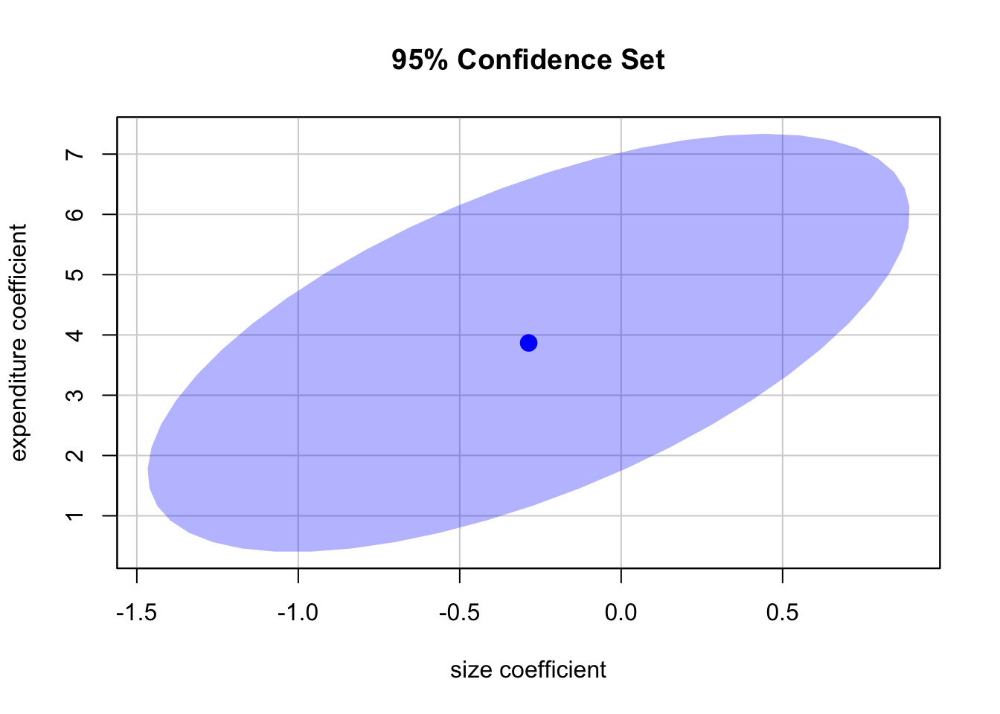


We see that the ellipse is centered around $(-0.29, 3.87)$, the pair of coefficients estimates on $size$ and $expenditure$. What is more, $(0,0)$ is not element of the $95\%$ confidence set so that we can reject $H_0: \beta_1 = 0, \ \beta_3 = 0$.

By default, <tt>confidenceEllipse()</tt> uses homoskedasticity-only standard errors. The following code chunk shows how compute a robust confidence ellipse and how to overlay it with the previous plot.


```r
# draw the robust 95% confidence set for coefficients on size and expenditure 
confidenceEllipse(model, 
                  fill = T,
                  lwd = 0,
                  which.coef = c("size", "expenditure"),
                  main = "95% Confidence Sets",
                  vcov. = vcovHC(model, type = "HC1"),
                  col = "red")
                  
# draw the 95% confidence set for coefficients on size and expenditure
confidenceEllipse(model, 
                  fill = T,
                  lwd = 0,
                  which.coef = c("size", "expenditure"),
                  add = T)
```

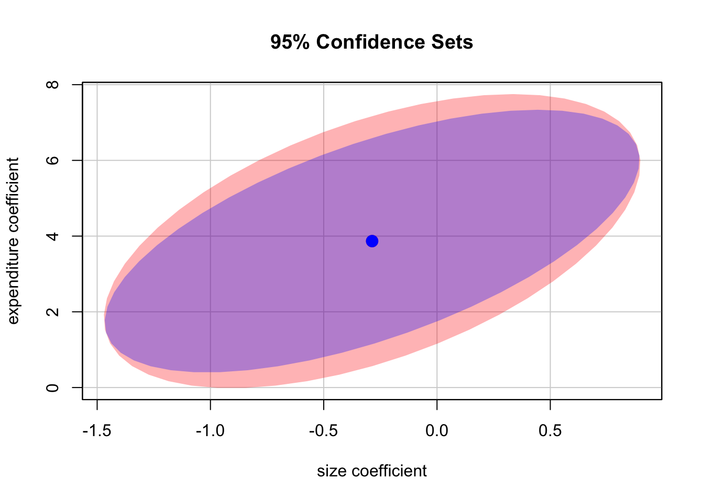


As the robust standard errors are slightly larger than those valid under homoskedasticity only in this case, the robust confidence set is slightly larger. This is analogous to the confidence intervals for the individual coefficients.

## Model Specification for Multiple Regression

Choosing a regression specification, i.e., selecting the variables to be included in a regression model, is a difficult task. However, there are some guidelines on how to proceed. The goal is clear: obtaining an unbiased and precise estimate of the causal effect of interest. As a starting point, think about omitted variables, that is, to avoid possible bias by using suitable control variables. Omitted variables bias in the context of multiple regression is explained in Key Concept 7.3. A second step could be to compare different specifications by measures of fit. However, as we shall see one should not rely solely on $\bar{R}^2$.


<div class = "keyconcept" id="KC7.3">
<h3 class = "right"> Key Concept 7.3 </h3>          
<h3 class = "left"> Omitted Variable Bias in Multiple Regression</h3>
<p>
Omitted variable bias is the bias in the OLS estimator that arises when regressors correlate with an omitted variable. For omitted variable bias to arise, two things must be true: 

1. At least one of the included regressors must be correlated with the omitted variable. 
2. The omitted variable must be a determinant of the dependent variable, $Y$.
</p>
</div>


We now discuss an example were we face a potential omitted variable bias in a multiple regression model:

Consider again the estimated regression equation

$$ \widehat{TestScore} = \underset{(8.7)}{686.0} - \underset{(0.43)}{1.10} \times size - \underset{(0.031)}{0.650} \times english. $$

We are interested in estimating the causal effect of class size on test score. There might be a bias due to omitting "outside learning opportunities" from our regression since such a measure could be a determinant of the students' test scores and could also be correlated with both regressors already included in the model (so that both conditions of Key Concept 7.3 are fulfilled). "Outside learning opportunities" are a complicated concept that is difficult to quantify. A surrogate we can consider instead is the students' economic background which likely are strongly related to outside learning opportunities: think of wealthy parents that are able to provide time and/or money for private tuition of their children. We thus augment the model with the variable <tt>lunch</tt>, the percentage of students that qualify for a free or subsidized lunch in school due to family incomes below a certain threshold, and reestimate the model.   


```r
# estimate the model and print the summary to console
model <- lm(score ~ size + english + lunch, data = CASchools)
coeftest(model, vcov. = vcovHC, type = "HC1")
#> 
#> t test of coefficients:
#> 
#>               Estimate Std. Error  t value  Pr(>|t|)    
#> (Intercept) 700.149957   5.568453 125.7351 < 2.2e-16 ***
#> size         -0.998309   0.270080  -3.6963 0.0002480 ***
#> english      -0.121573   0.032832  -3.7029 0.0002418 ***
#> lunch        -0.547345   0.024107 -22.7046 < 2.2e-16 ***
#> ---
#> Signif. codes:  0 '***' 0.001 '**' 0.01 '*' 0.05 '.' 0.1 ' ' 1
```

Thus, the estimated regression line is

$$ \widehat{TestScore} = \underset{(5.56)}{700.15} - \underset{(0.27)}{1.00} \times size - \underset{(0.03)}{0.12} \times english - \underset{(0.02)}{0.55} \times lunch. $$

We observe no substantial changes in the conclusion about the effect of $size$ on $TestScore$: the coefficient on $size$ changes by only $0.1$ and retains its significance. 

Although the difference in estimated coefficients is not big in this case, it is useful to keep <tt>lunch</tt> to make the assumption of conditional mean independence more credible (see Chapter 7.5 of the book).

### Model Specification in Theory and in Practice {-}

Key Concept 7.4 lists some common pitfalls when using $R^2$ and $\bar{R}^2$ to evaluate the predictive ability of regression models.


<div class = "keyconcept" id="KC7.4">
<h3 class = "right"> Key Concept 7.4 </h3>          
<h3 class = "left"> $R^2$ and $\bar{R}^2$: what they tell you --- and what they do not </h3>

<p>

The $R^2$ and $\bar{R}^2$ tell you whether the regressors are good at explaining the variation of the independent variable in the sample. If the $R^2$ (or $\bar{R}^2$) is nearly $1$, then the regressors produce a good prediction of the dependent variable in that sample, in the sense that the variance of OLS residuals is small compared to the variance of the dependent variable. If the $R^2$ (or $\bar{R}^2$) is nearly $0$, the opposite is true.

The $R^2$ and $\bar{R}^2$ do *not* tell you whether:

1. An included variable is statistically significant. 
2. The regressors are the true cause of the movements in the dependent variable.
3. There is omitted variable bias.
4. You have chosen the most appropriate set of regressors.

</p>
  
</div>


For example, think of regressing $TestScore$ on $PLS$ which measures the available parking lot space in thousand square feet. You are likely to observe a significant coefficient of reasonable magnitude and moderate to high values for $R^2$ and $\bar{R}^2$. The reason for this is that parking lot space is correlated with many determinants of the test score like location, class size, financial endowment and so on. Although we do not have observations on $PLS$, we can use <tt>R</tt> to generate some relatively realistic data.


```r
# set seed for reproducibility
set.seed(1)

# generate observations for parking lot space
CASchools$PLS <- c(22 * CASchools$income 
                   - 15 * CASchools$size 
                   + 0.2 * CASchools$expenditure
                   + rnorm(nrow(CASchools), sd = 80) + 3000)
```


```r
# plot parking lot space against test score
plot(CASchools$PLS, 
     CASchools$score,
     xlab = "Parking Lot Space",
     ylab = "Test Score",
     pch = 20,
     col = "steelblue")
```


```r

# regress test score on PLS
summary(lm(score ~ PLS, data = CASchools))
#> 
#> Call:
#> lm(formula = score ~ PLS, data = CASchools)
#> 
#> Residuals:
#>     Min      1Q  Median      3Q     Max 
#> -42.608 -11.049   0.342  12.558  37.105 
#> 
#> Coefficients:
#>              Estimate Std. Error t value Pr(>|t|)    
#> (Intercept) 4.897e+02  1.227e+01   39.90   <2e-16 ***
#> PLS         4.002e-02  2.981e-03   13.43   <2e-16 ***
#> ---
#> Signif. codes:  0 '***' 0.001 '**' 0.01 '*' 0.05 '.' 0.1 ' ' 1
#> 
#> Residual standard error: 15.95 on 418 degrees of freedom
#> Multiple R-squared:  0.3013,	Adjusted R-squared:  0.2996 
#> F-statistic: 180.2 on 1 and 418 DF,  p-value: < 2.2e-16
```


$PLS$ is generated as a linear function of $expenditure$, $income$, $size$ and a random disturbance. Therefore the data suggest that there is some positive relationship between parking lot space and test score. In fact, when estimating the model
\begin{align}
TestScore = \beta_0 + \beta_1 \times PLS + u (\#eq:plsmod) 
\end{align}
using <tt>lm()</tt> we find that the coefficient on $PLS$ is positive and significantly different from zero. Also $R^2$ and $\bar{R}^2$ are about $0.3$ which is a lot more than the roughly $0.05$ observed when regressing the test scores on the class sizes only. This suggests that increasing the parking lot space boosts a school's test scores and that model \@ref(eq:plsmod) does even better in explaining heterogeneity in the dependent variable than a model with $size$ as the only regressor. Keeping in mind how $PLS$ is constructed this comes as no surprise. It is evident that the high $R^2$ <it>cannot</it> be used to the conclude that the estimated relation between parking lot space and test scores is causal: the (relatively) high $R^2$ is due to correlation between $PLS$ and other determinants and/or control variables. Increasing parking lot space is *not* an appropriate measure to generate more learning success!

## Analysis of the Test Score Data Set

Chapter \@ref(rmwmr) and some of the previous sections have stressed that it is important to include control variables in regression models if it is plausible that there are omitted factors. In our example of test scores we want to estimate the causal effect of a change in the student-teacher ratio on test scores. We now provide an example how to use multiple regression in order to alleviate omitted variable bias and demonstrate how to report results using <tt>R</tt>.

So far we have considered two variables that control for unobservable student characteristics which correlate with the student-teacher ratio *and* are assumed to have an impact on test scores: 

  + $English$, the percentage of English learning students 
  
  + $lunch$, the share of students that qualify for a subsidized or even a free lunch at school
  
Another new variable provided with <tt>CASchools</tt> is <tt>calworks</tt>, the percentage of students that qualify for the *CalWorks* income assistance program. Students eligible for *CalWorks* live in families with a total income below the threshold for the subsidized lunch program so both variables are indicators for the share of economically disadvantaged children. Both indicators are highly correlated: 


```r
# estimate the correlation between 'calworks' and 'lunch'
cor(CASchools$calworks, CASchools$lunch)
#> [1] 0.7394218
```

There is no unambiguous way to proceed when deciding which variable to use. In any case it may not a good idea to use both variables as regressors in view of collinearity. Therefore, we also consider alternative model specifications.

For a start, we plot student characteristics against test scores.


```r
# set up arrangement of plots
m <- rbind(c(1, 2), c(3, 0))
graphics::layout(mat = m)

# scatterplots
plot(score ~ english, 
     data = CASchools, 
     col = "steelblue", 
     pch = 20, 
     xlim = c(0, 100),
     cex.main = 0.9,
     main = "Percentage of English language learners")

plot(score ~ lunch, 
     data = CASchools, 
     col = "steelblue", 
     pch = 20,
     cex.main = 0.9,
     main = "Percentage qualifying for reduced price lunch")

plot(score ~ calworks, 
     data = CASchools, 
     col = "steelblue", 
     pch = 20, 
     xlim = c(0, 100),
     cex.main = 0.9,
     main = "Percentage qualifying for income assistance")
```


We divide the plotting area up using <tt>layout()</tt>. The matrix <tt>m</tt> specifies the location of the plots, see `?layout`.

We see that all relationships are negative. Here are the correlation coefficients.


```r
# estimate correlation between student characteristics and test scores
cor(CASchools$score, CASchools$english)
#> [1] -0.6441238
cor(CASchools$score, CASchools$lunch)
#> [1] -0.868772
cor(CASchools$score, CASchools$calworks)
#> [1] -0.6268533
```

We shall consider five different model equations:

\begin{align*}
  (I) \quad TestScore=& \, \beta_0 + \beta_1 \times size + u, \\
  (II) \quad TestScore=& \, \beta_0 + \beta_1 \times size + \beta_2 \times english + u, \\
  (III) \quad TestScore=& \, \beta_0 + \beta_1 \times size + \beta_2 \times english + \beta_3 \times lunch + u, \\
  (IV) \quad TestScore=& \, \beta_0 + \beta_1 \times size + \beta_2 \times english + \beta_4 \times calworks + u, \\
  (V) \quad TestScore=& \, \beta_0 + \beta_1 \times size + \beta_2 \times english + \beta_3 \times lunch + \beta_4 \times calworks + u
\end{align*}

The best way to communicate regression results is in a table. The <tt>stargazer</tt> package is very convenient for this purpose. It provides a function that generates professionally looking HTML and LaTeX tables that satisfy scientific standards. One simply has to provide one or multiple object(s) of class <tt>lm</tt>. The rest is done by the function <tt>stargazer()</tt>.


```r
# load the stargazer library
library(stargazer)

# estimate different model specifications
spec1 <- lm(score ~ size, data = CASchools)
spec2 <- lm(score ~ size + english, data = CASchools)
spec3 <- lm(score ~ size + english + lunch, data = CASchools)
spec4 <- lm(score ~ size + english + calworks, data = CASchools)
spec5 <- lm(score ~ size + english + lunch + calworks, data = CASchools)

# gather robust standard errors in a list
rob_se <- list(sqrt(diag(vcovHC(spec1, type = "HC1"))),
               sqrt(diag(vcovHC(spec2, type = "HC1"))),
               sqrt(diag(vcovHC(spec3, type = "HC1"))),
               sqrt(diag(vcovHC(spec4, type = "HC1"))),
               sqrt(diag(vcovHC(spec5, type = "HC1"))))

# generate a LaTeX table using stargazer
stargazer(spec1, spec2, spec3, spec4, spec5,
          se = rob_se,
          digits = 3,
          header = F,
          column.labels = c("(I)", "(II)", "(III)", "(IV)", "(V)"))
```

preserved0fa86692aff9f8d


Table \@ref(tab:rotsostracv) states that $score$ is the dependent variable and that we consider five models. We see that the columns of Table \@ref(tab:rotsostracv) contain most of the information provided by <tt>coeftest()</tt> and <tt>summary()</tt> for the regression models under consideration: the coefficients estimates equipped with significance codes (the asterisks) and standard errors in parentheses below. Although there are no $t$-statistics, it is straightforward for the reader to compute them simply by dividing a coefficient estimate by the corresponding standard error. The bottom of the table reports summary statistics for each model and a legend. For an in-depth discussion of the tabular presentation of regression results, see Chapter 7.6 of the book.

What can we conclude from the model comparison? 

1. We see that adding control variables roughly halves the coefficient on <tt>size</tt>. Also, the estimate is not sensitive to the set of control variables used. The conclusion is that decreasing the student-teacher ratio ceteris paribus by one unit leads to an estimated average increase in test scores of about $1$ point.

2. Adding student characteristics as controls increases $R^2$ and $\bar{R}^2$ from $0.049$ (<tt>spec1</tt>) up to $0.773$ (<tt>spec3</tt> and <tt>spec5</tt>), so we can consider these variables as suitable predictors for test scores. Moreover, the estimated coefficients on all control variables are consistent with the impressions gained from Figure 7.2 of the book.

3. We see that the control variables are not statistically significant in all models. For example in <tt>spec5</tt>, the coefficient on $calworks$ is not significantly different from zero at $5\%$ since $\lvert-0.048/0.059\rvert=0.81 < 1.64$. We also observe that the effect on the estimate (and its standard error) of the coefficient on $size$ of adding $calworks$ to the base specification <tt>spec3</tt> is negligible. We can therefore consider <tt>calworks</tt> as a superfluous control variable, given the inclusion of <tt>lunch</tt> in this model.

## Exercises {#exercises-7}


<div  class = "DCexercise">

#### 1. Hypothesis Testing in a Multiple Regression Model --- $t$-statistics and $p$-values {-}

Reconsider the <tt>Boston</tt> data set and the following estimated model (homoscedasticity-only standard errors in parentheses) from the previous chapter:

$$\widehat{medv}_i = \underset{(0.75)}{32.828} -\underset{(0.05)}{0.994} \times lstat_i -\underset{(0.04)}{0.083} \times crim_i + \underset{(0.01)}{0.038} \times age_i.$$

Just as in the simple linear regression framework we can conduct hypothesis tests about the coefficients in multiple regression models. The most common hypothesis is $H_0:\beta_j=0$ against the alternative $H_1:\beta_j\ne 0$ for some $j$ in $0,1,\dots,k$.

The packages <tt>AER</tt> and <tt>MASS</tt> have been loaded. The coefficient estimates as well as the corresponding standard errors are available in <tt>coefs</tt> and <tt>SEs</tt>, respectively.

**Instructions:**

Use vector arithmetics to solve the following tasks:

+ Compute $t$-statistics for each coefficient by using the predefined objects <tt>coefs</tt> and <tt>SEs</tt>. Assign them to <tt>tstats</tt>.

+ Compute $p$-values for each coefficient and assign them to <tt>pval</tt>.

+ Check with the help of logical operators whether the hypotheses are rejected at the $1\%$ significance level.

<iframe src="DCL/ex7_1.html" frameborder="0" scrolling="no" style="width:100%;height:340px"></iframe>

**Hints:**

+ The $t$-statistic for each coefficient is defined as $t=\frac{\widehat{\beta}_j-\beta_{j,0}}{SE(\widehat{\beta}_j)}$.

+ The $p$-value for a two-sided test using is computed as $2\cdot\Phi(-|t^{act}|)$ where $t^{act}$ denotes the computed $t$-statistic.

</div>


<div  class = "DCexercise">

#### 2. Hypothesis Testing in a Multiple Regression Model - Confidence Intervals {-}

Consider again the estimated model 

$$\widehat{medv}_i = \underset{(0.75)}{32.828} -\underset{(0.05)}{0.994} \times lstat_i -\underset{(0.04)}{0.083} \times crim_i + \underset{(0.01)}{0.038} \times age_i.$$

which is available as the object <tt>mod</tt> in your working environment. The packages <tt>AER</tt> and <tt>MASS</tt> have been loaded.

**Instructions:**

+ Construct $99\%$ confidence intervals for all model coefficients. Use the intervals to decide whether the individual null hypotheses $H_0:\beta_j=0$, $j=0,1,2,3,4$ are rejected at the $1\%$ level.

<iframe src="DCL/ex7_2.html" frameborder="0" scrolling="no" style="width:100%;height:340px"></iframe>

**Hint:**

+ You may use <tt>confint()</tt> to construct confidence intervals. The confidence level can be set via the argument <tt>level</tt>.

</div>


<div  class = "DCexercise">

#### 3. Robust Hypothesis Testing in Multiple Regression Models {-}

The <tt>lm</tt> object <tt>mod</tt> from the previous exercises is available in your working environment. The packages <tt>AER</tt> and <tt>MASS</tt> have been loaded.

**Instructions:**

+ Print a coefficient summary that reports heteroscedasticity-robust standard errors.

+ Access entries of the matrix generated by <tt>coeftest()</tt> to check whether the hypotheses are rejected at a 1% significance level. Use logical operators <tt><,></tt>.

<iframe src="DCL/ex7_3.html" frameborder="0" scrolling="no" style="width:100%;height:340px"></iframe>

**Hints:**

+ Using the argument <tt>vcov.</tt> in <tt>coeftest()</tt> forces the function to use robust standard errors.

+ The $p$-values are contained in the fourth column of the output generated by <tt>coeftest()</tt>. Use square brackets to subset the matrix accordingly.

</div>


<div  class = "DCexercise">

#### 4. Joint Hypothesis Testing --- $F$-Test I {-}

Sometimes we are interested in testing joint hypotheses which impose restrictions on *multiple* regression coefficients. For example, in the model 

$$medv_i = \beta_0 + \beta_1\times lstat_i + \beta_2\times crim_i + \beta_3\times age_i + u_i$$

we may test the null $H_0: \beta_2=\beta_3$ vs. the alternative $H_1: \beta_2\ne\beta_3$ (which is a joint hypothesis as we impose a restriction on *two* regression coefficients).

The basic idea behind testing such a hypothesis is to conduct two regressions and to compare the outcomes: for one of the regressions we impose the restrictions of formalized by the null (we call this the restricted regression model), whereas for the other regression the restriction is left out (we call this the unrestricted model). From this starting point we construct a test-statistic which, under the null, follows a well known distribution, an $F$ distribution (see the next exercise).

However, in this exercise we start with the initial computations necessary to construct the test statistic.

The packages <tt>AER</tt> and <tt>MASS</tt> have been loaded.

**Instructions:**

+ Estimate the restricted model, that is, the model where the restriction formalized by $H_0: \beta_2=\beta_3$ is assumed to be true. Save the model in <tt>model_res</tt>.

+ Compute the $SSR$ of the restricted model and assign it to <tt>RSSR</tt>.

+ Estimate the unrestricted model, that is, the model where the restriction is assumed to be false. Save it in <tt>model_unres</tt>.

+ Compute the $SSR$ of the unrestricted model and assign it to <tt>USSR</tt>.

<iframe src="DCL/ex7_4.html" frameborder="0" scrolling="no" style="width:100%;height:340px"></iframe>

**Hints:**

+ The restricted model can be written as $$medv_i = \beta_0 + \beta_1\times lstat_i + \beta_2\times crim_i + \beta_2\times age_i + u_i$$ which, after rearranging, can be expressed as $$medv_i = \beta_0 + \beta_1\times lstat_i + \beta_2\times(crim_i+age_i) + u_i.$$

+ The $SSR$ is defined as the sum of the squared residuals.

+ Note that the residuals of a regression model are available as <tt>residuals</tt> in the corresponding <tt>lm</tt> object. So you can access them as usual via the <tt>$</tt>-operator.

</div>

<div  class = "DCexercise">


#### 5. Joint Hypothesis Testing --- F-Test II {-}

After estimating the models and computing the $SSR$s you now have to compute the test-statistic and conduct the $F$-test. As mentioned in the last exercise, the test-statistic follows an $F$ distribution. More precisely, we deal with the $F_{q,n-k-1}$ distribution where $q$ denotes the number of restrictions under the null and $k$ is the of regressors in the unrestricted model, excluding the intercept.

The packages <tt>AER</tt> and <tt>MASS</tt> have been loaded. Both models (<tt>model_res</tt> and <tt>model_unres</tt>) as well as their SSR (<tt>RSSR</tt> and <tt>USSR</tt>) are available in your working environment.

**Instructions:**

+ Compute the $F$-statistic and assign it to <tt>Fstat</tt>.

+ Compute the $p$-value and assign it to <tt>pval</tt>.

+ Check whether the null is rejected at the $1\%$ level using logical operators.

+ Verify your result by using <tt>linearHypothesis()</tt> and printing the results. 

<iframe src="DCL/ex7_5.html" frameborder="0" scrolling="no" style="width:100%;height:340px"></iframe>

**Hints:**

+ The $F$-statistic is defined as $\frac{RSSR-USSR/q}{USSR/(n-k-1)}$.

+ The $p$-value can be computed as $1-F_{q,n-k-1}(F^{act})$ where $F_{q,n-k-1}$ denotes the CDF of the $F$-distribution (<tt>pf()</tt>) with degrees of freedom $q$ and $n-k-1$ and $F^{act}$ the computed $F$-statistic.

+ <tt>linearHypothesis()</tt> expects the unrestricted model as well as the null hypothesis as arguments.

</div>


<div  class = "DCexercise">

#### 6. Joint Hypothesis Testing - Confidence Set {-}

As you know from previous chapters constructing a confidence set for a single regression coefficient results in a simple confidence interval on the real line. However if we consider $n$ regression coefficients jointly (as we do in a joint hypothesis testing setting) we move from $\mathbb{R}$ to $\mathbb{R}^n$ resulting in a n-dimensional confidence set. For the sake of illustration we then often choose $n=2$, so that we end up with a representable two-dimensional plane.

Recall the estimated model 

$$\widehat{medv}_i = \underset{(0.75)}{32.828} -\underset{(0.05)}{0.994} \times lstat_i -\underset{(0.04)}{0.083} \times crim_i + \underset{(0.01)}{0.038} \times age_i.$$

which is available as <tt>mod</tt> in your working environment. Assume you want to test the null $H_0: \beta_2=\beta_3=0$ vs. $H_1: \beta_2\ne 0$ or $\beta_3\ne 0$.

The packages <tt>AER</tt> and <tt>MASS</tt> have been loaded.

**Instructions:**

+ Construct a $99\%$ confidence set for the coefficients of <tt>crim</tt> and <tt>lstat</tt>, that is a two-dimensional confidence set. Can you reject the null stated above?

+ Verify your visual inspection by conducting a corresponding $F$-test.

<iframe src="DCL/ex7_6.html" frameborder="0" scrolling="no" style="width:100%;height:340px"></iframe>

**Hints:**

+ Use <tt>confidenceEllipse()</tt> to construct a two-dimensional confidence set. Besides the coefficients for which the confidence set shall be constructed (<tt>which.coef</tt>), you have to specify the confidence level (<tt>levels</tt>).

+ As usual you can use <tt>linearHypothesis()</tt> to conduct the $F$-test. Note that there are two restrictions now, hence you have to pass a vector containing both restrictions.

</div>

<!--chapter:end:07-ch7.Rmd-->

# Nonlinear Regression Functions {#nrf}

Until now we assumed the regression function to be linear, i.e., we have treated the slope parameter of the regression function as a constant. This implies that the effect on $Y$ of a one unit change in $X$ does not depend on the level of $X$. If, however, the effect of a change in $X$ on $Y$ does depend on the value of $X$, we should use a nonlinear regression function.

Just like for the previous chapter, the packages <tt>AER</tt> [@R-AER] and <tt>stargazer</tt> [@R-stargazer] are required for reproduction of the code presented in this chapter. Check whether the code chunk below executes without any error messages.


```r
library(AER)
library(stargazer)
```

## A General Strategy for Modelling Nonlinear Regression Functions 

Let us have a look at an example where using a nonlinear regression function is better suited for estimating the population relationship between the regressor, $X$, and the regressand, $Y$: the relationship between the income of schooling districts and their test scores.


```r
# prepare the data
library(AER)                                                     
data(CASchools)
CASchools$size <- CASchools$students/CASchools$teachers
CASchools$score <- (CASchools$read + CASchools$math) / 2       
```

We start our analysis by computing the correlation between both variables. 


```r
cor(CASchools$income, CASchools$score)
#> [1] 0.7124308
```

Here, income and test scores are positively related: school districts with above average income tend to achieve above average test scores. Does a linear regression function model the data adequately? Let us plot the data and add a linear regression line.


```r
# fit a simple linear model
linear_model<- lm(score ~ income, data = CASchools)

# plot the observations
plot(CASchools$income, CASchools$score,
     col = "steelblue",
     pch = 20,
     xlab = "District Income (thousands of dollars)", 
     ylab = "Test Score",
     cex.main = 0.9,
     main = "Test Score vs. District Income and a Linear OLS Regression Function")

# add the regression line to the plot
abline(linear_model, 
       col = "red", 
       lwd = 2)
```

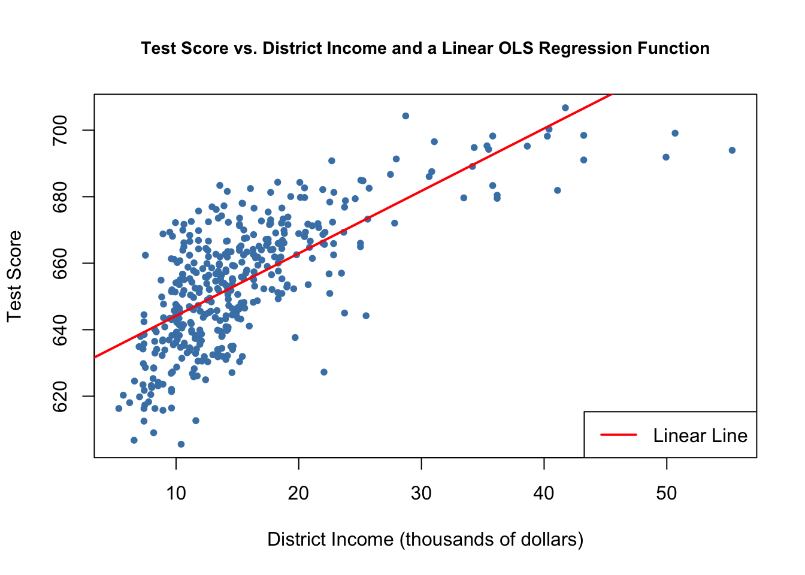


As pointed out in the book, the linear regression line seems to overestimate the true relationship when income is very high or very low and underestimates it for the middle income group.    

Fortunately, OLS does not only handle linear functions of the regressors. We can for example model test scores as a function of income and the square of income. The corresponding regression model is

$$TestScore_i = \beta_0 + \beta_1 \times income_i + \beta_2 \times income_i^2 + u_i,$$ called a *quadratic regression model*. That is, $income^2$ is treated as an additional explanatory variable. Hence, the quadratic model is a special case of a multivariate regression model. When fitting the model with <tt>lm()</tt> we have to use the <tt>^</tt> operator in conjunction with the function <tt>I()</tt> to add the quadratic term as an additional regressor to the argument <tt>formula</tt>. This is because the regression formula we pass to <tt>formula</tt> is converted to an object of the class <tt>formula</tt>. For objects of this class, the operators <tt>+</tt>, <tt>-</tt>, <tt>*</tt> and <tt>^</tt> have a nonarithmetic interpretation. <tt>I()</tt> ensures that they are used as arithmetical operators, see <tt>?I</tt>,


```r
# fit the quadratic Model
quadratic_model <- lm(score ~ income + I(income^2), data = CASchools)

# obtain the model summary
coeftest(quadratic_model, vcov. = vcovHC, type = "HC1")
#> 
#> t test of coefficients:
#> 
#>                Estimate  Std. Error  t value  Pr(>|t|)    
#> (Intercept) 607.3017435   2.9017544 209.2878 < 2.2e-16 ***
#> income        3.8509939   0.2680942  14.3643 < 2.2e-16 ***
#> I(income^2)  -0.0423084   0.0047803  -8.8505 < 2.2e-16 ***
#> ---
#> Signif. codes:  0 '***' 0.001 '**' 0.01 '*' 0.05 '.' 0.1 ' ' 1
```

The output tells us that the estimated regression function is

$$\widehat{TestScore}_i = \underset{(2.90)}{607.3} + \underset{(0.27)}{3.85} \times income_i - \underset{(0.0048)}{0.0423} \times income_i^2.$$

This model allows us to test the hypothesis that the relationship between test scores and district income is linear against the alternative that it is quadratic. This corresponds to testing

$$H_0: \beta_2 = 0 \ \ \text{vs.} \ \  H_1: \beta_2\neq0,$$

since $\beta_2=0$ corresponds to a simple linear equation and $\beta_2\neq0$ implies a quadratic relationship. We find that $t=(\hat\beta_2 - 0)/SE(\hat\beta_2) = -0.0423/0.0048 = -8.81$ so the null is rejected at any common level of significance and we conclude that the relationship is nonlinear. This is consistent with the impression gained from the plot.

We now draw the same scatter plot as for the linear model and add the regression line for the quadratic model. Because <tt>abline()</tt> can only draw straight lines, it cannot be used here. <tt>lines()</tt> is a function which allows to draw nonstraight lines, see `?lines`. The most basic call of <tt>lines()</tt> is <tt>lines(x_values, y_values)</tt> where <tt>x_values</tt> and <tt>y_values</tt> are vectors of the same length that provide coordinates of the points to be *sequentially* connected by a line. This makes it necessary to sort the coordinate pairs according to the X-values. Here we use the function <tt>order()</tt> to sort the fitted values of <tt>score</tt> according to the observations of <tt>income</tt>.


```r
# draw a scatterplot of the observations for income and test score
plot(CASchools$income, CASchools$score,
     col  = "steelblue",
     pch = 20,
     xlab = "District Income (thousands of dollars)",
     ylab = "Test Score",
     main = "Estimated Linear and Quadratic Regression Functions")

# add a linear function to the plot
abline(linear_model, col = "black", lwd = 2)

# add quatratic function to the plot
order_id <- order(CASchools$income)

lines(x = CASchools$income[order_id], 
      y = fitted(quadratic_model)[order_id],
      col = "red", 
      lwd = 2) 
```


We see that the quadratic function does fit the data much better than the linear function.

## Nonlinear Functions of a Single Independent Variable {#nfoasiv}

### Polynomials {-}

The approach used to obtain a quadratic model can be generalized to polynomial models of arbitrary degree $r$,
$$Y_i = \beta_0 + \beta_1 X_i + \beta_2 X_i^2 + \cdots + \beta_r X_i^r + u_i.$$

A cubic model for instance can be estimated in the same way as the quadratic model; we just have to use a polynomial of degree $r=3$ in  <tt>income</tt>. This is conveniently done using the function <tt>poly()</tt>.


```r
# estimate a cubic model
cubic_model <- lm(score ~ poly(income, degree = 3, raw = TRUE), data = CASchools)
```

<tt>poly()</tt> generates orthogonal polynomials which are orthogonal to the constant by default. Here, we set <tt>raw = TRUE</tt> such that raw polynomials are evaluated, see `?poly`.

In practice the question will arise which polynomial order should be chosen. First, similarly as for $r=2$, we can test the null hypothesis that the true relation is linear against the alternative hypothesis that the relationship is a polynomial of degree $r$:

$$ H_0: \beta_2=0, \ \beta_3=0,\dots,\beta_r=0 \ \ \ \text{vs.} \ \ \ H_1: \text{at least one} \ \beta_j\neq0, \ j=2,\dots,r $$

This is a joint null hypothesis with $r-1$ restrictions so it can be tested using the $F$-test presented in Chapter \@ref(htaciimr). <tt>linearHypothesis()</tt> can be used to conduct such tests. For example, we may test the null of a linear model against the alternative of a polynomial of a maximal degree $r=3$ as follows.


```r
# test the hypothesis of a linear model against quadratic or polynomial
# alternatives

# set up hypothesis matrix
R <- rbind(c(0, 0, 1, 0),
            c(0, 0, 0, 1))

# do the test
linearHypothesis(cubic_model,
                 hypothesis.matrix = R,
                 white.adj = "hc1")
#> Linear hypothesis test
#> 
#> Hypothesis:
#> poly(income, degree = 3, raw = TRUE)2 = 0
#> poly(income, degree = 3, raw = TRUE)3 = 0
#> 
#> Model 1: restricted model
#> Model 2: score ~ poly(income, degree = 3, raw = TRUE)
#> 
#> Note: Coefficient covariance matrix supplied.
#> 
#>   Res.Df Df      F    Pr(>F)    
#> 1    418                        
#> 2    416  2 37.691 9.043e-16 ***
#> ---
#> Signif. codes:  0 '***' 0.001 '**' 0.01 '*' 0.05 '.' 0.1 ' ' 1
```

We provide a hypothesis matrix as the argument <tt>hypothesis.matrix</tt>. This is useful when the coefficients have long names, as is the case here due to using <tt>poly()</tt>, or when the restrictions include multiple coefficients. How the hypothesis matrix $\mathbf{R}$ is interpreted by <tt>linearHypothesis()</tt> is best seen using matrix algebra: 

For the two linear constrains above, we have
\begin{align*}
  \mathbf{R}\boldsymbol{\beta} =& \mathbf{s} \\
  \begin{pmatrix}
    0 & 0 & 1 & 0 \\
    0 & 0 & 0 & 1
  \end{pmatrix}
  \begin{pmatrix}
    \beta_0 \\
    \beta_1 \\
    \beta_2 \\
    \beta_3 \\
  \end{pmatrix} =&
  \begin{pmatrix}
   0 \\
   0
  \end{pmatrix} \\
  \begin{pmatrix}
    \beta_2 \\
    \beta_3
  \end{pmatrix}= &
  \begin{pmatrix}
    0 \\
    0
  \end{pmatrix}.
\end{align*}
<tt>linearHypothesis()</tt> uses the zero vector for $\mathbf{s}$ by default, see `?linearHypothesis`.


The $p$-value for is very small so that we reject the null hypothesis. However, this does not tell us *which* $r$ to choose. In practice, one approach to determine the degree of the polynomial is to use *sequential testing*:

1. Estimate a polynomial model for some maximum value $r$.
2. Use a $t$-test to test $\beta_r = 0$. *Rejection* of the null means that $X^r$ belongs in the regression equation.
3. *Acceptance* of the null in step 2 means that $X^r$ can be eliminated from the model. Continue by repeating step 1 with order $r-1$ and test whether $\beta_{r-1}=0$. If the test rejects, use a polynomial model of order $r-1$.
4. If the tests from step 3 rejects, continue with the procedure until the coefficient on the highest power is statistically significant.

There is no unambiguous guideline how to choose $r$ in step one. However, as pointed out in @stock2015, economic data is often smooth such that it is appropriate to choose small orders like $2$, $3$, or $4$.

We will demonstrate how to apply sequential testing by the example of the cubic model. 


```r
summary(cubic_model)
#> 
#> Call:
#> lm(formula = score ~ poly(income, degree = 3, raw = TRUE), data = CASchools)
#> 
#> Residuals:
#>    Min     1Q Median     3Q    Max 
#> -44.28  -9.21   0.20   8.32  31.16 
#> 
#> Coefficients:
#>                                         Estimate Std. Error t value Pr(>|t|)
#> (Intercept)                            6.001e+02  5.830e+00 102.937  < 2e-16
#> poly(income, degree = 3, raw = TRUE)1  5.019e+00  8.595e-01   5.839 1.06e-08
#> poly(income, degree = 3, raw = TRUE)2 -9.581e-02  3.736e-02  -2.564   0.0107
#> poly(income, degree = 3, raw = TRUE)3  6.855e-04  4.720e-04   1.452   0.1471
#>                                          
#> (Intercept)                           ***
#> poly(income, degree = 3, raw = TRUE)1 ***
#> poly(income, degree = 3, raw = TRUE)2 *  
#> poly(income, degree = 3, raw = TRUE)3    
#> ---
#> Signif. codes:  0 '***' 0.001 '**' 0.01 '*' 0.05 '.' 0.1 ' ' 1
#> 
#> Residual standard error: 12.71 on 416 degrees of freedom
#> Multiple R-squared:  0.5584,	Adjusted R-squared:  0.5552 
#> F-statistic: 175.4 on 3 and 416 DF,  p-value: < 2.2e-16
```

The estimated cubic model stored in <tt>cubic_model</tt> is

$$ \widehat{TestScore}_i = \underset{(5.83)}{600.1} + \underset{(0.86)}{5.02} \times income -\underset{(0.03)}{0.96} \times income^2 - \underset{(0.00047)}{0.00069} \times income^3. $$

The $t$-statistic on $income^3$ is $1.42$ so the null that the relationship is quadratic cannot be rejected, even at the $10\%$ level. This is contrary to the result presented book which reports robust standard errors throughout so we will also use robust variance-covariance estimation to reproduce these results.


```r
# test the hypothesis using robust standard errors
coeftest(cubic_model, vcov. = vcovHC, type = "HC1")
#> 
#> t test of coefficients:
#> 
#>                                          Estimate  Std. Error  t value
#> (Intercept)                            6.0008e+02  5.1021e+00 117.6150
#> poly(income, degree = 3, raw = TRUE)1  5.0187e+00  7.0735e-01   7.0950
#> poly(income, degree = 3, raw = TRUE)2 -9.5805e-02  2.8954e-02  -3.3089
#> poly(income, degree = 3, raw = TRUE)3  6.8549e-04  3.4706e-04   1.9751
#>                                        Pr(>|t|)    
#> (Intercept)                           < 2.2e-16 ***
#> poly(income, degree = 3, raw = TRUE)1 5.606e-12 ***
#> poly(income, degree = 3, raw = TRUE)2  0.001018 ** 
#> poly(income, degree = 3, raw = TRUE)3  0.048918 *  
#> ---
#> Signif. codes:  0 '***' 0.001 '**' 0.01 '*' 0.05 '.' 0.1 ' ' 1
```

The reported standard errors have changed. Furthermore, the coefficient for `income^3` is now significant at the $5\%$ level. This means we reject the hypothesis that the regression function is quadratic against the alternative that it is cubic. Furthermore, we can also test if the coefficients for <tt>income^2</tt> and <tt>income^3</tt> are jointly significant using a robust version of the $F$-test. 


```r
# perform robust F-test 
linearHypothesis(cubic_model, 
                 hypothesis.matrix = R,
                 vcov. = vcovHC, type = "HC1")
#> Linear hypothesis test
#> 
#> Hypothesis:
#> poly(income, degree = 3, raw = TRUE)2 = 0
#> poly(income, degree = 3, raw = TRUE)3 = 0
#> 
#> Model 1: restricted model
#> Model 2: score ~ poly(income, degree = 3, raw = TRUE)
#> 
#> Note: Coefficient covariance matrix supplied.
#> 
#>   Res.Df Df      F    Pr(>F)    
#> 1    418                        
#> 2    416  2 29.678 8.945e-13 ***
#> ---
#> Signif. codes:  0 '***' 0.001 '**' 0.01 '*' 0.05 '.' 0.1 ' ' 1
```

With a $p$-value of $9.043e^{-16}$, i.e., much less than $0.05$, the null hypothesis of linearity is rejected in favor of the alternative that the relationship is quadratic *or* cubic. 

#### Interpretation of Coefficients in Nonlinear Regression Models {-}

The coefficients in polynomial regression do not have a simple interpretation. Why? Think of a quadratic model: it is not helpful to think of the coefficient on $X$ as the expected change in $Y$ associated with a change in $X$ holding the other regressors constant because $X^2$ changes as $X$ varies. This is also the case for other deviations from linearity, for example in models where regressors and/or the dependent variable are log-transformed. A way to approach this is to calculate the estimated effect on $Y$ associated with a change in $X$ for one or more values of $X$. This idea is summarized in Key Concept 8.1.


<div class = "keyconcept" id="KC8.1">
<h3 class = "right"> Key Concept 8.1 </h3>          
<h3 class = "left"> The Expected Effect on $Y$ of a Change in $X_1$ in a Nonlinear Regression Model </h3>

Consider the nonlinear population regression model

$$ Y_i = f(X_{1i}, X_{2i}, \dots, X_{ki}) + u_i \ , \ i=1,\dots,n,$$

where $f(X_{1i}, X_{2i}, \dots, X_{ki})$ is the population regression function and $u_i$ is the error term.

Denote by $\Delta Y$ the expected change in $Y$ associated with $\Delta X_1$, the change in $X_1$ while holding $X_2, \cdots , X_k$ constant. That is, the expected change in $Y$ is the difference

$$\Delta Y = f(X_1 + \Delta X_1, X_2, \cdots, X_k) - f(X_1, X_2, \cdots, X_k).$$

The estimator of this unknown population difference is the difference between the predicted values for these two cases. Let $\hat{f}(X_1, X_2, \cdots, X_k)$ be the predicted value of of $Y$ based on the estimator $\hat{f}$ of the population regression function. Then the predicted change in $Y$ is

$$\Delta \widehat{Y} = \hat{f}(X_1 + \Delta X_1, X_2, \cdots, X_k) - \hat{f}(X_1, X_2, \cdots, X_k).$$
</p>
</div>


For example, we may ask the following: what is the predicted change in test scores associated with a one unit change (i.e., $\$1000$) in income, based on the estimated quadratic regression function

$$\widehat{TestScore} = 607.3 + 3.85 \times income - 0.0423 \times income^2\ ?$$

Because the regression function is quadratic, this effect depends on the *initial* district income. We therefore consider two cases: 

1. An increase in district income form $10$ to $11$ (from $\$10000$ per capita to $\$11000$).

2. An increase in district income from $40$ to $41$ (that is from $\$40000$ to $\$41000$).

In order to obtain the $\Delta \widehat{Y}$ associated with a change in income form $10$ to $11$, we use the following formula: 

$$\Delta \widehat{Y} = \left(\hat{\beta}_0 + \hat{\beta}_1 \times 11 + \hat{\beta}_2 \times 11^2\right) - \left(\hat{\beta}_0 + \hat{\beta}_1 \times 10 + \hat{\beta}_2 \times 10^2\right) $$
To compute $\widehat{Y}$ using <tt>R</tt> we may use <tt>predict()</tt>.


```r
# compute and assign the quadratic model
quadriatic_model <- lm(score ~ income + I(income^2), data = CASchools)

# set up data for prediction
new_data <- data.frame(income = c(10, 11))

# do the prediction
Y_hat <- predict(quadriatic_model, newdata = new_data)

# compute the difference
diff(Y_hat)
#>        2 
#> 2.962517
```

Analogously we can compute the effect of a change in district income from $40$ to $41$:


```r
# set up data for prediction
new_data <- data.frame(income = c(40, 41))

# do the prediction
Y_hat <- predict(quadriatic_model, newdata = new_data)

# compute the difference
diff(Y_hat)
#>         2 
#> 0.4240097
```

So for the quadratic model, the expected change in $TestScore$ induced by an increase in $income$ from $10$ to $11$ is about $2.96$ points but an increase in $income$ from $40$ to $41$ increases the predicted score by only $0.42$. Hence, the slope of the estimated quadratic regression function is *steeper* at low levels of income than at higher levels. 

### Logarithms {-}

Another way to specify a nonlinear regression function is to use the natural logarithm of $Y$ and/or $X$.
Logarithms convert changes in variables into percentage changes. This is convenient as many relationships are naturally expressed in terms of percentages. 

There are three different cases in which logarithms might be used. 

1. Transform $X$ with its logarithm, but not $Y$.

2. Analogously we could transform $Y$ to its logarithm but leave $X$ at level. 

3. Both $Y$ and $X$ are transformed to their logarithms. 

The interpretation of the regression coefficients is different in each case.  

#### Case I: $X$ is in Logarithm, $Y$ is not. {-}

The regression model then is  $$Y_i = \beta_0 + \beta_1 \times \ln(X_i) + u_i \text{, } i=1,...,n. $$ Similar as for polynomial regression we do not have to create a new variable before using <tt>lm()</tt>. We can simply adjust the 
<tt>formula</tt> argument of <tt>lm()</tt> to tell <tt>R</tt> that the log-transformation of a variable should be used.    


```r
# estimate a level-log model
LinearLog_model <- lm(score ~ log(income), data = CASchools)

# compute robust summary
coeftest(LinearLog_model, 
         vcov = vcovHC, type = "HC1")
#> 
#> t test of coefficients:
#> 
#>             Estimate Std. Error t value  Pr(>|t|)    
#> (Intercept) 557.8323     3.8399 145.271 < 2.2e-16 ***
#> log(income)  36.4197     1.3969  26.071 < 2.2e-16 ***
#> ---
#> Signif. codes:  0 '***' 0.001 '**' 0.01 '*' 0.05 '.' 0.1 ' ' 1
```

Hence, the estimated regression function is

$$\widehat{TestScore} = 557.8 + 36.42 \times \ln(income).$$

Let us draw a plot of this function.


```r
# draw a scatterplot
plot(score ~ income, 
     col = "steelblue",
     pch = 20,
     data = CASchools,
     main = "Linear-Log Regression Line")

# add the linear-log regression line
order_id  <- order(CASchools$income)

lines(CASchools$income[order_id],
      fitted(LinearLog_model)[order_id], 
      col = "red", 
      lwd = 2)
```

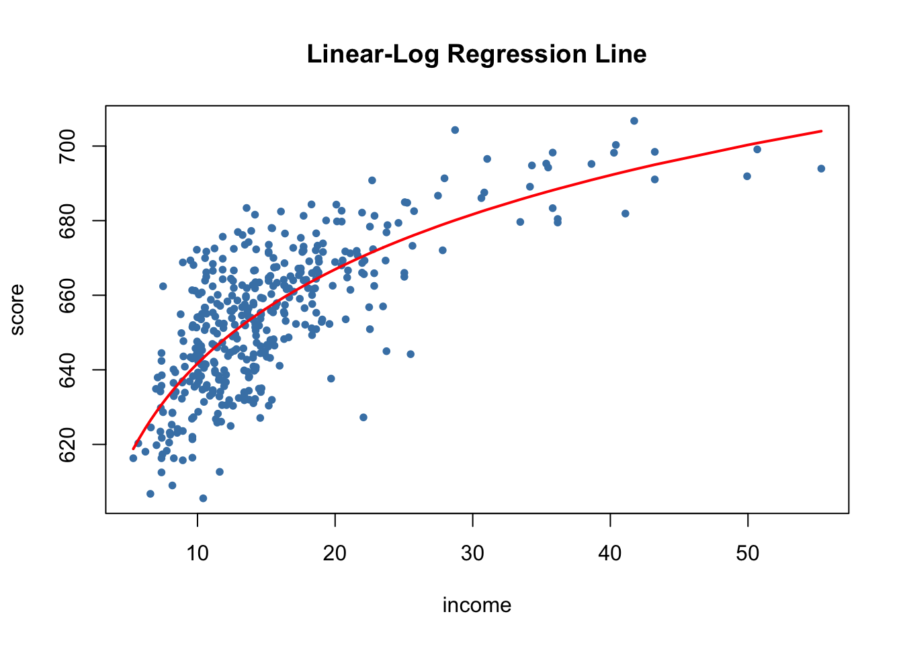


We can interpret $\hat{\beta}_1$ as follows: a $1\%$ increase in income is associated with an increase in test scores of $0.01 \times 36.42 = 0.36$ points. In order to get the estimated effect of a one unit change in income (that is, a change in the original units, thousands of dollars) on test scores, the method presented in Key Concept 8.1 can be used.


```r
# set up new data
new_data <- data.frame(income = c(10, 11, 40, 41))

# predict the outcomes 
Y_hat <- predict(LinearLog_model, newdata = new_data)

# compute the expected difference
Y_hat_matrix <- matrix(Y_hat, nrow = 2, byrow = TRUE)
Y_hat_matrix[, 2] - Y_hat_matrix[, 1]
#> [1] 3.471166 0.899297
```

By setting <tt>nrow = 2</tt> and <tt>byrow = TRUE</tt> in <tt>matrix()</tt> we ensure that <tt>Y_hat_matrix</tt> is a $2\times2$ matrix filled row-wise with the entries of <tt>Y_hat</tt>. 

The estimated model states that for an income increase from $\$10000$ to $\$11000$, test scores increase by an expected amount of $3.47$ points. When income increases from $\$40000$ to $\$41000$, the expected increase in test scores is only about $0.90$ points.

#### Case II: $Y$ is in Logarithm, $X$ is not {-}

There are cases where it is useful to regress $\ln(Y)$. 

The corresponding regression model then is 

$$ \ln(Y_i) = \beta_0 + \beta_1 \times X_i + u_i , \ \ i=1,...,n. $$


```r
# estimate a log-linear model 
LogLinear_model <- lm(log(score) ~ income, data = CASchools)

# obtain a robust coefficient summary
coeftest(LogLinear_model, 
         vcov = vcovHC, type = "HC1")
#> 
#> t test of coefficients:
#> 
#>               Estimate Std. Error  t value  Pr(>|t|)    
#> (Intercept) 6.43936234 0.00289382 2225.210 < 2.2e-16 ***
#> income      0.00284407 0.00017509   16.244 < 2.2e-16 ***
#> ---
#> Signif. codes:  0 '***' 0.001 '**' 0.01 '*' 0.05 '.' 0.1 ' ' 1
```

The estimated regression function is $$\widehat{\ln(TestScore)} = 6.439 + 0.00284 \times income.$$ An increase in district income by $\$1000$ is expected to increase test scores by $100\times 0.00284 \% = 0.284\%$. 

When the dependent variable in logarithm, one cannot simply use $e^{\log(\cdot)}$ to transform predictions back to the original scale, see page of the book.

#### Case III: $X$ and $Y$ are in Logarithms {-}

The log-log regression model is $$\ln(Y_i) = \beta_0 + \beta_1 \times \ln(X_i) + u_i, \ \ i=1,...,n.$$


```r
# estimate the log-log model
LogLog_model <- lm(log(score) ~ log(income), data = CASchools)

# print robust coefficient summary to the console
coeftest(LogLog_model, 
         vcov = vcovHC, type = "HC1")
#> 
#> t test of coefficients:
#> 
#>              Estimate Std. Error  t value  Pr(>|t|)    
#> (Intercept) 6.3363494  0.0059246 1069.501 < 2.2e-16 ***
#> log(income) 0.0554190  0.0021446   25.841 < 2.2e-16 ***
#> ---
#> Signif. codes:  0 '***' 0.001 '**' 0.01 '*' 0.05 '.' 0.1 ' ' 1
```

The estimated regression function hence is $$\widehat{\ln(TestScore)} = 6.336 + 0.0554 \times \ln(income).$$ In a log-log model, a $1\%$ change in $X$ is associated with an estimated $\hat\beta_1 \%$ change in $Y$. 

We now reproduce Figure 8.5 of the book.


```r
# generate a scatterplot
plot(log(score) ~ income, 
     col = "steelblue", 
     pch = 20, 
     data = CASchools,
     main = "Log-Linear Regression Function")

# add the log-linear regression line
order_id  <- order(CASchools$income)

lines(CASchools$income[order_id], 
      fitted(LogLinear_model)[order_id], 
      col = "red", 
      lwd = 2)

# add the log-log regression line
lines(sort(CASchools$income), 
      fitted(LogLog_model)[order(CASchools$income)], 
      col = "green", 
      lwd = 2)

# add a legend
legend("bottomright",
       legend = c("log-linear model", "log-log model"),
       lwd = 2,
       col = c("red", "green"))
```


Key Concept 8.2 summarizes the three logarithmic regression models.


<div class = "keyconcept" id="KC8.2">
<h3 class = "right"> Key Concept 8.2 </h3>          
<h3 class = "left"> Logarithms in Regression: Three Cases </h3>

<p> Logarithms can be used to transform the dependent variable $Y$ or the independent variable $X$, or both 
(the variable being transformed must be positive). The following table summarizes these three cases and the interpretation of the regression coefficient $\beta_1$. In each case, $\beta_1$, can be estimated by applying OLS after taking the logarithm(s) of the dependent and/or the independent variable. </p>

<table>
<thead>
<tr class="header">
<th align="left">Case</th>
<th align="left">Model Specification</th>
<th align="left">Interpretation of $\beta_1$</th>
</tr>
</thead>
<tbody>
<tr class="odd">
<td align="left">$(I)$</td>
<td align="left">$Y_i = \beta_0 + \beta_1 \ln(X_i) + u_i$</td>
<td align="left">A $1 \%$ change in $X$ is associated with a change in $Y$ of $0.01 \times \beta_1$.</td>
</tr>
<tr class="even">
<td align="left">$(II)$</td>
<td align="left">$\ln(Y_i) = \beta_0 + \beta_1 X_i + u_i$</td>
<td align="left">A change in $X$ by one unit ($\Delta X = 1$) is associated with a $100 \times \beta_1 \%$ change in $Y$.</td>
</tr>
<tr class="odd">
<td align="left">$(III)$</td>
<td align="left">$\ln(Y_i) = \beta_0 + \beta_1 \ln(X_i) + u_i$</td>
<td align="left">A $1\%$ change in $X$ is associated with a $\beta_1\%$ change in $Y$, so $\beta_1$ is the elasticity of $Y$ with respect to $X$.</td>
</tr>
</tbody>
</table>

</div>


Of course we can also estimate a *polylog* model like

$$ TestScore_i = \beta_0 + \beta_1 \times \ln(income_i) + \beta_2 \times \ln(income_i)^2 + \beta_3 \times \ln(income_i)^3 + u_i $$

which models the dependent variable $TestScore$ by a third-degree polynomial of the log-transformed regressor $income$.


```r
# estimate the polylog model
polyLog_model <- lm(score ~ log(income) + I(log(income)^2) + I(log(income)^3), 
                    data = CASchools)

# print robust summary to the console
coeftest(polyLog_model, 
         vcov = vcovHC, type = "HC1")
#> 
#> t test of coefficients:
#> 
#>                  Estimate Std. Error t value  Pr(>|t|)    
#> (Intercept)      486.1341    79.3825  6.1239 2.115e-09 ***
#> log(income)      113.3820    87.8837  1.2901    0.1977    
#> I(log(income)^2) -26.9111    31.7457 -0.8477    0.3971    
#> I(log(income)^3)   3.0632     3.7369  0.8197    0.4128    
#> ---
#> Signif. codes:  0 '***' 0.001 '**' 0.01 '*' 0.05 '.' 0.1 ' ' 1
```

Comparing by $\bar{R}^2$ we find that, leaving out the log-linear model, all models have a similar adjusted fit. In the class of polynomial models, the cubic specification has the highest $\bar{R}^2$ whereas the linear-log specification is the best of the log-models. 


```r
# compute the adj. R^2 for the nonlinear models
adj_R2 <-rbind("quadratic" = summary(quadratic_model)$adj.r.squared,
               "cubic" = summary(cubic_model)$adj.r.squared,
               "LinearLog" = summary(LinearLog_model)$adj.r.squared,
               "LogLinear" = summary(LogLinear_model)$adj.r.squared,
               "LogLog" = summary(LogLog_model)$adj.r.squared,
               "polyLog" = summary(polyLog_model)$adj.r.squared)

# assign column names
colnames(adj_R2) <- "adj_R2"

adj_R2
#>              adj_R2
#> quadratic 0.5540444
#> cubic     0.5552279
#> LinearLog 0.5614605
#> LogLinear 0.4970106
#> LogLog    0.5567251
#> polyLog   0.5599944
```

Let us now compare the cubic and the linear-log model by plotting the corresponding estimated regression functions.


```r
# generate a scatterplot
plot(score ~ income, 
     data = CASchools,
     col = "steelblue", 
     pch = 20,
     main = "Linear-Log and Cubic Regression Functions")

# add the linear-log regression line
order_id  <- order(CASchools$income)

lines(CASchools$income[order_id],
      fitted(LinearLog_model)[order_id], 
      col = "darkgreen", 
      lwd = 2)

# add the cubic regression line
lines(x = CASchools$income[order_id], 
      y = fitted(cubic_model)[order_id],
      col = "darkred", 
      lwd = 2) 
```

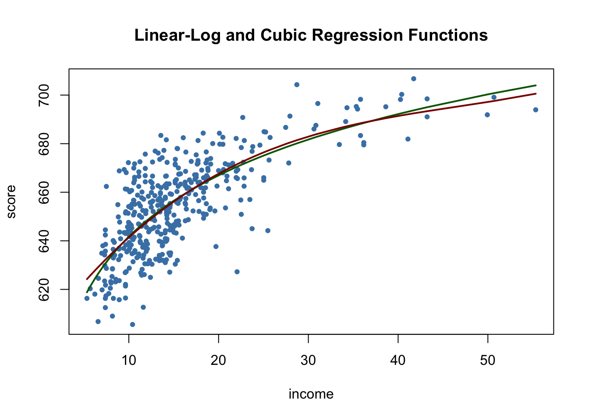


Both regression lines look nearly identical. Altogether the linear-log model may be preferable since it is more parsimonious in terms of regressors: it does not include higher-degree polynomials.

## Interactions Between Independent Variables

There are research questions where it is interesting to learn how the effect on $Y$ of a change in an independent variable depends on the value of another independent variable. For example, we may ask if districts with many English learners benefit differentially from a decrease in class sizes to those with few English learning students. To assess this using a multiple regression model, we include an interaction term. We consider three cases:

1. Interactions between two binary variables.

2. Interactions between a binary and a continuous variable.

3. Interactions between two continuous variables.

The following subsections discuss these cases briefly and demonstrate how to perform such regressions in <tt>R</tt>.

#### Interactions Between Two Binary Variables {-}

Take two binary variables $D_1$ and $D_2$ and the population regression model 

$$ Y_i = \beta_0 + \beta_1 \times D_{1i} + \beta_2 \times D_{2i} + u_i. $$

Now assume that

\begin{align*}
  Y_i=& \, \ln(Earnings_i),\\
  D_{1i} =& \,
   \begin{cases}
      1 & \text{if $i^{th}$ person has a college degree,} \\
      0 & \text{else}.
    \end{cases} \\
  D_{2i} =& \, 
    \begin{cases}
      1 & \text{if $i^{th}$ person is female,} \\
      0 & \text{if $i^{th}$ person is male}.
    \end{cases}
\end{align*}

We know that $\beta_1$ measures the average difference in $\ln(Earnings)$ between individuals with and without a college degree and $\beta_2$ is the gender differential in $\ln(Earnings)$, ceteris paribus. This model *does not* allow us to determine if there is a gender specific effect of having a college degree and, if so, *how strong* this effect is. It is easy to come up with a model specification that allows to investigate this:

$$ Y_i = \beta_0 + \beta_1 \times D_{1i} + \beta_2 \times D_{2i} + \beta_3 \times (D_{1i} \times D_{2i}) + u_i $$

$(D_{1i} \times D_{2i})$ is called an interaction term and $\beta_3$ measures the difference in the effect of having a college degree for women versus men.


<div class = "keyconcept" id="KC8.3">
<h3 class = "right"> Key Concept 8.3 </h3>          
<h3 class = "left"> A Method for Interpreting Coefficients in Regression with Binary Variables </h3>

Compute expected values of $Y$ for each possible set described by the set of binary variables. Compare the expected values. 
The coefficients can be expressed either as expected values or as the difference between at least two expected values.

</div>


Following Key Concept 8.3 we have

\begin{align*}
  E(Y_i\vert D_{1i}=0, D_{2i} = d_2) =& \, \beta_0 + \beta_1 \times 0 + \beta_2 \times d_2 + \beta_3 \times (0 \times d_2) \\
  =& \, \beta_0 + \beta_2 \times d_2.
\end{align*}

If $D_{1i}$ switches from $0$ to $1$ we obtain

\begin{align*}
  E(Y_i\vert D_{1i}=1, D_{2i} = d_2) =& \, \beta_0 + \beta_1 \times 1 + \beta_2 \times d_2 + \beta_3 \times (1 \times d_2) \\
  =& \, \beta_0 + \beta_1 + \beta_2 \times d_2 + \beta_3 \times d_2.
\end{align*}

Hence, the overall effect is

$$ E(Y_i\vert D_{1i}=1, D_{2i} = d_2) - E(Y_i\vert D_{1i}=0, D_{2i} = d_2) = \beta_1 + \beta_3 \times d_2 $$
so the effect is a difference of expected values.

#### Application to the Student-Teacher Ratio and the Percentage of English Learners {-}

Now let

\begin{align*}
  HiSTR =& \, 
    \begin{cases}
      1, & \text{if $STR \geq 20$} \\
      0, & \text{else},
    \end{cases} \\
  \\
  HiEL =& \,
    \begin{cases}
      1, & \text{if $PctEL \geq 10$} \\
      0, & \text{else}.
    \end{cases}
\end{align*}

We may use <tt>R</tt> to construct the variables above as follows.


```r
# append HiSTR to CASchools
CASchools$HiSTR <- as.numeric(CASchools$size >= 20)

# append HiEL to CASchools
CASchools$HiEL <- as.numeric(CASchools$english >= 10)
```

We proceed by estimating the model

\begin{align}
TestScore = \beta_0 + \beta_1 \times HiSTR + \beta_2 \times HiEL + \beta_3 \times (HiSTR \times HiEL) + u_i. (\#eq:im)
\end{align}

There are several ways to add the interaction term to the <tt>formula</tt> argument when using <tt>lm()</tt> but the most intuitive way is to use <tt>HiEL * HiSTR</tt>.^[Appending <tt>HiEL * HiSTR</tt> to the formula will add <tt>HiEL</tt>, <tt>HiSTR</tt> *and* their interaction as regressors while <tt>HiEL:HiSTR</tt> only adds the interaction term.]


```r
# estimate the model with a binary interaction term
bi_model <- lm(score ~ HiSTR * HiEL, data = CASchools)

# print a robust summary of the coefficients
coeftest(bi_model, vcov. = vcovHC, type = "HC1")
#> 
#> t test of coefficients:
#> 
#>             Estimate Std. Error  t value  Pr(>|t|)    
#> (Intercept) 664.1433     1.3881 478.4589 < 2.2e-16 ***
#> HiSTR        -1.9078     1.9322  -0.9874    0.3240    
#> HiEL        -18.3155     2.3340  -7.8472 3.634e-14 ***
#> HiSTR:HiEL   -3.2601     3.1189  -1.0453    0.2965    
#> ---
#> Signif. codes:  0 '***' 0.001 '**' 0.01 '*' 0.05 '.' 0.1 ' ' 1
```

The estimated regression model is $$\widehat{TestScore} = \underset{(1.39)}{664.1} - \underset{(1.93)}{1.9} \times HiSTR - \underset{(2.33)}{18.3} \times HiEL - \underset{(3.12)}{3.3} \times (HiSTR \times HiEL)$$ and it predicts that the effect of moving from a school district with a low student-teacher ratio to a district with a high student-teacher ratio, depending on high or low percentage of english learners is $-1.9-3.3\times HiEL$. So for districts with a low share of english learners ($HiEL = 0$), the estimated effect is a decrease of $1.9$ points in test scores while for districts with a large fraction of English learners ($HiEL = 1$), the predicted decrease in test scores amounts to $1.9 + 3.3 = 5.2$ points.

We can also use the model to estimate the mean test score for each possible combination of the included binary variables.


```r
# estimate means for all combinations of HiSTR and HiEL

# 1.
predict(bi_model, newdata = data.frame("HiSTR" = 0, "HiEL" = 0))
#>        1 
#> 664.1433

# 2.
predict(bi_model, newdata = data.frame("HiSTR" = 0, "HiEL" = 1))
#>        1 
#> 645.8278

# 3.
predict(bi_model, newdata = data.frame("HiSTR" = 1, "HiEL" = 0))
#>        1 
#> 662.2354

# 4.
predict(bi_model, newdata = data.frame("HiSTR" = 1, "HiEL" = 1))
#>        1 
#> 640.6598
```

We now verify that these predictions are differences in the coefficient estimates presented in equation \@ref(eq:im):

\begin{align*}
\widehat{TestScore} = \hat\beta_0 = 664.1 \quad &\Leftrightarrow \quad HiSTR = 0, \, HIEL = 0\\
\widehat{TestScore} = \hat\beta_0 + \hat\beta_2 = 664.1 - 18.3 = 645.8 \quad &\Leftrightarrow \quad HiSTR = 0, \, HIEL = 1\\
\widehat{TestScore} = \hat\beta_0 + \hat\beta_1 = 664.1 - 1.9 = 662.2 \quad &\Leftrightarrow \quad HiSTR = 1, \, HIEL = 0\\
\widehat{TestScore} = \hat\beta_0 + \hat\beta_1 + \hat\beta_2 + \hat\beta_3  = 664.1 - 1.9 - 18.3 - 3.3 = 640.6 \quad &\Leftrightarrow \quad HiSTR = 1, \, HIEL = 1
\end{align*}

#### Interactions Between a Continuous and a Binary Variable {-}

Now let $X_i$ denote the years of working experience of person $i$, which is a continuous variable. We have
\begin{align*}
  Y_i =& \, \ln(Earnings_i), \\
  \\
  X_i =& \, \text{working experience of person }i, \\
  \\
  D_i =& \,  
    \begin{cases}
      1, & \text{if $i^{th}$ person has a college degree} \\
      0, & \text{else}.
    \end{cases}
\end{align*}

The baseline model thus is

$$ Y_i = \beta_0 + \beta_1 X_i + \beta_2 D_i + u_i, $$

a multiple regression model that allows us to estimate the average benefit of having a college degree holding working experience constant as well as the average effect on earnings of a change in working experience holding college degree constant. 

By adding the interaction term $X_i \times D_i$ we allow the effect of an additional year of work experience to differ between individuals with and without college degree,

$$ Y_i = \beta_0 + \beta_1 X_i + \beta_2 D_i + \beta_3  (X_i \times D_i) + u_i. $$

Here, $\beta_3$ is the expected difference in the effect of an additional year of work experience for college graduates versus non-graduates. Another possible specification is

$$ Y_i = \beta_0 + \beta_1 X_i + \beta_2 (X_i \times D_i) + u_i. $$

This model states that the expected impact of an additional year of work experience on earnings differs for college graduates and non-graduates but that graduating on its own does not increase earnings. 

All three regression functions can be visualized by straight lines. Key Concept 8.4 summarizes the differences.


<div class = "keyconcept" id="KC8.4">
<h3 class = "right"> Key Concept 8.4 </h3>          
<h3 class = "left"> Interactions Between Binary and Continuous Variables </h3>

An interaction term like $X_i \times D_i$ (where $X_i$ is continuous and $D_i$ is binary) allows for the slope to depend on the binary
variable $D_i$. There are three possibilities:

1. Different intercept and same slope:
$$ Y_i = \beta_0 + \beta_1 X_i + \beta_2 D_i + u_i $$
2. Different intercept and different slope:
$$ Y_i = \beta_0 + \beta_1 X_i + \beta_2 D_i + \beta_3 \times (X_i \times D_i) + u_i $$

3. Same intercept and different slope:
$$ Y_i = \beta_0 + \beta_1 X_i + \beta_2 (X_i \times D_i) + u_i $$
</div>


The following code chunk demonstrates how to replicate the results shown in Figure 8.8 of the book using artificial data.


```r
# generate artificial data
set.seed(1)

X <- runif(200,0, 15)
D <- sample(0:1, 200, replace = T)
Y <- 450 +  150 * X + 500 * D + 50 * (X * D) + rnorm(200, sd = 300)

# divide plotting area accordingly
m <- rbind(c(1, 2), c(3, 0))
graphics::layout(m)

# estimate the models and plot the regression lines

# 1. (baseline model)
plot(X, log(Y),
     pch = 20,
     col = "steelblue",
     main = "Different Intercepts, Same Slope")

mod1_coef <- lm(log(Y) ~ X + D)$coefficients

abline(coef = c(mod1_coef[1], mod1_coef[2]), 
       col = "red",
       lwd = 1.5)

abline(coef = c(mod1_coef[1] + mod1_coef[3], mod1_coef[2]), 
       col = "green",
       lwd = 1.5)
       
# 2. (baseline model + interaction term)
plot(X, log(Y),
     pch = 20,
     col = "steelblue",
     main = "Different Intercepts, Different Slopes")

mod2_coef <- lm(log(Y) ~ X + D + X:D)$coefficients

abline(coef = c(mod2_coef[1], mod2_coef[2]), 
       col = "red",
       lwd = 1.5)

abline(coef = c(mod2_coef[1] + mod2_coef[3], mod2_coef[2] + mod2_coef[4]), 
       col = "green",
       lwd = 1.5)

# 3. (omission of D as regressor + interaction term)
plot(X, log(Y),
     pch = 20,
     col = "steelblue",
     main = "Same Intercept, Different Slopes")

mod3_coef <- lm(log(Y) ~ X + X:D)$coefficients

abline(coef = c(mod3_coef[1], mod3_coef[2]), 
       col = "red",
       lwd = 1.5)

abline(coef = c(mod3_coef[1], mod3_coef[2] + mod3_coef[3]), 
       col = "green",
       lwd = 1.5)
```


#### Application to the Student-Teacher Ratio and the Percentage of English Learners {-}

Using a model specification like the second one discussed in Key Concept 8.3 (different slope, different intercept) we may answer the question whether the effect on test scores of decreasing the student-teacher ratio depends on whether there are many or few English learners. We estimate the regression model

$$ \widehat{TestScore_i} = \beta_0 + \beta_1 \times size_i + \beta_2 \times HiEL_i + \beta_2 (size_i \times HiEL_i) + u_i. $$


```r
# estimate the model
bci_model <- lm(score ~ size + HiEL + size * HiEL, data = CASchools)

# print robust summary of coefficients to the console
coeftest(bci_model, vcov. = vcovHC, type = "HC1")
#> 
#> t test of coefficients:
#> 
#>              Estimate Std. Error t value Pr(>|t|)    
#> (Intercept) 682.24584   11.86781 57.4871   <2e-16 ***
#> size         -0.96846    0.58910 -1.6440   0.1009    
#> HiEL          5.63914   19.51456  0.2890   0.7727    
#> size:HiEL    -1.27661    0.96692 -1.3203   0.1875    
#> ---
#> Signif. codes:  0 '***' 0.001 '**' 0.01 '*' 0.05 '.' 0.1 ' ' 1
```

The estimated regression model is $$ \widehat{TestScore} = \underset{(11.87)}{682.2} - \underset{(0.59)}{0.97} \times size + \underset{(19.51)}{5.6} \times HiEL - \underset{(0.97)}{1.28} \times (size \times HiEL). $$ The estimated regression line for districts with a low fraction of English learners ($HiEL_i=0$) is $$ \widehat{TestScore} = 682.2 - 0.97\times size_i. $$

For districts with a high fraction of English learners we have

\begin{align*} 
  \widehat{TestScore} =& \, 682.2 + 5.6 - 0.97\times size_i - 1.28 \times size_i \\
   =& \, 687.8 - 2.25 \times size_i.
\end{align*}

The predicted increase in test scores following a reduction of the student-teacher ratio by $1$ unit is about $0.97$ points in districts where the fraction of English learners is low but $2.25$ in districts with a high share of English learners. From the coefficient on the interaction term $size \times HiEL$ we see that the difference between both effects is $1.28$ points.

The next code chunk draws both lines belonging to the model. In order to make observations with $HiEL = 0$ distinguishable from those with $HiEL = 1$, we use different colors.


```r
# identify observations with PctEL >= 10
id <- CASchools$english >= 10

# plot observations with HiEL = 0 as red dots
plot(CASchools$size[!id], CASchools$score[!id],
     xlim = c(0, 27),
     ylim = c(600, 720),
     pch = 20,
     col = "red",
     main = "",
     xlab = "Class Size",
     ylab = "Test Score")

# plot observations with HiEL = 1 as green dots
points(CASchools$size[id], CASchools$score[id],
     pch = 20,
     col = "green")

# read out estimated coefficients of bci_model
coefs <- bci_model$coefficients

# draw the estimated regression line for HiEL = 0
abline(coef = c(coefs[1], coefs[2]),
       col = "red",
       lwd = 1.5)

# draw the estimated regression line for HiEL = 1
abline(coef = c(coefs[1] + coefs[3], coefs[2] + coefs[4]),
       col = "green", 
       lwd = 1.5 )

# add a legend to the plot
legend("topright", 
       pch = c(20, 20), 
       col = c("red", "green"), 
       legend = c("HiEL = 0", "HiEL = 1"))
```


#### Interactions Between Two Continuous Variables {-}

Consider a regression model with $Y$ the log earnings and two continuous regressors $X_1$, the years of work experience, and $X_2$, the years of schooling. We want to estimate the effect on wages of an additional year of work experience depending on a given level of schooling. This effect can be assessed by including the interaction term $(X_{1i} \times X_{2i})$ in the model:

$$ \Delta Y_i = \beta_0 + \beta_1 \times X_{1i} + \beta_2 \times X_{2i} + \beta_3 \times (X_{1i} \times X_{2i}) + u_i $$

Following Key Concept 8.1 we find that the effect on $Y$ of a change on $X_1$ given $X_2$ is 
$$ \frac{\Delta Y}{\Delta X_1} = \beta_1 + \beta_3 X_2. $$

In the earnings example, a positive $\beta_3$ implies that the effect on log earnings of an additional year of work experience grows linearly with years of schooling. Vice versa we have $$ \frac{\Delta Y}{\Delta X_2} = \beta_2 + \beta_3 X_1 $$ as the effect on log earnings of an additional year of schooling holding work experience constant.

Altogether we find that $\beta_3$ measures the effect of a unit increase in $X_1$ and $X_2$ *beyond* the effects of increasing $X_1$ alone and $X_2$ alone by one unit. The overall change in $Y$ is thus

\begin{align}
Y_i = (\beta_1 + \beta_3 X_2) \Delta X_1 + (\beta_2 + \beta_3 X_1) \Delta X_2 + \beta_3\Delta X_1 \Delta X_2. (\#eq:generalinteraction)
\end{align}

Key Concept 8.5 summarizes interactions between two regressors in multiple regression.


<div class = "keyconcept" id="KC8.5">
<h3 class = "right"> Key Concept 8.5 </h3>          
<h3 class = "left"> Interactions in Multiple Regression </h3>

The interaction term between the two regressors $X_1$ and $X_2$ is given by their product $X_1 \times X_2$. Adding this
interaction term as a regressor to the model $$ Y_i = \beta_0 + \beta_1 X_1 + \beta_2 X_2 + u_i $$ allows the effect on $Y$ of a change in $X_2$ to depend on the value of $X_1$ and vice versa. Thus the coefficient $\beta_3$ in the model $$ Y_i = \beta_0 + \beta_1 X_1 + \beta_2 X_2 + \beta_3 (X_1 \times X_2) + u_i $$ measures the effect of a one-unit increase in both $X_1$ <it>and</it> $X_2$ above and beyond the sum of both individual effects. This holds for continuous *and* binary regressors.

</div>


#### Application to the Student-Teacher Ratio and the Percentage of English Learners

We now examine the interaction between the continuous variables student-teacher ratio and the percentage of English learners. 


```r
# estimate regression model including the interaction between 'PctEL' and 'size'
cci_model <- lm(score ~ size + english + english * size, data = CASchools) 

# print a summary to the console
coeftest(cci_model, vcov. = vcovHC, type = "HC1")
#> 
#> t test of coefficients:
#> 
#>                 Estimate  Std. Error t value Pr(>|t|)    
#> (Intercept)  686.3385268  11.7593466 58.3654  < 2e-16 ***
#> size          -1.1170184   0.5875136 -1.9013  0.05796 .  
#> english       -0.6729119   0.3741231 -1.7986  0.07280 .  
#> size:english   0.0011618   0.0185357  0.0627  0.95005    
#> ---
#> Signif. codes:  0 '***' 0.001 '**' 0.01 '*' 0.05 '.' 0.1 ' ' 1
```

The estimated model equation is $$ \widehat{TestScore} = \underset{(11.76)}{686.3} - \underset{(0.59)}{1.12} \times STR - \underset{(0.37)}{0.67} \times PctEL + \underset{(0.02)}{0.0012} \times (STR\times PctEL). $$

For the interpretation, let us consider the quartiles of $PctEL$.


```r
summary(CASchools$english)
#>    Min. 1st Qu.  Median    Mean 3rd Qu.    Max. 
#>   0.000   1.941   8.778  15.768  22.970  85.540
```

According to \@ref(eq:generalinteraction), if $PctEL$ is at its median value of $8.78$, the slope of the regression function relating test scores and the student teacher ratio is predicted to be $-1.12 + 0.0012 \times 8.78 = -1.11$. This means that increasing the student-teacher ratio by one unit is expected to deteriorate test scores by $1.11$ points. For the $75\%$ quantile, the estimated change on $TestScore$ of a one-unit increase in $STR$ is estimated by $-1.12 + 0.0012 \times 23.0 = -1.09$ so the slope is somewhat lower. The interpretation is that for a school district with a share of $23\%$ English learners, a reduction of the student-teacher ratio by one unit is expected to increase test scores by only $1.09$ points.

However, the output of <tt>summary()</tt> indicates that the difference of the effect for the median and the $75\%$ quantile is not statistically significant. $H_0: \beta_3 = 0$ cannot be rejected at the $5\%$ level of significance (the $p$-value is $0.95$). 

#### Example: The Demand for Economic Journals {-}

In this section we replicate the empirical example \textit{The Demand for Economic Journals} presented at pages 336 - 337 of the book. The central question is: how elastic is the demand by libraries for economic journals? The idea here is to analyze the relationship between the number of subscription to a journal at U.S. libraries and the journal's subscription price. The study uses the data set <tt>Journals</tt> which is provided with the <tt>AER</tt> package and contains observations for $180$ economic journals for the year 2000. You can use the help function (`?Journals`) to get more information on the data after loading the package. 


```r
# load package and the data set
library(AER)
data("Journals")
```

We measure the price as "price per citation" and compute journal age and the number of characters manually. For consistency with the book we also rename the variables.


```r
# define and rename variables
Journals$PricePerCitation <- Journals$price/Journals$citations
Journals$Age <- 2000 - Journals$foundingyear
Journals$Characters <- Journals$charpp * Journals$pages/10^6
Journals$Subscriptions <- Journals$subs
```

The range of "price per citation" is quite large:


```r
# compute summary statistics for price per citation
summary(Journals$PricePerCitation)
#>      Min.   1st Qu.    Median      Mean   3rd Qu.      Max. 
#>  0.005223  0.464495  1.320513  2.548455  3.440171 24.459459
```

The lowest price observed is a mere $0.5$¢ per citation while the highest price is more than $20$¢ per citation.

We now estimate four different model specifications. All models are log-log models. This is useful because it allows us to directly interpret the coefficients as elasticities, see Key Concept 8.2. $(I)$ is a linear model. To alleviate a possible omitted variable bias, $(II)$ augments $(I)$ by the covariates $\ln(Age)$ and $\ln(Characters)$. The largest model $(III)$ attempts to capture nonlinearities in the relationship of $\ln(Subscriptions)$ and $\ln(PricePerCitation)$ using a cubic regression function of $\ln(PricePerCitation)$ and also adds the interaction term $(PricePerCitation \times Age)$ while specification $(IV)$ does not include the cubic term.

\begin{align*}
  (I)\quad \ln(Subscriptions_i) =& \, \beta_0 + \beta_1 \ln(PricePerCitation_i) + u_i \\
  \\
  (II)\quad \ln(Subscriptions_i) =& \, \beta_0 + \beta_1 \ln(PricePerCitation_i) + \beta_4 \ln(Age_i) + \beta_6 \ln(Characters_i) + u_i \\
  \\
  (III)\quad \ln(Subscriptions_i) =& \, \beta_0 + \beta_1 \ln(PricePerCitation_i) + \beta_2 \ln(PricePerCitation_i)^2 \\
  +& \, \beta_3 \ln(PricePerCitation_i)^3 + \beta_4 \ln(Age_i) + \beta_5 \left[\ln(Age_i) \times \ln(PricePerCitation_i)\right] \\ +& \, \beta_6 \ln(Characters_i) + u_i \\
  \\
  (IV)\quad \ln(Subscriptions_i) =& \, \beta_0 + \beta_1 \ln(PricePerCitation_i) + \beta_4 \ln(Age_i) + \beta_6 \ln(Characters_i) + u_i
\end{align*}


```r
# Estimate models (I) - (IV)
Journals_mod1 <- lm(log(Subscriptions) ~ log(PricePerCitation), 
                    data = Journals)

Journals_mod2 <- lm(log(Subscriptions) ~ log(PricePerCitation) 
                    + log(Age) + log(Characters), 
                    data = Journals)

Journals_mod3 <- lm(log(Subscriptions) ~ 
                    log(PricePerCitation) + I(log(PricePerCitation)^2) 
                    + I(log(PricePerCitation)^3) + log(Age) 
                    + log(Age):log(PricePerCitation) + log(Characters), 
                    data = Journals)

Journals_mod4 <- lm(log(Subscriptions) ~ 
                    log(PricePerCitation) + log(Age) 
                    + log(Age):log(PricePerCitation) + 
                    log(Characters), 
                    data = Journals)
```

Using <tt>summary()</tt>, we obtain the following estimated models:

\begin{align*}
  (I)\quad \widehat{\ln(Subscriptions_i)} =& \, 4.77 - 0.53 \ln(PricePerCitation_i) \\
  \\
  (II)\quad \widehat{\ln(Subscriptions_i)} =& \, 3.21 - 0.41 \ln(PricePerCitation_i) + 0.42 \ln(Age_i) + 0.21 \ln(Characters_i) \\
  \\
  (III)\quad \widehat{\ln(Subscriptions_i)} =& \, 3.41 - 0.96 \ln(PricePerCitation_i) + 0.02 \ln(PricePerCitation_i)^2 \\
  &+ 0.004 \ln(PricePerCitation_i)^3 + 0.37 \ln(Age_i) \\
  &+ 0.16 \left[\ln(Age_i) \times \ln(PricePerCitation_i)\right] \\ &+ 0.23 \ln(Characters_i) \\
  \\
  (IV)\quad \widehat{\ln(Subscriptions_i)} =& \, 3.43 - 0.90 \ln(PricePerCitation_i) + 0.37 \ln(Age_i) \\ 
  &+ 0.14 \left[\ln(Age_i) \times \ln(PricePerCitation_i)\right] + 0.23 \ln(Characters_i)
\end{align*}

We use an $F$-Test to test if the transformations of $\ln(PricePerCitation)$ in Model $(III)$ are statistically significant.


```r
# F-Test for significance of cubic terms
linearHypothesis(Journals_mod3, 
                 c("I(log(PricePerCitation)^2)=0", "I(log(PricePerCitation)^3)=0"),
                 vcov. = vcovHC, type = "HC1")
#> Linear hypothesis test
#> 
#> Hypothesis:
#> I(log(PricePerCitation)^2) = 0
#> I(log(PricePerCitation)^3) = 0
#> 
#> Model 1: restricted model
#> Model 2: log(Subscriptions) ~ log(PricePerCitation) + I(log(PricePerCitation)^2) + 
#>     I(log(PricePerCitation)^3) + log(Age) + log(Age):log(PricePerCitation) + 
#>     log(Characters)
#> 
#> Note: Coefficient covariance matrix supplied.
#> 
#>   Res.Df Df      F Pr(>F)
#> 1    175                 
#> 2    173  2 0.1943 0.8236
```

Clearly, we cannot reject the null hypothesis $H_0: \beta_3=\beta_4=0$ in model $(III)$.

We now demonstrate how the function <tt>stargazer()</tt> can be used to generate a tabular representation of all four models.


```r
# load the stargazer package
library(stargazer)

# gather robust standard errors in a list
rob_se <- list(sqrt(diag(vcovHC(Journals_mod1, type = "HC1"))),
               sqrt(diag(vcovHC(Journals_mod2, type = "HC1"))),
               sqrt(diag(vcovHC(Journals_mod3, type = "HC1"))),
               sqrt(diag(vcovHC(Journals_mod4, type = "HC1"))))

# generate a Latex table using stargazer
stargazer(Journals_mod1, Journals_mod2, Journals_mod3, Journals_mod4,
          se = rob_se,
          digits = 3,
          column.labels = c("(I)", "(II)", "(III)", "(IV)"))
```

preserve801c6e33a9323b59


The subsequent code chunk reproduces Figure 8.9 of the book.


```r
# divide plotting area
m <- rbind(c(1, 2), c(3, 0))
graphics::layout(m)

# scatterplot
plot(Journals$PricePerCitation, 
     Journals$Subscriptions, 
     pch = 20, 
     col = "steelblue",
     ylab = "Subscriptions",
     xlab = "ln(Price per ciation)",
     main = "(a)")

# log-log scatterplot and estimated regression line (I)
plot(log(Journals$PricePerCitation), 
     log(Journals$Subscriptions), 
     pch = 20, 
     col = "steelblue",
     ylab = "ln(Subscriptions)",
     xlab = "ln(Price per ciation)",
     main = "(b)")

abline(Journals_mod1,
       lwd = 1.5)

# log-log scatterplot and regression lines (IV) for Age = 5 and Age = 80
plot(log(Journals$PricePerCitation), 
     log(Journals$Subscriptions), 
     pch = 20, 
     col = "steelblue",
     ylab = "ln(Subscriptions)",
     xlab = "ln(Price per ciation)",
     main = "(c)")

JM4C <-Journals_mod4$coefficients

# Age = 80
abline(coef = c(JM4C[1] + JM4C[3] * log(80), 
                JM4C[2] + JM4C[5] * log(80)),
       col = "darkred",
       lwd = 1.5)

# Age = 5
abline(coef = c(JM4C[1] + JM4C[3] * log(5), 
                JM4C[2] + JM4C[5] * log(5)),
       col = "darkgreen",
       lwd = 1.5)
```


As can be seen from plots (a) and (b), the relation between subscriptions and the citation price is adverse and nonlinear. Log-transforming both variables makes it approximately linear. Plot (c) shows that the price elasticity of journal subscriptions depends on the journal's age: the red line shows the estimated relationship for $Age=80$ while the green line represents the prediction from model $(IV)$ for $Age=5$. 

Which conclusion can be drawn?

1. We conclude that the demand for journals is more elastic for young journals than for old journals. 

2. For model $(III)$ we cannot reject the null hypothesis that the coefficients on $\ln(PricePerCitation)^2$ and $\ln(PricePerCitation)^3$ are both zero using an $F$-test. This is evidence compatible with a linear relation between log-subscriptions and log-price.

3. Demand is greater for Journals with more characters, holding price and age constant.

Altogether our estimates suggest that the demand is very inelastic, i.e., the libraries' demand for economic journals is quite insensitive to the price: using model $(IV)$, even for a young journal ($Age=5$) we estimate the price elasticity to be $-0.899+0.374\times\ln(5)+0.141\times\left[\ln(1)\times\ln(5)\right] \approx -0.3$ so a one percent increase in price is predicted to reduce the demand by only $0.3$ percent.

This finding comes at no surprise since providing the most recent publications is a necessity for libraries.

## Nonlinear Effects on Test Scores of the Student-Teacher Ratio

In this section we will discuss three specific questions about the relationship between test scores and the student-teacher ratio:

1. Does the effect on test scores of decreasing the student-teacher ratio depend on the fraction of English learners when we control for economic idiosyncrasies of the different districts?

2. Does this effect depend on the the student-teacher ratio?

3. *How strong* is the effect of decreasing the student-teacher ratio (by two students per teacher) if we take into account economic characteristics and nonlinearities? 

Too answer these questions we consider a total of seven models, some of which are nonlinear regression specifications of the types that have been discussed before. As measures for the students' economic backgrounds, we additionally consider the regressors $lunch$ and $\ln(income)$. We use the logarithm of $income$ because the analysis in Chapter \@ref(nfoasiv) showed that the nonlinear relationship between $income$ and $TestScores$ is approximately logarithmic. We do not include expenditure per pupil ($expenditure$) because doing so would imply that expenditure varies with the student-teacher ratio (see Chapter 7.2 of the book for a detailed argument).

#### Nonlinear Regression Models of Test Scores {-}

The considered model specifications are:

\begin{align}
 TestScore_i =& \beta_0 + \beta_1 size_i + \beta_4 english_i + \beta_9 lunch_i + u_i \\
 TestScore_i =& \beta_0 + \beta_1 size_i + \beta_4 english_i + \beta_9 lunch_i + \beta_{10} \ln(income_i) + u_i \\
  TestScore_i =& \beta_0 + \beta_1 size_i + \beta_5 HiEL_i + \beta_6 (HiEL_i\times size_i) + u_i \\
  TestScore_i =& \beta_0 + \beta_1 size_i + \beta_5 HiEL_i + \beta_6 (HiEL_i\times size_i) + \beta_9 lunch_i + \beta_{10} \ln(income_i) + u_i \\
  TestScore_i =& \beta_0 + \beta_1 size_i + \beta_2 size_i^2 + \beta_5 HiEL_i + \beta_9 lunch_i + \beta_{10} \ln(income_i) + u_i \\
  TestScore_i =& \beta_0 + \beta_1 size_i + \beta_2 size_i^2 + \beta_3 size_i^3 + \beta_5 HiEL_i + \beta_6 (HiEL\times size) \\  &+ \beta_7 (HiEL_i\times size_i^2) + \beta_8 (HiEL_i\times size_i^3) + \beta_9 lunch_i + \beta_{10} \ln(income_i) + u_i \\
  TestScore_i =& \beta_0 + \beta_1 size_i + \beta_2 size_i^2 + \beta_3 size_i^3 + \beta_4 english + \beta_9 lunch_i + \beta_{10} \ln(income_i) + u_i
\end{align}


```r
# estimate all models
TestScore_mod1 <- lm(score ~ size + english + lunch, data = CASchools)

TestScore_mod2 <- lm(score ~ size + english + lunch + log(income), data = CASchools)

TestScore_mod3 <- lm(score ~ size + HiEL + HiEL:size, data = CASchools)

TestScore_mod4 <- lm(score ~ size + HiEL + HiEL:size + lunch + log(income), data = CASchools)

TestScore_mod5 <- lm(score ~ size + I(size^2) + I(size^3) + HiEL + lunch + log(income),
    data = CASchools)

TestScore_mod6 <- lm(score ~ size + I(size^2) + I(size^3) + HiEL + HiEL:size + HiEL:I(size^2) +
    HiEL:I(size^3) + lunch + log(income), data = CASchools)

TestScore_mod7 <- lm(score ~ size + I(size^2) + I(size^3) + english + lunch + log(income),
    data = CASchools)
```

We may use <tt>summary()</tt> to assess the models' fit. Using <tt>stargazer()</tt> we may also obtain a tabular representation of all regression outputs and which is more convenient for comparison of the models. 


```r
# gather robust standard errors in a list
rob_se <- list(sqrt(diag(vcovHC(TestScore_mod1, type = "HC1"))),
               sqrt(diag(vcovHC(TestScore_mod2, type = "HC1"))),
               sqrt(diag(vcovHC(TestScore_mod3, type = "HC1"))),
               sqrt(diag(vcovHC(TestScore_mod4, type = "HC1"))),
               sqrt(diag(vcovHC(TestScore_mod5, type = "HC1"))),
               sqrt(diag(vcovHC(TestScore_mod6, type = "HC1"))),
               sqrt(diag(vcovHC(TestScore_mod7, type = "HC1"))))

# generate a LaTeX table of regression outputs
stargazer(TestScore_mod1, 
          TestScore_mod2, 
          TestScore_mod3, 
          TestScore_mod4, 
          TestScore_mod5, 
          TestScore_mod6, 
          TestScore_mod7,
          digits = 3,
          dep.var.caption = "Dependent Variable: Test Score",
          se = rob_se,
          column.labels = c("(1)", "(2)", "(3)", "(4)", "(5)", "(6)", "(7)"))
```

preserve264b244a9dbe5d2b


Let us summarize what can be concluded from the results presented in Table \@ref(tab:nmots).

First of all, the coefficient on $size$ is statistically significant in all seven models. Adding $\ln(income)$ to model (1) we find that the corresponding coefficient is statistically significant at $1\%$ while all other coefficients remain at their significance level. Furthermore, the estimate for the coefficient on $size$ is roughly $0.27$ points larger, which may be a sign of attenuated omitted variable bias. We consider this a reason to include $\ln(income)$ as a regressor in other models, too.

Regressions (3) and (4) aim to assess the effect of allowing for an interaction between $size$ and $HiEL$, without and with economic control variables. In both models, both the coefficient on the interaction term and the coefficient on the dummy are not statistically significant. Thus, even with economic controls we cannot reject the null hypotheses, that the effect of the student-teacher ratio on test scores is the same for districts with high and districts with low share of English learning students.

Regression (5) includes a cubic term for the student-teacher ratio and omits the interaction between $size$ and $HiEl$. The results indicate that there is a nonlinear effect of the student-teacher ratio on test scores (Can you verify this using an $F$-test of $H_0: \beta_2=\beta_3=0$?)

Consequently, regression (6) further explores whether the fraction of English learners impacts the student-teacher ratio by using $HiEL \times size$ and the interactions $HiEL \times size^2$ and $HiEL \times size^3$. All individual $t$-tests indicate that that there are significant effects. We check this using a robust $F$-test of $H_0: \beta_6=\beta_7=\beta_8=0$. 

```r
# check joint significance of the interaction terms
linearHypothesis(TestScore_mod6, 
                 c("size:HiEL=0", "I(size^2):HiEL=0", "I(size^3):HiEL=0"),
                 vcov. = vcovHC, type = "HC1")
#> Linear hypothesis test
#> 
#> Hypothesis:
#> size:HiEL = 0
#> I(size^2):HiEL = 0
#> I(size^3):HiEL = 0
#> 
#> Model 1: restricted model
#> Model 2: score ~ size + I(size^2) + I(size^3) + HiEL + HiEL:size + HiEL:I(size^2) + 
#>     HiEL:I(size^3) + lunch + log(income)
#> 
#> Note: Coefficient covariance matrix supplied.
#> 
#>   Res.Df Df      F  Pr(>F)  
#> 1    413                    
#> 2    410  3 2.1885 0.08882 .
#> ---
#> Signif. codes:  0 '***' 0.001 '**' 0.01 '*' 0.05 '.' 0.1 ' ' 1
```

We find that the null can be rejected at the level of $5\%$ and conclude that the regression function differs for districts with high and low percentage of English learners.

Specification (7) uses a continuous measure for the share of English learners instead of a dummy variable (and thus does not include interaction terms). We observe only small changes to the coefficient estimates on the other regressors and thus conclude that the results observed for specification (5) are not sensitive to the way the percentage of English learners is measured.

We continue by reproducing Figure 8.10 of the book for interpretation of the nonlinear specifications (2), (5) and (7).


```r
# scatterplot
plot(CASchools$size, 
     CASchools$score, 
     xlim = c(12, 28),
     ylim = c(600, 740),
     pch = 20, 
     col = "gray", 
     xlab = "Student-Teacher Ratio", 
     ylab = "Test Score")

# add a legend
legend("top", 
       legend = c("Linear Regression (2)", 
                  "Cubic Regression (5)", 
                  "Cubic Regression (7)"),
       cex = 0.8,
       ncol = 3,
       lty = c(1, 1, 2),
       col = c("blue", "red", "black"))

# data for use with predict()
new_data <- data.frame("size" = seq(16, 24, 0.05), 
                       "english" = mean(CASchools$english),
                       "lunch" = mean(CASchools$lunch),
                       "income" = mean(CASchools$income),
                       "HiEL" = mean(CASchools$HiEL))

# add estimated regression function for model (2)
fitted <- predict(TestScore_mod2, newdata = new_data)

lines(new_data$size, 
      fitted,
      lwd = 1.5,
      col = "blue")

# add estimated regression function for model (5)
fitted <- predict(TestScore_mod5, newdata = new_data)

lines(new_data$size, 
      fitted, 
      lwd = 1.5,
      col = "red")

# add estimated regression function for model (7)
fitted <- predict(TestScore_mod7, newdata = new_data)

lines(new_data$size, 
      fitted, 
      col = "black",
      lwd = 1.5,
      lty = 2)
```

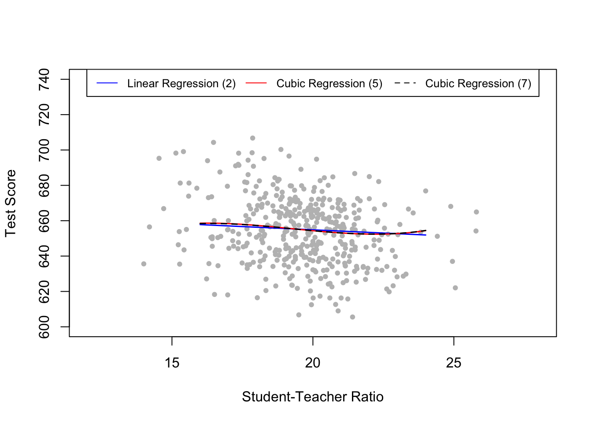


For the above figure  all regressors except $size$ are set to their sample averages. We see that the cubic regressions (5) and (7) are almost identical. They indicate that the relation between test scores and the student-teacher ratio only has a small amount of nonlinearity since they do not deviate much from the regression function of (2). 

The next code chunk reproduces Figure 8.11 of the book. We use <tt>plot()</tt> and <tt>points()</tt> to color observations depending on $HiEL$. Again, the regression lines are drawn based on predictions using average sample averages of all regressors except for $size$.


```r
# draw scatterplot

# observations with HiEL = 0
plot(CASchools$size[CASchools$HiEL == 0], 
     CASchools$score[CASchools$HiEL == 0], 
     xlim = c(12, 28),
     ylim = c(600, 730),
     pch = 20, 
     col = "gray", 
     xlab = "Student-Teacher Ratio", 
     ylab = "Test Score")

# observations with HiEL = 1
points(CASchools$size[CASchools$HiEL == 1], 
       CASchools$score[CASchools$HiEL == 1],
       col = "steelblue",
       pch = 20)

# add a legend
legend("top", 
       legend = c("Regression (6) with HiEL=0", "Regression (6) with HiEL=1"),
       cex = 0.7,
       ncol = 2,
       lty = c(1, 1),
       col = c("green", "red"))

# data for use with 'predict()'
new_data <- data.frame("size" = seq(12, 28, 0.05), 
                       "english" = mean(CASchools$english),
                       "lunch" = mean(CASchools$lunch),
                       "income" = mean(CASchools$income),
                       "HiEL" = 0)

# add estimated regression function for model (6) with HiEL=0
fitted <- predict(TestScore_mod6, newdata = new_data)

lines(new_data$size, 
      fitted, 
      lwd = 1.5,
      col = "green")

# add estimated regression function for model (6) with HiEL=1
new_data$HiEL <- 1

fitted <- predict(TestScore_mod6, newdata = new_data)

lines(new_data$size, 
      fitted, 
      lwd = 1.5,
      col = "red")
```


The regression output shows that model (6) finds statistically significant coefficients on the interaction terms $HiEL:size$, $HiEL:size^2$ and $HiEL:size^3$, i.e., there is evidence that the nonlinear relationship connecting test scores and student-teacher ratio depends on the fraction of English learning students in the district. However, the above figure shows that this difference is not of practical importance and is a good example for why one should be careful when interpreting nonlinear models: although the two regression functions look different, we see that the slope of both functions is almost identical for student-teacher ratios between $17$ and $23$. Since this range includes almost $90\%$ of all observations, we can be confident that nonlinear interactions between the fraction of English learners and the student-teacher ratio can be neglected. 

One might be tempted to object since both functions show opposing slopes for student-teacher ratios below $15$ and beyond $24$. There are at least to possible objections:

1. There are only few observations with low and high values of the student-teacher ratio, so there is only little information to be exploited when estimating the model. This means the estimated function is less precise in the tails of the data set.

2. The above described behavior of the regression function, is a typical caveat when using cubic functions since they generally show extreme behavior for extreme regressor values. Think of the graph of $f(x) = x^3$.

We thus find no clear evidence for a relation between class size and test scores on the percentage of English learners in the district.

#### Summary {-}

We are now able to answer the three question posed at the beginning of this section.

1. In the linear models, the percentage of English learners has only little influence on the effect on test scores from changing the student-teacher ratio. This result stays valid if we control for economic background of the students. While the cubic specification (6) provides evidence that the effect the student-teacher ratio on test score depends on the share of English learners, the strength of this effect is negligible.

2. When controlling for the students' economic background we find evidence of nonlinearities in the relationship between student-teacher ratio and test scores.

3. The linear specification (2) predicts that a reduction of the student-teacher ratio by two students per teacher leads to an improvement in test scores of about $-0.73 \times (-2) = 1.46$ points. Since the model is linear, this effect is independent of the class size. Assume that the student-teacher ratio is $20$. For example, the nonlinear model (5) predicts that the reduction increases test scores by $$64.33\cdot18+18^2\cdot(-3.42)+18^3\cdot(0.059) - (64.33\cdot20+20^2\cdot(-3.42)+20^3\cdot(0.059)) \approx 3.3$$ points. If the ratio is $22$, a reduction to $20$ leads to a predicted improvement in test scores of $$64.33\cdot20+20^2\cdot(-3.42)+20^3\cdot(0.059) - (64.33\cdot22+22^2\cdot(-3.42)+22^3\cdot(0.059)) \approx 2.4$$ points. This suggests that the effect is stronger in smaller classes.

## Exercises {#exercises-8}


<div  class = "DCexercise">

#### 1. Correlation and (Non)linearity I {-}
 
Consider the estimated simple linear regression model $$\widehat{medv_i} = 34.554 - 0.95\times lstat_i,$$

with <tt>medv</tt> (the median house value in the suburb) and <tt>lstat</tt> (the percent of households with low socioeconomic status in the suburb) being variables from the already known <tt>Boston</tt> dataset.

The <tt>lm()</tt>  object for the above model is available as <tt>mod</tt> in your working environment. The package <tt>MASS</tt> has been loaded.

**Instructions:**

  + Compute the correlation coefficient between <tt>medv</tt> and <tt>lstat</tt> and save it to <tt>corr</tt>.
  
  + Plot <tt>medv</tt> against <tt>lstat</tt> and add the regression line using the model object <tt>mod</tt>. What do you notice?

<iframe src="DCL/ex8_1.html" frameborder="0" scrolling="no" style="width:100%;height:340px"></iframe>
        
**Hints:**
        
  + You can use <tt>cor()</tt> to compute the correlation between variables.
      
  + You may use <tt>plot()</tt> and <tt>abline()</tt> to visualize regression results.
      
</div>


<div  class = "DCexercise">

#### 2. Correlation and (Non)linearity II {-}

In the previous exercise we saw an example where the correlation between the dependent variable <tt>medv</tt> and the regressor <tt>medv</tt> is not useful for choosing the functional form of the regression since correlation captures only the linear relationship. 

As an alternative, consider the nonlinear specification

$$medv_i = \beta_0 + \beta_1\times\log(lstat_i) + u_i.$$

The package <tt>MASS</tt> has been loaded.
      
**Instructions:**
        
  + Conduct the regression from above and assign the result to <tt>log_mod</tt>.
      
  + Visualize your results using a scatterplot and add the regression line. In comparison to the previous exercise, what do you notice now? 

<iframe src="DCL/ex8_2.html" frameborder="0" scrolling="no" style="width:100%;height:340px"></iframe>

**Hints:**
  
  + Use <tt>lm()</tt> to conduct the regression.

  + Use <tt>plot()</tt> and <tt>abline()</tt> to visualize regression results.
  
</div>


<div  class = "DCexercise">

#### 3. The Optimal Polynomial Order --- Sequential Testing {-}

Recall the following model from the previous exercise $$medv_i = \beta_0 + \beta_1\times\log(lstat_i) + u_i.$$

We saw that this model specification seems to be a reasonable choice. However, a higher order polynomial in $\log(lstat_i)$ may be more suited for explaining $medv$.

The packages <tt>AER</tt> and <tt>MASS</tt> have been loaded.
      
**Instructions:**
        
  + Determine the optimal order of a polylog model using sequential testing. Use a maximum polynomial order of $r=4$ and the significance level $\alpha=0.05$. We would like you to use a <tt>for()</tt> loop and recommend the following approach:

    1. Estimate a model, say <tt>mod</tt>, which starts with the highest polynomial order
    2. Save the $p$-value (use robust standard errors) of the relevant parameter and compare it to the significance level $\alpha$
    3. If you cannot reject the null, repeat steps 1 and 2 for the next lowest polynomial order, otherwise stop the loop and print out the polynomial order

  + Compute the $R^2$ of the selected model and assign it to <tt>R2</tt>.

<iframe src="DCL/ex8_3.html" frameborder="0" scrolling="no" style="width:100%;height:340px"></iframe>

**Hints:**

  + The index for the <tt>for()</tt> loop should start at 4 and end at 1.

  + Using <tt>poly()</tt> in the argument <tt>formula</tt> of <tt>lm()</tt> is a generic way to incorporate higher orders of a certain variable in the model. Besides the variable, you have to specify the degree of the polynomial via the argument <tt>degree</tt> and set <tt>raw = TRUE</tt>.

  + Use <tt>coeftest()</tt> together with the argument <tt>vcov.</tt> to obtain $p$-values (use robust standard errors!). Use the structure of the resulting object to extract the relevant $p$-value.

  + An <tt>if()</tt> statement may be useful to check whether the condition for acceptance of the null in step 3 is fulfilled. 

  + A <tt>for()</tt> loop is stopped using <tt>break</tt>.

  + Use <tt>summary()</tt> to obtain the $R^2$. You may extract it by appending <tt>$r.squared</tt> to the function call.
  
</div>


<div  class = "DCexercise">

#### 4. The Estimated Effect of a Unit Change {-}

Reconsider the polylog model from the previous exercise that was selected by the sequential testing approach. As this model is logarithmic and of quadratic form, we cannot simply read off the estimated effect of a unit change (that is, one percent) in <tt>lstat</tt> from the coefficient summary because this effect depends on the level of <tt>lstat</tt>. We  may compute this manually.

The selected polylog model <tt>mod_pl</tt> is available in your working environment. The package <tt>MASS</tt> has been loaded.
      
**Instructions:**

Assume that we are interested in the effect on <tt>medv</tt> of an increase in <tt>lstat</tt> from $10\%$ to $11\%$.

  + Set up a <tt>data.frame</tt> with the relevant observations of <tt>lstat</tt>.

  + Use the new observations to predict the corresponding values of <tt>medv</tt>.

  + Compute the expected effect with the help of <tt>diff()</tt>.

<iframe src="DCL/ex8_4.html" frameborder="0" scrolling="no" style="width:100%;height:340px"></iframe>

**Hints:**

- You may use <tt>predict()</tt> together with the new data to obtain the predicted values of <tt>medv</tt>. Note that the column names of the <tt>data.frame</tt> must match the names of the regressors when using <tt>predict()</tt>.

- <tt>diff()</tt> expects a vector. It computes the differences between all entries of this vector.
  
</div>


<div  class = "DCexercise">

#### 5. Interactions between Independent Variables I {-}

Consider the following regression model

$$medv_i=\beta_0+\beta_1\times chas_i+\beta_2\times old_i+\beta_3\times (chas_i\cdot old_i)+u_i$$

where $chas_i$ and $old_i$ are dummy variables. The former takes the value $1$, if the Charles River (a short river in the proximity of Boston) passes through suburb $i$ and is $0$ otherwise. The latter indicates for a high proportion of old buildings and is constructed as

\begin{align}
old_i = & \,
    \begin{cases}
      1 & \text{if $age_i\geq 95$},\\
      0 & \text{else},
    \end{cases}
\end{align}

with $age_i$ being the proportion of owner-occupied units built prior to 1940 in suburb $i$.

The packages <tt>MASS</tt> and <tt>AER</tt> have been loaded.
      
**Instructions:**
        
  + Generate an append the binary variable <tt>old</tt> to the dataset <tt>Boston</tt>.

  + Conduct the regression stated above and assign the result to <tt>mod_bb</tt>.

  + Obtain a robust coefficient summary of the model. How do you interpret the results?

<iframe src="DCL/ex8_5.html" frameborder="0" scrolling="no" style="width:100%;height:340px"></iframe>

**Hints:**

  + The operator <tt>>=</tt> can be used to generate a logical vector. Transform a logical vector to the numeric type via <tt>as.numeric()</tt>.

  + In <tt>lm()</tt> there are two ways to include interaction terms using the argument <tt>formula</tt>:

      1. <tt>Var1*Var2</tt> to add <tt>Var1</tt>, <tt>Var2</tt> and the corresponding interaction term at once

      2. <tt>Var1:Var2</tt> to manually add the interaction term (which of course requires you to add the remaining terms manually as well)

</div>


<div  class = "DCexercise">

#### 6. Interactions between Independent Variables II {-}

Now consider the regression model

$$medv_i=\beta_0+\beta_1\times indus_i+\beta_2\times old_i+\beta_3\times (indus_i\cdot old_i)+u_i$$

with $old_i$ defined as in the previous exercise and $indus_i$ being the proportion of non-retail business acres in suburb $i$.

The vector <tt>old</tt> from the previous exercise has been appended to the dataset. The package <tt>MASS</tt> has been loaded.
      
**Instructions:**
        
  + Estimate the above regression model and assign the result to <tt>mod_bc</tt>.

  + Extract the estimated coefficients of the model and assign them to <tt>params</tt>.

  + Plot <tt>medv</tt> against <tt>indus</tt> and add the regression lines for both states of the binary variable $old$.

<iframe src="DCL/ex8_6.html" frameborder="0" scrolling="no" style="width:100%;height:340px"></iframe>

**Hints:**

  + Make use the structure of <tt>mod_bc</tt> the output generated by <tt>coef()</tt> to extract the estimated coefficients.

  + Apart from passing an <tt>lm()</tt> object to <tt>abline()</tt> one may also specify intercept and slope manually using the arguments <tt>a</tt> and <tt>b</tt>, respectively.
  
</div>

<!--chapter:end:08-ch8.Rmd-->

# Assessing Studies Based on Multiple Regression {#asbomr}


The majority of Chapter 9 of the book is of a theoretical nature. Therefore this section briefly reviews the concepts of internal and external validity in general and discusses examples of threats to internal and external validity of multiple regression models. We discuss consequences of

- misspecification of the functional form of the regression function
- measurement errors
- missing data and sample selection
- simultaneous causality

as well as sources of inconsistency of OLS standard errors. We also review concerns regarding internal validity and external validity in the context of forecasting using regression models.

The chapter closes with an application in <tt>R</tt> where we assess whether results found by multiple regression using the <tt>CASchools</tt> data can be generalized to school districts of another federal state of the United States.

For a more detailed treatment of these topics we encourage you to work through Chapter 9 of the book.

The following packages and their dependencies are needed for reproduction of the code chunks presented throughout this chapter:

+ <tt>AER</tt>
+ <tt>mvtnorm</tt> 
+ <tt>stargazer</tt>


```r
library(AER)
library(mvtnorm)
library(stargazer)
```

## Internal and External Validity


<div class = 'keyconcept' id='KC9.1'>
<h3 class = 'right'> Key Concept 9.1 </h3>
<h3 class = 'left'> Internal and External Validity </h3>

A statistical analysis has *internal* validity if the statistical inference made about causal effects are valid for the considered population.

An analysis is said to have *external* validity if inferences and conclusion are valid for the studies' population and can be generalized to other populations and settings.

</div>


#### Threats to Internal Validity {-}

There are two conditions for internal validity to exist:

1. The estimator of the causal effect, which is measured the coefficient(s) of interest, should be unbiased and consistent. 

2. Statistical inference is valid, that is, hypothesis tests should have the desired size and confidence intervals should have the desired coverage probability.

In multiple regression, we estimate the model coefficients using OLS. Thus for condition 1. to be fulfilled we need the OLS estimator to be unbiased and consistent. For the second condition to be valid, the standard errors must be valid such that hypothesis testing and computation of confidence intervals yield results that are trustworthy. Remember that a sufficient condition for conditions 1. and 2. to be fulfilled is that the assumptions of Key Concept 6.4 hold. 

#### Threats to External Validity {-}

External validity might be invalid

- if there are differences between the population studied and the population of interest.

- if there are differences in the *settings* of the considered populations, e.g., the legal framework or the time of the investigation.

## Threats to Internal Validity of Multiple Regression Analysis {#ttivomra}

This section treats five sources that cause the OLS estimator in (multiple) regression models to be biased and inconsistent for the causal effect of interest and discusses possible remedies. All five sources imply a violation of the first least squares assumption presented in Key Concept 6.4.

This sections treats:

- omitted variable Bias

- misspecification of the functional form

- measurement errors

- missing data and sample selection

- simultaneous causality bias

Beside these threats for consistency of the estimator, we also briefly discuss causes of inconsistent estimation of OLS standard errors.

#### Omitted Variable Bias {-}


<div class = "keyconcept" id="KC9.2">
<h3 class = "right"> Key Concept 9.2 </h3>
<h3 class = "left"> Omitted Variable Bias: Should I include More Variables in My Regression? </h3>

Inclusion of additional variables reduces the risk of omitted variable bias but may increase the variance of the estimator of the coefficient of interest. 

We present some guidelines that help deciding whether to include an additional variable:

1. Specify the coefficient(s) of interest

2. Identify the most important potential sources of omitted variable bias by using knowledge available *before* estimating the model. You should end up with a baseline specification and a set of regressors that are questionable

3. Use different model specifications to test whether questionable regressors have coefficients different from zero

4. Use tables to provide full disclosure of your results, i.e., present different model specifications that both support your argument and enable the reader to see the effect of including questionable regressors

</div>


By now you should be aware of omitted variable bias and its consequences. Key Concept 9.2 gives some guidelines on how to proceed if there are control variables that possibly allow to reduce omitted variable bias. If including additional variables to mitigate the bias is not an option because there are no adequate controls, there are different approaches to solve the problem:

+ usage of panel data methods (discussed in Chapter \@ref(rwpd))

+ usage of instrumental variables regression (discussed in Chapter \@ref(ivr))

+ usage of a randomized control experiment (discussed in Chapter \@ref(eaqe))

#### Misspecification of the Functional Form of the Regression Function {-}

If the population regression function is nonlinear but the regression function is linear, the functional form of the regression model is misspecified. This leads to a bias of the OLS estimator.


<div class = "keyconcept" id="KC9.3">
<h3 class = "right"> Key Concept 9.3 </h3>
<h3 class = "left"> Functional Form Misspecification </h3>

A regression suffers from misspecification of the functional form when the functional form of the estimated regression model differs from the functional form of the population regression function. Functional form misspecification leads to biased and inconsistent coefficient estimators. A way to detect functional form misspecification is to plot the estimated regression function and the data. This may also be helpful to choose the correct functional form.

</div>


It is easy to come up with examples of misspecification of the functional form: consider the case where the population regression function is $$Y_i = X_i^2$$ but the model used is $$Y_i = \beta_0 + \beta_1 X_i + u_i.$$ Clearly, the regression function is misspecified here. We now simulate data and visualize this.


```r
# set seed for reproducibility
set.seed(3)

# simulate data set
X <- runif(100, -5, 5)
Y <- X^2 + rnorm(100)

# estimate the regression function
ms_mod <- lm(Y ~ X)
ms_mod
#> 
#> Call:
#> lm(formula = Y ~ X)
#> 
#> Coefficients:
#> (Intercept)            X  
#>     8.11363     -0.04684
```


```r
# plot the data
plot(X, Y, 
     main = "Misspecification of Functional Form",
     pch = 20,
     col = "steelblue")

# plot the linear regression line
abline(ms_mod, 
       col = "darkred",
       lwd = 2)
```


It is evident that the regression errors are relatively small for observations close to $X=-3$ and $X=3$ but that the errors increase for $X$ values closer to zero and even more for values beyond $-4$ and $4$. Consequences are drastic: the intercept is estimated to be $8.1$ and for the slope parameter we obtain an estimate obviously very close to zero. This issue does not disappear as the number of observations is increased because OLS is biased *and* inconsistent due to the misspecification of the regression function.

#### Measurement Error and Errors-in-Variables Bias {-}


<div class = "keyconcept" id="KC9.4">
<h3 class = "right"> Key Concept 9.4 </h3>
<h3 class = "left"> Errors-in-Variable Bias </h3>

When independent variables are measured imprecisely, we speak of errors-in-variables bias. This bias does not disappear if the sample size is large. If the measurement error has mean zero and is independent of the affected variable, the OLS estimator of the respective coefficient is biased towards zero.

</div>


Suppose you are incorrectly measuring the single regressor $X_i$ so that there is a measurement error and you observe $\overset{\sim}{X}_i$ instead of $X_i$. Then, instead of estimating the population the regression model $$ Y_i = \beta_0 + \beta_1 X_i + u_i $$ you end up estimating
\begin{align*}
  Y_i =& \, \beta_0 + \beta_1 \overset{\sim}{X}_i + \underbrace{\beta_1 (X_i - \overset{\sim}{X}_i) + u_i}_{=v_i} \\
  Y_i =& \, \beta_0 + \beta_1 \overset{\sim}{X}_i + v_i
\end{align*}
where $\overset{\sim}{X}_i$ and the error term $v_i$ are correlated. Thus OLS would be biased and inconsistent for the true $\beta_1$ in this example. One can show that direction and strength of the bias depend on the correlation between the observed regressor, $\overset{\sim}{X}_i$, and the measurement error, $w_i =X_i - \overset{\sim}{X}_i$. This correlation in turn depends on the type of the measurement error made.

The classical measurement error model assumes that the measurement error, $w_i$, has zero mean and that it is uncorrelated with the variable, $X_i$, and the error term of the population regression model, $u_i$:

\begin{equation}
  \overset{\sim}{X}_i = X_i + w_i, \ \ \rho_{w_i,u_i}=0, \ \ \rho_{w_i,X_i}=0 
\end{equation}
Then it holds that 
\begin{equation}
  \widehat{\beta}_1 \xrightarrow{p}{\frac{\sigma_{X}^2}{\sigma_{X}^2 + \sigma_{w}^2}} \beta_1 (\#eq:cmembias)
\end{equation}

which implies inconsistency as $\sigma_{X}^2, \sigma_{w}^2 > 0$ such that the fraction in \@ref(eq:cmembias) is smaller than $1$. Note that there are two extreme cases: 

1. If there is no measurement error, $\sigma_{w}^2=0$ such that $\widehat{\beta}_1 \xrightarrow{p}{\beta_1}$. 

2. if $\sigma_{w}^2 \gg \sigma_{X}^2$ we have $\widehat{\beta}_1 \xrightarrow{p}{0}$. This is the case if the measurement error is so large that there essentially is no information on $X$ in the data that can be used to estimate $\beta_1$.

The most obvious way to deal with errors-in-variables bias is to use an accurately measured $X$. If this not possible, instrumental variables regression is an option. One might also deal with the issue by using a mathematical model of the measurement error and adjust the estimates appropriately: if it is plausible that the classical measurement error model applies and if there is information that can be used to estimate the ratio in equation \@ref(eq:cmembias), one could compute an estimate that corrects for the downward bias.

For example, consider two bivariate normally distributed random variables $X,Y$. It is a [well known result](https://en.wikipedia.org/wiki/Multivariate_normal_distribution#Bivariate_case) that the conditional expectation function of $Y$ given $X$ has the form 
\begin{align}
  E(Y\vert X) = E(Y) + \rho_{X,Y} \frac{\sigma_{Y}}{\sigma_{X}}\left[X-E(X)\right]. (\#eq:bnormexpfn) 
\end{align} Thus for 
\begin{align}
  (X, Y) \sim \mathcal{N}\left[\begin{pmatrix}50\\ 100\end{pmatrix},\begin{pmatrix}10 & 5 \\ 5 & 10 \end{pmatrix}\right] (\#eq:bvnormd)
\end{align} according to \@ref(eq:bnormexpfn), the population regression function is
\begin{align*}
  Y_i =& \, 100 + 0.5 (X_i - 50) \\
      =& \, 75 + 0.5 X_i. (\#eq:bnormregfun)
\end{align*}
Now suppose you gather data on $X$ and $Y$, but that you can only measure $\overset{\sim}{X_i} = X_i + w_i$ with $w_i \overset{i.i.d.}{\sim} \mathcal{N}(0,10)$. Since the $w_i$ are independent of the $X_i$, there is no correlation between the $X_i$ and the $w_i$ so that we have a case of the classical measurement error model. We now illustrate this example in <tt>R</tt> using the package <tt>mvtnorm</tt> [@R-mvtnorm].


```r
# set seed
set.seed(1)

# load the package 'mvtnorm' and simulate bivariate normal data
library(mvtnorm)
dat <- data.frame(
  rmvnorm(1000, c(50, 100), 
          sigma = cbind(c(10, 5), c(5, 10))))

# set columns names
colnames(dat) <- c("X", "Y")
```

We now estimate a simple linear regression of $Y$ on $X$ using this sample data and run the same regression again but this time we add i.i.d. $\mathcal{N}(0,10)$ errors added to $X$.


```r
# estimate the model (without measurement error)
noerror_mod <- lm(Y ~ X, data = dat)

# estimate the model (with measurement error in X)
dat$X <- dat$X + rnorm(n = 1000, sd = sqrt(10))
error_mod <- lm(Y ~ X, data = dat)

# print estimated coefficients to console
noerror_mod$coefficients
#> (Intercept)           X 
#>  76.3002047   0.4755264
error_mod$coefficients
#> (Intercept)           X 
#>   87.276004    0.255212
```

Next, we visualize the results and compare with the population regression function.


```r
# plot sample data
plot(dat$X, dat$Y, 
     pch = 20, 
     col = "steelblue",
     xlab = "X",
     ylab = "Y")

# add population regression function
abline(coef = c(75, 0.5), 
       col = "darkgreen",
       lwd  = 1.5)

# add estimated regression functions
abline(noerror_mod, 
       col = "purple",
       lwd  = 1.5)

abline(error_mod, 
       col = "darkred",
       lwd  = 1.5)

# add legend
legend("topleft",
       bg = "transparent",
       cex = 0.8,
       lty = 1,
       col = c("darkgreen", "purple", "darkred"), 
       legend = c("Population", "No Errors", "Errors"))
```


In the situation without measurement error, the estimated regression function is close to the population regression function. Things are different when we use the mismeasured regressor $X$: both the estimate for the intercept and the estimate for the coefficient on $X$ differ considerably from results obtained using the "clean" data on $X$. In particular $\widehat{\beta}_1 = 0.255$, so there is a downward bias. We are in the comfortable situation to know $\sigma_X^2$ and $\sigma^2_w$. This allows us to correct for the bias using \@ref(eq:cmembias). Using this information we obtain the biased-corrected estimate $$\frac{\sigma_X^2 + \sigma_w^2}{\sigma_X^2} \cdot \widehat{\beta}_1 = \frac{10+10}{10} \cdot 0.255 = 0.51$$ which is quite close to $\beta_1=0.5$, the true coefficient from the population regression function.

Bear in mind that the above analysis uses a single sample. Thus one may argue that the results are just a coincidence. Can you show the contrary using a simulation study?

#### Missing Data and Sample Selection {-}


<div class = "keyconcept" id="KC9.5">
<h3 class = "right"> Key Concept 9.5 </h3>
<h3 class = "left"> Sample Selection Bias </h3>

When the sampling process influences the availability of data and when there is a relation of this sampling process to the dependent variable that goes beyond the dependence on the regressors, we say that there is a sample selection bias. This bias is due to correlation between one or more regressors and the error term. Sample selection implies both bias and inconsistency of the OLS estimator.

</div>


There are three cases of sample selection. Only one of them poses a threat to internal validity of a regression study. The three cases are:

1. Data are missing at random. 

2. Data are missing based on the value of a regressor.

3. Data are missing due to a selection process which is related to the dependent variable.

Let us jump back to the example of variables $X$ and $Y$ distributed as stated in equation \@ref(eq:bvnormd) and illustrate all three cases using <tt>R</tt>. 

If data are missing at random, this is nothing but loosing observations. For example, loosing $50\%$ of the sample would be the same as never having seen the (randomly chosen) half of the sample observed. Therefore, missing data do not introduce an estimation bias and "only" lead to less efficient estimators.


```r
# set seed
set.seed(1)

# simulate data
dat <- data.frame(
  rmvnorm(1000, c(50, 100), 
          sigma = cbind(c(10, 5), c(5, 10))))

colnames(dat) <- c("X", "Y")

# mark 500 randomly selected observations
id <- sample(1:1000, size = 500)

plot(dat$X[-id], 
     dat$Y[-id], 
     col = "steelblue", 
     pch = 20,
     cex = 0.8,
     xlab = "X",
     ylab = "Y")

points(dat$X[id], 
       dat$Y[id],
       cex = 0.8,
       col = "gray", 
       pch = 20)

# add the population regression function
abline(coef = c(75, 0.5), 
       col = "darkgreen",
       lwd  = 1.5)

# add the estimated regression function for the full sample
abline(noerror_mod)

# estimate model case 1 and add the regression line
dat <- dat[-id, ]

c1_mod <- lm(dat$Y ~ dat$X, data = dat)
abline(c1_mod, col = "purple")

# add a legend
legend("topleft",
       lty = 1,
       bg = "transparent",
       cex = 0.8,
       col = c("darkgreen", "black", "purple"), 
       legend = c("Population", "Full sample", "500 obs. randomly selected"))
```


The gray dots represent the $500$ discarded observations. When using the remaining observations, the estimation results deviate only marginally from the results obtained using the full sample. 

Selecting data randomly based on the value of a regressor has also the effect of reducing the sample size and does not introduce estimation bias. We will now drop all observations with $X > 45$, estimate the model again and compare.


```r
# set random seed
set.seed(1)

# simulate data
dat <- data.frame(
  rmvnorm(1000, c(50, 100), 
          sigma = cbind(c(10, 5), c(5, 10))))

colnames(dat) <- c("X", "Y")

# mark observations
id <- dat$X >= 45

plot(dat$X[-id], 
     dat$Y[-id], 
     col = "steelblue",
     cex = 0.8,
     pch = 20,
     xlab = "X",
     ylab = "Y")

points(dat$X[id], 
       dat$Y[id], 
       col = "gray",
       cex = 0.8,
       pch = 20)

# add population regression function
abline(coef = c(75, 0.5), 
       col = "darkgreen",
       lwd  = 1.5)

# add estimated regression function for full sample
abline(noerror_mod)

# estimate model case 1, add regression line
dat <- dat[-id, ]

c2_mod <- lm(dat$Y ~ dat$X, data = dat)
abline(c2_mod, col = "purple")

# add legend
legend("topleft",
       lty = 1,
       bg = "transparent",
       cex = 0.8,
       col = c("darkgreen", "black", "purple"), 
       legend = c("Population", "Full sample", "Obs. with X <= 45"))
```

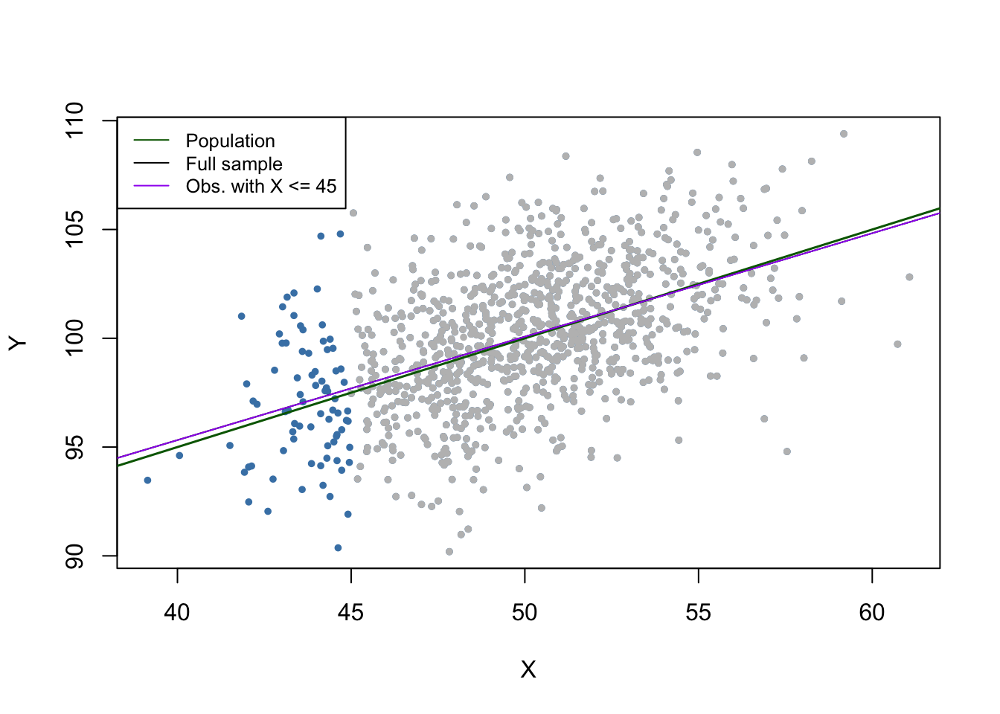


Note that although we dropped more than $90\%$ of all observations, the estimated regression function is very close to the line estimated based on the full sample.  

In the third case we face sample selection bias. We can illustrate this by using only observations with $X_i<55$ and $Y_i>100$. These observations are easily identified using the function <tt>which()</tt> and logical operators:  `which(dat$X < 55 & dat$Y > 100)`


```r
# set random seed
set.seed(1)

# simulate data
dat <- data.frame(
  rmvnorm(1000, c(50,100), 
          sigma = cbind(c(10,5), c(5,10))))

colnames(dat) <- c("X","Y")

# mark observations
id <- which(dat$X <= 55 & dat$Y >= 100)

plot(dat$X[-id], 
       dat$Y[-id], 
       col = "gray",
       cex = 0.8,
       pch = 20,
       xlab = "X",
       ylab = "Y")

points(dat$X[id], 
     dat$Y[id], 
     col = "steelblue",
     cex = 0.8,
     pch = 20)

# add population regression function
abline(coef = c(75, 0.5), 
       col = "darkgreen",
       lwd  = 1.5)

# add estimated regression function for full sample
abline(noerror_mod)

# estimate model case 1, add regression line
dat <- dat[id, ]

c3_mod <- lm(dat$Y ~ dat$X, data = dat)
abline(c3_mod, col = "purple")

# add legend
legend("topleft",
       lty = 1,
       bg = "transparent",
       cex = 0.8,
       col = c("darkgreen", "black", "purple"), 
       legend = c("Population", "Full sample", "X <= 55 & Y >= 100"))
```


We see that the selection process leads to biased estimation results. 

There are methods that allow to correct for sample selection bias. However, these methods are beyond the scope of the book and are therefore not considered here. The concept of sample selection bias is summarized in Key Concept 9.5.

#### Simultaneous Causality {-}


<div class = "keyconcept" id="KC9.6">
<h3 class = "right"> Key Concept 9.6 </h3>
<h3 class = "left"> Simultaneous Causality Bias </h3>
So far we have assumed that the changes in the independent variable $X$ are responsible for changes in the dependent variable $Y$. When the reverse is also true, we say that there is *simultaneous causality* between $X$ and $Y$. This reverse causality leads to correlation between $X$ and the error in the population regression of interest such that the coefficient on $X$ is estimated with bias.
</div>


Suppose we are interested in estimating the effect of a $20\%$ increase in cigarettes prices on cigarette consumption in the United States using a multiple regression model. This may be investigated using the dataset <tt>CigarettesSW</tt> which is part of the <tt>AER</tt> package. <tt>CigarettesSW</tt> is a panel data set on cigarette consumption for all 48 continental U.S. federal states from 1985-1995 and provides data on economic indicators and average local prices, taxes and per capita pack consumption. 

After loading the data set, we pick observations for the year 1995 and plot logarithms of the per pack price, <tt>price</tt>, against pack consumption, <tt>packs</tt>, and estimate a simple linear regression model.


```r
# load the data set
library(AER)
data("CigarettesSW")
c1995 <- subset(CigarettesSW, year == "1995")

# estimate the model
cigcon_mod <- lm(log(packs) ~ log(price), data = c1995)
cigcon_mod
#> 
#> Call:
#> lm(formula = log(packs) ~ log(price), data = c1995)
#> 
#> Coefficients:
#> (Intercept)   log(price)  
#>      10.850       -1.213
```


```r
# plot the estimated regression line and the data
plot(log(c1995$price), log(c1995$packs),
     xlab = "ln(Price)",
     ylab = "ln(Consumption)",
     main = "Demand for Cigarettes",
     pch = 20,
     col = "steelblue")

abline(cigcon_mod, 
       col = "darkred", 
       lwd = 1.5)
```


Remember from Chapter \@ref(nrf) that, due to the log-log specification, in the population regression the coefficient on the logarithm of price is interpreted as the price elasticity of consumption. The estimated coefficient suggests that a $1\%$ increase in cigarettes prices reduces cigarette consumption by about $1.2\%$, on average. Have we estimated a demand curve? The answer is no: this is a classic example of simultaneous causality, see Key Concept 9.6. The observations are market equilibria which are determined by both changes in supply and changes in demand. Therefore  the price is correlated with the error term and the OLS estimator is biased. We can neither estimate a demand nor a supply curve consistently using this approach. 

We will return to this issue in Chapter \@ref(ivr) which treats instrumental variables regression, an approach that allows consistent estimation when there is simultaneous causality.

#### Sources of Inconsistency of OLS Standard Errors {-}

There are two central threats to computation of consistent OLS standard errors:

1. Heteroskedasticity: implications of heteroskedasticiy have been discussed in Chapter \@ref(htaciitslrm). Heteroskedasticity-robust standard errors as computed by the function <tt>vcovHC()</tt> from the package <tt>sandwich</tt> produce valid standard errors under heteroskedasticity.

2. Serial correlation: if the population regression error is correlated across observations, we have serial correlation. This often happens in applications where repeated observations are used, e.g., in panel data studies. As for heteroskedasticity, <tt>vcovHC()</tt> can be used to obtain valid standard errors when there is serial correlation.

Inconsistent standard errors will produce invalid hypothesis tests and wrong confidence intervals. For example, when testing the null that some model coefficient is zero, we cannot trust the outcome anymore because the test may fail to have a size of $5\%$ due to the wrongly computed standard error.

Key Concept 9.7 summarizes all threats to internal validity discussed above.


<div class = "keyconcept" id="KC9.7">
<h3 class = "right"> Key Concept 9.7 </h3>
<h3 class = "left"> Threats to Internal Validity of a Regression Study </h3>

The five primary threats to internal validity of a multiple regression study are:

1. Omitted variables

2. Misspecification of functional form

3. Errors in variables (measurement errors in the regressors)

4. Sample selection

5. Simultaneous causality

All these threats lead to failure of the first least squares assumption $$E(u_i\vert X_{1i},\dots ,X_{ki}) \neq 0$$ so that the OLS estimator is biased *and* inconsistent. <br>

Furthermore, if one does not adjust for heteroskedasticity *and*/*or* serial correlation, incorrect standard errors may be a threat to internal validity of the study.

</div>


## Internal and External Validity when the Regression is Used for Forecasting

Recall the regression of test scores on the student-teacher ratio ($STR$) performed in Chapter \@ref(lrwor):


```r
linear_model <- lm(score ~ STR, data = CASchools)
linear_model
#> 
#> Call:
#> lm(formula = score ~ STR, data = CASchools)
#> 
#> Coefficients:
#> (Intercept)          STR  
#>      698.93        -2.28
```

The estimated regression function was

$$ \widehat{TestScore} = 698.9 - 2.28 \times STR.$$

The book discusses the example of a parent moving to a metropolitan area who plans to choose where to live based on the quality of local schools: a school district's average test score is an adequate measure for the quality. However, the parent has information on the student-teacher ratio only such that test scores need to be predicted. Although we have established that there is omitted variable bias in this model due to omission of variables like student learning opportunities outside school, the share of English learners and so on, <tt>linear_model</tt> may in fact be useful for the parent:

The parent need not care if the coefficient on $STR$ has causal interpretation, she wants $STR$ to explain as much variation in test scores as possible. Therefore, despite the fact that <tt>linear_model</tt> cannot be used to estimate the *causal effect* of a change in $STR$ on test scores, it can be considered a *reliable predictor* of test scores in general. 

Thus, the threats to internal validity as summarized in Key Concept 9.7 are negligible for the parent. This is, as instanced in the book, different for a superintendent who has been tasked to take measures that increase test scores: she requires a more reliable model that does not suffer from the threats listed in Key Concept 9.7. 

Consult Chapter 9.3 of the book for the corresponding discussion.

## Example: Test Scores and Class Size {#etsacs}

This section discusses internal and external validity of the results gained from analyzing the California test score data using multiple regression models.

#### External Validity of the Study {-}

External validity of the California test score analysis means that its results can be generalized. Whether this is possible depends on the population and the setting. Following the book we conduct the same analysis using data for fourth graders in $220$ public school districts in Massachusetts in 1998. Like <tt>CASchools</tt>, the data set <tt>MASchools</tt> is part of the <tt>AER</tt> package [@R-AER]. Use the help function (`?MASchools`) to get information on the definitions of all the variables contained.

We start by loading the data set and proceed by computing some summary statistics.


```r
# attach the 'MASchools' dataset
data("MASchools")
summary(MASchools)
#>    district         municipality           expreg       expspecial   
#>  Length:220         Length:220         Min.   :2905   Min.   : 3832  
#>  Class :character   Class :character   1st Qu.:4065   1st Qu.: 7442  
#>  Mode  :character   Mode  :character   Median :4488   Median : 8354  
#>                                        Mean   :4605   Mean   : 8901  
#>                                        3rd Qu.:4972   3rd Qu.: 9722  
#>                                        Max.   :8759   Max.   :53569  
#>                                                                      
#>      expbil           expocc          exptot        scratio      
#>  Min.   :     0   Min.   :    0   Min.   :3465   Min.   : 2.300  
#>  1st Qu.:     0   1st Qu.:    0   1st Qu.:4730   1st Qu.: 6.100  
#>  Median :     0   Median :    0   Median :5155   Median : 7.800  
#>  Mean   :  3037   Mean   : 1104   Mean   :5370   Mean   : 8.107  
#>  3rd Qu.:     0   3rd Qu.:    0   3rd Qu.:5789   3rd Qu.: 9.800  
#>  Max.   :295140   Max.   :15088   Max.   :9868   Max.   :18.400  
#>                                                  NA's   :9       
#>     special          lunch          stratio          income      
#>  Min.   : 8.10   Min.   : 0.40   Min.   :11.40   Min.   : 9.686  
#>  1st Qu.:13.38   1st Qu.: 5.30   1st Qu.:15.80   1st Qu.:15.223  
#>  Median :15.45   Median :10.55   Median :17.10   Median :17.128  
#>  Mean   :15.97   Mean   :15.32   Mean   :17.34   Mean   :18.747  
#>  3rd Qu.:17.93   3rd Qu.:20.02   3rd Qu.:19.02   3rd Qu.:20.376  
#>  Max.   :34.30   Max.   :76.20   Max.   :27.00   Max.   :46.855  
#>                                                                  
#>      score4          score8          salary         english       
#>  Min.   :658.0   Min.   :641.0   Min.   :24.96   Min.   : 0.0000  
#>  1st Qu.:701.0   1st Qu.:685.0   1st Qu.:33.80   1st Qu.: 0.0000  
#>  Median :711.0   Median :698.0   Median :35.88   Median : 0.0000  
#>  Mean   :709.8   Mean   :698.4   Mean   :35.99   Mean   : 1.1177  
#>  3rd Qu.:720.0   3rd Qu.:712.0   3rd Qu.:37.96   3rd Qu.: 0.8859  
#>  Max.   :740.0   Max.   :747.0   Max.   :44.49   Max.   :24.4939  
#>                  NA's   :40      NA's   :25
```

It is fairly easy to replicate key components of Table 9.1 of the book using <tt>R</tt>. To be consistent with variable names used in the <tt>CASchools</tt> data set, we do some formatting beforehand.


```r
# Customized variables in MASchools
MASchools$score <- MASchools$score4 
MASchools$STR <- MASchools$stratio

# Reproduce Table 9.1 of the book
vars <- c("score", "STR", "english", "lunch", "income")

cbind(CA_mean = sapply(CASchools[, vars], mean),
      CA_sd   = sapply(CASchools[, vars], sd),
      MA_mean = sapply(MASchools[, vars], mean),
      MA_sd   = sapply(MASchools[, vars], sd))
#>           CA_mean     CA_sd    MA_mean     MA_sd
#> score   654.15655 19.053347 709.827273 15.126474
#> STR      19.64043  1.891812  17.344091  2.276666
#> english  15.76816 18.285927   1.117676  2.900940
#> lunch    44.70524 27.123381  15.315909 15.060068
#> income   15.31659  7.225890  18.746764  5.807637
```

The summary statistics reveal that the average test score is higher for school districts in Massachusetts. The test used in Massachusetts is somewhat different from the one used in California (the Massachusetts test score also includes results for the school subject "Science"), therefore a direct comparison of test scores is not appropriate. We also see that, on average, classes are smaller in Massachusetts than in California and that the average district income, average percentage of English learners as well as the average share of students receiving subsidized lunch differ considerably from the averages computed for California. There are also notable differences in the observed dispersion of the variables.

Following the book we examine the relationship between district income and test scores in Massachusetts as we have done before in Chapter \@ref(nrf) for the California data and reproduce Figure 9.2 of the book.


```r
# estimate linear model
Linear_model_MA <- lm(score ~ income, data = MASchools)
Linear_model_MA
#> 
#> Call:
#> lm(formula = score ~ income, data = MASchools)
#> 
#> Coefficients:
#> (Intercept)       income  
#>     679.387        1.624

# estimate linear-log model
Linearlog_model_MA <- lm(score ~ log(income), data = MASchools) 
Linearlog_model_MA
#> 
#> Call:
#> lm(formula = score ~ log(income), data = MASchools)
#> 
#> Coefficients:
#> (Intercept)  log(income)  
#>      600.80        37.71

# estimate Cubic model
cubic_model_MA <- lm(score ~ I(income) + I(income^2) + I(income^3), data = MASchools)
cubic_model_MA
#> 
#> Call:
#> lm(formula = score ~ I(income) + I(income^2) + I(income^3), data = MASchools)
#> 
#> Coefficients:
#> (Intercept)    I(income)  I(income^2)  I(income^3)  
#>  600.398531    10.635382    -0.296887     0.002762
```


```r
# plot data
plot(MASchools$income, MASchools$score,
     pch = 20,
     col = "steelblue",
     xlab = "District income",
     ylab = "Test score",
     xlim = c(0, 50),
     ylim = c(620, 780))

# add estimated regression line for the linear model
abline(Linear_model_MA, lwd = 2)

# add estimated regression function for Linear-log model
order_id  <- order(MASchools$income)

lines(MASchools$income[order_id],
      fitted(Linearlog_model_MA)[order_id], 
      col = "darkgreen", 
      lwd = 2)

# add estimated cubic regression function
lines(x = MASchools$income[order_id], 
      y = fitted(cubic_model_MA)[order_id],
      col = "orange", 
      lwd = 2) 

# add a legend
legend("topleft",
       legend = c("Linear", "Linear-Log", "Cubic"),
       lty = 1,
       col = c("Black", "darkgreen", "orange"))
```


The plot indicates that the cubic specification fits the data best. Interestingly, this is different from the <tt>CASchools</tt> data where the pattern of nonlinearity is better described by the linear-log specification.

We continue by estimating most of the model specifications used for analysis of the <tt>CASchools</tt> data set in Chapter \@ref(nrf) and use <tt>stargazer()</tt> [@R-stargazer] to generate a tabular representation of the regression results.


```r
# add 'HiEL' to 'MASchools'
MASchools$HiEL <- as.numeric(MASchools$english > median(MASchools$english))

# estimate the model specifications from Table 9.2 of the book
TestScore_MA_mod1 <- lm(score ~ STR, data = MASchools)

TestScore_MA_mod2 <- lm(score ~ STR + english + lunch + log(income), 
                        data = MASchools)

TestScore_MA_mod3 <- lm(score ~ STR + english + lunch + income + I(income^2) 
                        + I(income^3), data = MASchools)

TestScore_MA_mod4 <- lm(score ~ STR + I(STR^2) + I(STR^3) + english + lunch + income 
                        + I(income^2) + I(income^3), data = MASchools)

TestScore_MA_mod5 <- lm(score ~ STR + I(income^2) + I(income^3) + HiEL:STR + lunch 
                        + income, data = MASchools)

TestScore_MA_mod6 <- lm(score ~ STR + I(income^2) + I(income^3) + HiEL + HiEL:STR + lunch 
                        + income, data = MASchools)

# gather robust standard errors
rob_se <- list(sqrt(diag(vcovHC(TestScore_MA_mod1, type = "HC1"))),
               sqrt(diag(vcovHC(TestScore_MA_mod2, type = "HC1"))),
               sqrt(diag(vcovHC(TestScore_MA_mod3, type = "HC1"))),
               sqrt(diag(vcovHC(TestScore_MA_mod4, type = "HC1"))),
               sqrt(diag(vcovHC(TestScore_MA_mod5, type = "HC1"))),
               sqrt(diag(vcovHC(TestScore_MA_mod6, type = "HC1"))))

# generate a table with 'stargazer()'
library(stargazer)

stargazer(Linear_model_MA, TestScore_MA_mod2, TestScore_MA_mod3, 
          TestScore_MA_mod4, TestScore_MA_mod5, TestScore_MA_mod6,
          title = "Regressions Using Massachusetts Test Score Data",
          type = "latex",
          digits = 3,
          header = FALSE,
          se = rob_se,
          object.names = TRUE,
          model.numbers = FALSE,
          column.labels = c("(I)", "(II)", "(III)", "(IV)", "(V)", "(VI)"))
```

preserve6c59e95d1d8d7085


Next we reproduce the $F$-statistics and $p$-values for testing exclusion of groups of variables.


```r
# F-test model (3)
linearHypothesis(TestScore_MA_mod3, 
                 c("I(income^2)=0", "I(income^3)=0"), 
                 vcov. = vcovHC, type = "HC1")
#> Linear hypothesis test
#> 
#> Hypothesis:
#> I(income^2) = 0
#> I(income^3) = 0
#> 
#> Model 1: restricted model
#> Model 2: score ~ STR + english + lunch + income + I(income^2) + I(income^3)
#> 
#> Note: Coefficient covariance matrix supplied.
#> 
#>   Res.Df Df     F   Pr(>F)   
#> 1    215                     
#> 2    213  2 6.227 0.002354 **
#> ---
#> Signif. codes:  0 '***' 0.001 '**' 0.01 '*' 0.05 '.' 0.1 ' ' 1

# F-tests model (4)
linearHypothesis(TestScore_MA_mod4, 
                 c("STR=0", "I(STR^2)=0", "I(STR^3)=0"), 
                 vcov. = vcovHC, type = "HC1")
#> Linear hypothesis test
#> 
#> Hypothesis:
#> STR = 0
#> I(STR^2) = 0
#> I(STR^3) = 0
#> 
#> Model 1: restricted model
#> Model 2: score ~ STR + I(STR^2) + I(STR^3) + english + lunch + income + 
#>     I(income^2) + I(income^3)
#> 
#> Note: Coefficient covariance matrix supplied.
#> 
#>   Res.Df Df      F  Pr(>F)  
#> 1    214                    
#> 2    211  3 2.3364 0.07478 .
#> ---
#> Signif. codes:  0 '***' 0.001 '**' 0.01 '*' 0.05 '.' 0.1 ' ' 1

linearHypothesis(TestScore_MA_mod4, 
                 c("I(STR^2)=0", "I(STR^3)=0"), 
                 vcov. = vcovHC, type = "HC1")
#> Linear hypothesis test
#> 
#> Hypothesis:
#> I(STR^2) = 0
#> I(STR^3) = 0
#> 
#> Model 1: restricted model
#> Model 2: score ~ STR + I(STR^2) + I(STR^3) + english + lunch + income + 
#>     I(income^2) + I(income^3)
#> 
#> Note: Coefficient covariance matrix supplied.
#> 
#>   Res.Df Df      F Pr(>F)
#> 1    213                 
#> 2    211  2 0.3396 0.7124

linearHypothesis(TestScore_MA_mod4, 
                 c("I(income^2)=0", "I(income^3)=0"), 
                 vcov. = vcovHC, type = "HC1")
#> Linear hypothesis test
#> 
#> Hypothesis:
#> I(income^2) = 0
#> I(income^3) = 0
#> 
#> Model 1: restricted model
#> Model 2: score ~ STR + I(STR^2) + I(STR^3) + english + lunch + income + 
#>     I(income^2) + I(income^3)
#> 
#> Note: Coefficient covariance matrix supplied.
#> 
#>   Res.Df Df      F   Pr(>F)   
#> 1    213                      
#> 2    211  2 5.7043 0.003866 **
#> ---
#> Signif. codes:  0 '***' 0.001 '**' 0.01 '*' 0.05 '.' 0.1 ' ' 1

# F-tests model (5)
linearHypothesis(TestScore_MA_mod5, 
                 c("STR=0", "STR:HiEL=0"), 
                 vcov. = vcovHC, type = "HC1")
#> Linear hypothesis test
#> 
#> Hypothesis:
#> STR = 0
#> STR:HiEL = 0
#> 
#> Model 1: restricted model
#> Model 2: score ~ STR + HiEL + HiEL:STR + lunch + income + I(income^2) + 
#>     I(income^3)
#> 
#> Note: Coefficient covariance matrix supplied.
#> 
#>   Res.Df Df      F Pr(>F)  
#> 1    214                   
#> 2    212  2 3.7663 0.0247 *
#> ---
#> Signif. codes:  0 '***' 0.001 '**' 0.01 '*' 0.05 '.' 0.1 ' ' 1

linearHypothesis(TestScore_MA_mod5, 
                 c("I(income^2)=0", "I(income^3)=0"), 
                 vcov. = vcovHC, type = "HC1")
#> Linear hypothesis test
#> 
#> Hypothesis:
#> I(income^2) = 0
#> I(income^3) = 0
#> 
#> Model 1: restricted model
#> Model 2: score ~ STR + HiEL + HiEL:STR + lunch + income + I(income^2) + 
#>     I(income^3)
#> 
#> Note: Coefficient covariance matrix supplied.
#> 
#>   Res.Df Df      F  Pr(>F)  
#> 1    214                    
#> 2    212  2 3.2201 0.04191 *
#> ---
#> Signif. codes:  0 '***' 0.001 '**' 0.01 '*' 0.05 '.' 0.1 ' ' 1

linearHypothesis(TestScore_MA_mod5, 
                 c("HiEL=0", "STR:HiEL=0"), 
                 vcov. = vcovHC, type = "HC1")
#> Linear hypothesis test
#> 
#> Hypothesis:
#> HiEL = 0
#> STR:HiEL = 0
#> 
#> Model 1: restricted model
#> Model 2: score ~ STR + HiEL + HiEL:STR + lunch + income + I(income^2) + 
#>     I(income^3)
#> 
#> Note: Coefficient covariance matrix supplied.
#> 
#>   Res.Df Df      F Pr(>F)
#> 1    214                 
#> 2    212  2 1.4674 0.2328

# F-test Model (6)
linearHypothesis(TestScore_MA_mod6, 
                 c("I(income^2)=0", "I(income^3)=0"), 
                 vcov. = vcovHC, type = "HC1")
#> Linear hypothesis test
#> 
#> Hypothesis:
#> I(income^2) = 0
#> I(income^3) = 0
#> 
#> Model 1: restricted model
#> Model 2: score ~ STR + lunch + income + I(income^2) + I(income^3)
#> 
#> Note: Coefficient covariance matrix supplied.
#> 
#>   Res.Df Df      F  Pr(>F)  
#> 1    216                    
#> 2    214  2 4.2776 0.01508 *
#> ---
#> Signif. codes:  0 '***' 0.001 '**' 0.01 '*' 0.05 '.' 0.1 ' ' 1
```

We see that, in terms of $\bar{R}^2$, specification (3) which uses a cubic to model the relationship between district income and test scores indeed performs better than the linear-log specification (2). Using different $F$-tests on models (4) and (5), we cannot reject the hypothesis that there is no nonlinear relationship between student teacher ratio and test score and also that the share of English learners has an influence on the relationship of interest. Furthermore, regression (6) shows that the percentage of English learners can be omitted as a regressor. Because of the model specifications made in (4) to (6) do not lead to substantially different results than those of regression (3), we choose model (3) as the most suitable specification.

In comparison to the California data, we observe the following results:

1. Controlling for the students' background characteristics in model specification (2) reduces the coefficient of interest (student-teacher ratio) by roughly $60\%$. The estimated coefficients are close to each other.

2. The coefficient on student-teacher ratio is always significantly different from zero at the level of $1\%$ for both data sets. This holds for all considered model specifications in both studies.

3. In both studies the share of English learners in a school district is of little importance for the estimated impact of a change in the student-teacher ratio on test score.

The biggest difference is that, in contrast to the California results, we do not find evidence of a nonlinear relationship between test scores and the student teacher ratio for the Massachusetts data since the corresponding $F$-tests for model (4) do not reject.

As pointed out in the book, the test scores for California and Massachusetts have different units because the underlying tests are different. Thus the estimated coefficients on the student-teacher ratio in both regressions cannot be compared before standardizing test scores to the same units as $$\frac{Testscore - \overline{TestScore}}{\sigma_{TestScore}}$$ for all observations in both data sets and running the regressions of interest using the standardized data again. One can show that the coefficient on student-teacher ratio in the regression using standardized test scores is the coefficient of the original regression divided by the standard deviation of test scores.

For model (3) of the Massachusetts data, the estimated coefficient on the student-teacher ratio is $-0.64$. A reduction of the student-teacher ratio by two students is predicted to increase test scores by $-2 \cdot (-0.64) = 1.28$ points. Thus we can compute the effect of a reduction of student-teacher ratio by two students on the standardized test scores as follows:


```r
TestScore_MA_mod3$coefficients[2] / sd(MASchools$score) * (-2)
#>        STR 
#> 0.08474001
```

For Massachusetts the predicted increase of test scores due to a reduction of the student-teacher ratio by two students is $0.085$ standard deviations of the distribution of the observed distribution of test scores. 

Using the linear specification (2) for California, the estimated coefficient on the student-teacher ratio is $-0.73$ so the predicted increase of test scores induced by a reduction of the student-teacher ratio by two students is $-0.73 \cdot (-2) = 1.46$. We use <tt>R</tt> to compute the predicted change in standard deviation units:


```r
TestScore_mod2$coefficients[2] / sd(CASchools$score) * (-2)
#>        STR 
#> 0.07708103
```

This shows that the the predicted increase of test scores due to a reduction of the student-teacher ratio by two students is $0.077$ standard deviation of the observed distribution of test scores for the California data.

In terms of standardized test scores, the predicted change is essentially the same for school districts in California and Massachusetts.

Altogether, the results support external validity of the inferences made using data on Californian elementary school districts --- at least for Massachusetts.

#### Internal Validity of the Study {-}

External validity of the study *does not* ensure their internal validity. Although the chosen model specification improves upon a simple linear regression model, internal validity may still be violated due to some of the threats listed in Key Concept 9.7. These threats are:
 
- omitted variable bias

- misspecification of functional form

- errors in variables

- sample selection issues

- simultaneous causality

- heteroskedasticity

- correlation of errors across observations

Consult the book for an in-depth discussion of these threats in view of both test score studies.

#### Summary {-}

We have found that there *is* a small but statistically significant effect of the student-teacher ratio on test scores. However, it remains unclear if we have indeed estimated the causal effect of interest since --- despite that our approach including control variables, taking into account nonlinearities in the population regression function and statistical inference using robust standard errors --- the results might still be biased for example if there are omitted factors which we have not considered. Thus *internal validity* of the study remains questionable. As we have concluded from comparison with the analysis of the Massachusetts data set, this result may be *externally valid*.   

The following chapters address techniques that can be remedies to all the threats to internal validity listed in Key Concept 9.7 if multiple regression alone is insufficient. This includes regression using panel data and approaches that employ instrumental variables.

## Exercises {#exercises-9}


<div  class = "DCexercise">

#### 1. Simulation Study: Misspecification of Functional Form  {-}

As stated in Chapter \@ref(ttivomra), misspecification of the regression function violates assumption 1 of Key Concept 6.3 so that the OLS estimator will be biased and inconsistent. We have illustrated the bias of $\hat{\beta}_0$ for the example of the quadratic population regression function
$$Y_i = X_i^2 $$
and the linear model $$Y_i = \beta_0 + \beta_1 X_i + u_i, \, u_i \sim \mathcal{N}(0,1)$$ using 100 randomly generated observations. Strictly speaking, this finding could be just a coincidence because we consider just one estimate obtained using a single data set. 

In this exercise, you have to generate simulation evidence for the bias of $\hat{\beta}_0$ in the model $$Y_i = \beta_0 + \beta_1 X_i + u_i$$ if the population regression function is $$Y_i = X_i^2.$$

**Instructions:**

Make sure to use the definitions suggested in the skeleton code in <tt>script.R</tt> to complete the following tasks:

+ Generate 1000 OLS estimates of $\beta_0$ in the model above using a <tt>for()</tt> loop where $X_i \sim \mathcal{U}[-5,5]$, $u_i \sim \mathcal{N}(0,1)$ using samples of size $100$. Save the estimates in <tt>beta_hats</tt>.

+ Compare the sample mean of the estimates to the true parameter using the <tt>==</tt> operator.

<iframe src="DCL/ex9_1.html" frameborder="0" scrolling="no" style="width:100%;height:360px"></iframe>

**Hint:**

You can generate random numbers from a uniform distribution using <tt>runif()</tt>.

</div>


<div  class = "DCexercise">

#### 2. Simulation Study: Errors-in-Variables Bias {-}

Consider again the application of the classical measurement error model introduced in Chapter \@ref(ttivomra):  

The single regressor $X_i$ is measured with error so that $\overset{\sim}{X}_i$ is observed instead. Thus one estimates $\beta_1$ in
\begin{align*}
  Y_i =& \, \beta_0 + \beta_1 \overset{\sim}{X}_i + \underbrace{\beta_1 (X_i -\overset{\sim}{X}_i) + u_i}_{=v_i} \\
  Y_i =& \, \beta_0 + \beta_1 \overset{\sim}{X}_i + v_i
\end{align*}
instead of $$Y_i = \beta_0 + \beta_1 X_i + u_i,$$

with the zero mean error $w_i$ being uncorrelated with $X_i$ and $u_i$. Then $\beta_1$ is inconsistently estimated by OLS:
\begin{equation}
  \widehat{\beta}_1 \xrightarrow{p}{\frac{\sigma_{X}^2}{\sigma_{X}^2 + \sigma_{w}^2}} \beta_1
\end{equation}

Let $$(X, Y) \sim \mathcal{N}\left[\begin{pmatrix}50\\ 100\end{pmatrix},\begin{pmatrix}10 & 5 \\ 5 & 10 \end{pmatrix}\right].$$ Recall from \@ref(eq:bnormexpfn) that $E(Y_i\vert X_i) = 75 + 0.5 X_i$ in this case. Further Assume that $\overset{\sim}{X_i} = X_i + w_i$ with $w_i \overset{i.i.d}{\sim} \mathcal{N}(0,10)$.

As mentioned in Exercise 1, Chapter \@ref(ttivomra) discusses the consequences of the measurement error for the OLS estimator of $\beta_1$ in this setting based on a *single* sample and and thus just one estimate. Strictly speaking, the conclusion made could be wrong because the oberseved bias may be due to random variation. A Monto Carlo simulation is more appropriate here.

**Instructions:**

Show that $\beta_1$ is estimated with a bias using a simulation study. Make sure to use the definitions suggested in the skeleton code in <tt>script.R</tt> to complete the following tasks:

+ Generate 1000 estimates of $\beta_1$ in the simple regression model $$Y_i = \beta_0 + \beta_1 X_i + u_i.$$ Use <tt>rmvnorm()</tt> to generate samples of 100 random observations from the bivariate normal distribution stated above.

+ Save the estimates in <tt>beta_hats</tt>.

+ Compute the sample mean of the estimates.

<iframe src="DCL/ex9_2.html" frameborder="0" scrolling="no" style="width:100%;height:400px"></iframe>

</div>

<!--chapter:end:09-ch9.Rmd-->

# Regression with Panel Data {#rwpd}

Regression using panel data may mitigate omitted variable bias when there is no information on variables that correlate with both the regressors of interest and the independent variable and if these variables are constant in the time dimension or across entities. Provided that panel data is available panel regression methods may improve upon multiple regression models which, as discussed in Chapter \@ref(asbomr), produce results that are not internally valid in such a setting.

This chapter covers the following topics:

- notation for panel data
- fixed effects regression using time and/or entity fixed effects
- computation of standard errors in fixed effects regression models

Following the book, for applications we make use of the dataset <tt>Fatalities</tt> from the <tt>AER</tt> package [@R-AER] which is a panel dataset reporting annual state level observations on U.S. traffic fatalities for the period 1982 through 1988. The applications analyze if there are effects of alcohol taxes and drunk driving laws on road fatalities and, if present, *how strong* these effects are.

We introduce <tt>plm()</tt>, a convenient <tt>R</tt> function that enables us to estimate linear panel regression models which comes with the package <tt>plm</tt> [@R-plm]. Usage of <tt>plm()</tt> is very similar as for the function <tt>lm()</tt> which we have used throughout the previous chapters for estimation of simple and multiple regression models.

The following packages and their dependencies are needed for reproduction of the code chunks presented throughout this chapter on your computer:

+ <tt>AER</tt>
+ <tt>plm</tt> 
+ <tt>stargazer</tt>

Check whether the following code chunk runs without any errors.


```r
library(AER)
library(plm)
library(stargazer)
```

## Panel Data


<div class = "keyconcept" id="KC10.1">
<h3 class = "right"> Key Concept 10.1 </h3>
<h3 class = "left"> Notation for Panel Data </h3>
In contrast to cross-section data where we have observations on $n$ subjects (entities), panel data has observations on $n$ entities at $T\geq2$ time periods. This is denoted

$$(X_{it},Y_{it}), \ i=1,\dots,n \ \ \ \text{and} \ \ \ t=1,\dots,T $$
where the index $i$ refers to the entity while $t$ refers to the time period.
</div>


Sometimes panel data is also called longitudinal data as it adds a temporal dimension to cross-sectional data. Let us have a look at the dataset <tt>Fatalities</tt> by checking its structure and listing the first few observations.


```r
# load the package and the dataset
library(AER)
data(Fatalities)
```


```r
# obtain the dimension and inspect the structure
is.data.frame(Fatalities)
#> [1] TRUE
dim(Fatalities)
#> [1] 336  34
```


```r
str(Fatalities)
#> 'data.frame':	336 obs. of  34 variables:
#>  $ state       : Factor w/ 48 levels "al","az","ar",..: 1 1 1 1 1 1 1 2 2 2 ...
#>  $ year        : Factor w/ 7 levels "1982","1983",..: 1 2 3 4 5 6 7 1 2 3 ...
#>  $ spirits     : num  1.37 1.36 1.32 1.28 1.23 ...
#>  $ unemp       : num  14.4 13.7 11.1 8.9 9.8 ...
#>  $ income      : num  10544 10733 11109 11333 11662 ...
#>  $ emppop      : num  50.7 52.1 54.2 55.3 56.5 ...
#>  $ beertax     : num  1.54 1.79 1.71 1.65 1.61 ...
#>  $ baptist     : num  30.4 30.3 30.3 30.3 30.3 ...
#>  $ mormon      : num  0.328 0.343 0.359 0.376 0.393 ...
#>  $ drinkage    : num  19 19 19 19.7 21 ...
#>  $ dry         : num  25 23 24 23.6 23.5 ...
#>  $ youngdrivers: num  0.212 0.211 0.211 0.211 0.213 ...
#>  $ miles       : num  7234 7836 8263 8727 8953 ...
#>  $ breath      : Factor w/ 2 levels "no","yes": 1 1 1 1 1 1 1 1 1 1 ...
#>  $ jail        : Factor w/ 2 levels "no","yes": 1 1 1 1 1 1 1 2 2 2 ...
#>  $ service     : Factor w/ 2 levels "no","yes": 1 1 1 1 1 1 1 2 2 2 ...
#>  $ fatal       : int  839 930 932 882 1081 1110 1023 724 675 869 ...
#>  $ nfatal      : int  146 154 165 146 172 181 139 131 112 149 ...
#>  $ sfatal      : int  99 98 94 98 119 114 89 76 60 81 ...
#>  $ fatal1517   : int  53 71 49 66 82 94 66 40 40 51 ...
#>  $ nfatal1517  : int  9 8 7 9 10 11 8 7 7 8 ...
#>  $ fatal1820   : int  99 108 103 100 120 127 105 81 83 118 ...
#>  $ nfatal1820  : int  34 26 25 23 23 31 24 16 19 34 ...
#>  $ fatal2124   : int  120 124 118 114 119 138 123 96 80 123 ...
#>  $ nfatal2124  : int  32 35 34 45 29 30 25 36 17 33 ...
#>  $ afatal      : num  309 342 305 277 361 ...
#>  $ pop         : num  3942002 3960008 3988992 4021008 4049994 ...
#>  $ pop1517     : num  209000 202000 197000 195000 204000 ...
#>  $ pop1820     : num  221553 219125 216724 214349 212000 ...
#>  $ pop2124     : num  290000 290000 288000 284000 263000 ...
#>  $ milestot    : num  28516 31032 32961 35091 36259 ...
#>  $ unempus     : num  9.7 9.6 7.5 7.2 7 ...
#>  $ emppopus    : num  57.8 57.9 59.5 60.1 60.7 ...
#>  $ gsp         : num  -0.0221 0.0466 0.0628 0.0275 0.0321 ...
```


```r
# list the first few observations
head(Fatalities)
#>   state year spirits unemp   income   emppop  beertax baptist  mormon drinkage
#> 1    al 1982    1.37  14.4 10544.15 50.69204 1.539379 30.3557 0.32829    19.00
#> 2    al 1983    1.36  13.7 10732.80 52.14703 1.788991 30.3336 0.34341    19.00
#> 3    al 1984    1.32  11.1 11108.79 54.16809 1.714286 30.3115 0.35924    19.00
#> 4    al 1985    1.28   8.9 11332.63 55.27114 1.652542 30.2895 0.37579    19.67
#> 5    al 1986    1.23   9.8 11661.51 56.51450 1.609907 30.2674 0.39311    21.00
#> 6    al 1987    1.18   7.8 11944.00 57.50988 1.560000 30.2453 0.41123    21.00
#>       dry youngdrivers    miles breath jail service fatal nfatal sfatal
#> 1 25.0063     0.211572 7233.887     no   no      no   839    146     99
#> 2 22.9942     0.210768 7836.348     no   no      no   930    154     98
#> 3 24.0426     0.211484 8262.990     no   no      no   932    165     94
#> 4 23.6339     0.211140 8726.917     no   no      no   882    146     98
#> 5 23.4647     0.213400 8952.854     no   no      no  1081    172    119
#> 6 23.7924     0.215527 9166.302     no   no      no  1110    181    114
#>   fatal1517 nfatal1517 fatal1820 nfatal1820 fatal2124 nfatal2124  afatal
#> 1        53          9        99         34       120         32 309.438
#> 2        71          8       108         26       124         35 341.834
#> 3        49          7       103         25       118         34 304.872
#> 4        66          9       100         23       114         45 276.742
#> 5        82         10       120         23       119         29 360.716
#> 6        94         11       127         31       138         30 368.421
#>       pop  pop1517  pop1820  pop2124 milestot unempus emppopus         gsp
#> 1 3942002 208999.6 221553.4 290000.1    28516     9.7     57.8 -0.02212476
#> 2 3960008 202000.1 219125.5 290000.2    31032     9.6     57.9  0.04655825
#> 3 3988992 197000.0 216724.1 288000.2    32961     7.5     59.5  0.06279784
#> 4 4021008 194999.7 214349.0 284000.3    35091     7.2     60.1  0.02748997
#> 5 4049994 203999.9 212000.0 263000.3    36259     7.0     60.7  0.03214295
#> 6 4082999 204999.8 208998.5 258999.8    37426     6.2     61.5  0.04897637
```


```r
# summarize the variables 'state' and 'year'
summary(Fatalities[, c(1, 2)])
#>      state       year   
#>  al     :  7   1982:48  
#>  az     :  7   1983:48  
#>  ar     :  7   1984:48  
#>  ca     :  7   1985:48  
#>  co     :  7   1986:48  
#>  ct     :  7   1987:48  
#>  (Other):294   1988:48
```

We find that the dataset consists of 336 observations on 34 variables. Notice that the variable <tt>state</tt> is a factor variable with 48 levels (one for each of the 48 contiguous federal states of the U.S.). 
The variable <tt>year</tt> is also a factor variable that has 7 levels identifying the time period when the observation was made. This gives us $7\times48 = 336$ observations in total. Since all variables are observed for all entities and over all time periods, the panel is *balanced*. If there were missing data for at least one entity in at least one time period we would call the panel *unbalanced*.

#### Example: Traffic Deaths and Alcohol Taxes {-}

We start by reproducing Figure 10.1 of the book. To this end we estimate simple regressions using data for years 1982 and 1988 that model the relationship between beer tax (adjusted for 1988 dollars) and the traffic fatality rate, measured as the number of fatalities per 10000 inhabitants. Afterwards, we plot the data and add the corresponding estimated regression functions. 


```r
# define the fatality rate
Fatalities$fatal_rate <- Fatalities$fatal / Fatalities$pop * 10000

# subset the data
Fatalities1982 <- subset(Fatalities, year == "1982")
Fatalities1988 <- subset(Fatalities, year == "1988")
```


```r
# estimate simple regression models using 1982 and 1988 data
fatal1982_mod <- lm(fatal_rate ~ beertax, data = Fatalities1982)
fatal1988_mod <- lm(fatal_rate ~ beertax, data = Fatalities1988)

coeftest(fatal1982_mod, vcov. = vcovHC, type = "HC1")
#> 
#> t test of coefficients:
#> 
#>             Estimate Std. Error t value Pr(>|t|)    
#> (Intercept)  2.01038    0.14957 13.4408   <2e-16 ***
#> beertax      0.14846    0.13261  1.1196   0.2687    
#> ---
#> Signif. codes:  0 '***' 0.001 '**' 0.01 '*' 0.05 '.' 0.1 ' ' 1
coeftest(fatal1988_mod, vcov. = vcovHC, type = "HC1")
#> 
#> t test of coefficients:
#> 
#>             Estimate Std. Error t value  Pr(>|t|)    
#> (Intercept)  1.85907    0.11461 16.2205 < 2.2e-16 ***
#> beertax      0.43875    0.12786  3.4314  0.001279 ** 
#> ---
#> Signif. codes:  0 '***' 0.001 '**' 0.01 '*' 0.05 '.' 0.1 ' ' 1
```

The estimated regression functions are
\begin{align*}
  \widehat{FatalityRate} =& \, \underset{(0.15)}{2.01} + \underset{(0.13)}{0.15} \times BeerTax \quad (1982 \text{ data}), \\
  \widehat{FatalityRate} =& \, \underset{(0.11)}{1.86} + \underset{(0.13)}{0.44} \times BeerTax \quad (1988 \text{ data}).
\end{align*}


```r
# plot the observations and add the estimated regression line for 1982 data
plot(x = Fatalities1982$beertax, 
     y = Fatalities1982$fatal_rate, 
     xlab = "Beer tax (in 1988 dollars)",
     ylab = "Fatality rate (fatalities per 10000)",
     main = "Traffic Fatality Rates and Beer Taxes in 1982",
     ylim = c(0, 4.5),
     pch = 20, 
     col = "steelblue")

abline(fatal1982_mod, lwd = 1.5)
```


```r

# plot observations and add estimated regression line for 1988 data
plot(x = Fatalities1988$beertax, 
     y = Fatalities1988$fatal_rate, 
     xlab = "Beer tax (in 1988 dollars)",
     ylab = "Fatality rate (fatalities per 10000)",
     main = "Traffic Fatality Rates and Beer Taxes in 1988",
     ylim = c(0, 4.5),
     pch = 20, 
     col = "steelblue")

abline(fatal1988_mod, lwd = 1.5)
```


In both plots, each point represents observations of beer tax and fatality rate for a given state in the respective year. The regression results indicate a positive relationship between the beer tax and the fatality rate for both years. The estimated coefficient on beer tax for the 1988 data is almost three times as large as for the 1988 dataset. This is contrary to our expectations: alcohol taxes are supposed to *lower* the rate of traffic fatalities. As we known from Chapter \@ref(rmwmr), this is possibly due to omitted variable bias, since both models do not include any covariates, e.g., economic conditions. This could be corrected for using a multiple regression approach. However, this cannot account for omitted *unobservable* factors that differ from state to state but can be assumed to be constant over the observation span, e.g., the populations' attitude towards drunk driving. As shown in the next section, panel data allow us to hold such factors constant.

## Panel Data with Two Time Periods: "Before and After" Comparisons {#PDWTTP}

Suppose there are only $T=2$ time periods $t=1982,1988$. This allows us to analyze differences in changes of the the fatality rate from year 1982 to 1988. We start by considering the population regression model $$FatalityRate_{it} = \beta_0 + \beta_1 BeerTax_{it} + \beta_2 Z_{i} + u_{it}$$ where the $Z_i$ are state specific characteristics that differ between states but are *constant over time*. For $t=1982$ and $t=1988$ we have
\begin{align*}
  FatalityRate_{i1982} =&\, \beta_0 + \beta_1 BeerTax_{i1982} + \beta_2 Z_i + u_{i1982}, \\
  FatalityRate_{i1988} =&\, \beta_0 + \beta_1 BeerTax_{i1988} + \beta_2 Z_i + u_{i1988}.
\end{align*}

We can eliminate the $Z_i$ by regressing the difference in the fatality rate between 1988 and 1982 on the difference in beer tax between those years:
$$FatalityRate_{i1988} - FatalityRate_{i1982} = \beta_1 (BeerTax_{i1988} - BeerTax_{i1982}) + u_{i1988} - u_{i1982}$$
This regression model yields an estimate for $\beta_1$ robust a possible bias due to omission of the $Z_i$, since these influences are eliminated from the model. Next we use use <tt>R</tt> to estimate a regression based on the differenced data and plot the estimated regression function.


```r
# compute the differences 
diff_fatal_rate <- Fatalities1988$fatal_rate - Fatalities1982$fatal_rate
diff_beertax <- Fatalities1988$beertax - Fatalities1982$beertax

# estimate a regression using differenced data
fatal_diff_mod <- lm(diff_fatal_rate ~ diff_beertax)

coeftest(fatal_diff_mod, vcov = vcovHC, type = "HC1")
#> 
#> t test of coefficients:
#> 
#>               Estimate Std. Error t value Pr(>|t|)   
#> (Intercept)  -0.072037   0.065355 -1.1022 0.276091   
#> diff_beertax -1.040973   0.355006 -2.9323 0.005229 **
#> ---
#> Signif. codes:  0 '***' 0.001 '**' 0.01 '*' 0.05 '.' 0.1 ' ' 1
```

Including the intercept allows for a change in the mean fatality rate in the time between 1982 and 1988 in the absence of a change in the beer tax.

We obtain the OLS estimated regression function $$\widehat{FatalityRate_{i1988} - FatalityRate_{i1982}} = -\underset{(0.065)}{0.072} -\underset{(0.36)}{1.04} \times (BeerTax_{i1988}-BeerTax_{i1982}).$$


```r
# plot the differenced data
plot(x = diff_beertax, 
     y = diff_fatal_rate, 
     xlab = "Change in beer tax (in 1988 dollars)",
     ylab = "Change in fatality rate (fatalities per 10000)",
     main = "Changes in Traffic Fatality Rates and Beer Taxes in 1982-1988",
     xlim = c(-0.6, 0.6),
     ylim = c(-1.5, 1),
     pch = 20, 
     col = "steelblue")

# add the regression line to plot
abline(fatal_diff_mod, lwd = 1.5)
```

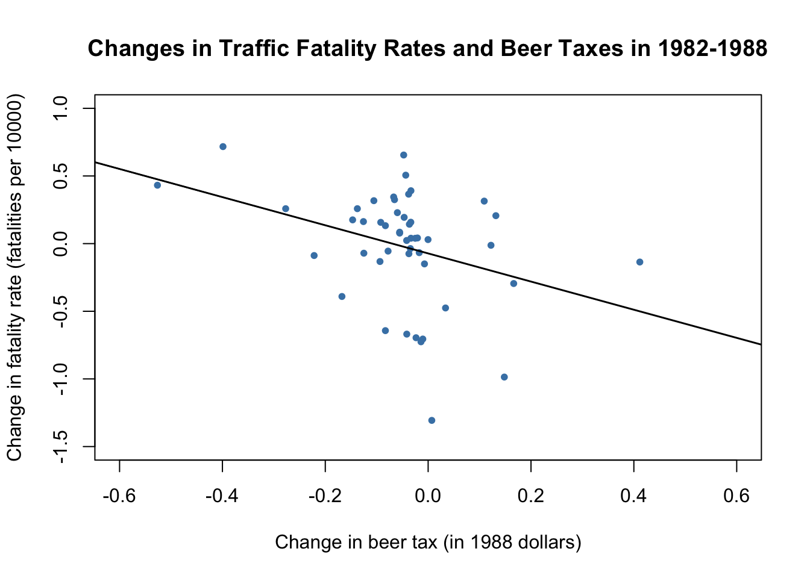


The estimated coefficient on beer tax is now negative and significantly different from zero at $5\%$. Its interpretation is that raising the beer tax by $\$1$ causes traffic fatalities to decrease by $1.04$ per $10000$ people. This is rather large as the average fatality rate is approximately $2$ persons per $10000$ people.


```r
# compute mean fatality rate over all states for all time periods
mean(Fatalities$fatal_rate)
#> [1] 2.040444
```

Once more this outcome is likely to be a consequence of omitting factors in the single-year regression that influence the fatality rate and are correlated with the beer tax *and* change over time. The message is that we need to be more careful and control for such factors before drawing conclusions about the effect of a raise in beer taxes.

The approach presented in this section discards information for years $1983$ to $1987$. A method that allows to use data for more than $T=2$ time periods and enables us to add control variables is the fixed effects regression approach.

## Fixed Effects Regression

Consider the panel regression model

$$Y_{it} = \beta_0 + \beta_1 X_{it} + \beta_2 Z_i +  u_{it}$$
where the $Z_i$ are unobserved time-invariant heterogeneities across the entities $i=1,\dots,n$. We aim to estimate $\beta_1$, the effect on $Y_i$ of a change in $X_i$ holding constant $Z_i$. Letting $\alpha_i = \beta_0 + \beta_2 Z_i$ we obtain the model
\begin{align}
Y_{it} = \alpha_i + \beta_1 X_{it} + u_{it} (\#eq:femodel).
\end{align}
Having individual specific intercepts $\alpha_i$, $i=1,\dots,n$, where each of these can be understood as the fixed effect of entity $i$, this model is called the *fixed effects model*. 
The variation in the $\alpha_i$, $i=1,\dots,n$ comes from the $Z_i$. \@ref(eq:femodel) can be rewritten as a regression model containing $n-1$ dummy regressors and a constant:
\begin{align}
Y_{it} = \beta_0 + \beta_1 X_{it} + \gamma_2 D2_i + \gamma_3 D3_i + \cdots + \gamma_n Dn_i + u_{it} (\#eq:drmodel).
\end{align}
Model \@ref(eq:drmodel) has $n$ different intercepts --- one for every entity. \@ref(eq:femodel) and \@ref(eq:drmodel) are equivalent representations of the fixed effects model.

The fixed effects  model can be generalized to contain more than just one determinant of $Y$ that is correlated with $X$ and changes over time. Key Concept 10.2 presents the generalized fixed effects regression model.


<div class = "keyconcept" id="KC10.2">
<h3 class = "right"> Key Concept 10.2 </h3>
<h3 class = "left"> The Fixed Effects Regression Model </h3>

The fixed effects regression model is

\begin{align}
Y_{it} = \beta_1 X_{1,it} + \cdots + \beta_k X_{k,it} + \alpha_i + u_{it} (\#eq:gfemodel)
\end{align}

with $i=1,\dots,n$ and $t=1,\dots,T$. The $\alpha_i$ are entity-specific intercepts that capture heterogeneities across entities. An equivalent representation of this model is given by

\begin{align}
Y_{it} = \beta_0 + \beta_1 X_{1,it} + \cdots + \beta_k X_{k,it} + \gamma_2 D2_i + \gamma_3 D3_i + \cdots + \gamma_n Dn_i  + u_{it} (\#eq:gdrmodel)
\end{align}

where the $D2_i,D3_i,\dots,Dn_i$ are dummy variables.

</div>


### Estimation and Inference {-}

Software packages use a so-called "entity-demeaned" OLS algorithm which is computationally more efficient than estimating regression models with $k+n$ regressors as needed for models \@ref(eq:gfemodel) and \@ref(eq:gdrmodel).

Taking averages on both sides of \@ref(eq:femodel) we obtain
\begin{align*}
\frac{1}{T} \sum_{t=1}^T Y_{it} =& \, \beta_1 \frac{1}{T} \sum_{t=1}^T X_{it} + \frac{1}{T} \sum_{t=1}^T \alpha_i + \frac{1}{T} \sum_{t=1}^T u_{it} \\
\overline{Y}_i =& \, \beta_1 \overline{X}_i + \alpha_i + \overline{u}_i. 
\end{align*}
Subtraction from \@ref(eq:femodel) yields
\begin{align}
\begin{split}
Y_{it} - \overline{Y}_i =& \, \beta_1(X_{it}-\overline{X}_i) + (u_{it} - \overline{u}_i) \\
\overset{\sim}{Y}_{it} =& \, \beta_1 \overset{\sim}{X}_{it} + \overset{\sim}{u}_{it}. 
\end{split} (\#eq:edols)
\end{align}
In this model, the OLS estimate of the parameter of interest $\beta_1$ is equal to the estimate obtained using \@ref(eq:drmodel) --- without the need to estimate $n-1$ dummies and an intercept. 

We conclude that there are two ways of estimating $\beta_1$ in the fixed effects regression:

1. OLS of the dummy regression model as shown in \@ref(eq:drmodel) 

2. OLS using the entity demeaned data as in \@ref(eq:edols)

Provided the fixed effects regression assumptions stated in Key Concept 10.3 hold, the sampling distribution of the OLS estimator in the fixed effects regression model is normal in large samples. The variance of the estimates can be estimated and we can compute standard errors, $t$-statistics and confidence intervals for coefficients. In the next section, we see how to estimate a fixed effects model using <tt>R</tt> and how to obtain a model summary that reports heteroskedasticity-robust standard errors. We leave aside complicated formulas of the estimators. See Chapter 10.5 and Appendix 10.2 of the book for a discussion of theoretical aspects.

### Application to Traffic Deaths {-}

Following Key Concept 10.2, the simple fixed effects model for estimation of the relation between traffic fatality rates and the beer taxes is
\begin{align}
FatalityRate_{it} = \beta_1 BeerTax_{it} + StateFixedEffects + u_{it}, (\#eq:fatsemod)
\end{align}
a regression of the traffic fatality rate on beer tax and 48 binary regressors --- one for each federal state.

We can simply use the function <tt>lm()</tt> to obtain an estimate of $\beta_1$.


```r
fatal_fe_lm_mod <- lm(fatal_rate ~ beertax + state - 1, data = Fatalities)
fatal_fe_lm_mod
#> 
#> Call:
#> lm(formula = fatal_rate ~ beertax + state - 1, data = Fatalities)
#> 
#> Coefficients:
#> beertax  stateal  stateaz  statear  stateca  stateco  statect  statede  
#> -0.6559   3.4776   2.9099   2.8227   1.9682   1.9933   1.6154   2.1700  
#> statefl  statega  stateid  stateil  statein  stateia  stateks  stateky  
#>  3.2095   4.0022   2.8086   1.5160   2.0161   1.9337   2.2544   2.2601  
#> statela  stateme  statemd  statema  statemi  statemn  statems  statemo  
#>  2.6305   2.3697   1.7712   1.3679   1.9931   1.5804   3.4486   2.1814  
#> statemt  statene  statenv  statenh  statenj  statenm  stateny  statenc  
#>  3.1172   1.9555   2.8769   2.2232   1.3719   3.9040   1.2910   3.1872  
#> statend  stateoh  stateok  stateor  statepa  stateri  statesc  statesd  
#>  1.8542   1.8032   2.9326   2.3096   1.7102   1.2126   4.0348   2.4739  
#> statetn  statetx  stateut  statevt  stateva  statewa  statewv  statewi  
#>  2.6020   2.5602   2.3137   2.5116   2.1874   1.8181   2.5809   1.7184  
#> statewy  
#>  3.2491
```

As discussed in the previous section, it is also possible to estimate $\beta_1$ by applying OLS to the demeaned data, that is, to run the regression

$$\overset{\sim}{FatalityRate} = \beta_1 \overset{\sim}{BeerTax}_{it} + u_{it}. $$


```r
# obtain demeaned data
Fatalities_demeaned <- with(Fatalities,
            data.frame(fatal_rate = fatal_rate - ave(fatal_rate, state),
            beertax = beertax - ave(beertax, state)))

# estimate the regression
summary(lm(fatal_rate ~ beertax - 1, data = Fatalities_demeaned))
```

The function <tt>ave</tt> is convenient for computing group averages. We use it to obtain state specific averages of the fatality rate and the beer tax.

Alternatively one may use <tt>plm()</tt> from the package with the same name. 


```r
# install and load the 'plm' package
## install.packages("plm")
library(plm)
```

As for <tt>lm()</tt> we have to specify the regression formula and the data to be used in our call of <tt>plm()</tt>. Additionally, it is required to pass a vector of names of entity and time ID variables to the argument <tt>index</tt>. For <tt>Fatalities</tt>, the ID variable for entities is named <tt>state</tt> and the time id variable is <tt>year</tt>. Since the fixed effects estimator is also called the *within estimator*, we set <tt>model = "within"</tt>. Finally, the function <tt>coeftest()</tt> allows to obtain inference based on robust standard errors.


```r
# estimate the fixed effects regression with plm()
fatal_fe_mod <- plm(fatal_rate ~ beertax, 
                    data = Fatalities,
                    index = c("state", "year"), 
                    model = "within")

# print summary using robust standard errors
coeftest(fatal_fe_mod, vcov. = vcovHC, type = "HC1")
#> 
#> t test of coefficients:
#> 
#>         Estimate Std. Error t value Pr(>|t|)  
#> beertax -0.65587    0.28880  -2.271  0.02388 *
#> ---
#> Signif. codes:  0 '***' 0.001 '**' 0.01 '*' 0.05 '.' 0.1 ' ' 1
```

The estimated coefficient is again $-0.6559$. Note that <tt>plm()</tt> uses the entity-demeaned OLS algorithm and thus does not report dummy coefficients. The estimated regression function is 

\begin{align}
\widehat{FatalityRate} = -\underset{(0.29)}{0.66} \times BeerTax + StateFixedEffects. (\#eq:efemod)
\end{align}

The coefficient on $BeerTax$ is negative and significant. The interpretation is that the estimated reduction in traffic fatalities due to an increase in the real beer tax by $\$1$ is $0.66$ per $10000$ people, which is still pretty high. Although including state fixed effects eliminates the risk of a bias due to omitted factors that vary across states but not over time, we suspect that there are other omitted variables that vary over time and thus cause a bias.

## Regression with Time Fixed Effects

Controlling for variables that are constant across entities but vary over time can be done by including time fixed effects. If there are *only* time fixed effects, the fixed effects regression model becomes $$Y_{it} = \beta_0 + \beta_1 X_{it} + \delta_2 B2_t + \cdots + \delta_T BT_t + u_{it},$$ where only $T-1$ dummies are included ($B1$ is omitted) since the model includes an intercept. This model eliminates omitted variable bias caused by excluding unobserved variables that evolve over time but are constant across entities.

In some applications it is meaningful to include both entity and time fixed effects. The *entity and time fixed effects  model* is $$Y_{it} = \beta_0 + \beta_1 X_{it} + \gamma_2 D2_i + \cdots + \gamma_n DT_i + \delta_2 B2_t + \cdots + \delta_T BT_t + u_{it} .$$ The combined model allows to eliminate bias from unobservables that change over time but are constant over entities and it controls for factors that differ across entities but are constant over time. Such models can be estimated using the OLS algorithm that is implemented in <tt>R</tt>. 

The following code chunk shows how to estimate the combined entity and time fixed effects model of the relation between fatalities and beer tax, $$FatalityRate_{it} = \beta_1 BeerTax_{it} + StateEffects + TimeFixedEffects + u_{it}$$ using both <tt>lm()</tt> and <tt>plm()</tt>. It is straightforward to estimate this regression with <tt>lm()</tt> since it is just an extension of \@ref(eq:fatsemod) so we only have to adjust the <tt>formula</tt> argument by adding the additional regressor <tt>year</tt> for time fixed effects. In our call of <tt>plm()</tt> we set another argument <tt>effect = "twoways"</tt> for inclusion of entity *and* time dummies.  


```r
# estimate a combined time and entity fixed effects regression model

# via lm()
fatal_tefe_lm_mod <- lm(fatal_rate ~ beertax + state + year - 1, data = Fatalities)
fatal_tefe_lm_mod
#> 
#> Call:
#> lm(formula = fatal_rate ~ beertax + state + year - 1, data = Fatalities)
#> 
#> Coefficients:
#>  beertax   stateal   stateaz   statear   stateca   stateco   statect   statede  
#> -0.63998   3.51137   2.96451   2.87284   2.02618   2.04984   1.67125   2.22711  
#>  statefl   statega   stateid   stateil   statein   stateia   stateks   stateky  
#>  3.25132   4.02300   2.86242   1.57287   2.07123   1.98709   2.30707   2.31659  
#>  statela   stateme   statemd   statema   statemi   statemn   statems   statemo  
#>  2.67772   2.41713   1.82731   1.42335   2.04488   1.63488   3.49146   2.23598  
#>  statemt   statene   statenv   statenh   statenj   statenm   stateny   statenc  
#>  3.17160   2.00846   2.93322   2.27245   1.43016   3.95748   1.34849   3.22630  
#>  statend   stateoh   stateok   stateor   statepa   stateri   statesc   statesd  
#>  1.90762   1.85664   2.97776   2.36597   1.76563   1.26964   4.06496   2.52317  
#>  statetn   statetx   stateut   statevt   stateva   statewa   statewv   statewi  
#>  2.65670   2.61282   2.36165   2.56100   2.23618   1.87424   2.63364   1.77545  
#>  statewy  year1983  year1984  year1985  year1986  year1987  year1988  
#>  3.30791  -0.07990  -0.07242  -0.12398  -0.03786  -0.05090  -0.05180

# via plm()
fatal_tefe_mod <- plm(fatal_rate ~ beertax, 
                      data = Fatalities,
                      index = c("state", "year"), 
                      model = "within", 
                      effect = "twoways")

coeftest(fatal_tefe_mod, vcov = vcovHC, type = "HC1")
#> 
#> t test of coefficients:
#> 
#>         Estimate Std. Error t value Pr(>|t|)  
#> beertax -0.63998    0.35015 -1.8277  0.06865 .
#> ---
#> Signif. codes:  0 '***' 0.001 '**' 0.01 '*' 0.05 '.' 0.1 ' ' 1
```

Before discussing the outcomes we convince ourselves that <tt>state</tt> and <tt>year</tt> are of the class <tt>factor</tt> . 


```r
# check the class of 'state' and 'year'
class(Fatalities$state)
#> [1] "factor"
class(Fatalities$year)
#> [1] "factor"
```

The <tt>lm()</tt> functions converts factors into dummies automatically. Since we exclude the intercept by adding <tt>-1</tt> to the right-hand side of the regression formula, <tt>lm()</tt> estimates coefficients for $n + (T-1) = 48 + 6 = 54$ binary variables (6 year dummies and 48 state dummies). Again, <tt>plm()</tt> only reports the estimated coefficient on $BeerTax$. 

The estimated regression function is
\begin{align}
\widehat{FatalityRate} =  -\underset{(0.35)}{0.64} \times BeerTax + StateEffects + TimeFixedEffects. (\#eq:cbnfemod)
\end{align}
The result $-0.66$ is close to the estimated coefficient for the regression model including only entity fixed effects. Unsurprisingly, the coefficient is less precisely estimated but significantly different from zero at $10\%$.

In view of \@ref(eq:efemod) and \@ref(eq:cbnfemod) we conclude that the estimated relationship between traffic fatalities and the real beer tax is not affected by omitted variable bias due to factors that are constant over time.

## The Fixed Effects Regression Assumptions and Standard Errors for Fixed Effects Regression {#tferaaseffer}

This section focuses on the entity fixed effects model and presents model assumptions that need to hold in order for OLS to produce unbiased estimates that are normally distributed in large samples. These assumptions are an extension of the assumptions made for the multiple regression model (see Key Concept 6.4) and are given in Key Concept 10.3. We also briefly discuss standard errors in fixed effects models which differ from standard errors in multiple regression as the regression error can exhibit serial correlation in panel models.


<div class = "keyconcept" id="KC10.3">
<h3 class = "right"> Key Concept 10.3 </h3>
<h3 class = "left"> The Fixed Effects Regression Assumptions </h3>

In the fixed effects model $$ Y_{it} = \beta_1 X_{it} + \alpha_i + u_{it} \ \ , \ \ i=1,\dots,n, \ t=1,\dots,T, $$ we assume the following:

1. The error term $u_{it}$ has conditional mean zero, that is, $E(u_{it}|X_{i1}, X_{i2},\dots, X_{iT})$.

2. $(X_{i1}, X_{i2}, \dots, X_{i3}, u_{i1}, \dots, u_{iT})$, $i=1,\dots,n$ are i.i.d. draws from their joint distribution.

3. Large outliers are unlikely, i.e., $(X_{it}, u_{it})$ have nonzero finite fourth moments.

4. There is no perfect multicollinearity.

When there are multiple regressors, $X_{it}$ is replaced by $X_{1,it}, X_{2,it}, \dots, X_{k,it}$.

</div>


The first assumption is that the error is uncorrelated with *all* observations of the variable $X$ for the entity $i$ over time. If this assumption is violated, we face omitted variables bias. The second assumption ensures that variables are i.i.d. *across* entities $i=1,\dots,n$. This does not require the observations to be uncorrelated *within* an entity. The $X_{it}$ are allowed to be *autocorrelated* within entities. This is a common property of time series data. The same is allowed for errors $u_{it}$. Consult Chapter \@ref(tferaaseffer) of the book for a detailed explanation for why autocorrelation is plausible in panel applications. The second assumption is justified if the entities are selected by simple random sampling. The third and fourth assumptions are analogous to the multiple regression assumptions made in Key Concept 6.4.

#### Standard Errors for Fixed Effects Regression {-}

Similar as for heteroskedasticity, autocorrelation invalidates the usual standard error formulas as well as heteroskedasticity-robust standard errors since these are derived under the assumption that there is no autocorrelation. When there is both heteroskedasticity *and* autocorrelation so-called *heteroskedasticity and autocorrelation-consistent (HAC) standard errors* need to be used. *Clustered standard errors* belong to these type of standard errors. They allow for heteroskedasticity and autocorrelated errors within an entity but *not* correlation across entities. 

As shown in the examples throughout this chapter, it is fairly easy to specify usage of clustered standard errors in regression summaries produced by function like <tt>coeftest()</tt> in conjunction with <tt>vcovHC()</tt> from the package <tt>sandwich</tt>. Conveniently, <tt>vcovHC()</tt> recognizes panel model objects (objects of class <tt>plm</tt>) and computes clustered standard errors by default.  

The regressions conducted in this chapter are a good examples for why usage of clustered standard errors is crucial in empirical applications of fixed effects models. For example, consider the entity and time fixed effects model for fatalities. Since <tt>fatal_tefe_lm_mod</tt> is an object of class <tt>lm</tt>, <tt>coeftest()</tt> does not compute clustered standard errors but uses robust standard errors that are only valid in the absence of autocorrelated errors.


```r
# check class of the model object
class(fatal_tefe_lm_mod)
#> [1] "lm"

# obtain a summary based on heteroskedasticity-robust standard errors 
# (no adjustment for heteroskedasticity only)
coeftest(fatal_tefe_lm_mod, vcov = vcovHC, type = "HC1")[1, ]
#>   Estimate Std. Error    t value   Pr(>|t|) 
#> -0.6399800  0.2547149 -2.5125346  0.0125470

# check class of the (plm) model object
class(fatal_tefe_mod)
#> [1] "plm"        "panelmodel"

# obtain a summary based on clusterd standard errors 
# (adjustment for autocorrelation + heteroskedasticity)
coeftest(fatal_tefe_mod, vcov = vcovHC, type = "HC1")
#> 
#> t test of coefficients:
#> 
#>         Estimate Std. Error t value Pr(>|t|)  
#> beertax -0.63998    0.35015 -1.8277  0.06865 .
#> ---
#> Signif. codes:  0 '***' 0.001 '**' 0.01 '*' 0.05 '.' 0.1 ' ' 1
```

The outcomes differ rather strongly: imposing no autocorrelation we obtain a standard error of $0.25$ which implies significance of $\hat\beta_1$, the coefficient on $BeerTax$ at the level of $5\%$. On the contrary, using the clustered standard error $0.35$ leads to acceptance of the hypothesis $H_0: \beta_1 = 0$ at the same level, see equation \@ref(eq:cbnfemod). Consult Appendix 10.2 of the book for insights on the computation of clustered standard errors.   

## Drunk Driving Laws and Traffic Deaths

There are two major sources of omitted variable bias that are not accounted for by all of the models of the relation between traffic fatalities and beer taxes that we have considered so far: economic conditions and driving laws. Fortunately, <tt>Fatalities</tt> has data on state-specific legal drinking age (<tt>drinkage</tt>), punishment (<tt>jail</tt>, <tt>service</tt>) and various economic indicators like unemployment rate (<tt>unemp</tt>) and per capita income (<tt>income</tt>). We may use these covariates to extend the preceding analysis. 

These covariates are defined as follows:

- <tt>unemp</tt>: a numeric variable stating the state specific unemployment rate.
- <tt>log(income)</tt>: the logarithm of real per capita income (in prices of 1988).
- <tt>miles</tt>: the state average miles per driver.
- <tt>drinkage</tt>: the state specify minimum legal drinking age.
- <tt>drinkagc</tt>: a discretized version of <tt>drinkage</tt> that classifies states into four categories of minimal drinking age; $18$, $19$, $20$, $21$ and older. <tt>R</tt> denotes this as <tt>[18,19)</tt>, <tt>[19,20)</tt>, <tt>[20,21)</tt> and <tt>[21,22]</tt>. These categories are included as dummy regressors where <tt>[21,22]</tt> is chosen as the reference category.
- <tt>punish</tt>: a dummy variable with levels <tt>yes</tt> and <tt>no</tt> that measures if drunk driving is severely punished by mandatory jail time or mandatory community service (first conviction).

At first, we define the variables according to the regression results presented in Table 10.1 of the book. 


```r
# discretize the minimum legal drinking age
Fatalities$drinkagec <- cut(Fatalities$drinkage,
                            breaks = 18:22, 
                            include.lowest = TRUE, 
                            right = FALSE)

# set minimum drinking age [21, 22] to be the baseline level
Fatalities$drinkagec <- relevel(Fatalities$drinkagec, "[21,22]")

# mandadory jail or community service?
Fatalities$punish <- with(Fatalities, factor(jail == "yes" | service == "yes", 
                                             labels = c("no", "yes")))

# the set of observations on all variables for 1982 and 1988
Fatalities_1982_1988 <- Fatalities[with(Fatalities, year == 1982 | year == 1988), ]
```

Next, we estimate all seven models using <tt>plm()</tt>.


```r
# estimate all seven models
fatalities_mod1 <- lm(fatal_rate ~ beertax, data = Fatalities)

fatalities_mod2 <- plm(fatal_rate ~ beertax + state, data = Fatalities)

fatalities_mod3 <- plm(fatal_rate ~ beertax + state + year,
                       index = c("state","year"),
                       model = "within",
                       effect = "twoways", 
                       data = Fatalities)

fatalities_mod4 <- plm(fatal_rate ~ beertax + state + year + drinkagec 
                       + punish + miles + unemp + log(income), 
                       index = c("state", "year"),
                       model = "within",
                       effect = "twoways",
                       data = Fatalities)

fatalities_mod5 <- plm(fatal_rate ~ beertax + state + year + drinkagec 
                       + punish + miles,
                       index = c("state", "year"),
                       model = "within",
                       effect = "twoways",
                       data = Fatalities)

fatalities_mod6 <- plm(fatal_rate ~ beertax + year + drinkage 
                       + punish + miles + unemp + log(income), 
                       index = c("state", "year"),
                       model = "within",
                       effect = "twoways",
                       data = Fatalities)

fatalities_mod7 <- plm(fatal_rate ~ beertax + state + year + drinkagec 
                       + punish + miles + unemp + log(income), 
                       index = c("state", "year"),
                       model = "within",
                       effect = "twoways",
                       data = Fatalities_1982_1988)
```

We again use <tt>stargazer()</tt> [@R-stargazer] to generate a comprehensive tabular presentation of the results.


```r
library(stargazer)

# gather clustered standard errors in a list
rob_se <- list(sqrt(diag(vcovHC(fatalities_mod1, type = "HC1"))),
               sqrt(diag(vcovHC(fatalities_mod2, type = "HC1"))),
               sqrt(diag(vcovHC(fatalities_mod3, type = "HC1"))),
               sqrt(diag(vcovHC(fatalities_mod4, type = "HC1"))),
               sqrt(diag(vcovHC(fatalities_mod5, type = "HC1"))),
               sqrt(diag(vcovHC(fatalities_mod6, type = "HC1"))),
               sqrt(diag(vcovHC(fatalities_mod7, type = "HC1"))))

# generate the table
stargazer(fatalities_mod1, fatalities_mod2, fatalities_mod3, 
          fatalities_mod4, fatalities_mod5, fatalities_mod6, fatalities_mod7, 
          digits = 3,
          header = FALSE,
          type = "latex", 
          se = rob_se,
          title = "Linear Panel Regression Models of Traffic Fatalities due to Drunk Driving",
          model.numbers = FALSE,
          column.labels = c("(1)", "(2)", "(3)", "(4)", "(5)", "(6)", "(7)"))
```

preservee7555451f826d089


While columns (2) and (3) recap the results \@ref(eq:efemod) and \@ref(eq:cbnfemod), column (1) presents an estimate of the coefficient of interest in the naive OLS regression of the fatality rate on beer tax without any fixed effects. We obtain a *positive* estimate for the coefficient on beer tax that is likely to be upward biased. The model fit is rather bad, too ($\bar{R}^2 = 0.091$). The sign of the estimate changes as we extend the model by both entity and time fixed effects in models (2) and (3). Furthermore $\bar{R}^2$ increases substantially as fixed effects are included in the model equation. Nonetheless, as discussed before, the magnitudes of both estimates may be too large. 

The model specifications (4) to (7) include covariates that shall capture the effect of overall state economic conditions as well as the legal framework. Considering (4) as the baseline specification, we observe four interesting results:

1. Including the covariates does not lead to a major reduction of the estimated effect of the beer tax. The coefficient is not significantly different from zero at the level of $5\%$ as the estimate is rather imprecise.

2. The minimum legal drinking age *does not* have an effect on traffic fatalities: none of the three dummy variables are significantly different from zero at any common level of significance. Moreover, an $F$-Test of the joint hypothesis that all three coefficients are zero does not reject. The next code chunk shows how to test this hypothesis.


```r
# test if legal drinking age has no explanatory power
linearHypothesis(fatalities_mod4,
                 test = "F",
                 c("drinkagec[18,19)=0", "drinkagec[19,20)=0", "drinkagec[20,21)"), 
                 vcov. = vcovHC, type = "HC1")
#> Linear hypothesis test
#> 
#> Hypothesis:
#> drinkagec[18,19) = 0
#> drinkagec[19,20) = 0
#> drinkagec[20,21) = 0
#> 
#> Model 1: restricted model
#> Model 2: fatal_rate ~ beertax + state + year + drinkagec + punish + miles + 
#>     unemp + log(income)
#> 
#> Note: Coefficient covariance matrix supplied.
#> 
#>   Res.Df Df      F Pr(>F)
#> 1    276                 
#> 2    273  3 0.3782 0.7688
```

3. There is no evidence that punishment for first offenders has a deterring effects on drunk driving: the corresponding coefficient is not significant at the $10\%$ level.

4. The economic variables significantly explain traffic fatalities. We can check that the employment rate and per capita income are jointly significant at the level of $0.1\%$.

```r
# test if economic indicators have no explanatory power
linearHypothesis(fatalities_mod4, 
                 test = "F",
                 c("log(income)", "unemp"), 
                 vcov. = vcovHC, type = "HC1")
#> Linear hypothesis test
#> 
#> Hypothesis:
#> log(income) = 0
#> unemp = 0
#> 
#> Model 1: restricted model
#> Model 2: fatal_rate ~ beertax + state + year + drinkagec + punish + miles + 
#>     unemp + log(income)
#> 
#> Note: Coefficient covariance matrix supplied.
#> 
#>   Res.Df Df      F    Pr(>F)    
#> 1    275                        
#> 2    273  2 31.577 4.609e-13 ***
#> ---
#> Signif. codes:  0 '***' 0.001 '**' 0.01 '*' 0.05 '.' 0.1 ' ' 1
```

Model (5) omits the economic factors. The result supports the notion that economic indicators should remain in the model as the coefficient on beer tax is sensitive to the inclusion of the latter.

Results for model (6) demonstrate that the legal drinking age has little explanatory power and that the coefficient of interest is not sensitive to changes in the functional form of the relation between drinking age and traffic fatalities. 

Specification (7) reveals that reducing the amount of available information (we only use 95 observations for the period 1982 to 1988 here) inflates standard errors but does not lead to drastic changes in coefficient estimates. 

#### Summary {-}

We have not found evidence that severe punishments and increasing the minimum drinking age reduce traffic fatalities due to drunk driving. Nonetheless, there seems to be a negative effect of alcohol taxes on traffic fatalities which, however, is estimated imprecisely and cannot be interpreted as the causal effect of interest as there still may be a bias. The issue is that there may be omitted variables that differ across states *and* change over time and this bias remains even though we use a panel approach that controls for entity specific and time invariant unobservables.

A powerful method that can be used if common panel regression approaches fail is instrumental variables regression. We will return to this concept in Chapter \@ref(ivr).

## Exercises {#exercises-10}


For the course of this section, you will work with <tt>Guns</tt>, a balanced panel containing observations on criminal and demographic variables for all US states and the years 1977-1999. The dataset comes with the package <tt>AER</tt> which is already installed for the interactive R exercises below.

<div  class = "DCexercise">

#### 1. The Guns Dataset {-}

**Instructions:**

+ Load both the <tt>AER</tt> package and the <tt>Guns</tt> dataset. 
  
+ Get yourself an overview over the dataset using the <tt>summary()</tt> function. Use <tt>?Guns</tt> for detailed information on the variables.
  
+ Verify that <tt>Guns</tt> is a balanced panel: extract the number of years and states from the dataset and assign them to the predefined variables <tt>years</tt> and <tt>states</tt>, respectively. Afterwards use these variables for a logical comparison: check that the panel is balanced.

<iframe src="DCL/ex10_1.html" frameborder="0" scrolling="no" style="width:100%;height:340px"></iframe>
        
**Hints:**
  
  + Use <tt>library()</tt> and <tt>data()</tt> to attach the package and load the dataset, respectively.
  + Use <tt>summary()</tt> to obtain a comprehensive overview of the dataset.
  + Remember that in a balanced panel the number of entities times the number of years equals the total number of observations in the dataset. The basic functions <tt>levels()</tt>, <tt>length()</tt> and <tt>nrow()</tt> may be useful.
      
</div>


<div  class = "DCexercise">
#### 2. Strict or Loose? Gun Laws and the Effect on Crime I {-}
There is a controversial debate whether and if to what extent the right to carry a gun influences crime. Proponents of so-called "Carrying a Concealed Weapon" (CCW) laws argue that the deterrent effect of guns prevents crime, whereas opponents argue that the public availability of guns increases their usage and thus makes it easier to commit crimes. In the following exercises you will empirically investigate this topic.
To begin with consider the following estimated model
$$\widehat{{\log(violent_i)}} = 6.135 - 0.443 \times law_i,$$
with $i=1,\ldots,51$ where <tt>violent</tt> is the violent crime rate (incidents per 100000 residents) and <tt>law</tt> is a binary variable indicating the implementation of a CCW law (1 = yes, 0 = no), respectively.

The estimated model is available as <tt>model</tt> in your working environment. The packages <tt>AER</tt> and <tt>plm</tt> have been loaded.
      
**Instructions:**
        
  + Extend and estimate the model by including state fixed effects using the function <tt>plm()</tt> and assign the model object to the predefined variable <tt>model_se</tt>. Can you think of an unobserved variable that is captured by this model specification?
  + Print a summary of the model which reports cluster robust standard errors.
  + Test whether the fixed state effects are jointly significant from zero. To do so use the function <tt>pFtest()</tt>. Use <tt>?pFtest</tt> for additional information.

<iframe src="DCL/ex10_2.html" frameborder="0" scrolling="no" style="width:100%;height:340px"></iframe>

**Hints:**
  
  + The function <tt>plm()</tt> allows you to conduct regressions with panel data and works very similar to <tt>lm()</tt>. You have to specify the entity and time indicators inside as a vector using the argument <tt>index</tt> and specify the estimator to be used with the argument <tt>model</tt> (for the fixed effects estimator this is <tt>"within"</tt>).
  
  + As usual you can use <tt>coeftest()</tt> in conjunction with appropriate arguments to obtain a summary output with robust standard errors.
  + <tt>pFtest()</tt> expects two model objects. The first model includes fixed effects, the second does not.
</div>


<div  class = "DCexercise">
#### 3. Strict or Loose? Gun Laws and the Effect on Crime II {-}
As touched upon at the end of the last exercise it is reasonable to also include time effects which is why we now consider the  model
\begin{align}\log(violent_i)  & = \beta_1\times law_i + \alpha_i + \lambda_t + u_i,\end{align}
for $i=1,\ldots,51$ and $t=1977,\ldots,1999$.
The models <tt>model</tt> and <tt>model_se</tt> from the previous exercises are available in your working environment. The packages <tt>AER</tt> and <tt>plm</tt> have been attached.
      
**Instructions:**
        
  + Estimate the model above and assign it to the variable <tt>model_sete</tt> using <tt>plm()</tt>.
  + Print a summary of the model which reports robust standard errors.
  + Test whether both state and time fixed effects are jointly significant.

<iframe src="DCL/ex10_3.html" frameborder="0" scrolling="no" style="width:100%;height:340px"></iframe>

**Hints:**
  
  + To additionally incorparate time fixed effects, one can set the argument <tt>effect="twoways"</tt> inside of <tt>plm()</tt>.
  + Note that we want to test whether the state *and* time fixed effects are jointly significant.
  
</div>


<div  class = "DCexercise">
#### 4. Strict or Loose? Gun Laws and the Effect on Crime III {-}
Despite the evidence for state as well as time effects found in exercise 3, there still might be a bias due to omitted variables such as sociodemographic characteristics. The following model accounts for the latter:
\begin{align}\log(violent_i)  & = \beta_1\times law_i + \beta_2\times density_i + \beta_3\times income_i + \beta_4\times population_i \\&\quad + \beta_5\times afam_i + \beta_6\times cauc_i + \beta_7\times male_i + \alpha_i + \lambda_t + u_i.\end{align}
See <tt>?Guns</tt> for detailed information on the additional variables.

The packages <tt>AER</tt> and <tt>plm</tt> have been loaded.
      
**Instructions:**
        
  + Estimate the extended model and assign it to the predefined variable <tt>model_sete_ext</tt>.
  + Print a robust summary of the estimated model. What can you say about the effect of a CCW law?

<iframe src="DCL/ex10_4.html" frameborder="0" scrolling="no" style="width:100%;height:340px"></iframe>

</div>


<div  class = "DCexercise">
#### 5. Fixed Effects Regression - Two Time Periods {-}
Recall the fixed effects model from Exercise 10.2, but now assume that you only have observations for the years 1978 and 1984. Consider the two model specifications
\begin{align}
\log(violent_{i1984}) - \log(violent_{i1978}) = \beta_{BA}\times(law_{i1984}-law_{i1978}) + (u_{i1984} - u_{i1978})
\end{align}
and
\begin{align}
\log(violent_{it}) = \beta_{FE}\times law_{it} + \alpha_i + u_{it},\\
\end{align}
with $i=1,\ldots,51$ and $t=1978,1984$.
In this exercise you need to show that $\widehat{\beta}_{BA}=\widehat{\beta}_{FE}$.
The subsets of <tt>Guns</tt> for the years 1978 and 1984 are already available as <tt>Guns78</tt> and <tt>Guns84</tt> in your working environment. The packages <tt>AER</tt> and <tt>plm</tt> have been loaded.
      
**Instructions:**
        
  + Compute the differences necessary to estimate the first model and assign them to the variables <tt>diff_logv</tt> and <tt>diff_law</tt>.
  + Estimate both models. Use the differenced data to estimate the first model and <tt>plm()</tt> for the second. 
  + Verify with a logical comparison that both procedures numerically yield the same estimate. Use the variables <tt>coef_diff</tt> and <tt>coef_plm</tt> which contain the relevant coefficients rounded to the fourth decimal place.

<iframe src="DCL/ex10_5.html" frameborder="0" scrolling="no" style="width:100%;height:340px"></iframe>

**Hints:**
  
  + Keep in mind that the dependend variable is log-transformed.
  + You may use <tt>plm()</tt> as in the previous exercises. Note that you only need a subset of the original <tt>Guns</tt> dataset. Theargument <tt>subset</tt> allows to subset the dataset passed to the argument <tt>data</tt>. Alternatively, you can join the two datasets <tt>Guns78</tt> and <tt>Guns84</tt>using, e.g., <tt>rbind()</tt>.
  + Use the logical operator <tt>==</tt> to compare both estimates.
  
</div>


<!--chapter:end:10-ch10.Rmd-->

# Regression with a Binary Dependent Variable {#rwabdv}

This chapter, we discusses a special class of regression models that aim to explain a limited dependent variable. In particular, we consider models where the dependent variable is binary. We will see that in such models, the regression function can be interpreted as a conditional probability function of the binary dependent variable. 

We review the following concepts:

- the linear probability model
- the Probit model
- the Logit model
- maximum likelihood estimation of nonlinear regression models

Of course, we will also see how to estimate above models using <tt>R</tt> and discuss an application where we examine the question whether there is racial discrimination in the U.S. mortgage market.

The following packages and their dependencies are needed for reproduction of the code chunks presented throughout this chapter on your computer:

+ <tt>AER</tt> [@R-AER]
+ <tt>stargazer</tt> [@R-stargazer]

Check whether the following code chunk runs without any errors.


```r
library(AER)
library(stargazer)
```

## Binary Dependent Variables and the Linear Probability Model


<div class = "keyconcept" id="KC11.1">
<h3 class = "right"> Key Concept 11.1 </h3>
<h3 class = "left"> The Linear Probability Model </h3>

The linear regression model 

$$Y_i = \beta_0 + \beta_1 X_{1i} + \beta_2 X_{2i} + \dots + \beta_k X_{ki} + u_i$$
with a binary dependent variable $Y_i$ is called the linear probability model. In the linear probability model we have $$E(Y\vert X_1,X_2,\dots,X_k) = P(Y=1\vert X_1, X_2,\dots, X_3)$$ where $$ P(Y = 1 \vert X_1, X_2, \dots, X_k) = \beta_0 + \beta_1 + X_{1i} + \beta_2 X_{2i} + \dots + \beta_k X_{ki}.$$

Thus, $\beta_j$ can be interpreted as the change in the probability that $Y_i=1$, holding constant the other $k-1$ regressors. Just as in common multiple regression, the $\beta_j$ can be estimated using OLS and the robust standard error formulas can be used for hypothesis testing and computation of confidence intervals. 

In most linear probability models, $R^2$ has no meaningful interpretation since the regression line can never fit the data perfectly if the dependent variable is binary and the regressors are continuous. This can be seen in the application below.

It is *essential* to use robust standard errors since the $u_i$ in a linear probability model are always heteroskedastic.

Linear probability models are easily estimated in <tt>R</tt> using the function <tt>lm()</tt>.

</div>


#### Mortgage Data {-}

Following the book, we start by loading the data set <tt>HMDA</tt> which provides data that relate to mortgage applications filed in Boston in the year of 1990. 


```r
# load `AER` package and attach the HMDA data
library(AER)
data(HMDA)
```

We continue by inspecting the first few observations and compute summary statistics afterwards.


```r
# inspect the data
head(HMDA)
#>   deny pirat hirat     lvrat chist mhist phist unemp selfemp insurance condomin
#> 1   no 0.221 0.221 0.8000000     5     2    no   3.9      no        no       no
#> 2   no 0.265 0.265 0.9218750     2     2    no   3.2      no        no       no
#> 3   no 0.372 0.248 0.9203980     1     2    no   3.2      no        no       no
#> 4   no 0.320 0.250 0.8604651     1     2    no   4.3      no        no       no
#> 5   no 0.360 0.350 0.6000000     1     1    no   3.2      no        no       no
#> 6   no 0.240 0.170 0.5105263     1     1    no   3.9      no        no       no
#>   afam single hschool
#> 1   no     no     yes
#> 2   no    yes     yes
#> 3   no     no     yes
#> 4   no     no     yes
#> 5   no     no     yes
#> 6   no     no     yes
summary(HMDA)
#>   deny          pirat            hirat            lvrat        chist   
#>  no :2095   Min.   :0.0000   Min.   :0.0000   Min.   :0.0200   1:1353  
#>  yes: 285   1st Qu.:0.2800   1st Qu.:0.2140   1st Qu.:0.6527   2: 441  
#>             Median :0.3300   Median :0.2600   Median :0.7795   3: 126  
#>             Mean   :0.3308   Mean   :0.2553   Mean   :0.7378   4:  77  
#>             3rd Qu.:0.3700   3rd Qu.:0.2988   3rd Qu.:0.8685   5: 182  
#>             Max.   :3.0000   Max.   :3.0000   Max.   :1.9500   6: 201  
#>  mhist    phist          unemp        selfemp    insurance  condomin  
#>  1: 747   no :2205   Min.   : 1.800   no :2103   no :2332   no :1694  
#>  2:1571   yes: 175   1st Qu.: 3.100   yes: 277   yes:  48   yes: 686  
#>  3:  41              Median : 3.200                                   
#>  4:  21              Mean   : 3.774                                   
#>                      3rd Qu.: 3.900                                   
#>                      Max.   :10.600                                   
#>   afam      single     hschool   
#>  no :2041   no :1444   no :  39  
#>  yes: 339   yes: 936   yes:2341  
#>                                  
#>                                  
#>                                  
#> 
```

The variable we are interested in modelling is <tt>deny</tt>, an indicator for whether an applicant's mortgage application has been accepted (<tt>deny = no</tt>) or denied (<tt>deny = yes</tt>). A regressor that ought to have power in explaining whether a mortgage application has been denied is <tt>pirat</tt>, the size of the anticipated total monthly loan payments relative to the the applicant's income. It is straightforward to translate this into the simple regression model

\begin{align}
  deny = \beta_0 + \beta_1 \times P/I\ ratio + u. (\#eq:denymod1)
\end{align}

We estimate this model just as any other linear regression model using <tt>lm()</tt>. Before we do so, the variable <tt>deny</tt> must be converted to a numeric variable using <tt>as.numeric()</tt> as <tt>lm()</tt> does not accept the *dependent variable* to be of class <tt>factor</tt>. Note that `as.numeric(HMDA$deny)` will turn <tt>deny = no</tt> into <tt>deny = 1</tt> and <tt>deny = yes</tt> into <tt>deny = 2</tt>, so using <tt>as.numeric(HMDA$deny)-1</tt> we obtain the values <tt>0</tt> and <tt>1</tt>.


```r
# convert 'deny' to numeric
HMDA$deny <- as.numeric(HMDA$deny) - 1

# estimate a simple linear probabilty model
denymod1 <- lm(deny ~ pirat, data = HMDA)
denymod1
#> 
#> Call:
#> lm(formula = deny ~ pirat, data = HMDA)
#> 
#> Coefficients:
#> (Intercept)        pirat  
#>    -0.07991      0.60353
```

Next, we plot the data and the regression line to reproduce Figure 11.1 of the book.


```r
# plot the data
plot(x = HMDA$pirat, 
     y = HMDA$deny,
     main = "Scatterplot Mortgage Application Denial and the Payment-to-Income Ratio",
     xlab = "P/I ratio",
     ylab = "Deny",
     pch = 20,
     ylim = c(-0.4, 1.4),
     cex.main = 0.8)

# add horizontal dashed lines and text
abline(h = 1, lty = 2, col = "darkred")
abline(h = 0, lty = 2, col = "darkred")
text(2.5, 0.9, cex = 0.8, "Mortgage denied")
text(2.5, -0.1, cex= 0.8, "Mortgage approved")

# add the estimated regression line
abline(denymod1, 
       lwd = 1.8, 
       col = "steelblue")
```


According to the estimated model, a payment-to-income ratio of $1$ is associated with an expected probability of mortgage application denial of roughly $50\%$. The model indicates that there is a positive relation between the payment-to-income ratio and the probability of a denied mortgage application so individuals with a high ratio of loan payments to income are more likely to be rejected.

We may use <tt>coeftest()</tt> to obtain robust standard errors for both coefficient estimates.


```r
# print robust coefficient summary
coeftest(denymod1, vcov. = vcovHC, type = "HC1")
#> 
#> t test of coefficients:
#> 
#>              Estimate Std. Error t value  Pr(>|t|)    
#> (Intercept) -0.079910   0.031967 -2.4998   0.01249 *  
#> pirat        0.603535   0.098483  6.1283 1.036e-09 ***
#> ---
#> Signif. codes:  0 '***' 0.001 '**' 0.01 '*' 0.05 '.' 0.1 ' ' 1
```

The estimated regression line is 
\begin{align}
\widehat{deny} = -\underset{(0.032)}{0.080} + \underset{(0.098)}{0.604} P/I \ ratio. (\#eq:lpm)
\end{align}
The true coefficient on $P/I \ ratio$ is statistically different from $0$ at the $1\%$ level. Its estimate can be interpreted as follows: a 1 percentage point increase in $P/I \ ratio$ leads to an increase in the probability of a loan denial by $0.604 \cdot 0.01 = 0.00604 \approx 0.6\%$.

Following the book we augment the simple model \@ref(eq:denymod1) by an additional regressor $black$ which equals $1$ if the applicant is an African American and equals $0$ otherwise. Such a specification is the baseline for investigating if there is racial discrimination in the mortgage market: if being black has a significant (positive) influence on the probability of a loan denial when we control for factors that allow for an objective assessment of an applicants credit worthiness, this is an indicator for discrimination.


```r
# rename the variable 'afam' for consistency
colnames(HMDA)[colnames(HMDA) == "afam"] <- "black"

# estimate the model
denymod2 <- lm(deny ~ pirat + black, data = HMDA)
coeftest(denymod2, vcov. = vcovHC)
#> 
#> t test of coefficients:
#> 
#>              Estimate Std. Error t value  Pr(>|t|)    
#> (Intercept) -0.090514   0.033430 -2.7076  0.006826 ** 
#> pirat        0.559195   0.103671  5.3939 7.575e-08 ***
#> blackyes     0.177428   0.025055  7.0815 1.871e-12 ***
#> ---
#> Signif. codes:  0 '***' 0.001 '**' 0.01 '*' 0.05 '.' 0.1 ' ' 1
```

The estimated regression function is
\begin{align}
  \widehat{deny} =& \, -\underset{(0.029)}{0.091} + \underset{(0.089)}{0.559} P/I \ ratio + \underset{(0.025)}{0.177} black. (\#eq:denymod2)
\end{align}

The coefficient on $black$ is positive and significantly different from zero at the $0.01\%$ level. The interpretation is that, holding constant the $P/I \ ratio$, being black increases the probability of a mortgage application denial by about $17.7\%$. This finding is compatible with racial discrimination. However, it might be distorted by omitted variable bias so discrimination could be a premature conclusion.

## Probit and Logit Regression {#palr}

The linear probability model has a major flaw: it assumes the conditional probability function to be linear. This does not restrict $P(Y=1\vert X_1,\dots,X_k)$ to lie between $0$ and $1$. We can easily see this in our reproduction of Figure 11.1 of the book: for $P/I \ ratio \geq 1.75$, \@ref(eq:lpm) predicts the probability of a mortgage application denial to be bigger than $1$. For applications with $P/I \ ratio$ close to $0$, the predicted probability of denial is even negative so that the model has no meaningful interpretation here.

This circumstance calls for an approach that uses a nonlinear function to model the conditional probability function of a binary dependent variable. Commonly used methods are Probit and Logit regression.

### Probit Regression {-}

In Probit regression, the cumulative standard normal distribution function $\Phi(\cdot)$ is used to model the regression function when the dependent variable is binary, that is, we assume
\begin{align}
  E(Y\vert X) = P(Y=1\vert X) = \Phi(\beta_0 + \beta_1 X). (\#eq:probitmodel)
\end{align}

$\beta_0 + \beta_1 X$ in \@ref(eq:probitmodel) plays the role of a quantile $z$. Remember that $$\Phi(z) = P(Z \leq z) \ , \ Z \sim \mathcal{N}(0,1)$$ such that the Probit coefficient $\beta_1$ in \@ref(eq:probitmodel) is the change in $z$ associated with a one unit change in $X$. Although the effect on $z$ of a change in $X$ is linear, the link between $z$ and the dependent variable $Y$ is nonlinear since $\Phi$ is a nonlinear function of $X$.

Since the dependent variable is a nonlinear function of the regressors, the coefficient on $X$ has no simple interpretation. According to Key Concept 8.1, the expected change in the probability that $Y=1$ due to a change in $P/I \ ratio$ can be computed as follows:

1. Compute the predicted probability that $Y=1$ for the original value of $X$.
2. Compute the predicted probability that $Y=1$ for $X + \Delta X$.
3. Compute the difference between both predicted probabilities.

Of course we can generalize \@ref(eq:probitmodel) to Probit regression with multiple regressors to mitigate the risk of facing omitted variable bias. Probit regression essentials are summarized in Key Concept 11.2.


<div class = "keyconcept" id="KC11.2">
<h3 class = "right"> Key Concept 11.2 </h3>
<h3 class = "left"> Probit Model, Predicted Probabilities and Estimated Effects</h3>

Assume that $Y$ is a binary variable. The model

$$ Y= \beta_0 + \beta_1 + X_1 + \beta_2 X_2 + \dots + \beta_k X_k + u $$
with
$$P(Y = 1 \vert X_1, X_2, \dots ,X_k) = \Phi(\beta_0 + \beta_1 + X_1 + \beta_2 X_2 + \dots + \beta_k X_k)$$
is the population Probit model with multiple regressors $X_1, X_2, \dots, X_k$ and $\Phi(\cdot)$ is the cumulative standard normal distribution function.

The predicted probability that $Y=1$ given $X_1, X_2, \dots, X_k$ can be calculated in two steps:

1. Compute $z = \beta_0 + \beta_1 X_1 + \beta_2 X_2 + \dots + \beta_k X_k$

2. Look up $\Phi(z)$ by calling <tt>pnorm()</tt>.

$\beta_j$ is the effect on $z$ of a one unit change in regressor $X_j$, holding constant all other $k-1$ regressors.

The effect on the predicted probability of a change in a regressor can be computed as in Key Concept 8.1.

In <tt>R</tt>, Probit models can be estimated using the function <tt>glm()</tt> from the package <tt>stats</tt>. Using the argument <tt>family</tt> we specify that we want to use a Probit link function.

</div>


We now estimate a simple Probit model of the probability of a mortgage denial.


```r
# estimate the simple probit model
denyprobit <- glm(deny ~ pirat, 
                  family = binomial(link = "probit"), 
                  data = HMDA)

coeftest(denyprobit, vcov. = vcovHC, type = "HC1")
#> 
#> z test of coefficients:
#> 
#>             Estimate Std. Error  z value  Pr(>|z|)    
#> (Intercept) -2.19415    0.18901 -11.6087 < 2.2e-16 ***
#> pirat        2.96787    0.53698   5.5269 3.259e-08 ***
#> ---
#> Signif. codes:  0 '***' 0.001 '**' 0.01 '*' 0.05 '.' 0.1 ' ' 1
```

The estimated model is

\begin{align}
  \widehat{P(deny\vert P/I \ ratio}) = \Phi(-\underset{(0.19)}{2.19} + \underset{(0.54)}{2.97} P/I \ ratio). (\#eq:denyprobit)
\end{align}

Just as in the linear probability model we find that the relation between the probability of denial and the payments-to-income ratio is positive and that the corresponding coefficient is highly significant.

The following code chunk reproduces Figure 11.2 of the book.


```r
# plot data
plot(x = HMDA$pirat, 
     y = HMDA$deny,
     main = "Probit Model of the Probability of Denial, Given P/I Ratio",
     xlab = "P/I ratio",
     ylab = "Deny",
     pch = 20,
     ylim = c(-0.4, 1.4),
     cex.main = 0.85)

# add horizontal dashed lines and text
abline(h = 1, lty = 2, col = "darkred")
abline(h = 0, lty = 2, col = "darkred")
text(2.5, 0.9, cex = 0.8, "Mortgage denied")
text(2.5, -0.1, cex= 0.8, "Mortgage approved")

# add estimated regression line
x <- seq(0, 3, 0.01)
y <- predict(denyprobit, list(pirat = x), type = "response")

lines(x, y, lwd = 1.5, col = "steelblue")
```


The estimated regression function has a stretched "S"-shape which is typical for the CDF of a continuous random variable with symmetric PDF like that of a normal random variable. The function is clearly nonlinear and flattens out for large and small values of $P/I \ ratio$. The functional form thus also ensures that the predicted conditional probabilities of a denial lie between $0$ and $1$. 

We use <tt>predict()</tt> to compute the predicted change in the denial probability when $P/I \ ratio$ is increased from $0.3$ to $0.4$.


```r
# 1. compute predictions for P/I ratio = 0.3, 0.4
predictions <- predict(denyprobit, 
                       newdata = data.frame("pirat" = c(0.3, 0.4)),
                       type = "response")

# 2. Compute difference in probabilities
diff(predictions)
#>          2 
#> 0.06081433
```

We find that an increase in the payment-to-income ratio from $0.3$ to $0.4$ is predicted to increase the probability of denial by approximately $6.1\%$.

We continue by using an augmented Probit model to estimate the effect of race on the probability of a mortgage application denial.


```r
denyprobit2 <- glm(deny ~ pirat + black, 
                   family = binomial(link = "probit"), 
                   data = HMDA)

coeftest(denyprobit2, vcov. = vcovHC, type = "HC1")
#> 
#> z test of coefficients:
#> 
#>              Estimate Std. Error  z value  Pr(>|z|)    
#> (Intercept) -2.258787   0.176608 -12.7898 < 2.2e-16 ***
#> pirat        2.741779   0.497673   5.5092 3.605e-08 ***
#> blackyes     0.708155   0.083091   8.5227 < 2.2e-16 ***
#> ---
#> Signif. codes:  0 '***' 0.001 '**' 0.01 '*' 0.05 '.' 0.1 ' ' 1
```

The estimated model equation is

\begin{align}
  \widehat{P(deny\vert P/I \ ratio, black)} = \Phi (-\underset{(0.18)}{2.26} + \underset{(0.50)}{2.74} P/I \ ratio + \underset{(0.08)}{0.71} black). (\#eq:denyprobit2) 
\end{align}

While all coefficients are highly significant, both the estimated coefficients on the payments-to-income ratio and the indicator for African American descent are positive. Again, the coefficients are difficult to interpret but they indicate that, first, African Americans have a higher probability of denial than white applicants, holding constant the payments-to-income ratio and second, applicants with a high payments-to-income ratio face a higher risk of being rejected.

How big is the estimated difference in denial probabilities between two hypothetical applicants with the same payments-to-income ratio? As before, we may use <tt>predict()</tt> to compute this difference.


```r
# 1. compute predictions for P/I ratio = 0.3
predictions <- predict(denyprobit2, 
                       newdata = data.frame("black" = c("no", "yes"), 
                                            "pirat" = c(0.3, 0.3)),
                       type = "response")

# 2. compute difference in probabilities
diff(predictions)
#>         2 
#> 0.1578117
```

In this case, the estimated difference in denial probabilities is about $15.8\%$.

### Logit Regression {-}

Key Concept 11.3 summarizes the Logit regression function. 


<div class = "keyconcept" id="KC11.3">
<h3 class = "right"> Key Concept 11.3 </h3>
<h3 class = "left"> Logit Regression </h3>

The population Logit regression function is

\begin{align*}
  P(Y=1\vert X_1, X_2, \dots, X_k) =& \, F(\beta_0 + \beta_1 X_1 + \beta_2 X_2 + \dots + \beta_k X_k) \\
  =& \, \frac{1}{1+e^{-(\beta_0 + \beta_1 X_1 + \beta_2 X_2 + \dots + \beta_k X_k)}}.
\end{align*}

The idea is similar to Probit regression except that a different CDF is used: $$F(x) = \frac{1}{1+e^{-x}}$$ is the CDF of a standard logistically distributed random variable.

</div>


As for Probit regression, there is no simple interpretation of the model coefficients and it is best to consider predicted probabilities or differences in predicted probabilities. Here again, $t$-statistics and confidence intervals based on large sample normal approximations can be computed as usual. 

It is fairly easy to estimate a Logit regression model using <tt>R</tt>.


```r
denylogit <- glm(deny ~ pirat, 
                 family = binomial(link = "logit"), 
                 data = HMDA)

coeftest(denylogit, vcov. = vcovHC, type = "HC1")
#> 
#> z test of coefficients:
#> 
#>             Estimate Std. Error  z value  Pr(>|z|)    
#> (Intercept) -4.02843    0.35898 -11.2218 < 2.2e-16 ***
#> pirat        5.88450    1.00015   5.8836 4.014e-09 ***
#> ---
#> Signif. codes:  0 '***' 0.001 '**' 0.01 '*' 0.05 '.' 0.1 ' ' 1
```

The subsequent code chunk reproduces Figure 11.3 of the book. 


```r
# plot data
plot(x = HMDA$pirat, 
     y = HMDA$deny,
     main = "Probit and Logit Models Model of the Probability of Denial, Given P/I Ratio",
     xlab = "P/I ratio",
     ylab = "Deny",
     pch = 20,
     ylim = c(-0.4, 1.4),
     cex.main = 0.9)

# add horizontal dashed lines and text
abline(h = 1, lty = 2, col = "darkred")
abline(h = 0, lty = 2, col = "darkred")
text(2.5, 0.9, cex = 0.8, "Mortgage denied")
text(2.5, -0.1, cex= 0.8, "Mortgage approved")

# add estimated regression line of Probit and Logit models
x <- seq(0, 3, 0.01)
y_probit <- predict(denyprobit, list(pirat = x), type = "response")
y_logit <- predict(denylogit, list(pirat = x), type = "response")

lines(x, y_probit, lwd = 1.5, col = "steelblue")
lines(x, y_logit, lwd = 1.5, col = "black", lty = 2)

# add a legend
legend("topleft",
       horiz = TRUE,
       legend = c("Probit", "Logit"),
       col = c("steelblue", "black"), 
       lty = c(1, 2))
```

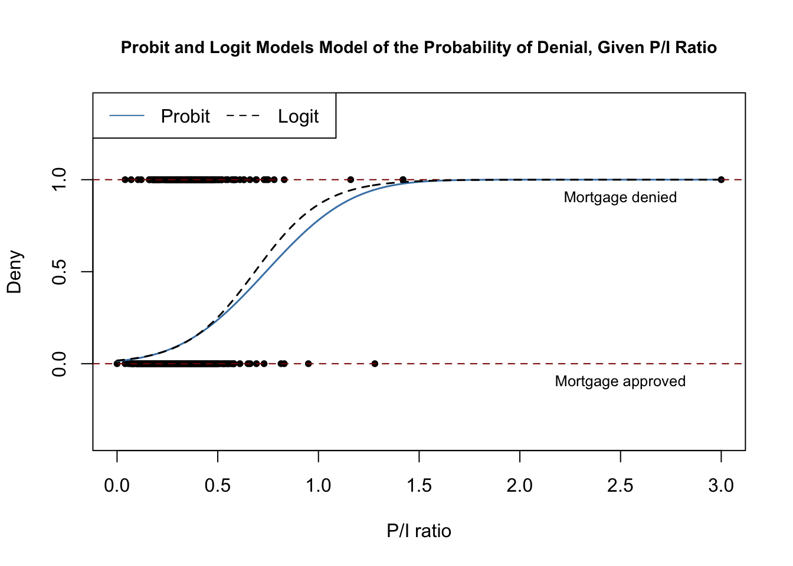


Both models produce very similar estimates of the probability that a mortgage application will be denied depending on the applicants payment-to-income ratio.

Following the book we extend the simple Logit model of mortgage denial with the additional regressor $black$.


```r
# estimate a Logit regression with multiple regressors
denylogit2 <- glm(deny ~ pirat + black, 
                  family = binomial(link = "logit"), 
                  data = HMDA)

coeftest(denylogit2, vcov. = vcovHC, type = "HC1")
#> 
#> z test of coefficients:
#> 
#>             Estimate Std. Error  z value  Pr(>|z|)    
#> (Intercept) -4.12556    0.34597 -11.9245 < 2.2e-16 ***
#> pirat        5.37036    0.96376   5.5723 2.514e-08 ***
#> blackyes     1.27278    0.14616   8.7081 < 2.2e-16 ***
#> ---
#> Signif. codes:  0 '***' 0.001 '**' 0.01 '*' 0.05 '.' 0.1 ' ' 1
```

We obtain

\begin{align}
  \widehat{P(deny=1 \vert P/I ratio, black)} = F(-\underset{(0.35)}{4.13} + \underset{(0.96)}{5.37} P/I \ ratio + \underset{(0.15)}{1.27} black). (\#eq:denylogit2)
\end{align}

As for the Probit model \@ref(eq:denyprobit2) all model coefficients are highly significant and we obtain positive estimates for the coefficients on $P/I \ ratio$ and $black$. For comparison we compute the predicted probability of denial for two hypothetical applicants that differ in race and have a $P/I \ ratio$ of $0.3$.


```r
# 1. compute predictions for P/I ratio = 0.3
predictions <- predict(denylogit2, 
                       newdata = data.frame("black" = c("no", "yes"), 
                                            "pirat" = c(0.3, 0.3)),
                       type = "response")

predictions
#>          1          2 
#> 0.07485143 0.22414592

# 2. Compute difference in probabilities
diff(predictions)
#>         2 
#> 0.1492945
```

We find that the white applicant faces a denial probability of only $7.5\%$, while the African American is rejected with a probability of $22.4\%$, a difference of $14.9$ percentage points.

#### Comparison of the Models {-}

The Probit model and the Logit model deliver only approximations to the unknown population regression function $E(Y\vert X)$. It is not obvious how to decide which model to use in practice. The linear probability model has the clear drawback of not being able to capture the nonlinear nature of the population regression function and it may predict probabilities to lie outside the interval $[0,1]$. Probit and Logit models are harder to interpret but capture the nonlinearities better than the linear approach: both models produce predictions of probabilities that lie inside the interval $[0,1]$. Predictions of all three models are often close to each other. The book suggests to use the method that is easiest to use in the statistical software of choice. As we have seen, it is equally easy to estimate Probit and Logit model using <tt>R</tt>. We can therefore give no general recommendation which method to use.  

## Estimation and Inference in the Logit and Probit Models

So far nothing has been said about *how* Logit and Probit models are estimated by statistical software. The reason why this is interesting is that both models are *nonlinear in the parameters* and thus cannot be estimated using OLS. Instead one relies on *maximum likelihood estimation* (MLE). Another approach is estimation by *nonlinear least squares* (NLS).

#### Nonlinear Least Squares {-}

Consider the multiple regression Probit model 
\begin{align}
  E(Y_i\vert X_{1i}, \dots, X_{ki}) = P(Y_i=1\vert X_{1i}, \dots, X_{ki}) = \Phi(\beta_0 + \beta_1 X_{1i} + \dots + \beta_k X_{ki}). (\#eq:multprobit)
\end{align}
Similarly to OLS, NLS estimates the parameters $\beta_0,\beta_1,\dots,\beta_k$ by minimizing the sum of squared mistakes
$$\sum_{i=1}^n\left[ Y_i - \Phi(b_0 + b_1 X_{1i} + \dots + b_k X_{ki}) \right]^2.$$
NLS estimation is a consistent approach that produces estimates which are normally distributed in large samples. In <tt>R</tt> there are functions like <tt>nls()</tt> from package <tt>stats</tt> which provide algorithms for solving nonlinear least squares problems.
However, NLS is inefficient, meaning that there are estimation techniques that have a smaller variance which is why we will not dwell any further on this topic. 

#### Maximum Likelihood Estimation {-}

In MLE we seek to estimate the unknown parameters choosing them such that the likelihood of drawing the sample observed is maximized. This probability is measured by means of the likelihood function, the joint probability distribution of the data treated as a function of the unknown parameters. Put differently, the maximum likelihood estimates of the unknown parameters are the values that result in a model which is most likely to produce the data observed. It turns out that MLE is more efficient than NLS.

As maximum likelihood estimates are normally distributed in large samples, statistical inference for coefficients in nonlinear models like Logit and Probit regression can be made using the same tools that are used for linear regression models: we can compute $t$-statistics and confidence intervals.

Many software packages use an MLE algorithm for estimation of nonlinear models. The function <tt>glm()</tt> uses an algorithm named *iteratively reweighted least squares*. 

#### Measures of Fit {-}

It is important to be aware that the usual $R^2$ and $\bar{R}^2$ are *invalid* for nonlinear regression models. The reason for this is simple: both measures assume that the relation between the dependent and the explanatory variable(s) is linear. This obviously does not hold for Probit and Logit models. Thus $R^2$ need not lie between $0$ and $1$ and there is no meaningful interpretation. However, statistical software sometimes reports these measures anyway.

There are many measures of fit for nonlinear regression models and there is no consensus which one should be reported. The situation is even more complicated because there is no measure of fit that is generally meaningful. For models with a binary response variable like $deny$ one could use the following rule: \newline If $Y_i = 1$ and $\widehat{P(Y_i|X_{i1}, \dots, X_{ik})} > 0.5$ or if $Y_i = 0$ and $\widehat{P(Y_i|X_{i1}, \dots, X_{ik})} < 0.5$, consider the $Y_i$ as correctly predicted. Otherwise $Y_i$ is said to be incorrectly predicted. The measure of fit is the share of correctly predicted observations. The downside of such an approach is that it does not mirror the quality of the prediction: whether $\widehat{P(Y_i = 1|X_{i1}, \dots, X_{ik}) = 0.51}$ or $\widehat{P(Y_i =1|X_{i1}, \dots, X_{ik}) = 0.99}$ is not reflected, we just predict $Y_i = 1$.^[This is in contrast to the case of a numeric dependent variable where we use the squared errors for assessment of the quality of the prediction.]  

An alternative to the latter are so called pseudo-$R^2$ measures. In order to measure the quality of the fit, these measures compare the value of the maximized (log-)likelihood of the model with all regressors (the *full model*) to the likelihood of a model with no regressors (*null model*, regression on a constant). 

For example, consider a Probit regression. The $\text{pseudo-}R^2$ is given by $$\text{pseudo-}R^2 = 1 - \frac{\ln(f^{max}_{full})}{\ln(f^{max}_{null})}$$ where $f^{max}_j \in [0,1]$ denotes the maximized likelihood for model $j$.

The reasoning behind this is that the maximized likelihood increases as additional regressors are added to the model, similarly to the decrease in $SSR$ when regressors are added in a linear regression model. If the full model has a similar maximized likelihood as the null model, the full model does not really improve upon a model that uses only the information in the dependent variable, so $\text{pseudo-}R^2 \approx 0$. If the full model fits the data very well, the maximized likelihood should be close to $1$ such that $\ln(f^{max}_{full}) \approx 0$ and $\text{pseudo-}R^2 \approx 1$. See Appendix 11.2 of the book for more on MLE and pseudo-$R^2$ measures.

<tt>summary()</tt> does not report $\text{pseudo-}R^2$ for models estimated by <tt>glm()</tt> but we can use the entries *residual deviance* (<tt>deviance</tt>) and *null deviance* (<tt>null.deviance</tt>) instead. These are computed as
$$\text{deviance} = -2 \times \left[\ln(f^{max}_{saturated}) - \ln(f^{max}_{full}) \right]$$
and

$$\text{null deviance} = -2 \times \left[\ln(f^{max}_{saturated}) - \ln(f^{max}_{null}) \right]$$
where $f^{max}_{saturated}$ is the maximized likelihood for a model which assumes that each observation has its own parameter (there are $n+1$ parameters to be estimated which leads to a perfect fit). For models with a binary dependent variable, it holds that $$\text{pseudo-}R^2 = 1 - \frac{\text{deviance}}{\text{null deviance}} = 1- \frac{\ln(f^{max}_{full})}{\ln(f^{max}_{null})}.$$

We now compute the $\text{pseudo-}R^2$ for the augmented Probit model of mortgage denial.


```r
# compute pseudo-R2 for the probit model of mortgage denial
pseudoR2 <- 1 - (denyprobit2$deviance) / (denyprobit2$null.deviance)
pseudoR2
#> [1] 0.08594259
```

Another way to obtain the $\text{pseudo-}R^2$ is to estimate the null model using <tt>glm()</tt> and extract the maximized log-likelihoods for both the null and the full model using the function <tt>logLik()</tt>. 


```r
# compute the null model
denyprobit_null <- glm(formula = deny ~ 1, 
                       family = binomial(link = "probit"), 
                       data = HMDA)

# compute the pseudo-R2 using 'logLik'
1 - logLik(denyprobit2)[1]/logLik(denyprobit_null)[1]
#> [1] 0.08594259
```

## Application to the Boston HMDA Data

Models \@ref(eq:denyprobit2) and \@ref(eq:denylogit2) indicate that denial rates are higher for African American applicants holding constant the payment-to-income ratio. Both results could be subject to omitted variable bias. In order to obtain a more trustworthy estimate of the effect of being black on the probability of a mortgage application denial we estimate a linear probability model as well as several Logit and Probit models. We thereby control for financial variables and additional applicant characteristics which are likely to influence the probability of denial and differ between black and white applicants.

Sample averages as shown in Table 11.1 of the book can be easily reproduced using the functions <tt>mean()</tt> (as usual for numeric variables) and <tt>prop.table()</tt> (for factor variables).


```r
# Mean P/I ratio
mean(HMDA$pirat)
#> [1] 0.3308136

# inhouse expense-to-total-income ratio
mean(HMDA$hirat)
#> [1] 0.2553461

# loan-to-value ratio
mean(HMDA$lvrat)
#> [1] 0.7377759

# consumer credit score
mean(as.numeric(HMDA$chist))
#> [1] 2.116387

# mortgage credit score
mean(as.numeric(HMDA$mhist))
#> [1] 1.721008

# public bad credit record
mean(as.numeric(HMDA$phist)-1)
#> [1] 0.07352941

# denied mortgage insurance
prop.table(table(HMDA$insurance))
#> 
#>         no        yes 
#> 0.97983193 0.02016807

# self-employed
prop.table(table(HMDA$selfemp))
#> 
#>        no       yes 
#> 0.8836134 0.1163866

# single
prop.table(table(HMDA$single))
#> 
#>        no       yes 
#> 0.6067227 0.3932773

# high school diploma
prop.table(table(HMDA$hschool))
#> 
#>         no        yes 
#> 0.01638655 0.98361345

# unemployment rate
mean(HMDA$unemp)
#> [1] 3.774496

# condominium
prop.table(table(HMDA$condomin))
#> 
#>        no       yes 
#> 0.7117647 0.2882353

# black
prop.table(table(HMDA$black))
#> 
#>       no      yes 
#> 0.857563 0.142437

# deny
prop.table(table(HMDA$deny))
#> 
#>         0         1 
#> 0.8802521 0.1197479
```

See Chapter 11.4 of the book or use <tt>R</tt>'s help function for more on variables contained in the <tt>HMDA</tt> dataset.

Before estimating the models we transform the loan-to-value ratio (<tt>lvrat</tt>) into a factor variable, where

\begin{align*}
  lvrat = 
  \begin{cases}
    \text{low} & \text{if} \ \ lvrat < 0.8, \\
    \text{medium} & \text{if} \ \ 0.8 \leq lvrat \leq 0.95, \\
    \text{high} & \text{if} \ \ lvrat > 0.95
  \end{cases}
\end{align*}

and convert both credit scores to numeric variables.


```r
# define low, medium and high loan-to-value ratio
HMDA$lvrat <- factor(
  ifelse(HMDA$lvrat < 0.8, "low",
  ifelse(HMDA$lvrat >= 0.8 & HMDA$lvrat <= 0.95, "medium", "high")),
  levels = c("low", "medium", "high"))

# convert credit scores to numeric
HMDA$mhist <- as.numeric(HMDA$mhist)
HMDA$chist <- as.numeric(HMDA$chist)
```

Next we reproduce the estimation results presented in Table 11.2 of the book.


```r
# estimate all 6 models for the denial probability
lpm_HMDA <- lm(deny ~ black + pirat + hirat + lvrat + chist + mhist + phist 
               + insurance + selfemp, data = HMDA)

logit_HMDA <- glm(deny ~ black + pirat + hirat + lvrat + chist + mhist + phist 
                  + insurance + selfemp, 
                  family = binomial(link = "logit"), 
                  data = HMDA)

probit_HMDA_1 <- glm(deny ~ black + pirat + hirat + lvrat + chist + mhist + phist 
                     + insurance + selfemp, 
                     family = binomial(link = "probit"), 
                     data = HMDA)

probit_HMDA_2 <- glm(deny ~ black + pirat + hirat + lvrat + chist + mhist + phist 
                     + insurance + selfemp + single + hschool + unemp, 
                     family = binomial(link = "probit"), 
                     data = HMDA)

probit_HMDA_3 <- glm(deny ~ black + pirat + hirat + lvrat + chist + mhist 
                     + phist + insurance + selfemp + single + hschool + unemp + condomin 
                     + I(mhist==3) + I(mhist==4) + I(chist==3) + I(chist==4) + I(chist==5) 
                     + I(chist==6), 
                     family = binomial(link = "probit"), 
                     data = HMDA)

probit_HMDA_4 <- glm(deny ~ black * (pirat + hirat) + lvrat + chist + mhist + phist 
                     + insurance + selfemp + single + hschool + unemp, 
                     family = binomial(link = "probit"), 
                     data = HMDA)
```

Just as in previous chapters, we store heteroskedasticity-robust standard errors of the coefficient estimators in a <tt>list</tt> which is then used as the argument <tt>se</tt> in <tt>stargazer()</tt>.


```r
rob_se <- list(sqrt(diag(vcovHC(lpm_HMDA, type = "HC1"))),
               sqrt(diag(vcovHC(logit_HMDA, type = "HC1"))),
               sqrt(diag(vcovHC(probit_HMDA_1, type = "HC1"))),
               sqrt(diag(vcovHC(probit_HMDA_2, type = "HC1"))),
               sqrt(diag(vcovHC(probit_HMDA_3, type = "HC1"))),
               sqrt(diag(vcovHC(probit_HMDA_4, type = "HC1"))))

stargazer(lpm_HMDA, logit_HMDA, probit_HMDA_1, 
          probit_HMDA_2, probit_HMDA_3, probit_HMDA_4,  
          digits = 3,
          type = "latex", 
          header = FALSE,
          se = rob_se,
          model.numbers = FALSE,
          column.labels = c("(1)", "(2)", "(3)", "(4)", "(5)", "(6)"))
```

preserve175031646e4b4b03


In Table \@ref(tab:hmdad), models (1), (2) and (3) are baseline specifications that include several financial control variables. They differ only in the way they model the denial probability. Model (1) is a linear probability model, model (2) is a Logit regression and model (3) uses the Probit approach.

In the linear model (1), the coefficients have direct interpretation. For example, an increase in the consumer credit score by $1$ unit is estimated to increase the probability of a loan denial by about $0.031$ percentage points. Having a high loan-to-value ratio is detriment for credit approval: the coefficient for a loan-to-value ratio higher than $0.95$ is $0.189$ so clients with this property are estimated to face an almost $19\%$ larger risk of denial than those with a low loan-to-value ratio, ceteris paribus. The estimated coefficient on the race dummy is $0.084$, which indicates the denial probability for African Americans is $8.4\%$ larger than for white applicants with the same characteristics except for race. Apart from the housing-expense-to-income ratio and the mortgage credit score, all coefficients are significant.

Models (2) and (3) provide similar evidence that there is racial discrimination in the U.S. mortgage market. All coefficients except for the housing expense-to-income ratio (which is not significantly different from zero) are significant at the $1\%$ level. As discussed above, the nonlinearity makes the interpretation of the coefficient estimates more difficult than for model (1). In order to make a statement about the effect of being black, we need to compute the estimated denial probability for two individuals that differ only in race. For the comparison we consider two individuals that share mean values for all numeric regressors. For the qualitative variables we assign the property that is most representative for the data at hand. For example, consider self-employment: we have seen that about $88\%$ of all individuals in the sample are not self-employed such that we set <tt>selfemp = no</tt>. Using this approach, the estimate for the effect on the denial probability of being African American of the Logit model (2) is about $4\%$. The next code chunk shows how to apply this approach for models (1) to (7) using <tt>R</tt>.


```r
# comppute regressor values for an average black person
new <- data.frame(
  "pirat" = mean(HMDA$pirat),
  "hirat" = mean(HMDA$hirat),
  "lvrat" = "low",
  "chist" = mean(HMDA$chist),
  "mhist" = mean(HMDA$mhist),
  "phist" = "no",
  "insurance" = "no",
  "selfemp" = "no",
  "black" = c("no", "yes"),
  "single" = "no",
  "hschool" = "yes",
  "unemp" = mean(HMDA$unemp),
  "condomin" = "no")

# differnce predicted by the LPM
predictions <- predict(lpm_HMDA, newdata = new)
diff(predictions)
#>          2 
#> 0.08369674

# differnce predicted by the logit model
predictions <- predict(logit_HMDA, newdata = new, type = "response")
diff(predictions)
#>          2 
#> 0.04042135

# difference predicted by probit model (3)
predictions <- predict(probit_HMDA_1, newdata = new, type = "response")
diff(predictions)
#>          2 
#> 0.05049716

# difference predicted by probit model (4)
predictions <- predict(probit_HMDA_2, newdata = new, type = "response")
diff(predictions)
#>          2 
#> 0.03978918

# difference predicted by probit model (5)
predictions <- predict(probit_HMDA_3, newdata = new, type = "response")
diff(predictions)
#>          2 
#> 0.04972468

# difference predicted by probit model (6)
predictions <- predict(probit_HMDA_4, newdata = new, type = "response")
diff(predictions)
#>          2 
#> 0.03955893
```

The estimates of the impact on the denial probability of being black are similar for models (2) and (3). It is interesting that the magnitude of the estimated effects is much smaller than for Probit and Logit models that do not control for financial characteristics (see section 11.2). This indicates that these simple models produce biased estimates due to omitted variables.

Regressions (4) to (6) use regression specifications that include different applicant characteristics and credit rating indicator variables as well as interactions. However, most of the corresponding coefficients are not significant and the estimates of the coefficient on <tt>black</tt> obtained for these models as well as the estimated difference in denial probabilities do not differ much from those obtained for the similar specifications (2) and (3).

An interesting question related to racial discrimination can be investigated using the Probit model (6) where the interactions <tt>blackyes:pirat</tt> and <tt>blackyes:hirat</tt> are added to model (4). If the coefficient on <tt>blackyes:pirat</tt> was different  from zero, the effect of the payment-to-income ratio on the denial probability would be different for black and white applicants. Similarly, a non-zero coefficient on <tt>blackyes:hirat</tt> would indicate that loan officers weight the risk of bankruptcy associated with a high loan-to-value ratio differently for black and white mortgage applicants. We can test whether these coefficients are jointly significant at the $5\%$ level using an $F$-Test.


```r
linearHypothesis(probit_HMDA_4,
                 test = "F",
                 c("blackyes:pirat=0", "blackyes:hirat=0"),
                 vcov = vcovHC, type = "HC1")
#> Linear hypothesis test
#> 
#> Hypothesis:
#> blackyes:pirat = 0
#> blackyes:hirat = 0
#> 
#> Model 1: restricted model
#> Model 2: deny ~ black * (pirat + hirat) + lvrat + chist + mhist + phist + 
#>     insurance + selfemp + single + hschool + unemp
#> 
#> Note: Coefficient covariance matrix supplied.
#> 
#>   Res.Df Df      F Pr(>F)
#> 1   2366                 
#> 2   2364  2 0.2473 0.7809
```

Since $p\text{-value} \approx 0.77$ for this test, the null cannot be rejected. Nonetheless, we can reject the hypothesis that there is no racial discrimination at all since the corresponding $F$-test has a $p\text{-value}$ of about $0.002$.


```r
linearHypothesis(probit_HMDA_4,
                 test = "F",
                 c("blackyes=0", "blackyes:pirat=0", "blackyes:hirat=0"),
                 vcov = vcovHC, type = "HC1")
#> Linear hypothesis test
#> 
#> Hypothesis:
#> blackyes = 0
#> blackyes:pirat = 0
#> blackyes:hirat = 0
#> 
#> Model 1: restricted model
#> Model 2: deny ~ black * (pirat + hirat) + lvrat + chist + mhist + phist + 
#>     insurance + selfemp + single + hschool + unemp
#> 
#> Note: Coefficient covariance matrix supplied.
#> 
#>   Res.Df Df      F   Pr(>F)   
#> 1   2367                      
#> 2   2364  3 4.7774 0.002534 **
#> ---
#> Signif. codes:  0 '***' 0.001 '**' 0.01 '*' 0.05 '.' 0.1 ' ' 1
```

#### Summary {-}

Models (1) to (6) provide evidence that there is an effect of being African American on the probability of a mortgage application denial: in all specifications, the effect is estimated to be positive (ranging from $4\%$ to $5\%$) and is significantly different from zero at the $1\%$ level. While the linear probability model seems to slightly overestimate this effect, it still can be used as an approximation to an intrinsically nonlinear relationship.

See Chapters 11.4 and 11.5 of the book for a discussion of external and internal validity of this study and some concluding remarks on regression models where the dependent variable is binary.

## Exercises {#exercises-11} 


<div  class = "DCexercise">

#### 1. Titanic Survival Data {-}

Chapter \@ref(palr) presented three approaches to model the conditional expectation function of a binary dependent variable: the linear probability model as well as Probit and Logit regression.

The exercises in this Chapter use data on the fate of the passengers of the ocean linear *Titanic*. We aim to explain survival, a binary variable, by socioeconomic variables using the above approaches. 

In this exercise we start with the aggregated data set <tt>Titanic</tt>. It is part of the package <tt>datasets</tt> which is part of base <tt>R</tt>. The following quote from the [description](https://stat.ethz.ch/R-manual/R-devel/library/datasets/html/Titanic.html) of the dataset motivates the attempt to predict the *probability* of survival:

*The sinking of the Titanic is a famous event, and new books are still being published about it. Many well-known facts — from the proportions of first-class passengers to the ‘women and children first’ policy, and the fact that that policy was not entirely successful in saving the women and children in the third class — are reflected in the survival rates for various classes of passenger.*

**Instructions:**

+ Assign the <tt>Titanic</tt> data to <tt>Titanic_1</tt> and get an overview.

+ Visualize the conditional survival rates for travel class (<tt>Class</tt>), gender (<tt>Sex</tt>) and age (<tt>Age</tt>) using <tt>mosaicplot()</tt>.

<iframe src="DCL/ex11_1.html" frameborder="0" scrolling="no" style="width:100%;height:360px"></iframe>

</div>


<div  class = "DCexercise">

#### 2. Titanic Survival Data --- Ctd. {-}

The <tt>Titanic</tt> data set from Exercise 1 is not useful for regression analysis because it is highly aggregated. In this exercise you will work with <tt>titanic.csv</tt> which is available under the URL https://stanford.io/2O9RUCF.

The columns of <tt>titanic.csv</tt> contain the following variables:

  <tt>Survived</tt> --- The survived indicator
    
  <tt>Pclass</tt> --- passenger class
    
  <tt>Name</tt> --- passenger's Name
    
  <tt>Sex</tt> --- passenger's gender
    
  <tt>Age</tt> --- passengers's age
    
  <tt>Siblings</tt> --- number of siblings aboard
    
  <tt>Parents.Children.Aboard</tt> --- number of parents and children aboard
    
  <tt>fare</tt> --- the fare paid in british pound

**Instructions:**

+ Import the data from <tt>titanic.csv</tt> using the function <tt>read.csv2()</tt>. Save it to <tt>Titanic_2</tt>.

+ Assign the following column names to <tt>Titanic_2</tt>: 
  
    <tt>Survived, Class, Name, Sex, Age, Siblings, Parents</tt> and <tt>Fare</tt>.

+ Get an overview over the data set. Drop the column <tt>Name</tt>.

+ Attach the packages <tt>corrplot</tt> and <tt>dplyr</tt>. Check whether there is multicollinearity in the data using <tt>corrplot()</tt>.

<iframe src="DCL/ex11_2.html" frameborder="0" scrolling="no" style="width:100%;height:560px"></iframe>

**Hints:**

+ <tt>read_csv()</tt> guesses the column specification as well as the seperators used in the <tt>.csv</tt> file. You should always check if the result is correct. 

+ You may use <tt>select_if()</tt> from the <tt>dplyr</tt> package to select all numeric columns from the data set.

</div>


<div  class = "DCexercise">

#### 3. Titanic Survival Data --- Survival Rates {-}

Contingency tables similar to those provided by the data set <tt>Titanic</tt> from Exercise 1 may shed some light on the distribution of survival conditional and possible determinants thereof, e.g., the passenger class. Contingency tables are easily created using the base <tt>R</tt> function <tt>table</tt>. 

**Instructions:**

+ Generate a contingency table for <tt>Survived</tt> and <tt>Class</tt> using <tt>table()</tt>. Save the table to <tt>t_abs</tt>.

+ <tt>t_abs</tt> reports absolute frequencies. Transform <tt>t_abs</tt> into a table which reports relative frequencies (relative to the total number of observations). Save the result to <tt>t_rel</tt>.

+ Visualize the relative frequencies in <tt>t_rel</tt> using <tt>barplot()</tt>. Use different colors for better distinquishablitly among survival and non-survival rate (it does not matter which colors you use).

<iframe src="DCL/ex11_4_3.html" frameborder="0" scrolling="no" style="width:100%;height:320px"></iframe>

</div>


<div  class = "DCexercise">

#### 4. Titanic Survival Data --- Conditional Distributions of <tt>Age</tt> {-}

Contingency tables are useful for summarizing distribution of categorical variables like <tt>Survived</tt> and <tt>Class</tt> in Exercise 3. They are, however, not useful when the variable of interest takes on many different integers (and they are even impossible to generate when the variable is continuous).  

In this exercise you are asked to generate and visualize density estimates of the distribution of <tt>Age</tt> conditional on <tt>Survived</tt> to see whether there are indications how age relates to the chance of survival (despite that the data set reports integers, we treat <tt>Age</tt> as a continuous variable here). For example, it is interesting to see if the 'women and children first' policy was effective.

The data set <tt>Titanic_2</tt> from the previous exercises is available in your working environment.

**Instructions:**

+ Obtain kernel density estimates of the distributions of <tt>Age</tt> for both the survivors and the deceased. 

+ Save the results to <tt>dens_age_surv</tt> (survived) and <tt>dens_age_died</tt> (died).

+ Plot both kernel density estimates (overlay them in a single plot!). Use different colors of your choive to make the estimates distinguishable.

<iframe src="DCL/ex11_5_4.html" frameborder="0" scrolling="no" style="width:100%;height:330px"></iframe>

**Hints:**

+ Kernel density estimates can be obtained using the functon <tt>density()</tt>.

+ Use <tt>plot()</tt> and <tt>lines()</tt> to plot the density estimates.

</div>


<div  class = "DCexercise">

#### 5. Titanic Survival Data --- A Linear Probability Model for <tt>Survival</tt> I {-}

How do socio-economic characteristics of the passengers impact the probability of survival? In particular, are there systematic differences between the three passenger classes? Do the data reflect the 'children and women first' policy? 

It is natural to start the analysis by estimating a simple linear probability model like (LMP) $$Survived_i = \beta_0 + \beta_1 Class2_i + \beta_2 Class3_i + u_i$$ with dummy variables $Class2_i$ and $Class3_i$.

The data set <tt>Titanic_2</tt> from the previous exercises is available in your working environment.

**Instructions:**

+ Attach the <tt>AER</tt> package.

+ <tt>Class</tt> is of type <tt>int</tt> (integer), Convert <tt>Class</tt> to a factor variable.

+ Estimate the linear probability model and save the result to <tt>surv_mod</tt>.

+ Obtain a robust summary of the model coefficients.

+ Use <tt>surv_mod</tt> to predict the probability of survival for the three passenger classes.

<iframe src="DCL/ex11_lpm.html" frameborder="0" scrolling="no" style="width:100%;height:320px"></iframe>

**Hints:**

+ Linear probability models can be estimated using <tt>lm()</tt>.

+ Use <tt>predict()</tt> to obtain the predictions. Remember that a <tt>data.frame</tt> must be provided to the argument <tt>newdata</tt>.

</div>


<div  class = "DCexercise">

#### 6. Titanic Survival Data --- A Linear Probability Model for <tt>Survival</tt> II {-}

Consider again the outcome from Exercise 5:

$$\widehat{Survived}_i = \underset{(0.03)}{0.63} - \underset{(0.05)}{0.16} Class2_i - \underset{(0.04)}{0.39} Class3_i + u_i $$

(The estimated coefficients in this model are related to the class specific sample means of <tt>Survived</tt>. You are asked to compute them below.)

The highly significant coefficients indicate that the probability of survival decreases with the passenger class, that is, passengers from a less luxurious class are less likely to survive. 

This result could be affected by omitted variable bias arising from correlation of the passenger class with determinants of the probability of survival not included in the model. We therefore augment the model such that it includes all remaining variables as regressors.

The data set <tt>Titanic_2</tt> as well as the model <tt>surv_mod</tt> from the previous exercises are available in your working environment. The <tt>AER</tt> package is attached.

**Instructions:**

+ Use the model object <tt>surv_mod</tt> to obtain the class specific estimates for the probability of survival. Store them in <tt>surv_prob_c1</tt>, <tt>surv_prob_c2</tt> and <tt>surv_prob_c3</tt>.

+ Fit the augmented LMP and assign the result to the object <tt>LPM_mod</tt>.

+ Obtain a robust summary of the model coefficients.

<iframe src="DCL/ex11_lpm2.html" frameborder="0" scrolling="no" style="width:100%;height:320px"></iframe>

**Hint:**

+ Remember that the formula <tt>a ~ .</tt> specifies a regression of <tt>a</tt> on all other variables in the data set provided as the argument <tt>data</tt> in <tt>glm()</tt>.

</div>


<div  class = "DCexercise">

#### 7. Titanic Survival Data --- Logistic Regression {-}

Chapter \@ref(palr) introduces Logistic regression, also called Logit regression, which is a more suitable than the LPM for modelling the conditional probability function of a dichotomous outcome variable. Logit regression uses a nonlinear link function that restricts the fitted values to lie between $0$ and $1$: in Logit regression, the *log-odds* of the outcome are modeled as a linear combination of the predictors while the LPM assumes that the conditional probability function of outcome is linear.

The data set <tt>Titanic_2</tt> from Exercise 2 is available in your working environment. The package <tt>AER</tt> is attached.

**Instructions:**

+ Use <tt>glm()</tt> to estimate the model
\begin{align*}
\log\left(\frac{P(survived_i = 1)}{1-P(survived_i = 1)}\right) =& \, \beta_0 + \beta_1 Class2_i + \beta_2 Ckass3_i + \beta_3 Sex_i \\ +& \, \beta_4 Age_i + \beta_5 Siblings_i + \beta_6 Perents_i + \beta_7 Fare_i + u_i.
\end{align*}

+ Obtain a robust summary of the model coefficients.

+ The data frame <tt>passengers</tt> contains data on three hypothetical male passengers that differ only in their passenger class (the other variables are set to the respective sample average). Use <tt>Logit_mod</tt> to predict the probability of survival for these passengers.

<iframe src="DCL/ex11_3_6.html" frameborder="0" scrolling="no" style="width:100%;height:430px"></iframe>

**Hints:**

+ Remember that the formula <tt>a ~ .</tt> specifies a regression of <tt>a</tt> on all other variables in the data set provided as the argument <tt>data</tt> in <tt>glm()</tt>.

+ You need to specify the correct type of prediction in <tt>predict()</tt>.

</div>


<div  class = "DCexercise">

#### 8. Titanic Survival Data --- Probit Regression {-}

Repeat Exercise 7 but this time estimate the Probit model
\begin{align*}
P(Survived_i = 1\vert Class2_i, Class3_i, \dots, Fare_i) =& \, \Phi (\beta_0 + \beta_1 Class2_i + \beta_2 Class3_i + \beta_3 Sex_i \\ +& \, \beta_4 Age_i + \beta_5 Siblings_i + \beta_6 Parents_i + \beta_7 Fare_i + u_i).
\end{align*}

The data set <tt>Titanic_2</tt> from the previous exercises as well as the Logit model <tt>Logit_mod</tt> are available in your working environment. The package <tt>AER</tt> is attached.

**Instructions:**

+ Use <tt>glm()</tt> to estimate the above Probit model. Save the result to <tt>Probit_mod</tt>.

+ Obtain a robust summary of the model coefficients.

+ The data frame <tt>passengers</tt> contains data on three hypothetical male passengers that differ only in their passenger class (the other variables are set to the respective sample average). Use <tt>Probit_mod</tt> to predict the probability of survival for these passengers.

<iframe src="DCL/ex11_8.html" frameborder="0" scrolling="no" style="width:100%;height:430px"></iframe>

**Hints:**

+ Remember that the formula <tt>a ~ .</tt> specifies a regression of <tt>a</tt> on all other variables in the data set provided as the argument <tt>data</tt> in <tt>glm()</tt>.

+ You need to specify the correct type of prediction in <tt>predict()</tt>.

</div>


<!--chapter:end:11-ch11.Rmd-->

# Instrumental Variables Regression {#ivr}

As discussed in Chapter \@ref(asbomr), regression models may suffer from problems like omitted variables, measurement errors and simultaneous causality. If so, the error term is correlated with the regressor of interest and so that the corresponding coefficient is estimated inconsistently. 
So far we have assumed that we can add the omitted variables to the regression to mitigate the risk of biased estimation of the causal effect of interest. However, if omitted factors cannot be measured or are not available for other reasons, multiple regression cannot solve the problem. 
The same issue arises if there is simultaneous causality. When causality runs from $X$ to $Y$ and vice versa, there will be an estimation bias that cannot be corrected for by multiple regression.

A general technique for obtaining a consistent estimator of the coefficient of interest is instrumental variables (IV) regression. In this chapter we focus on the IV regression tool called *two-stage least squares* (TSLS). The first sections briefly recap the general mechanics and assumptions of IV regression and show how to perform TSLS estimation using <tt>R</tt>. Next, IV regression is used for estimating the elasticity of the demand for cigarettes --- a classical example where multiple regression fails to do the job because of simultaneous causality. 

Just like for the previous chapter, the packages <tt>AER</tt> [@R-AER] and <tt>stargazer</tt> [@R-stargazer] are required for reproducing the code presented in this chapter. Check whether the code chunk below executes without any error messages.


```r
library(AER)
library(stargazer)
```

## The IV Estimator with a Single Regressor and a Single Instrument {#TIVEWASRAASI}

Consider the simple regression model 

\begin{align}
  Y_i = \beta_0 + \beta_1 X_i + u_i \ \ , \ \ i=1,\dots,n  (\#eq:srm12)
\end{align}

where the error term $u_i$ is correlated with the regressor $X_i$ ($X$ is *endogenous*) such that OLS is inconsistent for the true $\beta_1$. In the most simple case, IV regression uses a single instrumental variable $Z$ to obtain a consistent estimator for $\beta_1$.

$Z$ must satisfy two conditions to be a valid instrument:

**1. Instrument relevance condition**:

<center>$X$ and its instrument $Z$ *must be* correlated: $\rho_{Z_i,X_i} \neq 0$.</center>

**2. Instrument exogeneity condition**:

<center>The instrument $Z$ *must not be* correlated with the error term $u$: $\rho_{Z_i,u_i} = 0$.</center>

#### The Two-Stage Least Squares Estimator {-}

As can be guessed from its name, TSLS proceeds in two stages. In the first stage, the variation in the endogenous regressor $X$ is decomposed into a problem-free component that is explained by the instrument $Z$ and a problematic component that is correlated with the error $u_i$. The second stage uses the problem-free component of the variation in $X$ to estimate $\beta_1$.

The first stage regression model is $$X_i = \pi_0 + \pi_1 Z_i + \nu_i,$$ where $\pi_0 + \pi_1 Z_i$ is the component of $X_i$ that is explained by $Z_i$ while $\nu_i$ is the component that cannot be explained by $Z_i$ and exhibits correlation with $u_i$. 

Using the OLS estimates $\widehat{\pi}_0$ and $\widehat{\pi}_1$ we obtain predicted values $\widehat{X}_i, \ \ i=1,\dots,n$. If $Z$ is a valid instrument, the $\widehat{X}_i$ are problem-free in the sense that $\widehat{X}$ is exogenous in a regression of $Y$ on $\widehat{X}$ which is done in the second stage regression. The second stage produces $\widehat{\beta}_0^{TSLS}$ and $\widehat{\beta}_1^{TSLS}$, the TSLS estimates of $\beta_0$ and $\beta_1$.

For the case of a single instrument one can show that the TSLS estimator of $\beta_1$ is

\begin{align}
\widehat{\beta}_1^{TSLS} = \frac{s_{ZY}}{s_{ZX}} = \frac{\frac{1}{n-1}\sum_{i=1}^n(Y_i - \overline{Y})(Z_i - \overline{Z})}{\frac{1}{n-1}\sum_{i=1}^n(X_i - \overline{X})(Z_i - \overline{Z})}, (\#eq:simpletsls)
\end{align}

which is nothing but the ratio of the sample covariance between $Z$ and $Y$ to the sample covariance between $Z$ and $X$.

As shown in Appendix 12.3 of the book, \@ref(eq:simpletsls) is a consistent estimator for $\beta_1$ in \@ref(eq:srm12) under the assumption that $Z$ is a valid instrument. Just as for every other OLS estimator we have considered so far, the CLT implies that the distribution of $\widehat{\beta}_1^{TSLS}$ can be approximated by a normal distribution if the sample size is large. This allows us to use $t$-statistics and confidence intervals which are also computed by certain <tt>R</tt> functions. A more detailed argument on the large-sample distribution of the TSLS estimator is sketched in Appendix 12.3 of the book.

#### Application to the Demand For Cigarettes {-}

The relation between the demand for and the price of commodities is a simple yet widespread problem in economics. Health economics is concerned with the study of how health-affecting behavior of individuals is influenced by the health-care system and regulation policy. Probably the most prominent example in public policy debates is smoking as it is related to many illnesses and negative externalities.

It is plausible that cigarette consumption can be reduced by taxing cigarettes more heavily. The question is by *how much* taxes must be increased to reach a certain reduction in cigarette consumption. Economists use elasticities to answer this kind of question. Since the price elasticity for the demand of cigarettes is unknown, it must be estimated. As discussed in the box *Who Invented Instrumental Variables Regression* presented in Chapter 12.1 of the book, an OLS regression of log quantity on log price cannot be used to estimate the effect of interest since there is simultaneous causality between demand and supply. Instead, IV regression can be used.

We use the data set <tt>CigarettesSW</tt> which comes with the package <tt>AER</tt>. It is a panel data set that contains observations on cigarette consumption and several economic indicators for all 48 continental federal states of the U.S. from 1985 to 1995. Following the book we consider data for the cross section of states in 1995 only.

We start by loading the package, attaching the data set and getting an overview.


```r
# load the data set and get an overview
library(AER)
data("CigarettesSW")
summary(CigarettesSW)
#>      state      year         cpi          population           packs       
#>  AL     : 2   1985:48   Min.   :1.076   Min.   :  478447   Min.   : 49.27  
#>  AR     : 2   1995:48   1st Qu.:1.076   1st Qu.: 1622606   1st Qu.: 92.45  
#>  AZ     : 2             Median :1.300   Median : 3697472   Median :110.16  
#>  CA     : 2             Mean   :1.300   Mean   : 5168866   Mean   :109.18  
#>  CO     : 2             3rd Qu.:1.524   3rd Qu.: 5901500   3rd Qu.:123.52  
#>  CT     : 2             Max.   :1.524   Max.   :31493524   Max.   :197.99  
#>  (Other):84                                                                
#>      income               tax            price             taxs       
#>  Min.   :  6887097   Min.   :18.00   Min.   : 84.97   Min.   : 21.27  
#>  1st Qu.: 25520384   1st Qu.:31.00   1st Qu.:102.71   1st Qu.: 34.77  
#>  Median : 61661644   Median :37.00   Median :137.72   Median : 41.05  
#>  Mean   : 99878736   Mean   :42.68   Mean   :143.45   Mean   : 48.33  
#>  3rd Qu.:127313964   3rd Qu.:50.88   3rd Qu.:176.15   3rd Qu.: 59.48  
#>  Max.   :771470144   Max.   :99.00   Max.   :240.85   Max.   :112.63  
#> 
```

Use `?CigarettesSW` for a detailed description of the variables.

We are interested in estimating $\beta_1$ in 

\begin{align}
  \log(Q_i^{cigarettes}) = \beta_0 + \beta_1 \log(P_i^{cigarettes}) + u_i, (\#eq:cigstsls)
\end{align}

where $Q_i^{cigarettes}$ is the number of cigarette packs per capita sold and $P_i^{cigarettes}$ is the after-tax average real price per pack of cigarettes in state $i$.

The instrumental variable we are going to use for instrumenting the endogenous regressor $\log(P_i^{cigarettes})$ is $SalesTax$, the portion of taxes on cigarettes arising from the general sales tax. $SalesTax$ is measured in dollars per pack. The idea is that $SalesTax$ is a relevant instrument as it is included in the after-tax average price per pack. Also, it is plausible that $SalesTax$ is exogenous since the sales tax does not influence quantity sold directly but indirectly through the price.

We perform some transformations in order to obtain deflated cross section data for the year 1995. 

We also compute the sample correlation between the sales tax and price per pack. The sample correlation is a consistent estimator of the population correlation. The estimate of approximately $0.614$ indicates that $SalesTax$ and $P_i^{cigarettes}$ exhibit positive correlation which meets our expectations: higher sales taxes lead to higher prices. However, a correlation analysis like this is not sufficient for checking whether the instrument is relevant. We will later come back to the issue of checking whether an instrument is relevant and exogenous. 


```r
# compute real per capita prices
CigarettesSW$rprice <- with(CigarettesSW, price / cpi)

#  compute the sales tax
CigarettesSW$salestax <- with(CigarettesSW, (taxs - tax) / cpi)

# check the correlation between sales tax and price
cor(CigarettesSW$salestax, CigarettesSW$price)
#> [1] 0.6141228

# generate a subset for the year 1995
c1995 <- subset(CigarettesSW, year == "1995")
```

The first stage regression is $$\log(P_i^{cigarettes}) = \pi_0 + \pi_1 SalesTax_i + \nu_i.$$ We estimate this model in <tt>R</tt> using <tt>lm()</tt>. In the second stage we run a regression of $\log(Q_i^{cigarettes})$ on $\widehat{\log(P_i^{cigarettes})}$ to obtain $\widehat{\beta}_0^{TSLS}$ and $\widehat{\beta}_1^{TSLS}$.


```r
# perform the first stage regression
cig_s1 <- lm(log(rprice) ~ salestax, data = c1995)

coeftest(cig_s1, vcov = vcovHC, type = "HC1")
#> 
#> t test of coefficients:
#> 
#>              Estimate Std. Error  t value  Pr(>|t|)    
#> (Intercept) 4.6165463  0.0289177 159.6444 < 2.2e-16 ***
#> salestax    0.0307289  0.0048354   6.3549 8.489e-08 ***
#> ---
#> Signif. codes:  0 '***' 0.001 '**' 0.01 '*' 0.05 '.' 0.1 ' ' 1
```

The first stage regression is $$\widehat{\log(P_i^{cigarettes})} = \underset{(0.03)}{4.62} + \underset{(0.005)}{0.031} SalesTax_i$$ which predicts the relation between sales tax price per cigarettes to be positive. How much of the observed variation in $\log(P^{cigarettes})$ is explained by the instrument $SalesTax$? This can be answered by looking at the regression's $R^2$ which states that about $47\%$ of the variation in after tax prices is explained by the variation of the sales tax across states.


```r
# inspect the R^2 of the first stage regression
summary(cig_s1)$r.squared
#> [1] 0.4709961
```

We next store $\widehat{\log(P_i^{cigarettes})}$, the fitted values obtained by the first stage regression <tt>cig_s1</tt>, in the variable <tt>lcigp_pred</tt>.


```r
# store the predicted values
lcigp_pred <- cig_s1$fitted.values
```

Next, we run the second stage regression which gives us the TSLS estimates we seek.


```r
# run the stage 2 regression
cig_s2 <- lm(log(c1995$packs) ~ lcigp_pred)
coeftest(cig_s2, vcov = vcovHC)
#> 
#> t test of coefficients:
#> 
#>             Estimate Std. Error t value  Pr(>|t|)    
#> (Intercept)  9.71988    1.70304  5.7074 7.932e-07 ***
#> lcigp_pred  -1.08359    0.35563 -3.0469  0.003822 ** 
#> ---
#> Signif. codes:  0 '***' 0.001 '**' 0.01 '*' 0.05 '.' 0.1 ' ' 1
```

Thus estimating the model \@ref(eq:cigstsls) using TSLS yields 

\begin{align}
  \widehat{\log(Q_i^{cigarettes})} = \underset{(1.70)}{9.72} + \underset{(0.36)}{1.08} \log(P_i^{cigarettes}), (\#eq:ecigstsls)
\end{align}

where we write $\log(P_i^{cigarettes})$ instead of $\widehat{\log(P_i^{cigarettes})}$ for consistency with the book.

The function <tt>ivreg()</tt> from the package <tt>AER</tt> carries out TSLS procedure automatically. It is used similarly as <tt>lm()</tt>. Instruments can be added to the usual specification of the regression formula using a vertical bar separating the model equation from the instruments. Thus, for the regression at hand the correct formula is <tt>log(packs) ~ log(rprice) | salestax</tt>.


```r
# perform TSLS using 'ivreg()'
cig_ivreg <- ivreg(log(packs) ~ log(rprice) | salestax, data = c1995)

coeftest(cig_ivreg, vcov = vcovHC, type = "HC1")
#> 
#> t test of coefficients:
#> 
#>             Estimate Std. Error t value  Pr(>|t|)    
#> (Intercept)  9.71988    1.52832  6.3598 8.346e-08 ***
#> log(rprice) -1.08359    0.31892 -3.3977  0.001411 ** 
#> ---
#> Signif. codes:  0 '***' 0.001 '**' 0.01 '*' 0.05 '.' 0.1 ' ' 1
```

We find that the coefficient estimates coincide for both approaches.

**Two Notes on the Computation of TSLS Standard Errors**

1. We have demonstrated that running the individual regressions for each stage of TSLS using <tt>lm()</tt> leads to the same coefficient estimates as when using <tt>ivreg()</tt>. However, the standard errors reported for the second-stage regression, e.g., by <tt>coeftest()</tt> or <tt>summary()</tt>, are *invalid*: neither adjusts for using predictions from the first-stage regression as regressors in the second-stage regression. Fortunately, <tt>ivreg()</tt> performs the necessary adjustment automatically. This is another advantage over manual step-by-step estimation which we have done above for demonstrating the mechanics of the procedure.
  
2. Just like in multiple regression it is important to compute heteroskedasticity-robust standard errors as we have done above using <tt>vcovHC()</tt>.

The TSLS estimate for $\beta_1$ in \@ref(eq:ecigstsls) suggests that an increase in cigarette prices by one percent reduces cigarette consumption by roughly $1.08$ percentage points, which is fairly elastic. However, we should keep in mind that this estimate might not be trustworthy even though we used IV estimation: there still might be a bias due to omitted variables. Thus a multiple IV regression approach is needed.

## The General IV Regression Model {#TGIVRM}

The simple IV regression model is easily extended to a multiple regression model which we refer to as the general IV regression model. In this model we distinguish between four types of variables: the dependent variable, included exogenous variables, included endogenous variables and instrumental variables. Key Concept 12.1 summarizes the model and the common terminology. See Chapter 12.2 of the book for a more comprehensive discussion of the individual components of the general model.


<div class = "keyconcept" id="KC12.1">
<h3 class = "right"> Key Concept 12.1 </h3>
<h3 class = "left"> The General Instrumental Variables Regression Model and Terminology </h3>

\begin{align}
  Y_i = \beta_0 + \beta_1 X_{1i} + \dots + \beta_k X_{ki} + \beta_{k+1} W_{1i} + \dots + \beta_{k+r} W_{ri} + u_i, (\#eq:givmodel)
\end{align}

with $i=1,\dots,n$ is the general instrumental variables regression model where

- $Y_i$ is the dependent variable

- $\beta_0,\dots,\beta_{k+1}$ are $1+k+r$ unknown regression coefficients

- $X_{1i},\dots,X_{ki}$ are $k$ endogenous regressors 

- $W_{1i},\dots,W_{ri}$ are $r$ exogenous regressors which are uncorrelated with $u_i$

- $u_i$ is the error term

- $Z_{1i},\dots,Z_{mi}$ are $m$ instrumental variables

The coefficients are overidentified if $m>k$. If $m<k$, the coefficients are underidentified and when $m=k$ they are exactly identified. For estimation of the IV regression model we require exact identification or overidentification.

</div>


While computing both stages of TSLS individually is not a big deal in  \@ref(eq:srm12), the simple regression model with a single endogenous regressor, Key Concept 12.2 clarifies why resorting to TSLS functions like <tt>ivreg()</tt> are more convenient when the set of potentially endogenous regressors (and instruments) is large.

Estimating regression models with TSLS using multiple instruments by means of <tt>ivreg()</tt> is straightforward. There are, however, some subtleties in correctly specifying the regression formula. 

Assume that you want to estimate the model $$Y_i = \beta_0 + \beta_1 X_{1i} + \beta_2 X_{2i} + W_{1i} + u_i$$ where $X_{1i}$ and $X_{2i}$ are endogenous regressors that shall be instrumented by $Z_{1i}$, $Z_{2i}$ and $Z_{3i}$ and $W_{1i}$ is an exogenous regressor. The corresponding data is available in a <tt>data.frame</tt> with column names <tt>y</tt>, <tt>x1</tt>, <tt>x1</tt>, <tt>w1</tt>, <tt>z1</tt>, <tt>z2</tt> and <tt>z3</tt>. It might be tempting to specify the argument <tt>formula</tt> in your call of <tt>ivreg()</tt> as <tt>y ~ x1 + x2 + w1 | z1 + z2 + z3</tt> which is wrong. As explained in the documentation of <tt>ivreg()</tt> (see `?ivreg`), it is necessary to list *all* exogenous variables as instruments too, that is joining them by <tt>+</tt>'s on the right of the vertical bar: <tt>y ~ x1 + x2 + w1 | w1 + z1 + z2 + z3</tt> where <tt>w1</tt> is "instrumenting itself". 

If there is a large number of exogenous variables it may be convenient to provide an update formula with a <tt>.</tt> (this includes all variables except for the dependent variable) right after the <tt>|</tt> and to exclude all endogenous variables using a <tt>-</tt>. For example, if there is one exogenous regressor <tt>w1</tt> and one endogenous regressor <tt>x1</tt> with instrument <tt>z1</tt>, the appropriate formula would be <tt>y ~ w1 + x1 | w1 + z1</tt> which is equivalent to <tt>y ~ w1 + x1 | . - x1 + z1</tt>.


<div class = "keyconcept" id="KC12.2">
<h3 class = "right"> Key Concept 12.2 </h3>
<h3 class = "left"> Two-Stage Least Squares </h3>

Similarly to the simple IV regression model, the general IV model \@ref(eq:givmodel) can be estimated using the two-stage least squares estimator:

1. **First-stage regression(s)** 
    
    Run an OLS regression for each of the endogenous variables ($X_{1i},\dots,X_{ki}$) on all instrumental variables ($Z_{1i},\dots,Z_{mi}$), all exogenous variables ($W_{1i},\dots,W_{ri}$) and an intercept. Compute the fitted values ($\widehat{X}_{1i},\dots,\widehat{X}_{ki}$). 

2. **Second-stage regression** 

    Regress the dependent variable on the predicted values of all endogenous regressors, all exogenous variables and an intercept using OLS. This gives $\widehat{\beta}_{0}^{TSLS},\dots,\widehat{\beta}_{k+r}^{TSLS}$, the TSLS estimates of the model coefficients.
</div>


In the general IV regression model, the instrument relevance and instrument exogeneity assumptions are the same as in the simple regression model with a single endogenous regressor and only one instrument. See Key Concept 12.3 for a recap using the terminology of general IV regression.


<div class = "keyconcept" id="KC12.3">
<h3 class = "right"> Key Concept 12.3 </h3>
<h3 class = "left"> Two Conditions for Valid Instruments </h3>

For $Z_{1i},\dots,Z_{mi}$ to be a set of valid instruments, the following two conditions must be fulfilled:

1. **Instrument Relevance**: 

    if there are $k$ endogenous variables, $r$ exogenous variables and $m\geq k$ instruments $Z$ and the $\widehat{X}_{1i}^*,\dots,\widehat{X}_{ki}^*$ are the predicted values from the $k$ population first stage regressions, it must hold that $$(\widehat{X}_{1i}^*,\dots,\widehat{X}_{ki}^*, W_{1i}, \dots, W_{ri},1)$$ are not perfectly multicollinear. $1$ denotes the constant regressor which equals $1$ for all observations.

    *Note*: If there is only one endogenous regressor $X_i$, there must be at least one non-zero coefficient on the $Z$ and the $W$ in the population regression for this condition to be valid: if all of the coefficients are zero, all the $\widehat{X}^*_i$ are just the mean of $X$ such that there is perfect multicollinearity.

2. **Instrument Exogeneity**:

    All $m$ instruments must be uncorrelated with the error term,

    $$\rho_{Z_{1i},u_i} = 0,\dots,\rho_{Z_{mi},u_i} = 0.$$

</div>


One can show that if the IV regression assumptions presented in Key Concept 12.4 hold, the TSLS estimator in \@ref(eq:givmodel) is consistent and normally distributed when the sample size is large. Appendix 12.3 of the book deals with a proof in the special case with a single regressor, a single instrument and no exogenous variables. The reasoning behind this carries over to the general IV model. Chapter 18 of the book proves a more complicated explanation for the general case.

For our purposes it is sufficient to bear in mind that validity of the assumptions stated in Key Concept 12.4 allows us to obtain valid statistical inference using <tt>R</tt> functions which compute $t$-Tests, $F$-Tests and confidence intervals for model coefficients.


<div class = "keyconcept" id="KC12.4">
<h3 class = "right"> Key Concept 12.4 </h3>
<h3 class = "left"> The IV Regression Assumptions </h3>

For the general IV regression model in Key Concept 12.1 we assume the following:

1. $E(u_i\vert W_{1i}, \dots, W_{ri}) = 0.$

2. $(X_{1i},\dots,X_{ki},W_{1i},\dots,W_{ri},Z_{1i},\dots,Z_{mi})$ are i.i.d. draws from their joint distribution.

3. All variables have nonzero finite fourth moments, i.e., outliers are unlikely.

4. The $Z$s are valid instruments (see Key Concept 12.3).

</div>


#### Application to the Demand for Cigarettes {-}

The estimated elasticity of the demand for cigarettes in \@ref(eq:srm12) is $1.08$. Although \@ref(eq:srm12) was estimated using IV regression it is plausible that this IV estimate is biased: in this model, the TSLS estimator is inconsistent for the true $\beta_1$ if the instrument (the real sales tax per pack) correlates with the error term. This is likely to be the case since there are economic factors, like state income, which impact the demand for cigarettes and correlate with the sales tax. States with high personal income tend to generate tax revenues by income taxes and less by sales taxes. Consequently, state income should be included in the regression model.

\begin{align}
  \log(Q_i^{cigarettes}) = \beta_0 + \beta_1 \log(P_i^{cigarettes}) + \beta_2 \log(income_i) + u_i (\#eq:mcigstsls1)
\end{align}

Before estimating \@ref(eq:mcigstsls1) using <tt>ivreg()</tt> we define $income$ as real per capita income <tt>rincome</tt> and append it to the data set <tt>CigarettesSW</tt>.


```r
# add rincome to the dataset
CigarettesSW$rincome <- with(CigarettesSW, income / population / cpi)

c1995 <- subset(CigarettesSW, year == "1995")
```


```r
# estimate the model
cig_ivreg2 <- ivreg(log(packs) ~ log(rprice) + log(rincome) | log(rincome) + 
                    salestax, data = c1995)

coeftest(cig_ivreg2, vcov = vcovHC, type = "HC1")
#> 
#> t test of coefficients:
#> 
#>              Estimate Std. Error t value  Pr(>|t|)    
#> (Intercept)   9.43066    1.25939  7.4883 1.935e-09 ***
#> log(rprice)  -1.14338    0.37230 -3.0711  0.003611 ** 
#> log(rincome)  0.21452    0.31175  0.6881  0.494917    
#> ---
#> Signif. codes:  0 '***' 0.001 '**' 0.01 '*' 0.05 '.' 0.1 ' ' 1
```

We obtain

\begin{align}
  \widehat{\log(Q_i^{cigarettes})} = \underset{(1.26)}{9.42} - \underset{(0.37)}{1.14} \log(P_i^{cigarettes}) + \underset{(0.31)}{0.21} \log(income_i). (\#eq:emcigstsls2)
\end{align}

Following the book we add the cigarette-specific taxes ($cigtax_i$) as a further instrumental variable and estimate again using TSLS.


```r
# add cigtax to the data set
CigarettesSW$cigtax <- with(CigarettesSW, tax/cpi)

c1995 <- subset(CigarettesSW, year == "1995")
```


```r
# estimate the model
cig_ivreg3 <- ivreg(log(packs) ~ log(rprice) + log(rincome) | 
                    log(rincome) + salestax + cigtax, data = c1995)

coeftest(cig_ivreg3, vcov = vcovHC, type = "HC1")
#> 
#> t test of coefficients:
#> 
#>              Estimate Std. Error t value  Pr(>|t|)    
#> (Intercept)   9.89496    0.95922 10.3157 1.947e-13 ***
#> log(rprice)  -1.27742    0.24961 -5.1177 6.211e-06 ***
#> log(rincome)  0.28040    0.25389  1.1044    0.2753    
#> ---
#> Signif. codes:  0 '***' 0.001 '**' 0.01 '*' 0.05 '.' 0.1 ' ' 1
```

Using the two instruments $salestax_i$ and $cigtax_i$ we have $m=2$ and $k=1$ so the coefficient on the endogenous regressor $\log(P_i^{cigarettes})$ is *overidentified*. The TSLS estimate of \@ref(eq:mcigstsls1) is

\begin{align}
  \widehat{\log(Q_i^{cigarettes})} = \underset{(0.96)}{9.89} - \underset{(0.25)}{1.28} \log(P_i^{cigarettes}) + \underset{(0.25)}{0.28} \log(income_i). (\#eq:emcigstsls3)
\end{align}

Should we trust the estimates presented in \@ref(eq:emcigstsls2) or rather rely on \@ref(eq:emcigstsls3)? The estimates obtained using both instruments are more precise since in \@ref(eq:emcigstsls3) all standard errors reported are smaller than in \@ref(eq:emcigstsls2). In fact, the standard error for the estimate of the demand elasticity is only two thirds of the standard error when the sales tax is the only instrument used. This is due to more information being used in estimation \@ref(eq:emcigstsls3). *If* the instruments are valid, \@ref(eq:emcigstsls3) can be considered more reliable. 

However, without insights regarding the validity of the instruments it is not sensible to make such a statement. This stresses why checking instrument validity is essential. Chapter \@ref(civ) briefly discusses guidelines in checking instrument validity and presents approaches that allow to test for instrument relevance and exogeneity under certain conditions. These are then used in an application to the demand for cigarettes in Chapter \@ref(attdfc).

## Checking Instrument Validity {#civ}

#### Instrument Relevance {-}

Instruments that explain little variation in the endogenous regressor $X$ are called *weak instruments*. Weak instruments provide little information about the variation in $X$ that is exploited by IV regression to estimate the effect of interest: the estimate of the coefficient on the endogenous regressor is estimated inaccurately. Moreover, weak instruments cause the distribution of the estimator to deviate considerably from a normal distribution even in large samples such that the usual methods for obtaining inference about the true coefficient on $X$ may produce wrong results. See Chapter 12.3 and Appendix 12.4 of the book for a more detailed argument on the undesirable consequences of using weak instruments in IV regression.


<div class = "keyconcept" id="KC12.5">
<h3 class = "right"> Key Concept 12.5 </h3>
<h3 class = "left"> A Rule of Thumb for Checking for Weak Instruments </h3>

Consider the case of a single endogenous regressor $X$ and $m$ instruments $Z_1,\dots,Z_m$. If the coefficients on all instruments in the population first-stage regression of a TSLS estimation are zero, the instruments do not explain any of the variation in the $X$ which clearly violates assumption 1 of Key Concept 12.2. Although the latter case is unlikely to be encountered in practice, we should ask ourselves "to what extent" the assumption of instrument relevance should be fulfilled. 

While this is hard to answer for general IV regression, in the case of a *single* endogenous regressor $X$ one may use the following rule of thumb:

Compute the $F$-statistic which corresponds to the hypothesis that the coefficients on $Z_1,\dots,Z_m$ are all zero in the first-stage regression. If the $F$-statistic is less than $10$, the instruments are weak such that the TSLS estimate of the coefficient on $X$ is biased and no valid statistical inference about its true value can be made. See also Appendix 12.5 of the book.

</div>


The rule of thumb of Key Concept 12.5 is easily implemented in <tt>R</tt>. Run the first-stage regression using <tt>lm()</tt> and subsequently compute the heteroskedasticity-robust $F$-statistic by means of <tt>linearHypothesis()</tt>. This is part of the application to the demand for cigarettes discussed in Chapter \@ref(attdfc).

#### If Instruments are Weak {-}

There are two ways to proceed if instruments are weak:

1. Discard the weak instruments and/or find stronger instruments. While the former is only an option if the unknown coefficients remain identified when the weak instruments are discarded, the latter can be very difficult and even may require a redesign of the whole study.

2. Stick with the weak instruments but use methods that improve upon TSLS in this scenario, for example limited information maximum likelihood estimation, see Appendix 12.5 of the book.

#### When the Assumption of Instrument Exogeneity is Violated {-}

If there is correlation between an instrument and the error term, IV regression is not consistent (this is shown in Appendix 12.4 of the book). The overidentifying restrictions test (also called the $J$-test) is an approach to test the hypothesis that *additional* instruments are exogenous. For the $J$-test to be applicable there need to be *more* instruments than endogenous regressors. The $J$-test is summarized in Key Concept 12.5.


<div class = "keyconcept" id="KC12.6">
<h3 class = "right"> Key Concept 12.6 </h3>
<h3 class = "left"> $J$-Statistic / Overidentifying Restrictions Test </h3>

Take $\widehat{u}_i^{TSLS} \ , \ i = 1,\dots,n$, the residuals of the TSLS estimation of the general IV regression model \@ref(eq:givmodel). Run the OLS regression

\begin{align}
  \widehat{u}_i^{TSLS} =& \, \delta_0 + \delta_1 Z_{1i} + \dots + \delta_m Z_{mi} + \delta_{m+1} W_{1i} + \dots + \delta_{m+r} W_{ri} + e_i (\#eq:jstatreg)
\end{align}

and test the joint hypothesis $$H_0: \delta_1 = 0, \dots, \delta_{m} = 0$$ which states that all instruments are exogenous. This can be done using the corresponding $F$-statistic by computing $$J = mF.$$ This test is the overidentifying restrictions test and the statistic is called the $J$-statistic with $$J \sim \chi^2_{m-k}$$ in large samples under the null and the assumption of homoskedasticity. The degrees of freedom $m-k$ state the degree of overidentification since this is the number of instruments $m$ minus the number of endogenous regressors $k$.

</div>


It is important to note that the $J$-statistic discussed in Key Concept 12.6 is only $\chi^2_{m-k}$ distributed when the error term $e_i$ in the regression \@ref(eq:jstatreg) is homoskedastic. A discussion of the heteroskedasticity-robust $J$-statistic is beyond the scope of this chapter. We refer to Section 18.7 of the book for a theoretical argument. 

As for the procedure shown in Key Concept 12.6, the application in the next section shows how to apply the $J$-test using <tt>linearHypothesis()</tt>.

## Application to the Demand for Cigarettes {#attdfc}

Are the general sales tax and the cigarette-specific tax valid instruments? If not, TSLS is not helpful to estimate the demand elasticity for cigarettes discussed in Chapter \@ref(TGIVRM). As discussed in Chapter \@ref(TIVEWASRAASI), both variables are likely to be relevant but whether they are exogenous is a different question.

The book argues that cigarette-specific taxes could be endogenous because there might be state specific historical factors like economic importance of the tobacco farming and cigarette production industry that lobby for low cigarette specific taxes. Since it is plausible that tobacco growing states have higher rates of smoking than others, this would lead to endogeneity of cigarette specific taxes. If we had data on the size on the tobacco and cigarette industry, we could solve this potential issue by including the information in the regression. Unfortunately, this is not the case.

However, since the role of the tobacco and cigarette industry is a factor that can be assumed to differ across states but not over time we may exploit the panel structure of <tt>CigarettesSW</tt> instead: as shown in Chapter \@ref(PDWTTP), regression using data on *changes*  between two time periods eliminates such state specific and time invariant effects. Following the book we consider changes in variables between 1985 and 1995. That is, we are interested in estimating the *long-run elasticity* of the demand for cigarettes.

The model to be estimated by TSLS using the general sales tax and the cigarette-specific sales tax as instruments hence is

\begin{align}
\begin{split}
  \log(Q_{i,1995}^{cigarettes}) - \log(Q_{i,1995}^{cigarettes}) =& \, \beta_0 + \beta_1 \left[\log(P_{i,1995}^{cigarettes}) - \log(P_{i,1985}^{cigarettes}) \right] \\ &+ \beta_2 \left[\log(income_{i,1995}) - \log(income_{i,1985})\right] + u_i. \end{split}(\#eq:diffivreg)
\end{align}

We first create differences from 1985 to 1995 for the dependent variable, the regressors and both instruments. 


```r
# subset data for year 1985
c1985 <- subset(CigarettesSW, year == "1985")

# define differences in variables
packsdiff <- log(c1995$packs) - log(c1985$packs)

pricediff <- log(c1995$price/c1995$cpi) - log(c1985$price/c1985$cpi)

incomediff <- log(c1995$income/c1995$population/c1995$cpi) -
log(c1985$income/c1985$population/c1985$cpi)

salestaxdiff <- (c1995$taxs - c1995$tax)/c1995$cpi - (c1985$taxs - c1985$tax)/c1985$cpi

cigtaxdiff <- c1995$tax/c1995$cpi - c1985$tax/c1985$cpi
```

We now perform three different IV estimations of \@ref(eq:diffivreg) using <tt>ivreg()</tt>:

1. TSLS using only the difference in the sales taxes between 1985 and 1995 as the instrument.

2. TSLS using only the difference in the cigarette-specific sales taxes 1985 and 1995 as the instrument.  

3. TSLS using both the difference in the sales taxes 1985 and 1995 and the difference in the cigarette-specific sales taxes 1985 and 1995 as instruments.


```r
# estimate the three models
cig_ivreg_diff1 <- ivreg(packsdiff ~ pricediff + incomediff | incomediff + 
                         salestaxdiff)

cig_ivreg_diff2 <- ivreg(packsdiff ~ pricediff + incomediff | incomediff + 
                         cigtaxdiff)

cig_ivreg_diff3 <- ivreg(packsdiff ~ pricediff + incomediff | incomediff + 
                         salestaxdiff + cigtaxdiff)
```

As usual we use <tt>coeftest()</tt> in conjunction with <tt>vcovHC()</tt> to obtain robust coefficient summaries for all models.


```r
# robust coefficient summary for 1.
coeftest(cig_ivreg_diff1, vcov = vcovHC, type = "HC1")
#> 
#> t test of coefficients:
#> 
#>              Estimate Std. Error t value  Pr(>|t|)    
#> (Intercept) -0.117962   0.068217 -1.7292   0.09062 .  
#> pricediff   -0.938014   0.207502 -4.5205 4.454e-05 ***
#> incomediff   0.525970   0.339494  1.5493   0.12832    
#> ---
#> Signif. codes:  0 '***' 0.001 '**' 0.01 '*' 0.05 '.' 0.1 ' ' 1

# robust coefficient summary for 2.
coeftest(cig_ivreg_diff2, vcov = vcovHC, type = "HC1")
#> 
#> t test of coefficients:
#> 
#>              Estimate Std. Error t value  Pr(>|t|)    
#> (Intercept) -0.017049   0.067217 -0.2536    0.8009    
#> pricediff   -1.342515   0.228661 -5.8712 4.848e-07 ***
#> incomediff   0.428146   0.298718  1.4333    0.1587    
#> ---
#> Signif. codes:  0 '***' 0.001 '**' 0.01 '*' 0.05 '.' 0.1 ' ' 1

# robust coefficient summary for 3.
coeftest(cig_ivreg_diff3, vcov = vcovHC, type = "HC1")
#> 
#> t test of coefficients:
#> 
#>              Estimate Std. Error t value  Pr(>|t|)    
#> (Intercept) -0.052003   0.062488 -0.8322    0.4097    
#> pricediff   -1.202403   0.196943 -6.1053 2.178e-07 ***
#> incomediff   0.462030   0.309341  1.4936    0.1423    
#> ---
#> Signif. codes:  0 '***' 0.001 '**' 0.01 '*' 0.05 '.' 0.1 ' ' 1
```

We proceed by generating a tabulated summary of the estimation results using <tt>stargazer()</tt>.


```r
# gather robust standard errors in a list
rob_se <- list(sqrt(diag(vcovHC(cig_ivreg_diff1, type = "HC1"))),
               sqrt(diag(vcovHC(cig_ivreg_diff2, type = "HC1"))),
               sqrt(diag(vcovHC(cig_ivreg_diff3, type = "HC1"))))

# generate table
stargazer(cig_ivreg_diff1, cig_ivreg_diff2,cig_ivreg_diff3,
  header = FALSE, 
  type = "html",
  omit.table.layout = "n",
  digits = 3, 
  column.labels = c("IV: salestax", "IV: cigtax", "IVs: salestax, cigtax"),
  dep.var.labels.include = FALSE,
  dep.var.caption = "Dependent Variable: 1985-1995 Difference in Log per Pack Price",
  se = rob_se)
```

preserve071e811f716b045a


Table \@ref(tab:tslseotlteotdfcupd) reports negative estimates of the coefficient on <tt>pricediff</tt> that are quite different in magnitude. Which one should we trust? This hinges on the validity of the instruments used. To assess this we compute $F$-statistics for the first-stage regressions of all three models to check instrument relevance. 


```r
# first-stage regressions
mod_relevance1 <- lm(pricediff ~ salestaxdiff + incomediff)
mod_relevance2 <- lm(pricediff ~ cigtaxdiff + incomediff)
mod_relevance3 <- lm(pricediff ~ incomediff + salestaxdiff + cigtaxdiff)
```


```r
# check instrument relevance for model (1)
linearHypothesis(mod_relevance1, 
                 "salestaxdiff = 0", 
                 vcov = vcovHC, type = "HC1")
#> Linear hypothesis test
#> 
#> Hypothesis:
#> salestaxdiff = 0
#> 
#> Model 1: restricted model
#> Model 2: pricediff ~ salestaxdiff + incomediff
#> 
#> Note: Coefficient covariance matrix supplied.
#> 
#>   Res.Df Df      F    Pr(>F)    
#> 1     46                        
#> 2     45  1 28.445 3.009e-06 ***
#> ---
#> Signif. codes:  0 '***' 0.001 '**' 0.01 '*' 0.05 '.' 0.1 ' ' 1
```


```r
# check instrument relevance for model (2)
linearHypothesis(mod_relevance2, 
                 "cigtaxdiff = 0", 
                 vcov = vcovHC, type = "HC1")
#> Linear hypothesis test
#> 
#> Hypothesis:
#> cigtaxdiff = 0
#> 
#> Model 1: restricted model
#> Model 2: pricediff ~ cigtaxdiff + incomediff
#> 
#> Note: Coefficient covariance matrix supplied.
#> 
#>   Res.Df Df      F   Pr(>F)    
#> 1     46                       
#> 2     45  1 98.034 7.09e-13 ***
#> ---
#> Signif. codes:  0 '***' 0.001 '**' 0.01 '*' 0.05 '.' 0.1 ' ' 1
```


```r
# check instrument relevance for model (3)
linearHypothesis(mod_relevance3, 
                 c("salestaxdiff = 0", "cigtaxdiff = 0"), 
                 vcov = vcovHC, type = "HC1")
#> Linear hypothesis test
#> 
#> Hypothesis:
#> salestaxdiff = 0
#> cigtaxdiff = 0
#> 
#> Model 1: restricted model
#> Model 2: pricediff ~ incomediff + salestaxdiff + cigtaxdiff
#> 
#> Note: Coefficient covariance matrix supplied.
#> 
#>   Res.Df Df      F    Pr(>F)    
#> 1     46                        
#> 2     44  2 76.916 4.339e-15 ***
#> ---
#> Signif. codes:  0 '***' 0.001 '**' 0.01 '*' 0.05 '.' 0.1 ' ' 1
```

We also conduct the overidentifying restrictions test for model three which is the only model where the coefficient on the difference in log prices is overidentified ($m=2$, $k=1$) such that the $J$-statistic can be computed. To do this we take the residuals stored in <tt>cig_ivreg_diff3</tt> and regress them on both instruments and the presumably exogenous regressor <tt>incomediff</tt>. We again use <tt>linearHypothesis()</tt> to test whether the coefficients on both instruments are zero which is necessary for the exogeneity assumption to be fulfilled. Note that with <tt>test = "Chisq"</tt> we obtain a chi-squared distributed test statistic instead of an $F$-statistic.


```r
# compute the J-statistic
cig_iv_OR <- lm(residuals(cig_ivreg_diff3) ~ incomediff + salestaxdiff + cigtaxdiff)

cig_OR_test <- linearHypothesis(cig_iv_OR, 
                               c("salestaxdiff = 0", "cigtaxdiff = 0"), 
                               test = "Chisq")
cig_OR_test
#> Linear hypothesis test
#> 
#> Hypothesis:
#> salestaxdiff = 0
#> cigtaxdiff = 0
#> 
#> Model 1: restricted model
#> Model 2: residuals(cig_ivreg_diff3) ~ incomediff + salestaxdiff + cigtaxdiff
#> 
#>   Res.Df     RSS Df Sum of Sq Chisq Pr(>Chisq)  
#> 1     46 0.37472                                
#> 2     44 0.33695  2  0.037769 4.932    0.08492 .
#> ---
#> Signif. codes:  0 '***' 0.001 '**' 0.01 '*' 0.05 '.' 0.1 ' ' 1
```

**Caution**: In this case the $p$-Value reported by <tt>linearHypothesis()</tt> is wrong because the degrees of freedom are set to $2$. This differs from the degree of overidentification ($m-k=2-1=1$) so the $J$-statistic is $\chi^2_1$ distributed instead of following a $\chi^2_2$ distribution as assumed defaultly by <tt>linearHypothesis()</tt>. We may compute the correct $p$-Value using <tt>pchisq()</tt>. 


```r
# compute correct p-value for J-statistic
pchisq(cig_OR_test[2, 5], df = 1, lower.tail = FALSE)
#> [1] 0.02636406
```

Since this value is smaller than $0.05$ we reject the hypothesis that both instruments are exogenous at the level of $5\%$. This means one of the following: 

1. The sales tax is an invalid instrument for the per-pack price. 
2. The cigarettes-specific sales tax is an invalid instrument for the per-pack price.
3. Both instruments are invalid.

The book argues that the assumption of instrument exogeneity is more likely to hold for the general sales tax (see Chapter 12.4 of the book) such that the IV estimate of the long-run elasticity of demand for cigarettes we consider the most trustworthy is $-0.94$, the TSLS estimate obtained using the general sales tax as the only instrument. 

The interpretation of this estimate is that over a 10-year period, an increase in the average price per package by one percent is expected to decrease consumption by about $0.94$ percentage points. This suggests that, in the long run, price increases can reduce cigarette consumption considerably.

## Where Do Valid Instruments Come From?

Chapter 12.5 of the book presents a comprehensive discussion of approaches to find valid instruments in practice by the example of three research questions:

+ Does putting criminals in jail reduce crime?
+ Does cutting class sizes increase test scores?
+ Does aggressive treatment of heart attacks prolong lives?

This section is not directly related to applications in <tt>R</tt> which is why we do not discuss the contents here. We encourage you to work through this on your own.

#### Summary {-}

<tt>ivreg()</tt> from the package <tt>AER</tt> provides convenient functionalities to estimate IV regression models in <tt>R</tt>. It is an implementation of the TSLS estimation approach.

Besides treating IV estimation, we have also discussed how to test for weak instruments and how to conduct an overidentifying restrictions test when there are more instruments than endogenous regressors using <tt>R</tt>. 

An empirical application has shown how <tt>ivreg()</tt> can be used to estimate the long-run elasticity of demand for cigarettes based on <tt>CigarettesSW</tt>, a panel data set on cigarette consumption and economic indicators for all 48 continental U.S. states for 1985 and 1995. Different sets of instruments were used and it has been argued why using the general sales tax as the only instrument is the preferred choice. The estimate of the demand elasticity deemed the most trustworthy is $-0.94$. This estimate suggests that there is a remarkable negative long-run effect on cigarette consumption of increasing prices.

## Exercises {#exercises-12}


<div  class = "DCexercise">

#### 1. The College Distance Data {-}

There are many studies in labor economics which deal with the issue of estimating human capital earnings functions which state how wage income is determined by education and working experience. A prominent example is @card1993 who investigates the economic return to schooling and uses college proximity as an instrumental variable.

The exercises in this chapter deal with the dataset <tt>CollegeDistance</tt> which is similar to the data used by  @card1993. It stems from a survey of high school graduates with variables coded for wages, education, average tuition and a number of socio-economic measures. The data set also includes the distance from a college while the survey participants were in high school. <tt>CollegeDistance</tt> comes with the <tt>AER</tt> package.

**Instructions:**

+ Attach the <tt>AER</tt> package and load the <tt>CollegeDistance</tt> data.

+ Get an overview over the data set.

+ The variable <tt>distance</tt> (the distance to the closest 4-year college in 10 miles) will serve as an instrument in later exercises. Use a histogram to visualize the distribution of <tt>distance</tt>.

<iframe src="DCL/ex12_1.html" frameborder="0" scrolling="no" style="width:100%;height:330px"></iframe>

**Hints:**

+ Use <tt>data()</tt> to attach the data set.

+ The function <tt>hist()</tt> can be used to generate histograms.

</div>


<div  class = "DCexercise">

#### 2. The Selection Problem {-}

Regressing <tt>wage</tt> on <tt>education</tt> and control variables to estimate the human capital earnings function is problematic because education is not randomly assigned across the surveyed: individuals make their own education choices and so measured differences in earnings between individuals with different levels of education depend on how these choices are made. In the literature this is referred to as a *selection problem*. This selection problem implies that <tt>education</tt> is *endogenous* so the OLS estimate will be biased and we cannot make valid inference regarding the true coefficient. 

In this exercise you are asked to estimate two regressions which both do not yield trustworthy estimates of the coefficient on education due to the issue sketched above. Later you will compare the results to those obtained using the instrumental variables approach applied by @card1993.

The <tt>AER</tt> package has been attached. The data set <tt>CollegeDistance</tt> is available in your global environment.

**Instructions:**

+ Regress the *logarithm* of <tt>wage</tt> on <tt>education</tt>, that is, estimate the model $$\log(wage_i) = \beta_0 + \beta_1 education_i + u_i$$ Save the result to <tt>wage_mod_1</tt>.

+ Augment the model by including the regressors <tt>unemp</tt>, <tt>hispanic</tt>, <tt>af-am</tt>, <tt>female</tt> and <tt>urban</tt>. Save the result to <tt>wage_mod_2</tt>

+ Obtain summaries on the estimated coefficients in both models.

<iframe src="DCL/ex12_2.html" frameborder="0" scrolling="no" style="width:100%;height:330px"></iframe>

</div>


<div  class = "DCexercise">

#### 3. Instrumental Variables Regression Approaches --- I  {-}

The above discussed selection problem renders the regression estimates in Exercise 2 implausible which is why @card1993 suggests instrumental variables regression that uses college distance as an instrument for education. 

Why use college distance as an instrument? The logic behind this is that distance from a college will be correlated to the decision to pursue a college degree (relevance) but may not predict wages apart from increased education (exogeneity) so college proximity could be considered a valid instrument (recall the definition of a valid instrument stated at the beginning of Chapter \@ref(TIVEWASRAASI)).

The <tt>AER</tt> package has been attached. The data set <tt>CollegeDistance</tt> is available in your global environment.

**Instructions:**

+ Compute the correlations of the instrument <tt>distance</tt> with the edogenous regressor <tt>education</tt> and the dependent variable <tt>wage</tt>.

+ How much of the variation in <tt>education</tt> is explained by the *first-stage regression* which uses <tt>distance</tt> as a regressor? Save the result to <tt>R2</tt>.

+ Repeat Exercise 2 with IV regression, i.e., employ <tt>distance</tt> as an instrument for <tt>education</tt> in both regressions using <tt>ivreg()</tt>. Save the results to <tt>wage_mod_iv1</tt> and <tt>wage_mod_iv2</tt>. Obtain robust coefficient summaries for both models.

<iframe src="DCL/ex12_3.html" frameborder="0" scrolling="no" style="width:100%;height:410px"></iframe>

</div>


<div  class = "DCexercise">

#### 4. Instrumental Variables Regression Approaches --- II  {-}

Convince yourself that <tt>ivreg()</tt> works as expected by implementing the TSLS algorithm presented in Key Concept 12.2 for a single instrument, see Chapter \@ref(TGIVRM).

**Instructions:**

+ Complete the function <tt>TSLS()</tt> such that it implements the TSLS estimator.

+ Use <tt>TSLS()</tt> to reproduce the coefficient estimates obtained using <tt>ivreg()</tt> for both models of Exercise 3.

<iframe src="DCL/ex12_4.html" frameborder="0" scrolling="no" style="width:100%;height:460px"></iframe>

**Hints:**

+ Completion of the function boils down to replacing the <tt>. . .</tt> by appropriate arguments.

+ Besides the data set (<tt>data</tt>), the function expects the dependent variable (<tt>Y</tt>), exogenous regressors  (<tt>W</tt>), the endogenous regressors (<tt>X</tt>) and an instrument (<tt>Z</tt>) as arguments. All of these should be of class <tt>character</tt>. 
+ Including <tt>W = NULL</tt> in the head of the function definition ensures that the set of exogenous variables is empty, by default.

</div>


<div  class = "DCexercise">

#### 5. Should we trust the Results? {-}

This is not a real code exercise (there are no submission correctness tests for checking your code). Instead we would like you to use the widget below to compare the results obtained using the OLS regressions of Exercise 2 with those of the IV regressions of Exercise 3.

The data set <tt>CollegeDistance</tt> and all model objects from Exercises 2 and 3 are available in the global environment.

**Instructions:**

Convince yourself of the following: 

1. It is likely that the bias of the estimated coefficient on <tt>education</tt> in the simple regression model <tt>wage_mod_1</tt> is subtantial because the regressor is endogenous due to omitting variables from the model which correlate with <tt>education</tt> and impact wage income. 

2. Due to the selection problem in described in Exercise 2, the estimate of the coefficient of interest is not trustworthy even in the multiple regression model <tt>wage_mod_2</tt> which includes several socio-economic control variables. The coeffiecient on <tt>education</tt> is not significant and its estimate is close to zero).

3. Instrumenting education by the college distance as done in <tt>wage_mod_iv1</tt> yields the IV estimate of the coefficient of interest. The result should, however, not be considered reliable because this simple model probably suffers from omitted variables bias just as the multiple regression model <tt>wage_mod_2</tt> from Exercise 2, see 1. Again,  the coeffiecient on <tt>education</tt> is not significant its estimate is quite small.  

4. <tt>wage_mod_iv2</tt>, the multiple regression model where we include demographic control variables and instrumend <tt>education</tt> by <tt>distance</tt> delivers the most reliable estimate of the impact of education on wage income among all the models considered. The coefficient is highly significant and the estimate is about $0.067$. Following Key Concept 8.2, the interpretation is that an additional year of schooling is expected to increases wage income by roughly $0.067 \cdot 100\% = 6.7\%$.

5. Is the estimate of the coefficient on education reported by <tt>wage_mod_iv2</tt> trustworthy? This question is not easy to answer. In any case, we should bear in mind that using an instrumental variables approach is problematic when the instrument is *weak*. This could be the case here: Families with strong preference for education may move into neighborhoods close to colleges. Furthermore, neighborhoods close to colleges may have stronger job markets reflected by higher incomes. Such features would render the instrument invalid as they introduce unobserved variables which influence earnings but cannot be captured by years of schooling, our measure of education. 

<iframe src="DCL/ex12_5.html" frameborder="0" scrolling="no" style="width:100%;height:340px"></iframe>

</div>


<!--chapter:end:12-ch12.Rmd-->

# Experiments and Quasi-Experiments {#eaqe}

This chapter discusses statistical tools that are commonly applied in program evaluation, where interest lies in measuring the causal effects of programs, policies or other interventions. An optimal research design for this purpose is what statisticians call an ideal randomized controlled experiment. The basic idea is to randomly assign subjects to two different groups, one that receives the treatment (the treatment group) and one that does not (the control group) and to compare outcomes for both groups in order to get an estimate of the average treatment effect. 

Such *experimental* data is fundamentally different from *observational* data. For example, one might use a randomized controlled experiment to measure how much the performance of students in a standardized test differs between two classes where one has a "regular"" student-teacher ratio and the other one has fewer students. The data produced by such an experiment would be different from, e.g., the observed cross-section data on the students' performance used throughout Chapters \@ref(lrwor) to \@ref(nrf) where class sizes are not randomly assigned to students but instead are the results of an economic decision where educational objectives and budgetary aspects were balanced.

For economists, randomized controlled experiments are often difficult or even indefeasible to implement. For example, due to ethic, moral and legal reasons it is practically impossible for a business owner to estimate the causal effect on the productivity of workers of setting them under psychological stress using an experiment where workers are randomly assigned either to the treatment group that is under time pressure or to the control group where work is under regular conditions, at best without knowledge of being in an experiment (see the box *The Hawthorne Effect* on p. 528 of the book).

However, sometimes external circumstances produce what is called a *quasi-experiment* or *natural experiment*. This "as if" randomness allows for estimation of causal effects that are of interest for economists using tools which are very similar to those valid for ideal randomized controlled experiments. These tools draw heavily on the theory of multiple regression and also on IV regression (see Chapter \@ref(ivr)). We will review the core aspects of these methods and demonstrate how to apply them in R using the STAR data set (see the [description](https://dataverse.harvard.edu/dataset.xhtml?persistentId=hdl:1902.1/10766) of the data set).

The following packages and their dependencies are needed for reproduction of the code chunks presented throughout this chapter:

+ <tt>AER</tt> [@R-AER]
+ <tt>dplyr</tt> [@R-dplyr]
+ <tt>MASS</tt> [@R-MASS]
+ <tt>mvtnorm</tt> [@R-mvtnorm]
+ <tt>rddtools</tt> [@R-rddtools]
+ <tt>scales</tt> [@R-scales]
+ <tt>stargazer</tt>[@R-stargazer]
+ <tt>tidyr</tt> [@R-tidyr]

Make sure the following code chunk runs without any errors.


```r
library(AER)
library(dplyr)
library(MASS)
library(mvtnorm)
library(rddtools)
library(scales)
library(stargazer)
library(tidyr)
```

## Potential Outcomes, Causal Effects and Idealized Experiments {#poceaie}

We now briefly recap the idea of the average causal effect and how it can be estimated using the *differences estimator*. We advise you to work through Chapter 13.1 of the book for a better understanding.

#### Potential Outcomes and the average causal effect {-}

A *potential outcome* is the outcome for an individual under a potential treatment. For this individual, the causal effect of the treatment is the difference between the potential outcome if the individual receives the treatment and the potential outcome if she does not. Since this causal effect may be different for different individuals and it is not possible to measure the causal effect for a single individual, one is interested in studying the *average causal effect* of the treatment, hence also called the *average treatment effect*.

In an ideal randomized controlled experiment the following conditions are fulfilled:

1. The subjects are selected at random from the population. 
2. The subjects are randomly assigned to treatment and control group.

Condition 1 guarantees that the subjects' potential outcomes are drawn randomly from the same distribution such that the expected value of the causal effect in the sample is equal to the average causal effect in the distribution. Condition 2 ensures that the receipt of treatment is independent from the subjects' potential outcomes. If both conditions are fulfilled, the expected causal effect is the expected outcome in the treatment group minus the expected outcome in the control group. Using conditional expectations we have $$\text{Average causal effect} =  E(Y_i\vert X_i=1) -  E(Y_i\vert X_i=0),$$ where $X_i$ is a binary treatment indicator.

The average causal effect can be estimated using the *differences estimator*, which is nothing but the OLS estimator in the simple regression model 
\begin{align}
  Y_i = \beta_0 + \beta_1 X_i + u_i \ \ , \ \ i=1,\dots,n, (\#eq:diffest)
\end{align}
where random assignment ensures that $E(u_i\vert X_i) = 0$.

The OLS estimator in the regression model 
\begin{align}
  Y_i = \beta_0 + \beta_1 X_i + \beta_2 W_{1i} + \dots + \beta_{1+r} W_{ri} + u_i \ \ , \ \ i=1,\dots,n (\#eq:diffestwar)
\end{align}
with additional regressors $W_1,\dots,W_r$ is called the *differences estimator with additional regressors*. It is assumed that treatment $X_i$ is randomly assigned so that it is independent of the the pretreatment characteristic $W_i$. This is assumption is called *conditional mean independence* and implies $$E(u_i\vert X_i , W_i) = E(u_i\vert W_i) = 0,$$ so the conditional expectation of the error $u_i$ given the treatment indicator $X_i$ and the pretreatment characteristic $W_i$ does not depend on the $X_i$. Conditional mean independence replaces the first least squares assumption in Key Concept 6.4 and thus ensures that the differences estimator of $\beta_1$ is unbiased. The *differences estimator with additional regressors* is more efficient than the *differences estimator* if the additional regressors explain some of the variation in the $Y_i$.

## Threats to Validity of Experiments

The concepts of internal and external validity discussed in Key Concept 9.1 are also applicable for studies based on experimental and quasi-experimental data. Chapter 13.2 of the book provides a thorough explanation of the particular threats to internal and external validity of experiments including examples. We limit ourselves to a short repetition of the threats listed there. Consult the book for a more detailed explanation.

#### Threats to Internal Validity {-}

1. **Failure to Randomize**

    If the subjects are not randomly assigned to the treatment group, then the outcomes will be contaminated with the effect of the subjects' individual characteristics or preferences and it is not possible to obtain an unbiased estimate of the treatment effect. One can test for nonrandom assignment using a significance test ($F$-Test) on the coefficients in the regression model $$X_i = \beta_0 + \beta_1 W_{1i} + \dots +\beta_2 W_{ri} + u_i \ \ , \ \ i=1,\dots,n.$$
    
2. **Failure to Follow the Treatment Protocol**

    If subjects do not follow the treatment protocol, i.e., some subjects in the treatment group manage to avoid receiving the treatment and/or some subjects in the control group manage to receive the treatment (*partial compliance*), there is correlation between $X_i$ und $u_i$ such that the OLS estimator of the average treatment effect will be biased. If there are data on *both* treatment actually recieved ($X_i$) and initial random assignment ($Z_i$), IV regression of the models \@ref(eq:diffest) and \@ref(eq:diffestwar) is a remedy.

3. **Attrition**

    Attrition may result in a nonrandomly selected sample. If subjects systematically drop out of the study after beeing assigned to the control or the treatment group (systematic means that the reason of the dropout is related to the treatment) there will be correlation between $X_i$ and $u_i$ and hence bias in the OLS estimator of the treatment effect.

4. **Experimental Effects**
  
    If human subjects in treatment group and/or control group know that they are in an experiment, they might adapt their behaviour in a way that prevents unbiased estimation of the treatment effect.

5. **Small Sample Sizes**

    As we know from the theory of linear regression, small sample sizes lead to imprecise estimation of the coefficients and thus imply imprecise estimation of the causal effect. Furthermore, confidence intervals and hypothesis test may produce wrong inference when the sample size is small.

#### Threats to External Validity {-}


1. **Nonrepresentative Sample**

    If the population studied and the population of interest are not sufficiently similar, there is no justification in generalizing the results.

2. **Nonrepresentative Program or Policy**

    If the program or policy for the population studied differs considerably from the program (to be) applied to population(s) of interest, the results cannot be generalized. For example, a small-scale programm with low funding might have different effects than a widely available scaled-up program that is actually implemented. There are other factors like duration and the extent of monitoring that should be considered here. 
    
3. **General Equilibrium Effects**

    If market and/or environmental conditions cannot be kept constant when an internally valid program is implemented broadly, external validity may be doubtful.

## Experimental Estimates of the Effect of Class Size Reductions

### Experimental Design and the Data Set {-}

The Project *Student-Teacher Achievement Ratio* (STAR) was a large randomized controlled experiment with the aim of asserting whether a class size reduction is effective in improving education outcomes. It has been conducted in 80 Tennessee elementary schools over a period of four years during the 1980s by the State Department of Education.

In the first year, about 6400 students were randomly assigned into one of three interventions: small class (13 to 17 students per teacher), regular class (22 to 25 students per teacher), and regular-with-aide class (22 to 25 students with a full-time teacher's aide). Teachers were also randomly assigned to the classes they taught. The interventions were initiated as the students entered school in kindergarten and continued through to third grade. Control and treatment groups across grades are summarized in Table \@ref(tab:starstructure).

|                 | K                    | 1                    | 2                    | 3                    |
|-----------------|----------------------|----------------------|----------------------|----------------------|
| Treatment 1 | Small class          | Small class          | Small class          | Small class          |
| Treatment 2 | Regular class + aide | Regular class + aide | Regular class + aide | Regular class + aide |
| Control     | Regular class        | Regular class        | Regular class        | Regular class        |

Table: (\#tab:starstructure) Control and treatment groups in the STAR experiment

Each year, the students' learning progress was assessed using the sum of the points scored on the math and reading parts of a standardized test (the [Stanford Achievement Test](https://en.wikipedia.org/wiki/Stanford_Achievement_Test_Series)).

The STAR data set is part of the package <tt>AER</tt>.


```r
# load the package AER and the STAR dataset
library(AER)
data(STAR)
```

<tt>head(STAR)</tt> shows that there is a variety of factor variables that describe student and teacher characteristics as well as various school indicators, all of which are separately recorded for the four different grades. The data is in *wide format*. That is, each variable has its own column and for each student, the rows contain observations on these variables. Using <tt>dim(STAR)</tt> we find that there are a total of 11598 observations on 47 variables. 


```r
# get an overview
head(STAR, 2)
#>      gender ethnicity   birth stark star1 star2   star3 readk read1 read2 read3
#> 1122 female      afam 1979 Q3  <NA>  <NA>  <NA> regular    NA    NA    NA   580
#> 1137 female      cauc 1980 Q1 small small small   small   447   507   568   587
#>      mathk math1 math2 math3   lunchk lunch1   lunch2 lunch3 schoolk school1
#> 1122    NA    NA    NA   564     <NA>   <NA>     <NA>   free    <NA>    <NA>
#> 1137   473   538   579   593 non-free   free non-free   free   rural   rural
#>      school2  school3  degreek  degree1  degree2  degree3 ladderk ladder1
#> 1122    <NA> suburban     <NA>     <NA>     <NA> bachelor    <NA>    <NA>
#> 1137   rural    rural bachelor bachelor bachelor bachelor  level1  level1
#>         ladder2    ladder3 experiencek experience1 experience2 experience3
#> 1122       <NA>     level1          NA          NA          NA          30
#> 1137 apprentice apprentice           7           7           3           1
#>      tethnicityk tethnicity1 tethnicity2 tethnicity3 systemk system1 system2
#> 1122        <NA>        <NA>        <NA>        cauc    <NA>    <NA>    <NA>
#> 1137        cauc        cauc        cauc        cauc      30      30      30
#>      system3 schoolidk schoolid1 schoolid2 schoolid3
#> 1122      22      <NA>      <NA>      <NA>        54
#> 1137      30        63        63        63        63
dim(STAR)
#> [1] 11598    47
```


```r
# get variable names
names(STAR)
#>  [1] "gender"      "ethnicity"   "birth"       "stark"       "star1"      
#>  [6] "star2"       "star3"       "readk"       "read1"       "read2"      
#> [11] "read3"       "mathk"       "math1"       "math2"       "math3"      
#> [16] "lunchk"      "lunch1"      "lunch2"      "lunch3"      "schoolk"    
#> [21] "school1"     "school2"     "school3"     "degreek"     "degree1"    
#> [26] "degree2"     "degree3"     "ladderk"     "ladder1"     "ladder2"    
#> [31] "ladder3"     "experiencek" "experience1" "experience2" "experience3"
#> [36] "tethnicityk" "tethnicity1" "tethnicity2" "tethnicity3" "systemk"    
#> [41] "system1"     "system2"     "system3"     "schoolidk"   "schoolid1"  
#> [46] "schoolid2"   "schoolid3"
```

A majority of the variable names contain a suffix (<tt>k</tt>, <tt>1</tt>, <tt>2</tt> or <tt>3</tt>) stating the grade which the respective variable is referring to. This facilitates regression analysis because it allows to adjust the <tt>formula</tt> argument in <tt>lm()</tt> for each grade by simply changing the variables' suffixes accordingly.

The outcome produced by <tt>head()</tt> shows that some values recorded are <tt>NA</tt> and <tt><NA></tt>, i.e., there is no data on this variable for the student under consideration. This lies in the nature of the data: for example, take the first observation `STAR[1,]`. 

In the output of `head(STAR, 2)` we find that the student entered the experiment in third grade in a regular class, which is why the class size is recorded in <tt>star3</tt> and the other class type indicator variables are <tt><NA></tt>. For the same reason there are no recordings of her math and reading score but for the third grade. It is straightforward to only get her non-<tt>NA</tt>/<tt><NA></tt> recordings: simply drop the <tt>NA</tt>s using <tt>!is.na()</tt>.


```r
# drop NA recordings for the first observation and print to the console
STAR[1, !is.na(STAR[1, ])]
#>      gender ethnicity   birth   star3 read3 math3 lunch3  school3  degree3
#> 1122 female      afam 1979 Q3 regular   580   564   free suburban bachelor
#>      ladder3 experience3 tethnicity3 system3 schoolid3
#> 1122  level1          30        cauc      22        54
```

`is.na(STAR[1, ])` returns a logical vector with <tt>TRUE</tt> at positions that correspond to <tt><NA></tt> entries for the first observation. The <tt>!</tt> operator is used to invert the result such that we obtain only non-<tt><NA></tt> entries for the first observations.

In general it is not necessary to remove rows with missing data because <tt>lm()</tt> does so by default. Missing data may imply a small sample size and thus may lead to imprecise estimation and wrong inference This is, however, not an issue for the study at hand since, as we will see below, sample sizes lie beyond 5000 observations for each regression conducted.

### Analysis of the STAR Data {-}

As can be seen from Table \@ref(tab:starstructure) there are two treatment groups in each grade, small classes with only 13 to 17 students and regular classes with 22 to 25 students and a teaching aide. Thus, two binary variables, each being an indicator for the respective treatment group, are introduced for the differences estimator to capture the treatment effect for each treatment group separately. This yields the population regression model 
\begin{align}
  Y_i = \beta_0 + \beta_1 SmallClass_i + \beta_2 RegAide_i + u_i, (\#eq:starpopreg)
\end{align}
with test score $Y_i$, the small class indicator $SmallClass_i$ and $RegAide_i$, the indicator for a regular class with aide.

We reproduce the results presented in Table 13.1 of the book by performing the regression \@ref(eq:starpopreg) for each grade separately. For each student, the dependent variable is simply the sum of the points scored in the math and reading parts, constructed using <tt>I()</tt>.


```r
# compute differences Estimates for each grades
fmk <- lm(I(readk + mathk) ~ stark, data = STAR)
fm1 <- lm(I(read1 + math1) ~ star1, data = STAR)
fm2 <- lm(I(read2 + math2) ~ star2, data = STAR)
fm3 <- lm(I(read3 + math3) ~ star3, data = STAR)
```


```r
# obtain coefficient matrix using robust standard errors
coeftest(fmk, vcov = vcovHC, type= "HC1")
#> 
#> t test of coefficients:
#> 
#>                    Estimate Std. Error  t value  Pr(>|t|)    
#> (Intercept)       918.04289    1.63339 562.0473 < 2.2e-16 ***
#> starksmall         13.89899    2.45409   5.6636 1.554e-08 ***
#> starkregular+aide   0.31394    2.27098   0.1382    0.8901    
#> ---
#> Signif. codes:  0 '***' 0.001 '**' 0.01 '*' 0.05 '.' 0.1 ' ' 1
coeftest(fm1, vcov = vcovHC, type= "HC1")
#> 
#> t test of coefficients:
#> 
#>                    Estimate Std. Error  t value  Pr(>|t|)    
#> (Intercept)       1039.3926     1.7846 582.4321 < 2.2e-16 ***
#> star1small          29.7808     2.8311  10.5190 < 2.2e-16 ***
#> star1regular+aide   11.9587     2.6520   4.5093  6.62e-06 ***
#> ---
#> Signif. codes:  0 '***' 0.001 '**' 0.01 '*' 0.05 '.' 0.1 ' ' 1
coeftest(fm2, vcov = vcovHC, type= "HC1")
#> 
#> t test of coefficients:
#> 
#>                    Estimate Std. Error  t value  Pr(>|t|)    
#> (Intercept)       1157.8066     1.8151 637.8820 < 2.2e-16 ***
#> star2small          19.3944     2.7117   7.1522  9.55e-13 ***
#> star2regular+aide    3.4791     2.5447   1.3672    0.1716    
#> ---
#> Signif. codes:  0 '***' 0.001 '**' 0.01 '*' 0.05 '.' 0.1 ' ' 1
coeftest(fm3, vcov = vcovHC, type= "HC1")
#> 
#> t test of coefficients:
#> 
#>                     Estimate Std. Error  t value  Pr(>|t|)    
#> (Intercept)       1228.50636    1.68001 731.2483 < 2.2e-16 ***
#> star3small          15.58660    2.39604   6.5051 8.393e-11 ***
#> star3regular+aide   -0.29094    2.27271  -0.1280    0.8981    
#> ---
#> Signif. codes:  0 '***' 0.001 '**' 0.01 '*' 0.05 '.' 0.1 ' ' 1
```

We gather the results and present them in a table using <tt>stargazer()</tt>.


```r
# compute robust standard errors for each model and gather them in a list
rob_se_1 <- list(sqrt(diag(vcovHC(fmk, type = "HC1"))),
                 sqrt(diag(vcovHC(fm1, type = "HC1"))),
                 sqrt(diag(vcovHC(fm2, type = "HC1"))),
                 sqrt(diag(vcovHC(fm2, type = "HC1"))))
```


```r
library(stargazer)

stargazer(fmk,fm1,fm2,fm3,
  title = "Project STAR: Differences Estimates",
  header = FALSE, 
  type = "latex",
  model.numbers = F,
  omit.table.layout = "n",
  digits = 3, 
  column.labels = c("K", "1", "2", "3"),
  dep.var.caption  = "Dependent Variable: Grade",
  dep.var.labels.include = FALSE,
  se = rob_se_1)
```

preserve5cb0477984871846


The estimates presented in Table \@ref(tab:psde) suggest that the class size reduction improves student performance. Except for grade 1, the estimates of the coefficient on $SmallClass$ are roughly of the same magnitude (the estimates lie between 13.90 and 19.39 points) and they are statistically significant at $1\%$. Furthermore, a teaching aide has little, possibly zero, effect on the performance of the students. 

Following the book, we augment the regression model \@ref(eq:starpopreg) by different sets of regressors for two reasons: 

1. If the additional regressors explain some of the observed variation in the dependent variable, we obtain more efficient estimates of the coefficients of interest.
2. If the treatment is not received at random due to failures to follow the treatment protocol (see Chapter 13.3 of the book), the estimates obtained using \@ref(eq:starpopreg) may be biased. Adding additional regressors may solve or mitigate this problem.

In particular, we consider the following student and teacher characteristics

- $experience$ --- Teacher's years of experience
- $boy$ --- Student is a boy (dummy)
- $lunch$ --- Free lunch eligibility (dummy)
- $black$ --- Student is African-American (dummy)
- $race$ --- Student's race is other than black or white (dummy)
- $\text{schoolid}$ --- School indicator variables

in the four population regression specifications
\begin{align}
Y_i =& \beta_0 + \beta_1 SmallClass_i + \beta_2 RegAide_i + u_i, (\#eq:augstarpopreg1) \\
Y_i =& \beta_0 + \beta_1 SmallClass_i + \beta_2 RegAide_i + \beta_3 experience_i + u_i, (\#eq:augstarpopreg2) \\
Y_i =& \beta_0 + \beta_1 SmallClass_i + \beta_2 RegAide_i + \beta_3 experience_i + schoolid + u_i, (\#eq:augstarpopreg3)
\end{align}
and
\begin{align}
Y_i =& \beta_0 + \beta_1 SmallClass_i + \beta_2 RegAide_i + \beta_3 experience_i + \beta_4 boy + \beta_5 lunch \\ 
& + \beta_6 black + \beta_7 race + schoolid + u_i. (\#eq:augstarpopreg4)
\end{align}

Prior to estimation, we perform some subsetting and data wrangling using functions from the packages <tt>dplyr</tt> and <tt>tidyr</tt>. These are both part of <tt>tidyverse</tt>, a collection of <tt>R</tt> packages designed for data science and handling big datasets (see the [official site](https://www.tidyverse.org/) for more on <tt>tidyverse</tt> packages). The functions <tt>%>%</tt>, <tt>transmute()</tt> and <tt>mutate()</tt> are sufficient for us here: 

+ <tt>%>%</tt> allows to chain function calls.
+ <tt>transmute()</tt> allows to subset the data set by naming the variables to be kept.
+ <tt>mutate()</tt> is convenient for adding new variables based on existing ones while preserving the latter.

The regression models \@ref(eq:augstarpopreg1) to \@ref(eq:augstarpopreg4) require the variables <tt>gender</tt>, <tt>ethnicity</tt>, <tt>stark</tt>, <tt>readk</tt>, <tt>mathk</tt>, <tt>lunchk</tt>, <tt>experiencek</tt> and <tt>schoolidk</tt>. After dropping the remaining variables using <tt>transmute()</tt>, we use <tt>mutate()</tt> to add three additional binary variables which are derivatives of existing ones: <tt>black</tt>, <tt>race</tt> and <tt>boy</tt>. They are generated using logical statements within the function <tt>ifelse()</tt>.


```r
# load packages 'dplyr' and 'tidyr' for data wrangling functionalities
library(dplyr)
library(tidyr)

# generate subset with kindergarten data
STARK <- STAR %>% 
      transmute(gender,
                ethnicity,
                stark,
                readk,
                mathk,
                lunchk,
                experiencek,
                schoolidk) %>% 
      mutate(black = ifelse(ethnicity == "afam", 1, 0),
             race = ifelse(ethnicity == "afam" | ethnicity == "cauc", 1, 0),
             boy = ifelse(gender == "male", 1, 0))
```


```r
# estimate the models 
gradeK1 <- lm(I(mathk + readk) ~ stark + experiencek, 
              data = STARK)

gradeK2 <- lm(I(mathk + readk) ~ stark + experiencek + schoolidk, 
              data = STARK)

gradeK3 <- lm(I(mathk + readk) ~ stark + experiencek + boy + lunchk 
              + black + race + schoolidk, 
              data = STARK)
```

For brevity, we exclude the coefficients for the indicator dummies in <tt>coeftest()</tt>'s output by subsetting the matrices.


```r
# obtain robust inference on the significance of coefficients
coeftest(gradeK1, vcov. = vcovHC, type = "HC1")
#> 
#> t test of coefficients:
#> 
#>                    Estimate Std. Error  t value  Pr(>|t|)    
#> (Intercept)       904.72124    2.22235 407.1020 < 2.2e-16 ***
#> starksmall         14.00613    2.44704   5.7237 1.095e-08 ***
#> starkregular+aide  -0.60058    2.25430  -0.2664    0.7899    
#> experiencek         1.46903    0.16929   8.6778 < 2.2e-16 ***
#> ---
#> Signif. codes:  0 '***' 0.001 '**' 0.01 '*' 0.05 '.' 0.1 ' ' 1
coeftest(gradeK2, vcov. = vcovHC, type = "HC1")[1:4, ]
#>                      Estimate Std. Error     t value     Pr(>|t|)
#> (Intercept)       925.6748750  7.6527218 120.9602155 0.000000e+00
#> starksmall         15.9330822  2.2411750   7.1092540 1.310324e-12
#> starkregular+aide   1.2151960  2.0353415   0.5970477 5.504993e-01
#> experiencek         0.7431059  0.1697619   4.3773429 1.222880e-05
coeftest(gradeK3, vcov. = vcovHC, type = "HC1")[1:7, ]
#>                      Estimate Std. Error     t value     Pr(>|t|)
#> (Intercept)       937.6831330 14.3726687  65.2407117 0.000000e+00
#> starksmall         15.8900507  2.1551817   7.3729516 1.908960e-13
#> starkregular+aide   1.7869378  1.9614592   0.9110247 3.623211e-01
#> experiencek         0.6627251  0.1659298   3.9940097 6.578846e-05
#> boy               -12.0905123  1.6726331  -7.2284306 5.533119e-13
#> lunchkfree        -34.7033021  1.9870366 -17.4648529 1.437931e-66
#> black             -25.4305130  3.4986918  -7.2685776 4.125252e-13
```

We now use <tt>stargazer()</tt> to gather all relevant information in a structured table.


```r
# compute robust standard errors for each model and gather them in a list
rob_se_2 <- list(sqrt(diag(vcovHC(fmk, type = "HC1"))),
                 sqrt(diag(vcovHC(gradeK1, type = "HC1"))),
                 sqrt(diag(vcovHC(gradeK2, type = "HC1"))),
                 sqrt(diag(vcovHC(gradeK3, type = "HC1"))))
```


```r
stargazer(fmk, fm1, fm2, fm3,
  title = "Project STAR - Differences Estimates with 
  Additional Regressors for Kindergarten",
  header = FALSE, 
  type = "latex",
  model.numbers = F,
  omit.table.layout = "n",
  digits = 3, 
  column.labels = c("(1)", "(2)", "(3)", "(4)"),
  dep.var.caption  = "Dependent Variable: Test Score in Kindergarten",
  dep.var.labels.include = FALSE,
  se = rob_se_2) 
```

preserve9c002413e8fb9a94


The results in column (1) of Table \@ref(tab:psdewarfk) just a repeat the results obtained for \@ref(eq:starpopreg). Columns (2) to (4) reveal that adding student characteristics and school fixed effects does not lead to substantially different estimates of the treatment effects. This result makes it more plausible that the estimates of the effects obtained using model \@ref(eq:starpopreg) do not suffer from failure of random assignment. There is some decrease in the standard errors and some increase in $\bar{R}^2$, implying that the estimates are more precise.

Because teachers were randomly assigned to classes, inclusion of school fixed effect allows us to estimate the causal effect of a teacher's experience on test scores of students in kindergarten. Regression (3) predicts the average effect of 10 years experience on test scores to be $10\cdot 0.74=7.4$ points. Be aware that the other estimates on student characteristics in regression (4) *do not* have causal interpretation due to nonrandom assignment (see Chapter 13.3 of the book for a detailed discussion).

Are the estimated effects presented in Table \@ref(tab:psdewarfk) large or small in a practical sense? Let us translate the predicted changes in test scores to units of standard deviation in order to allow for a comparison (see Section \@ref(etsacs) for a similar argument).


```r
# compute the sample standard deviations of test scores
SSD <- c("K" = sd(na.omit(STAR$readk + STAR$mathk)),
         "1" = sd(na.omit(STAR$read1 + STAR$math1)),
         "2" = sd(na.omit(STAR$read2 + STAR$math2)),
         "3" = sd(na.omit(STAR$read3 + STAR$math3)))

# translate the effects of small classes to standard deviations
Small <- c("K" = as.numeric(coef(fmk)[2]/SSD[1]),
           "1" = as.numeric(coef(fm1)[2]/SSD[2]),
           "2" = as.numeric(coef(fm2)[2]/SSD[3]),
           "3" = as.numeric(coef(fm3)[2]/SSD[4]))

# adjust the standard errors
SmallSE <- c("K" = as.numeric(rob_se_1[[1]][2]/SSD[1]),
             "1" = as.numeric(rob_se_1[[2]][2]/SSD[2]),
             "2" = as.numeric(rob_se_1[[3]][2]/SSD[3]),
             "3" = as.numeric(rob_se_1[[4]][2]/SSD[4]))

# translate the effects of regular classes with aide to standard deviations
RegAide<- c("K" = as.numeric(coef(fmk)[3]/SSD[1]),
            "1" = as.numeric(coef(fm1)[3]/SSD[2]),
            "2" = as.numeric(coef(fm2)[3]/SSD[3]),
            "3" = as.numeric(coef(fm3)[3]/SSD[4]))

# adjust the standard errors
RegAideSE <- c("K" = as.numeric(rob_se_1[[1]][3]/SSD[1]),
               "1" = as.numeric(rob_se_1[[2]][3]/SSD[2]),
               "2" = as.numeric(rob_se_1[[3]][3]/SSD[3]),
               "3" = as.numeric(rob_se_1[[4]][3]/SSD[4]))

# gather the results in a data.frame and round
df <- t(round(data.frame(
                        Small, SmallSE, RegAide, RegAideSE, SSD),
                        digits =  2))
```

It is fairly easy to turn the <tt>data.frame</tt> <tt>df</tt> into a table.


```r
# generate a simple table using stargazer
stargazer(df,
          title = "Estimated Class Size Effects 
          (in Units of Standard Deviations)",
          type = "html", 
          summary = FALSE,
          header = FALSE
          )
```

preserve018ebf1a310f2b53


The estimated effect of a small classes is largest for grade 1. As pointed out in the book, this is probably because students in the control group for grade 1 did poorly on the test for some unknown reason or simply due to random variation. The difference between the estimated effect of being in a small class and being in a regular classes with an aide is roughly 0.2 standard deviations for all grades. This leads to the conclusion that the effect of being in a regular sized class with an aide is zero and the effect of being in a small class is roughly the same for all grades.

The remainder of Chapter 13.3 in the book discusses to what extent these experimental estimates are comparable with observational estimates obtained using data on school districts in California and Massachusetts in Chapter \@ref(asbomr). It turns out that the estimates are indeed very similar. Please refer to the aforementioned section in the book for a more detailed discussion.

## Quasi Experiments {#qe}

In quasi-experiments, "as if" randomness is exploited to use methods similar to those that have been discussed in the previous chapter. There are two types of quasi-experiments:^[See Chapter 13.4 of the book for some example studies that are based on quasi-experiments.]

1. Random variations in individual circumstances allow to view the treatment "as if" it was randomly determined.

2. The treatment is only partially determined by "as if" random variation.

The former allows to estimate the effect using either model \@ref(eq:diffestwar), i.e., the *difference estimator with additional regressors*, or, if there is doubt that the "as if" randomness does not entirely ensure that there are no systematic differences between control and treatment group, using the *differences-in-differences* (DID) estimator. In the latter case, an IV approach for estimation of a model like \@ref(eq:diffestwar) which uses the source of "as if" randomness in treatment assignment as the instrument may be applied.

Some more advanced techniques that are helpful in settings where the treatment assignment is (partially) determined by a threshold in a so-called running variable are *sharp regression discontinuity design* (RDD) and *fuzzy regression discontinuity design* (FRDD).

We briefly review these techniques and, since the book does not provide any empirical examples in this section, we will use our own simulated data in a minimal example to discuss how DID, RDD and FRDD can be applied in <tt>R</tt>.

### The Differences-in-Differences Estimator {-} 

In quasi-experiments the source of "as if" randomness in treatment assignment can often not entirely prevent systematic differences between control and treatment groups. This problem was encountered by @card1994 who use geography as the "as if" random treatment assignment to study the effect on employment in fast-food restaurants caused by an increase in the state minimum wage in New Jersey in the year of 1992. Their idea was to use the fact that the increase in minimum wage applied to employees in New Jersey (treatment group) but not to those living in neighboring Pennsylvania (control group). 

It is quite conceivable that such a wage hike is not correlated with other determinants of employment. However, there still might be some state-specific differences and thus differences between control and treatment group. This would render the *differences estimator* biased and inconsistent. @card1994 solved this by using a DID estimator: they collected data in February 1992 (before the treatment) and November 1992 (after the treatment) for the same restaurants and estimated the effect of the wage hike by analyzing differences in the differences in employment for New Jersey and Pennsylvania before and after the increase.^[Also see the box *What is the Effect on Employment of the Minimum Wage?* in Chapter 13.4 of the book.] The DID estimator is

\begin{align}
  \widehat{\beta}_1^{\text{diffs-in-diffs}} =& \, (\overline{Y}^{\text{treatment,after}} - \overline{Y}^{\text{treatment,before}}) - (\overline{Y}^{\text{control,after}} - \overline{Y}^{\text{control,before}}) \\
  =& \Delta \overline{Y}^{\text{treatment}} - \Delta \overline{Y}^{\text{control}} (\#eq:DID)
\end{align}

with

+ $\overline{Y}^{\text{treatment,before}}$ - the sample average in the treatment group before the treatment

+ $\overline{Y}^{\text{treatment,after}}$ - the sample average in the treatment group after the treatment

+ $\overline{Y}^{\text{treatment,before}}$ - the sample average in the control group before the treatment

+ $\overline{Y}^{\text{treatment,after}}$ - the sample average in the control group after the treatment.

We now use <tt>R</tt> to reproduce Figure 13.1 of the book.


```r
# initialize plot and add control group
plot(c(0, 1), c(6, 8), 
     type = "p",
     ylim = c(5, 12),
     xlim = c(-0.3, 1.3),
     main = "The Differences-in-Differences Estimator",
     xlab = "Period",
     ylab = "Y",
     col = "steelblue",
     pch = 20,
     xaxt = "n",
     yaxt = "n")

axis(1, at = c(0, 1), labels = c("before", "after"))
axis(2, at = c(0, 13))

# add treatment group
points(c(0, 1, 1), c(7, 9, 11), 
       col = "darkred",
       pch = 20)

# add line segments
lines(c(0, 1), c(7, 11), col = "darkred")
lines(c(0, 1), c(6, 8), col = "steelblue")
lines(c(0, 1), c(7, 9), col = "darkred", lty = 2)
lines(c(1, 1), c(9, 11), col = "black", lty = 2, lwd = 2)

# add annotations
text(1, 10, expression(hat(beta)[1]^{DID}), cex = 0.8, pos = 4)
text(0, 5.5, "s. mean control", cex = 0.8 , pos = 4)
text(0, 6.8, "s. mean treatment", cex = 0.8 , pos = 4)
text(1, 7.9, "s. mean control", cex = 0.8 , pos = 4)
text(1, 11.1, "s. mean treatment", cex = 0.8 , pos = 4)
```


The DID estimator \@ref(eq:DID) can also be written in regression notation: $\widehat{\beta}_1^{\text{DID}}$ is the OLS estimator of $\beta_1$ in
\begin{align}
  \Delta Y_i = \beta_0 + \beta_1 X_i + u_i, (\#eq:did)
\end{align}
where $\Delta Y_i$ denotes the difference in pre- and post-treatment outcomes of individual $i$ and $X_i$ is the treatment indicator.

Adding additional regressors that measure pre-treatment characteristics to \@ref(eq:did) we obtain
\begin{align}
  \Delta Y_i = \beta_0 + \beta_1 X_i + \beta_2 W_{1i} + \dots + \beta_{1+r} W_{ri} + u_i, (\#eq:didwar)
\end{align}
the *difference-in-differences estimator* with additional regressors. The additional regressors may lead to a more precise estimate of $\beta_1$. 

We keep things simple and focus on estimation of the treatment effect using DID in the simplest case, that is a control and a treatment group observed for two time periods --- one before and one after the treatment. In particular, we will see that there are three different ways to proceed. 

First, we simulate pre- and post-treatment data using <tt>R</tt>. 


```r
# set sample size
n <- 200

# define treatment effect
TEffect <- 4

# generate treatment dummy
TDummy <- c(rep(0, n/2), rep(1, n/2))

# simulate pre- and post-treatment values of the dependent variable
y_pre <- 7 + rnorm(n)
y_pre[1:n/2] <- y_pre[1:n/2] - 1
y_post <- 7 + 2 + TEffect * TDummy + rnorm(n)
y_post[1:n/2] <- y_post[1:n/2] - 1 
```

Next plot the data. The function <tt>jitter()</tt> is used to add some artificial dispersion in the horizontal component of the points so that there is less overplotting. The function <tt>alpha()</tt> from the package <tt>scales</tt> allows to adjust the opacity of colors used in plots.


```r
library(scales)

pre <- rep(0, length(y_pre[TDummy==0]))
post <- rep(1, length(y_pre[TDummy==0]))

# plot control group in t=1
plot(jitter(pre, 0.6), 
     y_pre[TDummy == 0], 
     ylim = c(0, 16), 
     col = alpha("steelblue", 0.3),
     pch = 20, 
     xlim = c(-0.5, 1.5),
     ylab = "Y",
     xlab = "Period",
     xaxt = "n",
     main = "Artificial Data for DID Estimation")

axis(1, at = c(0, 1), labels = c("before", "after"))

# add treatment group in t=1
points(jitter(pre, 0.6), 
       y_pre[TDummy == 1], 
       col = alpha("darkred", 0.3), 
       pch = 20)

# add control group in t=2
points(jitter(post, 0.6),
       y_post[TDummy == 0], 
       col = alpha("steelblue", 0.5),
       pch = 20)

# add treatment group in t=2
points(jitter(post, 0.6), 
       y_post[TDummy == 1], 
       col = alpha("darkred", 0.5),
       pch = 20)
```


Observations from both the control and treatment group have a higher mean after the treatment but that the increase is stronger for the treatment group. Using DID we may estimate how much of that difference is due to the treatment.

It is straightforward to compute the DID estimate in the fashion of \@ref(eq:DID).


```r
# compute the DID estimator for the treatment effect 'by hand'
mean(y_post[TDummy == 1]) - mean(y_pre[TDummy == 1]) - 
(mean(y_post[TDummy == 0]) - mean(y_pre[TDummy == 0]))
#> [1] 3.960268
```

Notice that the estimate is close to $4$, the value chosen as the treatment effect <tt>TEffect</tt> above. Since \@ref(eq:did) is a simple linear model, we may perform OLS estimation of this regression specification using <tt>lm()</tt>.


```r
# compute the DID estimator using a linear model
lm(I(y_post - y_pre) ~ TDummy)
#> 
#> Call:
#> lm(formula = I(y_post - y_pre) ~ TDummy)
#> 
#> Coefficients:
#> (Intercept)       TDummy  
#>       2.104        3.960
```

We find that the estimates coincide. Furthermore, one can show that the DID estimate obtained by estimating specification \@ref(eq:did) OLS is the same as the OLS estimate of $\beta_{TE}$ in 
\begin{align}
  Y_i =& \beta_0 + \beta_1 D_i + \beta_2 Period_i + \beta_{TE} (Period_i \times D_i) + \varepsilon_i (\#eq:DIDint)
\end{align}
where $D_i$ is the binary treatment indicator, $Period_i$ is a binary indicator for the after-treatment period and the $Period_i \times D_i$ is the interaction of both.

As for \@ref(eq:did), estimation of \@ref(eq:DIDint) using <tt>R</tt> is straightforward. See Chapter \@ref(nrf) for a discussion of interaction terms.


```r
# prepare data for DID regression using the interaction term 
d <- data.frame("Y" = c(y_pre,y_post),
                "Treatment" = TDummy, 
                "Period" = c(rep("1", n), rep("2", n)))

# estimate the model
lm(Y ~ Treatment * Period, data = d)
#> 
#> Call:
#> lm(formula = Y ~ Treatment * Period, data = d)
#> 
#> Coefficients:
#>       (Intercept)          Treatment            Period2  Treatment:Period2  
#>             5.858              1.197              2.104              3.960
```

As expected, the estimate of the coefficient on the interaction of the treatment dummy and the time dummy coincide with the estimates obtained using \@ref(eq:DID) and OLS estimation of \@ref(eq:did).

### Regression Discontinuity Estimators {-}

Consider the model
\begin{align}
  Y_i =& \beta_0 + \beta_1 X_i + \beta_2 W_i + u_i (\#eq:SRDDsetting)
\end{align}
and let
\begin{align*}
X_i =& 
  \begin{cases}
    1, & W_i \geq c \\
    0, & W_i < c
  \end{cases}
\end{align*}
so that the receipt of treatment, $X_i$, is determined by some threshold $c$ of a continuous variable $W_i$, the so called running variable. The idea of *regression discontinuity design* is to use observations with a $W_i$ close to $c$ for estimation of $\beta_1$. $\beta_1$ is the average treatment effect for individuals with $W_i = c$ which is assumed to be a good approximation to the treatment effect in the population. \@ref(eq:SRDDsetting) is called a *sharp regression discontinuity design* because treatment assignment is deterministic and discontinuous at the cutoff: all observations with $W_i < c$ do not receive treatment and all observations where $W_i \geq c$ are treated.   

The subsequent code chunks show how to estimate a linear SRDD using <tt>R</tt> and how to produce plots in the way of Figure 13.2 of the book.


```r
# generate some sample data
W <- runif(1000, -1, 1)
y <- 3 + 2 * W + 10 * (W>=0) + rnorm(1000)
```


```r
# load the package 'rddtools'
library(rddtools)

# construct rdd_data 
data <- rdd_data(y, W, cutpoint = 0)

# plot the sample data
plot(data,
     col = "steelblue",
     cex = 0.35, 
     xlab = "W", 
     ylab = "Y")
```


The argument <tt>nbins</tt> sets the number of bins the running variable is divided into for aggregation. The dots represent bin averages of the outcome variable.

We may use the function <tt>rdd_reg_lm()</tt> to estimate the treatment effect using model \@ref(eq:SRDDsetting) for the artificial data generated above. By choosing <tt>slope = "same"</tt> we restrict the slopes of the estimated regression function to be the same on both sides of the jump at the cutpoint $W=0$. 


```r
# estimate the sharp RDD model
rdd_mod <- rdd_reg_lm(rdd_object = data, 
                      slope = "same")
summary(rdd_mod)
#> 
#> Call:
#> lm(formula = y ~ ., data = dat_step1, weights = weights)
#> 
#> Residuals:
#>     Min      1Q  Median      3Q     Max 
#> -3.2361 -0.6779 -0.0039  0.7113  3.0096 
#> 
#> Coefficients:
#>             Estimate Std. Error t value Pr(>|t|)    
#> (Intercept)  2.93889    0.07082   41.50   <2e-16 ***
#> D           10.12692    0.12631   80.18   <2e-16 ***
#> x            1.88249    0.11074   17.00   <2e-16 ***
#> ---
#> Signif. codes:  0 '***' 0.001 '**' 0.01 '*' 0.05 '.' 0.1 ' ' 1
#> 
#> Residual standard error: 1.019 on 997 degrees of freedom
#> Multiple R-squared:  0.972,	Adjusted R-squared:  0.972 
#> F-statistic: 1.732e+04 on 2 and 997 DF,  p-value: < 2.2e-16
```

The coefficient estimate of interest is labeled <tt>D</tt>. The estimate is very close to the treatment effect chosen in the DGP above. 

It is easy to visualize the result: simply call <tt>plot()</tt> on the estimated model object.


```r
# plot the RDD model along with binned observations
plot(rdd_mod,
     cex = 0.35, 
     col = "steelblue", 
     xlab = "W", 
     ylab = "Y")
```


As above, the dots represent averages of binned observations.

So far we assumed that crossing of the threshold determines receipt of treatment so that the jump of the population regression functions at the threshold can be regarded as the causal effect of the treatment.

When crossing the threshold $c$ is not the only cause for receipt of the treatment, treatment is not a deterministic function of $W_i$. Instead, it is useful to think of $c$ as a threshold where the *probability* of receiving the treatment jumps.

This jump may be due to unobservable variables that have impact on the probability of being treated. Thus, $X_i$ in \@ref(eq:SRDDsetting) will be correlated with the error $u_i$ and it becomes more difficult to consistently estimate the treatment effect. In this setting, using a *fuzzy regression discontinuity design* which is based an IV approach may be a remedy: take the binary variable $Z_i$ as an indicator for crossing of the threshold,
\begin{align*}
  Z_i = \begin{cases}
    1, & W_i \geq c \\
    0, & W_i < c,
  \end{cases}
\end{align*}
and assume that $Z_i$ relates to $Y_i$ only through the treatment indicator $X_i$. Then $Z_i$ and $u_i$ are uncorrelated but $Z_i$ influences receipt of treatment so it is correlated with $X_i$. Thus, $Z_i$ is a valid instrument for $X_i$ and \@ref(eq:SRDDsetting) can be estimated using TSLS.  

The following code chunk generates sample data where observations with a value of the running variable $W_i$ below the cutoff $c=0$ do not receive treatment and observations with $W_i \geq 0$ do receive treatment with a probability of $80\%$ so that treatment status is only partially determined by the running variable and the cutoff. Treatment leads to an increase in $Y$ by $2$ units. Observations with $W_i \geq 0$ that do not receive treatment are called *no-shows*: think of an individual that was assigned to receive the treatment but somehow manages to avoid it.


```r
library(MASS)

# generate sample data
mu <- c(0, 0)
sigma <- matrix(c(1, 0.7, 0.7, 1), ncol = 2)

set.seed(1234)
d <- as.data.frame(mvrnorm(2000, mu, sigma))
colnames(d) <- c("W", "Y")

# introduce fuzziness
d$treatProb <- ifelse(d$W < 0, 0, 0.8)

fuzz <- sapply(X = d$treatProb, FUN = function(x) rbinom(1, 1, prob = x))

# treatment effect
d$Y <- d$Y + fuzz * 2
```

<tt>sapply()</tt> applies the function provided to <tt>FUN</tt> to every element of the argument <tt>X</tt>. Here, <tt>d$treatProb</tt> is a vector and the result is a vector, too.

We plot all observations and use blue color to mark individuals that did not receive the treatment and use red color for those who received the treatment. 


```r
# generate a colored plot of treatment and control group
plot(d$W, d$Y,
     col = c("steelblue", "darkred")[factor(fuzz)], 
     pch= 20, 
     cex = 0.5,
     xlim = c(-3, 3),
     ylim = c(-3.5, 5),
     xlab = "W",
     ylab = "Y")

# add a dashed vertical line at cutoff
abline(v = 0, lty = 2)
```


Obviously, receipt of treatment is no longer a deterministic function of the running variable $W$. Some observations with $W\geq0$ *did not* receive the treatment. We may estimate a FRDD by additionally setting <tt>treatProb</tt> as the assignment variable <tt>z</tt> in <tt>rdd_data()</tt>. Then <tt>rdd_reg_lm()</tt> applies the following TSLS procedure: treatment is predicted using $W_i$ and the cutoff dummy $Z_i$, the instrumental variable, in the first stage regression. The fitted values from the first stage regression are used to obtain a consistent estimate of the treatment effect using the second stage where the outcome $Y$ is regressed on the fitted values and the running variable $W$.


```r
# estimate the Fuzzy RDD
data <- rdd_data(d$Y, d$W, 
                 cutpoint = 0, 
                 z = d$treatProb)

frdd_mod <- rdd_reg_lm(rdd_object = data, 
                       slope = "same")
frdd_mod
#> ### RDD regression: parametric ###
#> 	Polynomial order:  1 
#> 	Slopes:  same 
#> 	Number of obs: 2000 (left: 999, right: 1001)
#> 
#> 	Coefficient:
#>   Estimate Std. Error t value  Pr(>|t|)    
#> D 1.981297   0.084696  23.393 < 2.2e-16 ***
#> ---
#> Signif. codes:  0 '***' 0.001 '**' 0.01 '*' 0.05 '.' 0.1 ' ' 1
```

The estimate is close to $2$, the population treatment effect. We may call <tt>plot()</tt> on the model object to obtain a figure consisting of binned data and the estimated regression function. 


```r
# plot estimated FRDD function
plot(frdd_mod, 
     cex = 0.5, 
     lwd = 0.4,
     xlim = c(-4, 4),
     ylim = c(-3.5, 5),
     xlab = "W",
     ylab = "Y")
```

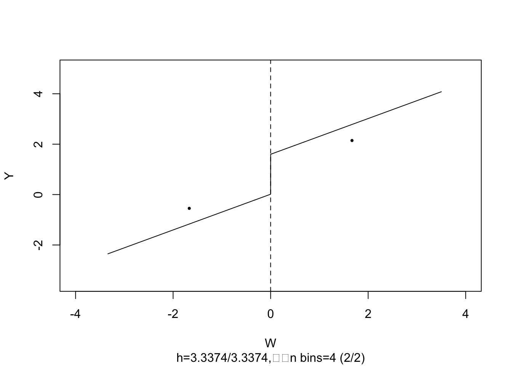


What if we used a SRDD instead, thereby ignoring the fact that treatment is not perfectly determined by the cutoff in $W$? We may get an impression of the consequences by estimating an SRDD using the previously simulated data.


```r
# estimate SRDD
data <- rdd_data(d$Y, 
                 d$W, 
                 cutpoint = 0)

srdd_mod <- rdd_reg_lm(rdd_object = data, 
                       slope = "same")
srdd_mod
#> ### RDD regression: parametric ###
#> 	Polynomial order:  1 
#> 	Slopes:  same 
#> 	Number of obs: 2000 (left: 999, right: 1001)
#> 
#> 	Coefficient:
#>   Estimate Std. Error t value  Pr(>|t|)    
#> D 1.585038   0.067756  23.393 < 2.2e-16 ***
#> ---
#> Signif. codes:  0 '***' 0.001 '**' 0.01 '*' 0.05 '.' 0.1 ' ' 1
```

The estimate obtained using a SRDD is suggestive of a substantial downward bias. In fact, this procedure is inconsistent for the true causal effect so increasing the sample would not alleviate the bias.

The book continues with a discussion of potential problems with quasi-experiments. As for all empirical studies, these potential problems are related to internal and external validity. This part is followed by a technical discussion of treatment effect estimation when the causal effect of treatment is heterogeneous in the population. We encourage you to work on these sections on your own.

#### Summary {-}

This chapter has introduced the concept of causal effects in randomized controlled experiments and quasi-experiments where variations in circumstances or accidents of nature are treated as sources of "as if" random assignment to treatment. We have also discussed methods that allow for consistent estimation of these effects in both settings. These included the *differences estimator*, the *differences-in-differences estimator* as well as *sharp* and *fuzzy regression discontinuity design* estimators. It was shown how to apply these estimation techniques in <tt>R</tt>.

In an empirical application we have shown how to replicate the results of the analysis of the STAR data presented in Chapter 13.3 of the book using <tt>R</tt>. This study uses a randomized controlled experiment to assess whether smaller classes improve students' performance on standardized tests. Being related to a randomized controlled experiment, the data of this study is fundamentally different to those used in the cross-section studies in Chapters \@ref(lrwor) to \@ref(nrf). We therefore have motivated usage of a *differences estimator*.

Chapter \@ref(attdfc) demonstrated how estimates of treatment effects can be obtained when the design of the study is a quasi-experiment that allows for *differences-in-differences* or *regression discontinuity design* estimators. In particular, we have introduced functions of the package <tt>rddtools</tt> that are convenient for estimation as well as graphical analysis when estimating a regression discontinuity design. 

## Exercises {#exercises-13}

The subsequent exercises guide you in reproducing some of the results presented in one of the most famous DID studies by @card1994. The authors use geography as the “as if” random treatment assignment to study the effect on employment in fast food restaurants caused by an increase in the state minimum wage in New Jersey in the year of 1992, see Chapter \@ref(qe). 

The study is based on survey data collected in February 1992 and in November 1992, after New Jersey's minimum wage rose by $\$0.80$ from $\$4.25$ to $\$5.05$ in April 1992.

Estimating the effect of the wage increase simply by computing the change in employment in New Jersey (as you are asked to do in Exercise 3) would fail to control for omitted variables. By using Pennsylvania as a control in a difference-in-differences (DID) model one can control for variables with a common influence on New Jersey (treatment group) and Pennsylvania (control group). This reduces the risk of omitted variable bias enormously and even works when these variables are unobserved. 

For the DID approach to work we must assume that New Jersey and Pennsylvania have parallel trends over time, i.e., we assume that the (unobserved) factors influence employment in Pennsylvania and New Jersey in the same manner. This allows to interpret an observed change in employment in Pennsylvania as the change New Jersey would have experienced if there was no increase in minimum wage (and vice versa). 

Against to what standard economic theory would suggest, the authors did not find evidence that the increased minimum wage induced an increase in unemployment in New Jersey using the DID approach: quite the contrary, their results suggest that the $\$0.80$ minimum wage increase in New Jersey led to a 2.75 full-time equivalent (FTE) increase in employment.


<div  class = "DCexercise">

#### 1. The Data from Card & Krueger (1994) {-}

<tt>fastfood.dat</tt>, the dataset used by Card & Krueger (1994) can be downloaded [here](http://www.stat.ucla.edu/projects/datasets/fastfood.dta). See this [link](http://www.stat.ucla.edu/projects/datasets/fastfood-explanation.html) for a detailed explanation of the variables.

This exercise asks you to import the dataset in <tt>R</tt> and to perform some formatting necessary for the subsequent analysis. This can be tedious using base <tt>R</tt> functions but is easily done using the <tt>dplyr</tt> package introducted in Chapter \@ref(aattggoe). 

The URL to the dataset is saved in <tt>data_URL</tt>.

**Instructions:**

- Attach the packages <tt>dplyr</tt> and <tt>foreign</tt>.

- Read in the dataset <tt>fastfood.dta</tt> using <tt>data_URL</tt> and assign it to a <tt>data.frame</tt> named <tt>dat</tt>.

In their study, Card & Krueger (1994) measure employment in full time equivalents which they define as the number of full time employees (<tt>empft</tt> and <tt>empft2</tt>) plus the number of managers (<tt>nmgrs</tt> and <tt>nmgrs2</tt>) plus 0.5 times the number part-time employees (<tt>emppt</tt> / <tt>emppt2</tt>). 
- Define full-time employment before (<tt>FTE</tt>) and after the wage increase (<tt>FTE2</tt>) and add both variables to <tt>dat</tt>

<iframe src="DCL/ex13_1.html" frameborder="0" scrolling="no" style="width:100%;height:340px"></iframe>

**Hints:**

- <tt>read.dta()</tt> from the <tt>foreign</tt> package reads <tt>.dta</tt> files, a format used by the statistical software package *STATA*.

- <tt>mutate()</tt> generates new columns using existing ones.

</div>


<div  class = "DCexercise"> 

#### 2. State Specific Estimates of Full-Time Employment --- I {-}

This exercise asks you to perform a quick calculation of state specific sample means in order to check whether our data on full-time employment is in alignment with the data used by Card & Krueger (1994).   

**Instructions:**

- Generate subsets of <tt>dat</tt> to seperate observations for New Jersey and Pennsylvania. Save them as <tt>dat_NJ</tt> and <tt>dat_PA</tt>. 

- Compute sample means of full-time employment equivalents for New Jersey and Pennsylvania both before and after the minium wage increase in New Jersey. It suffices if your code prints the correct values to the console.

<iframe src="DCL/ex13_2.html" frameborder="0" scrolling="no" style="width:100%;height:340px"></iframe>

**Hints:**

- You may use <tt>group_by()</tt> in conjunction with <tt>summarise()</tt> to compute groupwise means. Both function come with the <tt>dplyr</tt> package.

</div>


<div  class = "DCexercise"> 

#### 3. State Specific Estimates of Full-Time Employment --- II {-}
  
A naive approach to investigate the impact of the minimum wage increase on employment is to use the estimated difference in mean employment before and after the wage increase for New Jersey fast food restaurants.

This exercise asks you to do the aforementioned and further to test if the estimated difference is significantly different from zero using a *robust* $t$-test.

The subsets <tt>dat_NJ</tt> and <tt>dat_PA</tt> from the previous exercise are available in your working environment. 

**Instructions:**

- Use <tt>dat_NJ</tt> for a robust test of the hypothesis that there is no difference in full-time employment before and after the wage hike in New Jersey at the level of $5\%$.

<iframe src="DCL/ex13_3.html" frameborder="0" scrolling="no" style="width:100%;height:340px"></iframe>

**Hints:**

- The testing problem amounts to a two-sample $t$-test which is conveniently done using <tt>t.test()</tt>.

</div>


<div  class = "DCexercise"> 

#### 4. Preparing the Data for Regression {-}

The estimations done in Exercise 3 and the difference-in-differences approach we are working towards can be shown to produce the same results OLS applied to specific regression models, see Chapters \@ref(poceaie) and \@ref(aattggoe).

This exercise asks you to construct a dataset which is more convenient for this purpose than the dataset <tt>dat</tt>.

**Instructions:**

Generate the dataset <tt>reg_dat</tt> from <tt>dat</tt> in *long format*, i.e., make sure that for each restaurant (identified by <tt>sheet</tt>) one observation before and one after the minimum wage increase (identified by <tt>D</tt>) are included.

Only consider the following variables:

- <tt>id</tt>: sheet number (unique store id)

- <tt>chain</tt>: chain 1=Burger King; 2=KFC; 3=Roy Rogers; 4=Wendys

- <tt>state</tt>: 1 if New Jersey; 0 if Pennsylvania

- <tt>empl</tt>: measure of full-time employment (<tt>FTE</tt> / <tt>FTE2</tt>)

- <tt>D</tt>: dummy indicating if the observation was made before or after the minimum wage increase in New Jersey. 

<iframe src="DCL/ex13_4.html" frameborder="0" scrolling="no" style="width:100%;height:340px"></iframe>

**Hints:**

- The original dataset <tt>dat</tt> has 410 observations of 48 variables (check this using <tt>dim(dat)</tt>). The dataset <tt>reg_dat</tt> you are asked to generate must consist of 820 observations of the variables listed above.

- It is straightforward to generate a <tt>data.frame</tt> from the columns of another <tt>data.frame</tt> using <tt>data.frame(...)</tt>.

- Use <tt>rbind()</tt> to combine two objects of type <tt>data.frame</tt> by row. 

</div>


<div  class = "DCexercise">   

#### 5. A Difference Estimate using Data from Card & Krueger (1994) --- II {-}

<tt>reg_dat</tt> from Exercise 4 is a *panel dataset* as it has two observations for each fast food restaurant $i=1,\dots,410$, at time periods $t=0,1$.   

Thus we may write down the simple regression model 

$$employment_{i,t} = \beta_0 + \beta_1 D_t + \varepsilon_{i,t},$$

where $D_t$ is a dummy variable which equals $0$ if the observation was made before the minimum wage change ($t=0$) and $1$ after the minimum wage change ($t=1$), i.e.,

\begin{align*}
D_t = \begin{cases}
0, & \, \text{if $t=0$ (before wage change),} \\
1, & \, \text{if $t=1$ (after wage change)}
\end{cases}
\end{align*}

and assume that observations for *New Jersey restaurants only* are used in computing $\hat\beta_1$, the OLS estimator of $\beta_1$, which is also called the *differences estimator*. 

The dataset <tt>reg_dat</tt> from Exercise 4 and the New Jersey subset <tt>dat_NJ</tt> are available in your working environment.

**Instructions:**

- Estimate $\beta_1$ in the model above using OLS. Save the estimated model to <tt>emp_mod</tt>. 

- Obtain a robust summary of the results and interpret your findings.

<iframe src="DCL/ex13_5.html" frameborder="0" scrolling="no" style="width:100%;height:340px"></iframe>

**Hints:**

- Remember that dependencies of the <tt>AER</tt> package include functions for robust inference on regression models.

- The argument <tt>subset</tt> in <tt>lm()</tt> takes a logical vector which identifies observations used for estimation.

</div>


<div  class = "DCexercise">

#### 6. A Difference Estimate using Data from Card & Krueger (1994) --- II {-}

The estimate obtained using <tt>t.test()</tt> on the New Jersey subset in Exercise 3 and the OLS estimate of $\hat\beta_1$ in Exercise 5 are numercially the same. This also holds for the reported $t$-statistics if the same standard error formulas are used (<tt>t.test(..., var.equal = T)</tt> and <tt>coeftest(..., vcov. = vcovHC, type = "HC1")</tt>).

This exercise asks you to check that the above statement is true. 

The data from the previous exercises, the result of <tt>t.test(...)</tt> from Exercise 3 as well as the regression model object <tt>emp_mod</tt> from Exercise 5 are available in your working environment. The <tt>AER</tt> package has been attached.

*No submission correctness tests are run.*

**Instructions:**

- Check that the estimate of $\beta_1$ in Exercise 5 is equal to the estimated difference in mean employment of New Jersey fastfood restaurants before and after the minimum wage increase from Exercise 3. 

- Convince yourself that the $t$-statistics reported by <tt>coeftest(...)</tt> in Exercise 5 and <tt>t.test(...)</tt> in Exercise 3 match.

<iframe src="DCL/ex13_6.html" frameborder="0" scrolling="no" style="width:100%;height:340px"></iframe>

</div>


<div  class = "DCexercise">

#### 7. A Difference-in-Differences Estimate --- II {-}

As mentioned in Chapter \@ref(aattggoe), the approach discussed in Exercises 5 and 6 is naive: $\hat\beta_1$ is a biased estimate of the average effect of the minimum wage increase on employment because we cannot control for other determinants of employment that correlate with $D_t$. As an example, think about macro-economic developments which have a positive impact on the labor market such that employment is higher in the period after the minimum wage increase. It is likely that $D_t$ is positively correlated with the error term such that $\hat\beta_1$ *overestimates* the effect of the wage hike on employment.

This motivates usage of the difference-in-differences (DID) estimator outlined in Chapter \@ref(aattggoe).

Consider the liner regression model

$$employment_{i,t} = \beta_0 + \beta_1 D_t + \beta_2 state_i + \beta_3 (D_t \times state_i) + \varepsilon_{i,t},$$

where we use indices $i$ and $t$ just as in the simple regression model in Exercise 5. 
In this model, $\beta_3$ is the coefficient we are interested in as it is interpreted as the average difference in employment of New Jersey fastfood restaurants before and after the wage increase after controlling for unobservables which are common to New Jersey and Pennsylvania, the control group. The OLS estimator of $\beta_3$ is called a DID estimator. 

**Instructions:**

- Estimate the above model using OLS and obtain a robust summary.

- Interpret your findings.

<iframe src="DCL/ex13_7.html" frameborder="0" scrolling="no" style="width:100%;height:340px"></iframe>

</div>

<!--chapter:end:13-ch13.Rmd-->

# Introduction to Time Series Regression and Forecasting {#ittsraf}


Time series data is collected for a single entity over time. This is fundamentally different from cross-section data which is data on multiple entities at the same point in time. Time series data allows estimation of the effect on $Y$ of a change in $X$ *over time*. This is what econometricians call a *dynamic causal effect*. Let us go back to the application to cigarette consumption of Chapter \@ref(ivr) where we were interested in estimating the effect on cigarette demand of a price increase caused by a raise of the general sales tax. One might use time series data to assess the causal effect of a tax increase on smoking both initially and in subsequent periods.

Another application of time series data is forecasting. For example, weather services use time series data to predict tomorrow's temperature by, inter alia, using today's temperature and temperatures of the past. To motivate an economic example, central banks are interested in forecasting next month's unemployment rates.

The remaining chapters in the book deal with econometric techniques for analyzing time series data, as well as their applications in forecasting and estimating dynamic causal effects. This section covers the basic concepts presented in Chapter 14 of the book, explains how to visualize time series data and demonstrates how to estimate simple autoregressive models, where the regressors are past values of the dependent variable or other variables. In this context we also discuss the concept of stationarity, an important property which has far-reaching consequences. 

Most empirical applications in this chapter are concerned with forecasting and use data on U.S. macroeconomic indicators or financial time series like Gross Domestic Product (GDP), the unemployment rate or excess stock returns.

The following packages and their dependencies are needed for reproduction of the code chunks presented throughout this chapter:

+ <tt>AER</tt> [@R-AER]
+ <tt>dynlm</tt> [@R-dynlm]
+ <tt>forecast</tt> [@R-forecast]
+ <tt>readxl</tt> [@R-readxl]
+ <tt>stargazer</tt> [@R-stargazer]
+ <tt>scales</tt> [@R-scales]
+ <tt>quantmod</tt> [@R-quantmod]
+ <tt>urca</tt> [@R-urca]

Please verify that the following code chunk runs on your machine without any errors.


```r
library(AER)
library(dynlm)
library(forecast)
library(readxl)
library(stargazer)
library(scales)
library(quantmod)
library(urca)
```

## Using Regression Models for Forecasting

What is the difference between estimating models for assessment of causal effects and forecasting? Consider again the simple example of estimating the causal effect of the student-teacher ratio on test scores introduced in Chapter \@ref(lrwor).


```r
library(AER)
data(CASchools)   
CASchools$STR <- CASchools$students/CASchools$teachers       
CASchools$score <- (CASchools$read + CASchools$math)/2

mod <- lm(score ~ STR, data = CASchools)
mod
#> 
#> Call:
#> lm(formula = score ~ STR, data = CASchools)
#> 
#> Coefficients:
#> (Intercept)          STR  
#>      698.93        -2.28
```

As has been stressed in Chapter \@ref(rmwmr), the estimate of the coefficient on the student-teacher ratio does not have a causal interpretation due to omitted variable bias. However, in terms of deciding which school to send her child to, it might nevertheless be appealing for a parent to use <tt>mod</tt> for forecasting test scores in schooling districts where no public data on scores are available.

As an example, assume that the average class in a district has $25$ students. This is not a perfect forecast but the following one-liner might be helpful for the parent to decide.


```r
predict(mod, newdata = data.frame("STR" = 25))
#>        1 
#> 641.9377
```

In a time series context, the parent could use data on present and past years test scores to forecast next year's test scores --- a typical application for an autoregressive model.

## Time Series Data and Serial Correlation {#tsdasc}

GDP is commonly defined as the total value of goods and services produced during a given time period. The dataset us_macro_quarterly.xlsx, provided by the authors, can be downloaded [here](http://wps.pearsoned.co.uk/wps/media/objects/16103/16489878/data3eu/us_macro_quarterly.xlsx). It contains quarterly data on U.S. real GDP (i.e., inflation-adjusted) from 1947 to 2004.

As before, a good starting point is to plot the data. The package <tt>quantmod</tt> provides some convenient functions for plotting and computing with time series data. We also load the package <tt>readxl</tt> to read the data into <tt>R</tt>.


```r
# attach the package 'quantmod'
library(quantmod)
library(readxl)
```

We begin by importing the data set.


```r
# load US macroeconomic data
USMacroSWQ <- read_xlsx("Data/us_macro_quarterly.xlsx",
                         sheet = 1,
                         col_types = c("text", rep("numeric", 9)))

# format date column
USMacroSWQ$...1 <- as.yearqtr(USMacroSWQ$...1, format = "%Y:0%q")

# adjust column names
colnames(USMacroSWQ) <- c("Date", "GDPC96", "JAPAN_IP", "PCECTPI", 
                          "GS10", "GS1", "TB3MS", "UNRATE", "EXUSUK", "CPIAUCSL")
```

The first column of <tt>us_macro_quarterly.xlsx</tt> contains text and the remaining ones are numeric. Using <tt>col_types = c("text", rep("numeric", 9))</tt>, we instruct <tt>read_xlsx()</tt> to consider this format when importing the data.

It is useful to work with time-series objects that keep track of the frequency of the data and are extensible. In what follows we will use objects of the class <tt>xts</tt>, see `?xts`. Since the data in <tt>USMacroSWQ</tt> are in quarterly frequency we convert the first column to <tt>yearqtr</tt> format before generating the <tt>xts</tt> object <tt>GDP</tt>.


```r
# GDP series as xts object
GDP <- xts(USMacroSWQ$GDPC96, USMacroSWQ$Date)["1960::2013"]

# GDP growth series as xts object
GDPGrowth <- xts(400 * log(GDP/lag(GDP)))
```

The following code chunks reproduce Figure 14.1 of the book.


```r
# reproduce Figure 14.1 (a) of the book
plot(log(as.zoo(GDP)),
     col = "steelblue",
     lwd = 2,
     ylab = "Logarithm",
     xlab = "Date",
     main = "U.S. Quarterly Real GDP")
```


```r
# reproduce Figure 14.1 (b) of the book
plot(as.zoo(GDPGrowth),
     col = "steelblue",
     lwd = 2,
     ylab = "Logarithm",
     xlab = "Date",
     main = "U.S. Real GDP Growth Rates")
```


### Notation, Lags, Differences, Logarithms and Growth Rates {-}

For observations of a variable $Y$ recorded over time, $Y_t$ denotes the value observed at time $t$. The period between two sequential observations $Y_t$ and $Y_{t-1}$ is a unit of time: hours, days, weeks, months, quarters, years etc. Key Concept 14.1 introduces the essential terminology and notation for time series data we use in the subsequent sections.


<div class = "keyconcept" id="KC14.1">
<h3 class = "right"> Key Concept 14.1 </h3>
<h3 class = "left"> Lags, First Differences, Logarithms and Growth Rates </h3>

- Previous values of a time series are called *lags*. The first lag of $Y_t$ is $Y_{t-1}$. The $j^{th}$ lag of $Y_t$ is $Y_{t-j}$. In <tt>`r ttcode("R")`</tt>, lags of univariate or multivariate time series objects are conveniently computed by <tt>lag()</tt>, see <tt>?lag</tt>.

- Sometimes we work with a differenced series. The first difference of a series is $\Delta Y_{t} = Y_t - Y_{t-1}$, the difference between periods $t$ and $t-1$. If <tt>Y</tt> is a time series, the series of first differences is computed as <tt>diff(Y)</tt>.

- It may be convenient to work with the first difference in logarithms of a series. We denote this by $\Delta \log(Y_t) = \log(Y_t) - \log(Y_{t-1})$. For a time series <tt>Y</tt>, this is obtained using <tt>log(Y/lag(Y))</tt>. 

- $100 \Delta \log (Y_t)$ is an approximation for the percentage change between $Y_t$ and $Y_{t-1}$.

</div>


The definitions made in Key Concept 14.1 are useful because of two properties that are common to many economic time series:

- Exponential growth: some economic series grow approximately exponentially such that their logarithm is approximately linear.

- The standard deviation of many economic time series is approximately proportional to their level. Therefore, the standard deviation of the logarithm of such a series is approximately constant.

Furthermore, it is common to report growth rates in macroeconomic series which is why $\log$-differences are often used. 

Table 14.1 of the book presents the quarterly U.S. GDP time series, its logarithm, the annualized growth rate and the first lag of the annualized growth rate series for the period 2012:Q1 - 2013:Q1. The following simple function can be used to compute these quantities for a quarterly time series <tt>series</tt>.


```r
# compute logarithms, annual growth rates and 1st lag of growth rates
quants <- function(series) {
  s <- series
  return(
    data.frame("Level" = s,
               "Logarithm" = log(s),
               "AnnualGrowthRate" = 400 * log(s / lag(s)),
               "1stLagAnnualGrowthRate" = lag(400 * log(s / lag(s))))
    )
}
```

The annual growth rate is computed using the approximation $$Annual Growth Y_t = 400 \cdot\Delta\log(Y_t)$$ since $100\cdot\Delta\log(Y_t)$ is an approximation of the quarterly percentage changes, see Key Concept 14.1.

We call <tt>quants()</tt> on observations for the period 2011:Q3 - 2013:Q1.


```r
# obtain a data.frame with level, logarithm, annual growth rate and its 1st lag of GDP
quants(GDP["2011-07::2013-01"])
#>            Level Logarithm AnnualGrowthRate X1stLagAnnualGrowthRate
#> 2011 Q3 15062.14  9.619940               NA                      NA
#> 2011 Q4 15242.14  9.631819        4.7518062                      NA
#> 2012 Q1 15381.56  9.640925        3.6422231               4.7518062
#> 2012 Q2 15427.67  9.643918        1.1972004               3.6422231
#> 2012 Q3 15533.99  9.650785        2.7470216               1.1972004
#> 2012 Q4 15539.63  9.651149        0.1452808               2.7470216
#> 2013 Q1 15583.95  9.653997        1.1392015               0.1452808
```

#### Autocorrelation {-}

Observations of a time series are typically correlated. This type of correlation is called *autocorrelation* or *serial correlation*. Key Concept 14.2 summarizes the concepts of population autocovariance and population autocorrelation and shows how to compute their sample equivalents.


<div class = "keyconcept" id="KC14.2">
<h3 class = "right"> Key Concept 14.2 </h3>
<h3 class = "left"> Autocorrelation and Autocovariance </h3>

The covariance between $Y_t$ and its $j^{th}$ lag, $Y_{t-j}$, is called the $j^{th}$ *autocovariance* of the series $Y_t$. The $j^{th}$ *autocorrelation coefficient*, also called the *serial correlation coefficient*, measures the correlation between $Y_t$ and $Y_{t-j}$.

We thus have
\begin{align*}
  j^{th} \text{autocovariance} =& \, Cov(Y_t,Y_{t-j}), \\
  j^{th} \text{autocorrelation} = \rho_j =& \, \rho_{Y_t,Y_{t-j}} = \frac{Cov(Y_t,Y_{t-j)}}{\sqrt{Var(Y_t)Var(Y_{t-j})}}.
\end{align*}

Population autocovariance and population autocorrelation can be estimated by $\widehat{Cov(Y_t,Y_{t-j})}$, the sample autocovariance, and $\widehat{\rho}_j$, the sample autocorrelation:

\begin{align*}
  \widehat{Cov(Y_t,Y_{t-j})} =& \, \frac{1}{T} \sum_{t=j+1}^T (Y_t - \overline{Y}_{j+1:T})(Y_{t-j} - \overline{Y}_{1:T-j}), \\
  \widehat{\rho}_j =& \, \frac{\widehat{Cov(Y_t,Y_{t-j})}}{\widehat{Var(Y_t)}}
\end{align*}

$\overline{Y}_{j+1:T}$ denotes the average of $Y_{j+1}, Y{j+2}, \dots, Y_T$.

In <tt>R</tt> the function <tt>acf()</tt> from the package <tt>stats</tt> computes the sample autocovariance or the sample autocorrelation function.

</div>


Using <tt>acf()</tt> it is straightforward to compute the first four sample autocorrelations of the series <tt>GDPGrowth</tt>.


```r
acf(na.omit(GDPGrowth), lag.max = 4, plot = F)
#> 
#> Autocorrelations of series 'na.omit(GDPGrowth)', by lag
#> 
#>  0.00  0.25  0.50  0.75  1.00 
#> 1.000 0.352 0.273 0.114 0.106
```

This is evidence that there is mild positive autocorrelation in the growth of GDP: if GDP grows faster than average in one period, there is a tendency for it to grow faster than average in the following periods.

#### Other Examples of Economic Time Series {-}

Figure 14.2 of the book presents four plots: the U.S. unemployment rate, the U.S. Dollar / British Pound exchange rate, the logarithm of the Japanese industrial production index as well as daily changes in the Wilshire 5000 stock price index, a financial time series. The next code chunk reproduces the plots of the three macroeconomic series and adds percentage changes in the daily values of the New York Stock Exchange Composite index as a fourth one (the data set <tt>NYSESW</tt> comes with the <tt>AER</tt> package).


```r
# define series as xts objects
USUnemp <- xts(USMacroSWQ$UNRATE, USMacroSWQ$Date)["1960::2013"]

DollarPoundFX <- xts(USMacroSWQ$EXUSUK, USMacroSWQ$Date)["1960::2013"]
  
JPIndProd <- xts(log(USMacroSWQ$JAPAN_IP), USMacroSWQ$Date)["1960::2013"]

# attach NYSESW data
data("NYSESW")  
NYSESW <- xts(Delt(NYSESW))
```


```r
# divide plotting area into 2x2 matrix
par(mfrow = c(2, 2))

# plot the series
plot(as.zoo(USUnemp),
     col = "steelblue",
     lwd = 2,
     ylab = "Percent",
     xlab = "Date",
     main = "US Unemployment Rate",
     cex.main = 1)

plot(as.zoo(DollarPoundFX),
     col = "steelblue",
     lwd = 2,
     ylab = "Dollar per pound",
     xlab = "Date",
     main = "U.S. Dollar / B. Pound Exchange Rate",
     cex.main = 1)

plot(as.zoo(JPIndProd),
     col = "steelblue",
     lwd = 2,
     ylab = "Logarithm",
     xlab = "Date",
     main = "Japanese Industrial Production",
     cex.main = 1)

plot(as.zoo(NYSESW),
     col = "steelblue",
     lwd = 2,
     ylab = "Percent per Day",
     xlab = "Date",
     main = "New York Stock Exchange Composite Index",
     cex.main = 1)
```


The series show quite different characteristics. The unemployment rate increases during recessions and declines during economic recoveries and growth. The Dollar/Pound exchange rates shows a deterministic pattern until the end of the Bretton Woods system. Japan's industrial production exhibits an upward trend and decreasing growth. Daily changes in the New York Stock Exchange composite index seem to fluctuate randomly around the zero line. The sample autocorrelations support this conjecture.


```r
# compute sample autocorrelation for the NYSESW series
acf(na.omit(NYSESW), plot = F, lag.max = 10)
#> 
#> Autocorrelations of series 'na.omit(NYSESW)', by lag
#> 
#>      0      1      2      3      4      5      6      7      8      9     10 
#>  1.000  0.040 -0.016 -0.023  0.000 -0.036 -0.027 -0.059  0.013  0.017  0.004
```

The first 10 sample autocorrelation coefficients are very close to zero. The default plot generated by `acf()` provides further evidence.


```r
# plot sample autocorrelation for the NYSESW series
acf(na.omit(NYSESW), main = "Sample Autocorrelation for NYSESW Data")
```


The blue dashed bands represent values beyond which the autocorrelations are significantly different from zero at $5\%$ level. Even when the true autocorrelations are zero, we need to expect a few exceedences --- recall the definition of a type-I-error from Key Concept 3.5.
For most lags we see that the sample autocorrelation does not exceed the bands and there are only a few cases that lie marginally beyond the limits.

Furthermore, the <tt>NYSESW</tt> series exhibits what econometricians call *volatility clustering*: there are periods of high and periods of low variance. This is common for many financial time series.

## Autoregressions

Autoregressive models are heavily used in economic forecasting. An autoregressive model relates a time series variable to its past values. This section discusses the basic ideas of autoregressions models, shows how they are estimated and discusses an application to forecasting GDP growth using <tt>R</tt>.

#### The First-Order Autoregressive Model {-}

It is intuitive that the immediate past of a variable should have power to predict its near future. The simplest autoregressive model uses only the most recent outcome of the time series observed to predict future values. For a time series $Y_t$ such a model is called a first-order autoregressive model, often abbreviated AR(1), where the 1 indicates that the order of autoregression is one:
\begin{align*}
  Y_t = \beta_0 + \beta_1 Y_{t-1} + u_t
\end{align*}
is the AR(1) population model of a time series $Y_t$.

For the GDP growth series, an autoregressive model of order one uses only the information on GDP growth observed in the last quarter to predict a future growth rate. The first-order autoregression model of GDP growth can be estimated by computing OLS estimates in the regression of $GDPGR_t$ on $GDPGR_{t-1}$,
\begin{align}
  \widehat{GDPGR}_t = \hat\beta_0 + \hat\beta_1  GDPGR_{t-1}. (\#eq:GDPGRAR1)
\end{align}
Following the book we use data from 1962 to 2012 to estimate \@ref(eq:GDPGRAR1). This is easily done with the function <tt>ar.ols()</tt> from the package <tt>stats</tt>.


```r
# subset data
GDPGRSub <- GDPGrowth["1962::2012"]

# estimate the model
ar.ols(GDPGRSub, 
       order.max = 1, 
       demean = F, 
       intercept = T)
#> 
#> Call:
#> ar.ols(x = GDPGRSub, order.max = 1, demean = F, intercept = T)
#> 
#> Coefficients:
#>      1  
#> 0.3384  
#> 
#> Intercept: 1.995 (0.2993) 
#> 
#> Order selected 1  sigma^2 estimated as  9.886
```

We can check that the computations done by <tt>ar.ols()</tt> are the same as done by <tt>lm()</tt>. 


```r
# length of data set
N <-length(GDPGRSub)

GDPGR_level <- as.numeric(GDPGRSub[-1])
GDPGR_lags <- as.numeric(GDPGRSub[-N])

# estimate the model
armod <- lm(GDPGR_level ~ GDPGR_lags)
armod
#> 
#> Call:
#> lm(formula = GDPGR_level ~ GDPGR_lags)
#> 
#> Coefficients:
#> (Intercept)   GDPGR_lags  
#>      1.9950       0.3384
```

As usual, we may use <tt>coeftest()</tt> to obtain a robust summary on the estimated regression coefficients.


```r
# robust summary
coeftest(armod, vcov. = vcovHC, type = "HC1")
#> 
#> t test of coefficients:
#> 
#>             Estimate Std. Error t value  Pr(>|t|)    
#> (Intercept) 1.994986   0.351274  5.6793 4.691e-08 ***
#> GDPGR_lags  0.338436   0.076188  4.4421 1.470e-05 ***
#> ---
#> Signif. codes:  0 '***' 0.001 '**' 0.01 '*' 0.05 '.' 0.1 ' ' 1
```

Thus the estimated model is
\begin{align}
  \widehat{GDPGR}_t = \underset{(0.351)}{1.995} + \underset{(0.076)}{0.338} GDPGR_{t-1} (\#eq:gdpgrar1).
\end{align}

We omit the first observation for $GDPGR_{1962 \ Q1}$ from the vector of the dependent variable since $GDPGR_{1962 \ Q1 - 1} = GDPGR_{1961 \ Q4}$, is not included in the sample. Similarly, the last observation, $GDPGR_{2012 \ Q4}$, is excluded from the predictor vector since the data does not include $GDPGR_{2012 \ Q4 + 1} = GDPGR_{2013 \ Q1}$. Put differently, when estimating the model, one observation is lost because of the time series structure of the data.

#### Forecasts and Forecast Errors {-}

Suppose $Y_t$ follows an AR(1) model with an intercept and that you have an OLS estimate of the model on the basis of observations for $T$ periods. Then you may use the AR(1) model to obtain $\widehat{Y}_{T+1\vert T}$, a forecast for $Y_{T+1}$ using data up to period $T$ where
\begin{align*}
  \widehat{Y}_{T+1\vert T} = \hat{\beta}_0 + \hat{\beta}_1 Y_T.
\end{align*}

The forecast error is
\begin{align*}
  \text{Forecast error} = Y_{T+1} - \widehat{Y}_{T+1\vert T}.
\end{align*}

#### Forecasts and Forecasted Values {-}

Forecasted values of $Y_t$ are *not* what we refer to as *OLS predicted values* of $Y_t$. Also, the forecast error is *not* an OLS residual. Forecasts and forecast errors are obtained using *out-of-sample* values while predicted values and residuals are computed for *in-sample* values that were actually observed and used in estimating the model.

The root mean squared forecast error (RMSFE) measures the typical size of the forecast error and is defined as
\begin{align*}
  RMSFE = \sqrt{E\left[\left(Y_{T+1} - \widehat{Y}_{T+1\vert T}\right)^2\right]}.
\end{align*}

The $RMSFE$ is composed of the future errors $u_t$ and the error made when estimating the coefficients. When the sample size is large, the former may be much larger than the latter so that $RMSFE \approx \sqrt{Var()u_t}$ which can be estimated by the standard error of the regression.

#### Application to GDP Growth {-}

Using \@ref(eq:gdpgrar1), the estimated AR(1) model of GDP growth, we perform the forecast for GDP growth for 2013:Q1 (remember that the model was estimated using data for periods 1962:Q1 - 2012:Q4, so 2013:Q1 is an out-of-sample period). Plugging $GDPGR_{2012:Q4} \approx 0.15$ into \@ref(eq:gdpgrar1),

\begin{align*}
  \widehat{GDPGR}_{2013:Q1} = 1.995 + 0.348 \cdot 0.15 = 2.047.
\end{align*}

The function <tt>forecast()</tt> from the <tt>forecast</tt> package has some useful features for forecasting time series data.


```r
library(forecast)

# assign GDP growth rate in 2012:Q4
new <- data.frame("GDPGR_lags" = GDPGR_level[N-1])

# forecast GDP growth rate in 2013:Q1
forecast(armod, newdata = new)
#>   Point Forecast     Lo 80    Hi 80     Lo 95    Hi 95
#> 1       2.044155 -2.036225 6.124534 -4.213414 8.301723
```

Using <tt>forecast()</tt>produces the same point forecast of about 2.0, along with $80\%$ and $95\%$ forecast intervals, see section \@ref(apatadlm). We conclude that our AR(1) model forecasts GDP growth to be $2\%$ in 2013:Q1.

How accurate is this forecast? The forecast error is quite large: $GDPGR_{2013:Q1} \approx 1.1\%$ while our forecast is $2\%$.
Second, by calling `summary(armod)` shows that the model explains only little of the variation in the growth rate of GDP and the $SER$ is about $3.16$. Leaving aside forecast uncertainty due to estimation of the model coefficients $\beta_0$ and $\beta_1$, the $RMSFE$ must be at least $3.16\%$, the estimate of the standard deviation of the errors. We conclude that this forecast is pretty inaccurate.


```r
# compute the forecast error
forecast(armod, newdata = new)$mean - GDPGrowth["2013"][1]
#>                 x
#> 2013 Q1 0.9049532

# R^2
summary(armod)$r.squared
#> [1] 0.1149576

# SER
summary(armod)$sigma
#> [1] 3.15979
```

### Autoregressive Models of Order $p$ {-}

For forecasting GDP growth, the AR($1$) model \@ref(eq:gdpgrar1) disregards any information in the past of the series that is more distant than one period. An AR($p$) model incorporates the information of $p$ lags of the series. The idea is explained in Key Concept 14.3.


<div class = "keyconcept" id="KC14.3">
<h3 class = "right"> Key Concept 14.3 </h3>
<h3 class = "left"> Autoregressions </h3>
<p>
An AR($p$) model assumes that a time series $Y_t$ can be modeled by a linear function of the first $p$ of its lagged values.
\begin{align*}
  Y_t = \beta_0 + \beta_1 Y_{t-1} + \beta_2 Y_{t-2} + \dots + \beta_p Y_{t-p} + u_t
\end{align*}
is an autoregressive model of order $p$ where $E(u_t\vert Y_{t-1}, Y_{t-2}, \dots,Y_{t-p})=0$.
</p>
</div>


Following the book, we estimate an AR($2$) model of the GDP growth series from 1962:Q1 to 2012:Q4.


```r
# estimate the AR(2) model
GDPGR_AR2 <- dynlm(ts(GDPGR_level) ~ L(ts(GDPGR_level)) + L(ts(GDPGR_level), 2))

coeftest(GDPGR_AR2, vcov. = sandwich)
#> 
#> t test of coefficients:
#> 
#>                       Estimate Std. Error t value  Pr(>|t|)    
#> (Intercept)           1.631747   0.402023  4.0588 7.096e-05 ***
#> L(ts(GDPGR_level))    0.277787   0.079250  3.5052 0.0005643 ***
#> L(ts(GDPGR_level), 2) 0.179269   0.079951  2.2422 0.0260560 *  
#> ---
#> Signif. codes:  0 '***' 0.001 '**' 0.01 '*' 0.05 '.' 0.1 ' ' 1
```

The estimation yields
\begin{align}
  \widehat{GDPGR}_t = \underset{(0.40)}{1.63} + \underset{(0.08)}{0.28} GDPGR_{t-1} + \underset{(0.08)}{0.18} GDPGR_{t-1}. (\#eq:GDPGRAR2)
\end{align}
We see that the coefficient on the second lag is significantly different from zero. The fit improves slightly: $\bar{R}^2$ grows from $0.11$ for the AR($1$) model to about $0.14$ and the $SER$ reduces to $3.13$.


```r
# R^2
summary(GDPGR_AR2)$r.squared
#> [1] 0.1425484

# SER
summary(GDPGR_AR2)$sigma
#> [1] 3.132122
```

We may use the AR($2$) model to obtain a forecast for GDP growth in 2013:Q1 in the same manner as for the AR(1) model.


```r
# AR(2) forecast of GDP growth in 2013:Q1 
forecast <- c("2013:Q1" = coef(GDPGR_AR2) %*% c(1, GDPGR_level[N-1], GDPGR_level[N-2]))
```

This leads to a forecast error of roughly $-1\%$.


```r
# compute AR(2) forecast error 
GDPGrowth["2013"][1] - forecast
#>                 x
#> 2013 Q1 -1.025358
```

## Can You Beat the Market? (Part I) {#cybtmpi}

The theory of efficient capital markets states that stock prices embody all currently available information. If this hypothesis holds, it should not be possible to estimate a useful model for forecasting future stock returns using publicly available information on past returns (this is also referred to as the weak-form efficiency hypothesis): if it was possible to forecast the market, traders would be able to arbitrage, e.g., by relying on an AR($2$) model, they would use information that is not already priced-in which would push prices until the expected return is zero.

This idea is presented in the box *Can You Beat the Market? (Part I)* on p. 582 of the book. This section reproduces the estimation results.

We start by importing monthly data from 1931:1 to 2002:12 on excess returns of a broad-based index of stock prices, the CRSP value-weighted index. The data are provided by the authors of the book as an excel sheet which can be downloaded [here](https://wps.pearsoned.com/wps/media/objects/11422/11696965/data3eu/Stock_Returns_1931_2002.xlsx).


```r
# read in data on stock returns
SReturns <- read_xlsx("Data/Stock_Returns_1931_2002.xlsx",
                      sheet = 1,
                      col_types = "numeric")
```


```r
#Alternatively, ASC  cen be read directly from internet.

SReturns <- read.csv("https://www.princeton.edu/~mwatson/Stock-Watson_3u/Students/EE_Datasets/Stock_Returns_1931_2002.asc", sep = "\t", header = FALSE )

colnames(SReturns) <- c( "Year", "Month", "ExReturn", "ln_DivYield" )
```

We continue by converting the data to an object of class <tt>ts</tt>.


```r
# convert to ts object
StockReturns <- ts(SReturns[, 3:4], 
                   start = c(1931, 1), 
                   end = c(2002, 12), 
                   frequency = 12)
```

Next, we estimate AR($1$), AR($2$) and AR($4$) models of excess returns for the time period 1960:1 to 2002:12.


```r
# estimate AR models:

# AR(1)
SR_AR1 <- dynlm(ExReturn ~ L(ExReturn), 
      data = StockReturns, start = c(1960, 1), end = c(2002, 12))

# AR(2)
SR_AR2 <- dynlm(ExReturn ~ L(ExReturn) + L(ExReturn, 2), 
      data = StockReturns, start = c(1960, 1), end = c(2002, 12))

# AR(4)
SR_AR4 <- dynlm(ExReturn ~ L(ExReturn) + L(ExReturn, 1:4), 
      data = StockReturns, start = c(1960, 1), end = c(2002, 12))
```

After computing robust standard errors, we gather the results in a table generated by <tt>stargazer()</tt>.


```r
# compute robust standard errors
rob_se <- list(sqrt(diag(sandwich(SR_AR1))),
               sqrt(diag(sandwich(SR_AR2))),
               sqrt(diag(sandwich(SR_AR4))))
```


```r
# generate table using 'stargazer()'
stargazer(SR_AR1, SR_AR2, SR_AR4,
  title = "Autoregressive Models of Monthly Excess Stock Returns",
  header = FALSE, 
  model.numbers = F,
  omit.table.layout = "n",
  digits = 3, 
  column.labels = c("AR(1)", "AR(2)", "AR(4)"),
  dep.var.caption  = "Dependent Variable: Excess Returns on the CSRP Value-Weighted Index",
  dep.var.labels.include = FALSE,
  covariate.labels = c("$excess return_{t-1}$", "$excess return_{t-2}$", 
                       "$excess return_{t-3}$", "$excess return_{t-4}$", 
                       "Intercept"),
  se = rob_se,
  omit.stat = "rsq") 
```

preserveeba50b02eb0cc43a


The results are consistent with the hypothesis of efficient financial markets: there are no statistically significant coefficients in any of the estimated models and the hypotheses that all coefficients are zero cannot be rejected. $\bar{R}^2$ is almost zero in all models and even negative for the AR($4$) model. This suggests that none of the models are useful for forecasting stock returns.

## Additional Predictors and The ADL Model {#apatadlm}

Instead of only using the dependent variable's lags as predictors, an autoregressive distributed lag (ADL) model also uses lags of other variables for forecasting. The general ADL model is summarized in Key Concept 14.4:


<div class = "keyconcept" id="KC14.4">
<h3 class = "right"> Key Concept 14.4 </h3>
<h3 class = "left"> The Autoregressive Distributed Lag Model </h3>
<p>
An ADL($p$,$q$) model assumes that a time series $Y_t$ can be represented by a linear function of $p$ of its lagged values and $q$ lags of another time series $X_t$:
\begin{align*}
  Y_t =& \, \beta_0 + \beta_1 Y_{t-1} + \beta_2 Y_{t-2} + \dots + \beta_p Y_{t-p} \\ 
      &+ \, \delta_1 X_{t-1} + \delta_2 X_{t-2} + \dots + \delta_q X_{t-q} + u_t.
\end{align*}
is an *autoregressive distributed lag model* with $p$ lags of $Y_t$ and $q$ lags of $X_t$ where $$E(u_t\vert Y_{t-1}, Y_{t-2}, \dots, X_{t-1}, X_{t-2}, \dots)=0.$$
</p>
</div>


#### Forecasting GDP Growth Using the Term Spread {-}

Interest rates on long-term and short term treasury bonds are closely linked to macroeconomic conditions. While interest rates on both types of bonds have the same long-run tendencies, they behave quite differently in the short run.
The difference in interest rates of two bonds with distinct maturity is called the *term spread*. 

The following code chunks reproduce Figure 14.3 of the book which displays interest rates of 10-year U.S. Treasury bonds and 3-month U.S. Treasury bills from 1960 to 2012.


```r
# 3-month Treasury bills interest rate
TB3MS <- xts(USMacroSWQ$TB3MS, USMacroSWQ$Date)["1960::2012"]

# 10-year Treasury bonds interest rate
TB10YS <- xts(USMacroSWQ$GS10, USMacroSWQ$Date)["1960::2012"]

# term spread
TSpread <- TB10YS - TB3MS
```


```r
# reproduce Figure 14.2 (a) of the book
plot(merge(as.zoo(TB3MS), as.zoo(TB10YS)), 
     plot.type = "single", 
     col = c("darkred", "steelblue"),
     lwd = 2,
     xlab = "Date",
     ylab = "Percent per annum",
     main = "Interest Rates")

# define function that transform years to class 'yearqtr'
YToYQTR <- function(years) {
  return(
      sort(as.yearqtr(sapply(years, paste, c("Q1", "Q2", "Q3", "Q4"))))
  )
}

# recessions
recessions <- YToYQTR(c(1961:1962, 1970, 1974:1975, 1980:1982, 1990:1991, 2001, 2007:2008))
          
# add color shading for recessions
xblocks(time(as.zoo(TB3MS)), 
        c(time(TB3MS) %in% recessions), 
        col = alpha("steelblue", alpha = 0.3))

# add a legend
legend("topright", 
       legend = c("TB3MS", "TB10YS"),
       col = c("darkred", "steelblue"),
       lwd = c(2, 2))
```


```r

# reproduce Figure 14.2 (b) of the book
plot(as.zoo(TSpread), 
     col = "steelblue",
     lwd = 2,
     xlab = "Date",
     ylab = "Percent per annum",
     main = "Term Spread")

# add color shading for recessions
xblocks(time(as.zoo(TB3MS)), 
        c(time(TB3MS) %in% recessions), 
        col = alpha("steelblue", alpha = 0.3))
```


Before recessions, the gap between interest rates on long-term bonds and short term bills narrows and consequently the term spread declines drastically towards zero or even becomes negative in times of economic stress. This information might be used to improve GDP growth forecasts of future.

We check this by estimating an ADL($2$, $1$) model and an ADL($2$, $2$) model of the GDP growth rate using lags of GDP growth and lags of the term spread as regressors. We then use both models for forecasting GDP growth in 2013:Q1.


```r
# convert growth and spread series to ts objects
GDPGrowth_ts <- ts(GDPGrowth, 
                  start = c(1960, 1), 
                  end = c(2013, 4), 
                  frequency = 4)

TSpread_ts <- ts(TSpread, 
                start = c(1960, 1), 
                end = c(2012, 4), 
                frequency = 4)

# join both ts objects
ADLdata <- ts.union(GDPGrowth_ts, TSpread_ts)
```


```r
# estimate the ADL(2,1) model of GDP growth
GDPGR_ADL21 <- dynlm(GDPGrowth_ts ~ L(GDPGrowth_ts) + L(GDPGrowth_ts, 2) + L(TSpread_ts), 
      start = c(1962, 1), end = c(2012, 4))

coeftest(GDPGR_ADL21, vcov. = sandwich)
#> 
#> t test of coefficients:
#> 
#>                    Estimate Std. Error t value Pr(>|t|)   
#> (Intercept)        0.954990   0.486976  1.9611 0.051260 . 
#> L(GDPGrowth_ts)    0.267729   0.082562  3.2428 0.001387 **
#> L(GDPGrowth_ts, 2) 0.192370   0.077683  2.4763 0.014104 * 
#> L(TSpread_ts)      0.444047   0.182637  2.4313 0.015925 * 
#> ---
#> Signif. codes:  0 '***' 0.001 '**' 0.01 '*' 0.05 '.' 0.1 ' ' 1
```

The estimated equation of the ADL($2$, $1$) model is
\begin{align}
  \widehat{GDPGR}_t = \underset{(0.49)}{0.96} + \underset{(0.08)}{0.26} GDPGR_{t-1} + \underset{(0.08)}{0.19} GDPGR_{t-2} + \underset{(0.18)}{0.44} TSpread_{t-1} (\#eq:gdpgradl21)
\end{align}

All coefficients are significant at the level of $5\%$.


```r
# 2012:Q3 / 2012:Q4 data on GDP growth and term spread
subset <- window(ADLdata, c(2012, 3), c(2012, 4))

# ADL(2,1) GDP growth forecast for 2013:Q1
ADL21_forecast <- coef(GDPGR_ADL21) %*% c(1, subset[2, 1], subset[1, 1], subset[2, 2])
ADL21_forecast
#>          [,1]
#> [1,] 2.241689

# compute the forecast error
window(GDPGrowth_ts, c(2013, 1), c(2013, 1)) - ADL21_forecast
#>           Qtr1
#> 2013 -1.102487
```
Model \@ref(eq:gdpgradl21) predicts the GDP growth in 2013:Q1 to be $2.24\%$ which leads to a forecast error of $-1.10\%$.

We estimate the ADL($2$,$2$) specification to see whether adding additional information on past term spread  improves the forecast.


```r
# estimate the ADL(2,2) model of GDP growth
GDPGR_ADL22 <- dynlm(GDPGrowth_ts ~ L(GDPGrowth_ts) + L(GDPGrowth_ts, 2) 
                     + L(TSpread_ts) + L(TSpread_ts, 2), 
                     start = c(1962, 1), end = c(2012, 4))

coeftest(GDPGR_ADL22, vcov. = sandwich)
#> 
#> t test of coefficients:
#> 
#>                     Estimate Std. Error t value Pr(>|t|)   
#> (Intercept)         0.967967   0.472470  2.0487 0.041800 * 
#> L(GDPGrowth_ts)     0.243175   0.077836  3.1242 0.002049 **
#> L(GDPGrowth_ts, 2)  0.177070   0.077027  2.2988 0.022555 * 
#> L(TSpread_ts)      -0.139554   0.422162 -0.3306 0.741317   
#> L(TSpread_ts, 2)    0.656347   0.429802  1.5271 0.128326   
#> ---
#> Signif. codes:  0 '***' 0.001 '**' 0.01 '*' 0.05 '.' 0.1 ' ' 1
```

We obtain
\begin{align}
  \begin{split}
    \widehat{GDPGR}_t =& \underset{(0.47)}{0.98} + \underset{(0.08)}{0.24} GDPGR_{t-1} \\
    & + \underset{(0.08)}{0.18} GDPGR_{t-2} -\underset{(0.42)}{0.14} TSpread_{t-1} + \underset{(0.43)}{0.66} TSpread_{t-2}.
  \end{split} (\#eq:gdpgradl22)
\end{align}

The coefficients on both lags of the term spread are not significant at the $10\%$ level.


```r
# ADL(2,2) GDP growth forecast for 2013:Q1
ADL22_forecast <- coef(GDPGR_ADL22) %*% c(1, subset[2, 1], subset[1, 1], subset[2, 2], subset[1, 2])
ADL22_forecast
#>          [,1]
#> [1,] 2.274407

# compute the forecast error
window(GDPGrowth_ts, c(2013, 1), c(2013, 1)) - ADL22_forecast
#>           Qtr1
#> 2013 -1.135206
```

The ADL($2$,$2$) forecast of GDP growth in 2013:Q1 is $2.27\%$ which implies a forecast error of $1.14\%$.

Do the ADL models \@ref(eq:gdpgradl21) and \@ref(eq:gdpgradl22) improve upon the simple AR($2$) model \@ref(eq:GDPGRAR2)? The answer is yes: while $SER$ and $\bar{R}^2$ improve only slightly, an $F$-test on the term spread coefficients in \@ref(eq:gdpgradl22) provides evidence that the model does better in explaining GDP growth than the AR($2$) model as the hypothesis that both coefficients are zero cannot be rejected at the level of $5\%$.


```r
# compare adj. R2
c("Adj.R2 AR(2)" = summary(GDPGR_AR2)$adj.r.squared,
  "Adj.R2 ADL(2,1)" = summary(GDPGR_ADL21)$adj.r.squared,
  "Adj.R2 ADL(2,2)" = summary(GDPGR_ADL22)$adj.r.squared)
#>    Adj.R2 AR(2) Adj.R2 ADL(2,1) Adj.R2 ADL(2,2) 
#>       0.1338873       0.1620156       0.1691531

# compare SER
c("SER AR(2)" = summary(GDPGR_AR2)$sigma,
  "SER ADL(2,1)" = summary(GDPGR_ADL21)$sigma,
  "SER ADL(2,2)" = summary(GDPGR_ADL22)$sigma)
#>    SER AR(2) SER ADL(2,1) SER ADL(2,2) 
#>     3.132122     3.070760     3.057655

# F-test on coefficients of term spread
linearHypothesis(GDPGR_ADL22, 
                 c("L(TSpread_ts)=0", "L(TSpread_ts, 2)=0"),
                 vcov. = sandwich)
#> Linear hypothesis test
#> 
#> Hypothesis:
#> L(TSpread_ts) = 0
#> L(TSpread_ts, 2) = 0
#> 
#> Model 1: restricted model
#> Model 2: GDPGrowth_ts ~ L(GDPGrowth_ts) + L(GDPGrowth_ts, 2) + L(TSpread_ts) + 
#>     L(TSpread_ts, 2)
#> 
#> Note: Coefficient covariance matrix supplied.
#> 
#>   Res.Df Df      F  Pr(>F)  
#> 1    201                    
#> 2    199  2 4.4344 0.01306 *
#> ---
#> Signif. codes:  0 '***' 0.001 '**' 0.01 '*' 0.05 '.' 0.1 ' ' 1
```

#### Stationarity {-}

In general, forecasts can be improved by using multiple predictors --- just as in cross-sectional regression. When constructing time series models one should take into account whether the variables are *stationary* or *nonstationary*. Key Concept 14.5 explains what stationarity is. 


<div class = "keyconcept" id="KC14.5">
<h3 class = "right"> Key Concept 14.5 </h3>
<h3 class = "left"> Stationarity </h3>
A time series $Y_t$ is stationary if its probability distribution is time independent, that is the joint distribution of $Y_{s+1}, Y_{s+2},\dots,Y_{s+T}$ does not change as $s$ is varied, regardless of $T$.

Similarly, two time series $X_t$ and $Y_t$ are *jointly stationary* if the joint distribution of $(X_{s+1},Y_{s+1}, X_{s+2},Y_{s+2} \dots, X_{s+T},Y_{s+T})$ does not depend on $s$, regardless of $T$.

Stationarity makes it easier to learn about the characteristics of past data.
</div>


#### Time Series Regression with Multiple Predictors {-}

The concept of stationarity is a key assumption in the general time series regression model with multiple predictors. Key Concept 14.6 lays out this model and its assumptions.


<div class = "keyconcept" id="KC14.6">
<h3 class = "right"> Key Concept 14.6 </h3>
<h3 class = "left"> Time Series Regression with Multiple Predictors </h3>
The general time series regression model extends the ADL model such that multiple regressors and their lags are included. It uses $p$ lags of the dependent variable and $q_l$ lags of $l$ additional predictors where $l=1,\dots,k$:

\begin{equation}
  \begin{aligned}
  Y_t =&  \beta_0 + \beta_1 Y_{t-1} + \beta_2 Y_{t-2} + \dots + \beta_{p} Y_{t-p} \\
      &+  \delta_{11} X_{1,t-1} + \delta_{12} X_{1,t-2} + \dots + \delta_{1q} X_{1,t-q} \\
      &+  \dots \\
      &+  \delta_{k1} X_{k,t-1} + \delta_{k2} X_{k,t-2} + \dots + \delta_{kq} X_{k,t-q} \\
      &+  u_t 
  \end{aligned}
\end{equation}

For estimation we make the following assumptions:

1. The error term $u_t$ has conditional mean zero given all regressors and their lags: $$E(u_t\vert Y_{t-1}, Y_{t-2}, \dots, X_{1,t-1}, X_{1,t-2} \dots, X_{k,t-1}, X_{k,t-2}, \dots)$$ This assumption is an extension of the conditional mean zero assumption used for AR and ADL models and guarantees that the general time series regression model stated above gives the best forecast of $Y_t$ given its lags, the additional regressors $X_{1,t},\dots,X_{k,t}$ and their lags.  

2. The i.i.d. assumption for cross-sectional data is not (entirely) meaningful for time series data. We replace it by the following assumption witch consists of two parts:

    (a) The $(Y_{t}, X_{1,t}, \dots, X_{k,t})$ have a stationary distribution (the "identically distributed" part of the i.i.d. assumption for cross-setional data). If this does not hold, forecasts *may* be biased and inference *can* be strongly misleading.    
  
    (b) $(Y_{t}, X_{1,t}, \dots, X_{k,t})$ and $(Y_{t-j}, X_{1,t-j}, \dots, X_{k,t-j})$ become independent as $j$ gets large (the "idependently" distributed part of the i.i.d. assumption for cross-sectional data). This assumption is also called *weak dependence*. It ensures that the WLLN and the CLT hold in large samples.
    
3. Large outliers are unlikely: $E(X_{1,t}^4), E(X_{2,t}^4), \dots, E(X_{k,t}^4)$ and $E(Y_t^4)$ have nonzero, finite fourth moments.  

4. No perfect multicollinearity.

</div>


Since many economic time series appear to be nonstationary, assumption two of Key Concept 14.6 is a crucial one in applied macroeconomics and finance which is why statistical test for stationarity or nonstationarity have been developed. Chapters \@ref(llsuic) and \@ref(nit) are devoted to this topic. 

#### Statistical inference and the Granger causality test {-}

If a $X$ is a useful predictor for $Y$, in a regression of $Y_t$ on lags of its own and lags of $X_t$, not all of the coefficients on the lags on $X_t$ are zero. This concept is called *Granger causality* and is an interesting hypothesis to test. Key Concept 14.7 summarizes the idea.


<div class = "keyconcept" id="KC14.7">
<h3 class = "right"> Key Concept 14.7 </h3>
<h3 class = "left"> Granger Causality Tests </h3>
The Granger causality test @granger1969 is an $F$ test of the null hypothesis that *all* lags of a variable $X$ included in a time series regression model do not have predictive power for $Y_t$. The Granger causality test does not test whether $X$ actually *causes* $Y$ but whether the included lags are informative in terms of predicting $Y$.
</div>


We have already performed a Granger causality test on the coefficients of term spread in \@ref(eq:gdpgradl22), the ADL($2$,$2$) model of GDP growth and concluded that at least one of the first two lags of term spread has predictive power for GDP growth.

### Forecast Uncertainty and Forecast Intervals {-}

In general, it is good practice to report a measure of the uncertainty when presenting results that are affected by the latter. Uncertainty is particularly of interest when forecasting a time series. For example, consider a simple ADL$(1,1)$ model
\begin{align*}
  Y_t = \beta_0 + \beta_1 Y_{t-1} + \delta_1 X_{t-1} + u_t
\end{align*}
where $u_t$ is a homoskedastic error term. The forecast error is
\begin{align*}
  Y_{T+1} - \widehat{Y}_{T+1\vert T} = u_{T+1} - \left[(\widehat{\beta}_0 - \beta_0) + (\widehat{\beta}_1 - \beta_1) Y_T + (\widehat{\delta_1} - \delta_1) X_T \right].
\end{align*}
The mean squared forecast error (MSFE) and the RMFSE are
\begin{align*}
  MFSE =& \, E\left[(Y_{T+1} - \widehat{Y}_{T+1\vert T})^2 \right] \\
       =& \, \sigma_u^2 + Var\left[ (\widehat{\beta}_0 - \beta_0) + (\widehat{\beta}_1 - \beta_1) Y_T + (\widehat{\delta_1} - \delta_1) X_T \right], \\
  RMFSE =& \, \sqrt{\sigma_u^2 + Var\left[ (\widehat{\beta}_0 - \beta_0) + (\widehat{\beta}_1 - \beta_1) Y_T + (\widehat{\delta_1} - \delta_1) X_T \right]}.
\end{align*}

A $95\%$ forecast interval is an interval that covers the true value of $Y_{T+1}$ in $95\%$ of repeated applications. There is a major difference in computing a confidence interval and a forecast interval: when computing a confidence interval of a point estimate we use large sample approximations that are justified by the CLT and thus are valid for a large range of error term distributions. For computation of a forecast interval of $Y_{T+1}$, however, we must make an additional assumption about the distribution of $u_{T+1}$, the error term in period $T+1$. Assuming that $u_{T+1}$ is normally distributed one can construct a $95\%$ *forecast interval* for $Y_{T+1}$ using $SE(Y_{T+1} - \widehat{Y}_{T+1\vert T})$, an estimate of the RMSFE: 
\begin{align*}
  \widehat{Y}_{T+1\vert T} \pm 1.96 \cdot SE(Y_{T+1} - \widehat{Y}_{T+1\vert T})
\end{align*}
Of course, the computation gets more complicated when the error term is heteroskedastic or if we are interested in computing a forecast interval for $T+s, s>1$. 

In some applications it is useful to report multiple forecast intervals for subsequent periods, see the box *The River of Blood* on p. 592 of the book. These can be visualized in a so-called fan chart. We will not replicate the fan chart presented in Figure 14.2 of book because the underlying model is by far more complex than the simple AR and ADL models treated here. Instead, in the example below we use simulated time series data and estimate an AR($2$) model which is then used for forecasting the subsequent $25$ future outcomes of the series. 


```r
# set seed
set.seed(1234)

# simulate the time series
Y <- arima.sim(list(order = c(2, 0, 0), ar = c(0.2, 0.2)),  n = 200)

# estimate an AR(2) model using 'arima()', see ?arima
model <- arima(Y, order = c(2, 0, 0))

# compute points forecasts and prediction intervals for the next 25 periods
fc <- forecast(model, h = 25, level = seq(5, 99, 10))

# plot a fan chart
plot(fc, 
     main = "Forecast Fan Chart for AR(2) Model of Simulated Data", 
     showgap = F, 
     fcol = "red",
     flty = 2)
```


<tt>arima.sim()</tt> simulates autoregressive integrated moving average (ARIMA) models. AR models belong to this class of models. We use <tt>list(order = c(2, 0, 0), ar = c(0.2, 0.2))</tt> so the DGP is $$Y_t = 0.2 Y_{t-1} + 0.2 Y_{t-2} + u_t.$$

We choose <tt>level = seq(5, 99, 10)</tt> in the call of <tt>forecast()</tt> such that forecast intervals with levels $5\%, 15\%, \dots, 95\%$ are computed for each point forecast of the series. 

The dashed red line shows point forecasts of the series for the next 25 periods based on an $ADL(1,1)$ model and the shaded areas represent the prediction intervals. The degree of shading indicates the level of the prediction interval. The darkest of the blue bands displays the $5\%$ forecast intervals and the color fades towards grey as the level of the intervals increases.

## Lag Length Selection Using Information Criteria {#llsuic}

The selection of lag lengths in AR and ADL models can sometimes be guided by economic theory. However, there are statistical methods that are helpful to determine how many lags should be included as regressors. In general, too many lags inflate the standard errors of coefficient estimates and thus imply an increase in the forecast error while omitting lags that should be included in the model may result in an estimation bias.

The order of an AR model can be determined using two approaches:

1. **The F-test approach**

    Estimate an AR($p$) model and test the significance of the largest lag(s). If the test rejects, drop the respective lag(s) from the model. This approach has the tendency to produce models where the order is too large: in a significance test we always face the risk of rejecting a true null hypothesis!

2. **Relying on an information criterion**

    To circumvent the issue of producing too large models, one may choose the lag order that minimizes one of the following two information criteria:
    
      + The *Bayes information criterion* (BIC):
      
        $$BIC(p) = \log\left(\frac{SSR(p)}{T}\right) + (p + 1) \frac{\log(T)}{T}$$
        
      + The *Akaike information criterion* (AIC):

        $$AIC(p) = \log\left(\frac{SSR(p)}{T}\right) + (p + 1) \frac{2}{T}$$

    Both criteria are estimators of the optimal lag length $p$. The lag order $\widehat{p}$ that minimizes the respective criterion is called the *BIC estimate* or the *AIC estimate* of the optimal model order. The basic idea of both criteria is that the $SSR$ decreases as additional lags are added to the model such that the first term decreases whereas the second increases as the lag order grows. One can show that the the $BIC$ is a consistent estimator of the true lag order while the AIC is not which is due to the differing factors in the second addend. Nevertheless, both estimators are used in practice where the $AIC$ is sometimes used as an alternative when the $BIC$ yields a model with "too few" lags.

The function <tt>dynlm()</tt> does not compute information criteria by default. We will therefore write a short function that reports the $BIC$ (along with the chosen lag order $p$ and $R^2$) for objects of class <tt>dynlm</tt>.


```r
# compute BIC for AR model objects of class 'dynlm'
BIC <- function(model) {
  
  ssr <- sum(model$residuals^2)
  t <- length(model$residuals)
  npar <- length(model$coef)
  
  return(
    round(c("p" = npar - 1,
          "BIC" = log(ssr/t) + npar * log(t)/t,
          "R2" = summary(model)$r.squared), 4)
  )
}
```

Table 14.3 of the book presents a breakdown of how the $BIC$ is computed for AR($p$) models of GDP growth with order $p=1,\dots,6$. The final result can easily be reproduced using <tt>sapply()</tt> and the function <tt>BIC()</tt> defined above.


```r
# apply the BIC() to an intercept-only model of GDP growth
BIC(dynlm(ts(GDPGR_level) ~ 1))
#>      p    BIC     R2 
#> 0.0000 2.4394 0.0000

# loop BIC over models of different orders
order <- 1:6

BICs <- sapply(order, function(x) 
        "AR" = BIC(dynlm(ts(GDPGR_level) ~ L(ts(GDPGR_level), 1:x))))

BICs
#>       [,1]   [,2]   [,3]   [,4]   [,5]   [,6]
#> p   1.0000 2.0000 3.0000 4.0000 5.0000 6.0000
#> BIC 2.3486 2.3475 2.3774 2.4034 2.4188 2.4429
#> R2  0.1143 0.1425 0.1434 0.1478 0.1604 0.1591
```

Note that increasing the lag order increases $R^2$ because the $SSR$ decreases as additional lags are added to the model but according to the $BIC$, we should settle for the AR($2$) model instead of the AR($6$) model. It helps us to decide whether the decrease in $SSR$ is enough to justify adding an additional regressor. 

If we had to compare a bigger set of models, a convenient way to select the model with the lowest $BIC$ is using the function <tt>which.min()</tt>.


```r
# select the AR model with the smallest BIC
BICs[, which.min(BICs[2, ])]
#>      p    BIC     R2 
#> 2.0000 2.3475 0.1425
```

The $BIC$ may also be used to select lag lengths in time series regression models with multiple predictors. In a model with $K$ coefficients, including the intercept, we have
\begin{align*}
    BIC(K) = \log\left(\frac{SSR(K)}{T}\right) + K \frac{\log(T)}{T}.
\end{align*}
Notice that choosing the optimal model according to the $BIC$ can be computationally demanding because there may be many different combinations of lag lengths when there are multiple predictors. 

To give an example, we estimate ADL($p$,$q$) models of GDP growth where, as above, the additional variable is the term spread between short-term and long-term bonds. We impose the restriction that $p=q_1=\dots=q_k$ so that only $p_{max}$ models ($p=1,\dots,p_{max}$) need to be estimated. In the example below we choose $p_{max} = 12$. 


```r
# loop 'BIC()' over multiple ADL models 
order <- 1:12

BICs <- sapply(order, function(x) 
         BIC(dynlm(GDPGrowth_ts ~ L(GDPGrowth_ts, 1:x) + L(TSpread_ts, 1:x), 
                   start = c(1962, 1), end = c(2012, 4))))

BICs
#>       [,1]   [,2]   [,3]   [,4]    [,5]    [,6]    [,7]    [,8]    [,9]   [,10]
#> p   2.0000 4.0000 6.0000 8.0000 10.0000 12.0000 14.0000 16.0000 18.0000 20.0000
#> BIC 2.3411 2.3408 2.3813 2.4181  2.4568  2.5048  2.5539  2.6029  2.6182  2.6646
#> R2  0.1417 0.1855 0.1950 0.2072  0.2178  0.2211  0.2234  0.2253  0.2581  0.2678
#>       [,11]   [,12]
#> p   22.0000 24.0000
#> BIC  2.7205  2.7664
#> R2   0.2702  0.2803
```

From the definition of <tt>BIC()</tt>, for ADL models with $p=q$ it follows that <tt>p</tt> reports the number of estimated coefficients *excluding* the intercept. Thus the lag order is obtained by dividing <tt>p</tt> by 2.


```r
# select the ADL model with the smallest BIC
BICs[, which.min(BICs[2, ])]
#>      p    BIC     R2 
#> 4.0000 2.3408 0.1855
```

The $BIC$ is in favor of the ADL($2$,$2$) model \@ref(eq:gdpgradl22) we have estimated before.

## Nonstationarity I: Trends {#nit}

If a series is nonstationary, conventional hypothesis tests, confidence intervals and forecasts can be strongly misleading. The assumption of stationarity is violated if a series exhibits trends or breaks and the resulting complications in an econometric analysis depend on the specific type of the nonstationarity. This section focuses on time series that exhibit trends.

A series is said to exhibit a trend if it has a persistent long-term movement. One distinguishes between *deterministic* and *stochastic* trends.

+ A trend is *deterministic* if it is a nonrandom function of time.

+ A trend is said to be *stochastic* if it is a random function of time.

The figures we have produced in Chapter \@ref(tsdasc) reveal that many economic time series show a trending behavior that is probably best modeled by stochastic trends. This is why the book focuses on the treatment of stochastic trends.

#### The Random Walk Model of a Trend {-}

The simplest way to model a time series $Y_t$ that has stochastic trend is the *random walk*
\begin{align}
  Y_t = Y_{t-1} + u_t, (\#eq:randomwalk)
\end{align}
where the $u_t$ are i.i.d. errors with $E(u_t\vert Y_{t-1}, Y_{t-2}, \dots) = 0$. Note that
\begin{align*}
  E(Y_t\vert Y_{t-1}, Y_{t-2}\dots) =& \, E(Y_{t-1}\vert Y_{t-1}, Y_{t-2}\dots) + E(u_t\vert Y_{t-1}, Y_{t-2}\dots) \\
  =& \, Y_{t-1}
\end{align*}
so the best forecast for $Y_t$ is yesterday's observation $Y_{t-1}$. Hence the difference between $Y_t$ and $Y_{t-1}$ is unpredictable. The path followed by $Y_t$ consists of random steps $u_t$, hence it is called a random walk.

Assume that $Y_0$, the starting value of the random walk is $0$. Another way to write \@ref(eq:randomwalk) is
\begin{align*}
  Y_0 =& \, 0 \\
  Y_1 =& \, 0 + u_1 \\
  Y_2 =& \, 0 + u_1 + u_2 \\
  \vdots & \, \\
  Y_t =& \, \sum_{i=1}^t u_i.
\end{align*}
Therefore we have
\begin{align*}
  Var(Y_t) =& \, Var(u_1 + u_2 + \dots + u_t) \\
           =& \, t \sigma_u^2.
\end{align*}
Thus the variance of a random walk depends on $t$ which violates the assumption presented in Key Concept 14.5: a random walk is nonstationary.

Obviously, \@ref(eq:randomwalk) is a special case of an AR($1$) model where $\beta_1 = 1$. One can show that a time series that follows an AR($1$) model is stationary if $\lvert\beta_1\rvert < 1$. In a general AR($p$) model, stationarity is linked to the roots of the polynomial $$1-\beta_1 z - \beta_2 z^2 - \beta_3 z^3 - \dots - \beta_p z^p.$$ If all roots are greater than $1$ in absolute value, the AR($p$) series is stationary. If at least one root equals $1$, the AR($p$) is said to have a *unit root* and thus has a stochastic trend.

It is straightforward to simulate random walks in <tt>R</tt> using <tt>arima.sim()</tt>. The function <tt>matplot()</tt> is convenient for simple plots of the columns of a matrix.


```r
# simulate and plot random walks starting at 0
set.seed(1)

RWs <- ts(replicate(n = 4, 
            arima.sim(model = list(order = c(0, 1 ,0)), n = 100)))

matplot(RWs, 
        type = "l", 
        col = c("steelblue", "darkgreen", "darkred", "orange"), 
        lty = 1, 
        lwd = 2,
        main = "Four Random Walks",
        xlab = "Time",
        ylab = "Value")
```


Adding a constant to \@ref(eq:randomwalk) yields
\begin{align}
  Y_t = \beta_0 + Y_{t-1} + u_t (\#eq:randomwalkdrift),
\end{align}
a *random walk model with a drift* which allows to model the tendency of a series to move upwards or downwards. If $\beta_0$ is positive, the series drifts upwards and it follows a downward trend if $\beta_0$ is negative.


```r
# simulate and plot random walks with drift
set.seed(1)

RWsd <- ts(replicate(n = 4, 
           arima.sim(model = list(order = c(0, 1, 0)), 
                     n = 100,
                     mean = -0.2)))

matplot(RWsd, 
        type = "l", 
        col = c("steelblue", "darkgreen", "darkred", "orange"), 
        lty = 1, 
        lwd = 2,
        main = "Four Random Walks with Drift",
        xlab = "Time",
        ylab = "Value")
```


#### Problems Caused by Stochastic Trends {-}

OLS estimation of the coefficients on regressors that have a stochastic trend is problematic because the distribution of the estimator and its $t$-statistic is non-normal, even asymptotically. This has various consequences:

+ **Downward bias of autoregressive coefficients**:
  
    If $Y_t$ is a random walk, $\beta_1$ can be consistently estimated by OLS but the estimator is biased toward zero. This bias is roughly $E(\widehat{\beta}_1) \approx 1 - 5.3/T$ which is substantial for sample sizes typically encountered in macroeconomics. This estimation bias causes forecasts of $Y_t$ to perform worse than a pure random walk model.
  
+ **Non-normally distributed $t$-statistics**:

    The nonnormal distribution of the estimated coefficient of a stochastic regressor translates to a nonnormal distribution of its $t$-statistic so that normal critical values are invalid and therefore usual confidence intervals and hypothesis tests are invalid, too, and the true distribution of the $t$-statistic cannot be readily determined. 
    
+ **Spurious Regression**:

    When two stochastically trending  time series are regressed onto each other, the estimated relationship may appear highly significant using conventional normal critical values although the series are unrelated. This is what econometricians call a *spurious* relationship.
    
As an example for spurious regression, consider again the green and the red random walks that we have simulated above. We know that there is no relationship between both series: they are generated independently of each other. 


```r
# plot spurious relationship
matplot(RWs[, c(2, 3)], 
        lty = 1,
        lwd = 2,
        type = "l",
        col = c("darkgreen", "darkred"),
        xlab = "Time",
        ylab = "",
        main = "A Spurious Relationship")    
```


Imagine we did not have this information and instead conjectured that the green series is useful for predicting the red series and thus end up estimating the ADL($0$,$1$) model
\begin{align*}
  Red_t = \beta_0 + \beta_1 Green_{t-1} + u_t.
\end{align*}
    

```r
# estimate spurious AR model
summary(dynlm(RWs[, 2] ~ L(RWs[, 3])))$coefficients
#>              Estimate Std. Error   t value     Pr(>|t|)
#> (Intercept) -3.459488  0.3635104 -9.516889 1.354156e-15
#> L(RWs[, 3])  1.047195  0.1450874  7.217687 1.135828e-10
```

The result is obviously spurious: the coefficient on $Green_{t-1}$ is estimated to be about $1$ and the $p$-value of $1.14 \cdot 10^{-10}$ of the corresponding $t$-test indicates that the coefficient is highly significant while its true value is in fact zero.

As an empirical example, consider the U.S. unemployment rate and the Japanese industrial production. Both series show an upward trending behavior from the mid-1960s through the early 1980s.


```r
# plot U.S. unemployment rate & Japanese industrial production
plot(merge(as.zoo(USUnemp), as.zoo(JPIndProd)), 
     plot.type = "single", 
     col = c("darkred", "steelblue"),
     lwd = 2,
     xlab = "Date",
     ylab = "",
     main = "Spurious Regression: Macroeconomic Time series")

# add a legend
legend("topleft", 
       legend = c("USUnemp", "JPIndProd"),
       col = c("darkred", "steelblue"),
       lwd = c(2, 2))
```


```r
# estimate regression using data from 1962 to 1985
SR_Unemp1 <- dynlm(ts(USUnemp["1962::1985"]) ~ ts(JPIndProd["1962::1985"]))
coeftest(SR_Unemp1, vcov = sandwich)
#> 
#> t test of coefficients:
#> 
#>                             Estimate Std. Error t value  Pr(>|t|)    
#> (Intercept)                 -2.37452    1.12041 -2.1193    0.0367 *  
#> ts(JPIndProd["1962::1985"])  2.22057    0.29233  7.5961 2.227e-11 ***
#> ---
#> Signif. codes:  0 '***' 0.001 '**' 0.01 '*' 0.05 '.' 0.1 ' ' 1
```

A simple regression of the U.S. unemployment rate on Japanese industrial production using data from 1962 to 1985 yields
\begin{align}
  \widehat{U.S. UR}_t = -\underset{(1.12)}{2.37} + \underset{(0.29)}{2.22} \log(JapaneseIP_t). (\#eq:urjpip1)
\end{align}
This appears to be a significant relationship: the $t$-statistic of the coefficient on $\log(JapaneseIP_t)$ is bigger than 7.


```r
# Estimate regression using data from 1986 to 2012
SR_Unemp2 <- dynlm(ts(USUnemp["1986::2012"]) ~ ts(JPIndProd["1986::2012"]))
coeftest(SR_Unemp2, vcov = sandwich)
#> 
#> t test of coefficients:
#> 
#>                             Estimate Std. Error t value  Pr(>|t|)    
#> (Intercept)                  41.7763     5.4066  7.7270 6.596e-12 ***
#> ts(JPIndProd["1986::2012"])  -7.7771     1.1714 -6.6391 1.386e-09 ***
#> ---
#> Signif. codes:  0 '***' 0.001 '**' 0.01 '*' 0.05 '.' 0.1 ' ' 1
```

When estimating the same model, this time with data from 1986 to 2012, we obtain 
\begin{align}
  \widehat{U.S. UR}_t = \underset{(5.41)}{41.78} -\underset{(1.17)}{7.78} \log(JapaneseIP)_t (\#eq:urjpip2)
\end{align}
which surprisingly is quite different. \@ref(eq:urjpip1) indicates a moderate positive relationship, in contrast to the large negative coefficient in \@ref(eq:urjpip2). This phenomenon can be attributed to stochastic trends in the series: since there is no economic reasoning that relates both trends, both regressions may be spurious.

#### Testing for a Unit AR Root {-}

A formal test for a stochastic trend has been proposed by @dickey1979 which thus is termed the *Dickey-Fuller test*. As discussed above, a time series that follows an AR($1$) model with $\beta_1 = 1$ has a stochastic trend. Thus, the testing problem is
\begin{align*}
  H_0: \beta_1 = 1 \ \ \ \text{vs.} \ \ \ H_1: \lvert\beta_1\rvert < 1.
\end{align*}
The null hypothesis is that the AR($1$) model has a unit root and the alternative hypothesis is that it is stationary. One often rewrites the AR($1$) model by subtracting $Y_{t-1}$ on both sides:
\begin{align}
  Y_t = \beta_0 + \beta_1 Y_{t-1} + u_t \ \ \Leftrightarrow \ \ \Delta Y_t = \beta_0 + \delta Y_{t-1} + u_t (\#eq:dfmod)
\end{align}
where $\delta = \beta_1 - 1$. The testing problem then becomes
\begin{align*}
  H_0: \delta = 0 \ \ \ \text{vs.} \ \ \ H_1: \delta < 0
\end{align*}
which is convenient since the corresponding test statistic is reported by many relevant <tt>R</tt> functions.^[The $t$-statistic of the Dickey-Fuller test is computed using homoskedasticity-only standard errors since under the null hypothesis, the usual $t$-statistic is robust to conditional heteroskedasticity.]

The Dickey-Fuller test can also be applied in an AR($p$) model. The *Augmented Dickey-Fuller (ADF) test* is summarized in Key Concept 14.8.


<div class = "keyconcept" id="KC14.8">
<h3 class = "right"> Key Concept 14.8 </h3>
<h3 class = "left"> The ADF Test for a Unit Root </h3>
<p>
Consider the regression
\begin{align}
  \Delta Y_t = \beta_0 + \delta Y_{t-1} + \gamma_1 \Delta_1 Y_{t-1} + \gamma_2 \Delta Y_{t-2} + \dots + \gamma_p \Delta Y_{t-p} + u_t. (\#eq:ADFreg1)
\end{align}

The ADF test for a unit autoregressive root tests the hypothesis $H_0: \delta = 0$ (stochastic trend) against the one-sided alternative $H_1: \delta < 0$ (stationarity) using the usual OLS $t$-statistic.

If it is assumed that $Y_t$ is stationary around a deterministic linear time trend, the model is augmented by the regressor $t$:
\begin{align}
  \Delta Y_t = \beta_0 + at + \delta Y_{t-1} + \gamma_1 \Delta_1 Y_{t-1} + \gamma_2 \Delta Y_{t-2} + \dots + \gamma_p \Delta Y_{t-p} + u_t,  (\#eq:ADFreg2)
\end{align}
where again $H_0: \delta = 0$ is tested against $H_1: \delta < 0$.

The optimal lag length $p$ can be estimated using information criteria. In \@ref(eq:ADFreg1), $p=0$ (no lags of $\Delta Y_t$ are used as regressors) corresponds to a simple AR($1$).

Under the null, the $t$-statistic corresponding to $H_0: \delta = 0$ does not have a normal distribution. The critical values can only be obtained from simulation and differ for regressions \@ref(eq:ADFreg1) and \@ref(eq:ADFreg2) since the distribution of the ADF test statistic is sensitive to the deterministic components included in the regression.
</p>
</div>


#### Critical Values for the ADF Statistic {-}

Key Concept 14.8 states that the critical values for the ADF test in the regressions \@ref(eq:ADFreg1) and \@ref(eq:ADFreg2) can only be determined using simulation. The idea of the simulation study is to simulate a large number of ADF test statistics and use them to estimate quantiles of their *asymptotic* distribution. This section shows how this can be done using <tt>R</tt>.

First, consider the following AR($1$) model with intercept
\begin{align*}
  Y_t =& \, \alpha + z_t, \ \ z_t = \rho z_{t-1} + u_t.
\end{align*}
This can be written as
\begin{align*}
  Y_t =& \, (1-\rho) \alpha + \rho y_{t-1} + u_t,
\end{align*}
i.e., $Y_t$ is a random walk without drift under the null $\rho = 1$. One can show that $Y_t$ is a stationary process with mean $\alpha$ for $\lvert\rho\rvert<1$.

The procedure for simulating critical values of a unit root test using the $t$-ratio of $\delta$ in \@ref(eq:dfmod) is as follows:

+ Simulate $N$ random walks with $n$ observations using the data generating process 
\begin{align*}
  Y_t =& \, a + z_t, \ \ z_t = \rho z_{t-1} + u_t,
\end{align*}
$t=1,\dots,n$ where $N$ and $n$ are large numbers, $a$ is a constant and $u$ is a zero mean error term. 

+ For each random walk, estimate the regression
\begin{align*}
  \Delta Y_t =& \, \beta_0 + \delta Y_{t-1} + u_t
\end{align*}
and compute the ADF test statistic. Save all $N$ test statistics.

+ Estimate quantiles of the distribution of the ADF test statistic using the $N$ test statistics obtained from the simulation. 

For the case with drift *and* linear time trend we replace the data generating process by
\begin{align}
  Y_t =& \, a + b \cdot t + z_t, \ \ z_t = \rho z_{t-1} + u_t (\#eq:rwdt)
\end{align}
where $b \cdot t$ is a linear time trend. $Y_t$ in \@ref(eq:rwdt) is a random walk with (without) drift if $b\neq0$ ($b=0$) under the null of $\rho=1$ (can you show this?). We estimate the regression
\begin{align*}
  \Delta Y_t =& \, \beta_0 + \alpha \cdot t + \delta Y_{t-1} + u_t.
\end{align*}

Loosely speaking, the precision of the estimated quantiles depends on two factors: $n$, the length of the underlying series and $N$, the number of test statistics used. Since we are interested in estimating quantiles of the *asymptotic* distribution (the Dickey-Fuller distribution) of the ADF test statistic both using many observations and large number of simulated test statistics will increase the precision of the estimated quantiles. We choose $n=N=1000$ as the computational burden grows quickly with $n$ and $N$.


```r
# repetitions
N <- 1000

# observations
n <- 1000

# define constant, trend and rho
drift <- 0.5
trend <- 1:n
rho <- 1

# function which simulates an AR(1) process
AR1 <- function(rho) {
  out <- numeric(n)
  for(i in 2:n) {
    out[i] <- rho * out[i-1] + rnorm(1)
  }
  return(out)
}

# simulate from DGP with constant 
RWD <- ts(replicate(n = N, drift + AR1(rho)))

# compute ADF test statistics and store them in 'ADFD'
ADFD <- numeric(N)

for(i in 1:ncol(RWD)) {
  ADFD[i] <- summary(
    dynlm(diff(RWD[, i], 1) ~ L(RWD[, i], 1)))$coef[2, 3]
}

# simulate from DGP with constant and trend
RWDT <- ts(replicate(n = N, drift + trend + AR1(rho)))

# compute ADF test statistics and store them in 'ADFDT'
ADFDT <- numeric(N)

for(i in 1:ncol(RWDT)) {
  ADFDT[i] <- summary(
    dynlm(diff(RWDT[, i], 1) ~ L(RWDT[, i], 1) + trend(RWDT[, i]))
  )$coef[2, 3]
}
```


```r
# estimate quantiles for ADF regression with a drift
round(quantile(ADFD, c(0.1, 0.05, 0.01)), 2)
#>   10%    5%    1% 
#> -2.62 -2.83 -3.39

# estimate quantiles for ADF regression with drift and trend
round(quantile(ADFDT, c(0.1, 0.05, 0.01)), 2)
#>   10%    5%    1% 
#> -3.11 -3.43 -3.97
```

The estimated quantiles are close to the large-sample critical values of the ADF test statistic reported in Table 14.4 of the book.


| Deterministic Regressors  | 10%    | 5%     | 1%    |
|:--------------------------|:-------|:-------|:------|
| Intercept only            | -2.57  | -2.86  | -3.43 |
| Intercept and time trend  | -3.12  | -3.41  | -3.96 |

Table: (\#tab:DFcrits) Large Sample Critical Values of ADF Test

The results show that using standard normal critical values is erroneous: the 5\% critical value of the standard normal distribution is $-1.64$. For the Dickey-Fuller distributions the estimated critical values are $-2.87$ (drift) and $-3.43$ (drift and linear time trend). This implies that a true null (the series has a stochastic trend) would be rejected far too often if inappropriate normal critical values were used.

We may use the simulated test statistics for a graphical comparison of the standard normal density and (estimates of) both Dickey-Fuller densities.


```r
# plot standard normal density
curve(dnorm(x), 
      from = -6, to = 3, 
      ylim = c(0, 0.6), 
      lty = 2,
      ylab = "Density",
      xlab = "t-Statistic",
      main = "Distributions of ADF Test Statistics",
      col = "darkred", 
      lwd = 2)

# plot density estimates of both Dickey-Fuller distributions
lines(density(ADFD), lwd = 2, col = "darkgreen")
lines(density(ADFDT), lwd = 2, col = "blue")

# add a legend
legend("topleft", 
       c("N(0,1)", "Drift", "Drift+Trend"),
       col = c("darkred", "darkgreen", "blue"),
       lty = c(2, 1, 1),
       lwd = 2)
```


The deviations from the standard normal distribution are significant: both Dickey-Fuller distributions are skewed to the left and have a heavier left tail than the standard normal distribution.

#### Does U.S. GDP Have a Unit Root? {-}

As an empirical example, we use the ADF test to assess whether there is a stochastic trend in U.S. GDP using the regression
\begin{align*}
  \Delta\log(GDP_t) = \beta_0 + \alpha t + \beta_1 \log(GDP_{t-1}) + \beta_2 \Delta \log(GDP_{t-1}) + \beta_3 \Delta \log(GDP_{t-2}) + u_t.
\end{align*}


```r
# generate log GDP series
LogGDP <- ts(log(GDP["1962::2012"]))

# estimate the model
coeftest(
  dynlm(diff(LogGDP) ~ trend(LogGDP, scale = F) + L(LogGDP) 
                     + diff(L(LogGDP)) + diff(L(LogGDP), 2)))
#> 
#> t test of coefficients:
#> 
#>                             Estimate  Std. Error t value Pr(>|t|)   
#> (Intercept)               0.27877045  0.11793233  2.3638 0.019066 * 
#> trend(LogGDP, scale = F)  0.00023818  0.00011090  2.1476 0.032970 * 
#> L(LogGDP)                -0.03332452  0.01441436 -2.3119 0.021822 * 
#> diff(L(LogGDP))           0.08317976  0.11295542  0.7364 0.462371   
#> diff(L(LogGDP), 2)        0.18763384  0.07055574  2.6594 0.008476 **
#> ---
#> Signif. codes:  0 '***' 0.001 '**' 0.01 '*' 0.05 '.' 0.1 ' ' 1
```

The estimation yields 
\begin{align*}
  \Delta\log(GDP_t) =& \underset{(0.118)}{0.28} + \underset{(0.0001)}{0.0002} t -\underset{(0.014)}{0.033} \log(GDP_{t-1}) \\
   & + \underset{(0.113)}{0.083} \Delta \log(GDP_{t-1}) + \underset{(0.071)}{0.188} \Delta \log(GDP_{t-2}) + u_t,
\end{align*}
so the ADF test statistic is $t=-0.033/0.014 = - 2.35$. The corresponding $5\%$ critical value from Table \@ref(tab:DFcrits) is $-3.41$ so we cannot reject the null hypothesis that $\log(GDP)$ has a stochastic trend in favor of the alternative that it is stationary around a deterministic linear time trend.

The ADF test can be done conveniently using <tt>ur.df()</tt> from the package <tt>urca</tt>.


```r
# test for unit root in GDP using 'ur.df()' from the package 'urca'
summary(ur.df(LogGDP, 
              type = "trend", 
              lags = 2, 
              selectlags = "Fixed"))
#> 
#> ############################################### 
#> # Augmented Dickey-Fuller Test Unit Root Test # 
#> ############################################### 
#> 
#> Test regression trend 
#> 
#> 
#> Call:
#> lm(formula = z.diff ~ z.lag.1 + 1 + tt + z.diff.lag)
#> 
#> Residuals:
#>       Min        1Q    Median        3Q       Max 
#> -0.025580 -0.004109  0.000321  0.004869  0.032781 
#> 
#> Coefficients:
#>               Estimate Std. Error t value Pr(>|t|)    
#> (Intercept)  0.2790086  0.1180427   2.364 0.019076 *  
#> z.lag.1     -0.0333245  0.0144144  -2.312 0.021822 *  
#> tt           0.0002382  0.0001109   2.148 0.032970 *  
#> z.diff.lag1  0.2708136  0.0697696   3.882 0.000142 ***
#> z.diff.lag2  0.1876338  0.0705557   2.659 0.008476 ** 
#> ---
#> Signif. codes:  0 '***' 0.001 '**' 0.01 '*' 0.05 '.' 0.1 ' ' 1
#> 
#> Residual standard error: 0.007704 on 196 degrees of freedom
#> Multiple R-squared:  0.1783,	Adjusted R-squared:  0.1616 
#> F-statistic: 10.63 on 4 and 196 DF,  p-value: 8.076e-08
#> 
#> 
#> Value of test-statistic is: -2.3119 11.2558 4.267 
#> 
#> Critical values for test statistics: 
#>       1pct  5pct 10pct
#> tau3 -3.99 -3.43 -3.13
#> phi2  6.22  4.75  4.07
#> phi3  8.43  6.49  5.47
```

The first test statistic at the bottom of the output is the one we are interested in. The number of test statistics reported depends on the test regression. For <tt>type = "trend"</tt>, the second statistics corresponds to the test that there is no unit root and no time trend while the third one corresponds to a test of the hypothesis that there is a unit root, no time trend and no drift term.

## Nonstationarity II: Breaks {#niib}

When there are discrete (at a distinct date) or gradual (over time) changes in the population regression coefficients, the series is nonstationary. These changes are called *breaks*. There is a variety of reasons why breaks can occur in macroeconomic time series but most often they are related to changes in economic policy or major changes in the structure of the economy. See Chapter 14.7 of the book for some examples.

If breaks are not accounted for in the regression model, OLS estimates will reflect the average relationship. Since these estimates might be strongly misleading and result in poor forecast quality, we are interested in testing for breaks. One distinguishes between testing for a break when the date is known and testing for a break with an unknown break date.

Let $\tau$ denote a known break date and let $D_t(\tau)$ be a binary variable indicating time periods before and after the break. Incorporating the break in an ADL($1$,$1$) regression model yields 
\begin{align*}
  Y_t =& \beta_0 + \beta_1 Y_{t-1} + \delta_1 X_{t-1} + \gamma_0 D_t(\tau) + \gamma_1\left[D_t(\tau) \cdot Y_{t-1}\right] \\ 
  &+ \, \gamma_2\left[ D_t(\tau) \cdot X_{t-1} \right] + u_t,
\end{align*}
where we allow for discrete changes in $\beta_0$, $\beta_1$ and $\beta_2$ at the break date $\tau$. The null hypothesis of no break, $$H_0: \gamma_0=\gamma_1=\gamma_2=0,$$ can be tested against the alternative that at least one of the $\gamma$'s is not zero using an $F$-Test. This idea is called a Chow test after Gregory @chow1960.

When the break date is unknown the *Quandt likelihood ratio* (QLR) *test* [@quandt1960] may be used. It is a modified version of the Chow test which uses the largest of all $F$-statistics obtained when applying the Chow test for all possible break dates in a predetermined range $\left[\tau_0,\tau_1\right]$. The QLR test is summarized in Key Concept 14.9.


<div class = "keyconcept" id="KC14.9">
<h3 class = "right"> Key Concept 14.9 </h3>
<h3 class = "left"> The QLR Test for Coefficient Stability </h3>
<p>
The QLR test can be used to test for a break in the population regression function if the date of the break is unknown. The QLR test statistic is the largest (Chow) $F(\tau)$ statistic computed over a range of eligible break dates  $\tau_0 \leq \tau \leq \tau_1$:
\begin{align}
  QLR = \max\left[F(\tau_0),F(\tau_0 +1),\dots,F(\tau_1)\right]. (\#eq:QLRstatistic)
\end{align}
</p>
The most important properties are:

+ The QLR test can be applied to test whether a subset of the coefficients in the population regression function breaks but the test also rejects if there is a slow evolution of the regression function. 

+ When there is a single discrete break in the population regression function that lying at a date within the range tested, the $QLR$ test statistic is $F(\widehat{\tau})$ and $\widehat{\tau}/T$ is a consistent estimator of fraction of the sample at which the break is.

+ The large-sample distribution of $QLR$ depends on $q$, the number of restrictions being tested and both ratios of end points to the sample size, $\tau_0/T, \tau_1/T$. 

+ Similar to the ADF test, the large-sample distribution of $QLR$ is nonstandard. Critical values are presented in Table 14.5 of the book.

</div>


#### Has the Predictive Power of the term spread been stable? {-}

Using the QLR statistic we may test whether there is a break in the coefficients on the lags of the term spread in \@ref(eq:gdpgradl22), the ADL($2$,$2$) regression model of GDP growth. Following Key Concept 14.9 we modify the specification of \@ref(eq:gdpgradl22) by adding a break dummy $D(\tau)$ and its interactions with both lags of term spread and choose the range of break points to be tested as 1970:Q1 - 2005:Q2 (these periods are the center 70\% of the sample data from 1962:Q2 - 2012:Q4). Thus, the model becomes
\begin{align*}
    GDPGR_t =&\, \beta_0 + \beta_1 GDPGR_{t-1} + \beta_2 GDPGR_{t-2} \\
            &+\,  \beta_3  TSpread_{t-1} + \beta_4 TSpread_{t-2} \\
            &+\, \gamma_1 D(\tau) + \gamma_2 (D(\tau) \cdot TSpread_{t-1}) \\
            &+\, \gamma_3 (D(\tau) \cdot TSpread_{t-2}) \\
            &+\, u_t.
\end{align*}

Next, we estimate the model for each break point and compute the $F$-statistic corresponding to the null hypothesis $H_0: \gamma_1=\gamma_2=\gamma_3=0$. The $QLR$-statistic is the largest of the $F$-statistics obtained in this manner. 


```r
# set up a range of possible break dates
tau <- seq(1970, 2005, 0.25)

# initialize vector of F-statistics
Fstats <- numeric(length(tau))

# estimation loop over break dates
for(i in 1:length(tau)) {

  # set up dummy variable
  D <- time(GDPGrowth_ts) > tau[i]

  # estimate ADL(2,2) model with intercations
  test <- dynlm(GDPGrowth_ts ~ L(GDPGrowth_ts) + L(GDPGrowth_ts, 2) + 
                D*L(TSpread_ts) + D*L(TSpread_ts, 2),
                start = c(1962, 1), 
                end = c(2012, 4))
  
  # compute and save the F-statistic
  Fstats[i] <- linearHypothesis(test, 
                                c("DTRUE=0", "DTRUE:L(TSpread_ts)", 
                                  "DTRUE:L(TSpread_ts, 2)"),
                                vcov. = sandwich)$F[2]

}
```

We determine the $QLR$ statistic using <tt>max()</tt>.


```r
# identify QLR statistic
QLR <- max(Fstats)
QLR
#> [1] 6.651156
```

Let us check that the $QLR$-statistic is the $F$-statistic obtained for the regression where 1980:Q4 is chosen as the break date.


```r
# identify the time period where the QLR-statistic is observed
as.yearqtr(tau[which.max(Fstats)])
#> [1] "1980 Q4"
```

Since $q=3$ hypotheses are tested and the central $70\%$ of the sample are considered to contain breaks, the corresponding $1\%$ critical value of the $QLR$ test is $6.02$. We reject the null hypothesis that all coefficients (the coefficients on both lags of term spread and the intercept) are stable since the computed $QLR$-statistic exceeds this threshold. Thus evidence from the $QLR$ test suggests that there is a break in the ADL($2$,$2$) model of GDP growth in the early 1980s.

To reproduce Figure 14.5 of the book, we convert the vector of sequential break-point $F$-statistics into a time series object and then generate a simple plot with some annotations.


```r
# series of F-statistics
Fstatsseries <- ts(Fstats, 
                   start = tau[1], 
                   end = tau[length(tau)], 
                   frequency = 4)

# plot the F-statistics 
plot(Fstatsseries, 
     xlim = c(1960, 2015),
     ylim = c(1, 7.5),
     lwd = 2,
     col = "steelblue",
     ylab = "F-Statistic",
     xlab = "Break Date",
     main = "Testing for a Break in GDP ADL(2,2) Regression at Different Dates")

# dashed horizontal lines for critical values and QLR statistic
abline(h = 4.71, lty = 2)
abline(h = 6.02, lty = 2)
segments(0, QLR, 1980.75, QLR, col = "darkred")
text(2010, 6.2, "1% Critical Value")
text(2010, 4.9, "5% Critical Value")
text(1980.75, QLR+0.2, "QLR Statistic")
```


#### Pseudo Out-of-Sample Forecasting {-}

Pseudo out-of-sample forecasts are used to simulate the out-of-sample performance (the real time forecast performance) of a time series regression model. In particular, pseudo out-of-sample forecasts allow estimation of the $RMSFE$ of the model and enable researchers to compare different model specifications with respect to their predictive power. Key Concept 14.10 summarizes this idea.


<div class = "keyconcept" id="KC14.10">
<h3 class = "right"> Key Concept 14.10 </h3>
<h3 class = "left"> Pseudo Out-of-Sample Forecasting </h3>
1. Divide the sample data into $s=T-P$ and $P$ subsequent observations. The $P$ observations are used as pseudo-out-of-sample observations.

2. Estimate the model using the first $s$ observations. 

3. Compute the pseudo-forecast $\overset{\sim}{Y}_{s+1\vert s}$.

4. Compute the pseudo-forecast-error $\overset{\sim}{u}_{s+1} = Y_{s+1} - \overset{\sim}{Y}_{s+1\vert s}$.

5. Repeat steps 2 trough 4 for all remaining pseudo-out-of-sample dates.
</div>


#### Did the Predictive Power of the Term Spread Change During the 2000s? {-}

The insight gained in the previous section gives reason to presume that the pseudo-out-of-sample performance of ADL($2$,$2$) models estimated using data *after* the break in the early 1980s should not deteriorate relative to using the whole sample: provided that the coefficients of the population regression function are stable after the potential break in 1980:Q4, these models should have good predictive power. We check this by computing pseudo-out-of-sample forecasts for the period 2003:Q1 - 2012:Q4, a range covering 40 periods, where the forecast for 2003:Q1 is done using data from 1981:Q1 - 2002:Q4, the forecast for 2003:Q2 is based on data from 1981:Q1 - 2003:Q1 and so on.

Similarly as for the $QLR$-test we use a <tt>for()</tt> loop for estimation of all 40 models and gather their $SER$s and the obtained forecasts in a vector which is then used to compute pseudo-out-of-sample forecast errors.


```r
# end of sample dates
EndOfSample <- seq(2002.75, 2012.5, 0.25)

# initialize matrix forecasts
forecasts <- matrix(nrow = 1, 
                    ncol = length(EndOfSample))

# initialize vector SER
SER  <- numeric(length(EndOfSample))

# estimation loop over end of sample dates
for(i in 1:length(EndOfSample)) {

  # estimate ADL(2,2) model
  m <- dynlm(GDPGrowth_ts ~ L(GDPGrowth_ts) + L(GDPGrowth_ts, 2) 
                          + L(TSpread_ts) + L(TSpread_ts, 2), 
                start = c(1981, 1), 
                end = EndOfSample[i])
  
  SER[i] <- summary(m)$sigma
  
  # sample data for one-period ahead forecast
  s <- window(ADLdata, EndOfSample[i] - 0.25, EndOfSample[i])
  
  # compute forecast
  forecasts[i] <- coef(m) %*% c(1, s[1, 1], s[2, 1], s[1, 2], s[2, 2]) 
}
```


```r
# compute psuedo-out-of-sample forecast errors
POOSFCE <- c(window(GDPGrowth_ts, c(2003, 1), c(2012, 4))) - forecasts
```

We next translate the pseudo-out-of-sample forecasts into an object of class <tt>ts</tt> and plot the real GDP growth rate against the forecasted series.


```r
# series of pseudo-out-of-sample forecasts
PSOSSFc <- ts(c(forecasts), 
              start = 2003, 
              end = 2012.75, 
              frequency = 4)

# plot the GDP growth time series
plot(window(GDPGrowth_ts, c(2003, 1), c(2012, 4)),
     col = "steelblue",
     lwd = 2,
     ylab = "Percent",
     main = "Pseudo-Out-Of-Sample Forecasts of GDP Growth")

# add the series of pseudo-out-of-sample forecasts
lines(PSOSSFc, 
      lwd = 2, 
      lty = 2)

# shade area between curves (the pseudo forecast error)
polygon(c(time(PSOSSFc), rev(time(PSOSSFc))), 
        c(window(GDPGrowth_ts, c(2003, 1), c(2012, 4)), rev(PSOSSFc)),
        col = alpha("blue", alpha = 0.3),
        border = NA)

# add a legend
legend("bottomleft", 
       lty = c(1, 2, 1),
       lwd = c(2, 2, 10),
       col = c("steelblue", "black", alpha("blue", alpha = 0.3)), 
       legend = c("Actual GDP growth rate",
         "Forecasted GDP growth rate",
         "Pseudo forecast Error"))
```


Apparently, the pseudo forecasts track the actual GDP growth rate quite well, except for the kink in 2009 which can be attributed to the recent financial crisis.

The $SER$ of the first model (estimated using data from 1981:Q1 to 2002:Q4) is $2.39$ so based on the in-sample fit we would expect the out of sample forecast errors to have mean zero and a root mean squared forecast error of about $2.39$.


```r
# SER of ADL(2,2) mode using data from 1981:Q1 - 2002:Q4
SER[1]
#> [1] 2.389773
```

The root mean squared forecast error of the pseudo-out-of-sample forecasts is somewhat larger.


```r
# compute root mean squared forecast error
sd(POOSFCE)
#> [1] 2.667612
```

An interesting hypothesis is whether the mean forecast error is zero, that is the ADL($2$,$2$) forecasts are right, on average. This hypothesis is easily tested using the function <tt>t.test()</tt>.


```r
# test if mean forecast error is zero
t.test(POOSFCE)
#> 
#> 	One Sample t-test
#> 
#> data:  POOSFCE
#> t = -1.5523, df = 39, p-value = 0.1287
#> alternative hypothesis: true mean is not equal to 0
#> 95 percent confidence interval:
#>  -1.5078876  0.1984001
#> sample estimates:
#>  mean of x 
#> -0.6547438
```

The hypothesis cannot be rejected at the $10\%$ significance level. Altogether the analysis suggests that the ADL($2$,$2$) model coefficients have been stable since the presumed break in the early 1980s.

## Can You Beat the Market? (Part II)

The dividend yield (the ratio of current dividends to the stock price) can be considered as an indicator of future dividends: if a stock has a high current dividend yield, it can be considered undervalued and it can be presumed that the price of the stock goes up in the future, meaning that future excess returns go up.

This presumption can be examined using ADL models of excess returns, where lags of the logarithm of the stock's dividend yield serve as additional regressors. 

Unfortunately, a graphical inspection of the time series of the logarithm of the dividend yield casts doubt on the assumption that the series is stationary which, as has been discussed in Chapter \@ref(nit), is necessary to conduct standard inference in a regression analysis.


```r
# plot logarithm of dividend yield series
plot(StockReturns[, 2], 
     col = "steelblue", 
     lwd = 2, 
     ylab = "Logarithm", 
     main = "Dividend Yield for CRSP Index")
```

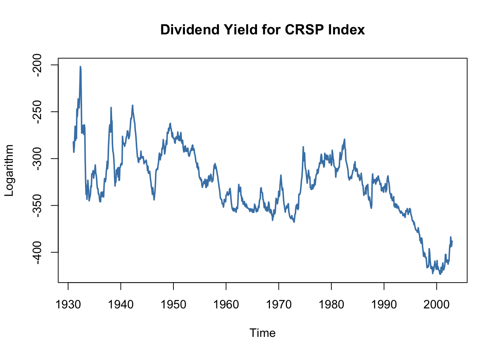


The Dickey-Fuller test statistic for an autoregressive unit root in an AR($1$) model with drift provides further evidence that the series might be nonstationary.


```r
# test for unit root in GDP using 'ur.df()' from the package 'urca'
summary(ur.df(window(StockReturns[, 2], 
                     c(1960,1), 
                     c(2002, 12)), 
              type = "drift", 
              lags = 0))
#> 
#> ############################################### 
#> # Augmented Dickey-Fuller Test Unit Root Test # 
#> ############################################### 
#> 
#> Test regression drift 
#> 
#> 
#> Call:
#> lm(formula = z.diff ~ z.lag.1 + 1)
#> 
#> Residuals:
#>      Min       1Q   Median       3Q      Max 
#> -14.3540  -2.9118  -0.2953   2.6375  25.5169 
#> 
#> Coefficients:
#>              Estimate Std. Error t value Pr(>|t|)
#> (Intercept) -2.740964   2.080038  -1.318    0.188
#> z.lag.1     -0.007652   0.005989  -1.278    0.202
#> 
#> Residual standard error: 4.45 on 513 degrees of freedom
#> Multiple R-squared:  0.003172,	Adjusted R-squared:  0.001229 
#> F-statistic: 1.633 on 1 and 513 DF,  p-value: 0.2019
#> 
#> 
#> Value of test-statistic is: -1.2777 0.9339 
#> 
#> Critical values for test statistics: 
#>       1pct  5pct 10pct
#> tau2 -3.43 -2.86 -2.57
#> phi1  6.43  4.59  3.78
```

We use <tt>window()</tt> to get observations from January 1960 to December 2012 only.

Since the $t$-value for the coefficient on the lagged logarithm of the dividend yield is $-1.27$, the hypothesis that the true coefficient is zero cannot be rejected, even at the $10\%$ significance level. 

However, it is possible to examine whether the dividend yield has predictive power for excess returns by using its differences in an ADL($1$,$1$) and an ADL($2$,$2$) model (remember that differencing a series with a unit root yields a stationary series), although these model specifications do not correspond to the economic reasoning mentioned above. Thus, we also estimate an ADL($1$,$1$) regression using the level of the logarithm of the dividend yield.

That is we estimate three different specifications:

\begin{align*}
  excess \, returns_t =& \, \beta_0 + \beta_1 excess \, returns_{t-1} + \beta_3 \Delta \log(dividend yield_{t-1}) + u_t \\
  \\
  excess \, returns_t =& \, \beta_0 + \beta_1 excess \, returns_{t-1} + \beta_2 excess \, returns_{t-2} \\ &+ \, \beta_3 \Delta \log(dividend yield_{t-1}) + \beta_4 \Delta \log(dividend yield_{t-2}) + u_t \\
  \\
  excess \, returns_t =& \, \beta_0 + \beta_1 excess \, returns_{t-1} + \beta_5 \log(dividend yield_{t-1}) + u_t \\
\end{align*}


```r
# ADL(1,1) (1st difference of log dividend yield)
CRSP_ADL_1 <- dynlm(ExReturn ~ L(ExReturn) + d(L(ln_DivYield)), 
                    data = StockReturns,
                    start = c(1960, 1), end = c(2002, 12))

# ADL(2,2) (1st & 2nd differences of log dividend yield)
CRSP_ADL_2 <- dynlm(ExReturn ~ L(ExReturn) + L(ExReturn, 2) 
                    + d(L(ln_DivYield)) + d(L(ln_DivYield, 2)), 
                    data = StockReturns,
                    start = c(1960, 1), end = c(2002, 12))

# ADL(1,1) (level of log dividend yield)
CRSP_ADL_3 <- dynlm(ExReturn ~ L(ExReturn) + L(ln_DivYield),
                    data = StockReturns,
                    start = c(1960, 1), end = c(1992, 12))
```


```r
# gather robust standard errors
rob_se_CRSP_ADL <- list(sqrt(diag(sandwich(CRSP_ADL_1))),
                        sqrt(diag(sandwich(CRSP_ADL_2))),
                        sqrt(diag(sandwich(CRSP_ADL_3))))
```

A tabular representation of the results can then be generated using <tt>stargazer()</tt>. 


```r
stargazer(CRSP_ADL_1, CRSP_ADL_2, CRSP_ADL_3,
  title = "ADL Models of Monthly Excess Stock Returns",
  header = FALSE, 
  type = "latex",
  column.sep.width = "-5pt",
  no.space = T,
  digits = 3, 
  column.labels = c("ADL(1,1)", "ADL(2,2)", "ADL(1,1)"),
  dep.var.caption  = "Dependent Variable: Excess returns on the CSRP value-weighted index",
  dep.var.labels.include = FALSE,
  covariate.labels = c("$excess return_{t-1}$", 
                       "$excess return_{t-2}$", 
                       "$1^{st} diff log(dividend yield_{t-1})$", 
                       "$1^{st} diff log(dividend yield_{t-2})$", 
                       "$log(dividend yield_{t-1})$", 
                       "Constant"),
  se = rob_se_CRSP_ADL) 
```

preserveab8492414ab9cbaa


For models (1) and (2) none of the individual $t$-statistics suggest that the coefficients are different from zero. Also, we cannot reject the hypothesis that none of the lags have predictive power for excess returns at any common level of significance (an $F$-test that the lags have predictive power does not reject for both models). 

Things are different for model (3). The coefficient on the level of the logarithm of the dividend yield is different from zero at the $5\%$ level and the $F$-test rejects, too. But we should be suspicious: the high degree of persistence in the dividend yield series probably renders this inference dubious because $t$- and $F$-statistics may follow distributions that deviate considerably from their theoretical large-sample distributions such that the usual critical values cannot be applied.

If model (3) were of use for predicting excess returns, pseudo-out-of-sample forecasts based on (3) should at least outperform forecasts of an intercept-only model in terms of the sample RMSFE. We can perform this type of comparison using <tt>R</tt> code in the fashion of the applications of Chapter \@ref(niib).


```r
# end of sample dates
EndOfSample <- as.numeric(window(time(StockReturns), c(1992, 12), c(2002, 11)))

# initialize matrix  forecasts
forecasts <- matrix(nrow = 2, 
                    ncol = length(EndOfSample))

# estimation loop over end of sample dates
for(i in 1:length(EndOfSample)) {

  # estimate model (3)
  mod3 <- dynlm(ExReturn ~ L(ExReturn) + L(ln_DivYield), data = StockReturns, 
                start = c(1960, 1), 
                end = EndOfSample[i])
  
  # estimate intercept only model
  modconst <- dynlm(ExReturn ~ 1, data = StockReturns, 
                start = c(1960, 1), 
                end = EndOfSample[i])
  
  # sample data for one-period ahead forecast
  t <- window(StockReturns, EndOfSample[i], EndOfSample[i])
  
  # compute forecast
  forecasts[, i] <- c(coef(mod3) %*% c(1, t[1], t[2]), coef(modconst))
                     
}
```


```r
# gather data
d <- cbind("Excess Returns" = c(window(StockReturns[,1], c(1993, 1), c(2002, 12))),
           "Model (3)" = forecasts[1,], 
           "Intercept Only" = forecasts[2,], 
           "Always Zero" =  0)

# Compute RMSFEs
c("ADL model (3)" = sd(d[, 1] - d[, 2]),
  "Intercept-only model" = sd(d[, 1] - d[, 3]),
  "Always zero" = sd(d[,1] - d[, 4]))
#>        ADL model (3) Intercept-only model          Always zero 
#>             4.043754             4.000218             3.995425
```

The comparison indicates that model (3) is not useful since it is outperformed in terms of sample RMSFE by the intercept-only model. A model forecasting excess returns always to be zero has an even lower sample RMSFE. This finding is consistent with the weak-form efficiency hypothesis which states that all publicly available information is accounted for in stock prices such that there is no way to predict future stock prices or excess returns using past observations, implying that the perceived significant relationship indicated by model (3) is wrong.

#### Summary {-}

This chapter dealt with introductory topics in time series regression analysis, where variables are generally correlated from one observation to the next, a concept termed serial correlation. We presented several ways of storing and plotting time series data using <tt>R</tt> and used these for informal analysis of economic data.

We have introduced AR and ADL models and applied them in the context of forecasting of macroeconomic and financial time series using <tt>R</tt>. The discussion also included the topic of lag length selection. It was shown how to set up a simple function that computes the BIC for a model object supplied.

We have also seen how to write simple <tt>R</tt> code for performing and evaluating forecasts and demonstrated some more sophisticated approaches to conduct pseudo-out-of-sample forecasts for assessment of a model's predictive power for unobserved future outcomes of a series, to check model stability and to compare different models.

Furthermore, some more technical aspects like the concept of stationarity were addressed. This included applications to testing for an autoregressive unit root with the Dickey-Fuller test and the detection of a break in the population regression function using the $QLR$ statistic. For both methods, the distribution of the relevant test statistic is non-normal, even in large samples. Concerning the Dickey-Fuller test we have used <tt>R</tt>'s random number generation facilities to produce evidence for this by means of a Monte-Carlo simulation and motivated usage of the quantiles tabulated in the book.

Also, empirical studies regarding the validity of the weak and the strong form efficiency hypothesis which are presented in the applications *Can You Beat the Market? Part I & II* in the book have been reproduced using <tt>R</tt>.

In all applications of this chapter, the focus was on forecasting future outcomes rather than estimation of causal relationships between time series variables. However, the methods needed for the latter are quite similar. Chapter \@ref(eodce) is devoted to estimation of so called *dynamic causal effects*.


<!--chapter:end:14-ch14.Rmd-->

# Estimation of Dynamic Causal Effects {#eodce}

It sometimes is of interest to know the size of current and future reaction of $Y$ to a change in $X$. This is called the *dynamic causal effect* on $Y$ of a change in $X$. In this Chapter we discuss how to estimate dynamic causal effects in <tt>R</tt> applications, where we investigate the dynamic effect of cold weather in Florida on the price of orange juice concentrate.

The discussion covers:

+ estimation of distributed lag models
+ heteroskedasticity- and autocorrelation-consistent (HAC) standard errors
+ generalized least squares (GLS) estimation of ADL models

To reproduce code examples, install the <tt>R</tt> packages listed below beforehand and make sure that the subsequent code chunk executes without any errors. 

+ <tt>AER</tt> [@R-AER]
+ <tt>dynlm</tt> [@R-dynlm]
+ <tt>nlme</tt> [@R-nlme]
+ <tt>orcutt</tt> [@R-orcutt]
+ <tt>quantmod</tt> [@R-quantmod]
+ <tt>stargazer</tt> [@R-stargazer]


```r
library(AER)
library(quantmod)
library(dynlm)
library(orcutt)
library(nlme)
library(stargazer)
```

## The Orange Juice Data 

The largest cultivation region for oranges in the U.S. is located in Florida which usually has ideal climate for the fruit growth. It thus is the source of almost all frozen juice concentrate produced in the country. However, from time to time and depending on their severeness, cold snaps cause a loss of harvests such that the supply of oranges decreases and consequently the price of frozen juice concentrate rises. The timing of the price increases is complicated: a cut in today's supply of concentrate influences not just today's price but also future prices because supply in future periods will decrease, too. Clearly, the magnitude of today's and future prices increases due to freeze is an empirical question that can be investigated using a distributed lag model --- a time series model that relates price changes to weather conditions.

To begin with the analysis, we reproduce Figure 15.1 of the book which displays plots of the price index for frozen concentrated orange juice, percentage changes in the price as well as monthly freezing degree days in Orlando, the center of Florida's orange-growing region.


```r
# load the frozen orange juice data set
data("FrozenJuice")

# compute the price index for frozen concentrated juice
FOJCPI <- FrozenJuice[, "price"]/FrozenJuice[, "ppi"]
FOJC_pctc <- 100 * diff(log(FOJCPI))
FDD <- FrozenJuice[, "fdd"]
```


```r
# convert series to xts objects
FOJCPI_xts <- as.xts(FOJCPI)
FDD_xts <- as.xts(FrozenJuice[, 3])

# Plot orange juice price index
plot(as.zoo(FOJCPI),
     col = "steelblue", 
     lwd = 2,
     xlab = "Date",
     ylab = "Price index", 
     main = "Frozen Concentrated Orange Juice")
```


```r
# divide plotting area
par(mfrow = c(2, 1))

# Plot percentage changes in prices
plot(as.zoo(FOJC_pctc),
     col = "steelblue", 
     lwd = 2,
     xlab = "Date",
     ylab = "Percent",
     main = "Monthly Changes in the Price of Frozen Conentrated Orange Juice")

# plot freezing degree days
plot(as.zoo(FDD),
     col = "steelblue", 
     lwd = 2,
     xlab = "Date",
     ylab = "Freezing degree days",
     main = "Monthly Freezing Degree Days in Orlando, FL")
```


Periods with a high amount of freezing degree days are followed by large month-to-month price changes. These coinciding movements motivate a simple regression of price changes ($\%ChgOJC_t$) on freezing degree days ($FDD_t$) to estimate the effect of an additional freezing degree day one the price in the current month. For this, as for all other regressions in this chapter, we use $T=611$ observations (January 1950 to December 2000).


```r
# simple regression of percentage changes on freezing degree days
orange_SR <- dynlm(FOJC_pctc ~ FDD)
coeftest(orange_SR, vcov. = vcovHAC)
#> 
#> t test of coefficients:
#> 
#>             Estimate Std. Error t value  Pr(>|t|)    
#> (Intercept) -0.42095    0.18683 -2.2531 0.0246064 *  
#> FDD          0.46724    0.13385  3.4906 0.0005167 ***
#> ---
#> Signif. codes:  0 '***' 0.001 '**' 0.01 '*' 0.05 '.' 0.1 ' ' 1
```

Notice that the standard errors are computed using a "HAC" estimator of the variance-covariance matrix, see Chapter \@ref(apatadlm) for a discussion of this estimator.

\begin{align*}
  \widehat{\%ChgOJC_t} = -\underset{(0.19)}{0.42} + \underset{(0.13)}{0.47} FDD_t
\end{align*}

The estimated coefficient on $FDD_t$ has the following interpretation: an additional freezing degree day in month $t$ leads to a price increase 0f $0.47$ percentage points in the same month.  

To consider effects of cold snaps on the orange juice price over the subsequent periods, we include lagged values of $FDD_t$ in our model which leads to a *distributed lag regression model*. We estimate a specification using a contemporaneous and six lagged values of $FDD_t$ as regressors.


```r
# distributed lag model with 6 lags of freezing degree days
orange_DLM <- dynlm(FOJC_pctc ~ FDD + L(FDD, 1:6))
coeftest(orange_DLM, vcov. = vcovHAC)
#> 
#> t test of coefficients:
#> 
#>               Estimate Std. Error t value  Pr(>|t|)    
#> (Intercept)  -0.692961   0.212445 -3.2618 0.0011700 ** 
#> FDD           0.471433   0.135195  3.4871 0.0005242 ***
#> L(FDD, 1:6)1  0.145021   0.081557  1.7782 0.0758853 .  
#> L(FDD, 1:6)2  0.058364   0.058911  0.9907 0.3222318    
#> L(FDD, 1:6)3  0.074166   0.047143  1.5732 0.1162007    
#> L(FDD, 1:6)4  0.036304   0.029335  1.2376 0.2163670    
#> L(FDD, 1:6)5  0.048756   0.031370  1.5543 0.1206535    
#> L(FDD, 1:6)6  0.050246   0.045129  1.1134 0.2659919    
#> ---
#> Signif. codes:  0 '***' 0.001 '**' 0.01 '*' 0.05 '.' 0.1 ' ' 1
```

As the result we obtain

\begin{align}
  \begin{split}
  \widehat{\%ChgOJC_t} =& -\underset{(0.21)}{0.69} + \underset{(0.14)}{0.47} FDD_t + \underset{(0.08)}{0.15} FDD_{t-1} + \underset{(0.06)}{0.06} FDD_{t-2} + \underset{(0.05)}{0.07} FDD_{t-3} \\ &+ \underset{(0.03)}{0.04} FDD_{t-4} + \underset{(0.03)}{0.05} FDD_{t-5} + \underset{(0.05)}{0.05} FDD_{t-6},
  \end{split}
  (\#eq:orangemod1)
\end{align}

where the coefficient on $FDD_{t-1}$ estimates the price increase in period $t$ caused by an additional freezing degree day in the preceding month, the coefficient on $FDD_{t-2}$ estimates the effect of an additional freezing degree day two month ago and so on. Consequently, the coefficients in \@ref(eq:orangemod1) can be interpreted as price changes in current and future periods due to a unit increase in the current month' freezing degree days.

## Dynamic Causal Effects

This section of the book describes the general idea of a dynamic causal effect and how the concept of a randomized controlled experiment can be translated to time series applications, using several examples. 

In general, for empirical attempts to measure a dynamic causal effect, the assumptions of stationarity (see Key Concept 14.5) and exogeneity must hold. In time series applications up until here we have assumed that the model error term has conditional mean zero given current and past values of the regressors. For estimation of a dynamic causal effect using a distributed lag model, assuming a stronger form termed *strict exogeneity* may be useful. Strict exogeneity states that the error term has mean zero conditional on past, present *and future* values of the independent variables. 

The two concepts of exogeneity and the distributed lag model are summarized in Key Concept 15.1.


<div class = "keyconcept" id="KC15.1">
<h3 class = "right"> Key Concept 15.1 </h3>
<h3 class = "left"> The Distributed Lag Model and Exogeneity </h3>
<p>
The general distributed lag model is
\begin{align}
  Y_t = \beta_0 + \beta_1 X_t + \beta_2 X_{t-1} + \beta_3 X_{t-2} + \dots + \beta_{r+1} X_{t-r} + u_t, (\#eq:dlm)
\end{align}
where it is assumed that

1. $X$ is an exogenous variable, $$E(u_t\vert X_t, X_{t-1}, X_{t-2},\dots) = 0.$$

2.
     + a $X_t,Y_t$ have a stationary distribution.
     + b $(Y_t,X_t)$ and $(Y_{t-j},X_{t-j})$ become independently distributed as $j$ gets large.

3. Large outliers are unlikely. In particular, we need that all the variables have more than eight nonzero and finite moments --- a stronger assumption than before (four finite nonzero moments) that is required for computation of the HAC covariance matrix estimator.

4. There is no perfect multicollinearity.

 The distributed lag model may be extended to include contemporaneous and past values of additional regressors.

**On the assumption of exogeneity**

+ There is another form of exogeneity termed *strict exogeneity* which assumes $$E(u_t\vert \dots, X_{t+2},X_{t+1},X_t,X_{t-1},X_{t-2},\dots)=0,$$ that is the error term has mean zero conditional on past, present and future values of $X$. Strict exogeneity implies exogeneity (as defined in 1. above) but not the other way around. From this point on we will therefore distinguish between exogeneity and strict exogeneity. 

+ Exogeneity as in 1. suffices for the OLS estimators of the coefficient in distributed lag models to be consistent. However, if the the assumption of strict exogeneity is valid, more efficient estimators can be applied.
</p>
</div>


## Dynamic Multipliers and Cumulative Dynamic Multipliers

The following terminology regarding the coefficients in the distributed lag model \@ref(eq:dlm) is useful for upcoming applications:

+ The dynamic causal effect is also called the *dynamic multiplier*. $\beta_{h+1}$ in \@ref(eq:dlm) is the $h$-period dynamic multiplier. 

+ The contemporaneous effect of $X$ on $Y$, $\beta_1$, is termed the *impact effect*. 

+ The $h$-period *cumulative dynamic multiplier* of a unit change in $X$ and $Y$ is defined as the cumulative sum of the dynamic multipliers. In particular, $\beta_1$ is the zero-period cumulative dynamic multiplier, $\beta_1 + \beta_2$ is the one-period cumulative dynamic multiplier and so forth.

     The cumulative dynamic multipliers of the distributed lag model \@ref(eq:dlm) are the coefficients $\delta_1,\delta_2,\dots,\delta_r,\delta_{r+1}$ in the modified regression
\begin{align}
  Y_t =& \, \delta_0 + \delta_1 \Delta X_t + \delta_2 \Delta X_{t-1} + \dots + \delta_r \Delta X_{t-r+1} + \delta_{r+1} X_{t-r} + u_t (\#eq:DCMreg)
\end{align} and thus can be directly estimated using OLS which makes it convenient to compute their HAC standard errors. $\delta_{r+1}$ is called the *long-run cumulative dynamic multiplier*.

It is straightforward to compute the cumulative dynamic multipliers for \@ref(eq:orangemod1), the estimated distributed lag regression of changes in orange juice concentrate prices on freezing degree days, using the corresponding model object <tt>orange_DLM</tt> and the function <tt>cumsum()</tt>.


```r
# compute cumulative multipliers
cum_mult <-cumsum(orange_DLM$coefficients[-1])

# rename entries
names(cum_mult) <- paste(0:6, sep = "-", "period CDM")

cum_mult
#> 0-period CDM 1-period CDM 2-period CDM 3-period CDM 4-period CDM 5-period CDM 
#>    0.4714329    0.6164542    0.6748177    0.7489835    0.7852874    0.8340436 
#> 6-period CDM 
#>    0.8842895
```

Translating the distributed lag model with six lags of $FDD$ to \@ref(eq:DCMreg), we see that the OLS coefficient estimates in this model coincide with the multipliers stored in <tt>cum_mult</tt>.


```r
# estimate cumulative dynamic multipliers using the modified regression
cum_mult_reg <-dynlm(FOJC_pctc ~ d(FDD) + d(L(FDD,1:5)) + L(FDD,6))
coef(cum_mult_reg)[-1]
#>          d(FDD) d(L(FDD, 1:5))1 d(L(FDD, 1:5))2 d(L(FDD, 1:5))3 d(L(FDD, 1:5))4 
#>       0.4714329       0.6164542       0.6748177       0.7489835       0.7852874 
#> d(L(FDD, 1:5))5       L(FDD, 6) 
#>       0.8340436       0.8842895
```

As noted above, using a model specification as in \@ref(eq:DCMreg) allows to easily obtain standard errors for the estimated dynamic cumulative multipliers. 


```r
# obtain coefficient summary that reports HAC standard errors
coeftest(cum_mult_reg, vcov. = vcovHAC)
#> 
#> t test of coefficients:
#> 
#>                 Estimate Std. Error t value  Pr(>|t|)    
#> (Intercept)     -0.69296    0.23668 -2.9278 0.0035431 ** 
#> d(FDD)           0.47143    0.13583  3.4709 0.0005562 ***
#> d(L(FDD, 1:5))1  0.61645    0.13145  4.6896 3.395e-06 ***
#> d(L(FDD, 1:5))2  0.67482    0.16009  4.2151 2.882e-05 ***
#> d(L(FDD, 1:5))3  0.74898    0.17263  4.3387 1.682e-05 ***
#> d(L(FDD, 1:5))4  0.78529    0.17351  4.5260 7.255e-06 ***
#> d(L(FDD, 1:5))5  0.83404    0.18236  4.5737 5.827e-06 ***
#> L(FDD, 6)        0.88429    0.19303  4.5810 5.634e-06 ***
#> ---
#> Signif. codes:  0 '***' 0.001 '**' 0.01 '*' 0.05 '.' 0.1 ' ' 1
```

## HAC Standard Errors

The error term $u_t$ in the distributed lag model \@ref(eq:dlm) may be serially correlated due to serially correlated determinants of $Y_t$ that are not included as regressors. When these factors are not correlated with the regressors included in the model, serially correlated errors do not violate the assumption of exogeneity such that the OLS estimator remains unbiased and consistent.

However, autocorrelated standard errors render the usual homoskedasticity-only *and* heteroskedasticity-robust standard errors invalid and may cause misleading inference. HAC errors are a remedy.


<div class = "keyconcept" id="KC15.2">
<h3 class = "right"> Key Concept 15.2 </h3>
<h3 class = "left"> HAC Standard errors </h3>
<p>
**Problem**:

If the error term $u_t$ in the distributed lag model \@ref(eq:dlm) is serially correlated, statistical inference that rests on usual (heteroskedasticity-robust) standard errors can be strongly misleading.

**Solution**:

Heteroskedasticity- and autocorrelation-consistent (HAC) estimators of the variance-covariance matrix circumvent this issue. There are <tt>R</tt> functions like <tt>vcovHAC()</tt> from the package <tt>sandwich</tt> which are convenient for computation of such estimators.

The package <tt>sandwich</tt> also contains the function <tt>NeweyWest()</tt>, an implementation of the HAC variance-covariance estimator proposed by @newey1987.
</p>
</div>


Consider the distributed lag regression model with no lags and a single regressor $X_t$ 
\begin{align*}
  Y_t = \beta_0 + \beta_1 X_t + u_t.
\end{align*}
with autocorrelated errors. A brief derivation of 
\begin{align}
  \overset{\sim}{\sigma}^2_{\widehat{\beta}_1} = \widehat{\sigma}^2_{\widehat{\beta}_1} \widehat{f}_t (\#eq:nwhac)
\end{align}
the so-called *Newey-West variance estimator* for the variance of the OLS estimator of $\beta_1$ is presented in Chapter 15.4 of the book. $\widehat{\sigma}^2_{\widehat{\beta}_1}$ in \@ref(eq:nwhac) is the heteroskedasticity-robust variance estimate of $\widehat{\beta}_1$ and 
\begin{align}
  \widehat{f}_t = 1 + 2 \sum_{j=1}^{m-1} \left(\frac{m-j}{m}\right) \overset{\sim}{\rho}_j (\#eq:nwhacf)
\end{align}
is a correction factor that adjusts for serially correlated errors and involves estimates of $m-1$ autocorrelation coefficients $\overset{\sim}{\rho}_j$. As it turns out, using the sample autocorrelation as implemented in <tt>acf()</tt> to estimate the autocorrelation coefficients renders \@ref(eq:nwhac) inconsistent, see pp. 650-651 of the book for a detailed argument. Therefore, we use a somewhat different estimator. For a time series $X$ we have $$ \ \overset{\sim}{\rho}_j = \frac{\sum_{t=j+1}^T \hat v_t \hat v_{t-j}}{\sum_{t=1}^T \hat v_t^2}, \ \text{with} \ \hat v= (X_t-\overline{X}) \hat u_t. $$ We implement this estimator in the function <tt>acf_c()</tt> below.

$m$ in \@ref(eq:nwhacf) is a truncation parameter to be chosen. A rule of thumb for choosing $m$ is
\begin{align}
  m = \left \lceil{0.75 \cdot T^{1/3}}\right\rceil. (\#eq:hactruncrot)
\end{align}

We simulate a time series that, as stated above, follows a distributed lag model with autocorrelated errors and then show how to compute the Newey-West HAC estimate of $SE(\widehat{\beta}_1)$ using <tt>R</tt>. This is done via two separate but, as we will see, identical approaches: at first we follow the derivation presented in the book step-by-step and compute the estimate "manually". We then show that the result is exactly the estimate obtained when using the function <tt>NeweyWest()</tt>. 


```r
# function that computes rho tilde
acf_c <- function(x, j) {
  return(
    t(x[-c(1:j)]) %*% na.omit(Lag(x, j)) / t(x) %*% x
  )
}

# simulate time series with serially correlated errors
set.seed(1)

N <- 100

eps <- arima.sim(n = N, model = list(ma = 0.5))
X <- runif(N, 1, 10)
Y <- 0.5 * X + eps

# compute OLS residuals
res <- lm(Y ~ X)$res

# compute v
v <- (X - mean(X)) * res

# compute robust estimate of beta_1 variance
var_beta_hat <- 1/N * (1/(N-2) * sum((X - mean(X))^2 * res^2) ) / 
                        (1/N * sum((X - mean(X))^2))^2

# rule of thumb truncation parameter
m <- floor(0.75 * N^(1/3))

# compute correction factor
f_hat_T <- 1 + 2 * sum(
  (m - 1:(m-1))/m * sapply(1:(m - 1), function(i) acf_c(x = v, j = i))
  ) 

# compute Newey-West HAC estimate of the standard error 
sqrt(var_beta_hat * f_hat_T)
#> [1] 0.04036208
```

For the code to be reusable in other applications, we use <tt>sapply()</tt> to estimate the $m-1$ autocorrelations $\overset{\sim}{\rho}_j$. 

```r
# Using NeweyWest():
NW_VCOV <- NeweyWest(lm(Y ~ X), 
              lag = m - 1, prewhite = F, 
              adjust = T)

# compute standard error
sqrt(diag(NW_VCOV))[2]
#>          X 
#> 0.04036208
```

By choosing <tt>lag = m-1</tt> we ensure that the maximum order of autocorrelations used is $m-1$ --- just as in equation \@ref(eq:nwhacf). Notice that we set the arguments <tt>prewhite = F</tt> and <tt>adjust = T</tt> to ensure that the formula \@ref(eq:nwhac) is used and finite sample adjustments are made.

We find that the computed standard errors coincide. Of course, a variance-covariance matrix estimate as computed by <tt>NeweyWest()</tt> can be supplied as the argument <tt>vcov</tt> in <tt>coeftest()</tt> such that HAC $t$-statistics and $p$-values are provided by the latter.


```r
example_mod <- lm(Y ~ X)
coeftest(example_mod, vcov = NW_VCOV)
#> 
#> t test of coefficients:
#> 
#>             Estimate Std. Error t value Pr(>|t|)    
#> (Intercept) 0.542310   0.235423  2.3036  0.02336 *  
#> X           0.423305   0.040362 10.4877  < 2e-16 ***
#> ---
#> Signif. codes:  0 '***' 0.001 '**' 0.01 '*' 0.05 '.' 0.1 ' ' 1
```

## Estimation of Dynamic Causal Effects with Strictly Exogeneous Regressors

In general, the errors in a distributed lag model are correlated which necessitates usage of HAC standard errors for valid inference. If, however, the assumption of exogeneity (the first assumption stated in Key Concept 15.1) is replaced by strict exogeneity, that is $$E(u_t\vert \dots, X_{t+1}, X_{t}, X_{t-1}, \dots) = 0,$$ more efficient approaches than OLS estimation of the coefficients are available. For a general distributed lag model with $r$ lags and AR($p$) errors, these approaches are summarized in Key Concept 15.4.


<div class = "keyconcept" id="KC15.4">
<h3 class = "right"> Key Concept 15.4 </h3>
<h3 class = "left"> Estimation of Dynamic Multipliers Under Strict Exogeneity </h3>
<p>
Consider the general distributed lag model with $r$ lags and errors following an AR($p$) process,
\begin{align}
  Y_t =& \, \beta_0 + \beta_1 X_t + \beta_2 X_{t-1} + \dots + \beta_{r+1} X_{t-r} + u_t (\#eq:dlmar) \\
  u_t =& \, \phi_1 u_{t-1} + \phi u_{t-2} + \dots + \phi_p u_{t-p} + \overset{\sim}{u}_t. (\#eq:dlmarerrors)
\end{align}
Under strict exogeneity of $X_t$, one may rewrite the above model in the ADL specification
\begin{align*}
  Y_t =& \, \alpha_0 + \phi_1 Y_{t-1} + \phi_2 Y_{t-2} + \dots + \phi_p Y_{t-p} \\
      &+ \, \delta_0 X_t + \delta_1 X_{t-1} + \dots + \delta_q X_{t-q} + \overset{\sim}{u}_t
\end{align*}
where $q=r+p$ and compute estimates of the dynamic multipliers $\beta_1, \beta_2, \dots, \beta_{r+1}$ using OLS estimates of $\phi_1, \phi_2, \dots, \phi_p, \delta_0, \delta_1, \dots, \delta_q$. 

An alternative is to estimate the dynamic multipliers using feasible GLS, that is to apply the OLS estimator to a quasi-difference specification of \@ref(eq:dlmar). Under strict exogeneity, the feasible GLS approach is the BLUE estimator for the dynamic multipliers in large samples.

On the one hand, as demonstrated in Chapter 15.5 of the book, OLS estimation of the ADL representation can be beneficial for estimation of the dynamic multipliers in large distributed lag models because it allows for a more parsimonious model that may be a good approximation to the large model. On the other hand, the GLS approach is more efficient than the ADL estimator if the sample size is large.
</p>
</div>


We shortly review how the different representations of a small distributed lag model can be obtained and show how this specification can be estimated by OLS and GLS using <tt>R</tt>.

The model is
\begin{align}
  Y_t = \beta_0 + \beta_1 X_t + \beta_2 X_{t-1} + u_t, (\#eq:dldynamic)
\end{align}
so a change in $X$ is modeled to effect $Y$ contemporaneously ($\beta_1$) and in the next period ($\beta_2$). The error term $u_t$ is assumed to follow an AR($1$) process,$$u_t = \phi_1 u_{t-1} + \overset{\sim}{u_t},$$ where $\overset{\sim}{u_t}$ is serially uncorrelated.

One can show that the ADL representation of this model is
\begin{align}
  Y_t = \alpha_0 + \phi_1 Y_{t-1} + \delta_0 X_t + \delta_1 X_{t-1} + \delta_2 X_{t-2} + \overset{\sim}{u}_t, (\#eq:adl21dynamic)
\end{align}
with the restrictions
\begin{align*}
  \beta_1 =& \, \delta_0, \\
  \beta_2 =& \, \delta_1 + \phi_1 \delta_0,
\end{align*}
see p. 657 of the book.

#### Quasi-Differences {-}

Another way of writing the ADL($1$,$2$) representation \@ref(eq:adl21dynamic) is the *quasi-difference model*
\begin{align}
  \overset{\sim}{Y}_t = \alpha_0 + \beta_1 \overset{\sim}{X}_t + \beta_2   \overset{\sim}{X}_{t-1} + \overset{\sim}{u}_t, (\#eq:qdm)
\end{align}
where $\overset{\sim}{Y}_t = Y_t - \phi_1 Y_{t-1}$ and $\overset{\sim}{X}_t = X_t - \phi_1 X_{t-1}$. Notice that the error term $\overset{\sim}{u}_t$ is uncorrelated in both models and, as shown in Chapter 15.5 of the book, $$E(u_t\vert X_{t+1}, X_t, X_{t-1}, \dots) = 0,$$ which is implied by the assumption of strict exogeneity.

We continue by simulating a time series of $500$ observations using the model \@ref(eq:dldynamic) with $\beta_1 = 0.1$, $\beta_2 = 0.25$, $\phi = 0.5$ and $\overset{\sim}{u}_t \sim \mathcal{N}(0,1)$ and estimate the different representations, starting with the distributed lag model \@ref(eq:dldynamic).


```r
# set seed for reproducibility
set.seed(1)

# simulate a time series with serially correlated errors
obs <- 501
eps <- arima.sim(n = obs-1 , model = list(ar = 0.5))
X <- arima.sim(n = obs, model = list(ar = 0.25))
Y <- 0.1 * X[-1] + 0.25 * X[-obs] + eps
X <- ts(X[-1])

# estimate the distributed lag model
dlm <- dynlm(Y ~ X + L(X))
```

Let us check that the residuals of this model exhibit autocorrelation using <tt>acf()</tt>.


```r
# check that the residuals are serially correlated
acf(residuals(dlm))
```


In particular, the pattern reveals that the residuals follow an autoregressive process, as the sample autocorrelation function decays quickly for the first few lags and is probably zero for higher lag orders. In any case, HAC standard errors should be used.


```r
# coefficient summary using the Newey-West SE estimates
coeftest(dlm, vcov = NeweyWest, prewhite = F, adjust = T)
#> 
#> t test of coefficients:
#> 
#>             Estimate Std. Error t value  Pr(>|t|)    
#> (Intercept) 0.038340   0.073411  0.5223  0.601717    
#> X           0.123661   0.046710  2.6474  0.008368 ** 
#> L(X)        0.247406   0.046377  5.3347 1.458e-07 ***
#> ---
#> Signif. codes:  0 '***' 0.001 '**' 0.01 '*' 0.05 '.' 0.1 ' ' 1
```

#### OLS Estimation of the ADL Model {-}

Next, we estimate the ADL($1$,$2$) model \@ref(eq:adl21dynamic) using OLS. The errors are uncorrelated in this representation of the model. This statement is supported by a plot of the sample autocorrelation function of the residual series.


```r
# estimate the ADL(2,1) representation of the distributed lag model
adl21_dynamic <- dynlm(Y ~ L(Y) + X + L(X, 1:2))

# plot the sample autocorrelaltions of residuals
acf(adl21_dynamic$residuals)
```


The estimated coefficients of `adl21_dynamic$coefficients` are *not* the dynamic multipliers we are interested in, but instead can be computed according to the restrictions in \@ref(eq:adl21dynamic), where the true coefficients are replaced by the OLS estimates.


```r
# compute estimated dynamic effects using coefficient restrictions
# in the ADL(2,1) representation
t <- adl21_dynamic$coefficients

c("hat_beta_1" = t[3],
  "hat_beta_2" = t[4] + t[3] * t[2])
#>          hat_beta_1.X hat_beta_2.L(X, 1:2)1 
#>             0.1176425             0.2478484
```

#### GLS Estimation {-}

Strict exogeneity allows for OLS estimation of the quasi-difference model \@ref(eq:qdm). The idea of applying the OLS estimator to a model where the variables are linearly transformed, such that the model errors are uncorrelated and homoskedastic, is called *generalized least squares* (GLS).

The OLS estimator in \@ref(eq:qdm) is called the *infeasible GLS* estimator because $\overset{\sim}{Y}$ and $\overset{\sim}{X}$ cannot be computed without knowing $\phi_1$, the autoregressive coefficient in the error AR($1$) model, which is generally unknown in practice.

Assume we knew that $\phi = 0.5$. We then may obtain the infeasible GLS estimates of the dynamic multipliers in \@ref(eq:dldynamic) by applying OLS to the transformed data. 


```r
# GLS: estimate quasi-differenced specification by OLS
iGLS_dynamic <- dynlm(I(Y- 0.5 * L(Y)) ~ I(X - 0.5 * L(X)) + I(L(X) - 0.5 * L(X, 2)))

summary(iGLS_dynamic)
#> 
#> Time series regression with "ts" data:
#> Start = 3, End = 500
#> 
#> Call:
#> dynlm(formula = I(Y - 0.5 * L(Y)) ~ I(X - 0.5 * L(X)) + I(L(X) - 
#>     0.5 * L(X, 2)))
#> 
#> Residuals:
#>     Min      1Q  Median      3Q     Max 
#> -3.0325 -0.6375 -0.0499  0.6658  3.7724 
#> 
#> Coefficients:
#>                         Estimate Std. Error t value Pr(>|t|)    
#> (Intercept)              0.01620    0.04564   0.355  0.72273    
#> I(X - 0.5 * L(X))        0.12000    0.04237   2.832  0.00481 ** 
#> I(L(X) - 0.5 * L(X, 2))  0.25266    0.04237   5.963 4.72e-09 ***
#> ---
#> Signif. codes:  0 '***' 0.001 '**' 0.01 '*' 0.05 '.' 0.1 ' ' 1
#> 
#> Residual standard error: 1.017 on 495 degrees of freedom
#> Multiple R-squared:  0.07035,	Adjusted R-squared:  0.0666 
#> F-statistic: 18.73 on 2 and 495 DF,  p-value: 1.442e-08
```

The *feasible GLS* estimator uses preliminary estimation of the coefficients in the presumed error term model, computes the quasi-differenced data and then estimates the model using OLS. This idea was introduced by @cochrane1949 and can be extended by continuing this process iteratively. Such a procedure is implemented in the function <tt>cochrane.orcutt()</tt> from the package <tt>orcutt</tt>.


```r
X_t <- c(X[-1])
# create first lag
X_l1 <- c(X[-500])
Y_t <- c(Y[-1])

# iterated cochrane-orcutt procedure
summary(cochrane.orcutt(lm(Y_t ~ X_t + X_l1)))
#> Call:
#> lm(formula = Y_t ~ X_t + X_l1)
#> 
#>             Estimate Std. Error t value  Pr(>|t|)    
#> (Intercept) 0.032885   0.085163   0.386   0.69956    
#> X_t         0.120128   0.042534   2.824   0.00493 ** 
#> X_l1        0.252406   0.042538   5.934 5.572e-09 ***
#> ---
#> Signif. codes:  0 '***' 0.001 '**' 0.01 '*' 0.05 '.' 0.1 ' ' 1
#> 
#> Residual standard error: 1.0165 on 495 degrees of freedom
#> Multiple R-squared:  0.0704 ,  Adjusted R-squared:  0.0666
#> F-statistic: 18.7 on 2 and 495 DF,  p-value: < 1.429e-08
#> 
#> Durbin-Watson statistic 
#> (original):    1.06907 , p-value: 1.05e-25
#> (transformed): 1.98192 , p-value: 4.246e-01
```

Some more sophisticated methods for GLS estimation are provided with the package <tt>nlme</tt>. The function <tt>gls()</tt> can be used to fit linear models by maximum likelihood estimation algorithms and allows to specify a correlation structure for the error term. 


```r
# feasible GLS maximum likelihood estimation procedure
summary(gls(Y_t ~ X_t + X_l1, correlation = corAR1()))
#> Generalized least squares fit by REML
#>   Model: Y_t ~ X_t + X_l1 
#>   Data: NULL 
#>        AIC     BIC    logLik
#>   1451.847 1472.88 -720.9235
#> 
#> Correlation Structure: AR(1)
#>  Formula: ~1 
#>  Parameter estimate(s):
#>       Phi 
#> 0.4668343 
#> 
#> Coefficients:
#>                  Value  Std.Error  t-value p-value
#> (Intercept) 0.03929124 0.08530544 0.460595  0.6453
#> X_t         0.11986994 0.04252270 2.818963  0.0050
#> X_l1        0.25287471 0.04252497 5.946500  0.0000
#> 
#>  Correlation: 
#>      (Intr) X_t  
#> X_t  0.039       
#> X_l1 0.037  0.230
#> 
#> Standardized residuals:
#>         Min          Q1         Med          Q3         Max 
#> -3.00075518 -0.64255522 -0.05400347  0.69101814  3.28555793 
#> 
#> Residual standard error: 1.14952 
#> Degrees of freedom: 499 total; 496 residual
```

Notice that in this example, the coefficient estimates produced by GLS are somewhat closer to their true values and that the standard errors are the smallest for the GLS estimator.

## Orange Juice Prices and Cold Weather

This section investigates the following two questions using the time series regression methods discussed here:

+ How persistent is the effect of a single freeze on orange juice concentrate prices?

+ Has the effect been stable over the whole time span?

We start by estimating dynamic causal effects with a distributed lag model where $\%ChgOJC_t$ is regressed on $FDD_t$ and 18 lags. A second model specification considers a transformation of the the distributed lag model which allows to estimate the 19 cumulative dynamic multipliers using OLS. The third model, adds 11 binary variables (one for each of the months from February to December) to adjust for a possible omitted variable bias arising from correlation of $FDD_t$ and seasons by adding <tt>season(FDD)</tt> to the right hand side of the formula of the second model. 


```r
# estimate distributed lag models of frozen orange juice price changes
FOJC_mod_DM <- dynlm(FOJC_pctc ~ L(FDD, 0:18))
FOJC_mod_CM1 <- dynlm(FOJC_pctc ~ L(d(FDD), 0:17) + L(FDD, 18))
FOJC_mod_CM2 <- dynlm(FOJC_pctc ~ L(d(FDD), 0:17) + L(FDD, 18) + season(FDD))
```

The above models include a large number of lags with default labels that correspond to the degree of differencing and the lag orders which makes it somewhat cumbersome to read the output. The regressor labels of a model object may be altered by overriding the attribute <tt>names</tt> of the coefficient section using the function <tt>attr()</tt>. Thus, for better readability we use the lag orders as regressor labels.


```r
# set lag orders as regressor labels 
attr(FOJC_mod_DM$coefficients, "names")[1:20] <- c("(Intercept)", as.character(0:18))
attr(FOJC_mod_CM1$coefficients, "names")[1:20] <- c("(Intercept)", as.character(0:18))
attr(FOJC_mod_CM2$coefficients, "names")[1:20] <- c("(Intercept)", as.character(0:18))
```


Next, we compute HAC standard errors standard errors for each model using <tt>NeweyWest()</tt> and gather the results in a list which is then supplied as the argument <tt>se</tt> to the function <tt>stargazer()</tt>, see below. The sample consists of 612 observations:

```r
length(FDD)
#> [1] 612
```
According to \@ref(eq:hactruncrot), the rule of thumb for choosing the HAC standard error truncation parameter $m$, we choose
$$m = \left\lceil0.75 \cdot 612^{1/3} \right\rceil = \lceil6.37\rceil = 7.$$
To check for sensitivity of the standard errors to different choices of the truncation parameter in the model that is used to estimate the cumulative multipliers, we also compute the Newey-West estimator for $m=14$.


```r
# gather HAC standard error errors in a list
SEs <- list(sqrt(diag(NeweyWest(FOJC_mod_DM, lag = 7, prewhite = F))), 
            sqrt(diag(NeweyWest(FOJC_mod_CM1, lag = 7, prewhite = F))), 
            sqrt(diag(NeweyWest(FOJC_mod_CM1, lag = 14, prewhite = F))),
            sqrt(diag(NeweyWest(FOJC_mod_CM2, lag = 7, prewhite = F))))
```


The results are then used to reproduce the outcomes presented in Table 15.1 of the book.


```r
stargazer(FOJC_mod_DM , FOJC_mod_CM1, FOJC_mod_CM1, FOJC_mod_CM2,
  title = "Dynamic Effects of a Freezing Degree Day on the Price of Orange Juice",
  header = FALSE, 
  digits = 3, 
  column.labels = c("Dynamic Multipliers", rep("Dynamic Cumulative Multipliers", 3)),
  dep.var.caption  = "Dependent Variable: Monthly Percentage Change in Orange Juice Price",
  dep.var.labels.include = FALSE,
  covariate.labels = as.character(0:18),
  omit = "season",
  se = SEs,
  no.space = T,
  add.lines = list(c("Monthly indicators?","no", "no", "no", "yes"),
                   c("HAC truncation","7", "7", "14", "7")),
  omit.stat = c("rsq", "f","ser")) 
```

preserve13096ecbc170e21a


According to column (1) of Table \@ref(tab:deoafddotpooj), the contemporaneous effect of a freezing degree day is an increase of $0.5\%$ in orange juice prices. The estimated effect is only $0.17\%$ for the next month and close to zero for subsequent months. In fact, for all lags larger than 1, we cannot reject the null hypotheses that the respective coefficients are zero using individual $t$-tests. The model <tt>FOJC_mod_DM</tt> only explains little of the variation in the dependent variable ($\bar{R}^2 = 0.11$). 

Columns (2) and (3) present estimates of the dynamic cumulative multipliers of model <tt>FOJC_mod_CM1</tt>. Apparently, it does not matter whether we choose $m=7$ or $m=14$ when computing HAC standard errors so we stick with $m=7$ and the standard errors reported in column (2). 

If the demand for orange juice is higher in winter, $FDD_t$ would be correlated with the error term since freezes occur rather in winter so we would face omitted variable bias. The fourth model estimate, <tt>FOJC_mod_CM2</tt>, accounts for this possible issue by using an additional set of 11 monthly dummies. For brevity, estimates of the dummy coefficients are excluded from the output produced by stargazer (this is achieved by setting <tt>omit = 'season'</tt>). We may check that the dummy for January was omitted to prevent perfect multicollinearity.


```r
# estimates on mothly dummies
FOJC_mod_CM2$coefficients[-c(1:20)]
#> season(FDD)Feb season(FDD)Mar season(FDD)Apr season(FDD)May season(FDD)Jun 
#>     -0.9565759     -0.6358007      0.5006770     -1.0801764      0.3195624 
#> season(FDD)Jul season(FDD)Aug season(FDD)Sep season(FDD)Oct season(FDD)Nov 
#>      0.1951113      0.3644312     -0.4130969     -0.1566622      0.3116534 
#> season(FDD)Dec 
#>      0.1481589
```

A comparison of the estimates presented in columns (2) and (4) indicates that adding monthly dummies has a negligible effect. Further evidence for this comes from a joint test of the hypothesis that the 11 dummy coefficients are zero. Instead of using <tt>linearHypothesis()</tt>, we use the function <tt>waldtest()</tt> and supply two model objects instead: <tt>unres_model</tt>, the unrestricted model object which is the same as <tt>FOJC_mod_CM2</tt> (except for the coefficient names since we have modified them above) and <tt>res_model</tt>, the model where the restriction that all dummy coefficients are zero is imposed. <tt>res_model</tt> is conveniently obtained using the function <tt>update()</tt>. It extracts the argument <tt>formula</tt> of a model object, updates it as specified and then re-fits the model. By setting <tt>formula = . ~ . - season(FDD)</tt> we impose that the monthly dummies do not enter the model.


```r
# test if coefficients on monthly dummies are zero
unres_model <- dynlm(FOJC_pctc ~ L(d(FDD), 0:17) + L(FDD, 18) + season(FDD))

res_model <- update(unres_model, formula = . ~ . - season(FDD))

waldtest(unres_model, 
         res_model, 
         vcov = NeweyWest(unres_model, lag = 7, prewhite = F))
#> Wald test
#> 
#> Model 1: FOJC_pctc ~ L(d(FDD), 0:17) + L(FDD, 18) + season(FDD)
#> Model 2: FOJC_pctc ~ L(d(FDD), 0:17) + L(FDD, 18)
#>   Res.Df  Df      F Pr(>F)
#> 1    563                  
#> 2    574 -11 0.9683 0.4743
```

The $p$-value is $0.47$ so we cannot reject the hypothesis that the coefficients on the monthly dummies are zero, even at the $10\%$ level. We conclude that the seasonal fluctuations in demand for orange juice do not pose a serious threat to internal validity of the model.

It is convenient to use plots of dynamic multipliers and cumulative dynamic multipliers. The following two code chunks reproduce Figures 15.2 (a) and 15.2 (b) of the book which display point estimates of dynamic and cumulative multipliers along with upper and lower bounds of their $95\%$ confidence intervals computed using the above HAC standard errors.


```r
# 95% CI bounds
point_estimates <- FOJC_mod_DM$coefficients

CI_bounds <- cbind("lower" = point_estimates - 1.96 * SEs[[1]],
                   "upper" = point_estimates + 1.96 * SEs[[1]])[-1, ]

# plot the estimated dynamic multipliers
plot(0:18, point_estimates[-1], 
     type = "l", 
     lwd = 2, 
     col = "steelblue", 
     ylim = c(-0.4, 1),
     xlab = "Lag",
     ylab = "Dynamic multiplier",
     main = "Dynamic Effect of FDD on Orange Juice Price")

# add a dashed line at 0
abline(h = 0, lty = 2)

# add CI bounds
lines(0:18, CI_bounds[,1], col = "darkred")
lines(0:18, CI_bounds[,2], col = "darkred")
```

<div class="figure" style="text-align: center">

<p class="caption">(\#fig:DM)Dynamic Multipliers</p>
</div>

The $95\%$ confidence intervals plotted in Figure \@ref(fig:DM) indeed include zero for lags larger than 1 such that the null of a zero multiplier cannot be rejected for these lags.


```r
# 95% CI bounds
point_estimates <- FOJC_mod_CM1$coefficients

CI_bounds <- cbind("lower" = point_estimates - 1.96 * SEs[[2]],
                   "upper" = point_estimates + 1.96 * SEs[[2]])[-1,]


# plot estimated dynamic multipliers
plot(0:18, point_estimates[-1], 
     type = "l", 
     lwd = 2, 
     col = "steelblue", 
     ylim = c(-0.4, 1.6),
     xlab = "Lag",
     ylab = "Cumulative dynamic multiplier",
     main = "Cumulative Dynamic Effect of FDD on Orange Juice Price")

# add dashed line at 0
abline(h = 0, lty = 2)

# add CI bounds
lines(0:18, CI_bounds[, 1], col = "darkred")
lines(0:18, CI_bounds[, 2], col = "darkred")
```

<div class="figure" style="text-align: center">

<p class="caption">(\#fig:DCM)Dynamic Cumulative Multipliers</p>
</div>

As can be seen from Figure \@ref(fig:DCM), the estimated dynamic cumulative multipliers grow until the seventh month up to a price increase of about $0.91\%$ and then decrease slightly to the estimated long-run cumulative multiplier of $0.37\%$ which, however, is not significantly different from zero at the $5\%$ level.

Have the dynamic multipliers been stable over time? One way to see this is to estimate these multipliers for different subperiods of the sample span. For example, consider periods 1950 - 1966, 1967 - 1983 and 1984 - 2000. If the multipliers are the same for all three periods the estimates should be close and thus the estimated cumulative multipliers should be similar, too. We investigate this by re-estimating <tt>FOJC_mod_CM1</tt> for the three different time spans and then plot the estimated cumulative dynamic multipliers for the comparison.


```r
# estimate cumulative multiplieres using different sample periods
FOJC_mod_CM1950 <- update(FOJC_mod_CM1, start = c(1950, 1), end = c(1966, 12))

FOJC_mod_CM1967 <- update(FOJC_mod_CM1, start = c(1967, 1), end = c(1983, 12))

FOJC_mod_CM1984 <- update(FOJC_mod_CM1, start = c(1984, 1), end = c(2000, 12))
```


```r
# plot estimated dynamic cumulative multipliers (1950-1966)
plot(0:18, FOJC_mod_CM1950$coefficients[-1], 
     type = "l", 
     lwd = 2, 
     col = "steelblue",
     xlim = c(0, 20),
     ylim = c(-0.5, 2),
     xlab = "Lag",
     ylab = "Cumulative dynamic multiplier",
     main = "Cumulative Dynamic Effect for Different Sample Periods")

# plot estimated dynamic multipliers (1967-1983)
lines(0:18, FOJC_mod_CM1967$coefficients[-1], lwd = 2)

# plot estimated dynamic multipliers (1984-2000)
lines(0:18, FOJC_mod_CM1984$coefficients[-1], lwd = 2, col = "darkgreen")

# add dashed line at 0
abline(h = 0, lty = 2)

# add annotations
text(18, -0.24, "1984 - 2000")
text(18, 0.6, "1967 - 1983")
text(18, 1.2, "1950 - 1966")
```


Clearly, the cumulative dynamic multipliers have changed considerably over time. The effect of a freeze was stronger and more persistent in the 1950s and 1960s. For the 1970s the magnitude of the effect was lower but still highly persistent. We observe an even lower magnitude for the final third of the sample span (1984 - 2000) where the long-run effect is much less persistent and essentially zero after a year. 

A QLR test for a break in the distributed lag regression of column (1) in Table \@ref(tab:deoafddotpooj) with $15\%$ trimming using a HAC variance-covariance matrix estimate supports the conjecture that the population regression coefficients have changed over time.


```r
# set up a range of possible break dates
tau <- c(window(time(FDD), 
                time(FDD)[round(612/100*15)], 
                time(FDD)[round(612/100*85)]))

# initialize the vector of F-statistics
Fstats <- numeric(length(tau))

# the restricted model
res_model <- dynlm(FOJC_pctc ~ L(FDD, 0:18))

# estimation, loop over break dates
for(i in 1:length(tau)) {
  
  # set up dummy variable
  D <- time(FOJC_pctc) > tau[i]
  
  # estimate DL model with intercations
  unres_model <- dynlm(FOJC_pctc ~ D * L(FDD, 0:18))
                 
  # compute and save F-statistic
  Fstats[i] <- waldtest(res_model, 
                        unres_model, 
                        vcov = NeweyWest(unres_model, lag = 7, prewhite = F))$F[2]
    
}
```

Note that this code takes a couple of seconds to run since a total of <tt>length(tau)</tt> regressions with $40$ model coefficients each are estimated.


```r
# QLR test statistic
max(Fstats)
#> [1] 36.76819
```

The QLR statistic is $36.77$. From Table 14.5 of the book we see that the $1\%$ critical value for the QLR test with $15\%$ trimming and $q=20$ restrictions is $2.43$. Since this is a right-sided test, the QLR statistic clearly lies in the region of rejection so we can discard the null hypothesis of no break in the population regression function.

See Chapter 15.7 of the book for a discussion of empirical examples where it is questionable whether the assumption of (past and present) exogeneity of the regressors is plausible.

#### Summary {-}

+ We have seen how <tt>R</tt> can be used to estimate the time path of the effect on $Y$ of a change in $X$ (the dynamic causal effect on $Y$ of a change in $X$) using time series data on both. The corresponding model is called the distributed lag model. Distributed lag models are conveniently estimated using the function <tt>dynlm()</tt> from the package <tt>dynlm</tt>.

+ The regression error in distributed lag models is often serially correlated such that standard errors which are robust to heteroskedasticity *and* autocorrelation should be used to obtain valid inference. The package <tt>sandwich</tt> provides functions for computation of so-called HAC covariance matrix estimators, for example <tt>vcovHAC()</tt> and <tt>NeweyWest()</tt>.

+ When $X$ is *strictly exogeneous*, more efficient estimates can be obtained using an ADL model or by GLS estimation. Feasible GLS algorithms can be found in the <tt>R</tt> packages <tt>orcutt</tt> and <tt>nlme</tt>. Chapter 15.7 of the book emphasizes that the assumption of strict exogeneity is often implausible in empirical applications.


<!--chapter:end:15-ch15.Rmd-->

# Additional Topics in Time Series Regression {#atitsr}

This chapter discusses the following advanced topics in time series regression and demonstrates how core techniques can be applied using <tt>R</tt>:

+ *Vector autoregressions* (VARs). We focus on using VARs for forecasting. Another branch of the literature is concerned with so-called *Structural VARs* which are, however, beyond the scope of this chapter.
+ Multiperiod forecasts. This includes a discussion of iterated and direct (multivariate) forecasts.
+ The DF-GLS test, a modification of the ADF test that has more power than the latter when the series has deterministic components and is close to being nonstationarity.
+ Cointegration analysis with an application to short- and long-term interest rates. We demonstrate how to estimate a vector error correction model.
+ Autoregressive conditional heteroskedasticity (ARCH) models. We show how a simple generalized ARCH (GARCH) model can be helpful in quantifying the risk associated with investing in the stock market in terms of estimation and forecasting of the volatility of asset returns.

To reproduce the code examples, install the <tt>R</tt> packages listed below and make sure that the subsequent code chunk executes without any errors. 

+ <tt>AER</tt> [@R-AER]
+ <tt>dynlm</tt> [@R-dynlm]
+ <tt>fGarch</tt> [@R-fGarch]
+ <tt>quantmod</tt> [@R-quantmod]
+ <tt>readxl</tt> [@R-readxl]
+ <tt>scales</tt> [@R-scales]
+ <tt>vars</tt> [@R-vars]


```r
library(AER)
library(readxl)
library(dynlm)
library(vars)
library(quantmod)
library(scales)
library(fGarch)
```

## Vector Autoregressions

A Vector autoregressive (VAR) model is useful when one is interested in predicting multiple time series variables using a single model. At its core, the VAR model is an extension of the univariate autoregressive model we have dealt with in Chapters \@ref(ittsraf) and \@ref(eodce). Key Concept 16.1 summarizes the essentials of VAR.


<div class = "keyconcept" id="KC16.1">
<h3 class = "right"> Key Concept <br> 16.1</h3>          
<h3 class = "left">Vector Autoregressions</h3>
<p>

The vector autoregression (VAR) model extends the idea of univariate autoregression to $k$ time series regressions, where the lagged values of *all* $k$ series appear as regressors. Put differently, in a VAR model we regress a *vector* of time series variables on lagged vectors of these variables. As for AR($p$) models, the lag order is denoted by $p$ so the VAR($p$) model of two variables $X_t$ and $Y_t$ ($k=2$) is given by the equations

\begin{align*}
  Y_t =& \, \beta_{10} + \beta_{11} Y_{t-1} + \dots + \beta_{1p} Y_{t-p} + \gamma_{11} X_{t-1} + \dots + \gamma_{1p} X_{t-p} + u_{1t}, \\
  X_t =& \, \beta_{20} + \beta_{21} Y_{t-1} + \dots + \beta_{2p} Y_{t-p} + \gamma_{21} X_{t-1} + \dots + \gamma_{2p} X_{t-p} + u_{2t}.
\end{align*}

The $\beta$s and $\gamma$s can be estimated using OLS on each equation. The assumptions for VARs are the time series assumptions presented in Key Concept 14.6 applied to each of the equations.

It is straightforward to estimate VAR models in <tt>R</tt>. A feasible approach is to simply use <tt>lm()</tt> for estimation of the individual equations. Furthermore, the <tt>R</tt>package <tt>vars</tt> provides standard tools for estimation, diagnostic testing and prediction using this type of models.  

</p>
</div>


When the assumptions of Key Concept 16.1 hold, the OLS estimators of the VAR coefficients are consistent and jointly normal in large samples so that the usual inferential methods such as confidence intervals and $t$-statistics can be used.

The structure of VARs also allows to jointly test restrictions across multiple equations. For instance, it may be of interest to test whether the coefficients on all regressors of the lag $p$ are zero. This corresponds to testing the null that the lag order $p-1$ is correct. Large sample joint normality of the coefficient estimates is convenient because it implies that we may simply use an $F$-test for this testing problem. The explicit formula for such a test statistic is rather complicated but fortunately such computations are easily done using the <tt>R</tt> functions we work with in this chapter. Another way to determine optimal lag lengths are information criteria like the $BIC$ which we have introduced for univariate time series regressions in Chapter \@ref(llsuic). Just as in the case of a single equation, for a multiple equation model we choose the specification which has the smallest $BIC(p)$, where 
\begin{align*}
  BIC(p) =& \, \log\left[\text{det}(\widehat{\Sigma}_u)\right] + k(kp+1) \frac{\log(T)}{T}.
\end{align*}
with $\widehat{\Sigma}_u$ denoting the estimate of the $k \times k$ covariance matrix of the VAR errors and $\text{det}(\cdot)$ denotes the determinant. 

As for univariate distributed lag models, one should think carefully about variables to include in a VAR, as adding unrelated variables reduces the forecast accuracy by increasing the estimation error. This is particularly important because the number of parameters to be estimated grows qudratically to the number of variables modeled by the VAR. In the application below we shall see that economic theory and empirical evidence are helpful for this decision. 

#### A VAR Model of the Growth Rate of GDP and the Term Spread {-}

We now show how to estimate a VAR model of the GDP growth rate, $GDPGR$, and the term spread, $TSpread$. As following the discussion on nonstationarity of GDP growth in Chapter \@ref(nit) (recall the possible break in the early 1980s detected by the $QLR$ test statistic), we use data from 1981:Q1 to 2012:Q4. The two model equations are

\begin{align*}
 GDPGR_t =& \, \beta_{10} + \beta_{11} GDPGR_{t-1} + \beta_{12} GDPGR_{t-2} + \gamma_{11} TSpread_{t-1} + \gamma_{12} TSpread_{t-2} + u_{1t}, \\
 TSpread_t =& \, \beta_{20} + \beta_{21} GDPGR_{t-1} + \beta_{22} GDPGR_{t-2} + \gamma_{21} TSpread_{t-1} + \gamma_{22} TSpread_{t-2} + u_{2t}.
\end{align*}

The data set <tt>us_macro_quarterly.xlsx</tt> is provided on the companion website to @stock2015 and can be downloaded [here](https://wps.pearsoned.com/wps/media/objects/11422/11696965/data3eu/us_macro_quarterly.xlsx). It contains quarterly data on U.S. real (i.e., inflation adjusted) GDP from 1957 to 2004. We begin by importing the data set and do some formatting (we already worked with this data set in Chapter \@ref(ittsraf) so you may skip these steps if you have already loaded the data in your working environment).


```r
# load the U.S. macroeconomic data set
USMacroSWQ <- read_xlsx("Data/us_macro_quarterly.xlsx",
                         sheet = 1,
                         col_types = c("text", rep("numeric", 9)))

# Change the name of the first column
colnames(USMacroSWQ)[1] <- "Date"


# format the date column
USMacroSWQ$Date <- as.yearqtr(USMacroSWQ$Date, format = "%Y:0%q")

# define GDP as ts object
GDP <- ts(USMacroSWQ$GDPC96,
          start = c(1957, 1), 
          end = c(2013, 4), 
          frequency = 4)

# define GDP growth as a ts object
GDPGrowth <- ts(400*log(GDP[-1]/GDP[-length(GDP)]),
                start = c(1957, 2), 
                end = c(2013, 4), 
                frequency = 4)

# 3-months Treasury bill interest rate as a 'ts' object
TB3MS <- ts(USMacroSWQ$TB3MS,
            start = c(1957, 1), 
            end = c(2013, 4), 
            frequency = 4)

# 10-years Treasury bonds interest rate as a 'ts' object
TB10YS <- ts(USMacroSWQ$GS10, 
              start = c(1957, 1), 
              end = c(2013, 4), 
              frequency = 4)

# generate the term spread series
TSpread <- TB10YS - TB3MS
```


We estimate both equations separately by OLS and use <tt>coeftest()</tt> to obtain robust standard errors.


```r
# Estimate both equations using 'dynlm()'
VAR_EQ1 <- dynlm(GDPGrowth ~ L(GDPGrowth, 1:2) + L(TSpread, 1:2), 
                 start = c(1981, 1), 
                 end = c(2012, 4))

VAR_EQ2 <- dynlm(TSpread ~ L(GDPGrowth, 1:2) + L(TSpread, 1:2),
                 start = c(1981, 1),
                 end = c(2012, 4))

# rename regressors for better readability
names(VAR_EQ1$coefficients) <- c("Intercept","Growth_t-1", 
                                 "Growth_t-2", "TSpread_t-1", "TSpread_t-2")
names(VAR_EQ2$coefficients) <- names(VAR_EQ1$coefficients)

# robust coefficient summaries
coeftest(VAR_EQ1, vcov. = sandwich)
#> 
#> t test of coefficients:
#> 
#>              Estimate Std. Error t value  Pr(>|t|)    
#> Intercept    0.516344   0.524429  0.9846 0.3267616    
#> Growth_t-1   0.289553   0.110827  2.6127 0.0101038 *  
#> Growth_t-2   0.216392   0.085879  2.5197 0.0130255 *  
#> TSpread_t-1 -0.902549   0.358290 -2.5190 0.0130498 *  
#> TSpread_t-2  1.329831   0.392660  3.3867 0.0009503 ***
#> ---
#> Signif. codes:  0 '***' 0.001 '**' 0.01 '*' 0.05 '.' 0.1 ' ' 1
coeftest(VAR_EQ2, vcov. = sandwich)
#> 
#> t test of coefficients:
#> 
#>               Estimate Std. Error t value  Pr(>|t|)    
#> Intercept    0.4557740  0.1214227  3.7536 0.0002674 ***
#> Growth_t-1   0.0099785  0.0218424  0.4568 0.6485920    
#> Growth_t-2  -0.0572451  0.0264099 -2.1676 0.0321186 *  
#> TSpread_t-1  1.0582279  0.0983750 10.7571 < 2.2e-16 ***
#> TSpread_t-2 -0.2191902  0.1086198 -2.0180 0.0457712 *  
#> ---
#> Signif. codes:  0 '***' 0.001 '**' 0.01 '*' 0.05 '.' 0.1 ' ' 1
```

We end up with the following results:

\begin{align*}
 GDPGR_t =& \, \underset{(0.46)}{0.52} + \underset{(0.11)}{0.29} GDPGR_{t-1} + \underset{(0.09)}{0.22} GDPGR_{t-2} -\underset{(0.36)}{0.90} TSpread_{t-1} + \underset{(0.39)}{1.33} TSpread_{t-2} \\
 TSpread_t =& \, \underset{(0.12)}{0.46} + \underset{(0.02)}{0.01} GDPGR_{t-1} -\underset{(0.03)}{0.06} GDPGR_{t-2} + \underset{(0.10)}{1.06} TSpread_{t-1} -\underset{(0.11)}{0.22} TSpread_{t-2} 
\end{align*}

The function <tt>VAR()</tt> can be used to obtain the same coefficient estimates as presented above since it applies OLS per equation, too.


```r
# set up data for estimation using `VAR()`
VAR_data <- window(ts.union(GDPGrowth, TSpread), start = c(1980, 3), end = c(2012, 4))

# estimate model coefficients using `VAR()`
VAR_est <- VAR(y = VAR_data, p = 2)
VAR_est
#> 
#> VAR Estimation Results:
#> ======================= 
#> 
#> Estimated coefficients for equation GDPGrowth: 
#> ============================================== 
#> Call:
#> GDPGrowth = GDPGrowth.l1 + TSpread.l1 + GDPGrowth.l2 + TSpread.l2 + const 
#> 
#> GDPGrowth.l1   TSpread.l1 GDPGrowth.l2   TSpread.l2        const 
#>    0.2895533   -0.9025493    0.2163919    1.3298305    0.5163440 
#> 
#> 
#> Estimated coefficients for equation TSpread: 
#> ============================================ 
#> Call:
#> TSpread = GDPGrowth.l1 + TSpread.l1 + GDPGrowth.l2 + TSpread.l2 + const 
#> 
#> GDPGrowth.l1   TSpread.l1 GDPGrowth.l2   TSpread.l2        const 
#>  0.009978489  1.058227945 -0.057245123 -0.219190243  0.455773969
```

<tt>VAR()</tt> returns a <tt>list</tt> of <tt>lm</tt> objects which can be passed to the usual functions, for example <tt>summary()</tt> and so it is straightforward to obtain model statistics for the individual equations.


```r
# obtain the adj. R^2 from the output of 'VAR()'
summary(VAR_est$varresult$GDPGrowth)$adj.r.squared
#> [1] 0.2887223
summary(VAR_est$varresult$TSpread)$adj.r.squared
#> [1] 0.8254311
```

We may use the individual model objects to conduct Granger causality tests.


```r
# Granger causality tests:

# test if term spread has no power in explaining GDP growth
linearHypothesis(VAR_EQ1, 
                 hypothesis.matrix = c("TSpread_t-1", "TSpread_t-2"),
                 vcov. = sandwich)
#> Linear hypothesis test
#> 
#> Hypothesis:
#> TSpread_t-1
#> TSpread_t-2
#> 
#> Model 1: restricted model
#> Model 2: GDPGrowth ~ L(GDPGrowth, 1:2) + L(TSpread, 1:2)
#> 
#> Note: Coefficient covariance matrix supplied.
#> 
#>   Res.Df Df      F   Pr(>F)   
#> 1    125                      
#> 2    123  2 5.9094 0.003544 **
#> ---
#> Signif. codes:  0 '***' 0.001 '**' 0.01 '*' 0.05 '.' 0.1 ' ' 1

# test if GDP growth has no power in explaining term spread
linearHypothesis(VAR_EQ2, 
                 hypothesis.matrix = c("Growth_t-1", "Growth_t-2"),
                 vcov. = sandwich)
#> Linear hypothesis test
#> 
#> Hypothesis:
#> Growth_t-1
#> Growth_t-2
#> 
#> Model 1: restricted model
#> Model 2: TSpread ~ L(GDPGrowth, 1:2) + L(TSpread, 1:2)
#> 
#> Note: Coefficient covariance matrix supplied.
#> 
#>   Res.Df Df      F  Pr(>F)  
#> 1    125                    
#> 2    123  2 3.4777 0.03395 *
#> ---
#> Signif. codes:  0 '***' 0.001 '**' 0.01 '*' 0.05 '.' 0.1 ' ' 1
```

Both Granger causality tests reject at the level of $5\%$. This is evidence in favor of the conjecture that the term spread has power in explaining GDP growth and vice versa.

#### Iterated Multivariate Forecasts using an Iterated VAR {-}

The idea of an iterated forecast for period $T+2$ based on observations up to period $T$ is to use the one-period-ahead forecast as an intermediate step. That is, the forecast for period $T+1$ is used as an observation when predicting the level of a series for period $T+2$. This can be generalized to a $h$-period-ahead forecast where all intervening periods between $T$ and $T+h$ must be forecasted as they are used as observations in the process (see Chapter 16.2 of the book for a more detailed argument on this concept). Iterated multiperiod forecasts are summarized in Key Concept 16.2.


<div class = "keyconcept" id="KC16.2">
<h3 class = "right"> Key Concept <br> 16.2 </h3>          
<h3 class = "left"> Iterated Multiperiod Forecasts </h3>
<p>
The steps for an *iterated multiperiod AR forecast* are:

1. Estimate the AR($p$) model using OLS and compute the one-period-ahead forecast.

2. Use the one-period-ahead forecast to obtain the two-period-ahead forecast.

3. Continue by iterating to obtain forecasts farther into the future.

An *iterated multiperiod VAR forecast* is done as follows:

1. Estimate the VAR($p$) model using OLS per equation and compute the one-period-ahead forecast for *all* variables in the VAR.

2. Use the one-period-ahead forecasts to obtain the two-period-ahead forecasts.

3. Continue by iterating to obtain forecasts of all variables in the VAR farther into the future.

</p>
</div>


Since a VAR models all variables using lags of the respective other variables, we need to compute forecasts for *all* variables. It can be cumbersome to do so when the VAR is large but fortunately there are <tt>R</tt> functions that facilitate this. For example, the function <tt>predict()</tt> can be used to obtain iterated multivariate forecasts for VAR models estimated by the function <tt>VAR()</tt>. 

The following code chunk shows how to compute iterated forecasts for GDP growth and the term spread  up to period 2015:Q1, that is $h=10$, using the model object <tt>VAR_est</tt>.


```r
# compute iterated forecasts for GDP growth and term spread for the next 10 quarters
forecasts <- predict(VAR_est)
forecasts
#> $GDPGrowth
#>           fcst     lower    upper       CI
#>  [1,] 1.738653 -3.006124 6.483430 4.744777
#>  [2,] 1.692193 -3.312731 6.697118 5.004925
#>  [3,] 1.911852 -3.282880 7.106583 5.194731
#>  [4,] 2.137070 -3.164247 7.438386 5.301317
#>  [5,] 2.329667 -3.041435 7.700769 5.371102
#>  [6,] 2.496815 -2.931819 7.925449 5.428634
#>  [7,] 2.631849 -2.846390 8.110088 5.478239
#>  [8,] 2.734819 -2.785426 8.255064 5.520245
#>  [9,] 2.808291 -2.745597 8.362180 5.553889
#> [10,] 2.856169 -2.722905 8.435243 5.579074
#> 
#> $TSpread
#>           fcst        lower    upper        CI
#>  [1,] 1.676746  0.708471226 2.645021 0.9682751
#>  [2,] 1.884098  0.471880228 3.296316 1.4122179
#>  [3,] 1.999409  0.336348101 3.662470 1.6630609
#>  [4,] 2.080836  0.242407507 3.919265 1.8384285
#>  [5,] 2.131402  0.175797245 4.087008 1.9556052
#>  [6,] 2.156094  0.125220562 4.186968 2.0308738
#>  [7,] 2.161783  0.085037834 4.238528 2.0767452
#>  [8,] 2.154170  0.051061544 4.257278 2.1031082
#>  [9,] 2.138164  0.020749780 4.255578 2.1174139
#> [10,] 2.117733 -0.007139213 4.242605 2.1248722
```

This reveals that the two-quarter-ahead forecast of GDP growth in 2013:Q2 using data through 2012:Q4 is $1.69$. For the same period, the iterated VAR forecast for the term spread is $1.88$.

The matrices returned by `predict(VAR_est)` also include $95\%$ prediction intervals (however, the function does not adjust for autocorrelation or heteroskedasticity of the errors!). 

We may also plot the iterated forecasts for both variables by calling <tt>plot()</tt> on the output of `predict(VAR_est)`.


```r
# visualize the iterated forecasts
plot(forecasts)
```


#### Direct Multiperiod Forecasts {-}

A direct multiperiod forecast uses a model where the predictors are lagged appropriately such that the available observations can be used *directly* to do the forecast. The idea of direct multiperiod forecasting is summarized in Key Concept 16.3.


<div class = "keyconcept" id="KC16.3">
<h3 class = "right"> Key Concept <br> 16.3 </h3>          
<h3 class = "left"> Direct Multiperiod Forecasts </h3>
<p>
A *direct multiperiod forecast* that forecasts $h$ periods into the future using a model of $Y_t$ and an additional predictor $X_t$ with $p$ lags is done by first estimating

\begin{align*}
  Y_t =& \, \delta_0 + \delta_1 Y_{t-h} + \dots + \delta_{p} Y_{t-p-h+1} + \delta_{p+1} X_{t-h} \\
  +& \dots + \delta_{2p} Y_{t-p-h+1} + u_t,  
\end{align*}

which is then used to compute the forecast of $Y_{T+h}$ based on observations through period $T$.
</p>
</div>


For example, to obtain two-quarter-ahead forecasts of GDP growth and the term spread we first estimate the equations

\begin{align*}
 GDPGR_t =& \, \beta_{10} + \beta_{11} GDPGR_{t-2} + \beta_{12} GDPGR_{t-3} + \gamma_{11} TSpread_{t-2} + \gamma_{12} TSpread_{t-3} + u_{1t}, \\
 TSpread_t =& \, \beta_{20} + \beta_{21} GDPGR_{t-2} + \beta_{22} GDPGR_{t-3} + \gamma_{21} TSpread_{t-2} + \gamma_{22} TSpread_{t-3} + u_{2t}
\end{align*}

and then substitute the values of $GDPGR_{2012:Q4}$, $GDPGR_{2012:Q3}$, $TSpread_{2012:Q4}$ and $TSpread_{2012:Q3}$ into both equations. This is easily done manually.


```r
# estimate models for direct two-quarter-ahead forecasts
VAR_EQ1_direct <- dynlm(GDPGrowth ~ L(GDPGrowth, 2:3) + L(TSpread, 2:3), 
                        start = c(1981, 1), end = c(2012, 4))

VAR_EQ2_direct <- dynlm(TSpread ~ L(GDPGrowth, 2:3) + L(TSpread, 2:3), 
                        start = c(1981, 1), end = c(2012, 4))

# compute direct two-quarter-ahead forecasts
coef(VAR_EQ1_direct) %*% c(1, # intercept
                           window(GDPGrowth, start = c(2012, 3), end = c(2012, 4)), 
                           window(TSpread, start = c(2012, 3), end = c(2012, 4)))
#>          [,1]
#> [1,] 2.439497

coef(VAR_EQ2_direct) %*% c(1, # intercept
                           window(GDPGrowth, start = c(2012, 3), end = c(2012, 4)), 
                           window(TSpread, start = c(2012, 3), end = c(2012, 4)))
#>         [,1]
#> [1,] 1.66578
```

Applied economists often use the iterated method since this forecasts are more reliable in terms of $MSFE$, provided that the one-period-ahead model is correctly specified. If this is not the case, for example because one equation in a VAR is believed to be misspecified, it can be beneficial to use direct forecasts since the iterated method will then be biased and thus have a higher $MSFE$ than the direct method. See Chapter \@ref(ooiatdfglsurt) for a more detailed discussion on advantages and disadvantages of both methods.

## Orders of Integration and the DF-GLS Unit Root Test {#ooiatdfglsurt}

Some economic time series have smoother trends than variables that can be described by random walk models. A way to model these time series is $$\Delta Y_t = \beta_0 + \Delta Y_{t-1} + u_t,$$ where $u_t$ is a serially uncorrelated error term. This model states that the first difference of a series is a random walk. Consequently, the series of second differences of $Y_t$ is stationary. Key Concept 16.4 summarizes the notation. 


<div class = "keyconcept" id="KC16.4">
<h3 class = "right"> Key Concept <br> 16.4 </h3>          
<h3 class = "left"> Orders of Integration, Differencing and Stationarity </h3>
<p>

+ When a time series $Y_t$ has a unit autoregressive root, $Y_t$ is integrated of order one. This is often denoted by $Y_t \sim I(1)$. We simply say that $Y_t$ is $I(1)$. If $Y_t$ is $I(1)$, its first difference $\Delta Y_t$ is stationary.

+ $Y_t$ is $I(2)$ when $Y_t$ needs to be differenced twice in order to obtain a stationary series. Using the notation introduced here, if $Y_t$ is $I(2)$, its first difference $\Delta Y_t$ is $I(1)$ and its second difference $\Delta^2 Y_t$ is stationary. $Y_t$ is $I(d)$ when $Y_t$ must be differenced $d$ times to obtain a stationary series.

+ When $Y_t$ is stationary, it is integrated of order $0$ so $Y_t$ is $I(0)$.

It is fairly easy to obtain differences of time series in <tt>R</tt>. For example, the function <tt>diff()</tt> returns suitably lagged and iterated differences of numeric vectors, matrices and time series objects of the class <tt>ts</tt>.

</p>
</div>


Following the book, we take the price level of the U.S. measured by the *Personal Consumption Expenditures Price Index* as an example. 


```r
# define ts object of the U.S. PCE Price Index
PCECTPI <- ts(log(USMacroSWQ$PCECTPI), 
              start = c(1957, 1), 
              end = c(2012, 4), 
              freq = 4)

# plot logarithm of the PCE Price Index
plot(PCECTPI,
     main = "Log of United States PCE Price Index",
     ylab = "Logarithm",
     col = "steelblue", 
     lwd = 2)
```


The logarithm of the price level has a smoothly varying trend. This is typical for an $I(2)$ series. If the price level is indeed $I(2)$, the first differences of this series should be $I(1)$. Since we are considering the logarithm of the price level, we obtain growth rates by taking first differences. Therefore, the differenced price level series is the series of quarterly inflation rates. This is quickly done in <tt>R</tt> using the function <tt>diff()</tt> from the package <tt>base</tt>. As explained in Chapter \@ref(tsdasc), multiplying the quarterly inflation rates by $400$ yields the quarterly rate of inflation, measured in percentage points at an annual rate.


```r
# plot U.S. Inflation Rate
plot(400 * diff(PCECTPI),
     main = "United States Inflation Rate",
     ylab = "Percent per annum",
     col = "steelblue", 
     lwd = 2)

# add a dashed line at y =  0 
abline(0, 0, lty = 2)
```

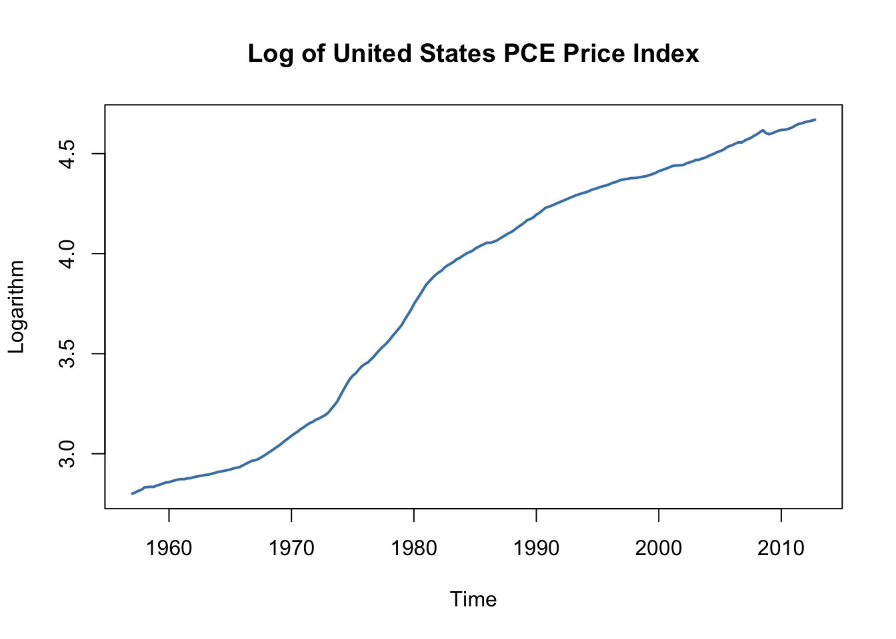

The inflation rate behaves much more erratically than the smooth graph of the logarithm of the PCE price index.

#### The DF-GLS Test for a Unit Root {-}

The DF-GLS test for a unit root has been developed by @elliott1996 and has higher power than the ADF test when the autoregressive root is large but less than one. That is, the DF-GLS has a higher probability of rejecting the false null of a stochastic trend when the sample data stems from a time series that is close to being integrated.

The idea of the DF-GLS test is to test for an autoregressive unit root in the detrended series, whereby GLS estimates of the deterministic components are used to obtain the detrended version of the original series. See Chapter 16.3 of the book for a more detailed explanation of the approach.

A function that performs the DF-GLS test is implemented in the package <tt>urca</tt> (this package is a dependency of the package <tt>vars</tt> so it should be already loaded if <tt>vars</tt> is attached). The function that computes the test statistic is <tt>ur.ers</tt>.


```r
# DF-GLS test for unit root in GDP
summary(ur.ers(log(window(GDP, start = c(1962, 1), end = c(2012, 4))),
        model = "trend", 
        lag.max = 2))
#> 
#> ############################################### 
#> # Elliot, Rothenberg and Stock Unit Root Test # 
#> ############################################### 
#> 
#> Test of type DF-GLS 
#> detrending of series with intercept and trend 
#> 
#> 
#> Call:
#> lm(formula = dfgls.form, data = data.dfgls)
#> 
#> Residuals:
#>       Min        1Q    Median        3Q       Max 
#> -0.025739 -0.004054  0.000017  0.004619  0.033620 
#> 
#> Coefficients:
#>              Estimate Std. Error t value Pr(>|t|)    
#> yd.lag       -0.01213    0.01012  -1.199  0.23207    
#> yd.diff.lag1  0.28583    0.07002   4.082 6.47e-05 ***
#> yd.diff.lag2  0.19320    0.07058   2.737  0.00676 ** 
#> ---
#> Signif. codes:  0 '***' 0.001 '**' 0.01 '*' 0.05 '.' 0.1 ' ' 1
#> 
#> Residual standard error: 0.007807 on 198 degrees of freedom
#> Multiple R-squared:  0.1504,	Adjusted R-squared:  0.1376 
#> F-statistic: 11.69 on 3 and 198 DF,  p-value: 4.392e-07
#> 
#> 
#> Value of test-statistic is: -1.1987 
#> 
#> Critical values of DF-GLS are:
#>                  1pct  5pct 10pct
#> critical values -3.48 -2.89 -2.57
```

The summary of the test shows that the test statistic is about $-1.2$. The $10\%$ critical value for the DF-GLS test is $-2.57$. This is, however, **not** the appropriate critical value for the ADF test when an intercept and a time trend are included in the Dickey-Fuller regression: the asymptotic distributions of both test statistics differ and so do their critical values!

The test is left-sided so we cannot reject the null hypothesis that U.S. inflation is nonstationary, using the DF-GLS test.

## Cointegration


<div class = "keyconcept" id="KC16.5">
<h3 class = "right"> Key Concept <br> 16.5 </h3>          
<h3 class = "left"> Cointegration </h3>
<p>
When $X_t$ and $Y_t$ are $I(1)$ and if there is a $\theta$ such that $Y_t - \theta X_t$ is $I(0)$, $X_t$ and $Y_t$ are cointegrated. Put differently, cointegration of $X_t$ and $Y_t$ means that $X_t$ and $Y_t$ have the same or a common stochastic trend and that this trend can be eliminated by taking a specific difference of the series such that the resulting series is stationary.

<tt>R</tt> functions for cointegration analysis are implemented in the package <tt>urca</tt>. 

</p>
</div>


As an example, reconsider the relation between short- and long-term interest rates by the example of U.S. 3-month treasury bills, U.S. 10-years treasury bonds and the spread in their interest rates which have been introduced in Chapter \@ref(cybtmpi). The next code chunk shows how to reproduce Figure 16.2 of the book.


```r
# reproduce Figure 16.2 of the book

# plot both interest series
plot(merge(as.zoo(TB3MS), as.zoo(TB10YS)), 
     plot.type = "single", 
     lty = c(2, 1),
     lwd = 2,
     xlab = "Date",
     ylab = "Percent per annum",
     ylim = c(-5, 17),
     main = "Interest Rates")

# add the term spread series
lines(as.zoo(TSpread), 
     col = "steelblue",
     lwd = 2,
     xlab = "Date",
     ylab = "Percent per annum",
     main = "Term Spread")

# shade the term spread
polygon(c(time(TB3MS), rev(time(TB3MS))), 
        c(TB10YS, rev(TB3MS)),
        col = alpha("steelblue", alpha = 0.3),
        border = NA)

# add horizontal line at 0
abline(0, 0)

# add a legend
legend("topright", 
       legend = c("TB3MS", "TB10YS", "Term Spread"),
       col = c("black", "black", "steelblue"),
       lwd = c(2, 2, 2),
       lty = c(2, 1, 1))
```


The plot suggests that long-term and short-term interest rates are cointegrated: both interest series seem to have the same long-run behavior. They share a common stochastic trend. The term spread, which is obtained by taking the difference between long-term and short-term interest rates, seems to be stationary. In fact, the expectations theory of the term structure suggests the cointegrating coefficient $\theta$ to be 1. This is consistent with the visual result.

#### Testing for Cointegration {-}

Following Key Concept 16.5, it seems natural to construct a test for cointegration of two series in the following manner: if two series $X_t$ and $Y_t$ are cointegrated, the series obtained by taking the difference $Y_t - \theta X_t$ must be stationary. If the series are not cointegrated, $Y_t - \theta X_t$ is nonstationary. This is an assumption that can be tested using a unit root test. We have to distinguish between two cases:

1. **$\theta$ is known.** 

    Knowledge of $\theta$ enables us to compute differences $z_t = Y_t - \theta X_t$ so that Dickey-Fuller and DF-GLS unit root tests can be applied to $z_t$. For these tests, the critical values are the critical values of the ADF or DF-GLS test.

2. **$\theta$ is unknown.** 

    If $\theta$ is unknown, it must be estimated before the unit root test can be applied. This is done by estimating the regression $$Y_t = \alpha + \theta X_t + z_t$$ using OLS (this is refered to as the first-stage regression). Then, a Dickey-Fuller test is used for testing the hypothesis that $z_t$ is a nonstationary series. This is known as the Engle-Granger Augmented Dickey-Fuller test for cointegration (or *EG-ADF test*) after @engle1987. The critical values for this test are special as the associated null distribution is nonnormal and depends on the number of $I(1)$ variables used as regressors in the first stage regression. You may look them up in Table 16.2 of the book. When there are only two presumably cointegrated variables (and thus a single $I(1)$ variable is used in the first stage OLS regression) the critical values for the levels $10\%$, $5\%$ and $1\%$ are $-3.12$, $-3.41$ and $-3.96$.


#### Application to Interest Rates  {-}

As has been mentioned above, the theory of the term structure suggests that long-term and short-term interest rates are cointegrated with a cointegration coefficient of $\theta = 1$. In the previous section we have seen that there is visual evidence for this conjecture since the spread of 10-year and 3-month interest rates looks stationary.

We continue by using formal tests (the ADF and the DF-GLS test) to see whether the individual interest rate series are integrated and if their difference is stationary (for now, we assume that $\theta = 1$ is known). Both is conveniently done by using the functions <tt>ur.df()</tt> for computation of the ADF test and <tt>ur.ers</tt> for conducting the DF-GLS test. Following the book we use data from 1962:Q1 to 2012:Q4 and employ models that include a drift term. We set the maximum lag order to $6$ and use the $AIC$ for selection of the optimal lag length. 


```r
# test for nonstationarity of 3-month treasury bills using ADF test
ur.df(window(TB3MS, c(1962, 1), c(2012, 4)), 
      lags = 6, 
      selectlags = "AIC", 
      type = "drift")
#> 
#> ############################################################### 
#> # Augmented Dickey-Fuller Test Unit Root / Cointegration Test # 
#> ############################################################### 
#> 
#> The value of the test statistic is: -2.1004 2.2385

# test for nonstationarity of 10-years treasury bonds using ADF test
ur.df(window(TB10YS, c(1962, 1), c(2012, 4)), 
      lags = 6, 
      selectlags = "AIC", 
      type = "drift")
#> 
#> ############################################################### 
#> # Augmented Dickey-Fuller Test Unit Root / Cointegration Test # 
#> ############################################################### 
#> 
#> The value of the test statistic is: -1.0079 0.5501

# test for nonstationarity of 3-month treasury bills using DF-GLS test
ur.ers(window(TB3MS, c(1962, 1), c(2012, 4)),
       model = "constant", 
       lag.max = 6)
#> 
#> ############################################################### 
#> # Elliot, Rothenberg and Stock Unit Root / Cointegration Test # 
#> ############################################################### 
#> 
#> The value of the test statistic is: -1.8042

# test for nonstationarity of 10-years treasury bonds using DF-GLS test
ur.ers(window(TB10YS, c(1962, 1), c(2012, 4)),
       model = "constant", 
       lag.max = 6)
#> 
#> ############################################################### 
#> # Elliot, Rothenberg and Stock Unit Root / Cointegration Test # 
#> ############################################################### 
#> 
#> The value of the test statistic is: -0.942
```

The corresponding $10\%$ critical value for both tests is $-2.57$ so we cannot reject the null hypotheses of nonstationary for either series, even at the $10\%$ level of significance.^[Note: <tt>ur.df()</tt> reports two test statistics when there is a drift in the ADF regression. The first of which (the one we are interested in here) is the $t$-statistic for the test that the coefficient on the first lag of the series is 0. The second one is the $t$-statistic for the hypothesis test that the drift term equals $0$.] We conclude that it is plausible to model both interest rate series as $I(1)$.

Next, we apply the ADF and the DF-GLS test to test for nonstationarity of the term spread series, which means we test for non-cointegration of long- and short-term interest rates.


```r
# test if term spread is stationary (cointegration of interest rates) using ADF
ur.df(window(TB10YS, c(1962, 1), c(2012, 4)) - window(TB3MS, c(1962, 1), c(2012 ,4)), 
      lags = 6, 
      selectlags = "AIC", 
      type = "drift")
#> 
#> ############################################################### 
#> # Augmented Dickey-Fuller Test Unit Root / Cointegration Test # 
#> ############################################################### 
#> 
#> The value of the test statistic is: -3.9308 7.7362

# test if term spread is stationary (cointegration of interest rates) using DF-GLS test
ur.ers(window(TB10YS, c(1962, 1), c(2012, 4)) - window(TB3MS, c(1962, 1), c(2012, 4)),
       model = "constant", 
       lag.max = 6)
#> 
#> ############################################################### 
#> # Elliot, Rothenberg and Stock Unit Root / Cointegration Test # 
#> ############################################################### 
#> 
#> The value of the test statistic is: -3.8576
```

Table \@ref(tab:spreadcoint) summarizes the results.

| Series                        | ADF Test Statistic | DF-GLS Test Statistic |
|-------------------------------|:------------------:|:---------------------:|
| TB3MS                         |       $-2.10$      |        $-1.80$        |
| TB10YS                        |       $-1.01$      |        $-0.94$        |
| TB10YS - TB3MS                |       $-3.93$      |        $-3.86$        |

Table: (\#tab:spreadcoint) ADF and DF-GLS Test Statistics for Interest Rate Series

Both tests reject the hypothesis of nonstationarity of the term spread series at the $1\%$ level of significance, which is strong evidence in favor of the hypothesis that the term spread is stationary, implying cointegration of long- and short-term interest rates.

Since theory suggests that $\theta=1$, there is no need to estimate $\theta$ so it is not necessary to use the EG-ADF test which allows $\theta$ to be unknown. However, since it is instructive to do so, we follow the book and compute this test statistic. The first-stage OLS regression is $$TB10YS_t = \beta_0 + \beta_1 TB3MS_t + z_t.$$


```r
# estimate first-stage regression of EG-ADF test
FS_EGADF <- dynlm(window(TB10YS, c(1962, 1), c(2012, 4)) ~ window(TB3MS, c(1962, 1), c(2012, 4)))
FS_EGADF
#> 
#> Time series regression with "ts" data:
#> Start = 1962(1), End = 2012(4)
#> 
#> Call:
#> dynlm(formula = window(TB10YS, c(1962, 1), c(2012, 4)) ~ window(TB3MS, 
#>     c(1962, 1), c(2012, 4)))
#> 
#> Coefficients:
#>                           (Intercept)  window(TB3MS, c(1962, 1), c(2012, 4))  
#>                                2.4642                                 0.8147
```

Thus we have
\begin{align*}
  \widehat{TB10YS}_t = 2.46 + 0.81 \cdot TB3MS_t,
\end{align*}
where $\widehat{\theta} = 0.81$. Next, we take the residual series $\{\widehat{z_t}\}$ and compute the ADF test statistic.


```r
# compute the residuals
z_hat <- resid(FS_EGADF)

# compute the ADF test statistic
ur.df(z_hat, lags = 6, type = "none", selectlags = "AIC")
#> 
#> ############################################################### 
#> # Augmented Dickey-Fuller Test Unit Root / Cointegration Test # 
#> ############################################################### 
#> 
#> The value of the test statistic is: -3.1935
```

The test statistic is $-3.19$ which is smaller than the $10\%$ critical value but larger than the $5\%$ critical value (see Table 16.2 of the book). Thus, the null hypothesis of no cointegration can be rejected at the $10\%$ level but not at the $5\%$ level. This indicates lower power of the EG-ADF test due to the estimation of $\theta$: when $\theta=1$ is the correct value, we expect the power of the ADF test for a unit root in the residuals series $\widehat{z} = TB10YS - TB3MS$ to be higher than when some estimate $\widehat{\theta}$ is used.

##### A Vector Error Correction Model for $TB10YS_t$ and $TB3MS$ {-}

If two $I(1)$ time series $X_t$ and $Y_t$ are cointegrated, their differences are stationary and can be modeled in a VAR which is augmented by the regressor $Y_{t-1} - \theta X_{t-1}$. This is called a *vector error correction model* (VECM) and $Y_{t} - \theta X_{t}$ is called the *error correction term*. Lagged values of the error correction term are useful for predicting $\Delta X_t$ and/or $\Delta Y_t$.

A VECM can be used to model the two interest rates considered in the previous sections. Following the book we specify the VECM to include two lags of both series as regressors and choose $\theta = 1$, as theory suggests (see above).


```r
TB10YS <- window(TB10YS, c(1962, 1), c(2012 ,4))
TB3MS <- window(TB3MS, c(1962, 1), c(2012, 4))

# set up error correction term
VECM_ECT <- TB10YS - TB3MS

# estimate both equations of the VECM using 'dynlm()'
VECM_EQ1 <- dynlm(d(TB10YS) ~ L(d(TB3MS), 1:2) + L(d(TB10YS), 1:2) + L(VECM_ECT))
VECM_EQ2 <- dynlm(d(TB3MS) ~ L(d(TB3MS), 1:2) + L(d(TB10YS), 1:2) + L(VECM_ECT))

# rename regressors for better readability
names(VECM_EQ1$coefficients) <- c("Intercept", "D_TB3MS_l1", "D_TB3MS_l2",
                                  "D_TB10YS_l1", "D_TB10YS_l2", "ect_l1")
names(VECM_EQ2$coefficients) <- names(VECM_EQ1$coefficients)

# coefficient summaries using HAC standard errors
coeftest(VECM_EQ1, vcov. = NeweyWest(VECM_EQ1, prewhite = F, adjust = T))
#> 
#> t test of coefficients:
#> 
#>               Estimate Std. Error t value Pr(>|t|)   
#> Intercept    0.1227089  0.0551419  2.2253 0.027205 * 
#> D_TB3MS_l1  -0.0016601  0.0727060 -0.0228 0.981807   
#> D_TB3MS_l2  -0.0680845  0.0435059 -1.5649 0.119216   
#> D_TB10YS_l1  0.2264878  0.0957071  2.3665 0.018939 * 
#> D_TB10YS_l2 -0.0734486  0.0703476 -1.0441 0.297740   
#> ect_l1      -0.0878871  0.0285644 -3.0768 0.002393 **
#> ---
#> Signif. codes:  0 '***' 0.001 '**' 0.01 '*' 0.05 '.' 0.1 ' ' 1
coeftest(VECM_EQ2, vcov. = NeweyWest(VECM_EQ2, prewhite = F, adjust = T))
#> 
#> t test of coefficients:
#> 
#>              Estimate Std. Error t value Pr(>|t|)  
#> Intercept   -0.060746   0.107937 -0.5628  0.57422  
#> D_TB3MS_l1   0.240003   0.111611  2.1504  0.03276 *
#> D_TB3MS_l2  -0.155883   0.153845 -1.0132  0.31220  
#> D_TB10YS_l1  0.113740   0.125571  0.9058  0.36617  
#> D_TB10YS_l2 -0.147519   0.112630 -1.3098  0.19182  
#> ect_l1       0.031506   0.050519  0.6236  0.53359  
#> ---
#> Signif. codes:  0 '***' 0.001 '**' 0.01 '*' 0.05 '.' 0.1 ' ' 1
```

Thus the two estimated equations of the VECM are 
\begin{align*}
 \widehat{\Delta TB3MS}_t =& \, -\underset{(0.11)}{0.06} + \underset{(0.11)}{0.24} \Delta TB3MS_{t-1} -\underset{(0.15)}{0.16} \Delta TB3MS_{t-2} \\ &+ \underset{(0.13)}{0.11} \Delta TB10YS_{t-1} -\underset{(0.11)}{0.15} \Delta TB10YS_{t-2} + \underset{(0.05)}{0.03} ECT_{t-1} \\
 \widehat{\Delta TB10YS}_t =& \, \underset{(0.06)}{0.12} -\underset{(0.07)}{0.00} \Delta TB3MS_{t-1} -\underset{(0.04)}{0.07} \Delta TB3MS_{t-2} \\ &+ \underset{(0.10)}{0.23} \Delta TB10YS_{t-1} -\underset{(0.07)}{0.07} \Delta TB10YS_{t-2} -\underset{(0.03)}{0.09} ECT_{t-1}.
\end{align*}

The output produced by <tt>coeftest()</tt> shows that there is little evidence that lagged values of the differenced interest series are useful for prediction. This finding is more pronounced for the equation of the differenced series of the 3-month treasury bill rate, where the error correction term (the lagged term spread) is not significantly different from zero at any common level of significance. However, for the differenced 10-years treasury bonds rate the error correction term is statistically significant at $1\%$ with an estimate of $-0.09$. This can be interpreted as follows: although both interest rates are nonstationary, their conintegrating relationship allows to predict the *change* in the 10-years treasury bonds rate using the VECM. In particular, the negative estimate of the coefficient on the error correction term indicates that there will be a negative change in the next period's 10-years treasury bonds rate when the 10-years treasury bonds rate is unusually high relative to the 3-month treasury bill rate in the current period.

## Volatility Clustering and Autoregressive Conditional Heteroskedasticity

Financial time series often exhibit a behavior that is known as *volatility clustering*: the volatility changes over time and its degree shows a tendency to persist, i.e., there are periods of low volatility and periods where volatility is high. Econometricians call this *autoregressive conditional heteroskedasticity*. Conditional heteroskedasticity is an interesting property because it can be exploited for forecasting the variance of future periods.

As an example, we consider daily changes in the Whilshire 5000 stock index. The data is available for download at the [Federal Reserve Economic Data Base](https://fred.stlouisfed.org/series/WILL5000INDFC). For consistency with the book we download data from 1989-29-12 to 2013-12-31 (choosing this somewhat larger time span is necessary since later on we will be working with daily changes of the series).

The following code chunk shows how to format the data and how to reproduce Figure 16.3 of the book.


```r
# import data on the Wilshire 5000 index
W5000 <- read.csv2("data/Wilshire5000.csv", 
                   stringsAsFactors = F, 
                   header = T, 
                   sep = ",", 
                   na.strings = ".")

# transform the columns
W5000$DATE <- as.Date(W5000$DATE)
W5000$WILL5000INDFC <- as.numeric(W5000$WILL5000INDFC)

# remove NAs
W5000 <- na.omit(W5000)

# compute daily percentage changes
W5000_PC <- data.frame("Date" = W5000$DATE, 
                       "Value" = as.numeric(Delt(W5000$WILL5000INDFC) * 100))
W5000_PC <- na.omit(W5000_PC)
```


```r
# plot percentage changes
plot(W5000_PC, 
     ylab = "Percent", 
     main = "Daily Percentage Changes",
     type=  "l", 
     col =  "steelblue", 
     lwd =  0.5)

# add horizontal line at y = 0
abline(0, 0)
```

<div class="figure" style="text-align: center">

<p class="caption">(\#fig:pcw5000)Daily Percentage Returns in the Wilshire 5000 Index</p>
</div>

The series of daily percentage changes in the Wilshire index seems to randomly fluctuate around zero, meaning there is little autocorrelation. This is confirmed by a plot of the sample autocorrelation function.


```r
# plot sample autocorrelation of daily percentage changes
acf(W5000_PC$Value, main = "Wilshire 5000 Series")
```

<div class="figure" style="text-align: center">

<p class="caption">(\#fig:acfw5000)Autocorrelation in Daily Price Changes of W5000 Index</p>
</div>

In Figure \@ref(fig:acfw5000) we see that autocorrelations are rather weak so that it is difficult to predict future outcomes using, e.g., an AR model. 

However, there is visual evidence in \@ref(fig:pcw5000) that the series of returns exhibits conditional heteroskedasticity since we observe volatility clustering. For some applications it is useful to measure and forecast these patterns. This can be done using models which assume that the volatility can be described by an autoregressive process.

### ARCH and GARCH Models {-}

Consider $$Y_t = \beta_0 + \beta_1 Y_{t-1} + \gamma_1 X_{t-1} + u_t,$$ an ADL($1$,$1$) regression model. The econometrician Robert @engle1982 proposed to model $\sigma^2_t = Var(u_t | u_{t-1},u_{t-2},\ldots)$, the conditional variance of the error $u_t$ given its past, by an order $p$ distributed lag model,
\begin{align}
 \sigma^2_t = \alpha_0 + \alpha_1 u_{t-1}^2 + \alpha_2 u_{t-2}^2 + \dots + \alpha_p u_{t-p}^2, (\#eq:archmodel)
\end{align}
called the *autoregressive conditional heteroskedasticity* (ARCH) model of order $p$, or short ARCH($p$).^[Although we introduce the ARCH model as a component in an ADL($1$,$1$) model, it can be used for modelling the conditional zero-mean error term of any time series model.] We assume $\alpha_0>0$ and $\alpha_1,\ldots,\alpha_p\geq0$ to ensure a positive variance $\sigma_t^2>0$. The general idea is apparent from the model structure: positive coefficients $\alpha_0,\alpha_1,\dots,\alpha_p$ imply that recent large squared errors lead to a large variance, and thus large squared errors, in the current period.

The generalized ARCH (GARCH) model, developed by Tim @bollerslev1986, is an extension of the ARCH model, where $\sigma^2_t$ is allowed to depend on its own lags and lags of the squared error term. The GARCH($p$,$q$) model is given by
\begin{align}
 \sigma^2_t = \alpha_0 + \alpha_1 u_{t-1}^2 + \alpha_2 u_{t-2}^2 + \dots + \alpha_p u_{t-p}^2 + \phi_1 \sigma^2_{t-1} + \dots + \phi_p \sigma^2_{t-q}. (\#eq:garchmodel)
\end{align}
The GARCH model is an ADL($p$,$q$) model and thus can provide more parsimonious parameterizations than the ARCH model (see the discussion in Appendix 15.2 of the book).

### Application to Stock Price Volatility {-}

Maximum likelihood estimates of ARCH and GARCH models are efficient and have normal distributions in large samples, such that the usual methods for conducting inference about the unknown parameters can be applied. The <tt>R</tt> package <tt>fGarch</tt> is a collection of functions for analyzing and modelling the heteroskedastic behavior in time series models. The following application reproduces the results presented in Chapter 16.5 of the book by means of the function <tt>garchFit()</tt>. This function is somewhat sophisticated. It allows for different specifications of the optimization procedure, different error distributions and much more (use `?GarchFit` for a detailed description of the arguments). In particular, the reported standard errors by <tt>garchFit()</tt> are robust.

The GARCH($1$,$1$) model of daily changes in the Wilshire 5000 index we estimate is given by
\begin{align}
  R_t =& \, \beta_0 + u_t \ , \ u_t \sim \mathcal{N}(0,\sigma^2_t), \\
  \sigma^2_t =& \, \alpha_0 + \alpha_1 u_{t-1}^2 + \phi_1 \sigma_{t-1}^2 (\#eq:w5000g11)
\end{align}
where $R_t$ is the percentage change in period $t$. $\beta_0$, $\alpha_0$, $\alpha_1$ and $\phi_1$ are unknown coefficients and $u_t$ is an error term with conditional mean zero. We do not include any lagged predictors in the equation of $R_t$ because the daily changes in the Wilshire 5000 index reflect daily stock returns which are essentially unpredictable. Note that $u_t$ is assumed to be normally distributed and the variance $\sigma^2_t$ depends on $t$ as it follows the GARCH($1$,$1$) recursion \@ref(eq:w5000g11).

It is straightforward to estimate this model using <tt>garchFit()</tt>.


```r
# estimate GARCH(1,1) model of daily percentage changes
GARCH_Wilshire <- garchFit(data = W5000_PC$Value, trace = F)
```

We obtain
\begin{align}
  \widehat{R}_t =& \, \underset{(0.010)}{0.068}, (\#eq:w5000g11est1) \\
  \widehat{\sigma}^2_t =& \, \underset{(0.002)}{0.011} + \underset{(0.007)}{0.081} u_{t-1}^2 + \underset{(0.008)}{0.909} \sigma_{t-1}^2, (\#eq:w5000g11est2)
\end{align}
so the coefficients on $u_{t-1}^2$ and $\sigma^2_{t-1}$ are statistically significant at any common level of significance. One can show that the persistence of movements in $\sigma^2_t$ is determined by the sum of both coefficients, which is $0.99$ here. This indicates that movements in the conditional variance are highly persistent, implying long-lasting periods of high volatility which is consistent with the visual evidence for volatility clustering presented above.  

The estimated conditional variance $\widehat{\sigma}^2_t$ can be computed by plugging the residuals from \@ref(eq:w5000g11est1) into equation \@ref(eq:w5000g11est2). This is performed automatically by <tt>garchFit()</tt>, so to obtain the estimated conditional standard deviations $\widehat{\sigma}_t$ we only have to read out the values from <tt>GARCH_Wilshire</tt> by appending <tt>\@sigma.t</tt>.  

Using the $\widehat{\sigma}_t$ we plot bands of $\pm$ one conditional standard deviation along with deviations of the series of daily percentage changes in the Wilshire 5000 index from its mean. The following code chunk reproduces Figure 16.4 of the book.


```r
# compute deviations of the percentage changes from their mean
dev_mean_W5000_PC <- W5000_PC$Value - GARCH_Wilshire@fit$coef[1]

# plot deviation of percentage changes from mean
plot(W5000_PC$Date, dev_mean_W5000_PC, 
     type = "l", 
     col = "steelblue",
     ylab = "Percent", 
     xlab = "Date",
     main = "Estimated Bands of +- One Conditional Standard Deviation",
     lwd = 0.2)

# add horizontal line at y = 0
abline(0, 0)

# add GARCH(1,1) confidence bands (one standard deviation) to the plot
lines(W5000_PC$Date, 
      GARCH_Wilshire@fit$coef[1] + GARCH_Wilshire@sigma.t, 
      col = "darkred", 
      lwd = 0.5)

lines(W5000_PC$Date, 
      GARCH_Wilshire@fit$coef[1] - GARCH_Wilshire@sigma.t, 
      col = "darkred", 
      lwd = 0.5)
```

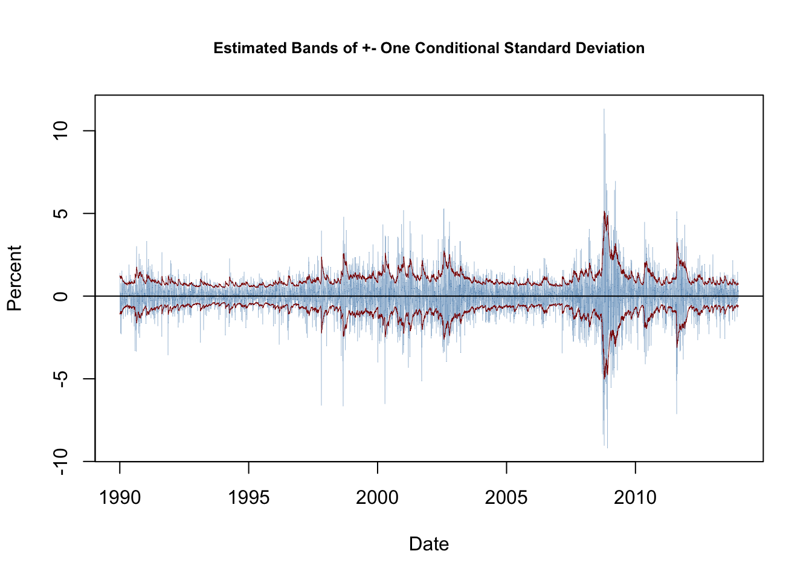

The bands of the estimated conditional standard deviations track the observed heteroskedasticity in the series of daily changes of the Wilshire 5000 index quite well. This is useful for quantifying the time-varying volatility and the resulting risk for investors holding stocks summarized by the index. Furthermore, this GARCH model may also be used to produce forecast intervals whose widths depend on the volatility of the most recent periods.

### Summary {-} 

+ We have discussed how vector autoregressions are conveniently estimated and used for forecasting in <tt>R</tt> by means of functions from the <tt>vars</tt> package. 

+ The package <tt>urca</tt> supplies advanced methods for unit root and cointegration analysis like the DF-GLS and the EG-ADF tests. In an application we have found evidence that 3-months and 10-year interest rates have a common stochastic trend (that is, they are cointegrated) and thus can be modeled using a vector error correction model. 

+ Furthermore, we have introduced the concept of volatility clustering and demonstrated how the function <tt>garchFit()</tt> from the package <tt>fGarch</tt> can be employed to estimate a GARCH($1$,$1$) model of the conditional heteroskedasticity inherent to returns of the Wilshire 5000 stock index.

<!--chapter:end:16-ch16.Rmd-->

# References {-}


<!--chapter:end:references.Rmd-->

